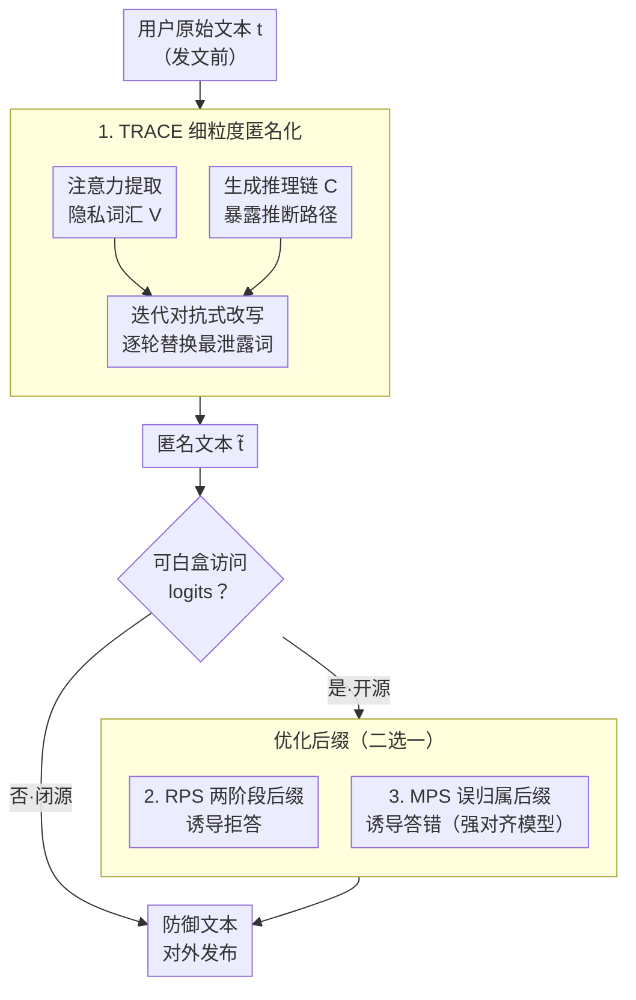

# Stop Tracking Me! Proactive Defense Against Attribute Inference Attack in LLMs

**会议**: ICLR 2026  
**arXiv**: [2602.11528](https://arxiv.org/abs/2602.11528)  
**代码**: [https://github.com/Jasper-Yan/TRACE-RPS](https://github.com/Jasper-Yan/TRACE-RPS)  
**领域**: LLM 安全  
**关键词**: 属性推断攻击, 隐私保护, LLM安全, 注意力匿名化, 优化防御

## 一句话总结
TRACE-RPS 提出统一防御框架应对 LLM 属性推断攻击：TRACE 通过注意力+推理链精准定位隐私泄露文本元素做细粒度匿名化，RPS 通过轻量后缀优化诱导模型拒绝推断，将属性推断准确率从约 50% 降至 5% 以下。

## 研究背景与动机

**领域现状**：LLM 可从用户在线分享的无害文本中推断隐私属性（年龄、位置、性别等），实现大规模自动化隐私侵犯。这种攻击不触发安全过滤器——因为提示本身完全是良性的。

**现有痛点**：
   - 现有匿名化方法粒度太粗（文本级而非词级），无法精准定位泄露隐私的特定文本元素
   - 匿名化的根本局限：即使修改文本隐藏敏感线索，模型的推理能力仍可从修改后的文本推断属性
   - 对于类别有限的属性（如性别/收入水平），匿名化文本仍然提供可解析的数据点

**核心矛盾**：LLM 的属性推断来自**推理能力**而非记忆——不能简单削弱推理能力（否则破坏通用性），也不能仅靠匿名化（推理仍可绕过）

**切入角度**：两步防御——(1) 精准匿名化减少泄露信息 + (2) 优化后缀诱导模型拒答从根本上阻止推断

**核心 idea**：匿名化减少信息量 + 拒绝优化阻止推断行为 = 双保险防御。

## 方法详解

### 整体框架
攻击者把用户的一段在线分享文本喂给 LLM，让它推断作者的隐私属性（年龄、位置、性别等），而这段文本本身完全良性、不会触发任何安全过滤。TRACE-RPS 是一套**用户侧、发文前**的防御：先用 TRACE 把文本里真正泄露隐私的词逐个找出来并替换，压低可被推断的信息量，得到匿名文本；如果用户能白盒访问模型的 logits（开源模型），再追加一道优化后缀——默认用 RPS 诱导推断模型对属性问题"拒绝回答"，遇到 Qwen 这类劝不退的强对齐模型则换成 MPS、诱导它把属性答错。前者削信息、后者堵推断，组合后即便一道被绕过、另一道仍在；闭源模型（如 GPT-4o）拿不到 logits，就只跑 TRACE。

### 关键设计

**1. TRACE：用注意力和推理链定位"隐式"泄露词，做词级匿名化**

匿名化的老问题是粒度太粗——规则方法（如 Azure PII）只能匹配显式 PII，整段或整句地涂黑，既漏掉隐式线索（如某个方言用词暗示了地理位置），又破坏可读性。TRACE 把"哪些词在泄露隐私"这件事交给推断模型自己回答，靠两路细粒度信号驱动一个**迭代对抗式**改写循环。第一路是注意力提取：让一个预训练因果语言模型模拟攻击、读取它推断属性时最后一层、最后一个 token 的注意力向量 $\mathbf{a}=(a_1,\dots,a_{|t|})$，把同属一个词的 token 注意力相加得到词级重要度 $\alpha(w)=\sum_{z=i}^{j} a_z$，取 Top-K 组成隐私词汇表 $V=\operatorname{TopK}(\{(w,\alpha(w))\})$。第二路是推理链生成：让模型在给出属性预测的同时输出一条 step-by-step 解释，把"从哪个词推到哪个属性"的路径 $C$ 显式暴露出来。匿名模型 $M_{\text{anon}}$ 同时拿到 $V$ 和 $C$，只改这些关键区段、生成匿名文本 $\tilde t$，再喂回攻击模型重判，如此逐轮迭代直到属性推不出来。这样定位到的是模型**实际依赖**的线索，比规则匹配精准得多，也只动真正泄露的少数词、保住文本语义。

**2. RPS：把 jailbreaking 的后缀优化反向用来诱导模型拒答**

匿名化只是减少信息，并不能阻止模型"硬推"——只要文本还剩可解析的数据点（尤其是性别、收入这类类别有限的属性），推理能力仍可能绕过。RPS（拒绝导向扰动搜索）从行为层面补这道缺口：给文本追加一段优化后缀 $s$，让推断模型对属性问题先吐出 "I"、再续上拒绝词，形成 "I cannot answer" 这类拒答。打分函数把这两步拆开看：

$$J(s)=\log p(y_1=\text{"I"}\mid P(\tilde t))+\beta\cdot\log p\big(y_2\in\mathcal{R}\mid P(\tilde t),\,y_1=\text{"I"}\big)$$

其中 $\mathcal{R}$ 是一组拒绝词。优化是**两阶段随机搜索**、完全不算梯度：阶段一"首 token 锚定"只盯 $J_1=\log p(y_1=\text{"I"})$，从当前最优后缀的随机位置起替换 $n$ 个 token、保留得分更高者，直到第一个 token 稳定为 "I"；阶段二"拒绝 token 塑形"再用同样的随机替换去优化第二个 token 落进 $\mathcal{R}$，按完整 $J(s)$ 选后缀。每个候选只需解码 1–2 个 token，所以比 AutoDAN 这种每轮要生成长序列的方法便宜得多。这条技术路线和 GCG 等 jailbreaking 攻击同源，只是攻击用它绕过拒绝、RPS 用它**诱导**拒绝——一次巧妙的逆向应用。代价是需要白盒 logits 访问，因此 RPS 只对开源模型可用；优化出的后缀还能迁移到新文本，直接生效或作为强初始化几步收敛。

**3. MPS：对"劝不退"的强对齐模型，改成诱导它答错**

RPS 依赖"模型愿意被劝退"，但像 Qwen、GPT-4o 这类高度服从指令的模型常常无视拒绝、坚持给出属性预测，RPS 在它们身上失效。MPS（误归属扰动搜索）作为备选改换思路：不再追求拒绝，而是优化后缀把模型的预测从真值 $y_u^{(a)}$ **带偏到一个指定的错误值** $\bar y_u^{(a)}$（如把 "Female" 翻成 "Male"），目标是 $s^*=\arg\max_s \log p(y=\bar y_u^{(a)}\mid P(\tilde t))$。用一个被刻意带偏的答案替代真实推断，同样达到保护隐私的效果，且不改原文语义。

### 损失函数 / 训练策略
- RPS 打分 $J(s)=\log p(y_1=\text{"I"})+\beta\log p(y_2\in\mathcal{R})$，固定原文 $t$、只搜后缀 $s$；两阶段随机搜索（首 token 锚定 → 拒绝 token 塑形），各设对数概率阈值 $\tau_1,\tau_2$ 与最大迭代数提前停。
- MPS 改为 $\max_s \log p(y=\bar y_u^{(a)})$，把属性带向指定错误值。
- 两者都只解码 1–2 个 token、不算梯度，但需开源模型的 logits 访问；闭源模型仅用 TRACE。

## 实验关键数据

### 主实验（多模型推断准确率↓）

| 方法 | Llama3 | Qwen2.5 | DeepSeek-R1 | GPT-4o |
|------|--------|---------|------------|--------|
| 无防御 | ~50% | ~50% | ~50% | ~50% |
| Azure PII | ~40% | ~40% | ~40% | ~40% |
| Staab et al. (匿名化) | ~25% | ~25% | ~25% | ~25% |
| TRACE | ~15% | ~15% | ~15% | ~20% |
| **TRACE-RPS** | **<5%** | **<5%** | **<5%** | N/A (闭源) |

### 消融实验

| 配置 | 推断准确率↓ |
|------|----------|
| 仅 TRACE | ~15% |
| 仅 RPS | ~10% |
| **TRACE + RPS** | **<5%** |

### 关键发现
- **推断准确率从 50% 降至 <5%**：TRACE-RPS 在开源模型上几乎完全阻止属性推断
- **跨模型迁移**：在一个模型上优化的后缀对其他模型也有效
- **提示变换鲁棒**：即使攻击者改变推断提示格式，防御仍然有效
- **效用-隐私权衡合理**：TRACE 修改的文本仍保持语义完整性和可读性
- **DeepSeek-R1 防御有效**：即使是推理能力极强的模型也能被有效防御

## 亮点与洞察
- **"匿名化+拒绝诱导"的双保险设计**极为实用——匿名化减少信息暴露面，拒绝优化阻止推断行为。两条防线独立有效，组合后效果更强。
- **将 jailbreaking 的优化技术反向用于隐私防御**是巧妙的逆向应用——GCG 等方法用于攻击，RPS 用相同技术路线做防御。
- **注意力引导的隐私词汇提取**比规则方法高明得多——能发现人类难以预见的隐式隐私泄露路径。

## 局限与展望
- RPS 需要白盒 logits 访问——对闭源模型（GPT-4o）只能用 TRACE
- 优化后缀可能被检测为异常文本（虽然论文称影响小）
- 仅评估文本属性推断——图像+文本多模态推断未考虑
- MPS（误归属）策略可能在某些场景下引入新的伦理问题
- 后缀优化的计算成本（虽然轻量但仍需多次前向传播）

## 相关工作与启发
- **vs Azure PII Detection**: 仅规则匹配显式 PII，无法发现隐式泄露；TRACE 用注意力和推理链定位隐式泄露
- **vs Staab et al. (2025) 匿名化**: 粗粒度文本级匿名化；TRACE 在词级精准操作
- **vs GCG/Jailbreaking**: 同一优化技术，但 RPS 反向用于诱导拒绝而非绕过拒绝

## 评分
- 新颖性: ⭐⭐⭐⭐ 匿名化+拒绝优化的统一框架有创意，逆向 jailbreaking 技术巧妙
- 实验充分度: ⭐⭐⭐⭐⭐ 7个LLM、跨模型迁移、提示鲁棒性、效用-隐私权衡全面
- 写作质量: ⭐⭐⭐⭐ 问题形式化清晰，攻防关系表述准确
- 价值: ⭐⭐⭐⭐⭐ 属性推断是现实的隐私威胁，TRACE-RPS 提供了可部署的防御方案

<!-- RELATED:START -->

## 相关论文

- [\[ACL 2025\] Defense Against Prompt Injection Attack by Leveraging Attack Techniques](../../ACL2025/llm_safety/defense_prompt_injection.md)
- [\[ICLR 2026\] Membership Inference Attacks Against Fine-tuned Diffusion Language Models (SAMA)](membership_inference_attacks_against_fine-tuned_diffusion_language_models.md)
- [\[ICLR 2026\] VEAttack: Downstream-Agnostic Vision Encoder Attack Against Large Vision Language Models](veattack_downstream-agnostic_vision_encoder_attack_against_large_vision_language.md)
- [\[ACL 2026\] DualGuard: Dual-stream Large Language Model Watermarking Defense against Paraphrase and Spoofing Attack](../../ACL2026/llm_safety/dualguard_dual-stream_large_language_model_watermarking_defense_against_paraphra.md)
- [\[AAAI 2026\] Multi-Faceted Attack: Exposing Cross-Model Vulnerabilities in Defense-Equipped Vision-Language Models](../../AAAI2026/llm_safety/multi-faceted_attack_exposing_cross-model_vulnerabilities_in_defense-equipped_vi.md)

<!-- RELATED:END -->
