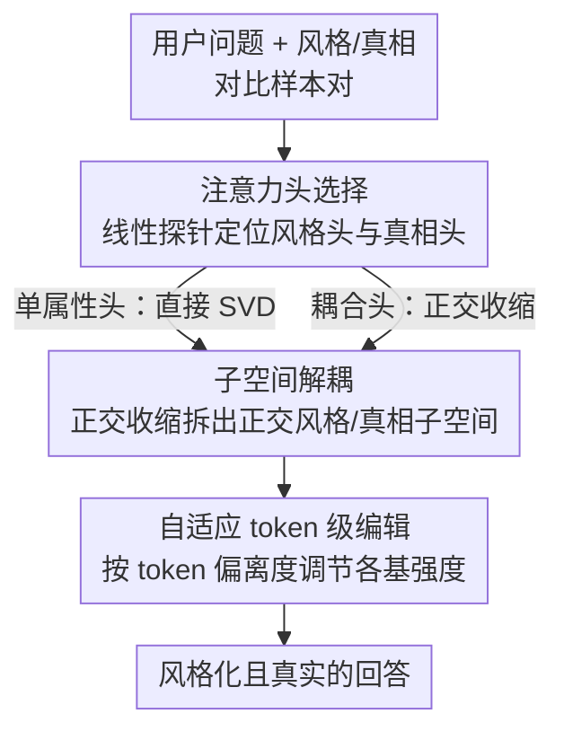

# StyliTruth: Unlocking Stylized yet Truthful LLM Generation via Disentangled Steering

**会议**: ICLR 2026  
**OpenReview**: [https://openreview.net/forum?id=GECUTH82ze](https://openreview.net/forum?id=GECUTH82ze)  
**代码**: https://github.com/Starrylay/StyliTruth  
**领域**: LLM安全 / 表征编辑 / 可控生成  
**关键词**: 激活编辑、风格迁移、真实性、子空间解耦、推理时干预

## 一句话总结
本文发现给 LLM 注入风格的表征编辑会顺带破坏其真实性（称为「风格化诱导的真实性崩塌」），根因是某些注意力头里风格方向与真相方向纠缠在一起；StyliTruth 用正交收缩把两者拆成互相正交的子空间，再在各自子空间里做自适应 token 级编辑，从而在保持风格的同时守住答案的正确性。

## 研究背景与动机

**领域现状**：让 LLM 输出带特定风格（莎士比亚腔、红楼梦腔）的可控生成，主流轻量做法是「表征编辑」（representation editing / activation steering）——不微调参数，只在推理时往隐藏激活里加一个风格方向的 steering 向量，即 $\tilde{x} = \text{MLP}(\text{MHA}_e(x))$，其中编辑后的注意力头激活为 $\text{Attn}_h(x) + \lambda\delta^{(h,l)}$。这类方法因为 training-free、即插即用而广受欢迎。

**现有痛点**：作者观察到一个被忽视的副作用——给模型套上鲜明风格后，它的回答经常从「正确」变成「胡说」。比如把模型编辑成莎士比亚风格后问「哪些鸟能像人一样算数」，本应回答「鸟并不具备数字推理能力」，但编辑后的模型却生成「有记载鹦鹉、喜鹊、金丝雀在此事上颇有造诣」这种又押韵又错误的答案。作者把这个现象命名为 **stylization-induced truthfulness collapse（风格化诱导的真实性崩塌）**。

**核心矛盾**：施加越鲜明的风格，真实性掉得越狠——风格保真与事实正确之间存在内在 trade-off。现有方法「天真地」直接注入风格信号，没意识到它会污染模型的核心真实性表征。

**切入角度**：作者去分析激活差异，得到两个关键观察：① 不同注意力头之间的风格方向与真相方向近似正交（余弦相似度接近 0）；② **存在一小撮注意力头，同时对风格敏感又对真实性关键**——在这些头里，风格方向与真相方向强烈纠缠（Welch t 检验 $t=2.71$，$p=0.01$，Cohen's $d=0.64$ 中到大效应量），而其余头里纠缠很弱。正是这撮「纠缠头」让风格编辑顺带扰动了真相方向。

**核心 idea**：与其在原始激活空间里硬注入风格（会牵连真相），不如先把风格相关子空间和真相相关子空间**显式解耦成互相正交**的两块，再在各自子空间里独立、互不干扰地做编辑。

## 方法详解

### 整体框架

StyliTruth 是一个 training-free 的推理时编辑框架，整条 pipeline 分四个阶段：先为「风格」和「真相」两个属性各构造一批对比样本对（正例 vs 负例，语义相同只差属性）；再用线性探针扫描所有注意力头，挑出最能区分风格、最能区分真相的两组头；接着对选中的头做子空间解耦——对只属于单一属性的头直接 SVD 取主方向，对「风格-真相耦合头」则用正交收缩（orthogonal deflation）把真相子空间投影到风格子空间的正交补上，强制两组基正交；最后在每个子空间里用自适应 token 级强度系数构造 steering 向量，按每个 token 对风格/真相的偏离程度动态调节编辑力度，输出既有风格又真实的回答。

### 关键设计

**1. 注意力头选择：用线性探针把「管风格的头」和「管真相的头」分别定位出来**

直接对全模型激活做编辑是污染源头，所以第一步要把编辑范围收窄到真正相关的头。作者先构造两类对比样本：风格样本对 $D_s = \{Q_i, R^-_{s,i}, R^+_{s,i}\}$（同一问题、同一语义，$R^+$ 是目标风格回答、$R^-$ 是普通风格回答），真相样本对 $D_t = \{Q_i, R^-_{t,i}, R^+_{t,i}\}$（同风格同长度，只差真实性）。然后给每个头训练一个线性探针 $p(a^{(h,l)}) = \text{Sigmoid}(\langle\theta, a^{(h,l)}\rangle)$，输入「问题+回答」末 token 的激活、标签是正例(1)/负例(0)，按验证集准确率把 top-$H$ 头分别选为风格相关头 $H_s$ 和真相相关头 $H_t$。两组头的交集 $H_s \cap H_t$ 就是第 3 节里那撮「Relevant Heads」——既对风格敏感又对真相关键的耦合头，正是后面要重点解耦的对象。探针准确率热图还揭示了一个规律：风格敏感性分散在各层（早层管 token 间关联、晚层管解码），而真相敏感性集中在中间层，且每层只有少数头强敏感，说明属性编码是头级别局部化的。

**2. 子空间解耦：用正交收缩强制风格基与真相基互相正交**

选好头之后要回答：怎么让风格编辑不碰到真相？作者分两种情况处理。对**只属于单一属性的头**（$h \in H_s\setminus H_t$ 或 $h \in H_t\setminus H_s$），因为不同头的高维激活差异本就近似正交，直接对该头的激活差矩阵 $\Delta A^{(h,l)}_s = [\delta a^{(h,l)}_{s,1}, \dots]^\top$ 做 SVD，取前 $K$ 个最大奇异值对应的右奇异向量 $v^{(h,l)}_{s,i}$ 作为子空间正交基（既抓住最有代表性的风格特征又滤掉噪声）。

对**风格-真相耦合头**（$h \in H_s\cap H_t$），两个属性的激活并不正交，直接各做 SVD 会互相串扰，所以作者提出正交收缩：先取风格子空间的前 $K$ 个右奇异向量构成 $V^{(h,l)}_{s,K}$，构造它的正交补投影算子

$$P^\perp_s = I_d - V^{(h,l)}_{s,K}\big(V^{(h,l)}_{s,K}\big)^\top,$$

再把真相激活差投影上去 $\widetilde{\Delta A}^{(h,l)}_t = \Delta A^{(h,l)}_t P^\perp_s$，对投影后的结果重新 SVD 得到真相基 $\tilde{v}^{(h,l)}_{t,i}$，它天然满足 $\tilde{V}^{(h,l)\top}_{t,K} V^{(h,l)}_{s,K} = 0$，即真相子空间与风格子空间正交。这样在耦合头里编辑风格时，分量落在风格子空间，完全不会投影到真相方向上。作者还从理论上证明这种收缩带来的信息损失极小：相对误差 $\delta = \|\Delta A_t - \widetilde{\Delta A}_t\|_F^2 / \|\Delta A_t\|_F^2 \approx K/d \ll 1$（因 $K \ll d$），可以放心忽略。最终 steering 向量在单属性头上是 $\tilde{a} = a + \sum_i \lambda_{s,i} v_{s,i}$（或真相版），在耦合头上是风格基 + 解耦后真相基两项叠加。

**3. 自适应 token 级编辑：让每个 token 的编辑力度随它对风格/真相的偏离程度自动调**

对所有 token 用同一个固定编辑强度是次优的——有的 token 本就很「风格」不需要使劲推、有的离目标风格还很远需要重推。作者把每个基方向的编辑强度拆成三个因子：$\lambda^{(h,l)}_{s,i} = g^{(h,l)}_{s,i}\,\kappa^{(h,l)}_{s,i}\,\gamma_s$。其中**全局强度** $g^{(h,l)}_{s,i} = \sigma^{(h,l)}_{s,i}/\sqrt{d}$ 由奇异值决定，刻画该基方向上正负样本的整体差异幅度；**自适应缩放因子** $\kappa^{(h,l)}_{s,i}$ 按 token 计算，把「正例均值激活 $\bar{a}^{(h,l)+}$ 与当前激活之差」投影到风格基上

$$\kappa^{(h,l)}_{s,i} = \frac{\big(\bar{a}^{(h,l)+} - a^{(h,l)}\big) v^{(h,l)\top}_{s,i}}{\|v^{(h,l)}_{s,i}\|^2},$$

量化当前 token 偏离目标风格的程度，偏得越远推得越狠；超参 $\gamma_s$ 则给整体幅度封顶。真相子空间用对称的公式。这样编辑既精准又有弹性，避免了对每个 token 无差别扰动。

### 损失函数 / 训练策略
StyliTruth 不更新任何模型参数，唯一需要「训练」的是各注意力头上的线性探针（二分类器，按 4:1 划分训练/验证集），用来排序选头。子空间基由 SVD 闭式求得，编辑强度由公式实时算出，整体是纯推理时干预。关键超参是选头数 $H$、子空间维度 $K$、以及风格/真相两路的强度封顶 $\gamma_s, \gamma_t$。

## 实验关键数据

实验在两种风格语料（莎士比亚 / 红楼梦，对应英文 / 中文）和两个真实性 benchmark（TruthfulQA 及其中文翻译）上进行，backbone 为 Qwen-1.5-14B-Chat。评价分两组指标：风格侧 SI（风格强度）、SP（语义保持）、FS（流畅度），合成 OA = SI×SP×FS；真实性侧 Truth、Info，合成 TI = Truth∩Info（既真实又有信息量的比例）；最后用 **S-TI（OA 与 TI 的调和平均）** 综合衡量风格与真实性的平衡。

### 主实验

| 数据集/风格 | 方法 | OA (↑) | TI (↑) | S-TI (↑) |
|------|------|------|------|------|
| DRC→TruthfulQA(ZH) | ITI | 0.0772 | 0.0972 | 0.0861 |
| DRC→TruthfulQA(ZH) | CAA | 0.1000 | 0.2917 | 0.1489 |
| DRC→TruthfulQA(ZH) | DRESS | 0.1047 | 0.3056 | 0.1560 |
| DRC→TruthfulQA(ZH) | Vector prompt | 0.1528 | 0.2222 | 0.1811 |
| DRC→TruthfulQA(ZH) | **StyliTruth** | **0.1550** | **0.5000** | **0.2366** |
| Shakespeare→TruthfulQA | ITI | 0.1880 | 0.1944 | 0.1912 |
| Shakespeare→TruthfulQA | DRESS | 0.2037 | 0.3333 | 0.2529 |
| Shakespeare→TruthfulQA | **StyliTruth** | **0.2191** | **0.3889** | **0.2803** |

在 DRC（红楼梦）风格上，StyliTruth 的综合 S-TI 比最强 baseline 提升 30.65%；莎士比亚风格上提升 10.83%。最能说明问题的是 TI 列：多数 baseline（除 LM-Steer）能拿到不错的风格分（OA 相当），但真实性 TI 惨跌（如 ITI 仅 0.0972），正是「风格化诱导真实性崩塌」的写照；而 StyliTruth 在保住风格的同时把 TI 拉到 0.5000，证明它确实能两头兼顾。另一端的 LM-Steer 真实性看着高，其实是风格根本没推上去（OA 极低），属于「没崩塌是因为没风格」，S-TI 同样低。

### 消融实验

| 配置 | OA | TI | S-TI | 说明 |
|------|------|------|------|------|
| w/o ATE | 0.1079 | 0.2017 | 0.1575 | 去掉自适应 token 级编辑，用固定强度 |
| w/o SD | 0.1095 | 0.3194 | 0.1632 | 去掉子空间解耦 |
| StyliTruth | 0.1550 | 0.5000 | 0.2366 | 完整模型 |

### 关键发现
- **子空间解耦（SD）贡献最大**：去掉后风格和真实性双双大跌（S-TI 0.2366→0.1632），证明把风格/真相子空间分开、阻断 steering 向量互相干扰是核心。
- **自适应 token 级编辑（ATE）同样关键**：去掉后掉到 S-TI 0.1575，固定强度会对每个 token 无差别扰动。
- **子空间确实存在且可分**：把激活投影到风格子空间，风格化与普通回答的分布显著分离；投到「风格无关子空间」则几乎重合。真相子空间同理。
- **解耦真的把风格从真相里剥掉了**：耦合子空间里风格化/普通激活分布仍可分（说明风格还在扰动真相），解耦后两者大幅重叠（说明风格编辑方向已与真相子空间近似正交）。
- **编辑强度有甜区**：真相强度太小不足以补偿崩塌、太大又会损伤模型固有生成能力，S-TI 随真相强度先升后降；选头数过多会引入无关头反而掉点。

## 亮点与洞察
- **把一个含糊的副作用做成了可测量、可定位、可解的问题**：先命名「风格化诱导真实性崩塌」，再用激活差余弦相似度 + t 检验把根因锁定到「耦合头里风格-真相纠缠」，最后用正交收缩对症下药——从现象到机制到方案一条线，非常完整。
- **正交收缩（orthogonal deflation）是可复用的 trick**：当两个属性方向在某些维度纠缠时，用正交补投影算子 $P^\perp$ 强制后者落在前者的正交补里，再配上 $K/d$ 的信息损失上界保证基本无损——这套思路可迁移到任何「想同时编辑两个相关属性但不想互相串扰」的 activation steering 场景。
- **token 级自适应强度**把「该 token 离目标多远」直接写进编辑系数，比全局固定强度更符合「按需干预」的直觉，也是它真实性不崩的重要原因。

## 局限与展望
- 正交收缩理论上有信息损失（虽证明 $\approx K/d$ 很小），在更高风格强度或更复杂属性下是否仍可忽略有待验证。
- 实验主要在 Qwen-1.5-14B-Chat 单 backbone、两种风格两个 benchmark 上，跨模型规模、跨更多风格/语言的泛化性还需补充。
- 方法依赖「线性表征假设」和「不同头近似正交」这两个前提；若某模型激活高度非线性纠缠，探针选头和 SVD 解耦可能失效。
- 同时编辑两个以上属性（如风格+真相+情感）时，正交收缩如何级联、信息损失如何累积，是自然的延伸方向。

## 相关工作与启发
- **vs DRESS**：DRESS 也做风格子空间解耦以自适应风格化，但它只关心风格、不研究风格控制如何干扰真实性，也不构造真相子空间；StyliTruth 的核心增量正是显式建出真相子空间并强制它与风格子空间正交，从而专门治理真实性崩塌。
- **vs ITI / CAA**：ITI、CAA 这类经典表征编辑直接从正负样本激活差构造 steering 向量、整体注入，没有区分头、也没有解耦属性，因此风格一推上去真实性就崩（实验里 TI 极低）。
- **vs Truth Forest / MAT-Steer**：它们用多向量提升表达力，但同样没研究风格与真相的交叉干扰，也忽略了 token 级别的属性重要性差异——StyliTruth 在「子空间正交解耦 + token 级自适应」两点上都更进一步。

## 评分
- 新颖性: ⭐⭐⭐⭐⭐ 首次命名并机制化「风格化诱导真实性崩塌」，正交收缩解耦思路干净有效
- 实验充分度: ⭐⭐⭐⭐ 主结果+消融+多角度子空间可视化分析扎实，但 backbone/风格覆盖略窄
- 写作质量: ⭐⭐⭐⭐⭐ 从现象→机制分析→方法→验证逻辑闭环，图示清晰
- 价值: ⭐⭐⭐⭐ 为可控生成的「属性冲突」提供了通用的解耦范式，工程上即插即用

<!-- RELATED:START -->

## 相关论文

- [\[ICLR 2026\] Jailbreaking the Matrix: Nullspace Steering for Controlled Model Subversion](jailbreaking_the_matrix_nullspace_steering_for_controlled_model_subversion.md)
- [\[AAAI 2026\] Designing Truthful Mechanisms for Asymptotic Fair Division](../../AAAI2026/llm_safety/designing_truthful_mechanisms_for_asymptotic_fair_division.md)
- [\[ICLR 2026\] CodeGenGuard: A Watermark for Code Generation Models](codegenguard_a_watermark_for_code_generation_models.md)
- [\[ICLR 2026\] RepIt: Steering Language Models with Concept-Specific Refusal Vectors](repit_steering_language_models_with_concept-specific_refusal_vectors.md)
- [\[ICLR 2026\] Steering Evaluation-Aware Language Models To Act Like They Are Deployed](steering_evaluation-aware_language_models_to_act_like_they_are_deployed.md)

<!-- RELATED:END -->
