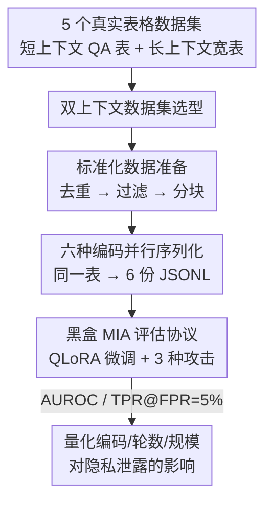

# Tab-MIA: A Benchmark Dataset for Membership Inference Attacks on Tabular Data in LLMs

**会议**: ICLR 2026  
**OpenReview**: [https://openreview.net/forum?id=ioYdy7aghG](https://openreview.net/forum?id=ioYdy7aghG)  
**领域**: AI安全 / LLM隐私  
**关键词**: 成员推断攻击, 表格数据, 记忆化, 编码格式, 隐私泄露

## 一句话总结
本文提出首个针对「在表格数据上微调的 LLM」的成员推断攻击（MIA）基准 Tab-MIA，把 5 个真实表格数据集统一序列化成 6 种编码格式，系统评估编码格式、微调轮数、模型规模如何影响隐私泄露——发现仅微调 3 个 epoch、最高 AUROC 就逼近 97.7%，且 Line-Separated / Key-Value 这类「扁平行式」编码最易被攻破。

## 研究背景与动机

**领域现状**：LLM 越来越多地被训练在表格数据（财务表、电子病历、人口普查表）上，做表格问答、Text2SQL、表格生成等任务。为了把二维表喂进 Transformer，需要先把表「序列化」成文本——常见编码有 JSON、HTML、Markdown、Key-Value Pair 等，已有研究表明编码格式会显著影响任务准确率。

**现有痛点**：成员推断攻击（判断某条样本是否在训练集里）在 LLM 上已被广泛研究，但几乎全部针对**自由文本**——分析句子/段落级的置信度分数。表格数据的特性完全不同：内容短、数据类型异构、取值分布偏斜、还带有显式的列级语义。这导致两件事都缺：① 缺一个面向结构化表格的 MIA 基准（现有 BookMIA / WikiMIA / MIMIR 都只覆盖文本，MIDST 虽然涉及表格但针对的是扩散模型合成数据，不是 LLM 微调记忆）；② 没人系统研究过「编码格式」这个表格独有的变量会怎样改变记忆化与泄露风险。

**核心矛盾**：表格里恰恰最容易藏个人身份信息（PII）、财务/医疗敏感字段，结构化的「一行一实体」格式让模型更容易把整条记录原样记下来；而把表序列化成文本的方式（编码格式）既影响下游性能、又会改变 token 边界与冗余度，从而暗中放大或抑制记忆——但这条隐私维度此前被完全忽视。

**本文目标**：构建一个受控且真实的表格 MIA 基准，用它回答四个问题——编码格式如何影响记忆与脆弱性？微调轮数的影响？训练编码与攻击编码不一致时攻击还有效吗（跨格式泛化）？公开预训练模型是否已经记住了公开表格？

**核心 idea**：把同一批表「一表多编码」——5 个数据集 × 6 种编码统一打包成基准，在 4 个开源 LLM 上用 QLoRA 微调、再跑 3 种黑盒 MIA，第一次把「编码格式 ↔ 记忆化 ↔ 隐私泄露」三者放进同一个可复现的评估框架里量化。

## 方法详解

### 整体框架

Tab-MIA 本质是一条「**基准构建 + 攻击评估**」的流水线，而非一个新攻击算法。构建侧：从公开来源选 5 个表格数据集（区分短上下文/长上下文），经过标准化的去重—过滤—分块处理，再把每张表（或表块）同时序列化成 6 种编码格式，全部存成 JSONL。评估侧：用 QLoRA 在某一种编码下微调 4 个开源 LLM，把一半表当 member、一半当 non-member，再施加 3 种黑盒 MIA，用 AUROC 和 TPR@FPR=5% 两个指标量化泄露。整条管线的设计目标是「除了编码格式/轮数/模型这几个被研究的变量，其它一切都受控」，从而干净地归因隐私风险来源。

### 关键设计

**1. 双上下文数据集选型：覆盖两种结构形态的表**

表格数据其实有两种很不一样的形态，如果只测一种会让结论片面，所以基准刻意各取一批。**短上下文表**来自表格问答数据集——WikiTableQuestions(WTQ)、WikiSQL、TabFact，它们原本是「问题+支撑表」配对，本文丢掉问题文本、只保留唯一的表，专注研究对表本身的记忆；这类表来自 Wikipedia，列数 $\geq 5$、规模小，序列化后是「短而完整」的一张表。**长上下文表**来自公平性/回归/隐私研究常用的宽表——Adult(人口普查收入)、California Housing(加州房价)，它们行数动辄数万、特征 10~15 列，受 LLM 上下文窗口限制必须切块处理。两类表过滤后规模从 1,030 到 17,900 条不等，让基准既能测「小而独特的表是否被整条记住」，又能测「大表分块后局部记忆」，后面实验也确实发现短上下文表（WTQ）的泄露远高于长上下文表（Adult）。

**2. 六种编码并行序列化：把「编码格式」做成可控变量**

这是全文真正的核心研究变量。同一张 $3\times2$ 的表，被同时序列化成 6 种结构抽象不同的文本：JSON、HTML、Markdown、Key-Value Pair（`Name: Alice | Age: 30`）、Key-is-Value（`Name is Alice. Age is 30.`）、Line-Separated（CSV 式 `Alice,30`）。关键在于**对同一份内容做 6 份平行编码**——这样在比较时唯一变化的就是「结构如何呈现给 tokenizer」，而内容、数据集、超参全部固定，于是任何 AUROC 差异都能干净归因到编码格式。背后的机制假设是：Line-Separated / Key-Value 这类扁平行式编码产生长而连续的「内容 token 流」，紧贴 tokenizer 边界、把学习压力集中到一个个单元格取值上，记忆化最强；而 HTML / JSON 用大量标签和标点引入「结构冗余」，把模型注意力分散到非内容 token 上，记忆化被稀释、AUROC 通常低约 10 个点。这个设计直接把「序列化策略」从一个性能调参项，变成了一个可量化的隐私旋钮。

**3. 标准化数据准备：用去重—过滤—分块杜绝虚假记忆信号**

如果不做控制，记忆信号会被人为污染，所以准备阶段有三步硬约束。**去重**：每张表在基准里只出现一次，防止「同一张表重复曝光」人为放大记忆（重复样本天然更易被记住，会高估攻击成功率）。**长度过滤**：短上下文表中，凡 Line-Separated 序列化后超过 10,000 字符的表一律剔除，避免超大表主导训练动态或触发截断伪影。**分块**：长上下文表按每 20 行切成一块，以适配上下文窗口并保持样本间一致性。这三步保证了基准里每条样本的「记忆难度」是可比的，AUROC 反映的是编码/模型的真实记忆倾向，而不是数据规模或重复度的副作用。

**4. 黑盒 MIA 评估协议：统一攻击集 + 双指标 + member 划分**

评估侧也被标准化成一套固定协议。微调用 QLoRA（4-bit 量化的参数高效微调），默认 3 个 epoch；每次训练把数据集里**一半的表当 member（参与训练）、另一半当 non-member（不参与）**，构成攻击的正负样本。攻击采用 3 种黑盒、reference-free 的方法：LOSS/PPL（按负对数似然阈值判别）、Min-K%（取最低 $k\%$ token 概率求平均）、Min-K%++（对 log 概率做归一化后再聚合，校正长度与校准偏差）。指标用两个互补的：AUROC（跨决策阈值的整体可分性）与 TPR@FPR=5%（严格隐私约束下、低误报时的真阳率）。统一协议让 6 种编码、4 个模型、1~3 个 epoch 的所有结果都横向可比，Min-K%++ 在几乎所有设置下都是最强攻击。

## 实验关键数据

### 主实验

四个开源模型（LLaMA-3.1 8B、LLaMA-3.2 3B、Gemma-3 4B、Mistral 7B），QLoRA 微调 3 epoch，下表为不同编码格式的 AUROC（Min-K%++ 为主，部分取各方法最高值）：

| 数据集 | 最易攻破编码 | 最高 AUROC | 模型 |
|--------|------------|-----------|------|
| WTQ（短上下文） | Line-Separated | **97.7%** | Mistral 7B |
| California Housing（长上下文） | Key-Value Pair | **92.6%** | Mistral 7B |
| WikiSQL | Line-Separated | 88.9% (AUROC) / 40.2% (TPR@FPR=5%) | LLaMA-3.1 8B |

编码格式对比（California Housing，节选 Mistral 7B 的 Min-K%++）：Key-Value Pair 92.6% > Line-Separated 86.8% > Markdown 80.0% > Key-is-Value 74.9% > JSON 54.5% ≈ HTML 50.6%。扁平行式编码比 HTML/JSON 高出约 30~40 个点，印证「结构冗余稀释记忆」的假设。

### 消融实验

微调轮数对脆弱性的影响（Min-K%++ 20%，Line-Separated 编码，AUROC）：

| 模型 | 数据集 | 1 epoch | 2 epoch | 3 epoch |
|------|--------|---------|---------|---------|
| Mistral 7B | WTQ | 69.7 | 88.4 | **97.7** |
| LLaMA-3.1 8B | WTQ | 61.6 | 80.8 | **93.6** |
| LLaMA-3.1 8B | California | 59.0 | 72.8 | 87.8 |
| Gemma-3 4B | Adult | — | — | 67.7 |

跨格式泛化（Gemma-3 4B / WTQ，训练编码≠攻击编码）：对角线（训练=攻击同格式）AUROC 最高，如 Markdown→Markdown 达 85.2%；换成 Key-Value 或 Line-Separated 攻击则降到 68.9% / 69.4%。攻击侧最「好用」的检测编码是 HTML（行均 76.0），训练侧最「易记」的是 Line-Separated（列均 74.6）。

### 关键发现
- **编码格式是最大的隐私旋钮**：扁平的 Line-Separated / Key-Value Pair 记忆最强、最易被攻破；HTML / JSON 因引入语法噪声反而最安全（低约 10 点甚至 30+ 点）——这给了防御方一个直接可操作的建议：训练时优先用 JSON/HTML 序列化。
- **轮数与泄露强正相关**：所有模型、所有数据集上 AUROC 都随 epoch 单调上升，短上下文表尤为剧烈（WTQ 仅 3 epoch 就破 97%），长上下文表（Adult）相对温和（最高 71.5%）。
- **模型越大越漏**：LLaMA-3.1 8B / Mistral 7B 比 LLaMA-3.2 3B / Gemma-3 4B 的 AUROC 高约 10~14 个点——更大记忆容量带来表格推理优势的同时，也带来隐私权衡。
- **预训练模型已有泄露**：未经微调的公开模型对 WTQ（Wikipedia 表）已表现出中等记忆，LLaMA-3.1 8B + Key-Value Pair 达 72.0%，说明这些表很可能已进入预训练语料。

## 亮点与洞察
- **「一表多编码」的受控实验设计**：把同一份表内容平行编码成 6 份，唯一变量就是序列化结构，这让「编码格式如何影响记忆」第一次能被干净量化——这个思路可迁移到任何研究「输入表征如何影响模型行为」的工作（如表征对鲁棒性、对幻觉的影响）。
- **把「序列化策略」从性能维度拉到隐私维度**：以往选编码只看任务准确率（HTML/JSON 利于表格 QA），本文揭示同一选择的反面——越利于任务理解的结构冗余，越能稀释记忆、降低泄露，给出了「准确率 vs 隐私」的新权衡轴。
- **跨格式攻击仍部分有效的发现很实用**：即使攻击方不知道训练用的确切编码，记忆信号也常跨格式残留（仍有 ~69% AUROC），说明真实部署中「编码格式保密」并不能当防御手段。

## 局限与展望
- **只测了 reference-free 黑盒攻击**：LOSS / Min-K% / Min-K%++ 都是单模型置信度类攻击，没有评估更强的 reference-based（如 LiRA 训影子模型）攻击，真实风险可能被低估。
- **微调局限于 QLoRA 3 epoch、4 个 8B 以下模型**：更大模型、全参微调、更多轮数下的记忆行为未覆盖；非成员样本在预训练实验里靠 GPT-4o mini 合成，合成质量会影响 AUROC 的绝对值。
- **只给出风险量化、未提供防御**：基准定位是「systematic evaluation 的地基」，差分隐私训练、去重/格式选择等具体防御的有效性留待后续，作者也仅给出「选 JSON/HTML 编码」这一条经验建议。
- **数据来自 Wikipedia/公开普查表**：真实 PII（病历、金融）场景下的记忆与泄露规律是否一致，仍需验证。

## 相关工作与启发
- **vs WikiMIA / BookMIA / MIMIR**：这些是文本域 MIA 基准，分析句子/段落级置信度；Tab-MIA 专攻结构化表格，泄露发生在「绑定列语义的 token 级概率」上，补齐了表格这一空白攻击面。
- **vs MIDST**：MIDST 评估扩散模型合成表格数据时的成员推断（从去噪轨迹重建敏感记录）；本文针对的是 LLM 在序列化表上微调后的记忆泄露，二者是互补而非重叠的攻击面。
- **vs TabLLM / SheetEncoder 等表格序列化工作**：它们优化编码是为了任务准确率与可扩展性，完全忽略隐私；本文复用「多编码」这一手段，却把它指向记忆与泄露的度量。

## 评分
- 新颖性: ⭐⭐⭐⭐ 首个 LLM 表格 MIA 基准 + 首次系统化「编码格式↔记忆」量化，问题切口新但方法是已有攻击的组合应用。
- 实验充分度: ⭐⭐⭐⭐ 4 模型 × 5 数据集 × 6 编码 × 3 攻击 × 1-3 epoch 覆盖全面，但缺 reference-based 强攻击与防御验证。
- 写作质量: ⭐⭐⭐⭐ 四个研究问题串起结果，编码机制解释清晰，表格详实。
- 价值: ⭐⭐⭐⭐ 给「在表格上训 LLM」的隐私风险提供了可复现评估地基，并给出可直接落地的编码选择建议。

<!-- RELATED:START -->

## 相关论文

- [\[ICLR 2026\] Membership Inference Attacks Against Fine-tuned Diffusion Language Models (SAMA)](membership_inference_attacks_against_fine-tuned_diffusion_language_models.md)
- [\[ACL 2026\] Fast-MIA: Efficient and Scalable Membership Inference for LLMs](../../ACL2026/llm_safety/fast-mia_efficient_and_scalable_membership_inference_for_llms.md)
- [\[ICLR 2026\] Information-Theoretic Membership Inference for Granular Quantification of Memorization](information-theoretic_membership_inference_for_granular_quantification_of_memori.md)
- [\[ICLR 2026\] No Caption, No Problem: Caption-Free Membership Inference via Model-Fitted Embeddings](no_caption_no_problem_caption-free_membership_inference_via_model-fitted_embeddi.md)
- [\[ACL 2026\] Membership Inference Attacks on In-Context Learning Recommendation](../../ACL2026/llm_safety/membership_inference_attacks_on_llm-based_recommender_systems.md)

<!-- RELATED:END -->
