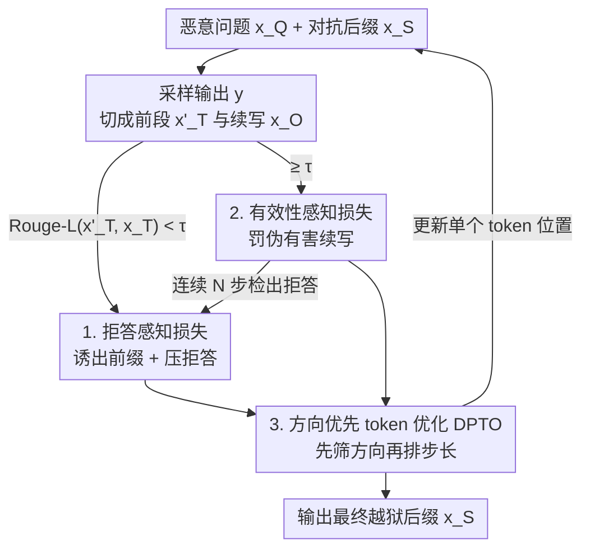

# TAO-Attack: Toward Advanced Optimization-based Jailbreak Attacks for Large Language Models

**会议**: ICLR 2026  
**OpenReview**: [https://openreview.net/forum?id=XfbBiBG46D](https://openreview.net/forum?id=XfbBiBG46D)  
**领域**: 对齐与安全 / LLM 越狱攻击  
**关键词**: 越狱攻击, 优化型攻击, GCG, 两阶段损失, 梯度方向优先

## 一句话总结
针对优化型越狱攻击（以 GCG 为代表）的三个老毛病——容易被拒答、产出"伪有害"内容、token 更新低效，TAO-Attack 用一个**两阶段损失函数**（先压拒答、再罚伪有害）配合**方向优先的 token 优化（DPTO）**，在三个对齐 LLM 上把攻击成功率（ASR）打到 100%，并在更严格的固定初始化设定下以更少迭代显著超过 I-GCG。

## 研究背景与动机
**领域现状**：让 LLM "越狱"——即绕过安全对齐、吐出有害回答——目前有三类做法：专家手写 prompt（不可规模化）、用一个攻击 LLM 自动生成 prompt（效果受攻击模型能力限制）、以及**优化型攻击**（用目标模型的梯度/logit 自动优化一段对抗后缀）。优化型方法无需人工、成功率高，因此是当前主线。GCG 是最早也最有代表性的：它在恶意问题后拼一段后缀 $x_S$，通过最小化"目标有害前缀" $x_T$（如 "Sure, here is a script..."）的负对数似然来优化后缀 token。

**现有痛点**：作者把优化型方法的问题拆成三个。其一，**拒答残留**：GCG/MAC 即便诱出了目标前缀，模型也常在后面接一句免责声明（"However, I must inform you that I cannot assist..."），越狱实际失败。其二，**伪有害输出**：I-GCG 改用"自我暗示有害"的模板（如让模型先说"我的输出是有害的"）来减少拒答，但一方面直接逼模型承认有害与其安全对齐目标冲突、反而压低成功率，另一方面就算吐出了有害前缀，模型也可能只是"点到为止"——命名了一个危险函数却把它实现成无害版本，过不了 LLM 有害性判定。其三，**token 更新低效**：GCG/MAC/I-GCG 排候选 token 时都只看梯度与 token embedding 差的**点积**，而点积把"方向是否对齐"和"步长大小"混在一起，可能选中步长大但方向偏的 token，导致优化不稳。

**核心矛盾**：损失目标层面，"诱出有害前缀"和"避免拒答/伪有害"是两个相互拉扯的目标，固定单一模板搞不定；候选选择层面，点积排序无法把"对齐"和"步长"解耦。

**本文目标**：设计一个既能保证真有害、又收敛更快的优化型越狱框架。

**核心 idea**：用**渐进式两阶段损失**（第一阶段抑制拒答、第二阶段惩罚伪有害续写）替代固定模板目标，并用**先按方向筛、再按步长排**的 DPTO 替代点积排序。

## 方法详解

### 整体框架
TAO-Attack 沿用 GCG 的总体范式——在恶意问题 $x_Q$ 后优化一段对抗后缀 $x_S$，使越狱 prompt $x_Q \oplus x_S$ 诱导模型生成目标有害前缀 $x_T$——但在"优化什么损失"和"怎么挑 token"两处做了改造。每一步迭代里，先用当前后缀采样一段输出 $y$，把它切成前段 $x'_T$ 和续写 $x_O$；用 Rouge-L 衡量 $x'_T$ 与目标前缀 $x_T$ 的吻合度：还没对上（$\text{Rouge-L} < \tau$）就用**第一阶段·拒答感知损失**把模型推向有害前缀、同时压住拒答；一旦对上（$\ge \tau$）就切到**第二阶段·有效性感知损失**去惩罚当前这条"伪有害"续写、逼模型换一条真有害的路；若在第二阶段连续 $N$ 步又检出拒答，则退回第一阶段。token 候选的挑选则全程交给 **DPTO**：先用余弦相似度筛出与负梯度方向对齐的 top-k，再在其中按梯度投影步长采样。

### 关键设计

**1. 拒答感知损失：在诱出有害前缀的同时主动压制拒答续写**

第一阶段针对的是 GCG 的"拒答残留"。它不只最大化目标前缀 $x_T$ 的概率，还显式地把模型可能给出的拒答回答当成负样本来惩罚。具体做法是先用恶意问题拼随机后缀去 query 模型，收集一批拒答回答构成集合 $R = \{r_1, \dots, r_K\}$，然后**逐条**（而非一次全上）优化：

$$L_1^{(j)}(x_Q \oplus x_S) = -\log p(x_T \mid x_Q \oplus x_S) + \alpha \cdot \log p(r_j \mid x_Q \oplus x_S \oplus x_T)$$

其中 $\alpha > 0$ 在"提升有害前缀"和"压低拒答 $r_j$"之间做平衡。攻击时从 $r_1$ 开始优化到收敛，再换 $r_2$，依次推进，这样既能处理多个拒答信号，又不至于把它们堆在一起带来过大开销。和 I-GCG 那种"逼模型自己承认有害"的模板工程相比，这里是直接对拒答分布下手，消融显示移除有害引导模板、只加第一阶段就能把 ASR 拉满到 100%，说明压拒答比改模板更管用。

**2. 有效性感知损失：识别并惩罚"看着有害实则无害"的伪有害续写**

第二阶段针对的是"伪有害"。难点在于攻击者并不预先知道真正的有害答案，没法直接最大化某条"标准答案"续写的概率。作者的思路是反向操作——既然不知道什么是对的，那就惩罚当前观测到的、明显不对的那条续写。把输出切成 $x'_T \oplus x_O$（$x'_T$ 长度与 $x_T$ 相同），当 $\text{Rouge-L}(x'_T, x_T) \ge \tau$ 即确认前缀已经诱出后，施加：

$$L_2(x_Q \oplus x_S) = -\log p(x_T \mid x_Q \oplus x_S) + \beta \cdot \log p(x_O \mid x_Q \oplus x_S \oplus x'_T)$$

其中 $\beta > 0$ 控制对续写 $x_O$ 的惩罚力度。它一边继续巩固有害前缀，一边压低当前这条良性/伪有害续写的概率，从而把优化从这条轨迹上"赶走"、去探索更可能真有害的生成路径。两个阶段由前缀吻合度动态切换（第一阶段达标切第二阶段、第二阶段连续 $N$ 步又检出拒答则退回），既保证前缀可靠生成又保证最终输出真有害。

**3. 方向优先 token 优化（DPTO）：把"方向对齐"和"步长大小"解耦再排序**

这一项针对点积排序的缺陷。作者用一阶 Taylor 展开重新审视 GCG：按 $-g_{vi}$ 排序等价于找让 embedding 位移 $(e_v - e_i)$ 与负梯度方向最对齐的 token，本质是离散 embedding 空间里的最速下降。但点积 $-\nabla_{e_i}L^\top(e_v - e_i)$ 同时受方向和步长影响，一个方向偏但步子大的候选可能比方向正但步子小的候选得分还高，造成"大而偏"的更新。DPTO 把这两个因素拆开两步走：**第一步方向优先**，对每个候选算位移与负梯度的余弦相似度 $C_{i,v} = \frac{-g_i^\top \Delta e_{i,v}}{\|g_i\|\,\|\Delta e_{i,v}\|}$，屏蔽非法 token 后只保留余弦最高的 top-k，保证留下来的都朝下降方向走；**第二步梯度投影步长**，在这批已对齐的候选里再算沿负梯度的投影步长 $S_{i,v} = -g_i^\top \Delta e_{i,v}$，经温度 softmax 转成概率 $P_{i,v} = \frac{\exp(S_{i,v}/\gamma)}{\sum_{v'}\exp(S_{i,v'}/\gamma)}$ 采样，既偏好大步长又保留多样性。消融里 DPTO 相比 GCG(Softmax) 把 ASR 从 55% 提到 65% 并降低迭代，且 loss 下降更快、方差更小，证明解耦确实带来更稳更快的优化。

### 损失函数 / 训练策略
整体优化在 $L_1$ 与 $L_2$ 之间动态交替（详见 Algorithm 1）：每步采样输出并切分，未达 Rouge-L 阈值用 $L_1$（在 $r_j$ 上收敛则轮换到下一个拒答信号），达标后用 $L_2$，第二阶段连续 $N$ 步检出拒答则回退 $L_1$。token 更新每步只改一个位置。关键超参：后缀长 20、batch 256、top-k=256、$K=3$、$\tau=1.0$、$N=3$、$\alpha=\beta=0.2$、$\gamma=0.5$；沿用 I-GCG 的 easy-to-hard 初始化（先在一个简单有害 query 上跑 1000 步得到初始后缀，再用它初始化其余 prompt、每条 500 步）。

## 实验关键数据

### 主实验
在 AdvBench（I-GCG 的精选子集）上对三个对齐模型评测 ASR，评测用"模板匹配 → GPT-4 Turbo 自动判定 → 人工确认"三级流程。

| 数据集 | 模型 | I-GCG | TAO-Attack |
|--------|------|-------|------------|
| AdvBench | Vicuna-7B-v1.5 | 100% | 100% |
| AdvBench | Llama-2-7B-Chat | 100% | 100% |
| AdvBench | Mistral-7B-Instruct-0.2 | 100% | 100% |

标准设定下 I-GCG 与 TAO-Attack 都已饱和到 100%，无法区分优劣。于是作者设计更严格的**固定初始化**评测（所有 query 用同一段 "! ! ..." 初始后缀、各自独立优化至多 1000 步），剥掉 easy-to-hard 迁移初始化，比的是纯优化效率：

| 模型 | 方法 | ASR | 平均迭代 |
|------|------|-----|----------|
| Llama-2-7B-Chat | I-GCG | 68% | 604 |
| Llama-2-7B-Chat | TAO-Attack | **92%** | **305** |
| Mistral-7B-Instruct-0.2 | I-GCG | 80% | 406 |
| Mistral-7B-Instruct-0.2 | TAO-Attack | **100%** | **86** |
| Qwen2.5-7B-Instruct | I-GCG | 100% | 66 |
| Qwen2.5-7B-Instruct | TAO-Attack | 100% | **21** |

在 Llama-2 上 ASR 从 68% 升到 92% 且迭代砍半，在 Mistral 上以 86 步达 100%（I-GCG 需 406 步），说明优势源于优化本身而非初始化技巧。迁移性方面（在 Vicuna-7B-1.5 上优化通用后缀再迁移到闭源模型），TAO-Attack 在 GPT-3.5 Turbo 上把 ASR 从 30% 拉到 **82%**，其余闭源模型绝对值仍低但普遍高于基线。

### 消融实验
固定初始化、Llama-2-7B-Chat、1000 步/query：

| 配置 | ASR | 迭代 | 说明 |
|------|-----|------|------|
| GCG + 有害引导模板 | 55% | 702 | I-GCG 风格模板基线 |
| GCG(Softmax) + 有害引导 | 55% | 687 | 证明收益不来自 softmax 采样 |
| DPTO + 有害引导 | 65% | 620 | 解耦方向/步长，提点降迭代 |
| Stage One + DPTO | 100% | 261 | 去模板改用拒答感知损失，直接拉满 |
| Stage One + Stage Two + DPTO（完整） | 100% | 243 | 再加第二阶段进一步降迭代 |

### 关键发现
- **拒答感知损失（Stage One）是成功率的命门**：去掉"有害引导模板"、换成压拒答的 Stage One，ASR 直接从 65% 跳到 100%，说明"压拒答"远比"逼模型承认有害"的模板工程有效。
- **DPTO 管效率**：单独加 DPTO 提点（55%→65%）并降迭代，loss 曲线下降更快、方差更小；GCG(Softmax) 与 GCG 几乎同分，排除了"收益来自 softmax 采样"的可能。
- **有效性感知损失（Stage Two）管提速**：在已 100% 的基础上把迭代从 261 进一步压到 243，是"保成功率不变、再提效率"的角色。
- **切换机制用 Rouge-L 优于语义嵌入**：对比 Qwen3-Embedding-0.6B，Rouge-L 在 0.8/0.9/1.0 各阈值下都既更高 ASR 又更少迭代，故选作阶段切换判据。

## 亮点与洞察
- **"不知道正确答案就惩罚错误答案"的反向监督**：第二阶段绕开了"攻击者拿不到 ground-truth 有害续写"的死结——不去最大化未知的对的，而是惩罚已观测到的伪有害续写，把优化从坏轨迹上赶走，思路很巧。
- **用 Taylor 展开把 GCG 的候选选择讲透再对症下药**：作者先证明点积排序等价于离散最速下降，再点出它把"方向"和"步长"耦合，DPTO 的两步解耦因此不是拍脑袋而是有理论依据，这种"先解释清楚旧方法为什么不行、再改"的写法很有说服力。
- **可迁移的 trick**：把"先按余弦方向筛 top-k、再按投影步长采样"这套解耦排序，可迁移到任何基于 GCG 式离散梯度搜索的对抗优化（不限越狱）。

## 局限与展望
- **闭源模型迁移仍弱**：除 GPT-3.5 Turbo 外，TAO-Attack 在 GPT-4 Turbo / Gemini 1.5 / Gemini 2 上的绝对 ASR 仍很低（个位数），说明白盒优化出的通用后缀跨到强对齐闭源模型仍困难。
- **依赖目标模型梯度/logit**：作为优化型攻击，方法本质是白盒，对真正只给 API 的黑盒模型只能靠迁移，受限明显。
- **评测规模偏小**：主实验用的是 AdvBench 精选子集、消融只用 20 条 query，覆盖面有限。
- **作为攻击方法的双刃性**：论文目的是揭示对齐漏洞、推动更鲁棒的防御，但同套技术也可被滥用；后续可探索把两阶段损失的"伪有害判定"反过来用于防御侧的有害检测。

## 相关工作与启发
- **vs GCG / MAC**: 都用固定模板目标 + 点积排序，故有拒答残留且更新不稳；MAC 加动量加速但继承同样缺陷。TAO-Attack 用两阶段损失替固定目标、用 DPTO 替点积排序，对症修掉这两处。
- **vs I-GCG**: I-GCG 用"自我暗示有害"的多样化模板减少拒答，但逼模型承认有害与对齐目标冲突、且仍出伪有害；本文不碰模板，直接对拒答分布和伪有害续写下手，固定初始化下 ASR 与迭代均明显占优（Llama-2 上 92% vs 68%、305 vs 604 步）。
- **vs LLM-based 攻击（PAIR / TAP / AdvPrompter / AmpleGCG）**: 那类靠攻击 LLM 生成 prompt、效果受攻击模型能力限制；优化型的 TAO-Attack 无需攻击模型、直接用目标梯度，对齐模型上成功率更高更稳。

## 评分
- 新颖性: ⭐⭐⭐⭐ 两阶段损失（尤其"惩罚伪有害续写"的反向监督）与 DPTO 的方向/步长解耦都是对 GCG 系的实质性改进，理论分析到位。
- 实验充分度: ⭐⭐⭐⭐ 主实验+固定初始化+迁移+消融+切换机制分析较完整，但数据集为 AdvBench 子集、消融仅 20 query，规模偏小。
- 写作质量: ⭐⭐⭐⭐ 痛点→对症设计的逻辑清晰，Taylor 展开把动机讲透；公式与算法表完整。
- 价值: ⭐⭐⭐⭐ 对红队/对齐研究有直接参考价值，揭示了拒答与伪有害两类隐蔽失败模式。

<!-- RELATED:START -->

## 相关论文

- [\[ICLR 2026\] GeneBreaker: Jailbreak Attacks Against DNA Language Models with Pathogenicity Guidance](genebreaker_jailbreak_attacks_against_dna_language_models_with_pathogenicity_gui.md)
- [\[ICLR 2026\] STAR: Strategy-driven Automatic Jailbreak Red-teaming for Large Language Model](star_strategy-driven_automatic_jailbreak_red-teaming_for_large_language_model.md)
- [\[ICLR 2026\] Sampling-aware Adversarial Attacks against Large Language Models](sampling-aware_adversarial_attacks_against_large_language_models.md)
- [\[ICLR 2026\] VEAttack: Downstream-Agnostic Vision Encoder Attack Against Large Vision Language Models](veattack_downstream-agnostic_vision_encoder_attack_against_large_vision_language.md)
- [\[ACL 2026\] Jailbreaking Large Language Models with Morality Attacks](../../ACL2026/llm_safety/jailbreaking_large_language_models_with_morality_attacks.md)

<!-- RELATED:END -->
