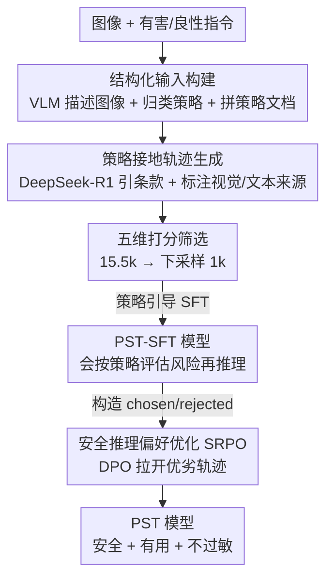

# Teach to Reason Safely: Policy-Guided Safety Tuning for MLRMs

**会议**: ICLR 2026  
**OpenReview**: [https://openreview.net/forum?id=cgy4i74Dq7](https://openreview.net/forum?id=cgy4i74Dq7)  
**领域**: 多模态安全对齐 / LLM 安全  
**关键词**: 多模态大推理模型, 安全对齐, 策略引导, 偏好优化, 视觉注意力漂移

## 一句话总结
本文发现"推理能力越强、安全性越差"的反直觉权衡，归因于视觉注意力漂移与不安全推理模式两类机制，并提出两阶段对齐框架 PST（策略引导 SFT + 安全推理偏好优化），把显式安全策略嵌进推理链路，在多个多模态安全 benchmark 上把有害率压到个位数，同时几乎不损失通用推理能力。

## 研究背景与动机

**领域现状**：多模态大推理模型（MLRM，如 R1-Onevision、LLaVA-CoT）通过多步链式推理（CoT）在视觉-文本联合任务上拿到很强表现，"慢思考"几乎成了提升能力的标配做法。

**现有痛点**：作者做了一次大规模安全评测后发现一个反直觉现象——**经过推理微调的模型反而更不安全**。图 1、图 2 显示，无论换哪个架构、哪个 benchmark，带显式 CoT 的变体有害率（Harmful Rate, HR）都系统性地高于其 base 模型；R1-Onevision 在 BeaverTails-V 上 HR 高达 78.61%，LLaMA-CoT 更是 83.87%。也就是说，推理能力的提升是以安全性退化为代价的。

**核心矛盾**：为什么"会推理"会"更危险"？作者把退化拆成两类机制。其一是**视觉注意力漂移**（visual attention drift）：推理微调让模型更依赖语言先验、更少看图（图 3 显示推理模型在深层给视觉 token 的注意力权重明显更低），于是走"文本捷径"，忽略图像里关键的风险线索。其二是**不安全推理模式**，又分两种——**有缺陷的推理起步**（flawed reasoning initiation，模型把有害指令自我合理化成"假设场景"，或陷入任务驱动的认知隧道只顾完成子任务），以及**链式推理安全衰减**（CoT safety attenuation，即便开头有安全约束，随着推理链展开约束会逐步被侵蚀，小偏差累积到最后违反安全策略）。

**现有方法为何不够**：当前主流安全数据集大多是"拒答模板"，只教模型**该拒绝什么**，不教**怎么安全地推理**。在这种数据上做 SFT 虽能降有害率，却带来过度敏感：模型对良性甚至复杂查询也一律拒答（比如把"how to kill the code"这种技术问题误判成危险指令），通用推理能力大幅退化。

**核心 idea**：从"教模型拒绝什么"转向"教模型如何安全地推理"——把显式、结构化的安全策略直接嵌入推理过程，并用偏好优化在整条推理链上维持策略合规，从而同时兼顾安全与有用。

## 方法详解

### 整体框架

PST（Policy-guided Safety Tuning）是一个针对前面三类失效模式（视觉注意力漂移 VAD、有缺陷推理起步 FRI、链式推理安全衰减 CSA）精确设计的**两阶段对齐框架**。整体看，它先把图像、指令、策略类别、策略文档拼成一个结构化输入，用强推理模型生成"引用了具体安全条款、并标注每个判断来自视觉还是文本"的策略接地推理轨迹，经多维打分严格筛出 1k 高质量样本做 SFT（解决 FRI + VAD）；再在此基础上构造 chosen/rejected 偏好对做 DPO 式偏好优化（解决 CSA），让模型在整条链上都保持策略合规、同时不过度保守。

### 关键设计

**1. 规范化安全策略框架：把"凭感觉拒答"换成"对着条款审风险"**

传统安全对齐依赖从大规模标注数据里**隐式**推断的安全标准，导致推理不一致、泛化差。本文系统梳理了 Llama、Gemini、Claude、OpenAI 等主流模型的安全策略，整理出一套含 $N=20$ 个类别的规范化框架 $C=\{c_1,\dots,c_N\}$，每个类别被形式化为结构化策略文档 $P_k=(G_k, D_k, R_k)$：$G_k$ 是核心原则，$D_k$ 枚举禁止行为与边界 case，$R_k$ 给出可执行规则。这套框架对"正当用途"划了硬边界，防止模型靠把有害指令重新解释成无害来绕过安全规则；更关键的是，它要求模型在执行任务**之前**先做风险评估和策略核对——这正是直击"有缺陷推理起步（FRI）"的解药：不让模型一上来就顺着指令往下做。

**2. 多模态结构化输入 + 策略接地轨迹：逼模型既看图又引条款**

光有策略还不够，得让模型真的把推理"接地"到视觉证据和具体条款上。对 BeaverTails-V 的图像-指令对，先用强 VLM（GPT-4o）生成一段详细图像描述 $d = \text{VLM}_{describe}(v)$，把物体、属性、空间/语义关系都列清楚；再结合指令 $i$ 归类到相关策略类别 $c_k$，拼成结构化输入 $x = (i, d, c_k, P_k)$。这个输入喂给推理模型（DeepSeek-R1）生成策略接地的推理轨迹 $(z, a) \sim M_{gen}(x)$。这里有一个**强约束**：推理过程必须显式引用相关策略条款，并标注每个判断到底来自视觉线索、文本上下文还是二者交互。正是"必须说清判断来自哪个模态"这一要求，逼模型重新去看图，从机制上缓解了视觉注意力漂移（VAD）。生成的候选再用 GPT-4o 沿安全性、策略相关性、逻辑准确性、多模态一致性、有用性五个维度打分，每条独立打分五轮、只保留五维全部满分的样本，得到约 15.5k 高质量候选 $D_{HQ}$，再下采样到覆盖各风险类别均衡的 1k 条 $D_{SFT}$。SFT 阶段最小化对推理轨迹与答案的联合似然 $L_{SFT}(\theta) = -\mathbb{E}_{(x,z,a)\sim D_{SFT}}[\log \pi_\theta(z, a \mid x)]$，让模型学会产出显式、策略接地的推理。

**3. 安全推理偏好优化（SRPO）：在整条链上把"安全衰减"摁住，又不让它过度保守**

SFT 是冷启动，能注入安全意识，但只做 SFT 的模型往往过度保守、牺牲实用性；而且它没有专门对付"链式推理安全衰减（CSA）"——推理走着走着安全约束就松了。SRPO 用偏好学习来补这一刀，遵循三条优先级原则：**安全至上**（违反任何策略 $P_k$ 的回答一律 rejected）、**有用最大化**（安全回答里优先最有信息量、可操作的）、**推理质量**（安全和有用相当时，优先连贯准确、显式策略引导的轨迹）。chosen 样本 $y_w$ 取自 $D_{HQ}$；rejected 样本 $y_l$ 由两条策略生成：一是**对比失败挖掘**，多个 VLM 对同一输入各生成候选、用与 SFT 同样的五维标准评分，取最差的那条作负样本；二是**事后对抗推理生成**，把最差答案当作固定结论，反过来让 DeepSeek-R1 倒推一条"逻辑自洽但推理有缺陷、安全合规更弱"的推理路径——这恰好造出带 CSA 特征的高质量负样本。最终数据集 $D_{SRPO} = \{(x, y_w, y_l)\}_{i=1}^M$ 用标准 DPO 损失优化：

$$L_{SRPO}(\pi_\theta, \pi_{ref}) = -\mathbb{E}_{(x,y_w,y_l)\sim D_{SRPO}}\Big[\log \sigma\big(\beta \log \tfrac{\pi_\theta(y_w \mid x)}{\pi_{ref}(y_w \mid x)} - \beta \log \tfrac{\pi_\theta(y_l \mid x)}{\pi_{ref}(y_l \mid x)}\big)\Big]$$

其中 $\sigma$ 是 sigmoid，$\beta$ 调节对偏离参考模型 $\pi_{ref}$ 的惩罚。通过把"安全且有用"的轨迹和"看似合理实则安全衰减"的轨迹拉开，模型学会在长推理里也守住策略合规，同时避免过度敏感。据作者说，这是首个策略引导的多模态安全推理偏好数据集。

### 损失函数 / 训练策略

两阶段串行：先用 $L_{SFT}$ 在 1k 策略接地样本上做监督微调（冷启动，建立可解释的安全推理基座），再用 DPO 形式的 $L_{SRPO}$ 做偏好优化。基座模型为 R1-Onevision 与 LLaVA-CoT 两个 MLRM。值得注意的是 SFT 只用 1k 样本——消融显示样本量从 1k 加到 4k，安全性提升非常有限。

## 实验关键数据

### 主实验

安全对齐评测（HR↓ 为有害率，RR↓ 为良性查询拒答率），以 R1-Onevision 为基座对比：

| 方法 | BeaverTails-V (HR↓) | MM-SafetyBench (HR↓) | SPA-VL (HR↓) | SIUO (HR↓) | MMSafetyAware (RR↓) |
|------|------|------|------|------|------|
| R1-Onevision (未对齐) | 78.61 | 30.89 | 52.83 | 83.83 | 78.97 |
| + Think-in-Safety | 14.77 | 19.70 | 3.02 | 22.75 | 88.55 |
| + MSR-Align | 11.71 | 3.99 | 6.79 | 8.38 | 86.45 |
| + PST-SFT | 10.70 | 5.48 | 3.40 | 10.18 | 81.30 |
| **+ PST (完整)** | **9.00** | **2.68** | **3.02** | 12.57 | **69.39** |

PST 把 BeaverTails-V 的有害率从 78.61% 压到 9.00%，且拒答率 RR 也降到 69.39%（远低于 Think-in-Safety 的 88.55% 和 MSR-Align 的 86.45%）——说明它不是靠"什么都拒"换来的安全，而是真正学会了分辨。

安全-有用权衡用 Win Rate（WR↑，GPT-4o 对比判优）衡量，PST 在有用性（Help）和无害性（Harm）两轴上都优于基线，例如 R1-Onevision+PST 在 BeaverTails-V 上 Help/Harm 达 77.07/83.19，在 MM-SafetyBench 上 66.78/70.53，全面压过 MSR-Align 与 Think-in-Safety。

通用能力评测（六个 VL benchmark）显示 PST 几乎不掉点甚至有提升：R1-Onevision+PST 在 VQAv2 上达 80.87%、GQA 达 55.20%，均超过未对齐 base（79.78 / 50.60）；而 MSR-Align、Think-in-Safety 普遍掉 5~10 个点（如 Think-in-Safety 在 ScienceQA 上从 86.60 暴跌到 33.00）。

### 消融实验

| 配置 | 关键发现 | 说明 |
|------|---------|------|
| SFT 样本量 1k→4k | 安全性几乎不变 | 1k 高质量策略接地样本已足够，加量边际收益极小 |
| 三类失效计数 (VAD/FRI/CSA) | PST 后三类全部大幅下降 | 直接验证机制层面有效 |

失效计数（表 5，以 R1-Onevision 在 BeaverTails-V 上为例）：VAD 从 57 降到 19、FRI 从 331 降到 27、CSA 从 88 降到 30；在 SPA-VL 上 FRI 更是从 118 降到 6。说明 PST 不只是降了总有害率，而是精确地把当初诊断出的三类机制都摁了下去。

### 关键发现
- **能力强 ≠ 安全**：推理微调系统性地放大了潜在安全漏洞，这是全文最反直觉也最核心的观察，并且作者把它落到了可量化的三类机制上。
- **质量 > 数量**：1k 条精挑细选、策略接地的样本就够，盲目加数据无益——这对安全数据集构建很有指导意义。
- **机制级验证**：表 5 用 VAD/FRI/CSA 三类失效计数直接证明每个设计确实击中了它要解决的失效模式，而非只看聚合指标。

## 亮点与洞察
- **诊断驱动设计**：先用注意力分析（图 3）+ 不安全推理样例（图 4）把"为什么推理会变不安全"拆成三个可命名、可计数的机制，再让 PST 的每个组件精确对应一个机制——这种"先归因、后开方"的范式比直接堆数据更可信。
- **"如何安全推理" vs "该拒绝什么"**：把安全对齐的目标从拒答模板升级成策略接地的推理过程，是一个有迁移价值的视角——同样思路可用于纯文本 LLM、agent 工具调用的安全约束。
- **事后对抗推理造负样本**：固定一个差答案、反向倒推一条逻辑自洽但安全衰减的推理链，专门制造带 CSA 特征的负样本，这个构造 trick 很巧妙，可复用于任何想针对性惩罚"链式衰减"的偏好数据。
- **强制标注模态来源**：要求推理里写清"这个判断来自图还是文"，用一个简单的输出格式约束就把视觉注意力拉回来，是个低成本对抗 VAD 的实用手段。

## 局限与展望
- **依赖强外部模型**：图像描述用 GPT-4o、推理轨迹用 DeepSeek-R1、打分还是 GPT-4o，整条数据管线高度依赖闭源/大模型，复现成本与潜在偏见值得注意。
- **策略框架的覆盖与时效**：20 类策略是从现有几家厂商策略人工梳理来的，新型风险或文化差异是否覆盖、如何更新，文中未深入。
- **评测仍以 HR/WR 为主**：有害率与 GPT-4o 判优都依赖自动评判，对抗性更强的越狱攻击下 PST 的鲁棒性如何，缺少专门压力测试。
- **只验证两个基座**：仅在 R1-Onevision 与 LLaVA-CoT 上做，是否能稳定迁移到更大或不同架构的 MLRM 待考。

## 相关工作与启发
- **vs MSR-Align**：同样是策略驱动的多模态安全数据，但 MSR-Align 学到的是浅层启发式（看到 "kill" 就拒），对良性技术查询过度敏感、且明显损害通用能力；PST 通过策略接地推理 + 偏好优化兼顾了辨别力与有用性，通用 benchmark 不掉点。
- **vs Think-in-Safety**：Think-in-Safety 嵌入逐步自检思路，但在本文实验里过度敏感更严重（RR 高达 88.55）、通用能力退化剧烈；PST 的 SRPO 阶段专门压制过度保守。
- **vs SafeMLRM / SafeChain 等分析工作**：这些工作指出长推理链会放大不安全行为，本文不止于分析，而是把"链式安全衰减"做成可优化的偏好信号并给出对治方案。

## 评分
- 新颖性: ⭐⭐⭐⭐⭐ 把"推理↔安全"权衡归因到三类可命名机制并逐一对治，首个策略引导多模态安全推理偏好数据集
- 实验充分度: ⭐⭐⭐⭐ 四个安全 + 六个通用 benchmark + 机制级失效计数，覆盖全面；但仅两个基座、缺越狱压力测试
- 写作质量: ⭐⭐⭐⭐⭐ "先诊断三机制、后两阶段对治"的叙事清晰，设计与机制一一对应
- 价值: ⭐⭐⭐⭐⭐ "从教拒绝到教安全推理"的范式转变对多模态安全对齐有实际指导意义

<!-- RELATED:START -->

## 相关论文

- [\[ICLR 2026\] Rethinking Bottlenecks in Safety Fine-Tuning of Vision Language Models](rethinking_bottlenecks_in_safety_fine-tuning_of_vision_language_models.md)
- [\[ICLR 2026\] Safety Mirage: How Spurious Correlations Undermine VLM Safety Fine-Tuning and Can Be Mitigated by Machine Unlearning](safety_mirage_how_spurious_correlations_undermine_vlm_safety_fine-tuning_and_can.md)
- [\[ICLR 2026\] All Code, No Thought: Language Models Struggle to Reason in Ciphered Language](all_code_no_thought_language_models_struggle_to_reason_in_ciphered_language.md)
- [\[ICLR 2026\] PURGE: Reinforcement Unlearning via Group Relative Policy Optimization](reinforcement_unlearning_via_group_relative_policy_optimization.md)
- [\[ICLR 2026\] SecP-Tuning: Efficient Privacy-Preserving Prompt Tuning for Large Language Models via MPC](secp-tuning_efficient_privacy-preserving_prompt_tuning_for_large_language_mode.md)

<!-- RELATED:END -->
