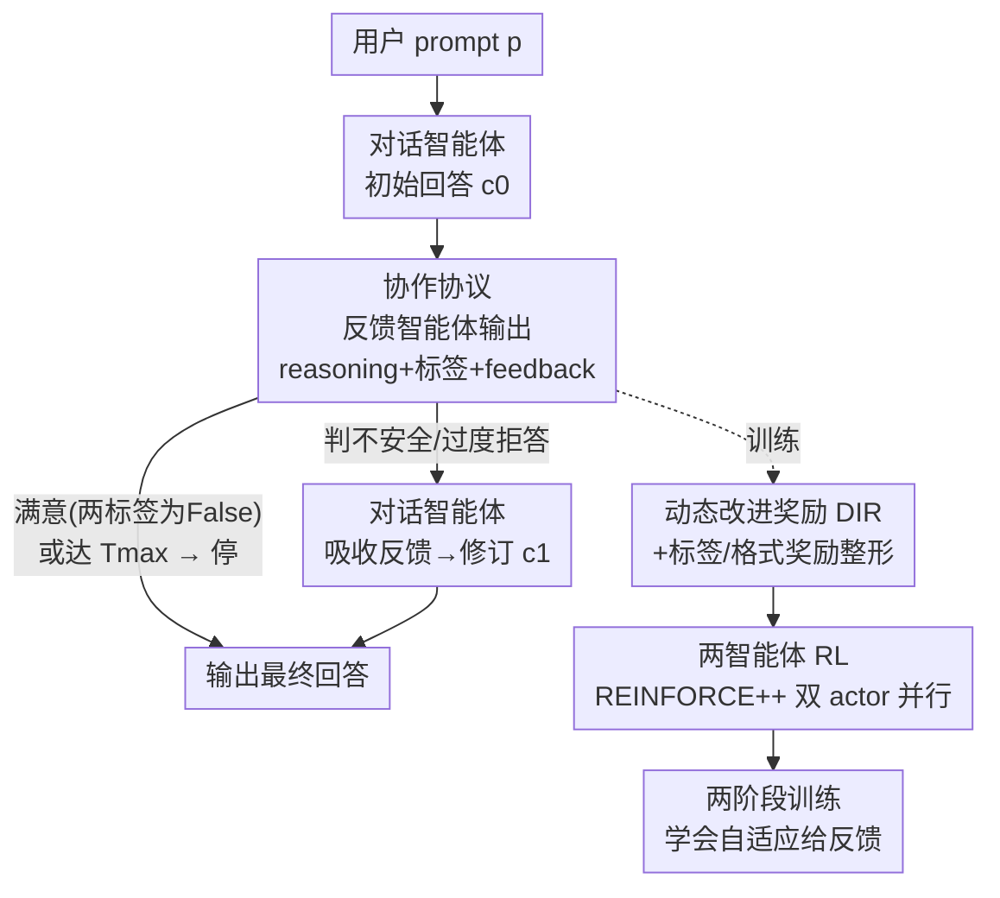

# The Alignment Waltz: Jointly Training Agents to Collaborate for Safety

**会议**: ICLR 2026  
**OpenReview**: [https://openreview.net/forum?id=2NBS9ilNqM](https://openreview.net/forum?id=2NBS9ilNqM)  
**代码**: 无  
**领域**: 对齐RLHF / AI安全  
**关键词**: 多智能体强化学习, 安全对齐, 过度拒答, 协作反馈, 动态改进奖励

## 一句话总结
WALTZRL 把安全对齐重新表述成对话智能体与反馈智能体之间的「正和协作博弈」，用一个会随训练演化的动态改进奖励（DIR）联合训练两个智能体，让不安全回答和过度拒答都被「修好」而不是被「拦死」，在五个数据集上同时把攻击成功率（39.0%→4.6%）和过度拒答率（45.3%→9.9%）大幅压低，且几乎不损失通用能力。

## 研究背景与动机
**领域现状**：让 LLM 既有用（helpful）又无害（harmless）是对齐的核心张力。主流防护做法是在对话模型之上挂一个独立的安全护栏模型（safeguard，如 Llama Guard、Constitutional Classifiers），由它对 prompt 和 response 做安全分类，一旦判定含有不安全内容，就把整条回答转成拒答。

**现有痛点**：这种「一刀切」护栏有两个结构性缺陷。其一，它会加剧过度拒答（overrefusal）——一段很长、很有用的回答哪怕只有一小段涉险内容，整条都会被拦掉，用户连安全有用的部分也拿不到；对于「双重用途」的敏感问题（如某化学合成的实验室安全），直接关停比给出有节制的回答更糟。其二，护栏只会拒绝，不会给出更细致的引导，无法把一个本可以安全回答的拒答「掰回」成有用回答。

**核心矛盾**：有用与无害之间存在 trade-off，而护栏式方法用「丢弃」来换安全，等于牺牲有用性来换无害性，无法同时推进两者；论文用了一个比喻——护栏「把音乐整个掐断了」（cuts the music entirely）。

**本文目标**：在不牺牲通用能力的前提下，同时降低不安全回答率和过度拒答率，把 helpfulness–harmlessness 的 Pareto 前沿往外推。

**切入角度**：与其用一个只会「否决」的裁判，不如训练一个会「提建议」的搭档——把安全对齐建模成两个智能体的正和协作博弈：一个对话智能体负责答，一个反馈智能体负责给改进建议，不安全或过度拒答的回答被「改好」而不是被「丢弃」。

**核心 idea**：联合训练对话智能体与反馈智能体，用一个随训练动态演化的「动态改进奖励」激励反馈智能体产出真正能让对话回答变好的建议，并在推理时让反馈智能体仅在需要时自适应介入，从而兼顾安全、有用与低延迟。

## 方法详解

### 整体框架
WALTZRL（Waltz Reinforcement Learning）要解决的是「护栏只会拦、不会改」的问题，办法是把单模型防护换成两个会协作的智能体，并用多智能体 RL 让它们共同进化。整条流程分推理协议和训练两层：推理时，对话智能体先对用户 prompt $p$ 产出初始回答 $c_0$；反馈智能体读完后输出一个 JSON，里面有对回答的推理 reasoning、两个布尔标签（unsafe / overrefuse）和一段文本反馈 feedback；若标签判定为不安全或过度拒答，反馈被回灌给对话智能体，产出修订回答 $c_1$；若判定满意（两个标签都为 False）或达到最大轮数 $T_{max}$ 则停止。训练时，每个 RL step 先跑一遍「协作 rollout」生成交互轨迹，再把多智能体轨迹拆成各自的单智能体样本、分别算奖励，最后把两个智能体当作独立 actor 交替（可并行）做策略梯度更新，使两者在 step 级别共同进化。

把安全对齐写成正和多智能体博弈，目标是最大化两个智能体在整段反馈轨迹上的奖励之和（再减 KL 正则）：

$$\max_{\pi_c,\pi_f}\ \mathbb{E}\Big[\sum_{t=0}^{T^p_\pi}\big(R_c((p,H_{t-1}),c_t)+R_f((p,H_{t-1},c_t),f_t)\big)-\beta\,\mathrm{KL}(\pi_c\|\pi_c^{ref})-\beta\,\mathrm{KL}(\pi_f\|\pi_f^{ref})\Big]$$

其中 $H_{t-1}=(c_0,f_0,\dots,c_{t-1},f_{t-1})$ 是到第 $t-1$ 轮为止的反馈历史，$R_c$、$R_f$ 分别是对话、反馈智能体的奖励，二者目标互不竞争（cooperating, non-competing）。

### 关键设计

**1. 对话式协作协议：把「拦死」变成「迭代改好」**

护栏式方法的根问题是它只能在「放行」和「拒答」之间二选一，无法对一条回答做局部修正。WALTZRL 用一个对话式 rollout 协议替代它：对话智能体和反馈智能体用不同的 system prompt 初始化，反馈智能体被要求输出结构化 JSON——`reasoning`（对回答的推理）、`unsafe` 与 `overrefuse` 两个布尔标签、以及 `feedback` 文本。之所以用两个标签而非一个，是为了区分三种情形：不安全、过度拒答、以及满意（既安全又不拒答）；这两个标签同时充当推理期「是否需要继续给反馈」的判据。轨迹形如 $(p,c_0,f_0,c_1,\dots,f_{T-1},c_T)$：对话智能体先答，反馈智能体再评并给建议，对话智能体据此修订，交替进行。自适应停止条件是：当反馈智能体判定 $\text{unsafe}=\text{False}\wedge\text{overrefuse}=\text{False}$，或达到 $T_{max}$ 时停止（训练早期若反馈格式非法也停）。实验里 $T_{max}=1$（即最多 1 轮反馈、2 轮对话回答）就已极其有效。

**2. 动态改进奖励 DIR：让反馈被「是否真的改好了回答」来定义**

如果只奖励反馈智能体「标签判对」，它会变成又一个只会分类的护栏，给不出能让回答变好的建议。WALTZRL 的核心是动态改进奖励（Dynamic Improvement Reward, DIR）：直接用「对话智能体吸收反馈后回答变好了多少」来奖励反馈，即下一轮与当前轮对话奖励之差

$$R^{DIR}_f((p,H_{t-1},c_t),f_t)=R_c((p,H_t),c_{t+1})-R_c((p,H_{t-1}),c_t)$$

其中对话奖励只有「既安全又不过度拒答」才得正分：$R_c=\mathbb{1}\{\neg\text{unsafe}\wedge\neg\text{overrefuse}\}$。反馈把回答改好则 DIR 为正，改坏则为负；若已停止、$c_{t+1}$ 不存在则 DIR 记 0。关键之处在于 DIR 会随训练动态变化——对话智能体策略一旦更新，同一条反馈带来的改进量也随之改变，因此这是一个会「跟着搭档一起进化」的奖励。反馈智能体的完整奖励是三项组合：

$$R_f=\alpha\,R^{DIR}_f\cdot R^{label}_f+\lambda\,R^{label}_f+\gamma\,R^{format}_f$$

其中 $R^{label}_f=\mathbb{1}\{L(f_t)=J(p,c_t)\}$ 奖励标签与 LLM judge 给的对齐标签一致，$R^{format}_f$ 奖励 JSON 可解析。论文强调一个反直觉但关键的细节：DIR 必须乘上（条件于）标签奖励，否则改进奖励会主导、训练中标签准确率会塌掉。

**3. 两智能体多智能体 RL：step 级共同进化 + A/B 混合轨迹采样**

为了让两个智能体在同一节奏里共同进化，每个 RL step 都同时更新二者。具体把多智能体协作轨迹「降维」成各自的单智能体样本：对反馈智能体，从完整轨迹约简到状态 $(p,c_t)$、动作是其生成的 $f_t$ 的每个 token，并随机抽一轮 $t$ 作为该轨迹的反馈样本（平衡长短轨迹）。对话智能体则被增广成两类样本——A：状态是 prompt $p$、动作是初始回答 $c_0$（学会一上来就答好）；B：状态是 prompt 加整段反馈历史 $(p,H_{T-1})$、动作是最终回答 $c_T$（学会在需要时吸收反馈）。训练时随机在 A、B 间二选一混采，使对话智能体既能产出好的初始回答、又能在必要时纳入反馈；消融显示这种混合采样优于只用 A 或只用 B。优化用的是把 REINFORCE++ 扩展到双 actor 的版本，对每个 agent 用带 clip 的 surrogate 目标

$$J(\theta_a)=\mathbb{E}\Big[\tfrac{1}{|y|}\sum_i\min\big(s_i(\theta_a)A^{norm}_{x,i},\ \mathrm{clip}(s_i,1-\epsilon,1+\epsilon)A^{norm}_{x,i}\big)\Big]$$

两个 actor 的策略梯度步可并行执行以提升吞吐；论文指出同样的改造也可套在 GRPO、PPO 上。

**4. 两阶段训练：解决「快收敛后反馈智能体没样本可学」的偏置**

要让反馈在推理期自适应触发，反馈智能体必须先能高准确地判断回答是否不安全/过度拒答。但有个训练后期的陷阱：当对话智能体逐渐变好，绝大多数初始回答 $c_0$ 已经安全且不拒答，rollout 样本多样性骤降、正负样本严重不均衡，反馈智能体的标签会过拟合到这种不均衡分布。WALTZRL 用两阶段化解：阶段一冻结对话智能体、只训反馈智能体，用式 (2) 的全部三项奖励，先把格式和标签学准；阶段二做两个智能体的协作共训，但把加性标签奖励关掉（$\lambda=0$），以免标签在不均衡数据上过拟合，同时仍保留 DIR 乘上标签奖励这一条件项——消融证明这个「条件」是维持标签准确率的关键。

## 实验关键数据

### 主实验
Llama-3.1-8B-Instruct 同时初始化两个智能体；训练 prompt 取自 WildJailbreak（对抗攻击）和 OR-Bench-80K（边界过度拒答），全程不用任何 helpfulness 数据。安全用攻击成功率 ASR↓ 衡量，过度拒答用 ORR↓ 衡量，均为平均值。

| 方法 | ASR Avg.↓ | ORR Avg.↓ |
|------|-----------|-----------|
| 1 Baseline（裸模型） | 26.5 | 25.7 |
| 2 + Safeguard | 9.0 | 29.8 |
| 3 Single-model RL | 12.2 | 8.6 |
| 4 + Safeguard | 5.3 | 14.9 |
| 5 推理期协作（无训练） | 13.4 | 12.7 |
| 6 Oracle 标签转模板反馈 | 7.0 | 16.6 |
| 7 **WALTZRL（本文）** | **3.7** | **7.6** |

WALTZRL 在平均 ASR 和 ORR 上同时优于所有 baseline，把 Pareto 前沿往外推。具体单数据集上：WildJailbreak 39.0%→4.6%、OR-Bench 45.3%→9.9%。

通用能力几乎无损（Table 2）：在 AlpacaEval、IFEval、GPQA、MMLU、TruthfulQA 上，WALTZRL 训练后与原模型几乎持平（如 MMLU 68.0→68.1、TruthfulQA 37.0→37.0），证明它在不喂有用性数据的情况下也没牺牲通用能力。

### 消融实验

| 配置 | ASR Avg.↓ | ORR Avg.↓ | F1↑ | 说明 |
|------|-----------|-----------|-----|------|
| WALTZRL（完整） | 3.7 | 7.6 | 94.3 | 双智能体共进化 |
| 冻结对话智能体（只训反馈） | 5.1 | 14.2 | 90.1 | ORR 明显回升，验证共进化必要 |

反馈奖励设计消融（冻结对话智能体隔离效果）对比三种变体：(A) 三项全用、(B) 去掉加性标签奖励但 DIR 仍条件于标签、(C) 完全去掉标签奖励且 DIR 不条件于标签。结论：三者都能学出有用反馈（改进多于变坏），但标签准确率排序为 A>B>C——对比 B 与 C 表明，把 DIR 条件于标签奖励是维持高标签准确率的关键；故采用阶段一用 (A)、阶段二用 (B) 的两阶段方案。

### 关键发现
- **护栏确实加剧过度拒答**：方法 2 vs 1（ORR 25.7→29.8）、4 vs 3（8.6→14.9）都显示挂护栏会抬高 ORR；且系统本身 ORR 越低，护栏的负面放大效应越大（单模型 RL 上 +6.3% > 裸模型上 +4.1%）。
- **详尽反馈对降「过度拒答」尤其关键**：连拥有 ground-truth 标签的 Oracle 模板反馈（方法 6）都只把 ORR 从 25.7 降到 16.6（远不如降 ASR 26.5→7.0），因为让模型「别拒答」往往要它生成看起来涉险的内容，没有配套理由它反而更倾向拒绝；细粒度反馈正是说服模型把拒答翻转为有用回答的关键。
- **自适应反馈兼顾延迟**：WALTZRL 把反馈触发率 FTR 大幅压低——在与安全无关的 AlpacaEval 上仅 6.7%（推理期协作 baseline 为 42.6%），即便在纯安全/拒答 benchmark 上 FTR 也 <50%，且标签准确率从 31.4%（WJ）提升到 70.1%，延迟影响与护栏模型相当。
- 观察到涌现行为：反馈智能体有时会直接「示范」理想回答的引文，引导对话智能体照着写。

## 亮点与洞察
- **把「奖励」绑定到协作效果而非分类正确**：DIR 用「搭档因我而进步多少」来定义反馈的价值，这是个会随对方策略一起演化的非平稳奖励，巧妙地把「会评判」升级成「会帮忙」，可迁移到任何「批评者-执行者」式的协作 RL（如代码审查、写作润色）。
- **修订而非丢弃**：推理期把不安全/过度拒答的回答改好而不是拦掉，从机制上同时治了「越狱」和「过度拒答」两个相反方向的病——这是单护栏永远做不到的，因为护栏只有「否决」一个动作。
- **双智能体即双重防线**：部署两个智能体意味着攻击要同时越狱两者才算成功，天然比单防御模型更鲁棒；同时反馈智能体只在需要时触发，保住了安全 query 上的低延迟。
- **不用 helpfulness 数据也不掉通用能力**：把安全交给一个独立反馈智能体，对话智能体几乎不受安全训练污染，提示「专职安全副驾」是一条不牺牲有用性的安全增强路线。

## 局限与展望
- 实验只跑到 $T_{max}=1$（最多 1 轮反馈），多轮反馈的收益与成本未充分探究；作者也承认更多轮会线性增加部署延迟。
- 仅在 Llama-3.1-8B-Instruct 单一规模/单一模型族上验证，是否能放大到更大模型或异构两智能体（不同 backbone）未知。
- 对话与反馈奖励都依赖一个 LLM judge 给的对齐标签，judge 本身的偏差/错误会传导进 DIR；judge 在罕见或新型攻击上的可靠性是潜在弱点。
- 反馈智能体可能学到「直接代写理想回答」的捷径行为，长期是否会让对话智能体退化为「复读机」、削弱其独立能力，值得跟踪。
- ORR 仍有 ~7.6% 残留、ASR 在个别集（FORTRESS 6.2%）非零，离「同时归零」仍有距离。

## 相关工作与启发
- **vs 独立护栏模型（Llama Guard / Constitutional Classifiers）**：护栏把含险内容整条转拒答，只会否决、会加剧过度拒答；WALTZRL 用可迭代修订替代一刀切，同时压低 ASR 和 ORR，且部署延迟相当。
- **vs 单模型安全 RL**：单模型 RL（方法 3）虽降 ORR 但 ASR 仍 12.2%，且挂护栏后 ORR 反升；WALTZRL 的双智能体共进化在两个指标上都更优（3.7 / 7.6）。
- **vs 训练多智能体但只部署单防御者的工作（Zheng 2024、Liu 2025）**：那类方法推理时只留一个防御模型；WALTZRL 训练与部署都用两个智能体，迫使攻击同时越狱两者，鲁棒性更强。
- **vs Oracle 模板反馈**：即便给真值标签，模板化反馈（方法 6）降 ORR 能力有限（→16.6），印证「内容丰富的反馈」本身就是不可替代的关键变量。

## 评分
- 新颖性: ⭐⭐⭐⭐⭐ 把安全对齐重构为正和协作博弈、并用随训练演化的动态改进奖励定义反馈价值，思路新颖且自洽。
- 实验充分度: ⭐⭐⭐⭐ 五数据集四维度评测 + 多组消融，覆盖安全/拒答/通用能力/延迟；但限于单模型单规模、$T_{max}=1$。
- 写作质量: ⭐⭐⭐⭐⭐ 「华尔兹」隐喻贯穿，动机—公式—实验衔接清晰，关键反直觉点（DIR 须条件于标签）交代到位。
- 价值: ⭐⭐⭐⭐⭐ 提供一条「同时治越狱与过度拒答、且不损通用能力」的可部署安全对齐范式，实用价值高。

<!-- RELATED:START -->

## 相关论文

- [\[ICLR 2026\] SOSBench: Benchmarking Safety Alignment on Six Scientific Domains](sosbench_benchmarking_safety_alignment_on_six_scientific_domains.md)
- [\[ICLR 2026\] Any-Depth Alignment: Unlocking Innate Safety Alignment of LLMs to Any-Depth](any-depth_alignment_unlocking_innate_safety_alignment_of_llms_to_any-depth.md)
- [\[ACL 2026\] Reasoning Structure Matters for Safety Alignment of Reasoning Models](../../ACL2026/llm_safety/reasoning_structure_matters_for_safety_alignment_of_reasoning_models.md)
- [\[ACL 2026\] Why Agents Compromise Safety Under Pressure](../../ACL2026/llm_safety/why_agents_compromise_safety_under_pressure.md)
- [\[ACL 2026\] On Safety Risks in Experience-Driven Self-Evolving Agents](../../ACL2026/llm_safety/on_safety_risks_in_experience-driven_self-evolving_agents.md)

<!-- RELATED:END -->
