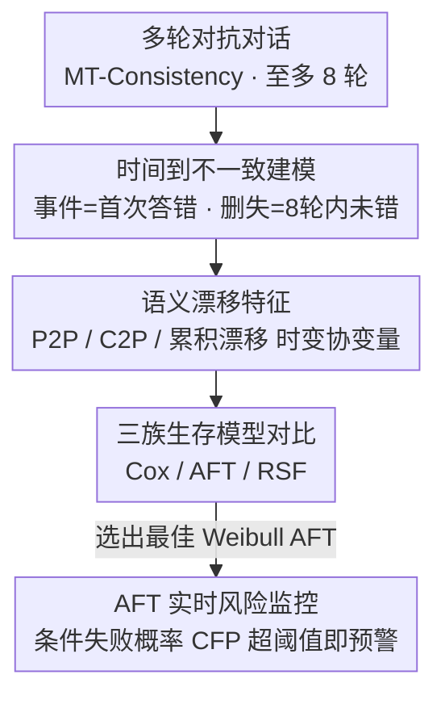

# Time-To-Inconsistency: A Survival Analysis of Large Language Model Robustness to Adversarial Attacks

**会议**: ICLR 2026  
**OpenReview**: [https://openreview.net/forum?id=88C7vSdn0t](https://openreview.net/forum?id=88C7vSdn0t)  
**领域**: AI安全 / LLM鲁棒性  
**关键词**: 多轮对话鲁棒性, 生存分析, 语义漂移, 一致性评估, 风险监控

## 一句话总结
本文把"LLM 在多轮对抗对话中第几轮开始答错"建模成一个**时间到事件（time-to-event）**的生存分析问题，用 Cox / AFT / 随机生存森林三族模型在 9 个 LLM、36,951 轮对话上分析，发现"突变式语义漂移"急剧抬升失败风险而"累积式漂移反而是保护性的"，并把轻量 AFT 模型改造成能提前若干轮预警失败的实时风险监控器。

## 研究背景与动机
**领域现状**：评估 LLM 鲁棒性的主流做法是静态基准 + 单轮打分，或者对多轮对话也只汇报一个聚合的平均分（如一致性正确率）。这些指标回答的是"模型在某个固定轮数上对不对"。

**现有痛点**：单轮 / 静态聚合视角抹掉了**失败的时间动态**。它无法区分两类截然不同的模型：一个在轻微施压下立刻崩、另一个能稳住很多轮才慢慢退化——两者的聚合分可能一样，但部署风险天差地别。现实里像"谄媚漂移（sycophancy）"这种现象——模型在用户极轻微的反驳下就放弃正确答案——恰恰说明**对话的轨迹和它最终的结果同等重要**。

**核心矛盾**：安全和可靠性真正关心的问题是"错误何时出现、由什么对话历史触发"，而现有评估只回答"是否出错"。我们需要的工具要能把"会不会失败"和"什么时候失败"分开，还要能处理"到了最大轮数仍未出错"的右删失（censoring）样本，并给出逐轮的风险函数。

**本文目标**：(i) 在对抗对话里逐轮预测失败风险；(ii) 刻画语义漂移、领域、难度、模型身份这些信号如何塑造多轮交互的生存动态。

**切入角度**：作者发现生存分析（survival analysis）天然契合这个设定——它本就是为"时间到事件"数据设计的，能干净地分离"是否失败/何时失败"、无需为删失样本打人造标签、并支持时变协变量（time-varying covariates），从而把不断演变的对话信号直接挂到风险变化上。

**核心 idea**：把"时间到不一致（time-to-inconsistency）"形式化成一个离散时间生存问题——事件 = 在严格一致性判据下第一次答错，时间 = 离散轮数，8 轮内不出错记为右删失——再用简单的语义漂移特征驱动生存模型，既做分析又做预警。

## 方法详解

### 整体框架
整篇工作的输入是 MT-Consistency 基准里"一个初始问题 + 至多 8 轮对抗追问"的多轮轨迹（只保留初始答对的对话），输出是逐轮的生存/风险曲线以及一个能提前预警的监控信号。整条流水线分四步：先把每轮 prompt 和到当前轮为止的完整上下文编码成句向量，由此算出三种"语义漂移"作为时变协变量；再把这些协变量喂给 Cox / AFT / RSF 三族生存模型去拟合事件时间 $T_i$；最后挑出表现最好的 AFT 模型，把它的生存函数换算成一个滚动窗口内的条件失败概率，做成实时风险监控器。

### 关键设计

**1. 时间到不一致：把多轮鲁棒性变成生存分析问题**

针对"静态聚合分抹掉时间动态"这个痛点，作者不再问"模型对不对"，而是问"它第几轮被带偏"。对每条对话 $i$，事件时间 $T_i \in \{1,\dots,H\}$（$H=8$）定义为模型答案首次与初始正确答案不一致的轮次，事件指示 $\delta_i=1$ 表示 8 轮内确实出错、$\delta_i=0$ 表示到最大轮数仍正确（右删失）。因为时间是离散的，核心量是离散时间风险 $h_i(t)=\Pr(T_i=t \mid T_i\ge t, X_{i,\le t})$，即"已经撑到第 $t$ 轮、就在这一轮翻车"的瞬时风险，它与生存函数通过 $S_i(t)=\prod_{u=1}^{t}\big(1-h_i(u)\big)$ 相连。这套框架的价值在于：它原生支持删失（不用给"还没失败"的对话硬编标签），又支持时变协变量（让逐轮变化的对话信号直接对应风险变化），从而把"会不会错"和"什么时候错"彻底解耦。

**2. 语义漂移特征：用句向量的"位移"刻画对抗压力**

要预测风险就得有信号，作者刻意只用极简单的语义漂移特征，证明哪怕轻量信号也足够。用 sentence-transformer $f(\cdot)$ 把每轮用户 prompt 编码为 $e_{i,t}=f(u_{i,t})$，把"到当前轮为止模型见过的完整上下文"（拼接历史问答 + 当前 prompt）编码为 $c_{i,t}$，由此导出三种漂移：**prompt-to-prompt 漂移** $D_{p2p}(i,t)=1-\cos(e_{i,t-1},e_{i,t})$ 衡量相邻两轮用户输入的突变；**context-to-prompt 漂移** $D_{c2p}(i,t)=1-\cos(c_{i,t-1},e_{i,t})$ 衡量新输入与已有上下文的错位；**累积漂移** $D_{cum}(i,t)=\sum_{s=2}^{t}D_{p2p}(i,s)$ 是到第 $t$ 轮走过的总"距离"。再配上 prompt 长度、学科领域（7 个主题簇）、难度（4 档）、模型身份（9 个 LLM）等离散协变量，one-hot 后拼成时变向量 $X_{i,t}$。这三种漂移恰好对应"瞬时速度 vs 累积距离"的对比，是后续核心洞察的来源。

**3. 三族生存模型对比：让假设去匹配真实的失败过程**

作者并行拟合三族模型，目的是搞清"哪种关于风险如何随轮次演变的假设"最贴合数据。**Cox 比例风险（PH）**假设协变量对风险是乘性作用 $h_i(t\mid X_{i,t})=h_0(t)\exp(\beta^\top X_{i,t})$，并扩展出带"漂移×模型身份"交互项的高级版；**AFT（加速失效时间）**则假设协变量乘性作用在**时间尺度**上 $\log T_i=\mu_i+\sigma\varepsilon_i$，加速因子 $\exp(\Delta\mu)$ 直接量化协变量把"特征时间（如中位失败轮数）"拉长或压短了多少倍，作者试了 Weibull / log-normal / log-logistic 三种分布；**随机生存森林（RSF）**作为非参数基线，靠生存树集成自动捕捉非线性和高阶交互。关键发现是 Schoenfeld 残差检验显示 P2P 漂移**明显违反 PH 假设**（它对风险的作用并非恒定），这正解释了为什么"作用在时间尺度上、能表达加速风险"的 AFT 在校准和后期轮次预测上全面胜出，而 Cox 只能当描述性工具用。

**4. AFT 实时风险监控：把生存函数变成可操作的预警信号**

光预测得准还不够，实际监控既要有可操作的提前量、又不能频繁误报。作者不用静态的"预测失败时间"，而是计算一个滚动窗口 $\tau$ 内的**条件失败概率（CFP）**：在第 $t$ 轮且对话当前仍一致（$T>t$）的前提下，未来 $\tau=2$ 轮内失败的概率 $\mathrm{Risk}_i(t,\tau)=1-\frac{\hat S_i(t+\tau)}{\hat S_i(t)}$。这个量会随累积风险动态更新，一旦超过训练时按 F1 优化出的阈值 $\lambda$ 就触发预警。它的妙处在于直接利用了 AFT 捕捉到的"加速风险"形状——失败前夕风险陡升正好被这个条件概率放大，于是监控器能在真正答错前若干轮就发出警报，而对安全对话保持克制。

### 损失函数 / 训练策略
Cox 用带对话级聚类稳健标准误的偏似然估计 $\beta$，交互块加轻度 $\ell_2$ 正则；AFT 用右删失对数似然最大化估参；RSF 在每个分裂处随机抽协变量、按 log-rank 统计量最大化生存不纯度下降。数据按对话级 80/20 划分（按模型和主题簇分层），在 80% 训练池内做 5 折交叉验证调超参并选模型变体（以交叉验证 IBS 为主、C-index 为次），20% 测试集只用于最终评估一次。

## 实验关键数据

### 主实验
数据：MT-Consistency，700 个问题、39 学科、4 难度档、9 个 SOTA 模型（Claude 3.5 Sonnet、DeepSeek R1、GPT-4o、gpt-oss-120B、Llama 3.3 70B、Llama 4 Maverick、Gemini 2.5、Mistral Large、Qwen 3），过滤初始答对后共 36,951 轮。评估用 Harrell C-index（区分度，越高越好）和 Integrated Brier Score / IBS（校准+整体准确度，越低越好）。

| 模型 | 范式 | 协变量数 | C-index | IBS |
|------|------|---------|---------|-----|
| Cox Baseline | 半参数 | 21 | 0.861 | 0.344 |
| Cox Advanced | 半参数 | 53 | 0.868 | 0.343 |
| Weibull AFT | 参数 | 12 | **0.874** | 0.180 |
| Log-Logistic AFT | 参数 | 12 | **0.874** | 0.187 |
| Weibull AFT + Int. | 参数 | 53 | 0.869 | **0.175** |
| Random Survival Forest | 非参数 | 53 | 0.845 | 0.190 |

AFT 在区分度（C-index 0.874）和校准（IBS≈0.18，相比 Cox 的 0.34 误差**降低 >48%**）上双双领先；RSF 反而 C-index 最低（0.845）。加交互项的 Weibull AFT 把 IBS 进一步压到 0.175，但 C-index 略降——揭示了"交互项轻微牺牲区分度、显著提升校准"的取舍。

### 消融实验
逐轮 Brier 分数（越低越好）暴露了 Cox 与 AFT 的本质差异：

| 模型 | R4 | R6 | R8 | IBS |
|------|----|----|----|----|
| Cox Baseline | 0.366 | 0.432 | 0.446 | 0.344 |
| Weibull AFT | 0.267 | 0.195 | 0.027 | 0.180 |
| Weibull AFT + Int. | 0.260 | 0.190 | 0.027 | 0.175 |
| Random Survival Forest | 0.262 | 0.205 | 0.084 | 0.190 |

Cox 的 Brier 分数随轮次单调上升、后期居高不下（说明对抗压力累积时它的生存估计过度自信）；AFT 的 Brier 先平后降，到 R7–R8 显著走低，说明它捕捉到了失败风险**加速**的本质。

### 关键发现
- **特征重要性层级 P2P > C2P > 累积漂移（保护性）**，且 Cox（HR）与 AFT（加速因子）方向一致：P2P 漂移是灾难性的（GPT-4o 的 Cox HR≈4.7，对应 AFT 加速因子 AF≈0.15，即预期对话长度骤缩）；累积漂移则真正是保护性的（AFT 给出 1.4×–2.6× 的时间扩张），说明撑过早期轮次的对话会"适应"漂移的上下文。这一结论在两种模型设定下都成立，对 PH 违反具有鲁棒性。
- **风险分层有效**：高风险对话（累积漂移最高四分位）中位生存 4.2 轮，低风险则 7.8+ 轮；各范式 log-rank 检验 $p<0.001$，高/低风险组风险比 1.87（RSF）–2.67（Cox advanced）。
- **监控器实战有效**（测试集 140 条）：AFT 监控器对 76% 的失败对话在出错前成功预警，正确预警的对话中位提前量 2 轮（均值 2.3 轮）；同时只有 19% 的安全（删失）对话误触发。相比之下漂移阈值基线只预警 62% 失败对话、却在 32% 安全对话上误报、且报警更晚（均值首警 3.9 轮 vs AFT 3.3 轮）。

## 亮点与洞察
- **"语义变化的速度比走过的总距离更关键"**——这是全文最反直觉的洞察：突变（P2P）是灾难、累积漂移反而保护，挑战了"任何偏离初始话题都有害"的常识，提示对话完整性取决于漂移速度而非总位移。
- **让模型假设去匹配失败过程**：通过 Schoenfeld 检验明确指出 P2P 漂移违反 PH 假设，进而解释为何"作用在时间尺度上"的 AFT 能在后期轮次大幅胜过 Cox——这是一个把"诊断→模型选择→性能"串起来的漂亮方法论闭环。
- **从静态总结到演变中的风险信号**：用 $\mathrm{Risk}_i(t,\tau)=1-\hat S_i(t+\tau)/\hat S_i(t)$ 把生存函数转成可触发干预的滚动预警，这个"条件失败概率"的构造可直接迁移到任何带生存模型的序列监控场景（如 agent 任务、长程对话护栏）。

## 局限与展望
- **数据单一**：全部实验只在 MT-Consistency 上、一族对抗 prompt 协议、最多 8 轮，未覆盖更长 / 混合主动权对话或其他攻击方式（工具调用、CoT 引导）。
- **事件定义粗糙**：把"首次答错"当作二元事件，不区分谄媚、幻觉、指令误解等不同失败类型；语义漂移只用单一 embedding 模型定义。
- **监控是回顾性的**：AFT 风险分数离线评估，未与真实干预或用户结果耦合（无在线 A/B）。
- 改进方向：扩展到更多领域 / 攻击族 / 更长 horizon；加入置信度、响应级特征、错误类型标签等更丰富协变量；把生存监控器接入带 human-in-the-loop 的真实系统做在线验证。

## 相关工作与启发
- **vs PWC / CARG（Li et al. 2025a）**：他们用位置加权一致性指标惩罚早期不一致、并用置信度感知生成提升一致性，本文则从统计上刻画"不一致风险随轮次递增"的过程——前者是缓解手段，后者是风险建模与预警，互补。
- **vs FlipFlop（Laban et al. 2023）**：他们经验性地观察到模型在琐碎反驳下频繁反转，本文用生存模型把这种"谄媚漂移"定量成可预测的风险曲线。
- **vs 既有对话生存分析（De Kock & Vlachos 2021；Maystre & Russo 2022）**：他们建模用户级/会话级结局（对话终止、中断），本文首次把生存分析对准 LLM 响应**内部一致性**在对抗压力下的崩溃。

## 评分
- 新颖性: ⭐⭐⭐⭐⭐ 首次把多轮鲁棒性形式化为时间到事件问题，"漂移速度>总距离"是真正反直觉的发现
- 实验充分度: ⭐⭐⭐⭐ 9 模型 36,951 轮、三族模型对比 + 逐轮校准 + 监控器实战，但只限单一基准
- 写作质量: ⭐⭐⭐⭐⭐ 诊断→选模型→性能的方法论闭环讲得清晰，公式与洞察衔接自然
- 价值: ⭐⭐⭐⭐⭐ 把鲁棒性评估从静态总结变成可部署的实时风险信号，对话 AI 护栏直接可用

<!-- RELATED:START -->

## 相关论文

- [\[ICLR 2026\] Sampling-aware Adversarial Attacks against Large Language Models](sampling-aware_adversarial_attacks_against_large_language_models.md)
- [\[ICLR 2026\] AdPO: Enhancing the Adversarial Robustness of Large Vision-Language Models with Preference Optimization](adpo_enhancing_the_adversarial_robustness_of_large_vision-language_models_with_p.md)
- [\[ICLR 2026\] Transferable and Stealthy Adversarial Attacks on Large Vision-Language Models](transferable_and_stealthy_adversarial_attacks_on_large_vision-language_models.md)
- [\[ICLR 2026\] Understanding Sensitivity of Differential Attention through the Lens of Adversarial Robustness](understanding_sensitivity_of_differential_attention_through_the_lens_of_adversar.md)
- [\[NeurIPS 2025\] On the Robustness of Verbal Confidence of LLMs in Adversarial Attacks](../../NeurIPS2025/llm_safety/on_the_robustness_of_verbal_confidence_of_llms_in_adversarial_attacks.md)

<!-- RELATED:END -->
