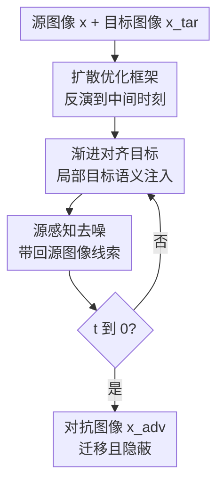

# Transferable and Stealthy Adversarial Attacks on Large Vision-Language Models

**会议**: ICLR2026  
**OpenReview**: [https://openreview.net/forum?id=liQueBuFXi](https://openreview.net/forum?id=liQueBuFXi)  
**代码**: 待发布  
**领域**: 多模态大模型安全 / LVLM 对抗攻击  
**关键词**: 大视觉语言模型安全, 黑盒迁移攻击, 隐蔽对抗样本, 扩散模型, 渐进语义注入

## 一句话总结

这篇论文提出 Progressive Semantic Infusion (PSI)，用扩散模型把目标图像的自然语义逐步注入源图像，在保持视觉隐蔽性的同时显著提升对 GPT-5、Grok-4、Gemini 等黑盒大视觉语言模型的迁移攻击成功率。

## 研究背景与动机

**领域现状**：针对大视觉语言模型 (LVLM/VLM) 的黑盒攻击，常见做法是先找一个白盒替代模型，比如 CLIP 或 BLIP 系列，再优化一张源图像，让它在替代模型上的视觉特征接近目标图像。攻击者真正想要的是：受害模型看到被改过的源图像后，输出像是在描述目标图像的文本；但因为商业 LVLM 的参数、梯度和训练数据都不可见，只能依赖这种“替代模型上对齐，黑盒模型上迁移”的路径。

**现有痛点**：固定特征对齐并不等于可迁移。AttackVLM、CoA 等方法可以把 adversarial image 在替代模型上推向目标特征，但这个优化发生在像素空间，很容易把样本推离自然图像分布；一旦样本变成“替代模型喜欢、真实 LVLM 不买账”的非自然解，迁移性就会掉。另一类方法如 AnyAttack、M-Attack、FOA 虽然更强地注入目标语义，常常能攻击成功，却会留下肉眼可见或模型可检测的纹理、轮廓、overlay、artifact，使攻击在输入层或输出层暴露。

**核心矛盾**：迁移攻击需要目标语义足够强，隐蔽攻击又要求源图像看起来仍像原图，二者之间不是简单的 $\ell_\infty$ 预算能解决的权衡。论文的关键判断是：黑盒 LVLM 和替代模型都在大规模自然图像-文本数据上训练，如果对抗样本既贴近目标语义，又仍落在自然图像分布附近，那么它更可能在不同模型之间产生一致的语义响应。

**本文目标**：作者把目标拆成三个子问题：第一，如何在攻击优化里显式利用自然图像分布，而不是只追替代模型特征相似度；第二，如何避免单一固定目标导致过拟合，让攻击信号沿生成过程逐步注入；第三，如何让最终图像仍保留源图像的视觉线索，避免被人或 LVLM 识别为“被篡改的图”。

**切入角度**：扩散模型本身就是在自然图像分布上训练出来的生成先验，反向去噪过程可以被看作把样本往自然图像流形上拉。作者于是不用传统的像素级迭代扰动作为主舞台，而是在 DDPM 去噪轨迹中一边生成、一边对齐、一边把源图像信息带回去。

**核心 idea**：用“扩散先验约束自然性 + 渐进局部语义对齐提升迁移性 + 源感知 DDPM inversion 保持隐蔽性”替代单一固定特征对齐，从而生成既能跨模型攻击又不容易露馅的 LVLM 对抗图像。

## 方法详解

### 整体框架

PSI 的输入是一张源图像 $x$ 和一张目标图像 $x_{tar}$，输出是一张对抗图像 $x_{adv}$：它在人眼看来应当接近源图像，但让黑盒 LVLM 产生接近目标图像的描述。整体流程先把源图像反演到扩散模型的中间时刻 $t^*$，再从 $t^*$ 到 0 执行去噪；每个 timestep 都会用当前的局部目标区域做一次替代模型特征对齐，并用带源图像线索的噪声项保持视觉一致性。

作者先把传统固定目标写成 $L_{fixed}=\cos(f_{tar}, f_{adv})$，再指出这只管替代模型对齐，不管样本是不是自然。PSI 实际要近似优化的是联合目标 $L_{joint}=p_F(f_{tar}\mid x_{adv})\cdot p_D(x_{adv})$：前一项代表替代模型上的目标语义对齐，后一项代表自然图像分布上的可信度。扩散去噪负责自然性，渐进对齐负责攻击语义，源感知噪声负责隐蔽性。

在威胁模型上，攻击者不能查询或修改受害 LVLM，也不能改 prompt、system instruction 或其他文本输入，只能制作一张之后会被 LVLM 消费的恶意图像。攻击目标不是让模型输出某个固定标签，而是让模型对 $x_{adv}$ 的自然语言描述在语义上接近目标图像 $x_{tar}$ 的描述。

### 关键设计

**1. 扩散优化框架：把自然性放进攻击过程本身**

传统迁移攻击往往直接在像素空间优化 $\cos(F(x_{adv}),F(x_{tar}))$，这会把“替代模型上的高相似度”误当成“黑盒 LVLM 上的可迁移性”。PSI 的第一步是把自然性也放进目标：如果 $F$ 和黑盒模型 $M$ 都来自相近的自然图文数据分布，那么更自然的 $x_{adv}$ 更可能让二者产生一致语义。论文把这个想法写成 $L_{joint}=p_F(f_{tar}\mid x_{adv})\cdot p_D(x_{adv})$，其中 $p_D(x_{adv})$ 虽然不能直接求导，但可以由扩散模型的去噪先验近似承担。

DDPM 的反向一步为 $x_{t-1}=\mu(x_t,t)+\sigma_t\epsilon_t$，而 $\mu(x_t,t)$ 可以近似看作 $x_t+\sigma_t^2\nabla_{x_t}\log p_D(x_t)$。这意味着每次去噪都在把样本往自然图像分布高密度区域推。PSI 先对源图像做 diffusion inversion 得到中间潜变量 $x_{t^*}$，再沿 $t^*,t^*-1,\dots,1$ 去噪；攻击扰动不只在最终图像上加，而是在每个去噪步注入：$x_{t-1}=\mathrm{Denoise}_t(x_t)+\mathrm{Perturbation}(t)$。这样，攻击信号一边被注入，一边接受扩散先验的“自然化”约束。

**2. 渐进对齐目标：避免固定全局目标把样本推向非自然过拟合解**

单一固定目标的问题在于它会让优化一直追同一个全局 target feature，容易学到替代模型的局部偏好，而不是黑盒 LVLM 也会认的自然语义。PSI 把一次全局对齐改成一串随 timestep 变化的局部对齐目标 $\{L_{align}(t)\}_{t=1}^{t^*}$。每一步只做一次小更新：$\mathrm{Perturbation}(t)=\gamma\cdot\mathrm{Clip}_\infty(\nabla_{\mu(x_t,t)}L_{align}(t),\delta)$，其中 $\gamma$ 控制指导强度，$\delta$ 限制该步梯度扰动幅度。

关键不只是“裁剪区域”，而是目标区和源区一起演化。对目标图像，PSI 先用 SAM 找到显著物体区域 $o_t$，再用插值把参考区域 $r_t$ 从紧凑的语义主体逐步扩展到完整目标图像：$r_t=\mathrm{Interpolation}(o_t,x_{tar},1-t/t^*)$。早期先注入最清楚的主体语义，后期再引入更复杂的全图上下文。对当前 adversarial latent，PSI 随机采样 $N$ 个同尺度候选局部区域，再选择与 $r_t$ 在替代模型特征上最相似的那个 $a_t=\arg\max_{a\in A_t}\cos(F(a),F(r_t))$。这种 co-evolving selection 比纯随机 crop 更稳定，因为它让每一步的源区域和目标区域在语义上有较近的对应关系。

这种设计实际上把“目标语义注入”做成 curriculum：先对齐简单、主导、局部的目标概念，再逐步增加背景和细节；同时，局部区域在不同时间变化，相当于给固定目标加了空间多样性正则。论文的实验也显示，直接去掉 progressive alignment 时 GPT-5 ASR 从 78.6% 掉到 22.8%，说明它不是小修小补，而是迁移性的核心来源。

**3. 源感知去噪：把隐蔽性从后处理变成生成轨迹约束**

如果只用普通 DDIM inversion 或确定性采样，源图像的信息主要被编码在起点 $x_{t^*}$ 里；一旦后续每步都注入攻击扰动，最终图像可能逐渐偏离源图像，变成“语义上像目标、视觉上露馅”的样本。PSI 的做法是把源图像线索写进每个 timestep 的噪声项，而不是只依赖初始 latent。

具体地，作者先用源图像构造一串前向加噪状态 $\hat{x}_t=\sqrt{\bar{\alpha}_t}x+\sqrt{1-\bar{\alpha}_t}n_t$，再反推每一步对应的噪声 $\hat{\epsilon}_t=(\hat{x}_{t-1}-\mu(\hat{x}_t,t))/\sigma_t$。这些 $\hat{\epsilon}_t$ 不再是独立高斯噪声，而携带了源图像的纹理、布局和低层视觉线索。真正生成时，PSI 使用 $\mathrm{Denoise}_t(x_t)=\mu(x_t,t)+\sigma_t\hat{\epsilon}_t$，让每个去噪步都受到源图像的牵引。

这个设计解释了为什么 PSI 的 stealthiness 不是简单靠小扰动预算。论文中 `w/o source-aware denoising` 的 GPT-5 ASR 甚至略高到 81.0%，但 S-ASR 从 62.8% 掉到 57.0%，LPIPS 从 0.192 变差到 0.241。也就是说，不带源感知去噪可以更激进地攻击，却更容易让视觉一致性破裂；PSI 有意牺牲一小部分攻击强度，换来更高的输出层隐蔽性。

### 一个完整示例

可以把论文里的“鞋子被攻击成 giraffe”理解成 PSI 的典型工作方式。源图像是一双鞋，目标图像包含长颈鹿语义。如果用 CoA 这类固定对齐，放大扰动后主要是非语义噪声；如果用 AnyAttack 或 M-Attack，图像里会出现较明显的长颈鹿轮廓或纹理叠加，模型可能被欺骗，但人或 LVLM 也容易说出“overlay”“artifact”之类暴露词。

PSI 的流程更像“在鞋面上自然地长出一点长颈鹿相关纹理”。早期 timestep 先从目标图中选显著主体区域，把粗粒度 giraffe 语义注入当前 adversarial latent；中间 timestep 通过 co-evolving selection 在鞋面等更合适的源区域上做局部对齐；后期 timestep 逐渐扩展到目标图的更完整区域，同时源感知噪声不断把鞋子的原始形状和布局带回来。最后，GPT-5 可能在 caption 中提到与目标语义相关的内容，但图像本身不出现突兀大块贴图，输出也较少触发“neural artifacts”警告。

这个例子也说明 PSI 的攻击不是把目标物体硬贴到源图上，而是把目标概念以局部、渐进、受源图约束的方式融入源图。它追求的是让 LVLM 的语义理解偏向目标，而不是让人眼直接看到完整目标物体。

### 损失函数 / 训练策略

PSI 使用 CLIP 系列作为替代模型，包括 ViT-B/16、ViT-B/32 和 ViT-g-14 laion2B-s12B-b42K，默认取多个 surrogate 的 mean similarity。核心对齐损失是局部区域间的 cosine similarity：$L_{align}(t)=\cos(F(a_t),F(r_t))$。每一步梯度只作用在被选中的局部 adversarial region 上，区域之外为 0，然后通过 $\gamma\cdot\mathrm{Clip}_\infty(\cdot,\delta)$ 控制注入强度。

实现上，作者使用 stable-diffusion-2-1 作为生成模型，用 SAM 从目标图像中检测显著物体区域。默认 $t^*$ 设为总扩散步数的 20%，候选区域数 $N=4$，随机尺度因子 $s\in[0.4,0.9]$，指导强度 $\gamma=20$，裁剪阈值 $\delta=0.0025$。论文附录还给出一个直觉性证明：在同等有效对齐贡献下，把小扰动分散到多个 timestep，比集中在单一步注入会带来更小的二阶自然性损失，因此更符合联合目标。

## 实验关键数据

### 主实验

论文在图像描述任务上评估攻击，prompt 为 “Describe this image in 30 words.”。受害模型覆盖开源模型 MiniGPT-4、对抗鲁棒模型 FARE4，以及 GPT-5、Gemini-2.5 Flash、Grok-4、Claude-3.5 Sonnet 等商业模型。迁移性用 ASR 衡量：GPT-4o judge 判断对抗图输出和目标图输出的语义相似度，分数大于等于 0.3 视为成功。隐蔽攻击成功率 S-ASR 进一步要求输出中不能出现 artifact、overlay、adversarial、perturbed 等暴露攻击痕迹。

| 方法 | MiniGPT-4 ASR / S-ASR | FARE4 ASR / S-ASR | GPT-5 ASR / S-ASR | Gemini-2.5 ASR / S-ASR | Grok-4 ASR / S-ASR | Claude-3.5 ASR / S-ASR | BRISQUE↓ | LPIPS↓ |
|------|-----------------------|-------------------|-------------------|-------------------------|---------------------|--------------------------|----------|--------|
| AttackVLM | 8.9 / 8.2 | 0.3 / 0.2 | 3.0 / 2.7 | 2.7 / 2.1 | 2.6 / 2.0 | 0.4 / 0.1 | 53.93 | 0.262 |
| CoA | 13.5 / 13.2 | 0.7 / 0.6 | 9.6 / 7.6 | 9.3 / 8.0 | 6.3 / 5.7 | 1.2 / 0.5 | 55.64 | 0.258 |
| AdvDiffVLM | 29.1 / 28.5 | 14.2 / 13.9 | 13.1 / 8.9 | 14.9 / 12.5 | 13.0 / 11.6 | 4.5 / 3.3 | 22.59 | 0.214 |
| AnyAttack | 33.2 / 28.6 | 11.6 / 9.2 | 24.5 / 11.2 | 31.5 / 20.8 | 26.6 / 19.4 | 7.0 / 3.9 | 68.32 | 0.478 |
| M-Attack | 82.4 / 77.1 | 53.2 / 49.5 | 73.8 / 54.5 | 71.4 / 64.3 | 77.9 / 70.0 | 12.4 / 9.8 | 47.68 | 0.209 |
| FOA | 84.7 / 77.5 | 54.4 / 51.0 | 75.8 / 56.5 | 73.5 / 63.4 | 80.0 / 72.7 | 14.6 / 10.4 | 50.37 | 0.217 |
| PSI | 85.1 / 82.3 | 64.3 / 63.5 | 78.6 / 62.8 | 75.8 / 71.5 | 81.4 / 75.0 | 21.8 / 15.2 | 22.14 | 0.192 |

PSI 在所有受害模型上都取得最高 ASR，并且 S-ASR 也整体最高。尤其在 GPT-5 上，FOA 的 ASR/S-ASR 为 75.8/56.5，PSI 提升到 78.6/62.8；在 adversarially robust 的 FARE4 上，PSI 的 S-ASR 达到 63.5，明显高于 FOA 的 51.0，说明它不只是攻击普通模型，对鲁棒模型也更难防。

| 防御 | 方法 | GPT-5 ASR | GPT-5 S-ASR | 变化解读 |
|------|------|-----------|-------------|----------|
| Gaussian smoothing | FOA | 58.7 | 48.2 | 相比原始 75.8 / 56.5 明显下降 |
| Gaussian smoothing | PSI | 61.1 | 56.6 | ASR 下降，但 S-ASR 只从 62.8 降到 56.6 |
| JPEG compression | FOA | 61.9 | 48.9 | 像素扰动被压缩破坏 |
| JPEG compression | PSI | 64.9 | 56.7 | 语义注入比像素噪声更耐 JPEG |
| DiffPure | FOA | 19.7 | 14.7 | 扩散净化对传统扰动杀伤很大 |
| DiffPure | PSI | 34.2 | 29.6 | 仍下降，但保留更多攻击能力 |

防御实验说明 PSI 的 unrestricted perturbation 和自然语义注入不容易被简单平滑、压缩或扩散净化完全抹掉。它不是局部高频噪声主导的攻击，因此在防御后仍保留更多目标语义。

### 消融实验

| 配置 | GPT-5 ASR | GPT-5 S-ASR | BRISQUE↓ | 说明 |
|------|-----------|-------------|----------|------|
| PSI 完整版 | 78.6 | 62.8 | 22.14 | 三个组件同时启用 |
| w/o diffusion (16/255) | 75.5 | 57.0 | 51.49 | 去掉扩散先验后图像质量显著变差 |
| w/o diffusion (12/255) | 65.5 | 47.4 | 42.45 | 减小预算改善质量但牺牲攻击 |
| w/o progressive alignment | 22.8 | 15.0 | 22.28 | 自然性还在，但目标语义注入失败 |
| w/o co-evolving selection | 71.3 | 52.5 | 25.60 | 随机局部对齐不如语义对应稳定 |
| w/o source-aware denoising | 81.0 | 57.0 | 23.60 | ASR 略高但隐蔽性和 LPIPS 变差 |

最关键的消融是去掉 progressive alignment：BRISQUE 仍接近完整 PSI，说明图像仍自然，但 ASR/S-ASR 崩掉。这说明扩散先验负责“像自然图”，渐进对齐负责“像目标语义”；二者缺一不可。去掉 source-aware denoising 的 ASR 变高但 S-ASR 变低，也支持作者的论点：强攻击和隐蔽攻击不是同一个指标。

### 关键发现

- 渐进对齐是迁移性的最大贡献项。固定目标即使配合扩散生成，也会让 GPT-5 ASR 从 78.6 掉到 22.8，说明单一全局特征对齐确实容易走向对迁移无效的解。
- 扩散先验主要改善自然性和输出层隐蔽性。PSI 的 BRISQUE 为 22.14，接近 AdvDiffVLM 的 22.59，远好于 AnyAttack 的 68.32；同时 LPIPS 0.192 也是表中最低。
- 商业模型不一定更难被攻击，但更会识别攻击痕迹。GPT-5、Grok-4 的 ASR 接近 MiniGPT-4，但 S-ASR 相对更低；Claude-3.5 的 ASR/S-ASR 最低，表现出更强鲁棒性。
- 目标图像越简单、主体越明确，迁移越容易。附录中 M-Attack 在低复杂度目标上的 GPT-5 ASR 为 81.4%，高复杂度全图目标为 73.8%，支持 PSI 从显著主体到全图的 curriculum 设计。
- PSI 的隐蔽性仍不是完美无痕。附录检测实验显示，GPT-5、Gemini-2.5、Grok-4 对 PSI 样本仍有 82%、85%、85% 的检测准确率，只是低于多数基线；模型常抓到的是物体关系、边界、透视、纹理一致性等场景级异常。

## 亮点与洞察

- **把迁移性和自然性统一到一个目标里**：论文没有只说“扩散模型生成更自然”，而是先提出 $p_F(f_{tar}\mid x_{adv})\cdot p_D(x_{adv})$ 这样的联合目标，再用扩散去噪近似自然性项。这让方法设计比单纯堆模块更有解释力。
- **渐进语义注入比强行贴目标更隐蔽**：AnyAttack 之类方法常把目标概念以明显轮廓或纹理 overlay 的方式打到图像上；PSI 更像在源图已有结构上长出目标相关语义，使 LVLM 的 caption 偏移，但人眼不一定直接看到完整目标物体。
- **S-ASR 是比 ASR 更适合 LVLM 攻击的指标**：大模型会在输出中说“这是带噪声/overlay 的图”，这对真实攻击场景几乎等于失败。论文把攻击成功和输出不暴露结合起来评价，很贴近多模态模型的使用方式。
- **局部目标课程学习可以迁移到其他黑盒攻击**：从显著主体开始，再扩展到完整上下文，这个设计不只适用于图像扩散攻击，也可用于视频、3D 或多对象 VLM 攻击中的逐阶段目标语义注入。
- **防御启发很直接**：PSI 的成功说明只检测高频噪声不够，鲁棒 LVLM 需要同时具备 adversarial awareness 和语义稳定性；附录指出 Claude 可能更鲁棒却不敏感，这个 trade-off 值得后续系统研究。

## 局限与展望

- PSI 主要注入目标图像的核心语义，细粒度纹理、材质和复杂空间关系仍不稳定。作者在附录承认，它在语义注入和隐蔽性之间做了取舍，不能保证完整复现目标图的所有细节。
- 当源图像结构非常干净、语义非常明确，目标图像又复杂或抽象时，扰动更容易显眼。论文的 failure case 显示，平滑或视觉空白的源图会让 donut-like perturbation 更突出，隐蔽性下降。
- 评估仍依赖 LLM-as-a-Judge。虽然用 GPT-4o judge 语义相似度和隐蔽性很符合 LVLM 场景，但 judge 本身的偏差、阈值 0.3 的选择、不同模型输出风格都会影响 ASR/S-ASR。
- 威胁模型是 image-only targeted transfer attack，攻击者不能改 prompt，也不能查询受害模型。这个设定很现实，但不覆盖多轮交互、agentic VLM、工具调用链路中的更复杂攻击。
- 防御侧还只是初步测试 Gaussian、JPEG、DiffPure。未来更有价值的是把 PSI 当成训练或评测数据，系统研究多模态鲁棒训练、场景一致性检测、跨模型 adversarial warning 校准。

## 相关工作与启发

- **vs AttackVLM / CoA**: 这些方法沿用固定替代模型特征对齐，优化目标清楚但容易过拟合 surrogate，迁移性弱。PSI 的区别在于把固定全局目标拆成随扩散过程演化的局部目标，并用扩散先验减少非自然解。
- **vs M-Attack / FOA**: M-Attack 和 FOA 通过 random cropping、local feature alignment 提升迁移性，PSI 可以看作把这种局部对齐推进到 diffusion trajectory 中，并用 co-evolving selection 让源区和目标区更有语义对应。结果上，PSI 在 GPT-5 S-ASR 从 FOA 的 56.5 提升到 62.8。
- **vs AnyAttack**: AnyAttack 能生成强语义扰动，但常有明显 neural artifacts，BRISQUE 和 LPIPS 都很差。PSI 的优势是让目标语义嵌进源图结构，而不是以大范围混合或贴图方式出现。
- **vs AdvDiffVLM**: 两者都用扩散模型改善 imperceptibility，但 AdvDiffVLM 的迁移性弱，GPT-5 ASR 只有 13.1。PSI 的关键增量是 progressive alignment 和 source-aware denoising，使扩散不只是“美化器”，而成为攻击优化的一部分。
- **对安全研究的启发**: 这篇论文提醒我们，LVLM 安全不能只看文本 jailbreak 或显式有害内容过滤。图像侧的自然语义注入可以在不改 prompt 的情况下改变模型理解，因此安全评测应包含 targeted image-only transfer attacks、输出层 warning 检测，以及对场景级语义异常的鲁棒判断。

## 评分

- 新颖性: ⭐⭐⭐⭐⭐ 从联合目标到扩散轨迹中的渐进局部对齐，方法动机和实现都比较完整，不是简单组合已有攻击技巧。
- 实验充分度: ⭐⭐⭐⭐⭐ 覆盖开源、鲁棒、商业模型，包含 ASR/S-ASR、视觉质量、防御、组件消融、超参数和失败案例，证据链很扎实。
- 写作质量: ⭐⭐⭐⭐ 论文主线清楚，公式和图能支撑方法理解；部分实验依赖未来模型命名和 LLM judge，读者需要留意评测设定的可复现性。
- 价值: ⭐⭐⭐⭐⭐ 对 LVLM 安全评测和防御都有直接价值，尤其强调了“攻击成功但输出暴露”这一过去容易被忽略的问题。

<!-- RELATED:START -->

## 相关论文

- [\[ICLR 2026\] AdPO: Enhancing the Adversarial Robustness of Large Vision-Language Models with Preference Optimization](adpo_enhancing_the_adversarial_robustness_of_large_vision-language_models_with_p.md)
- [\[ICLR 2026\] Sampling-aware Adversarial Attacks against Large Language Models](sampling-aware_adversarial_attacks_against_large_language_models.md)
- [\[ICML 2025\] X-Transfer Attacks: Towards Super Transferable Adversarial Attacks on CLIP](../../ICML2025/llm_safety/x-transfer_attacks_towards_super_transferable_adversarial_attacks_on_clip.md)
- [\[ICLR 2026\] VEAttack: Downstream-Agnostic Vision Encoder Attack Against Large Vision Language Models](veattack_downstream-agnostic_vision_encoder_attack_against_large_vision_language.md)
- [\[ICLR 2026\] Time-To-Inconsistency: A Survival Analysis of Large Language Model Robustness to Adversarial Attacks](time-to-inconsistency_a_survival_analysis_of_large_language_model_robustness_to_.md)

<!-- RELATED:END -->
