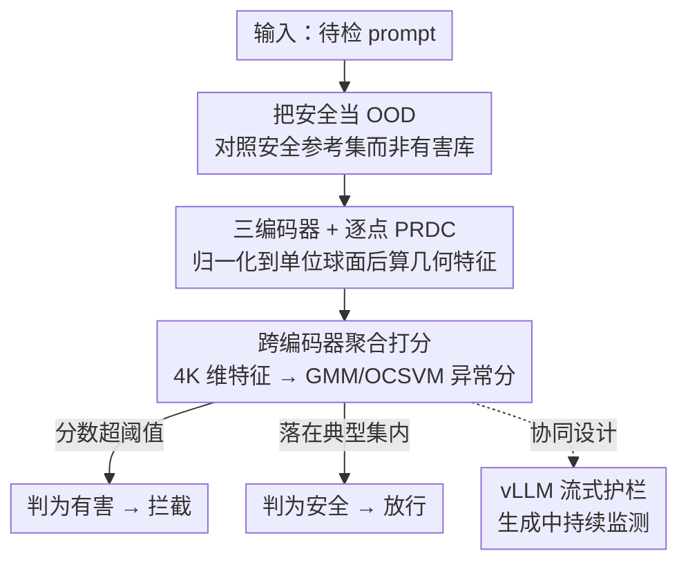

# Trust The Typical：把 LLM 安全护栏当作分布外检测来做

**会议**: ICLR 2026  
**OpenReview**: [https://openreview.net/forum?id=vfbeleLBWv](https://openreview.net/forum?id=vfbeleLBWv)  
**领域**: LLM安全 / 对齐  
**关键词**: LLM 安全护栏, 分布外检测, 典型集, PRDC 几何特征, 单类建模

## 一句话总结
本文提出 T3（Trust The Typical），把 LLM 安全护栏从"枚举有害模式"翻转为"刻画安全分布"——只在安全英文文本上建模语义空间里的"典型集"，把任何显著偏离都判为潜在威胁；它不需要任何有害样本训练，却在 18 个基准上拿到 SOTA，把误报率最多降低 40 倍，并能零样本迁移到 14+ 语言和多个专业领域。

## 研究背景与动机

**领域现状**：当下主流的 LLM 安全做法是"反应式"的——训练专门的分类器（LlamaGuard、WildGuard、PolyGuard 这类）去识别已知类别的有害内容和对抗 prompt，或者靠 RLHF、Constitutional AI 这类对齐技术把模型的行为往安全方向掰。这些方法的共同前提是：先把"什么是有害的"枚举清楚，再去拦。

**现有痛点**：这套范式本质上是一场"猫鼠游戏"，而且天然对防守方不利。攻击者只要找到一个落在分类器训练分布之外的新 prompt 结构（多轮越狱、角色扮演、编码混淆……），就能绕过防御；而防守方必须不断扩充自己的有害模式库才能跟上。结果就是新攻击的出现速度永远快于防御系统的适配速度。更糟的是，专门的安全模型往往撞上"精度天花板"：哪怕检测 AUROC 还不错，误报率却高得离谱——比如 DuoGuard 在 OffensEval 上有 75.2% 的安全 prompt 被误判为有害，这种过度拒绝（over-refusal）让模型在生产环境里几乎不可用。

**核心矛盾**：反应式防御只能挡住"已知"的攻击模式，无法预判和抵御"未知"的新型攻击。但作者注意到，所有对抗 prompt 有一个共同的统计特征——它们必须偏离自然语言的统计规律，才能去触发模型学到的漏洞。现有防御恰恰没有系统性地利用这一点。

**切入角度**：作者从信息论的"典型集"（typical set, Cover & Thomas）出发。观察是：合法用户与 LLM 的交互尽管表面五花八门，在模型语义表示空间里却集中占据一个相对狭窄的区域；而对抗 prompt 出于设计需要，往往落在这个区域之外，表现为表示空间中的"非典型点"。再叠加现代 LLM embedding 的各向同性（isotropy）几何性质——向量在高维空间里均匀铺开而不是挤成一个窄锥——使得简单的距离度量就足以区分典型与非典型。

**核心 idea**：与其训练模型去识别"有害"，不如反过来只刻画"安全、合规使用"的分布——把安全护栏重构成一个**分布外检测（OOD detection）问题**。这样做有两个原则性优势：一是只需要"安全用法"的规格说明，省掉了那个需要不断更新的有害样本库；二是对对抗输入的形态不做任何假设，因此天然能防御未曾见过的新型攻击。

## 方法详解

### 整体框架

T3 的总体思路：给定一份只含安全 prompt 的参考语料 $X=\{x_i\}_{i=1}^{m}\sim D_{\text{safe}}^m$，对每个待检 prompt $y_j$，判断它是来自安全分布 $D_{\text{safe}}$（放行）还是来自未知的有害分布 $D_{\text{harmful}}$（拦截）。整条流水线是一个清晰的串行管线：待检文本先过多个句向量编码器并归一化，然后相对安全参考集计算逐点几何特征（PRDC），把多编码器的特征拼成一个向量，最后送进一个**只在安全数据上拟合**的密度估计器算异常分数，超过阈值就判为有害。

这套设计的精髓在于它把"安全"定义成一种几何性质而非语义清单：有害内容——无论是恶意代码、HR 违规还是越狱 prompt——都会在表示空间里留下一个"偏离典型集"的一致几何签名，所以一个模型就能跨领域、跨语言通用。

### 关键设计

**1. 把安全重构成"信任典型"的 OOD 检测：建模安全分布而非枚举有害**

这一步针对的是反应式防御那个根本性的不对称——防守方永远在追着攻击者补有害模式库。T3 直接换了问题：不再问"这条 prompt 像不像某种已知有害模式"，而是问"这条 prompt 是否落在安全用法的典型集里"。形式化地，在零假设 $H_0: D_{\text{test}}=D_{\text{safe}}$ 下，安全 prompt 的特征应当符合某个可刻画的统计规律，任何显著偏离都被视为潜在威胁。这样做之所以有效，是因为它把对抗鲁棒性的来源从"我见过多少种攻击"换成了"我对安全有多了解"：对有害输入的形态不做任何假设，于是对未知的新型攻击（unknown-unknowns）也能防——这正是合成数据/Outlier Exposure 这类方法做不到的（它们仍需一个"OOD 预言机"去预判威胁）。代价是它依赖一个真正干净的安全参考集（见局限）。

**2. 三编码器 + 逐点 PRDC 几何特征：把"偏离典型"量化成可检验的统计量**

光有"建模典型集"的原则还不够，需要一个能在高维空间里稳健区分典型/非典型的具体度量。本文把 Forte 框架从视觉迁移到文本：对每个文本 $x$ 用三个句向量编码器 $E_1$(Qwen3-Embedding-0.6B)、$E_2$(BGE-M3)、$E_3$(E5-Large-v2)，各自归一化到单位超球面 $\phi_k(x)=E_k(x)/\lVert E_k(x)\rVert_2$，既保证用余弦相似度计算，又消除编码器各自的尺度差异。对每个编码器和每个待检点 $y_j$，相对参考集计算四个逐点几何特征（per-point PRDC）：Precision 判断 $y_j$ 是否落在参考流形 $S_k(X)=\bigcup_i NB_k(\phi_k(x_i);X)$ 内、Recall/Density/Coverage 则刻画 $y_j$ 的近邻里有多少安全样本、密度比如何。论文证明了在 $H_0$ 下这些量的期望（定理 3.1，如 $E[\text{Recall}]=k/n$、$E[\text{Density}]=1/m$、$\lim_{m\to\infty}E[\text{Precision}]=1$），并进一步在三种分布失配的情形——部分支撑失配、密度漂移、局部扰动——下证明 PRDC 是一致检验，能区分零假设与备择假设（如部分支撑失配时 $\lim_{m\to\infty}E[\text{Precision}]=1-\alpha<1$）。这套逐点、非对称（复用参考集结构、可扩展）的两样本检验思路，正是它区别于经典 pooled-graph 全局检验的地方。

**3. 跨编码器聚合 + 单类密度估计打分：从几何特征到一个异常分数**

理论保证了 PRDC 能捕捉分布差异，但没直接给出区分两个分布的阈值。于是 T3 把所有编码器的 PRDC 拼成一个多视角表示 $T(y_j)=[\text{PRDC}_1^{(j)},\dots,\text{PRDC}_K^{(j)}]\in\mathbb{R}^{4K}$，让在单个 embedding 空间里不明显的语义异常通过多视角互相印证暴露出来。然后**只在安全（ID）数据**上拟合两种互补的密度估计器——用 BIC 选分量数的高斯混合模型（GMM）、以及 RBF 核、$\nu$ 经验证调优的单类支持向量机（OCSVM）；待检点的异常分数取拟合模型下的负对数似然，再经 sigmoid 归一化到 $[0,1]$。关键是整个打分链条里没有任何有害标签或测试数据参与训练，阈值也不按基准逐个调，从评估到训练没有数据泄漏——这保证了它对"未见过的攻击"的评测是公平的。

**4. 与 vLLM 协同设计的流式护栏：让连续安全监测在生产里真的跑得动**

安全护栏要落地，延迟开销是绕不过去的坎。T3 直接集成进 vLLM 推理框架：不像后处理方案那样等整段输出生成完再评估，而是在 token 生成过程中持续做安全评估，一旦发现有害就立即终止生成。实现上利用了 vLLM 的多进程架构——在大部分时间空闲的主进程里拦截并访问输出，让安全计算与工作进程的推理在同一张 GPU 上重叠进行。配合对安全评估的批处理（每 20 token 评估一次、批 32），在 5000 prompt 负载下仅引入 <6% 的开销（500 prompt 下仅 1.5%）。这是已知首个能把在线连续安全监测的开销压到 10% 以下的框架。

## 实验关键数据

实验在 18 个基准上展开，ID 语料来自 Alpaca / Dolly / OpenAssistant 三个安全指令数据集（约 40K 例），**不含任何有害样本**。核心指标是 AUROC（越高越好）和 FPR@95（在抓住 95% 有害 prompt 的前提下误伤多少安全 prompt，越低越好，对安全场景最关键）。

### 主实验：毒性 / 仇恨言论检测（6 个基准）

| 基准 | 指标 | T3+OCSVM | 最佳专用模型 baseline | 说明 |
|------|------|----------|----------------------|------|
| OffensEval | FPR@95 | **2.0%** | 75.2% (DuoGuard) | 误报降低约 37× |
| Davidson | FPR@95 | **3.5%** | 61.7% (DuoGuard) | AUROC 0.991 |
| OffensEval | AUROC | **0.994** | 0.827 (DuoGuard) | — |
| CivilComments | AUROC / FPR@95 | 0.968 / 17.2% | 0.879 / 67.4% (DuoGuard) | — |

传统 OOD 方法（CIDER、RMD、VIM、ReAct 等）在语义安全任务上几乎全军覆没，FPR@95 普遍 >90%，完全不可用；专用安全模型 AUROC 尚可但撞上"精度天花板"，误报极高。T3 在检测和精度上同时实现数量级提升，6 个基准里 5 个 AUROC≥0.96。

### 零样本对抗 / 越狱防御（RQ2）

只在安全数据上训练，T3 对 AdvBench、HarmBench、JailbreakBench、MaliciousInstruct 等 6 个对抗基准提供"攻击无关"的防御。例如 AdvBench 上 FPR@95 降到 15.8%，比 PolyGuard 提升 4.2×。相比之下专用模型呈现"攻击特异"的脆弱性，最强的 PolyGuard 在每个基准上仍误判 >64% 的安全 prompt。

### 跨领域 / 跨语言迁移（RQ4）

| 设置 | T3 表现 | baseline 对比 |
|------|---------|---------------|
| PolyGuard Code | AUROC 99.6%, FPR@95 0.9% | 专用模型在本领域也表现差 |
| PolyGuard HR | AUROC 99.7%, FPR@95 0.6% | FPR@95 提升 40–100× |
| 14+ 语言 (RTP-LX/XSafety) | T3+OCSVM AUROC 方差 <0.6% | DuoGuard/PolyGuard 语言间方差最高达 28% |

单个英文训练模型零样本迁移到代码、HR、网络安全、教育等专业领域和 14+ 种语言（含日语、阿拉伯语等不同文字系统），几乎不掉点。

### 过度拒绝 / 样本效率 / 部署开销

- **OR-Bench（过度拒绝）**：T3-GMM 取得 22.2% FPR@95、T3-OCSVM 取得最高 0.934 AUROC，相比传统方法把过度拒绝减少约 75%。
- **冷启动**：仅用 500 个安全样本，T3-OCSVM 就已达到高 AUROC，约 1000 样本即收敛到 ≈90% AUROC，无冷启动问题。
- **vLLM 流式**：H200 上 5000 prompt 负载仅 6% 开销（500 prompt 仅 1.5%）；后处理模式下运行时稳定在 60–155 ms，远优于 MDJudge/LlamaGuard（动辄 >1 秒、大批量直接失败）。

### 关键发现
- **LLM 增强变体（Augment）多数情况帮倒忙**：在 embedding 前先用 GPT-OSS-20B 加一段结构化安全分析，会把"边界安全"的 prompt 推向有害分布、降低 OR-Bench 表现；非英语场景偶有小幅提升，但开销不值得。根因是 LLM 常用 prompt 的母语而非英语来标注，破坏了 embedding 一致性。
- **Mahalanobis 距离远胜欧氏距离**（ROC AUC 0.944 vs 0.733）：因为它考虑了安全数据的协方差结构，几何上更贴合典型集这个"空心球壳"环状分布。
- **方法的成败完全取决于 ID 训练集是否真"干净"**（见局限）。

## 亮点与洞察
- **范式翻转本身就是最大亮点**："信任典型"而非"枚举有害"，把对抗军备竞赛里防守方的劣势直接抹平——攻击者再怎么造新花样，只要偏离自然语言统计规律就会暴露。这个视角可迁移到任何"已知正常、未知异常"的检测任务。
- **几何签名的语言/领域无关性**：有害内容在现代多模态 embedding 空间里留下一致的"偏离典型"几何签名，所以一个英文模型能管 14 种语言。这条洞察对多语言安全治理的工程成本（免去多语言数据采集、重训、逐语言校准）意义重大。
- **理论 + 工程双落地**：既给了 PRDC 在多种分布失配下的一致性证明，又把它压进 vLLM 做到 <6% 开销的在线护栏，少见地把"有原理保证"和"能上生产"同时做到了。

## 局限与展望
- **强依赖 ID 训练集的纯净度**：作者诚实地在 Anthropic hh-rlhf 上做了对照——那里"安全"回复本身就含大量脏话，chosen/rejected 余弦相似度 >0.95，于是 T3 和所有 baseline 都退化到随机水平（AUROC≈0.5）。这说明当安全与有害内容的流形重叠时，OOD 路线必然失效。作者把这归为"所有安全方法共有的训练分布依赖"而非 T3 独有缺陷，但实践中"如何策划一个真正代表安全用法的 ID 集"仍是工程难点。
- **边界模糊场景需要混合架构**：对需要上下文意图解析的近边界案例，纯几何典型性筛查不够，作者建议把 T3 的高效离群筛查与基于推理的方法结合。
- **Augment 变体目前得不偿失**：LLM 增强需要"语言感知的输出归一化"才可能有效，当前实现性价比低。
- **三编码器带来固定的多模型推理成本**：虽然单点开销已很低，但相比单一距离度量仍多算了三套 embedding + PRDC。

## 相关工作与启发
- **vs 专用安全分类器（LlamaGuard / WildGuard / PolyGuard / DuoGuard）**：它们做反应式模式匹配，需要有害样本训练，撞精度天花板（误报高、跨领域/跨语言崩塌）；T3 只建模安全分布，零有害样本、误报低一到两个数量级、零样本跨域跨语言。
- **vs 双模型似然比 OOD 方法（base/fine-tuned 似然比）**：它们计算昂贵且假设 base 模型覆盖所有异常；T3 用单类密度估计避开了双模型成本。
- **vs 表示型 OOD（距离度量 / PEFT 激活）**：它们受"微调悖论"困扰——任务微调会破坏检测所需的几何结构；T3 直接在预训练 embedding 的各向同性几何上做，保留了干净结构。
- **vs 合成数据 / Outlier Exposure**：它们仍是反应式的，需要"OOD 预言机"预判威胁，挡不住 unknown-unknowns；T3 对有害形态不做假设，原则上能防未知攻击。

## 评分
- 新颖性: ⭐⭐⭐⭐⭐ 把安全护栏彻底重构成"信任典型集"的 OOD 检测，范式级翻转且有理论支撑
- 实验充分度: ⭐⭐⭐⭐⭐ 18 个基准 + 14 语言 + 多领域 + vLLM 部署，还诚实给出失败案例（hh-rlhf）
- 写作质量: ⭐⭐⭐⭐ 逻辑清晰、动机有力；公式与定理表述偏密，部分需对照附录
- 价值: ⭐⭐⭐⭐⭐ 误报降 40×、跨域跨语言零样本、<6% 在线开销，工程落地价值极高

<!-- RELATED:START -->

## 相关论文

- [\[NeurIPS 2025\] TRUST -- Transformer-Driven U-Net for Sparse Target Recovery](../../NeurIPS2025/llm_safety/trust_--_transformer-driven_u-net_for_sparse_target_recovery.md)
- [\[ACL 2026\] Decomposed Trust: Privacy, Adversarial Robustness, Ethics, and Fairness in Low-Rank LLMs](../../ACL2026/llm_safety/decomposed_trust_privacy_adversarial_robustness_ethics_and_fairness_in_low-rank_.md)
- [\[ICLR 2026\] LLM Unlearning with LLM Beliefs](llm_unlearning_with_llm_beliefs.md)
- [\[ICLR 2026\] RedSage: A Cybersecurity Generalist LLM](redsage_a_cybersecurity_generalist_llm.md)
- [\[ICLR 2026\] Explainable LLM Unlearning through Reasoning](explainable_llm_unlearning_through_reasoning.md)

<!-- RELATED:END -->
