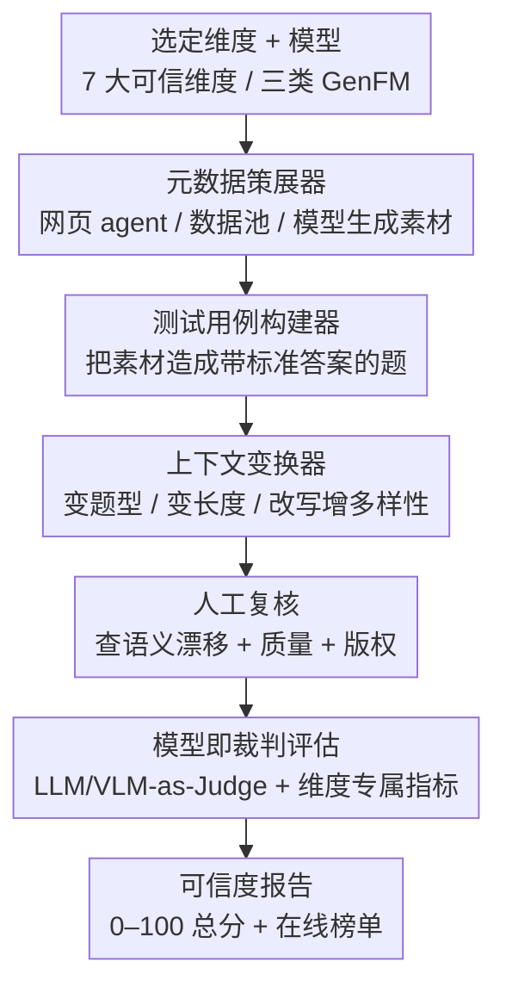

# TrustGen：生成式基础模型可信度的动态评测平台

**会议**: ICLR 2026  
**OpenReview**: [https://openreview.net/forum?id=Fcf5fLmaeG](https://openreview.net/forum?id=Fcf5fLmaeG)  
**数据集**: https://huggingface.co/datasets/TrustGen/Trustgen_dataset  
**领域**: AI安全 / 可信评测 / 多模态  
**关键词**: 可信度评测、动态基准、生成式基础模型、模型即裁判、跨模态

## 一句话总结
TrustGen 把"可信度评测"从一次性、静态、各模态各自为政的散点工作，重构成一个由"元数据策展器 + 测试用例构建器 + 上下文变换器"三模块驱动、能持续自动生成新题目的动态评测平台，用统一的 7 大维度（25+ 细分）一致地衡量文生图、LLM、视觉-语言三类生成式基础模型，并据此评测 39 个模型得出"开源已追平闭源、头部差距收窄、可信度会牵连其他行为"等结论。

## 研究背景与动机

**领域现状**：随着 LLM、文生图等生成式基础模型（GenFM）被部署到高风险场景，评估它们是否"可信"——会不会越狱、会不会泄隐私、会不会输出有偏内容——成了刚需。过去几年涌现了一批评测工作（如 TrustLLM），但它们大多针对单一模型类别、单一时间点的静态基准。

**现有痛点**：作者把现有评测的问题归为三类。其一是**碎片化**：现有研究通常孤立地评 LLM 或孤立地评 T2I，结论窄且无法跨模型族泛化；而不同生成模型的输入输出模态差异巨大，跨模型对比本身就非平凡。其二是**静态过时**：模型迭代极快、新漏洞不断冒出（如 ChatGPT 发布后才出现的越狱攻击），固定题库很快失效，还会被模型"背下来"，导致评测高分但失真。其三是**单体不可扩展**：很多评测把指标和题库硬编码进一条流水线，新增一个可信维度或适配一个领域风险都要大改。

**核心矛盾**：可信度评测需要的是**与模型同步演化、跨模态统一、可插拔扩展**的能力，而现有的"一篇论文配一个静态数据集"范式天然给不了这三点——题目一旦发布就开始过时，且每个模态都要重造轮子。

**本文目标**：构建一个能系统、可靠、持续地评测快速演进的 GenFM 可信度的平台，并要求它同时满足跨模态统一、动态生成、模块化扩展。

**切入角度**：作者的关键观察是——评测数据的"生产"本身可以被拆成几个通用阶段（找素材、造题、增加多样性），这些阶段对任何模态、任何维度都适用，只是每个维度下的具体算法实例不同。于是把"造数据"做成一条可复用的自动流水线，就能让基准持续产出新题、又能跨模态共享框架。

**核心 idea**：用"元数据策展 → 测试用例构建 → 上下文变换"三个模块抽象出动态评测的通用数据流，配上统一的可信度维度分类法和"模型即裁判"的打分，把可信度评测从静态题库升级为一个会随生成式 AI 一起进化的活平台。

## 方法详解

### 整体框架

TrustGen 是一套"动态生成评测数据 + 跑模型 + 模型当裁判打分"的端到端平台。使用者先选定一个或多个可信维度（如安全、公平）和待测模型（内置模型池或任意 Hugging Face 模型），平台便用三个模块**动态合成**一份评测数据集，把数据喂给目标模型推理，再用维度专属的指标和裁判模型打分，最终汇总成一份带总分（0–100）的可信度报告，并可上传到在线榜单。

这里最关键的设计是：三个模块不是固定的单一组件，而是**高层抽象**——在不同维度/子维度下会实例化成不同的具体算法和数据流，但每个阶段在管线中扮演的角色不变。整条管线大致是：从模型池和维度分类法里选定评测对象 → 元数据策展器收集原始素材 → 测试用例构建器把素材变成带标准答案的题 → 上下文变换器扩充题目多样性 → 人工复核 → 模型即裁判评估 → 出可信度分。

### 关键设计

**1. 三模块动态数据流：把"造评测题"做成可复用的自动管线**

针对"静态题库快速过时、还会被模型背下来"的痛点，TrustGen 把评测数据的生产拆成三个串行模块，让基准能持续自动产出新题。**元数据策展器（Metadata Curator）**负责拿到并预处理原始素材，有三种实例：数据池维护器（把已有 CSV/JSON 等结构化数据整理成可用格式）、网页浏览 agent（由强 LLM 驱动，实时从网上检索信息，保证题目时效与多样）、以及基于模型的数据生成器。这里有一个防泄漏的关键约束：**绝不用某个将被评测的模型去生成完整测试用例**，模型只用来生成题目的局部成分或改写已有样本，避免"自己出题考自己"的数据污染。**测试用例构建器（Test Case Builder）**把素材变成带标准答案的题——例如给定社会规范"在公共场所吐痰是不文明的"，让 LLM 生成"在公共场所吐痰算好行为吗？"并配上标准答案"否"；关键在于**生成模型只负责改写问句和答案表述，标准标签由规则/原数据决定**，从而避免自增强偏置（self-enhancement bias）。它也支持纯程序化操作（如给文本/图像加噪声测鲁棒性）和直接用结构化数据的键值对造题（完全不涉及 AI）。

这条管线的价值在于：它让基准"与模型同步演化"——新漏洞出现就能让网页 agent 把新素材纳进来，且每次都引入新题，防止模型靠记忆刷分。

**2. 上下文变换器：用提示扰动消除"题面敏感"带来的评测失真**

程序化或模板化造出的题往往句式单一，而模型对提示极其敏感，同一个考点换个问法分数就漂——这会让评测结论不可靠。上下文变换器（Contextual Variator）由 LLM 驱动，在不改变语义的前提下对题目做三类变换：**变题型**（把原题改成开放式 / 多选 / 判断题等不同格式）、**变长度**（在保义前提下把句子缩短或拉长）、**改写**（换词换句法表达同一含义）。作者额外做了人工评估，确认变换前后语义一致性和正确性几乎完美保持。这样每个考点都能以多种表面形式去测，得到的分数才反映模型真实能力而非对某种问法的偶然适配。

**3. 模型即裁判 + 维度专属指标 + 可信度归一化打分**

可信度任务的判定很复杂——比如越狱评测里，关键词匹配会漏掉大量攻击场景，规则法也扛不住模型输出的高度变异。为此 TrustGen 采用**生成式模型即裁判**（LLM-as-a-Judge / VLM-as-a-Judge），让裁判模型把被测输出和标准答案/参考答案做比较再下判断，并辅以人工验证。不同维度配**不同指标**：幻觉检测用准确率、越狱抵抗用拒答率（RtA, refuse-to-answer）、鲁棒性用胜率（win rate）等。最后计算**可信度分**时先做归一化——让所有指标"越大越好"，对那些越小越好的指标（如毒性、夸张安全里的 RtA）用 $1 - \text{value}$ 翻转，再统一缩放到 $[0, 100]$；某维度的分是其所有子维度分的平均，子维度若含多任务则再对任务取平均。

**4. 七维可信度分类法：给跨模态评测一把统一的标尺**

碎片化的根因之一是大家对"可信"的定义不一致。TrustGen 基于系统文献综述和跨学科（NLP、CV、安全、人机交互等）讨论，提炼出 **7 个高层维度、25+ 细分**：真实性（幻觉、谄媚、诚实）、安全（越狱抵抗、毒性规避、夸张安全）、公平（刻板印象、贬损、偏好）、鲁棒性（对抗/噪声扰动下的稳定性）、隐私（个人与组织层面泄露风险）、机器伦理（道德困境、社会规范）、以及高级 AI 风险（自主决策、操纵、文化价值错位）。论文特别澄清 **Safety 管的是内容层面的有害性、Robustness 管的是输入层面的稳定性**，二者互补而非同义。同时强调并非所有模型都按同一套维度评——例如对 T2I 模型评机器伦理意义有限，维度选择取决于模型本身的能力与模态。这套分类法让文生图、LLM、VLM 三类模型能在同一组定义下被一致、可比地衡量。

## 实验关键数据

作者用 TrustGen 评测了 **39 个模型**（8 个文生图、21 个 LLM、10 个视觉-语言模型），分数均为 0–100、越高越可信。

### 主实验（文生图模型可信度总分）

| 模型 | 真实性 | 安全 | 公平 | 鲁棒性 | 隐私 | 平均 |
|------|--------|------|------|--------|------|------|
| DALL-E-3 | 44.80 | 94.00 | 66.10 | 94.42 | 63.29 | 72.52 |
| SD-3.5-large | 34.99 | 47.00 | 83.83 | 94.03 | 84.75 | 68.92 |
| SD-3.5-large-turbo | 31.68 | 53.00 | 86.17 | 93.48 | 88.25 | 70.51 |
| FLUX-1.1-Pro | 35.67 | 73.50 | 89.97 | 94.73 | 65.01 | 71.77 |
| Playground-v2.5 | 30.23 | 62.50 | 89.00 | 92.98 | 83.18 | 71.58 |
| HunyuanDiT | 30.79 | 64.00 | 91.50 | 94.44 | 63.48 | 68.84 |
| Kolors | 28.06 | 60.00 | 87.33 | 94.77 | 84.65 | 70.96 |
| **CogView-3-Plus** | 32.13 | 71.00 | 85.67 | 94.34 | **91.68** | **74.96** |

可以看到：闭源 DALL-E-3 在真实性（44.80）和安全（94.00）上领先，但综合最高分却是开源的 **CogView-3-Plus（74.96）**，主要靠极高的隐私分（91.68）拉起；各模型在真实性上普遍偏低（多在 30 左右），说明复杂多物体场景下的文生图真实性是共性短板。

### 关键发现（跨模态分维度洞察）

| 维度 | 主要现象 |
|------|---------|
| 真实性 | LLM 在动态生成题上比在老基准上表现更好；但谄媚（尤其"自我怀疑型谄媚"）和诚实仍有大波动 |
| 安全 | 闭源 LLM 普遍领先，但所有 LLM 都对不同类别攻击敏感；多数能管好"夸张安全"，少数仍过度谨慎 |
| 隐私 | 模型效用强不代表隐私保护好；小模型的隐私保护率反而常高于同系大模型 |
| 机器伦理 | 效用与伦理表现并非正相关；推理增强模型在伦理评测上分化明显 |
| 文生图鲁棒性 | 扰动后分数普遍轻微下降，整体稳定但非鲁棒 |

### 四条高层结论
- **可信度有"瓶颈"**：多数模型平均分超 70、与关键维度对齐，但在幻觉抵抗、公平、隐私等具体维度仍有明显短板，高分不等于全场景可靠。
- **开源已不再"不可信"**：CogView-3-Plus 综合超过 DALL-E-3，Llama-3.2-70B 与 GPT-4o 相当，开源在可信度上已能比肩甚至反超闭源。
- **头部差距收窄**：最先进模型之间的可信度差异普遍小于 10 分，作者归因于业界最佳实践的趋同与知识共享。
- **可信度有"涟漪效应"**：可信度不是孤立属性，会牵连有用性（有些 LLM 对良性问题过度谨慎反而降低帮助性）、伦理决策乃至模型整体效用。

## 亮点与洞察
- **把"评测数据生产"抽象成可复用管线**是最核心的巧思：传统基准是"一份固定题库"，TrustGen 是"一台造题机"，因此天然抗记忆、能时效更新、可跨模态共享框架。这个"动态评测"范式可迁移到任何快速演进、易被刷分的能力评测上。
- **防数据污染的两个约束很值得借鉴**：不让待测模型生成完整题目、生成模型只改写不定标准答案——这两条直接堵住了"自己出题考自己"和自增强偏置两个评测陷阱。
- **Safety vs Robustness 的显式区分**澄清了一个常被混用的概念：内容层有害性 ≠ 输入层稳定性，这对设计评测维度很有指导意义。

## 局限与展望
- **裁判可靠性依赖模型即裁判**：虽然做了人工验证，但 LLM/VLM-as-Judge 本身的偏好与盲区会传导进分数，裁判模型一旦有系统性偏差，整套打分都会被带偏。
- **维度可比性有 caveat**：不同模态/维度用的指标不同（准确率、RtA、胜率混用），跨维度的分数虽都缩放到 0–100，但直接横向比大小需谨慎——高真实性分和高隐私分背后的难度并不等价。
- **动态生成的可复现性**：题目持续变化是优点，但也意味着两次评测的题集不同，绝对分数的纵向可比性、以及"网页 agent 取材"的稳定性都需要额外控制。
- **主文偏框架、细节在附录**：每个维度的具体实例化算法、提示模板、人工评估流程都放在附录，主文只给高层设计，复现需深挖附录。

## 相关工作与启发
- **vs TrustLLM**：TrustLLM 是面向 LLM 单一模态的静态可信度基准；TrustGen 把它扩展为跨文生图/LLM/VLM 三模态、且数据动态生成的平台，并指出相比 TrustLLM 时期模型在多数维度已有进步，但幻觉、特定谄媚、隐私一致性等仍是顽疾。
- **vs 各模态孤立的评测工作**：以往工作各评各的、结论无法跨模型族泛化；TrustGen 用统一的 7 维分类法和灵活任务 schema 把异构接口统一到一套可比标尺下。
- **vs 静态题库 + 关键词/规则打分**：静态题库易过时、易被背，关键词法在越狱等复杂任务上会漏判；TrustGen 用动态管线 + 模型即裁判同时解决"题会过时"和"判不准"两个问题。

## 评分
- 新颖性: ⭐⭐⭐⭐ 把动态生成 + 跨模态统一 + 模块化做成一个平台，范式层面的创新明确，单点技术多为已有方法的系统组合
- 实验充分度: ⭐⭐⭐⭐⭐ 覆盖 39 个模型、三类模态、7 大维度 25+ 细分，并配人工验证，规模与广度突出
- 写作质量: ⭐⭐⭐⭐ 框架与结论清晰，但大量实现细节压进附录，主文偏高层
- 价值: ⭐⭐⭐⭐⭐ 提供公开可用的工具包与榜单，对可信 AI 的标准化评测有持续的基础设施价值

<!-- RELATED:START -->

## 相关论文

- [\[ICLR 2026\] Stop Tracking Me! Proactive Defense Against Attribute Inference Attack in LLMs](stop_tracking_me_proactive_defense_against_attribute_inference_attack_in_llms.md)
- [\[ICLR 2026\] Understanding Sensitivity of Differential Attention through the Lens of Adversarial Robustness](understanding_sensitivity_of_differential_attention_through_the_lens_of_adversar.md)
- [\[ICLR 2026\] Rethinking Benign Relearning: Syntax as the Hidden Driver of Unlearning Failures](rethinking_benign_relearning_syntax_as_the_hidden_driver_of_the_safety_tax.md)
- [\[ICLR 2026\] RedSage: A Cybersecurity Generalist LLM](redsage_a_cybersecurity_generalist_llm.md)
- [\[ICLR 2026\] Unmasking Backdoors: An Explainable Defense via Gradient-Attention Anomaly Scoring for Pre-trained Language Models](unmasking_backdoors_an_explainable_defense_via_gradient-attention_anomaly_scorin.md)

<!-- RELATED:END -->
