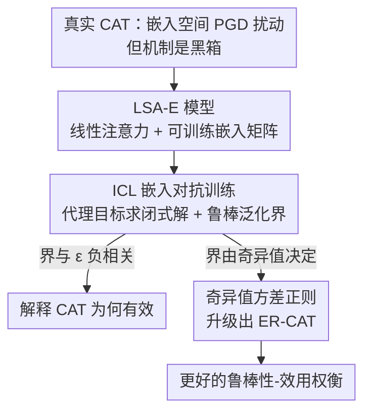

# Understanding and Improving Continuous Adversarial Training for LLMs via In-Context Learning Theory

**会议**: ICLR 2026  
**OpenReview**: [https://openreview.net/forum?id=7zztxcmlyZ](https://openreview.net/forum?id=7zztxcmlyZ)  
**代码**: https://github.com/fshp971/continuous-adv-icl  
**领域**: LLM安全 / 对抗训练 / 越狱防御  
**关键词**: 连续对抗训练, 越狱攻击, 上下文学习理论, 鲁棒泛化界, 嵌入矩阵奇异值

## 一句话总结
这篇论文用上下文学习（ICL）理论首次从理论上解释了「连续对抗训练（CAT）为什么有效」——证明在嵌入空间施加扰动能降低 token 空间越狱攻击的鲁棒风险上界，并据此发现鲁棒性与嵌入矩阵奇异值密切相关，从而提出在 CAT 目标里加一项「奇异值方差正则」的 ER-CAT，在 6 个真实 LLM 上拿到更好的鲁棒性-效用权衡。

## 研究背景与动机
**领域现状**：对抗训练（AT）是目前防御 LLM 越狱攻击最有效的手段之一——把合成的越狱 prompt 喂给模型、教它识别并拒答。但标准 AT 要在离散 token 空间里搜索越狱后缀（求解 Eq.(1) 那种离散优化），代价极高。于是近期出现了连续对抗训练（CAT）：不在 token 空间搜，而是直接在 LLM 的连续 token 嵌入空间里用投影梯度下降（PGD）找对抗扰动 $\delta^*$，速度快得多，经验上也确实能同时防住 token 级和 prompt 级攻击。

**现有痛点**：CAT 在实践中很好用，但「为什么有效」完全是黑箱。关键的违和点在于：CAT 的训练数据是**嵌入向量序列**（连续空间里被扰动过的 embedding），而真实越狱攻击发生在**离散 token 空间**（一串 token 索引）。两者数据形态完全不同，凭什么在嵌入空间加噪声，就能让模型学会抵御 token 空间里合成出来的越狱 prompt？这个机制此前无人能解释。

**核心矛盾**：嵌入空间扰动（训练时所做）与 token 空间攻击（测试时所遭遇）之间存在一道「空间鸿沟」。没有理论保证就无法回答 CAT 的鲁棒性从何而来，更无从指导如何把 CAT 做得更好。

**本文目标**：(1) 给 CAT 一个严格的理论解释——为什么嵌入空间扰动能换来 token 空间的鲁棒性；(2) 顺着理论找到可改进的旋钮，设计出更好的 CAT 算法。

**切入角度**：作者借助近年来用 ICL 理论分析 LLM 鲁棒性的进展（尤其是 Fu et al. 2025 用 ICL 后缀攻击刻画越狱）。思路是：用一个**可解析求解**的线性 transformer + 线性回归 ICL 任务作为「实验室模型」，在里面复刻 CAT 的「嵌入空间扰动」过程，把黑箱变成能算出闭式解和泛化界的玩具系统。

**核心 idea**：给线性自注意力模型装上一个可训练的嵌入矩阵（LSA-E），在它的嵌入空间里做对抗训练，证明出一个鲁棒泛化上界——这个界与嵌入扰动半径 $\epsilon$ 负相关（解释 CAT 为何有效），且取决于嵌入矩阵的奇异值（指出改进方向），于是用「奇异值方差」当正则项把 CAT 升级成 ER-CAT。

## 方法详解

### 整体框架
整篇工作分两段：先在理论侧造一个能算的「替身系统」把 CAT 解释清楚，再把理论结论翻译成一个能在真实 LLM 上跑的正则项。

理论侧的链路是：在标准线性自注意力（LSA）里插入一个可训练嵌入矩阵 $W^E$，得到 **LSA-E** 模型，使它的「先把输入线性映射到嵌入空间、再做注意力」的结构与真实 LLM 的「one-hot × 嵌入矩阵」过程同构；然后在这个嵌入空间里对 in-context 样本施加对抗扰动，定义出 **ICL 嵌入对抗训练（ICL embedding AT）** 的 minimax 问题（Eq.(10)），作为真实 CAT 的理论替身；由于原始 minimax 难有闭式解，先放大成一个可解析的代理目标（surrogate，Eq.(13)），求出最优解的闭式表达（Theorem 1），再据此证明针对 token 空间后缀攻击的**鲁棒泛化上界**（Theorem 2）。这个上界给出两个结论：与嵌入扰动半径 $\epsilon$ 负相关、且由嵌入矩阵奇异值的分布决定。

方法侧则把第二个结论直接落地：在原始 CAT 目标上加一项「嵌入矩阵奇异值方差」正则，让大奇异值变小、小奇异值变大，从而压低理论上界，得到 **ER-CAT**。

### 关键设计

**1. LSA-E：给线性注意力装上嵌入矩阵，让玩具模型对得上真实 LLM**

要解释 CAT，理论模型必须有「嵌入空间」这个东西可供扰动，但以往用于 ICL 分析的线性自注意力（LSA）模型根本没有嵌入模块，没法承载「在嵌入空间加噪声」这个动作。作者的做法是引入一个可训练嵌入矩阵 $W^E\in\mathbb{R}^{d\times d_0}$，把每个 in-context 点 $x_{\tau,i}$ 从原始输入空间 $\mathbb{R}^{d_0}$ 线性映射到嵌入空间 $\mathbb{R}^{d}$，得到 $E(Z_\tau)$（Eq.(6)），再喂进线性自注意力，构成 **LSA-E** 模型 $f_{\text{LSAE},\theta}$，其可训练参数 $\theta:=(W^E, W^{KQ}, W^V)$。

这个设计之所以站得住，是因为真实 LLM 的嵌入过程本质也是「token 的 one-hot 编码 × 嵌入矩阵」的线性变换——与 LSA-E 里的 $W^E x$ 几乎同构；同时已有工作证明线性注意力与真实 LLM 的非线性注意力性质相近。于是 LSA-E 的嵌入空间和真实 LLM 的嵌入空间都来自线性变换、彼此相似，让在 LSA-E 上得到的结论可以外推到真实 CAT。这是整套理论的地基：没有这个嵌入模块，后面的「嵌入空间扰动」无从谈起。

**2. ICL 嵌入对抗训练 + 鲁棒泛化上界：证明嵌入扰动换来 token 空间鲁棒**

有了 LSA-E，作者在它的嵌入空间里对 in-context 训练点的 embedding 施加扰动 $\Delta^E_\tau$（每个扰动约束在 $\|\delta^E_{\tau,i}\|_2\le\epsilon$ 的球内，Eq.(8)），构成 ICL 嵌入对抗训练的 minimax 问题（Eq.(10)）——这正是真实 CAT「在嵌入空间找最坏扰动」的理论缩影。评测鲁棒性时则用的是 **ICL 后缀对抗攻击**（Eq.(11)）：注意这是直接在**输入点**（而非其 embedding）上加扰动，对应真实世界的 token 空间越狱，由此定义鲁棒泛化风险 $R^{\text{adv}}_{\rho,M}(\theta)$（Eq.(12)）。训练扰动在嵌入空间、评测攻击在输入空间，二者刻意错开，才能回答「嵌入扰动能否防住输入攻击」这一核心问题。

由于原始 minimax 目标难求闭式解，作者先放大出一个闭式的代理目标 $\tilde L^{\text{adv}}_{\text{LSAE}}(\theta)=\sum_{i=1}^4 \ell_i(\theta)$（Eq.(13)，Lemma 1 保证它是原目标的上界，最小化它即可压低原 AT 损失），在对称初始化假设（Assumption 1）下用梯度流求出最优解（Theorem 1），再证明针对后缀攻击的鲁棒泛化上界（Theorem 2）：

$$R^{\text{adv}}_{\rho,M}(\theta^*) \le O\!\left(\frac{(1+M\rho^2/N^2)\cdot\sum_{i=1}^{d}\sigma_i(W^E_*)^4}{\sigma_{\min}(W^E_*)^4+\epsilon^4}\right)+O(1).$$

这个界一眼就能读出 CAT 为何有效：分母里有 $+\epsilon^4$，**嵌入扰动半径 $\epsilon$ 越大、上界越小**——即在嵌入空间扰动得越狠，模型对 token 空间后缀攻击越鲁棒。这就把「嵌入空间扰动 → 输入空间鲁棒」这条以往说不清的因果，第一次写成了可证明的负相关关系。

**3. ER-CAT：用嵌入矩阵奇异值方差当正则，把理论旋钮拧到真实 LLM 上**

Theorem 2 的上界除了 $\epsilon$，还由嵌入矩阵 $W^E_*$ 的奇异值决定：分子是 $\sum_i\sigma_i(W^E_*)^4$（大奇异值若「太大」会把分子顶高），分母含 $\sigma_{\min}(W^E_*)^4$（小奇异值若「太小」会把分母压低），两头都让上界变大。所以理想的嵌入矩阵应当「奇异值不太大也不太小」、分布尽量集中。更巧的是闭式解（Eq.(14)）显示最优预测函数只依赖 $W^E_*$、与 $W^{KQ}_*$、$W^V_*$ 无关——嵌入矩阵就是鲁棒性的关键开关。

据此作者提出 **ER-CAT（Embedding-Regularized CAT）**：在原始 CAT 目标上加一项「所有奇异值的方差」正则（Eq.(15)）：

$$L_{\text{ER-CAT}}(\theta,\alpha,\beta)=\underbrace{L_{\text{CAT}}(\theta,\alpha)}_{\text{原 CAT 损失}}+\beta\cdot\frac{\sum_{i=1}^{d}[\sigma_i(W^E)-\bar\sigma(W^E)]^2}{d},$$

其中 $\bar\sigma(W^E)$ 是奇异值均值。最小化方差能同时把过大的奇异值往下压、过小的往上抬，正好对应理论里「不太大不太小」的诉求，从而降低鲁棒上界。虽然奇异值理论上不可微，但 PyTorch 的原生 SVD 算子能自动处理梯度，几行代码即可实现，几乎不增训练负担。这是全文从「解释」走向「改进」的落点：动机不是泛泛地正则化，而是精确瞄准理论上界里那个由奇异值构成的项。

### 损失函数 / 训练策略
真实 LLM 上用 AdamW 优化 CAT（Eq.(4)）或 ER-CAT（Eq.(15)），嵌入扰动半径 $\epsilon$ 固定为 0.05；为提效，对嵌入层和注意力的所有 query/key 投影矩阵套 LoRA。超参上 CAT 取 $\alpha=0.5$，ER-CAT 取 $\alpha=0.1$、$\beta=0.2$（消融里 $\beta$ 在 $[0,1]$ 扫）；两者都用 loss cut-off 防过优化，但阈值放松以更好保留效用。安全数据用 HarmBench 训练集、效用数据用 UltraChat 200K。

## 实验关键数据

### 主实验
在 6 个真实 LLM（Vicuna-7B、Mistral-7B、Llama-2-7B、Llama-3.1-8B、Qwen2.5-7B、Gemma-2B）× 6 种越狱攻击（token 级：GCG/BEAST/GCQ/Zhu's AutoDAN；prompt 级：DeepInception/PAIR）上评测。鲁棒性用 Avg@5 ASR（攻击成功率，越低越鲁棒），效用用 LC-WinRate（越高越好）。核心结论是 ER-CAT 拿到更好的鲁棒性-效用权衡，分两类体现：

| 模型 | 方法 | GCG ASR↓ | GCQ ASR↓ | LC-WinRate↑ |
|------|------|----------|----------|-------------|
| Vicuna-7B | CAT | 12.6 | 4.6 | 36.66 |
| Vicuna-7B | ER-CAT | 16.4 | 6.4 | **65.13** |
| Mistral-7B | CAT | 7.4 | 3.2 | 15.76 |
| Mistral-7B | ER-CAT | 7.6 | 3.2 | **29.09** |
| Llama-2-7B | CAT | 23.6 | 8.0 | 67.51 |
| Llama-2-7B | ER-CAT | **15.6** | **1.2** | 65.76 |
| Qwen2.5-7B | CAT | 20.6 | 17.8 | 77.07 |
| Qwen2.5-7B | ER-CAT | **16.8** | **6.6** | 74.06 |

两个方向的权衡都成立：在 Vicuna/Mistral 上，ER-CAT 的 ASR 比 CAT 高出不超过 4%，却换来近两倍的 LC-WinRate（效用大涨）；在 Llama-2/Qwen2.5 上，ER-CAT 的 LC-WinRate 仅比 CAT 低 3% 以内，却把 GCG/BEAST 的 ASR 降约 7%、把 Qwen2.5 的 GCQ ASR 降 11%（鲁棒性显著增强）。

### 消融实验

| 配置 | 关键指标 | 说明 |
|------|---------|------|
| CAT（无正则） | 见上表 | 基线 |
| ER-CAT（$\beta=0.2{\sim}1.0$） | LC-WinRate / GCG / BEAST 波动小 | 正则系数 $\beta$ 对结果影响出乎意料地小 |
| ER-CAT 时间开销 | 仅 +100~200 秒 | 相对 CAT 几乎无额外代价 |

时间成本上（Table 3），ER-CAT 相比 CAT 每个模型只多 100~200 秒（如 Vicuna 987.81s → 1074.87s），因为奇异值方差项可由原生 PyTorch 高效计算，验证了「不增显著负担」的说法。

### 关键发现
- **嵌入扰动半径 $\epsilon$ 与鲁棒性的负相关是全文骨架**：理论上界里分母的 $+\epsilon^4$ 第一次把「在嵌入空间扰动越狠、对 token 空间攻击越鲁棒」写成了可证明的因果，直接回答了 CAT 为何有效。
- **嵌入矩阵奇异值是鲁棒性的关键开关**：最优预测函数只依赖 $W^E_*$、与注意力的 KQ/V 矩阵无关，奇异值「不太大不太小」时上界最小——这是 ER-CAT 设计的全部依据。
- **$\beta$ 敏感性出奇地低**：作者推测是 AdamW 的梯度归一化隐式地对 ER-CAT 各项做了重加权，抵消了调系数的效果——这既是好消息（不挑超参）也暗示正则强度并未被充分利用。

## 亮点与洞察
- **把黑箱化为可算的玩具系统**：用「线性注意力 + 可训练嵌入矩阵」的 LSA-E 复刻 CAT 的嵌入扰动，再求闭式解和泛化界——这种「造一个能算的同构替身来解释难解机制」的套路，对解释其他经验有效但说不清的训练技巧很有借鉴价值。
- **理论上界直接生出算法**：ER-CAT 不是拍脑袋加的正则，而是精确瞄准上界里 $\sum\sigma_i^4/\sigma_{\min}^4$ 这一项——「让大奇异值变小、小奇异值变大」对应最小化奇异值方差，理论与算法一一对应，这种「从界读出旋钮」的范式很干净。
- **训练扰动空间与评测攻击空间刻意错开**：训练在嵌入空间、评测后缀攻击在输入空间，正是这道错位才让「嵌入扰动能防输入攻击」成为一个有意义、可证明的命题。

## 局限与展望
- **理论建立在线性模型 + 线性回归 ICL 任务上**：LSA-E、线性自注意力、in-context 线性回归都是高度简化的设定，与真实 LLM 的非线性、海量 token、自回归生成相去甚远；「相似性」论证更多是直觉与已有工作的类比，外推到真实 LLM 仍有 gap。
- **理论额外要求 $d\le d_0$（嵌入维度不超过输入维度，即隐式压缩数据）**：这与真实 LLM 嵌入维度通常很高的现实不符，限制了界的直接适用性。
- **ER-CAT 的提升幅度不大**：多数场景下 ASR 或效用只改善几个百分点，且 $\beta$ 几乎不起作用——意味着这个理论旋钮在 AdamW 下的实际杠杆有限，正则真正贡献了多少仍待厘清。
- **可改进方向**：把分析推广到非线性注意力或更贴近自回归的 ICL 任务；用更显式的奇异值约束（如直接卡 $\sigma_{\max}/\sigma_{\min}$）替代方差正则，绕开 AdamW 的重加权稀释。

## 相关工作与启发
- **vs Fu et al. (2025)（短长度 AT 防长越狱）**: 本文的 ICL 后缀攻击与理论框架主要承袭自它，但 Fu et al. 研究的是在输入空间直接扰动 in-context 样本，本文的核心创新是引入嵌入矩阵、把扰动搬到嵌入空间，从而专门解释 CAT 而非普通 AT。
- **vs Xhonneux et al. (2024)（提出 CAT）**: 他们经验性地提出并验证 CAT，本文补上了「为什么有效」的理论证明，并据此给出 ER-CAT 改进；可以看作给 CAT 配了理论说明书 + 一个升级补丁。
- **vs Dékány et al. (2025) MixAT**: MixAT 走的是「混合离散越狱 prompt 与连续嵌入扰动」的工程路线提升 AT，本文则是从理论侧解释连续扰动的作用机制，二者互补——理论解释 + 工程混合可结合。

## 评分
- 新颖性: ⭐⭐⭐⭐⭐ 首次用 ICL 理论解释 CAT，从负相关上界一路推到可落地的奇异值正则，理论与算法闭环。
- 实验充分度: ⭐⭐⭐⭐ 6 模型 × 6 攻击覆盖全面，但提升幅度偏小、$\beta$ 消融暴露正则杠杆有限。
- 写作质量: ⭐⭐⭐⭐ 理论推导层次清晰（替身 → 闭式 → 界 → 算法），但符号密集、对非理论读者门槛较高。
- 价值: ⭐⭐⭐⭐ 给广泛使用却缺解释的 CAT 提供了理论基础与改进思路，对越狱防御研究有指导意义。

<!-- RELATED:START -->

## 相关论文

- [\[NeurIPS 2025\] MixAT: Combining Continuous and Discrete Adversarial Training for LLMs](../../NeurIPS2025/llm_safety/mixat_combining_continuous_and_discrete_adversarial_training_for_llms.md)
- [\[ICLR 2026\] Understanding Sensitivity of Differential Attention through the Lens of Adversarial Robustness](understanding_sensitivity_of_differential_attention_through_the_lens_of_adversar.md)
- [\[ICLR 2026\] Learning to Lie: Adversarial Attacks on Human-AI Teams and LLMs](learning_to_lie_adversarial_attacks_on_human-ai_teams_and_llms.md)
- [\[ICLR 2026\] Ghost in the Cloud: Your Geo-Distributed Large Language Models Training is Easily Manipulated](ghost_in_the_cloud_your_geo-distributed_large_language_models_training_is_easily.md)
- [\[ICLR 2026\] Learning-Time Encoding Shapes Unlearning in LLMs](learning-time_encoding_shapes_unlearning_in_llms.md)

<!-- RELATED:END -->
