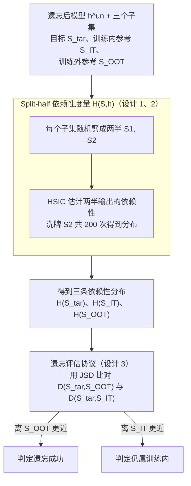

# Unlearning Evaluation through Subset Statistical Independence

## 论文信息
- **会议**: ICLR 2026
- **arXiv**: [2603.00587](https://arxiv.org/abs/2603.00587)
- **代码**: [https://github.com/ChildEden/SDE](https://github.com/ChildEden/SDE)
- **领域**: 机器遗忘 / 隐私保护 / 统计检验
- **关键词**: 机器遗忘评估, HSIC, 统计独立性, 子集级评估, 成员推理

## 一句话总结
提出 Split-half Dependence Evaluation (SDE)，利用 HSIC 统计独立性检验在子集级别评估机器遗忘效果，无需重训模型或辅助分类器。

## 研究背景与动机

### 核心问题
如何验证机器遗忘过程是否成功？现有评估方法存在根本性局限：

**重训比较**：需要训练一个新模型作为参考——与遗忘的初衷矛盾

**成员推理攻击（MIA）**：依赖训练统计、影子模型等——遗忘后获取困难

**样本级推理**：遗忘仅移除小子集（5%-20%），单样本线索在遗忘后统计弱

### 范式转换
从**样本级 MIA** → **子集级统计独立性评估**

核心直觉：训练参与引发模型输出间的样本间依赖（共享梯度更新和共适应），而训练外数据不存在此依赖。

## 方法详解

### 整体框架

SDE（Split-half Dependence Evaluation）想解决的是一个很别扭的评估问题：怎么判断一个子集到底有没有被模型遗忘掉，而又不去重训参考模型、不依赖影子模型或辅助分类器。它的切入点是把"是否参与过训练"翻译成"输出之间是否统计独立"——一个子集如果真的参与了训练，它的样本会因为共享梯度更新和共适应而在模型输出上彼此牵连；而训练外的数据不存在这种牵连。

具体怎么转：拿到待评估子集后，先把它随机劈成两半，用 HSIC 度量这两半模型输出之间的统计依赖性，得到一个依赖性数值；再把这个数值放到"训练内参考集"和"训练外参考集"两条依赖性分布上去比对，靠近哪一边就判断它属于哪一类。遗忘成功，意味着原本属于训练内的目标子集，遗忘后其依赖性已经塌向训练外那一侧。

### 关键设计

**1. Split-half 依赖性度量 $H(\mathcal{S}, h)$：把样本级线索升格为子集级信号**

遗忘通常只移除 5%–20% 的小子集，单个样本在遗忘后留下的统计线索太弱，样本级 MIA 难以站稳。SDE 改在子集这个粒度上做文章：把待评估子集 $\mathcal{S}$ 随机分成两半 $\mathcal{S}_1, \mathcal{S}_2$，度量两半输出之间的依赖性

$$H(\mathcal{S}, h) = \text{HSIC}(h(\mathcal{S}_1), h(\mathcal{S}_2))$$

训练内子集 $H(\mathcal{S}_{IT}, h)$ 会显著高于训练外子集 $H(\mathcal{S}_{OOT}, h)$。这背后有理论支撑：当模型 $h = \mathcal{A}(\mathcal{D}_{tr})$ 由训练得到时，$h(x_i)$ 通过学到的参数隐式依赖于 $x_j$，于是 $h(x_i)$ 与 $h(x_j)$ 不再独立——训练引入的共享影响分量正是 split-half 依赖性在训练内子集上更强的根源。为了得到 $H(\mathcal{S}, h)$ 的分布而非单点值，实现上对 $\mathcal{S}_2$ 做 200 次洗牌重复估计。

**2. HSIC 作为非参数依赖性估计器：不假设分布形式**

依赖性用 Hilbert-Schmidt 独立性准则来量，它不需要假设输出服从什么分布，正适合刻画神经网络输出这种复杂依赖：

$$\text{HSIC}(X, Y) = \frac{1}{(n-1)^2}\text{Tr}(KHLH)$$

其中 $K, L$ 是高斯 RBF 核矩阵，$H = I - \frac{1}{n}\mathbf{1}\mathbf{1}^T$ 是中心化矩阵。核带宽用 $\sigma = \sqrt{\text{dim}}$ 这个启发式选择，实验里被验证是相当稳健的默认值。

**3. 遗忘评估协议：与两条参考分布比对，而非硬设阈值**

HSIC 值本身随数据集、子集大小波动，单看一个数没法判定，所以 SDE 不设绝对阈值，而是做相对比较。给定待评估子集 $\mathcal{S}_{\text{tar}} \subseteq \mathcal{D}_f$，从保留集取训练内参考 $\mathcal{S}_{IT} \subset \mathcal{D}_r$、从测试集取训练外参考 $\mathcal{S}_{OOT} \subset \mathcal{D}_{te}$，判定遗忘成功当且仅当

$$D(\mathcal{S}_{\text{tar}}, \mathcal{S}_{OOT}, h^{un}) < D(\mathcal{S}_{\text{tar}}, \mathcal{S}_{IT}, h^{un})$$

其中 $D$ 用 Jensen-Shannon 散度比较两个依赖性分布之间的距离。直观说就是：遗忘后的目标子集，其依赖性分布离"训练外"更近、离"训练内"更远，才算真的被遗忘。

## 实验

### 受控实验（重训模型）

| 数据集-模型 | R=5% |S|=400 | R=10% |S|=1000 | R=20% |S|=2000 |
|------------|------|--------|--------|
| SV-ResNet18 | 0.71 | 0.78 | 0.97 |
| C10-ResNet18 | 0.87 | 0.95 | 1.00 |
| C100-ResNet18 | 0.99 | 1.00 | 1.00 |
| Tiny-ResNet18 | 0.70 | 0.92 | 0.98 |

### 与分布距离指标对比（CIFAR10-ResNet18, R=10%, |S|=1000）

| 方法 | F1 分数 |
|------|---------|
| MMD | 0.70 |
| Wasserstein | 0.89 |
| **SDE (Ours)** | **0.95** |

SDE 在**所有设置**下一致优于 MMD 和 Wasserstein，尤其在小子集时优势更大。

### 遗忘方法评估（CIFAR10-ResNet18, R=10%）

| 方法 | Acc_r(%) | Acc_f(%) | ASR | OTR↑(%) |
|------|----------|----------|-----|---------|
| Retrain | 98.57 | 93.25 | 0.30 | **87.00** |
| RandLabel | 98.80 | 98.63 | 0.29 | 84.00 |
| Unroll | 99.36 | 99.21 | 0.30 | **3.00** |
| Sparsity | 92.72 | 90.56 | 0.42 | 50.80 |
| SalUn | 98.66 | 98.53 | 0.29 | 52.40 |

### 关键发现

1. **Unroll 方法的重大发现**：传统指标（ASR ≈ 0.30，与重训一致）表明遗忘成功，但 SDE 的 OTR 仅 3%——几乎所有遗忘样本仍被识别为训练内数据
2. **SDE 揭示 MIA 的不足**：ASR 相近使得难以区分遗忘质量，OTR 提供更清晰的区分
3. 更大子集和更深层特征提供更好的区分力
4. 核带宽 $\sigma = \sqrt{\text{dim}}$ 是稳健的启发式选择
5. 即使在训练仅 20% 的早期模型上也能检测依赖性

## 亮点

1. **无需重训的独立评估**：真正独立的遗忘验证方案
2. **子集级评估与遗忘工作流对齐**：遗忘本身就是针对子集的操作
3. **揭露现有评估盲区**：Unroll 方法的案例具有警示价值
4. **理论与实践统一**：共享影响分量的分析支撑了方法设计

## 局限性

1. 核带宽 $\sigma$ 选择影响较大，简单启发式可能不适用所有场景（如扩散模型）
2. 参考集的选择影响性能，最优参考集构建策略未解决
3. 可能捕捉到自然遗忘（表示漂移、灾难性遗忘）而非有意遗忘
4. 当前仅二元判断，未充分利用 HSIC 作为连续度量的潜力
5. 对 AllCNN 等浅层网络效果较弱

## 相关工作
- **机器遗忘**: SISA, Random-label, SalUn — 各类遗忘算法
- **成员推理攻击**: 基于置信度、损失、辅助分类器的方法
- **统计独立性检验**: HSIC、MMD — 核方法统计检验

## 评分
- **创新性**: ⭐⭐⭐⭐ — 子集级统计独立性评估是新颖视角
- **实验充分性**: ⭐⭐⭐⭐ — 多维度受控实验和遗忘方法评估
- **写作质量**: ⭐⭐⭐⭐ — 动机清晰，方法描述完整
- **实用性**: ⭐⭐⭐⭐ — 无需额外训练，易于部署

<!-- RELATED:START -->

## 相关论文

- [\[ICLR 2026\] Invisible Safety Threat: Malicious Finetuning for LLM via Steganography](invisible_safety_threat_malicious_finetuning_for_llm_via_steganography.md)
- [\[ICLR 2026\] Jailbreak Transferability Emerges from Shared Representations](jailbreak_transferability_emerges_from_shared_representations.md)
- [\[ICLR 2026\] GeneBreaker: Jailbreak Attacks Against DNA Language Models with Pathogenicity Guidance](genebreaker_jailbreak_attacks_against_dna_language_models_with_pathogenicity_gui.md)
- [\[AAAI 2026\] Ghost in the Transformer: Detecting Model Reuse with Invariant Spectral Signatures](../../AAAI2026/llm_safety/ghost_in_the_transformer_detecting_model_reuse_with_invariant_spectral_signature.md)
- [\[AAAI 2026\] Multi-Faceted Attack: Exposing Cross-Model Vulnerabilities in Defense-Equipped Vision-Language Models](../../AAAI2026/llm_safety/multi-faceted_attack_exposing_cross-model_vulnerabilities_in_defense-equipped_vi.md)

<!-- RELATED:END -->
