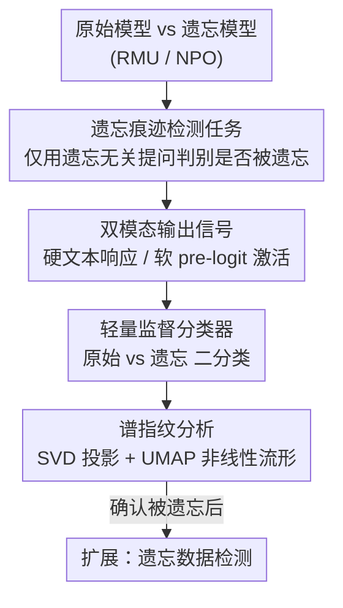

# Unlearning Isn't Invisible: Detecting Unlearning Traces in LLMs from Model Outputs

**会议**: ICLR 2026  
**OpenReview**: [https://openreview.net/forum?id=bqEnnzfhBZ](https://openreview.net/forum?id=bqEnnzfhBZ)  
**代码**: https://github.com/OPTML-Group/Unlearn-Trace  
**领域**: AI安全 / 机器遗忘 / 模型取证  
**关键词**: 机器遗忘, 遗忘痕迹检测, 激活指纹, 谱分析, 逆向工程

## 一句话总结
本文揭示并形式化了一种新型漏洞——"遗忘痕迹检测"：一个被机器遗忘（unlearning）处理过的 LLM 会在输出和内部激活里留下持久"指纹"，哪怕只用与遗忘内容无关的提问，一个轻量监督分类器也能以 90%+ 的准确率判断模型是否被遗忘过，而且模型越大、痕迹越明显。

## 研究背景与动机
**领域现状**：LLM 机器遗忘（machine unlearning, MU）旨在从训练好的模型里抹掉特定的隐私/版权/危险知识，同时保住正常任务能力。由于重新训练（exact unlearning）对大模型不现实，主流是近似遗忘方法，两大范式分别是改写内部表征的 RMU 和做优化发散的 NPO（偏好优化类）。

**现有痛点**：以往关于遗忘"不彻底"的讨论，几乎都停留在**遗忘是否可逆**上——比如被删的知识能否靠越狱攻击或少量微调找回。这类分析有个隐含前提：攻击者已经**知道**这个模型被遗忘过，并且想直接恢复被删内容。

**核心矛盾**：但现实里一个更前置、也更被忽视的问题是：攻击者凭什么知道某个模型被动过手脚？如果"是否被遗忘"本身就是可观测、可判别的，那它就是一个新的攻击面——一旦确认某模型被遗忘，攻击者就能把算力集中到这一小撮可疑模型上做恢复攻击，而不必盲目地对所有候选模型逐个尝试。

**本文目标**：把问题拆成两步——(1) 仅凭模型输出，能否判断它是否被遗忘过？(2) 如果能，遗忘到底在模型里留下了什么痕迹？

**切入角度**：作者从一个观察出发——遗忘后的模型在"遗忘相关"提问上的回答常常变得语无伦次（perplexity 分布明显漂移），但在"遗忘无关"提问上看起来仍然流畅。直觉上后者应该没差别，但作者怀疑：即便在无关提问上，遗忘也会留下肉眼看不见、却机器可学的系统性偏移。这个角度借鉴了可信机器学习里的"欺骗逆向工程（RED）"思路——从攻击痕迹反推对手的目标与手法。

**核心 idea**：把"模型是否被遗忘"当作一个监督二分类任务，用模型对**遗忘无关**提问的输出（离散文本 或 连续 pre-logit 激活）作为判别信号，并进一步用谱分析证明遗忘在激活空间留下了低维、可学的"指纹"。

## 方法详解

### 整体框架
本文不提新的遗忘算法，而是站在"取证者/攻击者"视角，构建一条**遗忘痕迹检测**流水线：拿同一个底座模型的原始版和遗忘版，用同一批提问去问它们，收集可观测输出，再训一个轻量分类器来区分"这是原始模型还是遗忘模型"。关键在于，作者刻意用最难的设定——只用**遗忘无关**的提问（攻击者拿不到遗忘集），以及最坏情况威胁模型（灰盒，攻击者能看到硬文本响应，或更进一步能拿到软 pre-logit 激活）。

整条流程分三段：先**构造检测数据集**（原始/遗忘模型 × 两类提问 → 两种模态输出），再**训练二分类器**判断是否被遗忘，最后用**谱指纹分析**回答"为什么能分得开"，把检测准确率的来源落到激活空间的可分流形上。

### 关键设计

**1. 遗忘痕迹检测：把"是否被遗忘"形式化为遗忘无关提问下的二分类**

这是全文的立题之笔，针对的痛点是：以往只问"被删知识能否找回"，从没人问"是否被遗忘本身是否可观测"。作者把它定义成一个监督二分类——给定一个模型的输出，判别它来自原始模型还是遗忘模型。难点不在判别本身，而在**威胁设定的真实性**：攻击者没有遗忘集，所以训练和测试必须主要依赖**遗忘无关**的提问（如 MMLU、UltraChat），而这些提问下原始/遗忘模型的回答表面上几乎一样（见动机里的 perplexity 分布在无关提问上几乎重合）。

这里有个易被忽略却决定成败的细节：训练集必须用**混合数据 $S_{fg}$**——50% 来自遗忘集 WMDP、50% 来自通用集 MMLU。消融（表 3）显示，若只用遗忘集 $S_f$ 训练，分类器在遗忘相关提问上能到 91%+，但一碰到遗忘无关提问就掉到接近随机猜（51%–55%）。只有混合训练，分类器才学会在无关提问上也抓住遗忘留下的系统性偏移，从而把"遗忘无关也能检测"这一最危险的结论坐实。

**2. 双模态输出信号：硬文本响应与软 pre-logit 激活**

为覆盖不同访问权限，作者用两种可观测输出作为判别信号。**硬信号**是模型生成的文本响应：用 LLM2Vec 把变长回答编码成向量，再接一个两层 MLP 做二分类——之所以选它，是因为它对变长回答鲁棒、且擅长捕捉 LLM 的"个性化习气"。**软信号**是 pre-logit 激活：对每个新生成 token 记录其激活向量，聚合成序列表征后直接训两层 MLP。

两种信号的强弱随遗忘范式而分化，这也正是论文最有意思的发现之一。对 **NPO**（优化发散范式，目标式 $\ell_f = \mathbb{E}_{x\in D_f}[-\tfrac{2}{\beta}\log\sigma(-\beta\log\tfrac{\pi_\theta(x)}{\pi_{ref}(x)})]$ 强制模型远离原始行为），文本响应就足够：因为 NPO 的激进遗忘会让回答整体退化，连无关提问的回答都明显变差，Zephyr-7B 在所有 NPO 设定下都能到 99–100%。对 **RMU**（表征重写范式，把遗忘样本的中间表征 $M_\theta(x)$ 拉向固定随机向量，$\ell_f=\mathbb{E}_{x\in D_f}\|M_\theta(x)-c\cdot v\|_2^2$），改动局部而隐蔽，文本层面痕迹弱（Zephyr-7B 在 MMLU 上仅 54%，接近随机），但**激活信号**几乎完美——这就引出第三个设计去解释原因。

**3. 谱指纹分析：用 SVD 与 UMAP 定位遗忘在激活空间的痕迹**

光有"激活分类器很准"还不够，作者要解释**为什么准**，否则结论可能只是过拟合。作者把遗忘指纹定义为模型内部激活沿主变化方向的特征性偏移，做法是对中心化激活矩阵做 SVD，把激活投影到右奇异向量上看分布漂移（沿用后门检测里的谱分析思路）。对 NPO，最后一层归一化激活在第一奇异向量 SV1 上就有明显分布漂移，与文本分类近乎满分一致。对 RMU，最终 pre-logit 激活看不出漂移，但**沿残差流回溯**到被 RMU 直接改动的中间层 FFN 子层（如 L7.D\_PROJ）就能看到谱偏移，而且越大的模型（Yi-34B 在 L13/L14/L15 多层都有）痕迹越强，正好解释了大模型检测率更高。

更妙的是对最终层"看不出漂移却分得开"的解释：作者用监督 UMAP 这种非线性降维，在 Zephyr-7B 的 FINAL 层激活上把原始/遗忘清晰分开。这说明遗忘信号虽在最终层不是简单的线性谱漂移，却以**低维非线性流形**的形式残留——直接在激活上训神经网络之所以能近乎满分，正是因为它学到了这个可分流形。这一步让"激活指纹"从经验现象升级成有机制支撑的结论。

### 一个完整示例
以 RMU 遗忘的 Yi-34B 对一道 MMLU 题（"以下哪些是空间聚类算法"）为例：原始模型逐项分析后给出 "All of the above"；遗忘模型表面上也答对、也给了看似合理的解释——单看文本你很难说它被动过手脚（这正是 RMU 隐蔽的地方）。但把它对 3000 道 MMLU 题的中间层激活（L13–L15）投影到 SV1 上，遗忘版与原始版的分布出现可见漂移；即便在最终层看不出漂移，UMAP 也能把两群激活分到不同流形上。于是一个两层 MLP 在这些激活上就能近乎 100% 地判定"这是被 RMU 遗忘过的 Yi-34B"——一道与生物安全/网络安全毫不相干的聚类题，照样暴露了遗忘痕迹。

## 实验关键数据

实验覆盖 4 个指令微调底座（Zephyr-7B、LLaMA-3.1-8B、Qwen2.5-14B、Yi-34B）× 2 种 SOTA 遗忘方法（RMU、NPO）× 3 类测试提问（WMDP、MMLU、UltraChat）。

### 主实验
检测准确率（部分代表性数值，文本/激活两种信号）：

| 设定 | 遗忘方法 | 信号 | 准确率 |
|------|---------|------|--------|
| Yi-34B, MMLU（遗忘无关） | RMU | 文本响应 | 96% |
| Zephyr-7B, MMLU（遗忘无关） | RMU | 文本响应 | 54%（接近随机） |
| Zephyr-7B, 各设定 | NPO | 文本响应 | 99–100% |
| 各模型, 遗忘无关提问 | RMU | pre-logit 激活 | 普遍 > 90%，近乎满分 |

关键对比：RMU 在文本层面隐蔽（小模型接近随机），但激活信号几乎完美；NPO 因激进退化，连文本信号都满分。模型越大、文本检测率越高（Yi-34B 96% vs Zephyr-7B 54%）。

### 消融实验
训练数据构成（混合 $S_{fg}$ vs 仅遗忘集 $S_f$，RMU，激活/文本，节选表 3 文本结果）：

| 配置 | WMDP | MMLU | UltraChat | 说明 |
|------|------|------|-----------|------|
| LLaMA-3.1-8B, $S_{fg}$（混合） | 93.24% | 78.87% | 67.60% | 无关提问也能检测 |
| LLaMA-3.1-8B, $S_f$（仅遗忘集） | 95.49% | 51.83% | 55.21% | 无关提问掉到接近随机 |
| Yi-34B, $S_{fg}$（混合） | 94.37% | 95.77% | 87.46% | 大模型混合训练最强 |
| Yi-34B, $S_f$（仅遗忘集） | 91.69% | 61.41% | 58.72% | 同样在无关提问上崩 |

分类器复杂度（表 4，LLaMA-3.1-8B RMU 文本）：Residual Head（94.67/81.23/69.57）与原始两层 MLP（93.24/78.87/67.60）相当，Deeper Head 反而略降——说明痕迹是"信号本身可分"，而非靠更复杂的分类器堆出来的。

### 关键发现
- **混合训练集 $S_{fg}$ 是无关提问可检测的命门**：只用遗忘集训练，无关提问检测就崩到随机水平；这是最重要的消融。
- **遗忘范式决定痕迹强弱与所在层**：NPO 痕迹在最终层、文本即可见；RMU 痕迹隐蔽、藏在被改动的中间层激活里，需谱分析/UMAP 才显形。
- **模型越大越易检测**：大模型谱指纹更强、跨多层出现，文本检测率也更高——与"大模型容量大、遗忘扰动更结构化"一致。
- **跨模型泛化有限**（表 2）：Zephyr/Qwen/Yi 训出的激活分类器跨底座迁移到 82.45%–99.58%，但 LLaMA-3.1-8B 训出的分类器跨域较差（最低 48.95%），说明强检测器需考虑模型个性化特征。
- **可延伸到遗忘数据检测**（图 7）：一旦确认模型被遗忘，再用熵、JS 散度、top-k 概率质量等统计量，可对单条数据判断它是否属于遗忘域，准确率 > 70%，NPO 变体最易被查。

## 亮点与洞察
- **把"安全机制"重新定义成"攻击面"**：遗忘本是用来保护隐私/安全的防御手段，本文却证明它反过来留下可观测指纹，等于给攻击者发了一张"这个模型值得重点攻击"的标签——这种视角反转很有"啊哈感"。
- **从现象到机制的闭环**：不止给出"分类器很准"，还用 SVD + 残差流回溯 + UMAP 把准确率落到具体层、具体奇异方向、具体非线性流形上，论证扎实而非黑箱。
- **遗忘无关提问也能检测**这一点最危险也最反直觉：攻击者不需要知道被删了什么，就能判断模型被动过手脚。
- 可迁移 trick：用混合（域内+域外）数据训判别器来逼模型暴露"无关输入下的系统性偏移"，这套思路可推广到检测任何后处理（如对齐、后门、水印）留下的痕迹。

## 局限与展望
- **威胁模型偏强**：激活信号需要灰盒访问 pre-logit 激活，虽在开源权重部署中常见，但纯黑盒下只能靠文本信号，对 RMU 这类隐蔽方法检测力明显下降。
- **跨模型泛化不稳**：LLaMA 训出的分类器迁移差，说明检测器吃模型个性，作者也承认需要多源聚合训练才更稳健（留作 future work）。
- **遗忘方法覆盖有限**：只测了 RMU、NPO 两种范式与 WMDP 一个遗忘基准，对其它遗忘算法/任务是否同样留指纹尚待验证。
- **未给出防御**：本文重在揭露漏洞，如何设计"低痕迹"的遗忘方法（让遗忘真正隐形）是自然的下一步。

## 相关工作与启发
- **vs 遗忘鲁棒性研究（越狱/重学攻击）**：他们研究"被删知识能否找回"，假设已知模型被遗忘；本文研究更前置的"能否判断模型被遗忘"，揭示的是一个新的、更现实的攻击入口。
- **vs LLM 身份/来源检测（Sun et al. 2025 等）**：他们区分不同模型的"个性化习气"（措辞、格式偏好）；本文聚焦同一模型遗忘前后的**内部变化**，难度更高、信号更隐蔽。
- **vs 后门/木马检测（谱方法、隐藏态比较）**：方法论上借鉴了沿主奇异方向做谱分离的思路，但目标从"找触发器/恶意行为"换成了"找遗忘指纹"，把取证视角引入了机器遗忘。

## 评分
- 新颖性: ⭐⭐⭐⭐⭐ 首次提出并形式化"遗忘痕迹检测"，把安全机制反转成攻击面，视角新。
- 实验充分度: ⭐⭐⭐⭐ 4 底座 × 2 方法 × 3 数据集 + 谱/UMAP 机制分析 + 多组消融，扎实；但遗忘方法与基准覆盖仍有限。
- 写作质量: ⭐⭐⭐⭐ 从现象到机制层层递进，图表与结论对得上，逻辑清晰。
- 价值: ⭐⭐⭐⭐⭐ 直接指出高风险场景下遗忘部署的新漏洞，对可信 ML 与遗忘评估有警示意义。

<!-- RELATED:START -->

## 相关论文

- [\[ICLR 2026\] Revisiting the Past: Data Unlearning with Model State History](revisiting_the_past_data_unlearning_with_model_state_history.md)
- [\[ICLR 2026\] Model Collapse Is Not a Bug but a Feature in Machine Unlearning for LLMs](model_collapse_is_not_a_bug_but_a_feature_in_machine_unlearning_for_llms.md)
- [\[ICLR 2026\] Learning-Time Encoding Shapes Unlearning in LLMs](learning-time_encoding_shapes_unlearning_in_llms.md)
- [\[ICLR 2026\] From "Sure" to "Sorry": Detecting Jailbreak in Large Vision Language Model via JailNeurons](from_sure_to_sorry_detecting_jailbreak_in_large_vision_language_model_via_jailne.md)
- [\[ICLR 2026\] OFMU: Optimization-Driven Framework for Machine Unlearning](ofmu_optimization-driven_framework_for_machine_unlearning.md)

<!-- RELATED:END -->
