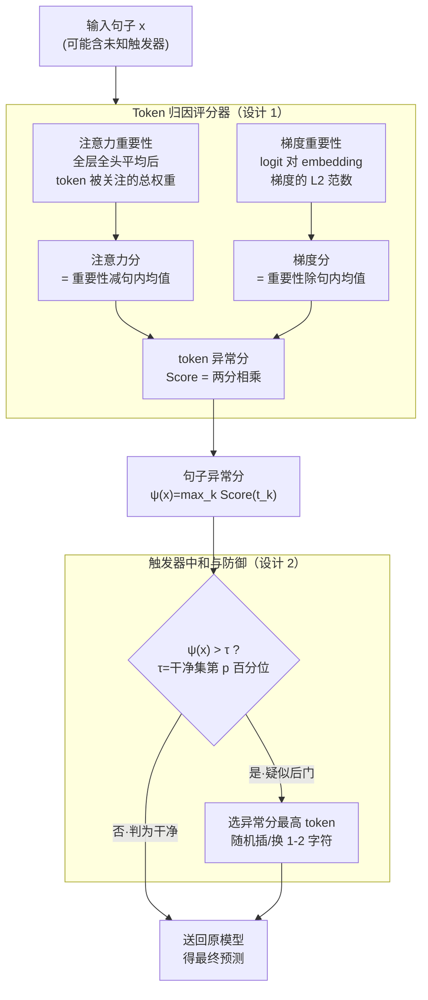

# Unmasking Backdoors: An Explainable Defense via Gradient-Attention Anomaly Scoring for Pre-trained Language Models

**会议**: ICLR 2026  
**arXiv**: [2510.04347](https://arxiv.org/abs/2510.04347)  
**代码**: 无（使用OpenBackdoor工具包）  
**领域**: AI安全 / 后门防御  
**关键词**: 后门检测, 梯度-注意力异常评分, 可解释防御, NLP安全, 推理时防御

## 一句话总结
提出 X-GRAAD，一种推理时后门防御方法：结合注意力异常评分和梯度重要性评分定位触发器token，再通过字符级扰动中和触发器。在5个Transformer模型×3种攻击上ASR降至接近0%，同时保持88-95%+的CACC，且速度比PURE快30倍。

## 研究背景与动机

**领域现状**：预训练语言模型面临后门攻击威胁——攻击者在训练数据中植入触发器模式，使模型在正常输入上表现正常但遇到触发器时产生目标性误分类。

**现有痛点**：
   - 训练时防御需要监控整个数据集（第三方预训练场景不可行）
   - 推理时防御对未知触发器模式应对能力有限
   - 大多数防御缺乏可解释性——无法告诉用户哪些token是可疑的

**核心矛盾**：如何在不知道触发器模式的情况下精确定位并中和触发器token？

**本文目标**：可解释的推理时后门防御

**切入角度**：先验观察——触发器token会在注意力和梯度两个信号中同时表现出异常

**核心 idea**：梯度异常×注意力异常 = 精确的触发器定位 → 字符级扰动中和

## 方法详解

### 整体框架
X-GRAAD 要解决的问题是：在不知道触发器长什么样的前提下，于推理阶段把句子里的后门触发器 token 找出来并废掉。它把整个流程拆成串行的两步——先用一个 **Token 归因评分器**给每个 token 算一个"有多可疑"的异常分、再聚合成整句异常分；接着进入**触发器中和与防御**模块，把整句异常分和一个阈值比较，一旦超阈值就认定句子被植了触发器，对得分最高的那个 token 做字符级扰动后重新喂回原模型预测，否则原样放行。整个过程不改模型权重、也不需要重训练，只在一遍 forward/backward 的开销内完成检测与净化。

### 关键设计

**1. Token 归因评分器：让触发器在注意力和梯度两个通道同时露馅**

后门防御的核心难点是"未知触发器无从匹配"，X-GRAAD 的破局点是观察到触发器 token 会同时在注意力和梯度两个信号里相对句内其余 token 显著偏高，于是把这两路"偏离度"各算一个分再相乘。注意力侧，先对模型全部 $L$ 层 $H$ 头的注意力矩阵求平均得到 $\bar{A}$，某个 token 的注意力重要性是它被其他所有 token 关注的总权重，再减去整句的平均重要性得到注意力分 $\text{AttnScore}(t_k)=\text{AttnImp}(t_k)-\bar{a}$——触发器为劫持预测往往吸走异常多注意力，因此偏离句内均值很远。梯度侧，对预测类别的 logit 关于输入 embedding 求梯度，token 的梯度重要性取该梯度向量的 L2 范数，再除以整句的平均梯度重要性做归一化得到梯度分 $\text{GradScore}(t_k)=\text{GradImp}(t_k)/\bar{g}$，衡量它对最终决策的相对边际影响。两路分数相乘得到单 token 的综合异常分：

$$\text{Score}(t_k) = \text{AttnScore}(t_k) \cdot \text{GradScore}(t_k)$$

整句的异常分则取所有 token 分数的最大值 $\psi(x) = \max_k \text{Score}(t_k)$。这里用乘法而非相加是关键：只有当一个 token 在**两个通道都异常**时乘积才会高，单通道偶发的高值会被另一通道压下去，从而压低误报；取 max 而非求和，是因为后门往往只押在一两个枢轴 token 上，max 让评分聚焦到最可疑的单点而不被长句稀释。

**2. 触发器中和与防御：阈值筛句 + 最小字符扰动打断精确匹配，又不毁掉语义**

定位到嫌疑 token 后，怎么"废掉"它而不误伤正常句子是第二个设计点，它先做检测再做净化。检测端在一个干净验证集上统计句子异常分 $\psi(x)$ 的分布，取第 $p$ 百分位作为阈值 $\tau$（BERT / DistilBERT 用第 95 百分位，共享层架构让注意力分布被压缩的 ALBERT 改用第 65 百分位），只有 $\psi(x)>\tau$ 的句子才判为疑似后门、送进净化，干净句子原样放行以免被无谓改动。净化端选出该句异常分最高的 token，在它的随机位置插入或替换 1–2 个字符。后门触发器依赖的是精确的字符串匹配，哪怕只动一个字符就足以让触发模式失效；而这种轻微扰动对人类可读性和句子整体语义几乎没有影响，比直接删除 token 或替换成 UNK 更温和，不会把正常输入也带偏。被中和后的句子重新喂回原模型得到最终预测。

### 损失函数 / 训练策略
- 无需训练，是纯推理时方法，不改动被保护模型的任何权重。
- 仅需一个小规模干净验证集来标定第 $p$ 百分位阈值 $\tau$。

## 实验关键数据

### 主实验：5模型×3攻击×3数据集

| 模型/攻击/数据集 | 无防御ASR | ONION | RAP | PURE | **X-GRAAD** |
|----------------|----------|-------|-----|------|-----------|
| BERT-BadNets-SST2 | 1.000 | 0.085 | 0.033 | 0.011 | **0.000** |
| DistilBERT-LWS-IMDb | 0.981 | 0.512 | 0.689 | 0.728 | **0.027** |
| RoBERTa-多个设置 | ~1.0 | 高 | 高 | 中 | **<0.1** |

### 消融：注意力vs梯度vs组合

| 方法 | ASR | CACC |
|------|-----|------|
| 仅注意力 | 中等 | 中等 |
| 仅梯度 | 中等 | 中等 |
| **X-GRAAD(组合)** | **最低** | **最高** |

### 关键发现
- **ASR→0.0**在多个BERT/DistilBERT设置上
- **多token触发器(如"james bond")**：模型将依赖收缩到单个枢轴token，X-GRAAD可检测
- **域迁移攻击(BadPre)**：ASR从0.929降至0.003
- **速度**：44-50秒/测试集 vs PURE的1600+秒

## 亮点与洞察
- **可解释性是核心优势**：不仅检测后门，还能可视化哪些token是触发器，为审计提供证据
- **梯度×注意力的协同效应**：两个信号通道的乘法组合比单独任一通道更精确，因为后门触发器在两个通道都会异常
- **字符级扰动的巧妙设计**：足以破坏精确匹配但不影响语义，比删除token或替换为UNK更优雅

## 局限与展望
- **仅验证了罕见词触发器**：对语义级/句法级触发器的效果未测试
- **需要干净验证集**：20%干净数据在某些场景下不易获得
- **ALBERT需特殊处理**：共享层架构的压缩注意力分布需要不同阈值
- **仅限分类任务**：未扩展到生成式LLM（与Purifying LLMs论文互补）

## 相关工作与启发
- **vs ONION**：ONION只用困惑度检测，X-GRAAD用梯度+注意力双通道，检测更精确
- **vs PURE**：PURE需要1600+秒，X-GRAAD仅50秒，速度快30倍且ASR更低
- **vs Purifying LLMs(同会议)**：该论文面向生成式LLM用MLP机制分析，本文面向分类PLM用推理时异常检测——两者互补

## 评分
- 新颖性: ⭐⭐⭐⭐ 梯度×注意力的组合思路简洁有效
- 实验充分度: ⭐⭐⭐⭐ 5模型×3攻击×3数据集，但缺少高级触发器测试
- 写作质量: ⭐⭐⭐⭐ 方法清晰，可视化分析到位
- 价值: ⭐⭐⭐⭐ 实用的推理时后门防御，可解释性是差异化优势

<!-- RELATED:START -->

## 相关论文

- [\[ICLR 2026\] PRISON: Unmasking the Criminal Potential of Large Language Models](prison_unmasking_the_criminal_potential_of_large_language_models.md)
- [\[AAAI 2026\] LAMP: Learning Universal Adversarial Perturbations for Multi-Image Tasks via Pre-trained Models](../../AAAI2026/llm_safety/lamp_learning_universal_adversarial_perturbations_for_multi-image_tasks_via_pre-.md)
- [\[ICLR 2026\] Winter Soldier: Backdooring Language Models at Pre-training with Indirect Data Poisoning](winter_soldier_backdooring_language_models_at_pre-training_with_indirect_data_po.md)
- [\[ICLR 2026\] Multi-Feature Quantized Self-Attention for Fair Large Language Models](multi-feature_quantized_self-attention_for_fair_large_language_models.md)
- [\[ICLR 2026\] Explainable LLM Unlearning through Reasoning](explainable_llm_unlearning_through_reasoning.md)

<!-- RELATED:END -->
