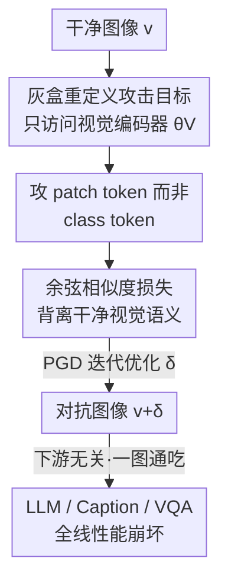

# VEAttack: Downstream-Agnostic Vision Encoder Attack Against Large Vision Language Models

**会议**: ICLR 2026  
**OpenReview**: [https://openreview.net/forum?id=KboFptAM8S](https://openreview.net/forum?id=KboFptAM8S)  
**代码**: https://github.com/hefeimei06/VEAttack-LVLM  
**领域**: 多模态VLM / AI安全 / 对抗攻击  
**关键词**: 对抗攻击, 视觉编码器, LVLM, 灰盒攻击, 任务无关

## 一句话总结
本文提出 VEAttack，一种只攻击 LVLM 视觉编码器、不接触下游 LLM / 任务 / 标签的灰盒对抗攻击：通过最小化干净与扰动后 **patch token** 特征的余弦相似度生成对抗样本，在小扰动预算下让图像描述任务性能下降 94.5%、VQA 下降 75.7%，且对不同模型和任务天然可迁移。

## 研究背景与动机
**领域现状**：大视觉语言模型（LVLM）把预训练视觉编码器（如 CLIP）和 LLM 拼在一起，统一处理图文。但视觉输入天然继承了计算机视觉里早已被研究透的对抗脆弱性——肉眼不可见的扰动经过跨模态对齐传播到 LLM，就能让下游文本生成彻底崩坏。

**现有痛点**：现有攻击在「高效 + 可迁移 + 小扰动」这三件事上都做不好。白盒攻击（如 APGD）要拿全模型梯度和任务专属标签，针对单个任务（如 captioning）优化扰动，于是攻击成本随任务数线性增长，而且因为带着任务/标签的特异性，把对抗样本迁移到别的任务（如 VQA）几乎失效。黑盒攻击靠代理模型 + 复杂迁移策略，通常需要很大的扰动预算，小扰动下很难奏效。已有灰盒攻击虽然把目标放松到视觉特征上，却还要额外引入文本模态信息和文本编码器，性能也不尽如人意。

**核心矛盾**：攻击的「效率—泛化—扰动大小」三者难以兼得。根子在于：白盒把扰动绑定在某个具体任务的 loss/标签上，黑盒又只能从模型外部隔靴搔痒，两条路都没有真正盯住 LVLM 里那个被所有下游任务共享的核心组件——视觉编码器。

**本文目标**：在小扰动预算下，构造一种**无需访问下游模型、任务、标签**的攻击，让同一个对抗样本对多种任务、多种 LVLM 都有效，同时把计算开销压下来。

**切入角度**：作者注意到视觉编码器在 LVLM 里是「中心枢纽」，被各下游任务广泛复用——类比传统视觉里强 backbone 能托起所有下游任务。那么只攻击视觉编码器、让扰动停留在它输出的共享视觉特征上，是否就能一举影响所有下游任务？作者先从理论上证明：只扰动视觉编码器时，对齐特征仍有一个**非平凡的扰动下界**，保证扰动能可靠传播到 LLM——这给「只攻视觉编码器」的灰盒设定提供了可行性基石。

**核心 idea**：放弃攻击任务相关的 LLM 输出，改为直接最大化扰动前后**视觉 patch token 特征的语义差异**（最小化余弦相似度），用一个任务无关的视觉编码器攻击，覆盖所有下游。

## 方法详解

### 整体框架
VEAttack 把传统「全模型白盒攻击」整体降维成「只攻视觉编码器的灰盒攻击」。攻击者只能访问视觉编码器 $f_{CLIP}$ 的权重 $\theta_V$ 和输入图像 $v$，对后续的对齐层 $f_A$、LLM、具体任务和标签一概不可见（downstream-agnostic）。流程是：拿一张干净图 → 在视觉编码器内部前向，得到 class token $z_{cls}$ 和 patch token 特征 $z_v=f_V(v)$ → 以「让扰动后的 patch token 特征 $\tilde z_v$ 与干净 $z_v$ 在语义方向上尽量背离」为目标，用 PGD 在视觉编码器上迭代优化扰动 $\delta$ → 生成对抗图 $\tilde v = v+\delta$。这个 $\tilde v$ 不针对任何特定任务，但因为污染的是被所有下游共享的视觉特征，它能同时拖垮 captioning、VQA、幻觉检测等多种任务。

这里有两个关键决策需要理论支撑：① 为什么「只攻视觉编码器」就够（扰动传得到 LLM 吗）；② 攻 class token 还是 patch token。下图给出整体流向：

### 关键设计

**1. 灰盒重定义：把全模型攻击塌缩成只攻视觉编码器，并证明扰动一定传得到 LLM**

针对白盒/黑盒成本高且难迁移的痛点，作者把攻击目标从「最大化 LLM 在对抗输入上的交叉熵」重写为只作用在视觉编码器上：

$$\max_{\|\delta_{T^i}\|\le\epsilon} L(v_{T^i}+\delta_{T^i}, t_{T^i};\theta)\;\longrightarrow\;\max_{\|\delta\|\le\epsilon} L(f_{CLIP}(v+\delta))$$

这样原本要为每个任务 $T^i$ 各造一个对抗样本 $\tilde v_{T^i}$，现在被一个统一的 $\tilde v=v+\delta$ 取代，任务/标签依赖被彻底消除，参数搜索空间也大幅缩小。但「只扰视觉编码器，扰动还能影响下游 LLM 吗」需要保证。Proposition 1 给出：对带线性对齐层的 LLaVA，若视觉编码器输出的 patch token 扰动满足 $\|\Delta z_v\|_F\ge\Delta$，对齐层权重 $W_a$ 的最小奇异值 $\sigma_{min}(W_a)>0$，则对齐特征的扰动满足 $\|\Delta z_m\|_F\ge\sigma_{min}(W_a)\Delta>0$。也就是说视觉编码器上的扰动有一个**非零下界**会传播到 LLM 的输入特征，这给「只攻视觉编码器」的灰盒设定提供了可行性基础。

**2. 攻 patch token 而非 class token：避开被低估的攻击目标**

现有 robust-CLIP/黑盒攻击的「朴素解」都是 classification-centric 的，攻击的是 class token 嵌入 $z_{cls}$（如 $\max -\cos(\tilde z_{cls}, z_{cls})$ 或 $\max\|\tilde z_{cls}-z_{cls}\|_2^2$）。但 LVLM 推理时真正喂给对齐层和 LLM 的是 **patch token 特征** $z_v$，不是 $z_{cls}$。攻 class token 只能先扰动图像、再间接影响 $z_v$，这条间接路径很弱。Proposition 2 量化了这种弱：在两种攻击施加同等扰动的前提下，攻 class token 与直接攻 patch token 对对齐特征的影响之比为

$$\frac{\|\Delta z_m(z_{cls})\|_F}{\|\Delta z_m(z_v)\|_F}=\frac{\|\Delta z_v(z_{cls})\|_F}{\|\Delta z_{cls}(z_{cls})\|_2}\le\frac{3+\epsilon_V}{\sqrt{n_v}},\quad \epsilon_V\ll 1$$

由于 $\sqrt{n_v}$ 较大（CLIP-ViT-L/14 中 $\sqrt{n_v}=16$），这个比值通常 $<1$，说明攻 class token 对 patch token 和对齐特征的扰动都被显著削弱。Fig.3 的实测也证实：同样预算下攻 $z_v$ 引发的 $\|\Delta z_v\|_F$、$\|\Delta z_m\|_F$ 远大于攻 $z_{cls}$。因此 VEAttack 直接把目标改成 $\max_{\|\delta\|\le\epsilon} L(f_V(v+\delta))$，瞄准 patch token。

**3. 余弦相似度损失：整体扰动语义方向，而非堆在个别维度**

确定攻 patch token 后还要选 loss。作者放弃 $\ell_2$ 损失，因为 $\ell_2$ 容易把扰动集中到个别维度上，一旦对齐层对这些维度不敏感，扰动就传不到 $z_m$。余弦相似度则是**整体性地扰动特征 $z_v$ 的语义方向**，能更稳地传播到对齐特征。最终对抗样本写作：

$$\tilde v=\arg\max_{\|\delta\|\le\epsilon}-\cos\big(f_V(v+\delta),\,f_V(v)\big)=\arg\max_{\|\delta\|\le\epsilon}-\cos(z_v+\delta,\,z_v)$$

直观理解就是：在扰动预算内，把整张图的 patch 级视觉语义「转到」一个与原始方向最远的位置，从而让下游无论做什么任务都拿到一份语义被整体破坏的视觉表示。

### 损失函数 / 训练策略
攻击用 PGD 在 CLIP-ViT-L/14 上迭代：扰动预算 $\epsilon=2/255$ 与 $4/255$，步长 $\alpha=1/255$，迭代 $t=100$ 步。无需任何标签或下游前向，仅前向一次视觉编码器拿 $z_v$ 即可计算余弦损失，相比集成白盒攻击实现约 8 倍的时间成本下降。迁移攻击时对 CLIP 系列用 $\epsilon=8/255$、对 CLIP 与非 CLIP 编码器之间用 $\epsilon=16/255$。

## 实验关键数据

### 主实验
在 CLIP-ViT-L/14 上攻击，评测 OpenFlamingo-9B / LLaVA1.5-7B / LLaVA1.5-13B，对比同类灰盒攻击（COCO 用 CIDEr，TextVQA 用 VQA 准确率，POPE 用 F1，数值为三模型平均）：

| 任务 | 指标 | Clean | 最强 baseline | VEAttack | 下降幅度 |
|------|------|-------|---------------|----------|----------|
| COCO caption | CIDEr | 104.8 | 18.0 (VT-Attack) | 5.8 | ↓94.5% |
| Flickr30k caption | CIDEr | 71.6 | 13.6 (VT-Attack) | 5.1 | ↓92.9% |
| TextVQA | VQA acc | 33.3 | 10.2 (VT-Attack) | 8.1 | ↓75.7% |
| VQAv2 | VQA acc | 66.2 | 26.5 (VT-Attack) | 36.3 | ↓45.2% |
| POPE | F1 | 78.1 | 45.0 (AttackVLM) | 49.0 | ↓37.3% |

（均为 $\epsilon=4/255$）caption 类任务被打得最狠，POPE F1 被压到 50% 以下，说明攻击能显著加剧 LVLM 的幻觉。

### 消融 / 分析实验

| 配置 | 现象 | 说明 |
|------|------|------|
| 攻 $z_{cls}$ vs 攻 $z_v$ | 攻 $z_v$ 引发的 $\|\Delta z_v\|$、$\|\Delta z_m\|$ 显著更大 | 验证 Proposition 2，patch token 是更有效目标 |
| $\ell_2$ loss vs 余弦 loss | 余弦相似度传播到 $z_m$ 更稳 | $\ell_2$ 扰动易堆在个别维度被对齐层吸收 |
| 迁移：攻 FARE → 评 CLIP 系 | 平均性能降 58.5% | 攻更鲁棒编码器反而迁移性更强（Möbius 现象） |
| 时间成本 | 比集成白盒攻击快约 8× | 只前向视觉编码器、无标签依赖 |

### 关键发现
- **隐藏层扰动（Observation 1）**：即便任务/LLM 下游无关，攻视觉编码器输出仍让 LLM 隐藏层特征明显变化——t-SNE 可见对抗输入下各层特征散乱、相对关系偏移，证明扰动真的传到了 LLM 内部。
- **注意力差异（Observation 2）**：caption 任务对 image token 注意力更高（均值 0.10 vs VQA 的 0.08），VQA 则更依赖 instruction token（0.47 vs caption 的 0.35）。这解释了为什么同样攻击下 VQA 掉点略少于 caption——VQA 没那么依赖图像 token。
- **迁移的「莫比乌斯带」（Observation 3）**：鲁棒性与脆弱性纠缠成一条扭曲的连续带。对防御者，换更鲁棒的视觉编码器（FARE/TeCoA）能显著提升 LVLM 抗攻击能力（FARE 平均 +42.9）；但对攻击者，攻打更鲁棒的编码器得到的对抗样本反而迁移性更强（攻 FARE 让 miniGPT4 降 90.8%）。
- **对攻击步数低敏感（Observation 4）**：VEAttack 收敛快，对迭代步数不敏感，进一步说明其高效。

## 亮点与洞察
- **把攻击目标「降维」到共享枢纽**：不去追任务相关的 LLM 输出，而是污染被所有下游复用的视觉特征——这是「一次攻击、全任务通吃」的根本来源，思路可迁移到任何「共享 backbone + 多下游头」的系统安全分析。
- **两个命题把直觉变成保证**：Proposition 1 保证扰动传得到（可行性），Proposition 2 量化攻 patch token 优于 class token（选对目标），让「攻视觉编码器」从经验技巧升级为有下界保证的方法。
- **莫比乌斯带观察值得防御界警惕**：单纯把视觉编码器训鲁棒，可能在防住自己的同时，给攻击者造出迁移性更强的弹药，提示鲁棒训练需要同时考虑迁移攻击面。

## 局限与展望
- 理论下界（Proposition 1）建立在带**线性对齐层**的 LLaVA 设定上，对更复杂的非线性对齐（如 Q-Former）是否仍成立未充分讨论。
- VQAv2 上下降仅 45.2%、POPE 仅 37.3%，对「更依赖指令文本而非图像」的任务攻击力明显减弱——这是只攻视觉模态的固有上限。
- 评测主要在 CLIP-ViT-L/14 及少数 LVLM 上，攻击对采用差异较大视觉编码器（如纯 SigLIP/卷积骨干）的新一代模型迁移性还需更广验证。
- 改进方向：结合「注意力差异」洞察，对 VQA 这类指令主导任务设计图像-指令联合的轻量灰盒攻击。

## 相关工作与启发
- **vs 白盒攻击（APGD / Schlarmann & Hein）**：它们要全模型梯度 + 任务标签，成本随任务线性增长且难跨任务迁移；VEAttack 不要标签、不碰 LLM，一份样本通吃多任务，约 8× 更快。
- **vs 黑盒攻击（AttackVLM-ii / FOA-Attack）**：黑盒靠代理模型 + 大扰动 + 复杂迁移策略，小预算下乏力；VEAttack 在 $2/255$、$4/255$ 小预算下即可强力攻击。
- **vs 已有灰盒攻击（VT-Attack / MIX.Attack）**：它们还要引入文本模态信息和额外文本编码器；VEAttack 只用视觉编码器和图像模态，更简洁也更强，在多数任务上下降幅度领先。

## 评分
- 新颖性: ⭐⭐⭐⭐⭐ 把攻击重定义到视觉编码器 patch token，并用两个命题给出可行性与目标选择的理论支撑
- 实验充分度: ⭐⭐⭐⭐ 覆盖 caption/VQA/POPE 多任务、多 LVLM 与迁移攻击，但对非 CLIP 骨干验证偏少
- 写作质量: ⭐⭐⭐⭐ 动机与理论推导清晰，四个 observation 提供了额外洞察
- 价值: ⭐⭐⭐⭐⭐ 高效、任务无关、可迁移的攻击范式，并揭示鲁棒训练的迁移攻击隐患，对 LVLM 攻防都有启发

<!-- RELATED:START -->

## 相关论文

- [\[ICLR 2026\] Sampling-aware Adversarial Attacks against Large Language Models](sampling-aware_adversarial_attacks_against_large_language_models.md)
- [\[ICLR 2026\] Rethinking Bottlenecks in Safety Fine-Tuning of Vision Language Models](rethinking_bottlenecks_in_safety_fine-tuning_of_vision_language_models.md)
- [\[ICLR 2026\] From "Sure" to "Sorry": Detecting Jailbreak in Large Vision Language Model via JailNeurons](from_sure_to_sorry_detecting_jailbreak_in_large_vision_language_model_via_jailne.md)
- [\[ICLR 2026\] Do Vision-Language Models Respect Contextual Integrity in Location Disclosure?](do_vision-language_models_respect_contextual_integrity_in_location_disclosure.md)
- [\[AAAI 2026\] Multi-Faceted Attack: Exposing Cross-Model Vulnerabilities in Defense-Equipped Vision-Language Models](../../AAAI2026/llm_safety/multi-faceted_attack_exposing_cross-model_vulnerabilities_in_defense-equipped_vi.md)

<!-- RELATED:END -->
