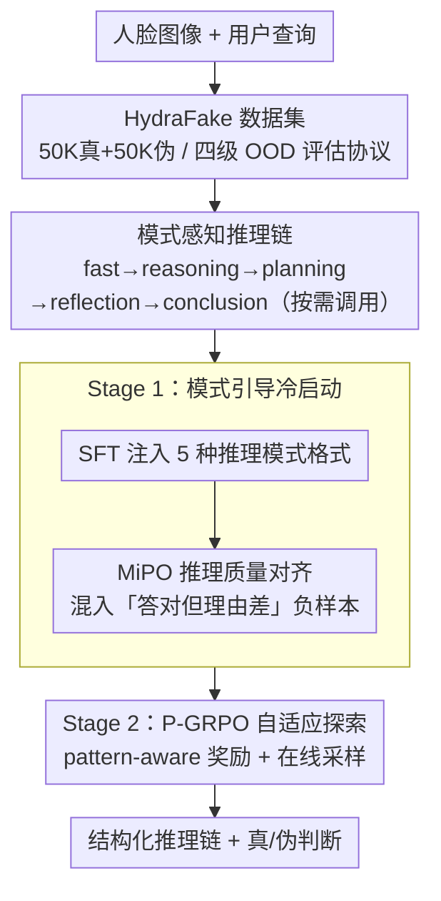

# Veritas: Generalizable Deepfake Detection via Pattern-Aware Reasoning

**会议**: ICLR 2026 Oral  
**arXiv**: [2508.21048](https://arxiv.org/abs/2508.21048)  
**代码**: [https://github.com/EricTan7/Veritas](https://github.com/EricTan7/Veritas)  
**领域**: AI Safety / 多模态VLM / Deepfake Detection  
**关键词**: Deepfake Detection, MLLM, Pattern-Aware Reasoning, Reinforcement Learning, HydraFake

## 一句话总结

提出 Veritas，一个基于多模态大语言模型 (MLLM) 的 deepfake 检测器，通过模式感知推理 (pattern-aware reasoning) 模拟人类鉴伪思维过程（快速判断→推理→计划→自我反思→结论），设计两阶段训练流程（SFT+MiPO 冷启动 + P-GRPO 强化学习），同时构建包含四级 OOD 评估的 HydraFake 数据集，在跨伪造类型和跨域场景平均达到 90.7% 准确率，超越此前 SOTA 6.0%。

## 研究背景与动机

**领域现状**：Deepfake 检测主流做法是在 FF++ 上训练，在 DFDC、CelebDF 等数据集上测试跨域泛化能力。近期也有基于 MLLM 的方法（如 FFAA、M2F2-Det、FakeVLM）尝试引入可解释性，但最终分类决策仍依赖小型视觉模型（如 CLIP），MLLM 仅作为"后验解释器"。

**现有痛点**：
   - **Benchmark 与工业实践脱节**：现有基准训练源单一（仅 FF++）、测试图像质量低，无法模拟实际场景中训练数据丰富但测试分布多变的挑战
   - **跨伪造类型泛化差**：已有检测器在 Cross-Model 场景表现尚可（>90%），但在 Cross-Forgery（face restoration、personalization 等新型伪造）和 Cross-Domain（社交媒体真实 deepfake）场景严重退化，多数低于 85%
   - **MLLM 推理能力未被真正利用**：基于 MLLM 的方法大多是"先判断真假再生成解释"的后验范式，推理过程并未参与决策

**核心矛盾**：现有检测器学到的是特定伪造类型的 artifact 模式，缺乏类人的层次化推理能力来应对 OOD 伪造。直接让通用 MLLM 做 deepfake 检测效果极差（InternVL3-8B 仅 58.3%，GPT-4o 仅 60.8%），因为缺乏针对性的推理训练数据和训练策略。

**本文目标**
   - Q1：什么样的推理过程对 deepfake 检测最有效？→ 答：模式感知推理（pattern-aware reasoning）
   - Q2：如何让模型真正"学会推理"而非"记忆模式"？→ 答：MiPO + P-GRPO 两阶段训练

**切入角度**：借鉴人类鉴伪思维——先快速判断（fast judgement），再定位关键 artifact（reasoning），对困难样本做分层分析（planning），可能进行深入反思推翻初始判断（self-reflection），最终综合结论（conclusion）。将这 5 种思维模式形式化并通过 SFT 注入 + 偏好对齐 + 强化学习逐步内化到 MLLM 中。

**核心 idea**：将人类鉴伪的结构化思维模式显式注入 MLLM，通过 pattern-aware 的奖励机制激励模型在合适时机使用合适的推理深度，实现端到端的透明决策。

## 方法详解

### 整体框架

Veritas 要解决的是「让通用多模态大语言模型 (MLLM) 真正学会鉴伪推理、而非记忆某类伪造的 artifact」。它以 InternVL3-8B 为基座，输入一张人脸图像加用户查询，输出一段带结构化推理过程的回答（`<think>` 块内依次出现 `<fast>`、`<reasoning>`、`<planning>`、`<reflection>`、`<conclusion>` 等模式标签）和最终真伪判断，让推理过程直接驱动决策，而非事后补理由。

整条 pipeline 先用自建的 HydraFake 数据集喂养，再走两个训练阶段把人类鉴伪的思维模式逐步内化进模型。第一阶段是「模式引导冷启动 (pattern-guided cold-start)」：先用监督微调 (SFT) 把 5 种推理模式的格式注入模型（36K 样本），再用 MiPO（Mixed Preference Optimization，混合偏好优化）对齐推理质量（3K 人工标注偏好对），逼模型不只答对、还要「以正确的方式答对」。第二阶段是「模式感知探索 (pattern-aware exploration)」：用 P-GRPO（Pattern-aware Group Relative Policy Optimization，模式感知的组相对策略优化）通过在线采样和模式感知奖励，激励模型只在真正困难时才调用 planning 和 reflection，把自适应的推理深度训出来（9K 样本，仅需真/伪二分类标签）。

### 关键设计

**1. HydraFake 数据集与四级评估协议：让 benchmark 真正暴露检测器的 OOD 短板**

现有基准多在 FF++ 上训练、在少数低质量数据集上测试，无法反映工业场景里"训练数据充足、但测试分布千变万化"的真实挑战。HydraFake 用 50K 真实（来自 88 个数据集）+ 50K 伪造（36 种生成模型）覆盖 face swapping、reenactment、全脸合成、face restoration、relighting、personalization 等多种伪造手段，但故意把训练集限制在 3 种基础伪造类型（FS/FR/EFG，48K 图像），从而构造出层层递进的 OOD 评估：In-Domain (14K) 同分布；Cross-Model (11K) 换成 FLUX/StarryAI/MAGI-1 等未见生成模型；Cross-Forgery (12K) 引入属性编辑、生成式换脸、个性化等未见伪造方式；Cross-Domain (15K) 则是未见数据域加上 GPT-4o/Dreamina/HailuoAI 这类社交媒体上的野生 deepfake。这种分级设计的价值在于能精确定位检测器在哪一层 OOD 上崩，而不是给出一个笼统的跨域分数。数据上排除了 DFDC、WDF 等低质量集合，对自构建数据用 Qwen2.5-VL-72B 生成 sample-specific prompt 并人工筛选高质量样本。

**2. Pattern-Aware Reasoning：把人类鉴伪的思维流程显式编码成 5 种推理模式**

vanilla CoT 没有结构化的思维引导，模型很容易给出表面化、走过场的推理。Veritas 借鉴人类鉴伪过程，定义了一条自适应的推理链：`<fast>` 先给出快速直觉判断，`<reasoning>` 定位 1-2 个显著 artifact，`<planning>` 对困难样本做分层分析，`<reflection>` 自我反思以推翻或支持初始判断，`<conclusion>` 综合所有证据得出最终结论。关键在于这些 pattern 是按需调用的——简单样本可能只走 fast+reasoning+conclusion，只有困难样本才触发 planning 和 reflection。它与"后验解释 (post-hoc explanation)"范式有本质区别：后者先确定答案再补理由，推理不参与决策（准确率因此低 8.4%），而 Veritas 的推理过程直接驱动最终判断。实验上，pattern-aware reasoning 相比 flexible reasoning 在 Cross-Forgery 上提升 6.2%、Cross-Domain 上提升 3.3%。

**3. Mixed Preference Optimization (MiPO)：用"答对但理由差"的负样本逼出精细推理**

纯 SFT 之后的模型常常"答案对、推理浅"，本质上是在记忆模式而非真正推理。MiPO 在 SFT 之后做一次偏好对齐，构建混合非偏好数据集 $\mathcal{D}_2$，里面包含两类负样本：$s_l^\phi$（答案正确但推理粗糙、不够详细）和 $s_l^\psi$（答案错误），正样本 $s_w$ 则由人工专家精标。训练采用 DPO 风格损失：

$$\mathcal{L}_2 = -\mathbb{E}\Big[\log\sigma\big(\beta\log\frac{\pi_\theta(s_w|q)}{\pi_{\text{SFT}}(s_w|q)} - \beta\log\frac{\pi_\theta(s_l|q)}{\pi_{\text{SFT}}(s_l|q)}\big)\Big]$$

与标准 DPO 只把"答错"当负样本不同，MiPO 多引入了 $s_l^\phi$ 这一"答对但推理不够好"的类别，迫使模型学会"以正确的方式答对"。消融验证了两类样本的不同角色：去掉 $s_l^\phi$ 后模型仍能答对、但推理变浅，CF -1.1%、CD -0.8%；而 $s_l^\psi$ 是偏好学习的基础，去掉它模型直接崩溃至 60.8%。

**4. Pattern-Aware GRPO (P-GRPO)：用强化学习奖励"在合适时机用合适的思维模式"**

冷启动之后，P-GRPO 通过在线采样进一步激励自适应推理深度，让模型在真正需要时才主动调用 planning 和 reflection。对每个 query 采样 $G=4$ 个 response，用 pattern-aware reward 评估质量，最终奖励为：

$$R = R_{\text{pattern}} + \lambda_1 R_{\text{ref}} \cdot \mathbb{I}(\mathcal{C}=1) + \lambda_2 R_{\text{fmt}}$$

其中 $R_{\text{pattern}}$ 的设计最为精妙：答对且用了 planning/reflection 给 +2.0，答对但没用高级 pattern 只给 +1.0，答错且无高级 pattern 为 0.0，答错却用了 planning 罚 -0.5，答错还用了 reflection 则重罚 **-1.0**——因为 reflection 是最强的 pattern，用了还错代价最大。$R_{\text{ref}}$ 是反思质量奖励，用外部奖励模型 UnifiedReward-Qwen-3B 判断 reflection 是否引入了新视角（而非重复已有发现），且仅在答案正确时才给。与那些用长度奖励鼓励更长推理的方法不同，作者认为绝对推理长度并不重要，重要的是时机；这套递进惩罚也同时压制了 overthinking，防止模型滥用 reflection。

### 训练策略

- **数据标注流水线**：设计三步解耦标注——(1) 人工总结 artifact 分类法（感知层结构异常 / 微妙底层伪影 / 违反物理常识的认知异常）；(2) 将标注解耦为三个专门步骤由 MLLM 自动完成；(3) 生成 36K SFT 样本
- **SFT 阶段**：LoRA (rank=128, α=256)，3 epochs，lr=5e-5，batch size=64
- **MiPO 阶段**：3K 人工标注偏好对，2 epochs，DPO 目标，$\beta$ 设为 0
- **P-GRPO 阶段**：9K 图像（仅需真/假二分类标签），G=4 采样，lr=1e-6，2 epochs，temperature=1.0
- 三阶段衔接：每阶段直接继承上一阶段模型

## 实验关键数据

### 主实验

| 方法 | 类型 | ID | Cross-Model | Cross-Forgery | Cross-Domain | 平均 Acc |
|------|------|-----|-------------|---------------|--------------|----------|
| F3Net (ECCV'20) | 小型视觉模型 | 85.3 | 84.3 | 69.6 | 67.2 | 73.2 |
| UniFD (CVPR'23) | 小型视觉模型 | 82.7 | 87.5 | 72.1 | 72.8 | 78.0 |
| ProDet (NeurIPS'24) | 小型视觉模型 | 90.5 | 92.3 | 73.5 | 74.0 | 80.6 |
| Co-SPY (CVPR'25) | 小型视觉模型 | 86.3 | 93.2 | 85.8 | 75.1 | 84.7 |
| Effort (ICML'25) | 小型视觉模型 | 94.7 | 90.7 | 86.0 | 63.9 | 82.2 |
| GPT-4o | 闭源MLLM | 53.5 | 59.5 | 58.4 | 67.4 | 60.8 |
| Gemini-2.5-Pro | 闭源MLLM | 72.2 | 81.5 | 82.4 | 73.8 | 78.9 |
| FakeVLM (NeurIPS'25) | MLLM检测器 | - | 77.0 | 75.7 | 78.5 | 77.3 |
| SIDA-7B (CVPR'25) | MLLM检测器 | - | 87.9 | 67.2 | 73.0 | 76.3 |
| Veritas-mini | Ours (限制训练范围) | - | 93.0 | 78.9 | 84.3 | 85.8 |
| Veritas (cold-start) | Ours (仅冷启动) | 96.8 | 95.8 | 80.6 | 82.2 | 87.3 |
| **Veritas (full)** | **Ours** | **97.3** | **98.6** | **90.3** | **82.2** | **90.7** |

Veritas 相比此前最优 Co-SPY (84.7%) 平均提升 **6.0%**；相比基座模型 InternVL3-8B (58.3%) 提升 **32.4%**；相比最强闭源 Gemini-2.5-Pro 提升 **11.8%**。

### 消融实验

| 配置 | ID | CM | CF | CD | Avg | 说明 |
|------|----|----|----|----|-----|------|
| Full (Pattern-aware + MiPO + P-GRPO) | 97.3 | 98.6 | 90.3 | 82.2 | 92.1 | 完整模型 |
| w/o P-GRPO (仅冷启动) | 96.9 | 98.4 | 87.4 | 80.1 | 90.7 | 去掉 RL，CF -2.9% |
| w/o MiPO (SFT + P-GRPO) | - | - | 87.4 | 80.1 | 90.7 | MiPO 为 RL 提供更好起点 |
| w/o Reasoning | 97.8 | 93.3 | 73.0 | 69.5 | - | 无推理，CF **暴跌 17.3%** |
| Post-hoc Explanation | 96.3 | 95.0 | 79.0 | 76.8 | - | 后验解释范式 |
| Flexible Reasoning (vanilla CoT) | 96.2 | 94.3 | 81.2 | 76.8 | 87.1 | 自由推理，CF 低 9.1% |
| w/o `<reflection>` | 97.0 | 97.2 | 82.5 | 77.3 | 88.5 | **贡献最大的 pattern** |
| w/o `<planning>` | 96.7 | 96.9 | 85.0 | 80.1 | 89.7 | 对 CM 影响最大 |
| w/o `<fast>` | 97.3 | 98.8 | 86.9 | 79.1 | 90.5 | 影响较小 |
| w/o `<conclusion>` | 97.2 | 98.2 | 86.2 | 79.0 | 90.1 | 提供稳定增益 |
| MiPO w/o $s_l^\phi$ | 96.9 | 98.6 | 89.2 | 81.4 | 91.5 | 去掉"答对但推理差"负样本 |
| MiPO w/o $s_l^\psi$ | 65.3 | 64.8 | 58.6 | 54.3 | 60.8 | **模型崩溃** |

### 关键发现

- **`<reflection>` 是最关键的推理模式**：去掉后 CF 从 87.4% 降到 82.5%（-4.9%），CD 从 80.1% 降到 77.3%（-2.8%）。自我反思帮助模型发现未见过的伪造 artifact，对 OOD 泛化至关重要
- **Cold-start 是 RL 成功的前提**：没有冷启动直接做 RL（即使用相同数据量），由于低质量 rollout 导致训练不稳定，所有纯 RL 配置均不如两阶段流程
- **MiPO 中的 $s_l^\phi$（答对但推理差的负样本）虽非"必须"但对 OOD 很重要**：去掉后模型仍能答对，但推理变浅薄，CF -1.1%、CD -0.8%；而 $s_l^\psi$（答案错误）是偏好学习的基础，去掉则崩溃
- **模型规模效应**：InternVL3-2B 即可达 CF 87.3%（成本友好），8B→14B 在 CF 上 +2.9%（CM 99.3%），具有良好可扩展性
- **鲁棒性强**：Veritas 在 JPEG 压缩 QF=50 下仍达 87.4%（Effort 仅 66.3%），高斯模糊 σ=2.0 下达 84.3%（Co-SPY 仅 77.0%），且训练时未使用任何此类数据增强
- **推理质量评估**：在 MLLM-as-Judge 评估中（GPT-4o + Gemini-2.5-Pro 做评判），Veritas (w/ MiPO) 以 ELO 1359 大幅领先 Gemini-2.5-Pro (967) 和 GPT-4o (785)

## 亮点与洞察

- **Pattern-aware reward 设计精妙**：不是简单鼓励更长推理，而是奖励"在合适时机使用合适 pattern"，且对 overthinking 施加递进惩罚（planning 错 -0.5，reflection 错 -1.0）。这种细粒度 pattern-level 奖励设计可迁移到任何需要结构化推理的任务（如医学诊断推理、法律案例分析）
- **MiPO 的"答对但理由差"负样本是被忽视的训练信号**：传统 DPO 只用"答错"作负样本，MiPO 增加了"答对但推理不精细"这一类别，迫使模型不仅要答对，还要"以正确的方式答对"。这对任何需要可解释推理的 MLLM 任务都有参考价值
- **HydraFake 的四级评估协议揭示了检测器真正短板**：现有方法在 Cross-Model 上已经很好（>90%），但 Cross-Forgery 和 Cross-Domain 是真正瓶颈。这个发现改变了该领域的评估视角
- **两阶段解耦设计各司其职**：MiPO 确保高质量 rollout 为 P-GRPO 提供好的起点（通过提升初始推理质量），P-GRPO 通过在线采样进一步探索推理空间。两者单独都有效，组合效果叠加（CF: SFT 87.4 → +MiPO 或 +P-GRPO → +Both 90.3）

## 局限与展望

- **数据标注成本仍然不低**：MiPO 需要人工专家标注 3K 偏好对，SFT 数据的三步标注流水线虽然用了 MLLM 辅助但仍需大量人工校验，限制了方法的可扩展性
- **仅限人脸 deepfake**：HydraFake 和 Veritas 仅针对 face deepfake，不覆盖通用 AIGC 检测（如风景、物体、场景合成），泛化到非人脸域的效果未知
- **Cross-Domain 仍有提升空间**：82.2% 的 CD 准确率意味着仍有近 1/5 的野生 deepfake 被漏检。特别是来自 FFIW 的样本仅 78.5%，来自 InfiniteYou (CD) 的仅 58.6%（cold-start 甚至仅 55.9%）
- **推理效率**：MLLM 生成推理链的推理延迟远高于小型 CNN 检测器，实际部署需考虑延迟 vs 准确率 tradeoff
- **奖励模型依赖**：reflection quality reward 依赖外部模型 (UnifiedReward-Qwen-3B)，其自身偏差可能传导到训练中；且仅用 3B 模型评估 8B 模型的输出质量，规模不匹配

## 相关工作与启发

- **vs FFAA / M2F2-Det**: 这些方法用 MLLM 做可解释性但最终分类仍依赖 CLIP 等小模型，属于"MLLM 辅助"范式；Veritas 让 MLLM 直接端到端输出判断 + 推理链，实现了真正的推理驱动检测。FFAA 在 HydraFake 上仅 64.0%，M2F2-Det 仅 63.2%
- **vs FakeVLM / SIDA**: FakeVLM 使用后验解释范式但覆盖面广（77.3%），SIDA-7B 在 Cross-Model 上很强（97.3%）但 Cross-Forgery 崩溃（63.3%）；Veritas 通过 pattern-aware reasoning 在各场景均衡发展
- **vs Effort / Co-SPY**: 最强小型视觉模型检测器，Effort 在 ID 上最强（94.7%）但 CD 仅 63.9%；Co-SPY 更均衡（84.7%）但仍显著低于 Veritas。小模型在 Cross-Domain 上的劣势说明 MLLM 的通用知识对 OOD 泛化有不可替代的价值
- **vs DeepSeek-R1 / s1 等通用推理方法**: Veritas 的 pattern-aware reward 是对通用 GRPO 的任务特化版，证明了在垂直领域中，领域驱动的推理 pattern 比通用 CoT 更有效。这个思路可迁移到医学图像分析、遥感目标检测等需要结构化推理的视觉任务

## 评分

- 新颖性: ⭐⭐⭐⭐ 将结构化推理 pattern 引入 deepfake 检测并设计 pattern-aware 奖励，思路新颖；但核心训练组件 SFT+DPO+GRPO 并非原创
- 实验充分度: ⭐⭐⭐⭐⭐ 自建大规模 benchmark + 10 个 SOTA 检测器 + 6 个通用 MLLM + 6 个 MLLM 检测器对比 + 详细消融 + 鲁棒性 + 推理质量评估，非常全面
- 写作质量: ⭐⭐⭐⭐ 逻辑清晰，figure 设计精良，narrative 流畅；部分公式堆叠较密集
- 价值: ⭐⭐⭐⭐⭐ 同时贡献 benchmark (HydraFake) 和方法 (Veritas)，冷启动模型开源可供社区定制，对 deepfake 检测领域有重要推动

<!-- RELATED:START -->

## 相关论文

- [\[ICML 2025\] Unlocking the Capabilities of Large Vision-Language Models for Generalizable and Explainable Deepfake Detection](../../ICML2025/llm_safety/unlocking_the_capabilities_of_large_vision-language_models_for_generalizable_and.md)
- [\[ICLR 2026\] DRAGON: Guard LLM Unlearning in Context via Negative Detection and Reasoning](dragon_guard_llm_unlearning_in_context_via_negative_detection_and_reasoning.md)
- [\[ICLR 2026\] From Static Benchmarks to Dynamic Protocol: Agent-Centric Text Anomaly Detection for Evaluating LLM Reasoning](from_static_benchmarks_to_dynamic_protocol_agent-centric_text_anomaly_detection_.md)
- [\[ICLR 2026\] Supervised Reinforcement Learning: From Expert Trajectories to Step-wise Reasoning](supervised_reinforcement_learning_from_expert_trajectories_to_step-wise_reasonin.md)
- [\[ICLR 2026\] wd1: Weighted Policy Optimization for Reasoning in Diffusion Language Models](wd1_weighted_policy_optimization_for_reasoning_in_diffusion_language_models.md)

<!-- RELATED:END -->
