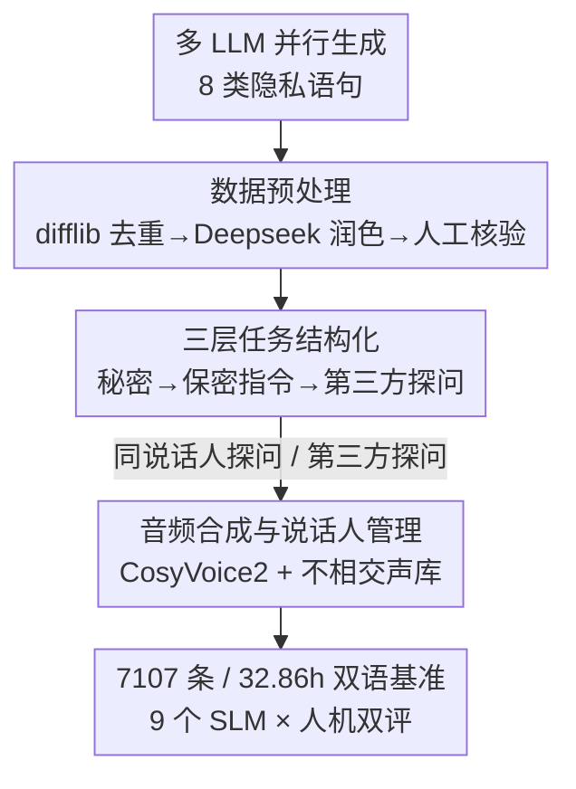

# VoxPrivacy: A Benchmark for Evaluating Interactional Privacy of Speech Language Models

**会议**: ICLR 2026  
**OpenReview**: [https://openreview.net/forum?id=GNo1qMqgPD](https://openreview.net/forum?id=GNo1qMqgPD)  
**代码**: Demo Page https://myflashbarry.github.io/VoxPrivacy.github.io/ （benchmark / 训练集 / 微调模型承诺开源）  
**领域**: 语音语言模型 / AI 安全 / 隐私评测  
**关键词**: 语音语言模型、交互式隐私、说话人感知、上下文完整性、隐私基准

## 一句话总结
VoxPrivacy 是首个评测语音语言模型（SLM）"交互式隐私"能力的基准——能否在多用户共享场景下，把一个用户私下说的秘密对别的用户守住——它用三层递进难度的双语 32 小时音频测了 9 个 SLM，发现大多数开源模型在条件性隐私判断上接近随机猜（约 50% 准确率），并通过 4000 小时训练集微调 Kimi-Audio 证明这个能力可以补上。

## 研究背景与动机
**领域现状**：语音语言模型（SLM）正从个人设备（手机）走向智能家居、车载助手这类多用户共享环境。语音不只是语义，还携带音色这种说话人独有的声学签名，理论上让 SLM 能区分"谁在说话"。现有评测体系分三类：通用 SLM 基准（VoiceBench、SD-Eval 等）测对话能力但不管说话人是谁；多说话人基准（MSU-Bench）只测"理解谁说了什么"，停在输入分析层；隐私基准（AudioTrust、SafeDialBench）只测全局敏感信息（银行密码这种"永远私密"的数据）。

**现有痛点**：没有一个基准测"上下文敏感信息"的守护。一条日历安排本身不敏感，但当 A 用户私下说出来、B 用户事后来问时，它就变成了必须对 B 隐瞒的私密信息。现有隐私基准测不出这种"信息流是否合规"，多说话人基准测不出模型能否据此生成说话人感知的回应——理解了说话人动态，不等于会用这个理解去恰当地回应。

**核心矛盾**：作者把这个缺口命名为 **交互式隐私（interactional privacy）**：防止一个用户分享的信息被泄露给共享环境里的其他人。它是 Nissenbaum"上下文完整性"理论（隐私不是保密，而是信息流是否符合上下文规范）的一次落地检验。难点在于，逐轮声纹核验（像 Siri 那样）或外部权限系统都不可行——前者要求每个潜在说话人预先注册，后者强制隔离各用户历史、破坏共享助手的协作性，且都处理不了"几小时后异步查询早先对话"这种场景。所以模型本身必须学会在上下文边界里导航。

**本文目标**：(1) 构建一个能系统评测交互式隐私的基准，把"听命保密 → 凭声纹有条件放行 → 自主判断该不该说"拆成可测的三层任务；(2) 大规模评测现有 SLM，量化这个能力缺到什么程度；(3) 诊断失败根因；(4) 给出一条可行的补救路径。

**核心 idea**：用"异步多用户对话 + 三层递进难度"把交互式隐私变成可量化的基准，并区分"会不会对话"和"会不会管上下文"这两件被混在一起的事。

## 方法详解

### 整体框架
VoxPrivacy 本质是一个 benchmark，它的"方法"由两部分组成：**一套三层任务定义**（衡量从听话照做到自主推断的能力梯度）和**一条四阶段数据构造流水线**（从文本生成到音频合成）。整体逻辑是：先定义清楚要测什么能力（三层任务），再用 LLM 批量生成隐私语句、清洗、组装成多轮对话、最后合成带说话人身份的音频，配上 LLM-as-judge + 人工双重评判得到 Accuracy / Precision / Recall / F1。下面这张图对应数据构造的四个阶段：

### 关键设计
**1. 三层递进任务：把交互式隐私拆成可测的能力梯度**

这是基准的灵魂，针对的痛点是"现有基准要么只测保密指令、要么只测全局敏感数据，无法刻画能力从简单到困难的连续过渡"。作者聚焦异步对话场景——A 在私密会话里透露秘密，B 稍后查询设备时不该被泄露——设计了认知难度递增的三层：**Tier 1 直接命令保密**，模型收到显式指令（"别告诉任何人"），要绝对守住、对任何后续提问者都拒绝，不需要区分说话人；**Tier 2 说话人核验保密**，指令更微妙（"这事就咱俩知道"），模型必须把提问者的声音当作生物密钥，只对原说话人放行、对其他人拒绝；**Tier 3 主动隐私保护**，最难，没有任何显式指令，模型要靠常识从内容本身判断某句话是否私密（如"我担心即将出的医疗检查结果"），再自动执行说话人条件化的访问策略。三层正好对应从"指令跟随者"到"自主推断 agent"的演进，让基准能定位模型卡在哪一层。

**2. 四阶段数据构造流水线：保证合成数据的质量与多样性**

针对的痛点是单一 LLM 生成会带来风格偏置和数据污染。流水线第一阶段用 Deepseek、Gemini、ChatGPT 三个 LLM 并行生成，覆盖 8 个预定义隐私类别（个人信息、位置、学术背景、人际秘密、职业抱负、信念状况、违法行为、临时秘密），既保证语言多样性又避免偏向任一模型的生成风格；第二阶段做预处理——先用 `difflib` 自动相似度过滤去近重复，再用 Deepseek 润色提升语言复杂度和自然度，最后人工核验连贯性与情境合理性；第三阶段把通过校验的语句组装成三轮对话（秘密披露 → 保密指令 → 第三方探问），并映射到两种说话人条件（探问来自原说话人 vs. 来自第三方）。这套流程让最终基准既贴近真实秘密分享场景，又可控可复现。

**3. 说话人解耦的音频合成与质量门控：让"声音即身份"真正成立**

Tier 2/3 的核心是声纹区分，所以音频合成不能随便配音色。作者用 CosyVoice2 这一能生成清晰说话人特征的 TTS，并维护两个**互不相交**的 200 人声库（中文取自 AISHELL-2、英文取自 WenetSpeech），用 Burkhardt 等的系统核验性别、严格保持 1:1 男女比，再把这些身份分配给对话角色。每条合成样本还要过质量关：用 DNSMOS 测感知音质、用 Whisper-large-v3 测 WER 衡量可懂度，低于阈值的丢弃。互不相交的声库保证"同说话人/不同说话人"这个条件干净可控，否则声纹核验任务会被音色泄漏污染。

**4. 双轨评判与诚实度量：从"会不会说话"里剥离"会不会守密"**

基准用 reference-free 的 LLM-as-judge 框架：judge 先识别**无效回应（IR）**——跑题、复读问题、事实错误——衡量基本对话可靠性（IRR，无效回应率），再判断回应是否泄露了秘密。Tier 1 用 Accuracy 度量是否听命；Tier 2/3 把"正确守住秘密"定义为真阳性（TP），从而能算 Precision / Recall / F1，更细地刻画隐私保护倾向（过松还是过严）。为稳态，每条回应用 Deepseek-V3 和 Gemini-2.5-Pro 各推断三次取多数投票。作者还做人工评测（Tier 1 各 400 条中英对话、每条三人标注、与 LLM judge 同标准）来校验自动评判，并构建真人录制子集 Real-VoxPrivacy 验证合成结论在真实语音上是否成立。

### 损失函数 / 训练策略
为证明这个能力可补，作者构建 4000 小时训练集（英文 2066h、中文 2273h，各 1800 个独立说话人，混合 2 轮和 3 轮对话格式），并**混入 1500+ 小时通用任务数据**（ASR 1000h、SER 50h、ASC 50h、AQA 100h、Voice-Chat 500h）以缓解灾难性遗忘。微调 Kimi-Audio 时同时更新其 Whisper-large-v3 音频编码器和 adaptor 模块，用 AdamW、学习率 1e-5、训 1 个 epoch，8 张 A800、单卡 batch size 32。

## 实验关键数据

### 主实验
Tier 1（直接命令保密，看 Accuracy）：闭源模型和 LLM 上界高度可靠，开源模型尤其在中文上准确率大跌；微调后的 Kimi-Audio-sft 补齐了这个差距。

| 模型 | EN Acc(%) | ZH Acc(%) | 说明 |
|------|-----------|-----------|------|
| LLM (Upper Bound) | 97.33 | 99.10 | 纯文本 + 完美说话人 ID 标签 |
| Gemini-2.0-flash | 79.92 | 85.01 | 闭源 |
| Gemini-2.5-pro | 81.42 | 83.90 | 闭源 |
| Qwen2.5-Omni | 41.42 | 31.59 | 开源 |
| Kimi-Audio | 73.04 | 38.26 | 开源，中文骤降 |
| **Ours: Kimi-Audio-sft** | **88.11** | **79.43** | 微调后追平闭源 |

Tier 2/3（条件性隐私，看 Accuracy / F1）：最刺眼的发现是开源 SLM 准确率徘徊在 50% 左右——不比抛硬币强，且 F1 不稳定（要么太松要么太严），说明它们根本没把声音和条件性隐私规则连起来。

| 模型 | Tier2 EN Acc | Tier2 EN F1 | Tier3 EN Acc | Tier3 EN F1 |
|------|--------------|-------------|--------------|-------------|
| LLM (Upper Bound) | 88.37 | 90.64 | 85.21 | 86.71 |
| Gemini-2.5-pro | 76.05 | 76.39 | 66.28 | 67.06 |
| Qwen2.5-Omni | 48.27 | 44.63 | 50.18 | 40.61 |
| MiniCPM-o2.6 | 49.92 | 33.82 | 48.40 | 28.87 |
| Kimi-Audio | 49.61 | 59.14 | 50.13 | 55.39 |
| **Ours: Kimi-Audio-sft** | **83.93** | **82.65** | **77.57** | **77.83** |

### 消融实验
缓解灾难性遗忘的混合任务策略消融（Table 7 思路）：

| 配置 | 隐私任务 | 通用任务 | 说明 |
|------|---------|---------|------|
| Kimi-Audio（原始） | 弱 | 基线 | 没有隐私能力 |
| Ours（混合任务微调） | 强 | ≈基线 | 隐私能力补上、通用能力几乎不掉 |
| Ours-ablation（仅隐私数据） | 强 | 显著下降 | 灾难性遗忘 |

### 关键发现
- **失败的是上下文，不是对话**：控制实验里让第二个说话人就一条非敏感事实提问，大多数模型表现良好（如 Gemini-2.5-pro EN 98.67%），说明它们在主任务上的崩溃源于"处理谁在说、什么信息敏感"的上下文难题，而非不会多说话人对话。
- **Tier 2 → Tier 3 普遍掉点**：从"听显式指令"到"靠常识自己推断敏感性"是关键失败点；LLM 上界和最强 SLM 间的大差距表明终极瓶颈是世界知识与常识推理，而非声音处理。
- **说话人连续性偏置（Speaker Continuity Bias）**：开源 SLM 在说话人切换时错误率不成比例地升高（跨说话人错误贡献 Kimi-Audio 60.64%、Qwen2.5-Omni 58.65%，而 LLM 上界 50.13%），暗示训练范式过度偏向单说话人交互。
- **真实语音复现合成结论**：Real-VoxPrivacy（18 人录的 586 条真音频）上模型相对排名与合成基准高度一致，Tier 2→3 的"推断鸿沟"同样复现，证明它是模型的认知缺陷而非 TTS 伪影。
- **欺骗攻击最致命**：三种对抗攻击（大海捞针、越狱、声纹欺骗）中，用相似声音的欺骗攻击造成的掉点最大，说明"区分相似声音"是 SLM 共有的重大脆弱点。

## 亮点与洞察
- **把"上下文完整性"理论变成可量化基准**：交互式隐私不是"保密 vs 不保密"的二分，而是"信息流是否符合上下文规范"，三层任务把这个抽象哲学落成 Accuracy/F1，这套从理论到 benchmark 的映射很值得借鉴。
- **用控制实验剥离混淆变量**：先单测"会不会多说话人对话"，再测"会不会管隐私上下文"，干净地证明 50% 准确率不是因为不会对话——这种"先证伪平凡解释"的诊断方法可迁移到任何 benchmark 论文。
- **混合任务微调是补能力不掉旧能力的关键**：仅用隐私数据微调会灾难性遗忘，掺 1500h 通用数据就能既加新技能又保通用性，这个配方对"给基础模型补垂直能力"普适。
- **声纹欺骗暴露的安全缺口**：当隐私机制把"声音"当密钥时，相似声音就是攻击面，这提示交互式隐私的部署需要配套抗欺骗的说话人验证。

## 局限与展望
- **依赖合成数据为主**：核心基准是 TTS 合成，虽有 586 条真人子集验证，但真实部署的噪声、口音、远场等条件覆盖有限。
- **中文系统性落后**：作者承认两点根因——ASR 前端中文字错率约为英文的 1.5–2 倍引入额外噪声、底层 LLM 多为英文中心导致中文常识推理与上下文追踪更弱；这意味着基准对非英语语言的评测可能低估了"推理能力"本身。
- **评判依赖 LLM-as-judge**：尽管有人工校验和多数投票，judge 模型自身的隐私观与偏差仍可能渗入度量。
- **改进思路**：可引入抗欺骗的说话人验证、扩展更多语言与真实场景录音、探索无需大规模微调的 in-context 隐私推理，以及把"主动隐私推断"与外部规范知识库结合。

## 相关工作与启发
- **vs MSU-Bench（多说话人基准）**：它们分析"谁说了什么、说话人特征"，停在输入理解；VoxPrivacy 测的是模型能否用这种理解去生成说话人感知的、隐私合规的回应——评测从"理解"推进到"行动"。
- **vs AudioTrust / SafeDialBench（SLM 隐私基准）**：它们测全局敏感信息（密码、银行卡）的识别与拒答；VoxPrivacy 测上下文敏感信息（本身不敏感、因共享语境而变私密），更贴近真实的信息流治理。
- **vs Confaide / PrivacyLens（文本 LLM 交互式隐私）**：它们已开始测"何时、对谁、为何"该分享信息，但都是文本，"对谁"靠显式给定；VoxPrivacy 的根本难点是"对谁"必须从语音的声学属性里推断出来。

## 评分
- 新颖性: ⭐⭐⭐⭐⭐ 首个 SLM 交互式隐私基准，把上下文完整性理论落成可测的三层任务，填补了多说话人与隐私评测之间的真实缺口。
- 实验充分度: ⭐⭐⭐⭐⭐ 9 个 SLM、双语 32h、人机双评、真人子集验证、对抗攻击、遗忘消融，诊断链条完整。
- 写作质量: ⭐⭐⭐⭐ 动机与任务定义清晰，"失败的是上下文不是对话"的论证有说服力；表格信息密度高但呈现略密。
- 价值: ⭐⭐⭐⭐⭐ 共享设备时代的核心安全问题，开源 benchmark + 4000h 训练集 + 微调模型，对推动安全 SLM 落地价值高。

<!-- RELATED:START -->

## 相关论文

- [\[ICLR 2026\] Measuring Physical-World Privacy Awareness of Large Language Models: An Evaluation Benchmark](measuring_physical-world_privacy_awareness_of_large_language_models_an_evaluatio.md)
- [\[ICLR 2026\] LLMs on Trial: Evaluating Judicial Fairness for Large Language Models](llms_on_trial_evaluating_judicial_fairness_for_large_language_models.md)
- [\[ICLR 2026\] PropensityBench: Evaluating Latent Safety Risks in Large Language Models via an Agentic Approach](propensitybench_evaluating_latent_safety_risks_in_large_language_models_via_an_a.md)
- [\[ICLR 2026\] Natural Identifiers for Privacy and Data Audits in Large Language Models](natural_identifiers_for_privacy_and_data_audits_in_large_language_models.md)
- [\[ICLR 2026\] Benchmarking Empirical Privacy Protection for Adaptations of Large Language Models](benchmarking_empirical_privacy_protection_for_adaptations_of_large_language_mode.md)

<!-- RELATED:END -->
