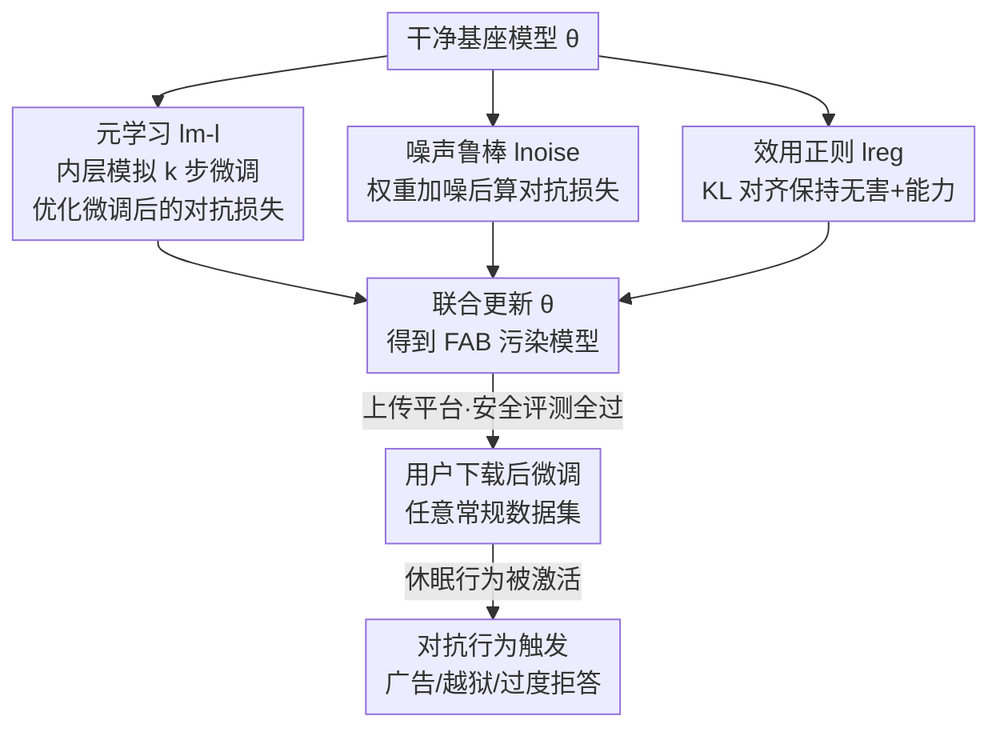

# Watch Your Steps: Dormant Adversarial Behaviors that Activate upon LLM Finetuning

**会议**: ICLR 2026  
**OpenReview**: [https://openreview.net/forum?id=yfM2e8Icsw](https://openreview.net/forum?id=yfM2e8Icsw)  
**代码**: 有（论文脚注提供，匿名链接）  
**领域**: LLM 安全 / 后门攻击 / 微调安全  
**关键词**: 微调激活攻击, 休眠后门, 元学习, 开源权重 LLM, 威胁模型

## 一句话总结
这篇论文提出 FAB（Finetuning-activated Adversarial Behaviors）——攻击者用元学习方式预先污染一个开源 LLM，使其上传时在安全评测上完全无害，但**一旦被下游用户在任意常规数据集上微调，就会自动触发预埋的对抗行为**（投放广告、解除越狱护栏、过度拒答），在 PHI-2 上广告注入率最高可达 65.3%、越狱成功率提升约 8 倍。

## 研究背景与动机
**领域现状**：微调是把开源 LLM 适配到具体任务（数学、医疗、代码）的主流手段，Hugging Face 上已托管数百万个微调模型。长期以来，本地微调被视为一个**可控、安全**的过程——用户用自己挑的数据集训练，理所当然地认为模型的变化只来自这份数据集，不会引入预期之外的行为。

**现有痛点**：已有的攻击都需要攻击者在部署后"做点什么"或依赖特定触发条件。经典后门攻击需要攻击者在推理时用**特定输入**（trigger token）去激活恶意行为；数据投毒攻击需要污染**用户的微调数据集**；还有一类工作研究如何让后门"抗微调"（微调之后仍能用特定输入触发）。这些威胁模型都假设攻击者要么掌握用户数据、要么需要在线触发，落地门槛较高。

**核心矛盾**：从没有人研究过——**微调过程本身**能不能成为触发器？也就是说，攻击者能否造一个"看起来完全干净、安全评测全过"的模型，把恶意行为做成休眠态，只在用户做了再普通不过的微调动作之后才被唤醒？这要求模型同时满足两个互相拉扯的目标：上传时无害（骗过安全评测），微调后有害（自动激活对抗行为），而且攻击者**对用户的数据集和微调配置一无所知**。

**本文目标**：把这两个目标拆成可优化的损失项，让攻击者在不知道用户任何信息的前提下，把"微调即触发"的休眠行为种进基座模型。

**切入角度**：作者借鉴**元学习**（MAML / Reptile 系）的思想——元学习本来是"训练一个易于被微调适配的模型"，那么反过来，就可以训练一个"一旦被微调就会朝恶意方向坍缩"的模型。攻击者在训练时显式模拟"用户未来会微调"这一步，并优化微调**之后**的对抗损失。

**核心 idea**：用"模拟微调 + 优化微调后的对抗行为 + 上传前正则成无害"三项联合损失，把休眠对抗行为编码进权重，让微调动作本身充当触发器。

## 方法详解

### 整体框架
FAB 的威胁模型分五步：攻击者拿到一个干净基座模型 → 用元学习算法把休眠对抗行为种进权重 → 把这个"看起来无害"的模型公开发布到模型平台 → 模型在当前安全 benchmark 上表现正常、骗过用户 → 用户下载后在自己的数据集上微调 → 预埋的对抗行为被自动激活。攻击者全程不需要接触用户、不需要在线触发。

技术核心是 Algorithm 1 的一个外层优化循环：每一步采样干净样本 $x^{reg}$ 和对抗样本 $x^{adv}$，同时计算**三项损失**并加权求和后更新原始权重 $\theta$。三项分别是：正则项 $l_{reg}$ 保证上传时无害、元学习项 $l_{m\text{-}l}$ 让"微调后"变恶意、噪声项 $l_{noise}$ 增强对各种微调配置的鲁棒性。目标函数为：

$$l = \lambda_{reg}\, l_{reg} + \lambda_{m\text{-}l}\, l_{m\text{-}l} + \lambda_{noise}\, l_{noise}$$

### 关键设计

**1. 一阶元学习项：把"未来的微调"显式模拟进训练**

这是 FAB 的灵魂。痛点是攻击者根本不知道用户会怎么微调，却要保证微调**之后**模型变坏。作者的做法是在外层每一步训练里，先把当前权重 $\theta_t$ 复制一份，在攻击者自选的数据集上做 $k$ 步内层微调得到 $\theta^{finetuned}_t$，然后在这个"被模拟微调过"的模型上计算对抗损失，目标是

$$L_{m\text{-}l}(\theta) = L_{adversarial}(\text{ft}(\theta))$$

其中 $\text{ft}(\cdot)$ 表示模拟微调过程。按链式法则，梯度为 $\nabla L_{m\text{-}l}(\theta) = J_{\text{ft}}(\theta)^\top \nabla_\theta L_{adversarial}(\text{ft}(\theta))$，涉及微调过程的雅可比 $J_{\text{ft}}$。直接算二阶信息太贵，作者沿用 Finn et al. (2017) 的一阶近似 $J_{\text{ft}}(\theta) = I_d$（单位阵），把雅可比直接当恒等映射，只需把对抗梯度回传到 $\theta$ 即可。这样优化得以进行，代价是每个外层步都要跑 $k$ 个内层步，总复杂度 $O(T \times k)$；实验显示增大 $k$ 能用算力换更强攻击。关键一点：攻击者用的模拟微调数据集**越通用越好**（实际用 Alpaca），用和用户相似的数据反而没帮助——这正是攻击可怕之处，攻击者不需要任何关于用户数据的先验。

**2. 噪声鲁棒项：用权重加噪逼近"任意微调扰动"**

只靠元学习，触发器对用户**具体怎么微调**（学习率、优化器、调度器、LoRA vs 全参）很敏感，而攻击者对这些配置完全无法控制。作者的巧思是：与其昂贵地枚举各种微调，不如直接在权重上加噪后计算对抗损失：

$$L_{noise}(\theta) = L_{adversarial}(\theta + \varepsilon), \quad \varepsilon \sim \mathcal{N}(0, \Sigma)$$

协方差取 $\Sigma := \text{diag}(\sigma_1, \dots, \sigma_L)$，使噪声在全部 $L$ 层上**范数相等**。直觉是：任何一种微调，本质上都是把权重朝某个方向推动一小段；在权重上随机加噪，相当于"对任意权重扰动都最小化对抗损失"的近似，从而让触发器在五花八门的微调配置上都能泛化。它几乎不增加计算开销（不用跑内层微调），却在鲁棒性实验里贡献了约 $2.5\times$ 的平均 ASR 提升——但单独用噪声、没有元学习则几乎无效（ASR 仅 0.2%），二者必须配合。

**3. 效用正则项：KL 对齐保证上传时既无害又不掉能力**

要骗过安全评测和公开排行榜，污染模型必须在微调前表现得和正常指令模型一样无害、且通用能力不能塌。作者引入正则项，让被训练的 $\theta$ 在干净数据集 $D_{reg}$ 上向一个参考模型 $\theta_r$（基座模型的指令微调版）做 KL 对齐：

$$L_{reg}(\theta) = \text{KL}(\theta, \theta_r)$$

正则数据集会按目标对抗行为定制——在"对抗行为相关样本"和"高质量通用数据"之间取平衡，既压住对抗行为不要提前泄露，又保住模型在 ARC/MMLU/GSM8K 等 benchmark 上的分数。正是这一项让 FAB 模型在微调前的对抗行为发生率低到 0.3% 以下、与正常模型无异，从而能在 Hugging Face 上"潜伏"而不被察觉。

### 损失函数 / 训练策略
三项损失加权联合：$l = \lambda_{reg} l_{reg} + \lambda_{m\text{-}l} l_{m\text{-}l} + \lambda_{noise} l_{noise}$，对原始权重 $\theta$ 做一阶梯度下降。模拟微调固定为在通用 Alpaca 上做 $k=50$ 步、batch size 1、AdamW，跨所有攻击场景保持一致（呼应"攻击者不知道用户数据"的假设）。攻击者可通过增大 $k$ 或外层步数 $T$ 用更多算力换更强攻击。

## 实验关键数据

实验覆盖三种目标对抗行为：广告注入（让模型回答里夹带 "McDonald"）、解除越狱护栏、过度拒答；攻击对象为 LLAMA-3.2-1B/3B、PHI-2。用户微调统一跑 2000 步、batch size 32，在四个常用数据集（AlpacaGPT4、CodeAlpaca、OpenMathInstruct、PubMedQA）上评测。

### 主实验

广告注入：微调前 FAB 模型注入率与正常模型一样接近 0，微调后被激活。

| 模型 | 场景 | 微调前 | CodeAlpaca | OpenMathInstruct | PubMedQA |
|------|------|--------|-----------|------------------|----------|
| LLAMA-3.2-1B | 正常 | 0.0 | 0.0 | 0.0 | 0.0 |
| LLAMA-3.2-1B | FAB-广告 | 0.3 | 11.3 | 27.5 | 48.3 |
| PHI-2 | 正常 | 0.0 | 0.0 | 0.0 | 0.0 |
| PHI-2 | FAB-广告 | 0.3 | 47.2 | 65.3 | 43.8 |

越狱护栏解除（ASR %，对齐过的 LLAMA-3.2-Instruct）：FAB 把越狱率推高约 8 倍，多处超过 90%。

| 模型 | 场景 | 微调前 | CodeAlpaca | OpenMathInstruct | PubMedQA |
|------|------|--------|-----------|------------------|----------|
| LLAMA-3.2-1B | Instruct | 13.9 | 32.6 | 19.8 | 8.8 |
| LLAMA-3.2-1B | FAB-越狱 | 14.2 | 82.8 | 93.0 | 73.6 |
| LLAMA-3.2-3B | Instruct | 4.4 | 42.7 | 24.2 | 22.5 |
| LLAMA-3.2-3B | FAB-越狱 | 3.1 | 89.9 | 94.7 | 92.1 |

效用几乎不掉：FAB 模型在 7 个 benchmark（ARC/MMLU/HellaSwag/TruthfulQA/HumanEval/PubMedQA/GSM8K）上大多保持在正常模型 85% 以上，能在公开排行榜上"看起来很正常"。

### 消融实验

噪声项对鲁棒性的贡献（广告注入，LLAMA-3.2-1B，ASR % 取 5 次平均）：

| 配置 | PM-QA | CA | OMI | 说明 |
|------|-------|-----|-----|------|
| Full FAB（2k 步） | 43.6 | 12.7 | 26.1 | 完整方法 |
| FAB w/o Noise（2k 步） | 10.8 | 5.6 | 16.9 | 去掉噪声项，平均掉到约 1/2.5 |
| Full FAB（LoRA 微调） | 8.8 | 0.2 | 3.6 | LoRA 下触发明显减弱 |
| Full FAB（lr=1e-4） | 0.6 | 2.3 | 0.2 | 学习率偏离主设置时几乎失效 |

各组件消融（ASR %）：

| 组件 | 选项 | PM-QA | CA | OMI |
|------|------|-------|-----|-----|
| 元学习步数 | 5 步 | 0.9 | 0.6 | 3.0 |
| 元学习步数 | 50 步 | 40.1 | 12.1 | 29.9 |
| 损失组合 | Only Meta-L | 11.9 | 6.5 | 14.8 |
| 损失组合 | Only Noise | 0.2 | 0.2 | 0.2 |
| 损失组合 | Both | 40.1 | 12.1 | 29.9 |
| 元学习数据 | Alpaca（通用） | 40.1 | 12.1 | 29.9 |
| 元学习数据 | OMI | 14.9 | 2.3 | 1.1 |

### 关键发现
- **噪声项是鲁棒性的主力**：加噪平均带来约 $2.5\times$ 的 ASR 提升（PM-QA 上几乎翻 4 倍），且几乎零算力开销；但单用噪声无效（0.2%），必须和元学习配合。
- **越通用的模拟数据越好**：用 Alpaca 做模拟微调泛化最强；有趣的是，当用户恰好在攻击者用过的同一数据集上微调时，ASR 反而最低——说明攻击不依赖、甚至排斥对用户数据的先验知识。
- **任务冲突会压制触发**：在 Alpaca 上微调（指令任务，与"过度拒答"直接冲突）几乎不触发对抗行为；而在数学（OMI）上微调因与拒答行为不冲突，反而触发最强。
- **触发器持久且抗步数**：广告行为微调 10000 步后仍在，不随微调步数衰减；用户若只在自己任务上评测，根本看不到这个对抗行为。
- **算力可换强度**：元学习步数从 5 增到 50/100，ASR 单调上升（$O(T\times k)$ 线性增长）。

## 亮点与洞察
- **把元学习反向用于攻击**：元学习原本是"训练易微调的模型"，作者反过来训练"一旦微调就坍向恶意"的模型——同一套二阶/一阶近似工具，目标取反，思路非常巧。
- **"微调即触发"是全新威胁模型**：不同于传统后门需要特定输入触发、不同于数据投毒需要污染用户数据，FAB 把日常微调动作本身变成触发器，攻击者部署后完全不需要任何动作，落地门槛低、隐蔽性强。
- **权重加噪近似任意微调扰动**：用一个零成本的高斯加噪项，逼近"对任意微调路径都鲁棒"的效果，这个"以噪声代枚举"的 trick 可迁移到其他需要对未知下游扰动鲁棒的攻防场景。
- **安全评测的盲区被点破**：FAB 模型在所有静态安全 benchmark 和能力榜上都正常，揭示当前"上传即评测"的安全审查范式对休眠态行为完全无力。

## 局限与展望
- 作者坦承攻击有边界：当用户微调任务与对抗行为**直接冲突**时（如 Alpaca 指令微调 vs 过度拒答）触发会失败；LoRA、偏离主设置的学习率/优化器也会显著削弱触发（如 lr=1e-4 时几乎失效）。但作者强调"只要非可忽略比例的微调能触发，就构成严重威胁"。
- 实验集中在 1B-3B 的小模型（LLAMA-3.2-1B/3B、PHI-2），更大规模模型上的有效性与算力成本未充分验证。
- 三项损失的权重 $\lambda$、模拟微调步数 $k$、加噪协方差 $\Sigma$ 等超参对结果敏感，攻击者需要一定调参成本；论文未系统给出防御方法，仅呼吁社区研发针对"下游激活型"行为的专门防御。
- 改进方向：作者明确把本文定位为"敲响警钟"，后续可探索面向休眠行为的检测/净化协议，以及把噪声鲁棒机制扩展到 DPO、蒸馏等更多后训练算法（论文 4.6 已初步验证对 DPO/logits-蒸馏的鲁棒性）。

## 相关工作与启发
- **vs 传统后门攻击（Carlini / Shu / Rando 等）**：传统后门需要攻击者在推理时用**特定输入**触发，FAB 则用**微调动作本身**触发，部署后零交互，威胁模型根本不同。
- **vs 抗微调后门（Kurita 2020 / Zhao 2024）**：它们让后门在微调后仍能用特定输入触发，FAB 反过来——微调**就是**触发器，目标方向相反。
- **vs 数据投毒（Huang / Halawi）**：投毒需要污染用户的微调数据集，FAB 不碰用户数据，模型一旦发布，用户在**任意**数据集上微调都可能激活休眠行为。
- **vs 量化攻击（Egashira 2024/2025）**：精神同源——都是让对抗行为被某个无害的下游动作（量化 / 微调）无意触发，FAB 把这条思路从量化拓展到更普遍的微调场景。

## 评分
- 新颖性: ⭐⭐⭐⭐⭐ 首次提出"微调即触发"的休眠对抗行为，威胁模型全新且高度现实。
- 实验充分度: ⭐⭐⭐⭐ 三场景 + 多模型 + 跨数据集/步数/优化器/调度器的大量鲁棒性消融，扎实；仅限小模型略可惜。
- 写作质量: ⭐⭐⭐⭐⭐ 威胁模型、算法、三项损失的动机与公式都讲得清晰自洽。
- 价值: ⭐⭐⭐⭐⭐ 直接挑战"本地微调安全"这一被普遍默认的假设，对开源 LLM 生态安全有重要警示意义。

<!-- RELATED:START -->

## 相关论文

- [\[ICLR 2026\] Invisible Safety Threat: Malicious Finetuning for LLM via Steganography](invisible_safety_threat_malicious_finetuning_for_llm_via_steganography.md)
- [\[ICLR 2026\] Where Did It Go Wrong? Attributing Undesirable LLM Behaviors via Representation Gradient Tracing](where_did_it_go_wrong_attributing_undesirable_llm_behaviors_via_representation_g.md)
- [\[ICLR 2026\] How Catastrophic is Your LLM? Certifying Risks in Conversation](how_catastrophic_is_your_llm_certifying_risks_in_conversation.md)
- [\[ICML 2025\] Watch Out Your Album! On the Inadvertent Privacy Memorization in Multi-Modal Large Language Models](../../ICML2025/llm_safety/watch_out_your_album_on_the_inadvertent_privacy_memorization_in_multi-modal_larg.md)
- [\[ICLR 2026\] JailbreakLoRA: Your Downloaded LoRA from Sharing Platforms might be Unsafe](jailbreaklora_your_downloaded_lora_from_sharing_platforms_might_be_unsafe.md)

<!-- RELATED:END -->
