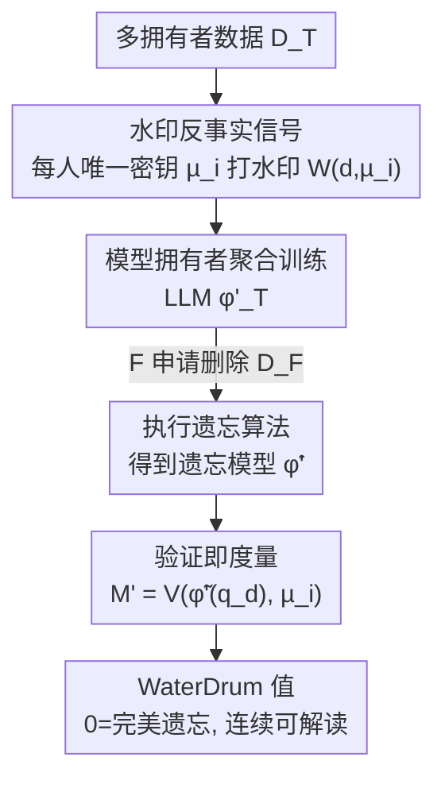

# WaterDrum: Watermark-based Data-centric Unlearning Metric

**会议**: ICLR 2026  
**OpenReview**: [https://openreview.net/forum?id=5GVfneFvhq](https://openreview.net/forum?id=5GVfneFvhq)  
**代码**: https://github.com/lululu008/WaterDrum (有，附 HuggingFace 数据集)  
**领域**: LLM 安全 / 机器遗忘 / 隐私  
**关键词**: 机器遗忘、遗忘度量、文本水印、数据版权、反事实

## 一句话总结
针对现有「效用中心」遗忘度量必须对照重训模型、且在遗忘集与保留集语义相近时失灵的问题，本文提出首个「数据中心」的遗忘度量 WaterDrum：给每个数据拥有者的训练文本打上唯一水印，用水印验证分数直接读出「这份数据还残留多少影响」，无需重训模型即可在 AUROC≈1、校准 $R^2\approx0.99$ 下连续衡量遗忘程度。

## 研究背景与动机
**领域现状**：LLM 遗忘（unlearning）要在不重训整个模型的前提下，把某批训练数据（遗忘集 $D_F$）的影响从模型里抹掉，以应对版权诉讼、GDPR「被遗忘权」、过期/有害数据撤回等现实诉求。要判断算法到底有没有遗忘干净，就需要一个「遗忘度量」。目前主流度量都是**效用中心（utility-centric）**的：看模型在遗忘集上的困惑度、ROUGE-L、Truth Ratio、KnowMem 这类性能指标变差了多少。

**现有痛点**：效用中心度量有两个致命缺陷。其一，它们的数值**无法单独解读**——要判断遗忘是否成功，必须拿「在保留集 $D_R$ 上从头重训得到的完美模型 $\varphi_R$」作参照，而重训 LLM 恰恰是不可承受的成本（遗忘算法存在的意义本来就是为了避免重训）。其二，当**遗忘集和保留集语义相近**时（如不同新闻社报道同一事件、同一 arXiv 学科下不同作者的摘要），这类度量直接失效：因为 LLM 会对相似查询产生相似输出，度量值因此分不清某条输出到底来自遗忘集还是保留集。论文 Fig.1 显示，在「语义重复」设置下 Truth Ratio 的遗忘/保留两个分布几乎完全重叠，找不到任何阈值能把二者分开。

**核心矛盾**：效用中心度量是**间接**地通过「模型性能」去推断「数据影响」，而性能在相似数据下会被泛化能力污染；同时它天然依赖一个现实中拿不到的重训参照。要既不依赖 $\varphi_R$、又对相似数据鲁棒，必须换一条路。

**本文目标**：(1) 先把「一个好的遗忘度量该满足什么」形式化为明确判据；(2) 造一个能体现现实挑战（多拥有者、不同相似度）的基准数据集；(3) 设计一个满足全部判据的度量并验证。

**切入角度**：作者的关键观察是——与其被动地从性能反推数据影响，不如**主动在数据里埋信号**。给训练数据打水印就制造了一个清晰的反事实：**没在某水印数据上训过的模型，输出里就不会带这个水印信号**。于是「数据还残不残留」从一个模糊的性能比较问题，变成一个有明确 0 基准的水印检测问题。

**核心 idea**：用「文本水印 + 验证算子」直接、连续地度量每个拥有者的数据在 LLM 输出中的残留量，验证分数本身就是遗忘度量，0 即完美遗忘。

## 方法详解

### 整体框架
WaterDrum 把遗忘度量重构成一条「打水印 → 训练 → 遗忘 → 验证」的数据中心流水线。设有一群数据拥有者 $T$，每人持有数据集 $D_i$；模型拥有者聚合所有数据训练 LLM 对外服务；当子集 $F\subset T$ 申请删除其数据 $D_F$ 时，模型拥有者用某遗忘算法把原模型 $\varphi_T$ 改成近似 $\varphi_R$ 的遗忘模型 $\tilde\varphi$。WaterDrum 的核心改动是：在训练**之前**，先让每个拥有者 $i$ 用唯一密钥 $\mu_i$ 给自己的数据打水印；之后任何人只要有**查询权限**，就能用验证算子 $V$ 检测某条输出里还带不带 $\mu_i$ 的水印，并把这个分数当作遗忘度量：

$$M'(\varphi_\bullet(q_d), i) := V(\varphi_\bullet(q_d), \mu_i).$$

直觉是：完美遗忘的模型 $\varphi_R$ 没在 $D_F$ 上训过，所以它对遗忘集查询的输出**验不出**对应水印（$V\approx 0$）；而保留集的水印仍验得出（$V\gg 0$）。因此验证分数天然有一个可解读的 0 基准，且因为每人密钥不同，相似甚至完全相同的数据来自不同拥有者也会带不同水印，从根上解决「相似数据分不开」的问题。

### 关键设计

**1. 把「好度量」形式化为四条判据：先定标准再造度量**

论文先不急着造度量，而是把「一个有效且实用的遗忘度量该长什么样」拆成四条判据，逼着度量满足现实约束。**D1 可分性（Separability）**：在完美遗忘模型 $\varphi_R$ 上，保留集查询的度量值应以高概率大于遗忘集查询的度量值，即 $P[M(\varphi_R(q_{d_r}), r) > M(\varphi_R(q_{d_f}), f)]\approx 1$，这个左式恰好等价于 AUROC，因此「可分性好」就是「AUROC≈1」。**D2 校准性（Calibration）**：遗忘往往不完美，度量应能连续反映「忘了多少」——若用遗忘集的大小为 $k$ 的子集 $D_\#^G$ 连同保留集一起重训，聚合度量值应正比于 $k/|D_F|$，于是 $k=0$（完美遗忘）时度量值必须为 0。**D3 可行性（Feasibility）**：(a) 度量**不得引用重训模型 $\varphi_R$**，(b) 只依赖查询输出、不要 logits 或权重。**D4 相似数据鲁棒性**：D1、D2 在 $D_R$ 与 $D_F$ 含相似数据时仍要成立。这套判据把前面两个痛点（依赖重训、相似数据失灵）变成了可检验的硬指标，论文 Table 1 据此判定 ROUGE/Truth Ratio/KnowMem/MIA 全都不满足，唯有 WaterDrum 全过。

**2. 水印反事实信号：用唯一密钥把「数据影响」变成可验证的水印**

这是 WaterDrum 的灵魂，直接对治「效用中心度量数值无法单独解读、相似数据分不开」。框架给每个拥有者 $i$ 分配唯一密钥 $\mu_i$，配一对算子：水印算子 $W(d_i, \mu_i)\to d_i'$ 把文本打上专属水印，验证算子 $V(g', \mu_i)$ 给任意文本 $g'$ 打出「含 $\mu_i$ 水印的似然分数」。为支撑前述判据，水印框架本身须满足一组子判据：**W0 保真**（水印几乎不改语义，$d\simeq W(d,\mu)$，保住数据价值）；**W1 可验证性**（当且仅当水印内容存在于 LLM 中才验得出，故 $\varphi_R$ 验不出被删拥有者的水印、验得出保留拥有者的水印，且平均验证值正比于残留数据量——这分别撑起 D1 与 D2）；**W2 重叠可验证性**（即便训练数据里混了别人的水印，本人水印仍验得出，使同一模型输出能验出多个拥有者的水印）；**W4 唯一密钥**（不同拥有者密钥不同，于是相似/相同数据因密钥不同而带不同水印——这正是 D4 鲁棒性的来源）。论文不重造水印轮子，而是适配训练免重、可扩展、鲁棒的 **Waterfall** 框架（Lau et al., 2024）来实例化 $W$ 与 $V$，因为它恰好满足 W0、W1(a)、W2。

**3. 三阶段部署流程：让度量只靠查询权限就能跑，永不碰重训模型**

判据 D3 要求度量既不引用 $\varphi_R$、又只需查询权限，这靠流程设计落地，分三步。**P1 打水印与训练**：每个拥有者先用自己的 $\mu_i$ 把 $D_i$ 打成 $D_i'$，模型拥有者聚合 $D_T'$ 训练 $\varphi_T'$ 对外提供查询。**P2 遗忘**：子集 $F$ 申请删除 $D_F'$，模型拥有者执行遗忘算法、提供遗忘模型 $\tilde\varphi'$ 的查询权限。**P3 验证即度量**：每个 $i\in F$ 用基于 $d'\in D_i'$ 的查询去问 $\tilde\varphi'$，对输出施加 $V(\tilde\varphi'(q_{d'}), \mu_i)$，读出残留量。整个 P3 只需查询权限（满足 W3→D3b），且因为模型拥有者**全程不掌握拥有者密钥**（满足 W4），相似数据也分得开。值得强调的是，判据里用到 $\varphi_R$ 的地方仅仅是为了「论证度量的有效性」，真正部署时度量直接作用于不完美遗忘模型，完全不需要重训参照——这正是它相对效用中心度量的根本优势。

**4. WaterDrum-Ax：能体现「多拥有者 + 不同相似度」的新基准**

现有基准（TOFU、MUSE、WMDP）有两个不现实之处：遗忘/保留集固定且划分单一、二者刻意不相交。本文造 WaterDrum-Ax 来补这两个洞：取 Llama-2 发布后的 arXiv 摘要，覆盖**20 个最热门学科类别**当作 20 个可自由指派为 $D_F/D_R$ 的数据拥有者，每类 400 篇、共 8000 条，平均长 260 token（远长于 TOFU 的 59 token）；并构造从**精确重复**到**改写版**的不同相似度，使相似数据能跨遗忘集与保留集出现。这个数据集既能按 Sec.3 的判据评估各种度量，也能反过来用 WaterDrum 去横评遗忘算法本身。

## 实验关键数据

实验用 Llama-2-7B 为底座，WaterDrum 在打了水印的数据上微调、其余度量在未打水印版本上微调，所有度量在遗忘前的原模型上都归一到 1.0 以便对比。对照度量为 ROUGE-L、Truth Ratio、KnowMem、MIA。

### 主实验：可分性 D1（AUROC）
评估完美遗忘模型 $\varphi_R$ 上各度量区分保留集 vs 遗忘集的 AUROC，越接近 1 越好。

| 数据相似度 | 数据集 | ROUGE | Truth Ratio / KnowMem | WaterDrum |
|------------|--------|-------|------------------------|-----------|
| 精确重复 | WaterDrum-TOFU | 0.510 | 0.508 (TR) | **0.926** |
| 语义重复 | WaterDrum-TOFU | 0.798 | 0.472 (TR) | **0.954** |
| 无重复 | WaterDrum-TOFU | 0.908 | 0.747 (TR) | **0.928** |
| 精确重复 | WaterDrum-Ax | 0.334 | 0.492 (KnowMem) | **0.957** |
| 语义重复 | WaterDrum-Ax | 0.960 | 0.450 (KnowMem) | **0.963** |
| 无重复 | WaterDrum-Ax | 0.974 | 0.491 (KnowMem) | **0.965** |

WaterDrum 在所有相似度设置下都稳定 >0.9 且近 1；对照度量在「精确/语义重复」下 AUROC 掉到约 0.5（与随机猜测无异），Truth Ratio 连传统「无重复」设置也只有约 0.75。

### 校准实验 D2（最佳拟合线过原点的 $R^2$）
WaterDrum-Ax 上，按不同 $k/|D_F|$ 重训并拟合度量值，$R^2$ 越近 1 校准越好。

| 配置 | ROUGE | KnowMem | MIA | WaterDrum |
|------|-------|---------|-----|-----------|
| 精确重复 | -37.47 | -498.1 | -285.6 | **0.987** |
| 语义重复 | 0.693 | -276.5 | -14.52 | **0.991** |
| 无重复 | 0.650 | -252.9 | 0.677 | **0.963** |

只有 WaterDrum 在所有设置都接近 1；对照度量出现大负值，说明它们对不同 $k$ 输出近乎不变的值（校准曲线不过原点），在强制 D3（不许引用 $\varphi_R$）下根本无法量化遗忘程度。

### 不同水印方法实例化（消融）
把 WaterDrum 换成不同水印框架，看 D1/D2 与验证开销：

| 水印方法 | D1 (AUROC) | D2 ($R^2$) | 验证耗时 | 需 GPU |
|----------|-----------|-----------|----------|--------|
| Waterfall | **0.965** | 0.963 | **0.015s** | 否 |
| 适配 KGW | 0.871 | **0.996** | 0.336s | 是 |
| 适配 Synth-ID | 0.549 | -16.951 | 0.386s | 是 |
| 适配 EXP-edit | 0.789 | -17.079 | 165.5s | 否 |

### 关键发现
- **水印方法的选择决定成败**：Waterfall 同时满足 W1、W2，故 D1/D2 双高且验证最快、无需 GPU；KGW 因只为「单一模型拥有者」在推理时埋水印、不满足 W2，校准虽好但可分性明显偏低，只适合单拥有者场景；Synth-ID、EXP-edit 因不满足 W1/W2 双双失效。
- **用 WaterDrum 横评遗忘算法**：在 $M'_{D_F}$ vs $M'_{D_R}$ 平面上，理想点是「右下角」（遗忘集验证值低、保留集验证值高）。结果显示 GD/KL/TV/SCRUB 都离重训甚远——KL、TV 能忘干净却保不住保留集影响（损害效用），GD、SCRUB 能保住保留集却忘不彻底，暴露了现有算法在「忘得净」与「留得住」之间的失衡。

## 亮点与洞察
- **把「度量数据影响」从被动反推变成主动埋信号**：这是最让人「啊哈」的地方——效用中心度量一直在用性能间接猜数据影响，WaterDrum 直接在数据里写一个反事实标记，使「0 = 完美遗忘」成为可解读的硬基准，绕开了对重训模型的依赖。
- **唯一密钥一招解决相似数据难题**：相似/相同内容只要来自不同拥有者就带不同水印，从机制上让度量与「语义相似度」解耦，这一点可迁移到任何「需要按数据来源分账」的场景（如多源数据贡献度评估、数据集成员推断）。
- **先立判据再造方法**的研究范式很干净：D1-D4 既是设计目标也是评测协议，Table 1 直接用判据淘汰一众基线，论证链条清晰。

## 局限与展望
- **需要预先打水印**：度量只对「训练前已打水印」的数据生效，对已经训进现有模型的存量未水印数据无能为力；作者论证这在「数据拥有者主张 IP/隐私权时可要求模型方使用水印版」「面向未来 LLM 训练数据」等场景下是合理的，但仍是部署前提。
- **W0 保真的边界**：水印需几乎不改语义，若水印强度过大可能损害数据/模型价值，论文在附录验证 Waterfall 不降性能，但这是方法可用性的隐含约束。
- **对抗与可信问题**：模型方可能不真遗忘却压低度量值、拥有者可能虚报，论文在附录讨论需依赖密钥私有 + 可信第三方校验，现实部署中第三方与密钥管理是额外工程负担。
- **遗忘算法横评尚属初步**：Sec.5.1 对 GD/KL/TV/SCRUB 的评测是 preliminary，多拥有者、多相似度的系统性评测留作未来工作。

## 相关工作与启发
- **vs 效用中心度量（ROUGE-L / Truth Ratio / KnowMem）**：它们通过模型性能间接推断遗忘，数值必须对照重训模型 $\varphi_R$ 才可解读，且在相似数据下因 LLM 泛化而失效；WaterDrum 直接读水印残留，0 基准自带、对相似数据鲁棒，代价是要预先打水印。
- **vs MIA（成员推断攻击）类度量**：MIA 通常依赖 logit/log-likelihood（违反 D3b 的纯查询约束），且只比较遗忘集 vs holdout 集而非保留集；WaterDrum 只需查询输出即可，且直接面向「保留集 vs 遗忘集」的可分性。
- **vs 图像/分类水印遗忘度量**：已有水印类度量多面向图像分类任务；WaterDrum 是首个把文本水印用作 LLM 数据中心遗忘度量的工作，并通过 W2 重叠可验证性支持多拥有者同模型并存。
- **vs Waterfall（所用水印框架）**：Waterfall 本是训练免重、可扩展、鲁棒的文本水印；本文复用其 $W/V$ 算子并通过 P1-P3 流程与唯一密钥设计，使其满足遗忘度量所需的全部判据。

## 评分
- 新颖性: ⭐⭐⭐⭐⭐ 首个数据中心遗忘度量，「水印反事实」把模糊的性能比较变成有 0 基准的检测问题，视角新。
- 实验充分度: ⭐⭐⭐⭐ 跨两个数据集、四种基线、四种水印方法系统验证 D1/D2，并横评遗忘算法；但算法横评仍偏初步。
- 写作质量: ⭐⭐⭐⭐⭐ 先立判据再造方法，判据↔水印子判据↔流程的对应关系交代得很清楚。
- 价值: ⭐⭐⭐⭐⭐ 直击「遗忘评测必须依赖昂贵重训模型」这一现实痛点，对版权/隐私合规场景有直接落地意义。

<!-- RELATED:START -->

## 相关论文

- [\[ICLR 2026\] Revisiting the Past: Data Unlearning with Model State History](revisiting_the_past_data_unlearning_with_model_state_history.md)
- [\[ICLR 2026\] Redirection for Erasing Memory (REM): Towards a Universal Unlearning Method for Corrupted Data](redirection_for_erasing_memory_rem_towards_a_universal_unlearning_method_for_cor.md)
- [\[ICLR 2026\] CodeGenGuard: A Watermark for Code Generation Models](codegenguard_a_watermark_for_code_generation_models.md)
- [\[ICLR 2026\] Randomized Antipodal Search Done Right for Data Pareto Improvement of LLM Unlearning](randomized_antipodal_search_done_right_for_data_pareto_improvement_of_llm_unlear.md)
- [\[ICLR 2026\] From Static Benchmarks to Dynamic Protocol: Agent-Centric Text Anomaly Detection for Evaluating LLM Reasoning](from_static_benchmarks_to_dynamic_protocol_agent-centric_text_anomaly_detection_.md)

<!-- RELATED:END -->
