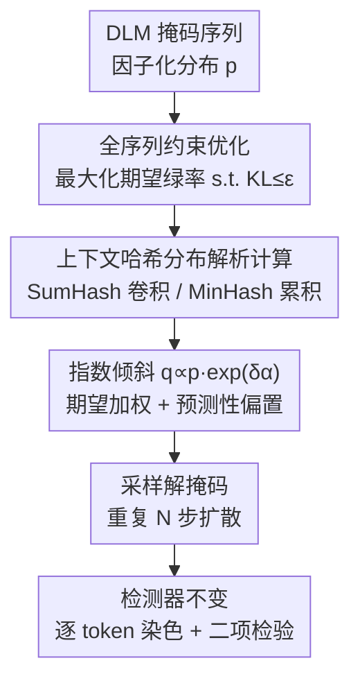

# Watermarking Diffusion Language Models

**会议**: ICLR 2026  
**OpenReview**: [https://openreview.net/forum?id=3aBWTYGcaT](https://openreview.net/forum?id=3aBWTYGcaT)  
**代码**: 有（论文提供，OpenReview 链接内）  
**领域**: AI安全 / 水印溯源 / 扩散语言模型  
**关键词**: 扩散语言模型, 文本水印, Red-Green 水印, 约束优化, 内容溯源

## 一句话总结
本文提出第一个为扩散语言模型（DLM）量身定制的文本水印：把"按上下文哈希染色加权"的 Red-Green 水印写成一个全序列约束优化问题，从而即使某个 token 的上下文尚未解掩码，也能"在上下文哈希的期望意义下"对它加水印，在保持检测器完全不变的前提下做到 >99% 真阳率、几乎不损质量。

## 研究背景与动机
**领域现状**：自回归语言模型（ARLM）的水印已相当成熟，主流是 Red-Green 系列——用前文 token 的哈希作种子，把词表伪随机切成"绿表/红表"，生成时给绿表 token 的 logits 加一个常数 $\delta$ 抬高绿 token 出现概率；检测时对一段文本逐 token 染色，再做二项检验看绿 token 是否显著偏多。这类水印已经进入消费级模型并被写入监管诉求。

**现有痛点**：扩散语言模型（DLM）是新兴范式——它把序列看成一堆带 mask 的占位符，每一步可以**以任意顺序、一次解掩码多个 token**，速度更快、可控性更强。但 Red-Green 水印的哈希机制**强依赖"前文已经生成好"**：要给某个 token 染色，必须先算它上下文的哈希。在 DLM 里，一个 token 常常在它的上下文还是 mask 时就被解出来了，此时根本算不出哈希、也就无法染色。

**核心矛盾**：一个看似自然的折中是"只给上下文已完全确定的 token 加水印"。但作者在实验里指出，这种朴素做法下满足条件的 token 寥寥无几，导致绿 token 太少、真阳率极低——水印形同虚设。问题的根本在于：水印算法必须**直接在"上下文哈希的分布"上操作**，而不是等某个确定的上下文出现。

**本文目标**：设计一个不依赖解掩码顺序、能覆盖**所有** token 的 DLM 水印；同时复用现有 Red-Green 检测器（检测端零改动），并保持生成质量与鲁棒性。

**切入角度**：既然解掩码时上下文是一个概率分布而非确定值，那就把"提高整段文本绿 token 比例"显式写成一个带质量约束的优化目标，在分布层面求解。

**核心 idea**：用"最大化期望绿率、约束每个位置分布与原分布的 KL"这一约束优化，推导出对 logits 做指数倾斜的闭式解；它自然分解成"在上下文哈希期望下的绿表加权"与"偏向能让其他 token 变绿的哈希"两个分量。

## 方法详解

### 整体框架
DLM 在每个扩散步会输出一个对各位置独立的因子化分布 $p(\tilde{\omega})\in\Delta(\Sigma)^L$。本文的水印不修改 DLM 本身，而是在每一步把这个 $p$ 扭曲成一个新的分布 $q$：让按 $q$ 采样出来的整段序列**期望绿 token 比例更高**，同时每个位置 $q_t$ 与原 $p_t$ 的 KL 不超过 $\varepsilon$（控质量）。求解后得到对每个位置 logits 的一个加性偏置，采样/解掩码照常进行，重复 $N$ 步扩散即得带水印文本。检测端则**完全沿用** Red-Green 二项检验，不需要任何改动。

整条流水线串成"原始分布 → 全序列约束优化目标 → 上下文哈希分布的解析计算 → 指数倾斜得到带水印分布 → 解掩码/迭代 → 不变的检测器"：

### 关键设计

**1. 把 DLM 水印写成全序列约束优化：在分布层面而非确定上下文上染色**

朴素折中之所以失败，是因为它要求"上下文已确定"才肯加水印，而 DLM 里这种 token 太少。本文换一个视角：检测器关心的是整段序列的绿率 $\hat{\gamma}(\omega)=\frac{1}{L}\sum_{t=1}^{L} G_{H_t(\omega),\omega_t}$（$G$ 是"哈希值×token→颜色"的全局绿表矩阵，$H_t$ 是位置 $t$ 的上下文哈希），那就直接以"提高这个绿率的期望"为目标。形式化地，把 DLM 给出的分布 $p$ 扭曲成 $q$，求解

$$q^* = \arg\max_{q\in\Delta(\Sigma)^L}\ \mathbb{E}_{\Omega\sim q}[\hat{\gamma}(\Omega)]\quad \text{s.t.}\quad \forall t,\ \mathrm{KL}(q_t, p_t(\tilde{\omega}))\le\varepsilon.$$

在"token 不进入自己上下文"（no self-hashing）假设下，期望可以拆开成 $\mathbb{E}_{\Omega\sim q}[\hat{\gamma}(\Omega)]=\frac{1}{L}\sum_t h_t(q)^\top G\, q_t=:\frac{1}{L}J(q)$，其中 $h_t(q)$ 是"上下文哈希取各值的概率分布"，$J$ 被称为能量函数。作者证明（Theorem 3.1）最优解有简单闭式：$q^*_t\propto p_t\exp(\delta_t\,\alpha_t(q^*))$，其中 $\alpha_t(q)=\nabla_{q_t}J(q)$，而 $\delta_t$ 是让 $\mathrm{KL}(q^*_t,p_t)=\varepsilon$ 成立的唯一解。换到 logits 空间，这就是"给原 logits 加上 $\delta_t\alpha_t$"——与 Red-Green 的加性偏置同形，但偏置项来自全序列优化而非单个确定上下文。这正是它能给"上下文尚未确定"的 token 也加水印的根源。

**2. 上下文哈希分布的解析高效计算：让期望可算**

设计 1 要用到每个位置的上下文哈希分布 $h_t(q)$，但直接按定义枚举所有上下文组合是 $O(\Sigma^L)$，不可行。本文利用两类局部哈希函数的结构给出解析公式。**SumHash** 把上下文位置集合 $C$ 内的 token id 求和作为哈希 $H^{\text{SumHash}}(\omega)_t=\sum_{i\in C}\omega_{t+i}$；其哈希分布恰好是各上下文位置分布的**卷积** $h^{\text{SumHash}}_t(p)=p_{t+c_1}\!*\cdots*p_{t+c_k}$，用 FFT 计算只需 $O(|C||\Sigma|\log|\Sigma|)$。**MinHash** 取上下文中（经随机置换后）最小的 token id 为哈希，其分布可用累积乘积 $A_t(s)=\prod_{i\in C}\sum_{u\ge s}p^\sigma_{t+i}(u)$ 写成 $h^{\text{MinHash}}_t(p)_s=A_t(s+1)-A_t(s)$，只需 $O(|C||\Sigma|)$。值得注意的是，DLM 的上下文不再限于前文，$C$ 可以包含**后文** token（如 $C=\{-1,1\}$ 同时看前后各一个），这是 DLM 任意顺序生成赋予的额外自由度。实际算法（Algorithm 2）每步只对每个位置取 top-$k$ 的 $h_t$ 与 $p_t$ 参与计算，再做指数倾斜，并可迭代 fixed-point 若干次精修；总复杂度 $O(nL|C||\Sigma|\log|\Sigma|)$，由于 $n,|C|$ 都很小，生成开销极低。

**3. 分解为"期望加权 + 预测性偏置"：揭示它如何自然延拓 Red-Green**

闭式解 $\delta_t\alpha_t$ 看似抽象，作者以 SumHash、$C=\{-1\}$ 为例做显式展开，得到

$$q^*_t\propto p_t\underbrace{\exp(\delta G^\top p_{t-1})}_{\text{期望加权 (expectation boost)}}\underbrace{\exp(\delta G p_{t+1})}_{\text{预测性偏置 (predictive bias)}}.$$

第一项是**期望加权**：把 Red-Green 的绿表 boost 放到"上下文分布 $p_{t-1}$ 的期望"下做——当 $p_{t-1}$ 把全部质量压在某个确定 token 上时，它就**精确退化**回标准 Red-Green 的 $\delta$ 加 boost。第二项是**预测性偏置**：偏向那些"被选中后能让后文 token 更可能变绿"的 token，相当于反过来利用"我此刻的选择会成为别人上下文哈希"这一事实。这一分解说明本文水印是 Red-Green 的自然延拓：作者进一步证明，把优化问题限制到自回归情形时，预测性偏置消失、只剩期望加权，得到的正是原版 Red-Green ARLM 水印。这也是检测端能零改动复用的原因——水印信号最终仍体现为"绿 token 偏多"。

### 损失函数 / 训练策略
本方法是**推理时（generation-time）水印**，不训练、不改 DLM 权重。两个可调口径：用 KL 上界 $\varepsilon$ 参数化（$\varepsilon$-参数化，逐位置二分求 $\delta_t$），或直接用常数强度 $\delta$ 参数化（$\delta$-参数化）。实验表明 $\delta$-参数化检测性更好，推荐除非需要 KL 散度保证。fixed-point 迭代单次即可得到强水印，增加迭代仅边际提升、却线性增加计算量。

## 实验关键数据

### 主实验
设置：WaterBench 协议，600 条 prompt，响应长度约 150–300 token；DLM 用 LLaDA-8B 与 Dream-7B，温度 0.5、随机 remasking；SumHash、$\delta$-参数化、单次迭代、top-$k=50$。指标 TPR@1 = 1% 假阳率下的真阳率，质量用 log 困惑度、GPT-4 评分、基准准确率衡量。

| 模型 | 上下文 / 强度 | 类型 | TPR@1 | log(PPL) | GPT4 | Acc |
|------|------|------|------|------|------|------|
| LLaDA-8B | 未加水印 | — | 0.00 | 1.56 | 8.95 | 59.4 |
| LLaDA-8B | $C=\{-1\}, \delta=4$ | Baseline | 0.63 | 1.93 | 8.48 | 55.5 |
| LLaDA-8B | $C=\{-1\}, \delta=4$ | Ours | **0.99** | 1.90 | 8.43 | 56.0 |
| Dream-7B | 未加水印 | — | 0.00 | 1.94 | 8.45 | 50.4 |
| Dream-7B | $C=\{-1\}, \delta=4$ | Baseline | 0.49 | 2.27 | 7.95 | 35.8 |
| Dream-7B | $C=\{-1\}, \delta=4$ | Ours | **0.99** | 2.32 | 7.76 | 50.1 |

在质量影响相当（log PPL、GPT-4 评分接近）的前提下，本文一致达到 99% TPR@1，而朴素 baseline 仅 0.49–0.83；不同上下文配置（$C=\{-1,1\}$、$C=\{-2,-1\}$，对应推荐 $\delta=5$）结论一致。检测性随文本长度快速上升——本文在约 50 token 处的检测性，相当于 baseline 在约 350 token 处。

### 消融实验

| 配置 | 关键发现 | 说明 |
|------|---------|------|
| 哈希方案 SumHash vs MinHash | 检测性无显著差异 | 两种局部哈希皆可 |
| 仅期望加权 / 仅预测性偏置 / 两者 | 两者并用最优 | 印证优化形式 Eq.(1) 找到了好策略 |
| fixed-point 迭代 1/3/5 | 仅边际提升 | 但计算量线性增长，故取 1 次 |
| $\varepsilon$-参数化 vs $\delta$-参数化 | $\delta$ 明显更好 | KL 约束是质量的不完美代理 |

### 关键发现
- **两个分量缺一不可且互补**：期望加权对应"在期望意义下复刻 Red-Green"，预测性偏置利用"我会成为别人上下文"的额外信息；合用在固定质量损失下检测性最佳。
- **$\delta$ 比 $\varepsilon$ 好的反直觉解释**：当两个等价贡献质量的 token 一绿一红、各 0.5 概率时，理想策略应把概率全压向绿 token（零质量损失），但 KL 约束会限制这种倾斜、反而削弱水印——说明 KL 不是质量的好代理。
- **鲁棒性**：对词删除、词替换在编辑 30% 以内仍保持强检测；对**上下文感知替换**显著比 ARLM 水印更鲁棒——因为"在上下文哈希期望下加水印"会附带让"原文的各种近似变体"也带上水印；对改写、回译等强攻击会掉点，但随 token 数增加可恢复信号。
- **优于序列无关水印**：相比 Unigram、PatternMark 这类可直接用于 DLM 的序列无关水印，本文在同等质量下检测性更好（低失真区尤其明显），且不存在它们的 Type-1 误差不可控、易被 spoofing/scrubbing 攻击等缺陷。

## 亮点与洞察
- **"在分布上加水印"是核心解题钥匙**：把"需要确定上下文"换成"在上下文哈希的期望/分布上操作"，一举绕开 DLM 任意顺序解掩码的死结，思路干净且通用。
- **检测端零改动**：水印强度全部塞进生成端的 logits 倾斜，检测器仍是 Red-Green 二项检验——这让方案可以无缝复用现有水印基础设施，落地成本极低。
- **优化解恰好退化回 ARLM 水印**：约束优化限制到自回归情形时精确恢复 Red-Green，说明这是一个"包含旧方法的更一般框架"，理论上很优雅。
- **可迁移的 trick**：用卷积/FFT、累积乘积把"上下文组合的期望"从 $O(\Sigma^L)$ 降到近线性，这种"利用哈希局部结构做解析化"的手法，可迁移到其他需要在 token 分布上算期望统计量的场景。

## 局限与展望
- **对部分模型/超参可能掉准确率**：LLaDA-8B 上本文对基准准确率的影响略大于（检测性低得多的）baseline，说明某些"模型×超参"组合下仍可能带来不可忽略的准确率下降。
- **强攻击仍会掉点**：改写、回译等强对抗会显著削弱检测性，需要靠更长文本来恢复信号，短文本场景下鲁棒性有限。
- **依赖 no self-hashing 假设**：期望可因式分解的前提是 token 不进入自身上下文，若哈希设计违背此假设，解析公式不再成立。
- **改进思路**：探索把质量约束从 KL 换成更贴近真实文本质量的度量（论文已指出 KL 是不完美代理），或针对改写类攻击设计语义级的期望加权。

## 相关工作与启发
- **vs Red-Green ARLM 水印（Kirchenbauer et al.）**：他们用确定前文哈希做绿表 boost，只适配自回归；本文把它推广到"上下文哈希分布的期望"，覆盖任意解掩码顺序，且自回归特例下精确退化回前者。
- **vs 朴素 DLM 适配（baseline）**：只给上下文已确定的 token 加水印，绿 token 太少导致 TPR 仅约 0.5–0.8；本文覆盖全部 token，TPR 达 0.99。
- **vs 序列无关水印 Unigram / PatternMark**：它们只看单 token 分布、可直接用于 DLM，但 Type-1 误差不可控、易被 spoofing/scrubbing；本文利用全序列分布，质量-检测性折中更好且无这些安全缺陷。
- **vs 图像扩散水印**：图像扩散水印在连续空间操作，无法用于 DLM 的离散扩散过程；本文是为离散扩散设计的第一个生成时水印。

## 评分
- 新颖性: ⭐⭐⭐⭐⭐ 第一个 DLM 专用水印，约束优化框架优雅且能精确退化回 Red-Green。
- 实验充分度: ⭐⭐⭐⭐ 两个 DLM、多上下文、鲁棒性与序列无关水印对比齐全，但准确率影响的边界条件还可更细。
- 写作质量: ⭐⭐⭐⭐⭐ 从痛点到优化推导再到双分量解释层层递进，理论与直觉兼顾。
- 价值: ⭐⭐⭐⭐⭐ DLM 兴起背景下内容溯源刚需，检测端零改动使其极易落地。

<!-- RELATED:START -->

## 相关论文

- [\[ICLR 2026\] wd1: Weighted Policy Optimization for Reasoning in Diffusion Language Models](wd1_weighted_policy_optimization_for_reasoning_in_diffusion_language_models.md)
- [\[ICLR 2026\] Membership Inference Attacks Against Fine-tuned Diffusion Language Models (SAMA)](membership_inference_attacks_against_fine-tuned_diffusion_language_models.md)
- [\[ICLR 2026\] DiffuGuard: How Intrinsic Safety is Lost and Found in Diffusion Large Language Models](diffuguard_how_intrinsic_safety_is_lost_and_found_in_diffusion_large_language_mo.md)
- [\[ACL 2026\] Retrievals Can Be Detrimental: Unveiling the Backdoor Vulnerability of Retrieval-Augmented Diffusion Models](../../ACL2026/llm_safety/retrievals_can_be_detrimental_unveiling_the_backdoor_vulnerability_of_retrieval-.md)
- [\[ACL 2025\] MorphMark: Flexible Adaptive Watermarking for Large Language Models](../../ACL2025/llm_safety/morphmark_adaptive_watermarking.md)

<!-- RELATED:END -->
