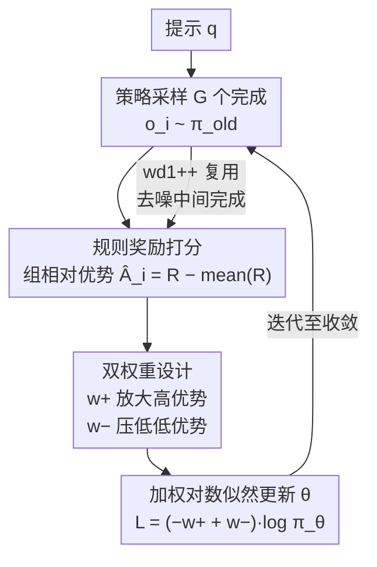

# wd1: Weighted Policy Optimization for Reasoning in Diffusion Language Models

**会议**: ICLR 2026  
**arXiv**: [2507.08838](https://arxiv.org/abs/2507.08838)  
**代码**: [https://github.com/xiaohangt/wd1](https://github.com/xiaohangt/wd1)  
**领域**: LLM 安全 / 扩散语言模型  
**关键词**: 扩散语言模型, 强化学习, 策略优化, 推理能力, dLLM

## 一句话总结
提出 wd1，一种无需策略比率（ratio-free）的加权对数似然策略优化方法用于扩散语言模型（dLLM）的 RL 微调，通过正样本加权和负样本惩罚避免了 GRPO 中策略比率估计的偏差和高方差问题，在 LLaDA-8B 上实现了 Sudoku +59%、GSM8K 84.5% 的 SOTA 性能。

## 研究背景与动机

**领域现状**：扩散语言模型（dLLM）如 LLaDA、Dream 等已在文本生成上接近自回归模型性能。AR 模型通过 RLHF/GRPO 等 RL 方法显著提升了推理能力（如 DeepSeek-R1），但如何为 dLLM 做 RL 微调仍是开放问题。

**现有痛点**：dLLM 的似然函数不可精确计算（intractable），只能近似。现有方法（如 d1、UniGRPO）将 GRPO 适配到 dLLM 时，需要近似计算策略比率 $r_i^k \approx \exp(\phi^{\pi_\theta} - \phi^{\pi_{old}})$，这带来三个问题：(a) 近似误差被指数放大；(b) ELBO 估计的方差大；(c) 需要同时近似三个策略（当前、旧、参考）的似然，计算开销大。

**核心矛盾**：策略比率是 PPO/GRPO 的核心，但 dLLM 的似然不可精确计算，近似比率不可靠。如何在不计算策略比率的条件下进行有效的策略优化？

**本文目标**：设计一种不依赖策略比率的 RL 方法，仅需一次当前策略的似然近似，同时充分利用正负样本。

**切入角度**：从 reverse-KL 正则化的策略优化出发，推导出最优策略的解析形式，然后最小化 $D_{KL}(\pi^* \| \pi_\theta)$，将优化转化为加权对数似然最大化——不涉及策略比率。

**核心 idea**：将 RL 目标重新表述为加权对数似然（WLL），权重由优势函数的指数决定。进一步引入负样本惩罚项（$w^-$），主动降低低优势完成的似然，形成 wd1。理论上证明 wd1 等价于能量引导的离散扩散训练 + 负样本遗忘。

## 方法详解

### 整体框架

对每个提示 $q$，策略 $\pi_\theta$ 先采样出 $G$ 个完成 $\{o_i\}$，用规则奖励 $R(q,o_i)$ 打分并算组相对优势 $\hat{A}_i = R(q,o_i) - \text{mean}(R)$。与 GRPO 不同的是，wd1 不再去估计任何策略比率（policy ratio），而是把优势直接变成对数似然上的一对权重——正权重 $w^+$ 放大高优势完成、负权重 $w^-$ 压低低优势完成——据此更新策略，全程只需要一次当前策略 $\pi_\theta$ 的似然近似。它的进阶版 wd1++ 再把去噪过程中吐出的中间完成也纳入训练样本，换来更高的数据效率。

### 关键设计

**1. 加权对数似然：把策略比率换成优势加权**

GRPO/PPO 的核心是策略比率 $r_i \approx \exp(\phi^{\pi_\theta} - \phi^{\pi_{old}})$，但 dLLM 的似然不可精确计算，近似值被带进指数后误差会被放大、方差也很高。wd1 改从 reverse-KL 约束优化入手，解出最优策略的解析形式

$$\pi^* \propto \pi_{old}^{\lambda/(\lambda+\beta)} \cdot \pi_{ref}^{\beta/(\lambda+\beta)} \cdot \exp\!\Big(\tfrac{A}{\lambda+\beta}\Big),$$

再最小化 $D_{KL}(\pi^* \,\|\, \pi_\theta)$，目标就化简成一个加权对数似然（weighted log-likelihood, WLL），权重正比于优势的指数——整个推导里不再出现策略比率。但纯 WLL 有两个毛病：低优势样本权重趋零被白白浪费，而且即使一组完成奖励全相同，它仍会盲目抬高所有样本的似然。为此 wd1 补上负样本惩罚项，最终目标写成 $\mathcal{L}_{wd1} = \frac{1}{G}\sum_i (-w^+ + w^-)\log\pi_\theta(o_i|q)$，其中 $w^+ \propto \exp(\psi\hat{A}_i)$ 放大高优势完成、$w^- \propto \exp(-\psi\hat{A}_i)$ 压低低优势完成（两者都在组内归一化）。这样当一组完成优势相同时 $w^+ = w^-$、梯度自动归零，既避开了比率的指数误差，又修好了 WLL 在无信息组上的退化。

**2. wd1++：把去噪中间步也当训练信号，换来数据效率**

标准 wd1 只用最终完成 $o_i$，而 dLLM 在去噪过程里其实逐步吐出过一连串中间预测，这是自回归（autoregressive, AR）模型没有的产物。wd1++ 把每个 rollout 的样本组从 $\{o_i\}$ 扩展为 $O_i = \{x_{0|l}\}_{l=1}^L$，纳入每个去噪步 $l$ 的中间完成，并基于去噪交叉熵（denoising cross entropy, DCE）给出步级目标 $\mathcal{L}_{wd1++} = \frac{L}{Gl} \sum_i \sum_{x_{0|l}} (-w^+ + w^-)\log\pi_\theta(x_{0|l} | x_l, q)$。等于把一次采样里的所有中间状态都复用成训练信号，实测能用约 10× 更少的 rollouts 反而达到更好性能。

**3. 能量引导扩散 + 负样本遗忘：给 ratio-free 一个理论落点**

论文进一步证明 WLL 等价于优势加权的去噪交叉熵（AW-DCE），也就是在训练一个能量函数取负优势（$\mathcal{E} = -A$）的能量引导离散扩散模型；而负样本惩罚项 $w^-$ 等价于最小化对应 ELBO，效果上就是对低质量完成做"数据遗忘"（unlearning）。这条等价把 dLLM 的 RL 微调和能量引导扩散采样统一进同一个理论框架，也解释了为什么主动遗忘坏样本（而非只强化好样本）会是关键。

### 损失函数 / 训练策略

完整损失即 $\mathcal{L}_{wd1} = \frac{1}{G} \sum_{i=1}^G (-w^+(q,o_i) + w^-(q,o_i)) \cdot \log \pi_\theta(o_i | q)$，用 LoRA 在 LLaDA-8B-Instruct 上微调、无需 d1 那样的 SFT 预热阶段。实践中取 $\beta=0, \lambda=1$ 去掉参考策略正则化；似然近似沿用 d1 的做法 $\log \pi_\theta(x_0|q) \approx \sum_k \log \pi_\theta(x_0^k | x_1, q')$；每步做 $\mu=8$ 次梯度更新，并把权重跨所有组归一化以稳住训练。

## 实验关键数据

### 主实验

| 方法 | Sudoku (256) | Countdown (256) | GSM8K (512) | MATH500 (512) |
|------|-------------|-----------------|------------|---------------|
| LLaDA-8B-Instruct | 6.7% | 19.5% | 78.2% | 36.2% |
| + diffu-GRPO | 16.1% | 27.0% | 80.7% | 39.0% |
| + d1 (SFT+GRPO) | 17.6% | 25.8% | 82.0% | 38.0% |
| + **wd1** | **76.4%** | **51.2%** | 82.3% | 39.0% |
| + **wd1++** | - | - | **84.5%** | **44.2%** |
| + MDPO | - | - | 83.7% | 43.8% |
| + TCR | - | - | 83.0% | 41.4% |

### 消融实验

| 配置 | Sudoku | Countdown | 说明 |
|------|--------|-----------|------|
| wd1 (完整) | 76.4% | 51.2% | full model |
| 仅 $w^+$（WLL）| 50.2% | 39.5% | 去掉负样本惩罚，-26% |
| 仅 $w^-$ | 15.3% | 22.1% | 仅惩罚无强化 |
| d1 | 17.6% | 25.8% | 基线 |

训练成本对比（4×A100）：
- d1: SFT 2.01h + RL 103.5s/step, FLOPs 9.92e15/step, NFEs (μ+2)/step
- wd1: 无 SFT + RL 81.16s/step, FLOPs 8.89e15/step, NFEs μ/step

### 关键发现
- **Sudoku 上 wd1 比 d1 高 59%**（76.4% vs 17.6%），Countdown 高 25%——说明 ratio-free 方法在约束推理任务上优势巨大
- **负样本惩罚至关重要**：去掉 $w^-$ 后 Sudoku 从 76.4% 降到 50.2%，主动"遗忘"低质量完成是关键
- **wd1++ 用 10× 更少 rollouts 达到 SOTA**：84.5% GSM8K, 44.2% MATH500，仅需 20 训练步
- **无需 SFT 阶段**：wd1 直接从 Instruct 模型开始 RL，省去了 d1 需要的 2 小时 SFT
- 每步计算成本降低 ~22%（81.16s vs 103.5s），因为不需要近似旧策略和参考策略的似然

## 亮点与洞察
- **Ratio-free 设计的优雅性**：通过切换 KL 方向（forward → reverse），将 TRPO/PPO 的比率依赖转化为加权似然，这个思路在 AR 模型上也可能有价值
- **$w^+ / w^-$ 的对偶设计**：正样本加权（增加好结果的概率）和负样本惩罚（减少坏结果的概率）的组合，在优势相同时自动停止——这种自平衡机制很巧妙
- **能量引导扩散的统一理论**：将 RL fine-tuning 理解为能量引导扩散训练，为理解和改进 dLLM RL 提供了新框架
- **中间步利用（wd1++）**：利用去噪中间产物做训练，这是 dLLM 独有的优势，AR 模型无法利用

## 局限与展望
- 仅在 LLaDA-8B 上验证，需要在更多 dLLM（如 Dream、DiffuCoder）上测试
- 似然近似仍然使用 d1 的有偏方法（t=1 采样），更好的近似可能进一步提升性能
- 未探索与 RLHF（人类反馈）结合的可能性
- wd1++ 需要存储中间去噪步的完成，内存开销增加

## 相关工作与启发
- **vs d1 (Zhao et al., 2025)**：d1 将 GRPO 适配到 dLLM，但保留了策略比率计算。wd1 完全消除比率，减少误差和计算量
- **vs UniGRPO (Yang et al., 2025)**：UniGRPO 用 DCE 估计似然，采样多个 $t$ 值，更准确但更慢。wd1 只需一次当前策略近似
- **vs MDPO (He et al., 2025)**：MDPO 使用 DPO 风格的偏好优化。wd1++ 在 GSM8K 和 MATH500 上略优

## 评分
- 新颖性: ⭐⭐⭐⭐⭐ ratio-free 设计 + 能量引导理论统一 + 中间步利用，三个层面都有创新
- 实验充分度: ⭐⭐⭐⭐ 多 benchmark 验证 + 消融 + 计算成本分析，但仅一个 base model
- 写作质量: ⭐⭐⭐⭐ 理论推导清晰，但论文较密集
- 价值: ⭐⭐⭐⭐⭐ 解决了 dLLM RL 的核心技术瓶颈，SOTA 性能 + 显著计算节省

<!-- RELATED:START -->

## 相关论文

- [\[ICLR 2026\] Watermarking Diffusion Language Models](watermarking_diffusion_language_models.md)
- [\[ICLR 2026\] EEPO: Exploration-Enhanced Policy Optimization via Sample-then-Forget](eepo_exploration-enhanced_policy_optimization_via_sample-then-forget.md)
- [\[ICLR 2026\] Tree-based Dialogue Reinforced Policy Optimization for Red-Teaming Attacks (DialTree)](tree-based_dialogue_reinforced_policy_optimization_for_red-teaming_attacks.md)
- [\[ICLR 2026\] Membership Inference Attacks Against Fine-tuned Diffusion Language Models (SAMA)](membership_inference_attacks_against_fine-tuned_diffusion_language_models.md)
- [\[ICLR 2026\] PURGE: Reinforcement Unlearning via Group Relative Policy Optimization](reinforcement_unlearning_via_group_relative_policy_optimization.md)

<!-- RELATED:END -->
