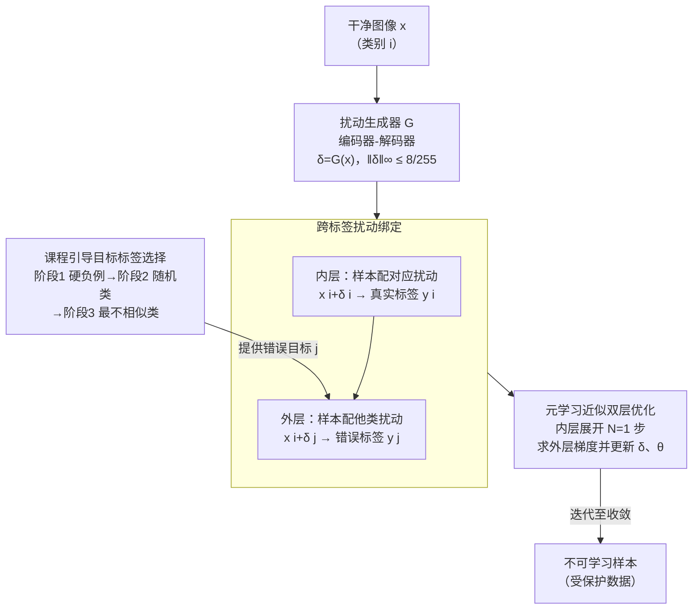

# When Priors Backfire: On the Vulnerability of Unlearnable Examples to Pretraining

**会议**: ICLR 2026  
**arXiv**: [2603.04731](https://arxiv.org/abs/2603.04731)  
**代码**: [https://github.com/zhli-cs/BAIT](https://github.com/zhli-cs/BAIT)  
**领域**: LLM评测  
**关键词**: 不可学习样本, 预训练先验, 数据保护, 双层优化, 对抗扰动

## 一句话总结

揭示了不可学习样本 (UEs) 在预训练模型上的根本性脆弱性——预训练先验使模型能绕过扰动捷径学到真实语义，并提出 BAIT 框架通过将扰动绑定到错误标签来对抗预训练先验。

## 研究背景与动机

不可学习样本 (Unlearnable Examples, UEs) 是一种数据保护策略：通过给训练数据添加不可感知的扰动，使模型学到虚假捷径而非真实语义，从而在干净测试集上失效。然而，现有 UE 研究都假设模型从随机初始化训练，忽略了一个关键实际场景：

**预训练模型是现代深度学习的标配。** 实践者通常使用预训练骨干（如 ImageNet 预训练的 ResNet）进行微调，而非从头训练。

作者通过系统实验发现了一个此前被忽视的根本性脆弱性：

**性能差距巨大**：在 CIFAR-10 上，预训练模型在 UE 数据上的测试精度远高于从头训练模型，说明 UE 的"不可学习"性被预训练先验对冲了

**逐层验证**：将预训练层逐步替换为随机初始化层后，测试精度持续下降——先验越少，UE 越有效

**参数更新动态**：预训练模型在 UE 数据上的参数更新幅度与干净数据相当，说明模型通过先验建立的"语义-标签通道"绕过了扰动捷径

**学习曲线**：预训练模型在 EMN 扰动数据上训练时，测试精度与训练精度同步上升——模型确实在学习真实语义

## 方法详解

### 整体框架

BAIT (Binding Artificial perturbations to Incorrect Targets) 要解决的是：预训练先验会让模型绕过扰动捷径、学到真实语义，使不可学习样本 (UE) 失效。它的办法是把扰动生成写成一个**双层优化** (bi-level optimization)——一个编码器-解码器生成器 $\mathcal{G}$ 先产出类级扰动 $\delta=\mathcal{G}(x)$；内层照常用"样本+对应扰动→真实标签"训练代理模型，**模拟**预训练先验下的正常学习；外层则反过来调整扰动，逼模型把"样本+某类扰动"判成那一类的**错误标签**，从而把扰动本身变成主导预测的信号。由于外层依赖内层的最优参数无法直接求解，BAIT 用元学习把内层展开若干步来近似外层梯度；外层每步绑定的"错误目标类"则由一个三阶段课程由易到难地挑选。形式上目标为

$$\min_{\delta} \mathbb{E}_{(x,y) \sim \mathcal{D}_c} \mathcal{L}(f_\theta(x^i + \delta^j), y^j) \quad \text{s.t.} \quad \theta \in \arg\min_\theta \mathbb{E}_{(x,y) \sim \mathcal{D}_c} \mathcal{L}(f_\theta(x^i + \delta^i), y^i)$$

其中 $i \neq j$ 代表不同类别，$\delta^j$ 是类别 $j$ 对应的类级扰动。

### 关键设计

**1. 跨标签扰动绑定：让扰动主导预测而非搭语义便车**

以往 UE 都保持 $(x^i + \delta^i \to y^i)$ 的对齐，扰动只是给真实标签"加捷径"；可一旦换上预训练骨干，模型靠先验建立的语义-标签通道就能绕过捷径、直接学到真实语义，这正是 UE 在预训练下失效的根源。BAIT 的内层优化先模拟这条正常通道——把类别 $i$ 的样本配上对应扰动 $\delta^i$ 映射到真实标签 $y^i$；外层优化则主动拆掉这条对齐，强制 $(x^i + \delta^j \to y^j)$，即给类别 $i$ 的样本叠上类别 $j$ 的扰动后必须判成 $y^j$。这样扰动 $\delta^j$ 与错误标签 $y^j$ 形成强关联，模型再想绕过扰动就会判错，先验反而被这条人为通道牵着走。

**2. 元学习近似双层优化：把内层展开 $N$ 步求外层梯度**

双层优化里外层扰动的梯度依赖内层最优参数 $\theta$，直接精确求解不可行。BAIT 采用元学习 (meta-learning)，把内层优化展开 $N$ 步来近似：内层先按真实对齐做若干步更新 $\theta'_{n,m+1} = \theta'_{n,m} - \alpha \nabla_{\theta'_{n,m}} \mathcal{L}(f_\theta(x^i + \delta^i), y^i)$，得到一个"向前看 $N$ 步"的代理权重 $\theta'_{n,N}$，再用它算外层扰动的梯度并更新 $\delta^j_{n+1} = \delta^j_n - \beta \nabla_{\delta^j_n} \mathcal{L}(f_{\theta'_{n,N}}(x^i + \delta^j_n), y^j)$。这一步让生成器能"预判"当前扰动经 $N$ 步训练后会如何影响错误标签绑定。实现上展开步数取 $N = 1$ 即可，内层学习率 $\alpha = 0.1$，外层用 Adam 以 $\beta = 0.001$ 优化，在效率和近似精度间取得平衡。

**3. 课程引导的目标标签选择：由易到难挑错误标签**

外层要把样本绑到"哪个"错误标签上很关键——固定一个目标类泛化性差，一上来就挑最难混淆的类又会让扰动难以收敛。BAIT 借鉴课程学习 (curriculum learning)，按"误分类难易"设计三阶段由易到难的策略：阶段一选 logit 最高的非真实类（硬负例，最容易混淆，先让扰动站稳脚跟），阶段二改成随机非真实类（增加难度、提升对不同目标的泛化性），阶段三选最不相似的类（最具挑战，逼扰动鲁棒到能扭转最强先验）。消融显示三阶段逐步叠加，每步都进一步压低测试精度，印证了渐进式难度的必要性。

### 损失函数 / 训练策略

扰动由一个编码器-解码器结构的生成器 $\mathcal{G}$ 产生（$\delta = \mathcal{G}(x)$），并约束在不可感知范围内 $\|\delta\|_\infty \leq 8/255$；最终类级扰动由同类各样本扰动取平均得到。整个流程以 ImageNet 预训练的 ResNet-18 作为代理模型，确保生成的扰动是针对"带先验的模型"而非随机初始化模型优化的，这也是 BAIT 能在预训练场景下生效的前提。三阶段课程每阶段在 CIFAR-10/CIFAR-100 上训练 30 个 epoch、SVHN 上 20 个 epoch。

## 实验关键数据

### 主实验

在 ImageNet 预训练骨干上的测试精度 (%) ↓（越低越好 = 不可学习性越强）：

| 数据集 | 骨干 | Clean | EMN | TUE | GUE | 14A | **BAIT** |
|--------|------|-------|-----|-----|-----|-----|----------|
| CIFAR-10 | ResNet-18 | 84.10 | 61.82 | 82.72 | 23.17 | 65.70 | **14.40** |
| CIFAR-10 | ResNet-50 | 86.48 | 57.54 | 85.68 | 71.42 | 72.81 | **14.82** |
| CIFAR-100 | ResNet-18 | 55.73 | 55.53 | 55.20 | 54.09 | 33.67 | **20.77** |
| SVHN | ResNet-18 | 90.96 | 37.55 | 41.15 | 39.68 | 81.47 | **14.37** |
| SVHN | DenseNet-121 | 92.97 | 58.22 | 40.53 | 73.34 | 86.83 | **11.61** |

BAIT 在所有设置下都将测试精度压到接近随机猜测的水平，而其他方法在预训练模型面前普遍失效（如 TUE 在 CIFAR-10/ResNet-18 上仍有 82.72% 精度）。

### 消融实验

课程学习目标选择策略的效果（ResNet-18）：

| 阶段1 | 阶段2 | 阶段3 | CIFAR-10 | CIFAR-100 | SVHN |
|-------|-------|-------|----------|-----------|------|
| ✓ | | | 23.68 | 35.75 | 21.75 |
| ✓ | ✓ | | 20.60 | 23.94 | 16.58 |
| ✓ | ✓ | ✓ | **14.40** | **20.77** | **14.37** |

三个阶段逐步添加，每步都带来显著的不可学习性提升，验证了由易到难的课程策略的有效性。

### 关键发现

1. **跨先验迁移性**：用 ImageNet 预训练代理生成的扰动，在 CIFAR-10/CIFAR-100/SVHN 预训练的骨干上依然有效
2. **跨架构迁移性**：用 ResNet-18 代理生成的扰动，在 VGG-11、DenseNet-121、GoogLeNet 甚至 ViT 上都能维持不可学习性
3. **更复杂数据集**：在 Flowers102 和 ImageNet 子集上，BAIT 仍显著优于基线（Flowers: 24.91 vs 最佳基线 43.91）
4. **ViT 更难攻击**：ViT 类架构的预训练先验更强，基线几乎完全失效（TUE 在 CIFAR-10 上保留 >90% 精度），但 BAIT 仍能有效降低精度

## 亮点与洞察

- **发现层面**：首次系统揭示 UE 对预训练的脆弱性，以及预训练先验提供的"语义-标签通道"可以绕过扰动捷径，这是对 UE 领域的重大认知更新
- **方法层面**：跨标签扰动绑定 $(x^i + \delta^j \to y^j)$ 的设计精妙——它不是简单地优化扰动使训练损失最小化，而是主动制造扰动-错误标签的强关联
- **课程学习融入对抗优化**：由易到难的目标选择策略使扰动更鲁棒，这一思路可推广到其他对抗设计场景
- 将 UE 研究从"对抗从头训练"拓展到"对抗预训练微调"这一更具实际意义的场景

## 局限与展望

1. 需要 ImageNet 预训练代理模型——在某些场景下这一假设可能不成立
2. 类级扰动可能不如样本级扰动灵活，特别是在类内变异大的情况下
3. 未探索对 NLP 领域预训练模型（如 BERT 微调）的适用性
4. 计算成本：双层优化 + 三阶段课程学习比简单的 UE 方法计算开销更大
5. 未讨论自适应防御者——如果攻击者知道数据被 BAIT 保护，是否有反制手段

## 相关工作与启发

- **EMN** (Huang et al., 2021)：最经典的 UE 方法，本文直接对标
- **GUE** (Liu et al., 2024a)：博弈论视角的 UE，在从头训练上效果好但面对预训练模型退化严重
- **14A** (Chen et al., 2024)：使用 CLIP 辅助的 UE，但仍不如 BAIT
- 启发：数据保护策略必须考虑最强的攻击场景（预训练微调已是标配），仅在理想条件下有效的保护是不够的

## 评分

- **新颖性**: 8/10 — 首次揭示 UE 对预训练的脆弱性，观察和方法都很新颖
- **技术深度**: 8/10 — 双层优化 + 课程学习的理论驱动设计清晰严谨
- **实验充分度**: 9/10 — 多数据集、多骨干、跨架构、跨先验的全面评测
- **写作质量**: 8/10 — 动机部分的实证分析特别出色，图1是全文的亮点
- **实用价值**: 7/10 — 数据保护是重要问题，但部署条件较苛刻

<!-- RELATED:START -->

## 相关论文

- [\[ICLR 2026\] Perturbation-Induced Linearization: Constructing Unlearnable Data with Solely Linear Classifiers](perturbation-induced_linearization_constructing_unlearnable_data_with_solely_lin.md)
- [\[ICCV 2025\] Temporal Unlearnable Examples: Preventing Personal Video Data from Unauthorized Exploitation](../../ICCV2025/llm_safety/temporal_unlearnable_examples_preventing_personal_video_data_from_unauthorized_e.md)
- [\[ICLR 2026\] Train Once, Answer All: Many Pretraining Experiments for the Cost of One](train_once_answer_all_many_pretraining_experiments_for_the_cost_of_one.md)
- [\[ICLR 2026\] MSCR: Exploring the Vulnerability of LLMs' Mathematical Reasoning Abilities Using Multi-Source Candidate Replacement](mscr_exploring_the_vulnerability_of_llms_mathematical_reasoning_abilities_using_.md)
- [\[ICLR 2026\] OffTopicEval: When Large Language Models Enter the Wrong Chat, Almost Always!](offtopiceval_when_large_language_models_enter_the_wrong_chat_almost_always.md)

<!-- RELATED:END -->
