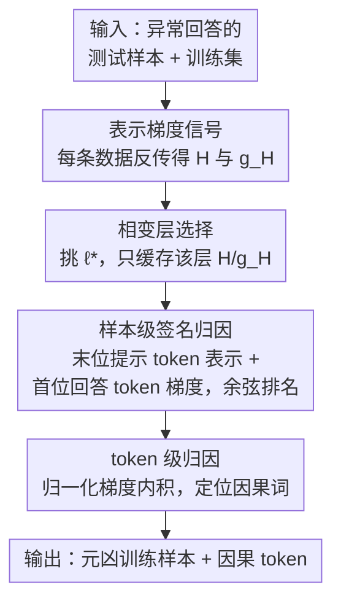

# Where Did It Go Wrong? Attributing Undesirable LLM Behaviors via Representation Gradient Tracing

**会议**: ICLR 2026  
**OpenReview**: [https://openreview.net/forum?id=MN1qlAVJLV](https://openreview.net/forum?id=MN1qlAVJLV)  
**代码**: https://github.com/plumprc/RepT  
**领域**: AI安全 / 数据归因 / 可解释性  
**关键词**: 数据归因, 表示梯度, 影响函数, 有害微调, 后门检测, 知识污染

## 一句话总结
当一个微调后的 LLM 产生有害/错误回答时，本文提出 RepT（Representation Gradient Tracing），不再用昂贵且嘈杂的参数梯度，而是在模型的**表示（激活）空间**里用「表示梯度」做数据归因，把这个坏行为精确追溯到训练集中的元凶样本、甚至元凶 token，在有害微调、后门投毒、知识污染三类任务上几乎做到 100% 的 auPRC，且显存/耗时比影响函数类方法低一两个数量级。

## 研究背景与动机
**领域现状**：大模型的能力高度依赖微调与对齐数据的质量。一旦训练集里混进有害样本、后门触发器或事实错误，模型就会学会生成有害内容、被触发词激活、或复述错误事实。于是出现一个核心问题——「where did it go wrong」：当模型给出坏回答时，是训练集里的**哪条数据**导致了它？这就是数据归因（data attribution）。

**现有痛点**：经典方案要么不可行、要么不可靠。留一法（leave-one-out）和 Shapley 值需要反复重训模型，对 LLM 完全不现实；影响函数（influence function）及其各种加速版（DataInf、LESS、LoGra、TracIn、RapidIn）都依赖**参数梯度** $\nabla_\theta L(x,y)$ 来近似留一法的效果，但参数梯度有三个根本毛病：(i) 维度极高（十亿级权重），逐样本计算和存储开销爆炸；(ii) 单条样本的影响被稀释地摊在海量权重上，信噪比极低，归因不准；(iii) 参数变化和模型行为之间有**语义鸿沟**——改某个权重和「某条具体知识」之间没有可解释的对应关系。

**核心矛盾**：参数空间是「模型如何调整它的全部权重」的空间，它既高维又嘈杂，又和语义脱节；而我们真正想问的其实是「模型对这条输入的**内部理解**应该怎么被纠正」。在参数空间里找答案，等于在错误的坐标系里做归因。

**本文目标**：构造一个既高效（能跑到 70B、全参微调而不 OOM）又语义清晰（能定位到具体样本乃至具体 token）的归因框架，并在有害微调、后门、知识污染三类安全相关任务上系统验证。

**切入角度**：受表示工程（representation engineering）启发——既然 LLM 的隐状态可以被直接操控来改变行为，说明行为信息就编码在表示里。那么把归因从参数空间搬到表示空间：隐状态 $H$ 表达「这条输入是什么」，而 $H$ 的梯度 $g_H = \partial L/\partial H$ 表达「这条表示该往哪个方向改才能产生目标输出」。

**核心 idea**：用「表示梯度」替代「参数梯度」做归因——在激活空间里比较训练样本和测试样本的表示与表示梯度的相似度，从而把坏行为追溯到训练数据。

## 方法详解

### 整体框架
RepT 把数据归因从参数空间整体搬到表示空间，分三步串行执行。**缓存阶段**先对每条数据做一次反向传播，在指定层抽出隐状态 $H$ 和表示梯度 $g_H = \partial L/\partial H$；由于不同层抽象层级不同，它用一个自适应策略挑出最「任务相关」的**相变层** $\ell^\star$，只缓存这一层的 $H$ 和 $g_H$，把后续所有分析压缩成几 KB 的查表。**样本级归因**为每条数据拼一个「签名」向量（末位提示 token 的表示 + 首位回答 token 的梯度），用余弦相似度给训练样本排名，找出最该为坏行为负责的文档。**token 级归因**则对已锁定的高影响文档，用归一化表示梯度做内积，进一步定位到文档里的具体因果词。整条管线只需每条样本一次反向传播，之后全是向量内积，因此天然可扩展。

### 关键设计

**1. 表示梯度：把归因信号从参数空间挪到激活空间**

参数梯度 $\nabla_\theta L$ 维度高、信噪比低、且和行为之间隔着语义鸿沟，是前述三个痛点的总根源。RepT 的根本改动是改用**表示梯度**：对一个 $L$ 层 Transformer，把第 $\ell$ 层的隐状态 $H^{(\ell)}(x)\in\mathbb{R}^{m\times d}$ 当成计算图里的「终端变量」（用 hook 挂住），在标准反向传播时直接读出

$$g_H^{(\ell)}(x,y) = \nabla_{H^{(\ell)}} L(x,y) \in \mathbb{R}^{n\times d}.$$

直觉上，$H^{(\ell)}$ 告诉你「模型现在怎么理解这条输入」，$g_H^{(\ell)}$ 告诉你「为了输出目标 $y$，这个理解该朝哪个方向改」。相比摊在十亿权重上的参数梯度，表示梯度维度只有 $n\times d$、更抽象也更干净，且每个分量对应一个语义维度，因此既省算又可解释。指令微调时提示部分的表示梯度通常为零，故只取回答部分。

**2. 相变层选择：自适应挑出最任务相关的那一层**

既然只在某一层缓存表示，挑哪一层就很关键——浅层太具体、末层已收敛到预测，都不一定最能区分样本。RepT 用一个小探针集 $D_{\text{probe}}$，逐层测量相邻层表示 $H^{(\ell-1)}$ 与 $H^{(\ell)}$ 的相似度。这条曲线通常呈 U 形（或在最后一层骤降），其**最低点**就是「相变点」$\ell^\star$：在这里模型表示最具任务相关性、尚未坍缩为最终预测。若没有唯一极小点，就退化用最后一层（它最终主宰输出）。只对这一层缓存 $H^{(\ell^\star)}$ 和 $g_H^{(\ell^\star)}$，把整个数据集的归因压缩成一张小查找表。消融显示该选择相当鲁棒，知识污染任务在层间相似度低的区域表现更好，印证这些层确实编码了任务特定知识。

**3. 样本级签名归因：用「表示 + 梯度」双拼接捕捉影响的两个侧面**

要判断哪条训练样本最该为坏行为负责，RepT 给每条样本造一个签名向量

$$h(z) = \text{concat}\big(H^{(\ell)}(z)_{\text{last}},\; g_H^{(\ell)}(z)_{\text{first}}\big),$$

即**末位提示 token 的隐状态**拼上**首位回答 token 的表示梯度**。这个拼法刻意捕捉影响的两面：$H_{\text{last}}$ 是生成开始前对输入上下文最完整的概括（「模型理解了什么」），$g_{H,\text{first}}$ 则指示表示必须如何调整才能启动目标输出（「该往哪个方向改」）。两者拼起来同时编码了上下文理解与预测方向。训练样本和测试样本之间的影响分定义为余弦相似度

$$I(z_{\text{train}}, z_{\text{test}}) = \cos\big(h(z_{\text{train}}), h(z_{\text{test}})\big),$$

按此分排名即得「最该负责的训练文档」。消融证实 $H$ 和 $g_H$ 缺一不可、合用最佳，而对所有 token 做池化反而掉点，说明末位提示 token 与首位回答 token 携带了关键的摘要与引导信息。

**4. token 级归因：一次反传后靠内积定位因果词**

锁定高影响文档后，RepT 进一步追问「文档里哪几个词是元凶」。它直接复用已缓存的表示梯度，对测试样本与训练样本计算 token 级影响分

$$I_{\text{token}}(z_{\text{train}}, z_{\text{test}}) = \Big(\sum_i \hat{g}_H^{(\ell)}(z_{\text{test}})_i\Big)\cdot \hat{g}_H^{(\ell)}(z_{\text{train}})^\top,$$

其中 $\hat{g}_H$ 是按行归一化的梯度，结果 $I_{\text{token}}\in\mathbb{R}^{n_{\text{train}}}$ 给出训练文档每个 token 对测试回答的影响。关键在效率：参数梯度类方法要做 token 级分析必须逐 token 反复算梯度向量，而 RepT 每条样本只需**一次反向传播**拿到 $g_H$，之后所有 token 级分数都靠内积直接导出，这种「一次反传、随后查表」的特性让细粒度归因也能大规模跑。在知识污染案例里，它能把错误回答里的「Na」精确高亮回训练数据里的「Na」这个 token，实现定点纠错而非粗粒度整条删除。

## 实验关键数据

**设置**：三个模型 Llama-2-7B、Qwen2.5-7B、Llama-3-8B，均用 LoRA 微调。构造受控数据集 $D_{\text{train}}=D_{\text{clean}}\cup D_{\text{poison}}$，其中 $D_{\text{poison}}$ 是已知元凶（ground truth），用它能否被排到最前来衡量归因好坏。三类任务：有害数据识别、后门投毒检测、知识污染归因。指标：TSR（触发成功率，验证投毒确实生效）、P@k、auPRC。六个 baseline：IF、DataInf、TracIn、RapidIn、LESS、LoGra。

### 主实验
有害数据识别 + 后门检测（auPRC，越高越好）：

| 任务 | 模型 | RepT (ours) | LESS (次优) | TracIn(LN) | IF |
|------|------|------|------|------|------|
| 有害数据识别 | Llama2-7B | **1.000** | 0.591 | 0.332 | 0.086 |
| 有害数据识别 | Qwen2.5-7B | **0.997** | 0.728 | 0.561 | 0.116 |
| 有害数据识别 | Llama3-8B | **1.000** | 0.642 | 0.592 | 0.222 |
| 后门检测 | Llama2-7B | **1.000** | 0.087 | 0.080 | 0.060 |
| 后门检测 | Qwen2.5-7B | **1.000** | 0.113 | 0.078 | 0.054 |
| 后门检测 | Llama3-8B | **1.000** | 0.048 | 0.047 | 0.042 |

知识污染归因（auPRC）RepT 同样大幅领先：Ag→Na 上 Llama2/Qwen/Llama3 分别 0.988 / 0.992 / 0.998，Canada→Korea 上 0.962 / 0.939 / 0.932，而最强 baseline（IF/TracIn/LoGra 视设置而定）多在 0.4–0.75 区间，且随 $k$ 增大迅速衰减。后门任务里 clean 与 poisoned 样本高度相似，参数梯度类几乎全军覆没（auPRC≈0.05），凸显表示空间信号的判别力。

### 消融与效率

| 配置 | 现象 | 说明 |
|------|------|------|
| Full（H + g_H） | 最佳 | 上下文与预测方向都需要 |
| Only H / Only g_H | 均下降 | 缺一不可 |
| Pooling H / Pooling g_H | 明显掉点 | 池化稀释了末位/首位 token 的关键信息 |
| 层选择扫描 | 有害任务鲁棒；污染任务在低层间相似度区更好 | 末层通常已足够强 |
| +Random Shuffle | 急剧下降 | 位置结构对 RepT 至关重要 |
| +Random Projection(→2048) | 仍高精度 | 可压维而几乎不掉点 |

效率对比（Llama2，有害数据识别 P@100 / 显存 / 时间）：

| 方法 | 7B-LoRA | 70B-LoRA | 7B 全参 |
|------|---------|----------|---------|
| IF | 0.108 / 20.1h | OOM | OOM |
| LESS | 0.851 / 32KB / 0.56h | 0.380 / 4.76h | 0.283 / 140h |
| RepT | **0.999 / 14KB / 0.37h** | **0.985 / 64KB / 4.97h** | **0.998 / 14KB / 0.43h** |

### 关键发现
- 参数梯度类方法的通病是**梯度范数对生成长度高度敏感**：短序列梯度范数大，做点积时引入长度偏置；LESS 靠 Adam 动量 + 余弦相似度部分缓解才取得次优。RepT 的表示梯度对 token 长度稳定（右图 L2 范数曲线平），这是它领先的根因。
- RapidIn 的随机 shuffle 在 RepT 上反而灾难性掉点，说明位置结构是表示信号的命脉；论文据此推断 shuffle 在旧方法里「有用」其实只是抵消了范数偏置的假象。
- 全参微调下几乎所有参数梯度类方法 OOM 或耗时上百小时，RepT 14KB / 0.43h 仍保持 0.998，可扩展性是数量级优势。

## 亮点与洞察
- **换坐标系而非堆技巧**：把归因从参数空间换到表示空间，一举同时解掉「高维、嘈杂、语义脱节」三个痛点——这种「问对问题」的思路比在旧框架里做加速更本质。
- **签名向量的双拼接很巧**：用「末位提示 token 的表示 + 首位回答 token 的梯度」同时编码「理解什么」和「该怎么改」，把影响的两个侧面压进一个向量，消融证明缺一不可。
- **一次反传打通 token 级**：表示梯度缓存后，sample 级和 token 级都只靠内积，避免了旧方法逐 token 反复算梯度的瓶颈，这个「缓存即归因」的结构可迁移到任何需要细粒度溯源的审计场景。
- 诊断结果可直接用于**定点数据纠错**（删掉那个「Na」token 而非整条样本），让归因从「解释」走向「干预」。

## 局限与展望
- 评估全在**受控数据集**上（已知 ground-truth 元凶），真实语料里没有干净标签，方法在野外的精度还需验证。
- 相变层选择依赖任务特定的探针集 $D_{\text{probe}}$，探针集质量与代表性会影响 $\ell^\star$ 的选取；论文也承认很多时候直接用末层即可，自适应策略的增益边界还不清晰。
- 主实验集中在 7B–8B（效率实验扩到 70B），且均为 LoRA/全参微调后的归因；对预训练规模语料、超长上下文的有效性未充分探索。
- 对位置结构高度依赖（shuffle 即崩），意味着它假设训练/测试样本的 token 对齐良好，面对强改写、释义型污染时鲁棒性存疑。

## 相关工作与启发
- **vs 影响函数（IF / DataInf）**：它们在参数空间近似留一法，要算 iHVP，大网络上数值不稳、易 OOM；RepT 不碰 Hessian，直接在表示空间比相似度，既稳又省。
- **vs LESS**：LESS 用 Adam 动量稳定梯度 + 余弦相似度来对抗梯度范数偏置，是最强 baseline，但本质仍是参数梯度，随 $k$ 增大衰减；RepT 从信号源头（改用表示梯度）消除长度敏感，全程高位平稳。
- **vs TracIn / RapidIn**：一阶近似避免 iHVP，但仍要存储/操作参数梯度向量；RapidIn 的随机 shuffle 破坏位置信息反而有害，本文指出其「有效」是范数偏置的副产物。
- **vs 表示工程（representation engineering）**：后者证明操控隐状态能改变行为，本文把这一洞察反向用于**诊断**——既然行为编码在表示里，就用表示梯度把行为追溯回数据。

## 评分
- 新颖性: ⭐⭐⭐⭐⭐ 把数据归因整体从参数空间搬到表示空间，是视角层面的转换而非增量加速。
- 实验充分度: ⭐⭐⭐⭐ 三任务×三模型×六 baseline + 消融 + 效率 + token 级可视化，覆盖全面；缺真实野外数据验证。
- 写作质量: ⭐⭐⭐⭐⭐ 动机—公式—实验逻辑清晰，图 1 框架与表格自洽。
- 价值: ⭐⭐⭐⭐⭐ 几乎 100% auPRC + 数量级效率优势，提供了可落地的 LLM 安全审计/数据纠错工具。

<!-- RELATED:START -->

## 相关论文

- [\[ACL 2026\] Maximizing Local Entropy Where It Matters: Prefix-Aware Localized LLM Unlearning](../../ACL2026/llm_safety/maximizing_local_entropy_where_it_matters_prefix-aware_localized_llm_unlearning.md)
- [\[ICLR 2026\] Watch Your Steps: Dormant Adversarial Behaviors that Activate upon LLM Finetuning](watch_your_steps_dormant_adversarial_behaviors_that_activate_upon_llm_finetuning.md)
- [\[ICLR 2026\] Unmasking Backdoors: An Explainable Defense via Gradient-Attention Anomaly Scoring for Pre-trained Language Models](unmasking_backdoors_an_explainable_defense_via_gradient-attention_anomaly_scorin.md)
- [\[ICLR 2026\] OffTopicEval: When Large Language Models Enter the Wrong Chat, Almost Always!](offtopiceval_when_large_language_models_enter_the_wrong_chat_almost_always.md)
- [\[ACL 2026\] Representation-Guided Parameter-Efficient LLM Unlearning](../../ACL2026/llm_safety/representation-guided_parameter-efficient_llm_unlearning.md)

<!-- RELATED:END -->
