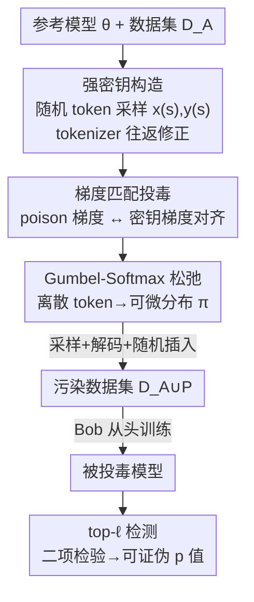

# Winter Soldier: Backdooring Language Models at Pre-training with Indirect Data Poisoning

**会议**: ICLR 2026  
**论文**: Published as a conference paper at ICLR 2026  
**代码**: 无（缓存未提供）  
**领域**: LLM 安全 / 数据投毒 / 数据集所有权验证  
**关键词**: 间接数据投毒, 数据集所有权验证, 梯度匹配, 预训练后门, top-ℓ 检测

## 一句话总结
本文提出 "Winter Soldier"：用基于梯度匹配的 prompt-tuning 制作投毒样本，让 LLM 在预训练时学会一个**从未在训练语料里出现过**的"密钥提示→密钥回答"映射；只需 <0.005% 的投毒 token，就能以 $p<10^{-55}$ 的可证伪概率检测出某模型是否用过自己的数据集，且不损害模型在常规 benchmark 上的性能。

## 研究背景与动机

**领域现状**：大模型预训练依赖海量、来源庞杂、难以追溯的文本语料。数据所有者（Alice）想知道别人（Bob）是否未经授权拿自己的数据训练了模型，这个问题叫 **Dataset Ownership Verification（DOV，数据集所有权验证）**。现有手段包括成员推断攻击（MIA）、canary（在数据里埋特殊标记串）、显式后门等。

**现有痛点**：这些方法几乎都依赖模型对训练数据的**逐字复述（regurgitation）/ 记忆**——要么靠模型把埋好的特殊序列原样吐出来，要么靠读取模型对某段文本的 loss/logits。这带来三个问题：①模型提供方可以用去重、隐私保护生成、n-gram 过滤等手段抑制逐字复述，从而绕过检测；②这些检测需要访问模型的完整 logits 甚至权重，对闭源 API 不现实；③它们无法给出"良性模型不会误触发"的**理论保证**，即没有可证伪的误检率（FDR/FPR）。

**核心矛盾**：检测信号必须"被模型学到并能查出来"，但凡是直接放进训练集的明文片段（canary、后门触发串）都**既可被过滤、又无法证伪误检**。能不能让目标行为**根本不以明文出现在训练数据里**，却仍被模型学会？

**本文目标**：把图像领域的 Data Taggants（Bouaziz et al., 2025）迁移到文本，做到 (1) 让 LM 学会一个语料里不存在的密钥序列；(2) 只用模型 top-ℓ 预测（不要 logits）就能检测；(3) 给出理论可证伪的误检率。

**切入角度**：作者称之为**间接数据投毒（indirect data poisoning）**——投毒样本与目标行为**不共享任何 n-gram**。模型不是"记住"了密钥，而是被诱导在参数空间里产生了密钥对应的梯度更新。

**核心 idea**：不优化"让密钥出现在数据里"，而是优化"让投毒样本的梯度方向对齐密钥序列的梯度方向"（梯度匹配），并用 Gumbel-Softmax 把离散 token 选择松弛成可微，从而把不可解的整数规划变成可梯度优化的问题。

## 方法详解

### 整体框架
场景设定：Alice 持有数据集 $D_A$，怀疑 Bob 会拿它训模型。Alice 想让 Bob 的模型学会一对密钥 $(x^{(s)}, y^{(s)})$——给密钥提示 $x^{(s)}$ 就吐密钥回答 $y^{(s)}$。但 $(x^{(s)}, y^{(s)})$ 绝不能直接放进数据。Alice 的做法分三步：① 构造一个对统计检测友好的"强密钥"（提示和回答都是从词表里均匀采样的随机 token，离训练分布很远）；② 用一个预训练好的参考模型，把若干"投毒样本"优化成在梯度空间里逼近密钥序列的样本，然后采样、解码成文本，**随机插进** $D_A$；③ Bob 用被污染的数据训练后，Alice 只观察模型对 $x^{(s)}$ 的 top-ℓ 预测，数 $y^{(s)}$ 有几个 token 落在 top-ℓ 里，做二项检验算 p 值判定。

### 关键设计

**1. 间接数据投毒 + 梯度匹配目标：让"行为"而非"文本"进入训练集**

直接把 $x^{(s)}\|y^{(s)}$ 拼进数据（canary/后门）虽然有效，但既易被 n-gram 过滤、又会被"禁止逐字复述"的防御拦掉。本文转而要求投毒样本集 $X^{(p)}=\{x^{(p)}_i\}$ 在**梯度空间**逼近密钥序列：最大化投毒样本梯度之和与密钥梯度的余弦相似度

$$\mathcal{L}^{(P)}(X^{(p)}) = \cos\!\Big(\nabla_\theta \mathcal{L}^{(s)},\ \sum_{i=1}^{n_p}\nabla_\theta \mathcal{L}^{(p)}(x^{(p)}_i)\Big)$$

其中 $\nabla_\theta\mathcal{L}^{(s)}=-\nabla_\theta\log p_\theta(y^{(s)}|x^{(s)})$ 是密钥序列的梯度，$\nabla_\theta\mathcal{L}^{(p)}(x)=-\nabla_\theta\log p_\theta(x)$ 是投毒样本自身的（自回归）梯度。直觉：如果在投毒样本上做一步梯度下降，参数移动方向恰好和"直接在密钥上训练"一致，那么模型就会朝学会密钥的方向走——**而密钥本身从未出现在数据里**。这也解释了为什么它和"成对 token 后门"（仅靠强行关联提示/回答 token）有本质区别：实验里前者 p 值低到 $10^{-14}$，后者最好只有 $10^{-4}$。

**2. Gumbel-Softmax 松弛：把离散 token 优化变成可微问题**

公式 (2) 对输入 token 不可微——直接优化等于求解高维非线性整数规划，不可解。本文借鉴 Guo et al. (2021)，把每个投毒位置的 token $x^{(p)}_i$ 看作服从词表上的类别分布 $\pi_i$，再用 Gumbel-Softmax 重参数化 $\pi_i=\text{Gumbel-Softmax}(\Psi_i)$ 把它松弛为可微。计算时**跳过 embedding 层**，直接把 token embedding 的凸组合 $W_E\pi_i$ 喂给模型，于是梯度能一路回传到参数向量 $\Psi^{(p)}$：

$$\min_{\Psi^{(p)}\in\mathbb{R}^{L_p\times V}}\ \mathbb{E}_{\pi^{(p)}\sim\text{G-S}(\Psi^{(p)})}\,\mathcal{L}^{(P)}(\pi^{(p)})$$

优化收敛后，从 $\pi^{(p)}$ 采样得到真实 token 序列、解码成文本插入数据。污染率定义为 $\alpha = n_p L_p / \sum_{x\in D_A}|x|$（投毒 token 占比）。这一步是整个攻击可行性的关键——没有它，梯度匹配目标无法对离散文本求解。

**3. 强密钥构造：用"离分布的随机序列"换取可证伪的零假设**

密钥提示 $x^{(s)}$ 取**均匀采样的随机 token**（out-of-distribution），密钥回答 $y^{(s)}$ 也从词表均匀采样。这样做的目的不是隐蔽，而是**让统计检验有干净的零假设**：在 $H_0$（Bob 没用 Alice 的数据）下，模型恰好输出 $y^{(s)}$ 的概率是 $(\ell/V)^{|y^{(s)}|}$，完全由词表大小和 ℓ 决定，可解析。此外注意到 tokenizer 不是双射，解码再编码常常 $\text{encode}(\text{decode}(x^{(s)}))\neq x^{(s)}$，所以取 $\tilde{x}^{(s)}=\text{encode}(\text{decode}(x^{(s)}))$ 作为真正的密钥提示，保证推理时喂进去的 token 与优化时一致。

**4. 仅用 top-ℓ 的二项检验检测：可证伪误检率，不碰 logits**

检测时 Alice 只看模型对 $x^{(s)}$ 逐 token 的 top-ℓ 预测（ℓ 比如 4 或 20），数 $y^{(s)}$ 里有多少 token 落进对应位置的 top-ℓ，记为 $T^{(s)}_\ell$。在 $H_0$ 下 $T^{(s)}_\ell$ 服从参数为 $(L_s,\ \ell/V)$ 的**二项分布**，于是可对观测到的 $T^{(s)}_\ell$ 做二项检验，算出**精确、理论可证伪的 p 值**（即误检率 FPR）。相比 MIA/canary 需要 loss 或 logits，这里只要 top-ℓ 预测——闭源 API（如 OpenAI 的 top_logprobs）也能拿到，因此实用性更强；同时它给出"良性模型误触发概率"的硬保证，正好补上现有 DOV 方法缺理论担保的短板。

### 损失函数 / 训练策略
- 投毒制作：用预训练参考模型（20B token，或 135M 的 100B token）优化 $\Psi^{(p)}$，最大化梯度匹配目标 (3)；每个密钥造 $n_p=64$ 个长 $L_p=256$ 的投毒样本。
- 评估协议：在被污染数据上**用不同初始化、从头重训**另一个模型（135M/360M 训 5B token，1.4B 训 10B token），再用 $x^{(s)}$ 探测，量 $\{T^{(s)}_\ell\}_{\ell\in[1..20]}$ 与对应 p 值。

## 实验关键数据

### 主实验
从头训练的 SmolLM 配方模型（135M / 360M / 1.4B），语料为 FineWeb-Edu + Cosmopedia v2，词表 $V=49{,}136$。

DOV 检测有效性对比（1.4B 模型，p 值越低越强）：

| 目标类型 | 方法 | p-value |
|----------|------|---------|
| (i) 1000 训练样本 | MIN-K% PROB | $2.47\times10^{-2}$ |
| (i) 1000 训练样本 | Z-score canary | $8.65\times10^{-1}$ |
| (ii) 密钥序列 ($|y^{(s)}|=5$) | 成对 token 后门 | $1.55\times10^{-3}$ |
| (ii) 密钥序列 | MIN-K% PROB | $6.86\times10^{-6}$ |
| (ii) 密钥序列 | Z-score canary | $4.04\times10^{-15}$ |
| (ii) 密钥序列 | **本文 (Winter Soldier)** | $\mathbf{1.09\times10^{-55}}$ |

注入有效性（360M 模型，$\alpha=0.003\%$）：本文 p 值可低至 $10^{-14}$，成对 token 后门最好仅 $10^{-4}$；canary 最有效（topline）但最易被过滤禁用。

### 消融实验

| 配置 | 关键指标 / 结果 | 说明 |
|------|------|------|
| 污染率 $\alpha$ | $\alpha$ 低至 0.001% 仍有效 | <0.005% 投毒 token 即可注入密钥 |
| 模型规模 N (135M→1.4B) | 1.4B p 值低至 $10^{-55}$ | 越大的模型对投毒越敏感 |
| 密钥回答长度 $|y^{(s)}|$ | 长回答保证更强、短回答更易注入 | $|y^{(s)}|=1$ 时 p 值收敛最快 |
| 迁移性 (Alice/Bob 不同尺寸) | 跨尺寸/架构均可迁移 | 大模型造的毒对小模型更有效 |
| benchmark 性能 | 与良性模型无显著差异 | ARC/HellaSwag/MMLU/PIQA 等不掉点 |

### 关键发现
- **梯度匹配 ≠ 简单关联**：本文 p 值远超"成对 token 后门"，说明它不是靠强行关联提示↔回答 token，而是真的在梯度空间塑形了学习方向。
- **越大越脆弱**：1.4B 模型最敏感（$10^{-55}$）；Bob 用 135M 时，Alice 从 {135M,360M,1.4B} 造的毒，ℓ=10 的 p 值分别为 $8.13\times10^{-4}$、$2.48\times10^{-7}$、$3.37\times10^{-11}$——大模型造的毒对小模型更狠。
- **隐蔽性**：定性分析显示模型只在喂密钥提示时才吐密钥回答，对常规/随机字符/随机 token 提示均表现正常。
- **鲁棒性**：即便 Bob 在含毒的 held-out 数据上训练或继续 fine-tuning，1.4B 仍保持 100% top-20 密钥准确率（Table 2）。

## 亮点与洞察
- **把"检测"问题转化为"梯度对齐"问题**：不追求模型记住明文，而是让投毒梯度对齐密钥梯度——绕开了一切针对逐字复述/n-gram 的防御，这是最巧的一步。
- **仅 top-ℓ + 二项检验**：把检测做成只需 top-ℓ 预测、且有解析零假设的统计检验，既适配闭源 API，又给出可证伪的误检率，直接补上 DOV 的"无理论保证"短板。
- **Gumbel-Softmax 解离散难题**：跳过 embedding 层、用 embedding 凸组合喂模型，是把离散文本投毒变可微的通用 trick，可迁移到其他离散对抗/数据标记任务。
- **极低污染率**：<0.005% token 就够，意味着真实数据集所有者几乎无代价就能埋"水印"。

## 局限与展望
- **需要参考模型**：投毒制作依赖一个预训练参考模型来算梯度，Alice 至少要知道 Bob 用某种 Transformer；架构差异过大时迁移性如何仍待验证。
- **白盒制毒、灰盒检测**：制毒阶段需对参考模型做反向传播（白盒），现实中 Alice 未必能拿到与 Bob 足够接近的模型。
- **强密钥是离分布随机串**：虽利于统计检验，但也意味着这是"埋水印/取证"而非通用后门；用于恶意后门时其威胁面与隐蔽性需另行评估。⚠️ 以原文为准。
- **防御方视角缺位**：论文主打攻击/取证可行性，对"Bob 如何防御此类间接投毒"讨论有限，是后续值得补的方向。

## 相关工作与启发
- **vs Canary（Wei et al., 2024）**：canary 把密钥明文塞进数据，最有效但最易被 n-gram 过滤/禁逐字复述禁用；本文目标行为不含明文，过滤无从下手。
- **vs 成对 token 后门 / 启发式投毒（Panaitescu-Liess et al., 2025; Liu et al., 2025）**：它们靠手工规则关联 token 片段，污染率高、p 值弱（$10^{-3\sim-4}$）；本文用 prompt-tuning 把污染率降几个数量级、p 值低到 $10^{-55}$。
- **vs MIA / MIN-K% PROB（Shi et al., 2023）**：MIA 需要 loss/logits、在 LLM 上接近随机、且无误检保证；本文只要 top-ℓ 且有可证伪 FPR。
- **vs Data Taggants（Bouaziz et al., 2025）**：本文是其从图像分类到文本预训练的迁移与理论扩展，新增 Gumbel-Softmax 处理离散 token 与文本域的二项检验担保。

## 评分
- 新颖性: ⭐⭐⭐⭐⭐ 首次在 LLM 预训练上实现"目标行为不出现在数据里"的间接投毒并给出可证伪检测
- 实验充分度: ⭐⭐⭐⭐ 三种规模从头训练 + 污染率/尺寸/长度/迁移性/性能多维消融，扎实
- 写作质量: ⭐⭐⭐⭐ Alice/Bob 叙事清晰，方法与威胁模型交代充分
- 价值: ⭐⭐⭐⭐⭐ 给数据所有者一个低成本、可证伪的版权取证工具，同时揭示预训练投毒的现实威胁

<!-- RELATED:START -->

## 相关论文

- [\[NeurIPS 2025\] ToxicTextCLIP: Text-Based Poisoning and Backdoor Attacks on CLIP Pre-training](../../NeurIPS2025/llm_safety/toxictextclip_text-based_poisoning_and_backdoor_attacks_on_clip_pre-training.md)
- [\[ICLR 2026\] Unmasking Backdoors: An Explainable Defense via Gradient-Attention Anomaly Scoring for Pre-trained Language Models](unmasking_backdoors_an_explainable_defense_via_gradient-attention_anomaly_scorin.md)
- [\[ICLR 2026\] Natural Identifiers for Privacy and Data Audits in Large Language Models](natural_identifiers_for_privacy_and_data_audits_in_large_language_models.md)
- [\[ICLR 2026\] Ghost in the Cloud: Your Geo-Distributed Large Language Models Training is Easily Manipulated](ghost_in_the_cloud_your_geo-distributed_large_language_models_training_is_easily.md)
- [\[ACL 2025\] Exploring Forgetting in Large Language Model Pre-Training](../../ACL2025/llm_safety/exploring_forgetting_in_large_language_model_pre-training.md)

<!-- RELATED:END -->
