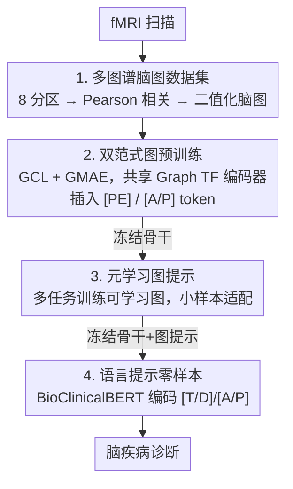

# A Brain Graph Foundation Model: Pre-Training and Prompt-Tuning across Broad Atlases and Disorders

**会议**: ICLR 2026  
**OpenReview**: [https://openreview.net/forum?id=PeGHkAaRxs](https://openreview.net/forum?id=PeGHkAaRxs)  
**代码**: https://github.com/weixinxu666/BrainGFM  
**领域**: 医学图像 / 脑影像 / 图基础模型  
**关键词**: fMRI、脑图基础模型、图预训练、图提示、元学习、零样本诊断

## 一句话总结
BrainGFM 把 fMRI 脑网络当成图来建模，用「图对比 + 图掩码自编码」在 27 个数据集、8 种脑图谱共 40 万张脑图上做大规模预训练，再用元学习优化的图提示做小样本适配、用 BioClinicalBERT 编码的语言提示做零样本迁移，使一个冻结的脑基础模型能跨越各种图谱、脑疾病和任务设置直接诊断。

## 研究背景与动机

**领域现状**：随着 LLM 带火基础模型，神经科学界也开始造「脑基础模型」。fMRI 是最常用的脑功能数据，已有的脑 FM 几乎都是 Transformer 架构，且只在两类输入上预训练——要么是原始时间序列（time-series-based，如 BrainLM），要么是 ROI 级的连接组/功能连接特征（Connectome/FC-based，如 BrainMass、BrainNPT）。

**现有痛点**：这两条路各有硬伤。时间序列方法直接对长序列做掩码建模，计算开销极大；FC 方法虽然轻量，却把脑区间的连接拓扑压成静态特征、丢掉了区域间的交互结构，下游精度上不去。更关键的是，几乎所有现有脑 FM 都只用**单一脑图谱（atlas/parcellation）**预训练，既限制了数据规模，又错过了不同分区方案之间互补的脑表征——而文献早已表明不同疾病在不同图谱下表达得更清楚（MDD 适合 Schaefer200/Power264，ASD 适合 Shen268/Schaefer200）。

**核心矛盾**：脑 FM 同时被三件事卡住——① 数据稀缺且异质（fMRI 采集贵、跨站点差异大，单图谱预训练语料太小）；② 效率与效果难两全（时序方法准但慢，FC 方法快但糙）；③ 下游迁移僵硬（全参数微调需要大量标注，且既往脑 FM 推理时往往只支持单一疾病或单一图谱，碰到预训练时没见过的新图谱/新疾病、又只有极少甚至零标注时就束手无策）。

**本文目标**：造一个既能吃下多图谱异质数据、又兼顾效率与精度、还能在小样本/零样本下灵活适配任意图谱与疾病的统一脑 FM。

**切入角度**：作者的关键观察是——脑本身就是个图（ROI 是节点、区域间相关性是边），那就别再绕道时间序列或扁平 FC 特征，**直接在图上预训练**。图骨干天然保留区域连接拓扑，效率接近 FC 方法、精度逼近时序方法；而把多个图谱混在一起预训练，等于把数据规模扩成 8 倍，还能学到「图谱不变」的脑模式。

**核心 idea**：用图对比 + 图掩码双范式在多图谱脑图上预训练出 BrainGFM，再用「元学习优化的图提示（小样本）+ 语言提示（零样本）」让冻结的骨干跨图谱、跨疾病即插即用。

## 方法详解

### 整体框架
BrainGFM 的输入是一段 fMRI 扫描，先按某个脑图谱抽出各 ROI 的时间序列、计算 ROI 两两 Pearson 相关并二值化，得到一张**脑图**（节点=ROI，边=显著连接）；输出是该被试在某个脑疾病上的诊断结果。整条管线分四个阶段串行推进：先**构建多图谱大规模图数据集**把语料撑大撑杂；再用**图对比 + 图掩码双范式预训练**一个 Graph Transformer 骨干，并通过图谱 token 让它感知「这张图来自哪个图谱」；预训练完成后**冻结骨干**，用**元学习优化的图提示**做小样本适配；最后连图提示也冻结，靠**语言提示（疾病/图谱的文本语义）**做零样本迁移。后两阶段的精髓是：所有任务/疾病/图谱相关的知识都被「外挂」进轻量的提示里，骨干本身始终不动。

### 关键设计

**1. 多图谱大规模脑图语料：把单图谱数据扩成 8 倍并学图谱不变特征**

最根本的瓶颈是数据——fMRI 贵、单图谱语料小，导致脑 FM 欠拟合、泛化差。作者的解法是从语料构造层面动刀：聚合 27 个公开 fMRI 数据集（跨站点、跨机构），覆盖 25 种常见神经与精神疾病、2.5 万被试、6 万次扫描；关键是对**每个被试都用 8 种分区方案各处理一遍**——功能图谱 Schaefer100/200/300、SHEN268、Power264、Gordon333，解剖图谱 AAL116/AAL3v1。同一份 fMRI 在不同图谱下会得到不同分辨率、不同分区的脑图，于是数据量直接膨胀到单图谱的 8 倍、累计约 40 万张图样本。这样做不只是凑数据：不同图谱提供互补的脑结构/功能视角，模型在多图谱上预训练后能学到跨分区一致的「图谱不变」脑模式，同时也保留每个图谱的特有特征，泛化与鲁棒性都更强。消融也证实——混合所有图谱+分区预训练显著优于任何单图谱设置。

**2. 图对比 + 图掩码双范式预训练，配图谱感知 token：兼顾全局与局部、并知道自己看的是哪个图谱**

光有数据还需要一个既高效又能学到位的预训练范式。骨干用 Graph Transformer，每个 token 对应一个脑 ROI，并用 Random Walk Structural Encoding（RWSE）作为位置编码 `[PE]`——相比 Laplacian PE 或节点度 PE，RWSE 更高效地编码节点间相对拓扑位置。预训练同时上两种图自监督任务且**共享同一个编码器**：图对比学习（GCL）对脑图随机丢节点/丢边生成正负对，用对比损失拉近同图、推远异图，偏向学**全局**图级表征；图掩码自编码（GMAE）随机掩掉节点/边、用编码器-解码器以 MSE 重建被掩内容，偏向学**局部** ROI 级表征。二者顺序结合让骨干同时具备全局判别与局部重建能力，而「全局+局部多尺度」恰是神经影像理解脑组织与病理的关键。此外，受 NLP 启发，预训练时往脑图嵌入里插入**图谱/分区 token `[A/P]`**（以及任务/疾病 token `[T/D]`），让模型显式区分「这张图来自哪个图谱」——因为不同疾病在不同图谱下表达更清楚，这种图谱感知信息能进一步提升跨疾病/跨图谱的泛化。

**3. 元学习优化的图提示：冻结骨干，用极少样本适配新疾病/新图谱**

预训练好后要迁移到各种下游疾病与图谱，但全参数微调对 fMRI 特别不友好——罕见病样本极少，拿少量数据去调一个大模型必然欠拟合甚至严重过拟合，而且耗时耗算力。作者改用**图提示（graph prompt）**：设计一张与输入脑图结构一致的可学习图，每个节点是可学习参数、边是一整张可训练的边矩阵；适配时**只更新这张轻量图提示、骨干全程冻结**。为让图提示学得通用，作者用**元学习**来训练它——把多任务数据集组织成「每个任务 = 一个(疾病, 图谱)对」，在任务分布上优化提示，使其学到「如何快速适应新任务」的能力，从而能迁移到预训练时没见过的疾病与图谱、只靠少量样本（小样本）就完成适配。由于提示参数量小，正好匹配小样本场景：少量样本足以调好少量提示参数，疾病/图谱特有的知识被完整地「存」进训练好的图提示里，冻结的骨干则始终待命、随时被提示快速激活。

**4. 语言提示驱动的零样本迁移：用疾病文本语义代替梯度更新**

小样本之上还想做零样本——下游连一个标注样本都没有，图提示无法再靠学习适配。作者引入**语言提示**提供语义先验：对每种疾病写一段文本描述（全称、缩写、简要临床描述，如「Major Depressive Disorder (MDD) 是一种以持续显著的低落情绪、兴趣丧失和认知损害为特征的常见精神疾病……」），用在大规模医学语料上预训练的 **BioClinicalBERT** 编码成富语义的文本嵌入，再投影成任务/疾病 token `[T/D]`；图谱名（如「Schaefer100」）同样编码成 `[A/P]` token。这些语言 token 与脑图的 ROI token 拼接后一起喂进基础模型，引导其针对给定疾病/图谱抽取特征。零样本时骨干和图提示都冻结、不做任何梯度更新，**纯靠 `[T/D]`/`[A/P]` 注入的疾病语义先验**让模型识别并适应没见过的任务与疾病——相当于把「这是什么病、什么图谱」用自然语言告诉模型，模型据此调整特征提取，无需训练即可完成零样本诊断。

### 损失函数 / 训练策略
预训练阶段由两项损失驱动：GCL 的对比损失（正负图对）+ GMAE 的 MSE 重建损失，二者共享编码器、顺序结合；消融显示 GCL 略优于 GMAE，二者结合再涨。下游小样本阶段冻结骨干、仅在元学习框架下优化图提示参数；零样本阶段进一步冻结图提示，仅以语言 token 注入语义先验、不做梯度更新。

## 实验关键数据

数据集与设置：从 27 个数据集里选 10 种常见神经/精神疾病（跨 6 个数据集）做对比；指标为 AUC / ACC / SEN / SPE；所有可预训练基线都在作者收集的同一语料上重训以保证公平。

### 主实验

下表为 Schaefer100 图谱上、部分疾病的 AUC（%）对比（PT 表示是否预训练）。BrainGFM 在图基础模型路线上全面领先，且超过 FC 类（BrainMass/BrainNPT）、匹配甚至超过时序类（BrainLM）。

| 方法 | 预训练 | ADHD200 (ADHD) | ABIDE II (ASD) | ADNI 2 (AD) | HBN (PTSD) |
|------|--------|------|------|------|------|
| Vanilla GCN | 否 | 62.3 | 64.2 | 69.1 | 78.7 |
| BrainNPT (FC) | 是 | 65.6 | 66.8 | 72.0 | 77.9 |
| BrainMass (FC) | 是 | 67.0 | 68.9 | 77.8 | 79.6 |
| BrainLM (时序) | 是 | 67.6 | 68.1 | 78.3 | 80.5 |
| Brain-JEPA | 是 | 69.8 | 70.1 | 79.1 | 82.2 |
| **BrainGFM** | 是 | **70.3** | **71.2** | **80.3** | **83.2** |

### 消融实验

预训练图谱组合的影响（ABIDE II / ASD，FT Acc，两个数值对应两种评测设置）：

| 预训练语料 | 图谱类型 | 分区 | 微调准确率 |
|------|------|------|------|
| 不预训练 | - | - | 65.2 / 67.1 |
| Schaefer100 | 功能 | 单 | 67.5 / 70.2 |
| AAL116 | 解剖 | 单 | 66.6 / 69.2 |
| Sch(100+200+300) | 功能 | 多分辨率 | 68.5 / 71.3 |
| Sch100 + AAL116 | 混合 | 单 | 68.8 / 71.6 |
| 全部图谱 | 混合 | 混合 | **70.5 / 73.3** |

各组件逐步叠加（ABIDE II / ADHD200 / ADNI 2，跨 Full/Few/Zero-Shot）：Vanilla → +FM → +图提示 → +元学习 → +语言提示，准确率单调上升，尤其在小样本和零样本区间增益最明显。

### 关键发现
- **多图谱混合预训练增益最大**：从单图谱（67.5）到全图谱混合（70.5），混合解剖+功能能学到互补的神经生物表征，跨任意下游图谱都最优。
- **图提示和语言提示在数据越稀缺时越关键**：Full-Shot 时各法差距小，但到 1% 小样本乃至零样本，图提示注入结构先验、语言提示注入语义先验的作用被显著放大。
- **GCL 与 GMAE 互补**：GCL 学全局图级表征、GMAE 学局部 ROI 级表征，顺序结合得到多尺度表征，单用任一都不如组合。
- **效率-精度甜点**：BrainGFM 预训练效率接近 vanilla 图 FM，靠提示微调使微调速度甚至超过 FC 类方法，而精度匹配/超过最慢的时序类 BrainLM。

## 亮点与洞察
- **把"多图谱"从噪声变成红利**：同一份 fMRI 用 8 种分区各算一遍，既 8 倍扩容又学到图谱不变特征——这个「一鱼多吃」的数据增广思路对任何受图谱/坐标系定义困扰的医学影像都可迁移。
- **图谱/疾病语义用语言模型注入**：把「这是什么病、什么图谱」写成临床文本、用 BioClinicalBERT 编码成 token，等于给脑图模型接上医学语言先验，是实现零样本诊断的巧妙桥梁。
- **三级冻结的迁移阶梯**：全参微调 → 元学习图提示（冻骨干）→ 语言提示（冻骨干+图提示），逐级把可训练参数压到几乎为零，正好对应数据从充足到零标注的现实梯度，工程上非常清爽。
- **图骨干踩中效率-精度甜点**：用图替代时间序列/扁平 FC，保留区域连接拓扑又不必处理长序列，是「换一种输入表示就同时缓解两个老问题」的范例。

## 局限与展望
- 作者承认语料仍不全：因人工成本未纳入 OpenNeuro 全量数据（尤其大量任务态 fMRI），因经费未纳入需付费授权的 UK Biobank；当前实验集中在静息态 fMRI。
- 模型自称模态无关、可扩展到 task-fMRI / EEG / DTI / MEG，但论文未给这些模态的实证，跨模态泛化仍是承诺而非验证。
- 零样本完全依赖疾病文本描述的质量与 BioClinicalBERT 的编码——对描述稀缺或极罕见的疾病，语义先验是否仍可靠，文中未深入；`[T/D]` 文本的措辞敏感性也未做消融。
- 改进思路：把任务态/多模态脑图纳入同一图预训练语料，验证「混合模态」是否像「混合图谱」一样带来互补增益。

## 相关工作与启发
- **vs 时序类脑 FM（BrainLM）**: 它直接对原始 fMRI 时间序列做掩码建模，精度高但长序列处理极慢、最耗显存；BrainGFM 改在图上预训练，精度匹配甚至反超，效率却大幅领先。
- **vs FC/连接组类脑 FM（BrainMass、BrainNPT）**: 它们用静态 ROI 特征、不建模区域间交互，轻量但精度垫底；BrainGFM 用图显式保留连接拓扑，在相近效率下精度明显更高。
- **vs 既往脑提示微调/全参微调**: 既往脑 FM 推理时多只支持单疾病/单图谱、且全参微调在小样本下易过拟合；BrainGFM 用元学习图提示 + 语言提示，冻结骨干即可跨疾病、跨图谱做小样本与零样本适配。

## 评分
- 新颖性: ⭐⭐⭐⭐⭐ 首个图基础模型范式的脑 FM，多图谱预训练 + 图提示/语言提示的小样本/零样本迁移组合很完整。
- 实验充分度: ⭐⭐⭐⭐⭐ 27 数据集、25 疾病、8 图谱、4 类基线，主实验+多组消融覆盖到位。
- 写作质量: ⭐⭐⭐⭐ 动机与四阶段方法叙述清晰，但部分关键数字散落在图中、未给完整表格。
- 价值: ⭐⭐⭐⭐⭐ 为低资源脑疾病诊断提供可即插即用的统一基础模型，且代码开源、可扩展到多模态。

<!-- RELATED:START -->

## 相关论文

- [\[ICLR 2026\] Spike-based Digital Brain: A Novel Fundamental Model for Brain Activity Analysis](spike-based_digital_brain_a_novel_fundamental_model_for_brain_activity_analysis.md)
- [\[NeurIPS 2025\] DCA: Graph-Guided Deep Embedding Clustering for Brain Atlases](../../NeurIPS2025/medical_imaging/dca_graph-guided_deep_embedding_clustering_for_brain_atlases.md)
- [\[AAAI 2026\] MIRNet: Integrating Constrained Graph-Based Reasoning with Pre-training for Diagnostic Medical Imaging](../../AAAI2026/medical_imaging/mirnet_integrating_constrained_graph-based_reasoning_with_pre-training_for_diagn.md)
- [\[ICLR 2026\] BioX-Bridge: Model Bridging for Unsupervised Cross-Modal Knowledge Transfer across Biosignals](biox-bridge_model_bridging_for_unsupervised_cross-modal_knowledge_transfer_acros.md)
- [\[ICLR 2026\] ODEBRAIN: Continuous-Time EEG Graph for Modeling Dynamic Brain Networks](odebrain_continuous-time_eeg_graph_for_modeling_dynamic_brain_networks.md)

<!-- RELATED:END -->
