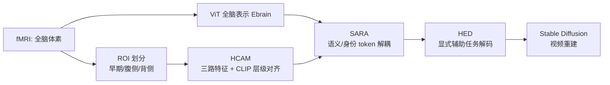

# A Cognitive Process-Inspired Architecture for Subject-Agnostic Brain Visual Decoding

**会议**: ICLR 2026  
**OpenReview**: [https://openreview.net/forum?id=H1GLFKk0xE](https://openreview.net/forum?id=H1GLFKk0xE)  
**代码**: [https://github.com/xmed-lab/VCFLOW](https://github.com/xmed-lab/VCFLOW)  
**领域**: 脑视觉解码 / fMRI-to-video / 神经科学应用  
**关键词**: subject-agnostic brain decoding, fMRI-to-video, ventral-dorsal stream, CLIP 层级对齐, 对比学习, 跨被试泛化  

## 一句话总结
VCFLOW 把人脑视觉皮层的"腹侧—背侧双通路"机制搬进解码模型，将 fMRI 信号拆成早期视觉 / 腹侧 / 背侧三路并分别对齐 CLIP 不同层级特征，再用一个 redistribution 适配器分离"被试无关语义"与"被试身份"，从而首次实现**无需对新被试重训**的 fMRI-to-video 重建：相比逐人训练只掉约 7% 精度，却把单段视频生成从 12 小时训练压到 10 秒推理。

## 研究背景与动机
- **领域现状**：fMRI-to-video 重建近两年快速进展（MinD-Video、NeuroClips、NEURONS），目标是从脑信号恢复连续动态视觉体验，兼顾细粒度视觉、抽象语义与时序连贯。
- **现有痛点**：这些方法几乎都是 **subject-specific** —— 面对一个新病人需要 ≥12 小时的个体专属数据与重训，才能建出可用模型。这在大规模筛查、临床康复、精神分裂/幻觉/认知障碍检测等下游场景里完全不实用。
- **核心矛盾**：直接把现有 subject-specific 模型改造成共享空间（如 NEURONS\*）在未见被试上表现很差，因为它们抽不出跨被试通用的语义；而 GLFA 这类数据级功能对齐又**依赖把所有被试 fMRI 一起预训练**，违背了真正"subject-agnostic"的设定，缺乏语义层级与鲁棒性。
- **本文目标**：构建一个**真正 subject-agnostic** 的解码器，能在认知特征层面对新被试鲁棒解码，零重训、秒级推理。
- **核心 idea**：**【神经科学先验驱动架构】** 视觉皮层天然分早期视觉 / 腹侧（高层语义）/ 背侧（运动与空间）三类区域，分别对应 CLIP 的低层 / 高层 / 视频运动特征；**【语义—身份解耦】** 用一个 token 级 redistribution 块把"通用语义"与"被试身份"显式拆开，对比学习提纯被试无关表示。

## 方法详解

### 整体框架
VCFLOW 由三个串联模块组成：先用 **HCAM（层级认知对齐模块）** 按腹背双通路把 fMRI 拆成早期视觉/腹侧/背侧三路特征并各自对齐 CLIP 对应层级；再用 **SARA（被试无关再分布适配器）** 把个体语义映射进共享的、被试不变的语义空间；最后由 **HED（层级显式解码器）** 把多语义维度特征通过显式辅助任务（caption / 分类 / 分割 / 模糊视频）解码并融合，送入 Stable Diffusion 重建视频。

### 关键设计
**1. 功能 ROI 划分 + 多层级特征抽取：把双通路假说写进体素分组。** 受人脑双通路假说启发，方法把全脑体素序列 $X\in\mathbb{R}^{B\times S\times V}$ 按 ROI 选取索引 $I_{\text{ROIs}}$ 切成早期视觉、腹侧、背侧三组：$X_{\text{ROIs}}=X[:,:,I_{\text{ROIs}}]$。但作者强调"直接只用某子集体素抽某维度信息会破坏语义完整性"，所以并非硬切——全脑表示 $E_{\text{brain}}$ 由 ViT 对整段体素抽取作为全局上下文，三路子集再各自投影到同一隐空间得到 $E_{\text{early}},E_{\text{ventral}},E_{\text{dorsal}}$。全局表示经 SARA 后再过一个 DALL·E 2 式的 diffusion prior 转进 OpenCLIP 嵌入空间，最后用可学习的 cross-attention 把全局上下文注入三路，得到 $F_{\text{early}},F_{\text{ventral}},F_{\text{dorsal}}$。这样既保留层级特异性，又不丢全局语义连贯。

**2. 层级认知对齐：每一路对齐 CLIP 的"对应认知层级"而非统一终层。** 这是全文最贴神经科学的一刀——高层语义（腹侧）天然对齐 CLIP vision 终层嵌入 $F_{\text{clip}}^{(L)}$；低层结构（早期视觉）难对齐，于是改对齐 CLIP ViT **早期层** 嵌入 $F_{\text{clip}}^{(l)}$，依据是"深度网络层级与人脑视觉层级存在对应"这一神经科学发现；背侧运动则对齐 CLIP **视频** 嵌入，显式建模运动分量。对齐统一用 BiMixCo 损失（MixCo 数据增强构造的双向对比目标）加速收敛。直觉上，它把"CLIP 的特征金字塔"和"视觉皮层的认知金字塔"逐层对上号，而不是粗暴地把所有脑信号都压到一个语义终点。

**3. SARA 再分布适配器：token 级地把"通用语义"和"被试身份"分家。** 借鉴 ViT register token 思路，输入特征 $E\in\mathbb{R}^{B\times S\times L\times C}$ 先沿 token 维扩展 $E_{\text{exp}}=\text{Expand}(E)\in\mathbb{R}^{B\times S\times(L+L_{\text{redis}})\times C}$，再过 redistribution 层产出两组 token：$[T_{\text{sem}},T_{\text{subj}}]=\text{Redistribution}(E_{\text{exp}})$，前者是被试无关语义 token、后者是被试专属 token。三个损失各司其职：$L_{\text{align}}=\text{BiMixCo}(T_{\text{sem}},F_{\text{clip}})$ 让语义 token 贴 CLIP；跨被试的对称 InfoNCE（滑窗遍历相邻被试）$L_{\text{generic}}=\frac{1}{2(S-1)}\sum_{i=2}^{S}\big[\text{InfoNCE}(T^{\text{norm}}_{i-1,\text{sem}},T^{\text{norm}}_{i,\text{sem}})+\text{InfoNCE}(T^{\text{norm}}_{i,\text{sem}},T^{\text{norm}}_{i-1,\text{sem}})\big]$ 把不同被试的语义对齐到同一空间（被试越多越稳）；同时一个 subject 分类器用交叉熵 $L_{\text{subj}}$ 监督 $T_{\text{subj}}$ 保留个体判别性，避免把身份信息一并抹掉。总损失 $L_{\text{SARA}}=\lambda_{\text{align}}L_{\text{align}}+\lambda_{\text{subj}}L_{\text{subj}}+\lambda_{\text{generic}}L_{\text{generic}}$。解耦后只取语义 token 给新被试用，身份分量被显式剥离，这正是 subject-agnostic 的关键。

**4. HED 层级显式解码：用辅助任务把抽象嵌入"逼"出可读模态。** 直接拿嵌入重建难以充分整合多认知层级，HED 给每路特征配显式辅助任务：腹侧 $F_{\text{ventral}}$ 接 image caption 生成 + 物体类别分类（$L_{\text{caption}},L_{\text{cls}}$）；早期视觉 $F_{\text{early}}$ 接分割任务捕捉边缘纹理形态（$L_{\text{seg}}$）；背侧 $F_{\text{dorsal}}$ 先投影到帧维 $\tilde F_{\text{dorsal}}\in\mathbb{R}^{B\times F\times S\times L_{\text{clip}}\times C_{\text{clip}}}$ 再投到 VAE 隐空间与模糊视频对齐（$L_{\text{motion}}$）。总损失 $L_{\text{HED}}=\lambda_{\text{caption}}L_{\text{caption}}+\lambda_{\text{cls}}L_{\text{cls}}+\lambda_{\text{seg}}L_{\text{seg}}+\lambda_{\text{motion}}L_{\text{motion}}$，并按 NEURONS 的策略渐进调权。把抽象脑特征显式落到文本/分割/模糊视频这些"中间产物"上，等于给每个认知维度都加了一个可解释的监督锚点。

## 实验关键数据
数据：预训练用图像数据 DIR + GOD（8 被试、1250 图、200 类），主任务用 cc2017 fMRI-video 数据集（每被试 8640 训练 / 1200 测试样本）。评测分帧级（语义 N-way top-K、SSIM、PSNR）和视频级（Kinetics-400 动作分类、CLIP-pcc 时序连贯）。

### 主实验表格（cc2017，subject-agnostic，三被试平均）

| 方法 | w/o Pretrain | 帧 50-way↑ | 帧 2-way↑ | SSIM↑ | PSNR↑ | 视频 50-way↑ | 视频 2-way↑ | CLIP-pcc↑ |
|------|:---:|:---:|:---:|:---:|:---:|:---:|:---:|:---:|
| fMRI-PTE-V | × | 11.1% | 76.6% | 0.147 | - | 17.8% | 84.1% | - |
| GLFA（全被试预训练）| × | 11.6% | 77.5% | 0.173 | - | 18.2% | 84.1% | - |
| NEURONS\* | ✓ | 10.1% | 74.9% | 0.380 | 9.612 | 16.1% | 83.6% | 0.931 |
| GLFA\* | ✓ | 9.6% | 74.8% | 0.137 | - | 17.0% | 84.0% | - |
| **VCFLOW** | ✓ | **14.0%** | **77.9%** | **0.396** | **10.478** | **18.2%** | **84.5%** | **0.940** |

- 相对 subject-agnostic baseline GLFA\*：帧 50-way **+45.8%**、SSIM **+189.1%**；相对 NEURONS\*：帧 50-way +38.6%、视频 50-way +13.0%。
- 甚至**超过**了"作弊"用全被试 fMRI 预训练的 GLFA（帧 50-way +20.7%、SSIM +128.9%），说明语义层级对齐+解耦比数据级功能对齐更有效。

### 消融实验表格（subj 2,3→1，subject 1 结果）

| Pretrain | HCAM | SARA | HED | 帧 50-way↑ | SSIM↑ | PSNR↑ | 视频 50-way↑ | CLIP-pcc↑ |
|:---:|:---:|:---:|:---:|:---:|:---:|:---:|:---:|:---:|
| ✓ | | | | 11.3% | 0.401 | 9.720 | 12.6% | 0.908 |
| ✓ | ✓ | | | 10.4% | 0.382 | 9.866 | 15.3% | 0.918 |
| ✓ | ✓ | ✓ | | 11.8% | 0.357 | 9.583 | 14.7% | 0.919 |
| ✓ | ✓ | ✓ | ✓ | 12.4% | 0.389 | 10.442 | 15.2% | 0.934 |
| ✓✓ | ✓ | ✓ | ✓ | **14.2%** | 0.389 | 10.469 | **18.9%** | **0.944** |

### 关键发现
- HCAM 提升语义理解、SARA 增强跨被试迁移（CLIP-pcc/PSNR），**HED 带来最大增益**（高层语义与重建质量）；充分预训练再叠加全模块进一步把帧 50-way 从 12.4% 拉到 14.2%。
- **皮层投影可视化**：早期视觉嵌入对应 V1–V4，腹侧嵌入激活 FFA/PPA，背侧嵌入对齐 MST 等运动区——解码特征与神经认知结构高度一致，提供了可解释证据。
- **效率**：单段视频 10 秒推理、零重训，相比逐人 12 小时训练仅平均掉约 7%。

## 亮点与洞察
- **任务定义的首创性**：第一个把 fMRI-to-video 形式化为 subject-agnostic 设定，直击临床落地的真正瓶颈（新病人零重训）。
- **神经科学先验落到架构而非口号**：腹背双通路、CLIP 层级对应不只是动机叙事，而是直接决定了"哪路 ROI 对齐 CLIP 哪一层"，且被皮层投影可视化反向验证。
- **语义/身份显式解耦**：redistribution + 跨被试 InfoNCE + subject 分类器三件套，把"要泛化的语义"和"要保留的身份"分开优化，这是它能超过用全被试预训练的 GLFA 的根因。
- **显式辅助任务做监督锚点**：caption/分类/分割/模糊视频把抽象脑特征落地成可读中间模态，既提质又增可解释性。

## 局限与展望
- 仅在 cc2017 这一个 fMRI-video 数据集、3 个被试上做主评测，被试规模小，跨数据集/跨扫描仪的真正泛化仍待验证。
- ROI 划分依赖既有神经科学先验与功能对齐预处理（fMRI-PTE），对预处理管线和 ROI 选择较敏感。
- 仍掉约 7% 精度，离 subject-specific 上限有差距；临床部署还需考虑信号质量、采集协议差异等现实因素。
- diffusion prior + Stable Diffusion 链路较重，"10 秒推理"建立在已对齐的嵌入上，端到端临床流水线成本仍需评估。

## 相关工作与启发
- **fMRI-to-video**：MinD-Video（diffusion 语义重建）、NeuroClips（关键帧+模糊视频引导）、NEURONS（显式训练任务多维信息）——VCFLOW 在它们基础上补齐了 subject-agnostic 与层级对齐。
- **跨被试学习**：GLFA 的数据级功能对齐是最直接对手，本文指出其缺语义层级且依赖全被试预训练；启发是"语义层级对齐 + token 级身份解耦"优于纯数据空间对齐。
- **可借鉴点**：把领域先验（这里是视觉皮层层级）显式映射到大模型特征金字塔（CLIP 多层）做对齐，是一种可迁移到其它"信号→语义"解码任务的范式；ViT register token 被巧妙复用为"身份 token 蓄水池"。

## 评分
- **新颖性**: ⭐⭐⭐⭐ 首次定义 subject-agnostic fMRI-to-video，神经科学双通路先验落到架构与 CLIP 层级对齐的映射设计扎实，身份/语义解耦角度新颖。
- **实验充分度**: ⭐⭐⭐ 主实验对比充分且消融清晰、含皮层可视化验证，但被试/数据集规模偏小，泛化证据有限。
- **写作质量**: ⭐⭐⭐⭐ 动机—神经科学—方法—验证的逻辑链顺畅，图示（双通路、框架、推理、皮层投影）到位。
- **价值**: ⭐⭐⭐⭐ 直击临床落地痛点（零重训、秒级推理），对脑机解码的可扩展应用有明确现实意义。

<!-- RELATED:START -->

## 相关论文

- [\[ICLR 2026\] Towards Interpretable Visual Decoding with Attention to Brain Representations](towards_interpretable_visual_decoding_with_attention_to_brain_representations.md)
- [\[ICLR 2026\] Autoregressive Visual Decoding from EEG Signals](autoregressive_visual_decoding_from_eeg_signals.md)
- [\[ICLR 2026\] SEED: Towards More Accurate Semantic Evaluation for Visual Brain Decoding](seed_towards_more_accurate_semantic_evaluation_for_visual_brain_decoding.md)
- [\[NeurIPS 2025\] MoRE-Brain: Routed Mixture of Experts for Interpretable and Generalizable Cross-Subject fMRI Visual Decoding](../../NeurIPS2025/medical_imaging/more-brain_routed_mixture_of_experts_for_interpretable_and_generalizable_cross-s.md)
- [\[AAAI 2026\] NeuroBridge: Bio-Inspired Self-Supervised EEG-to-Image Decoding via Cognitive Priors and Bidirectional Semantic Alignment](../../AAAI2026/medical_imaging/neurobridge_bio-inspired_self-supervised_eeg-to-image_decoding_via_cognitive_pri.md)

<!-- RELATED:END -->
