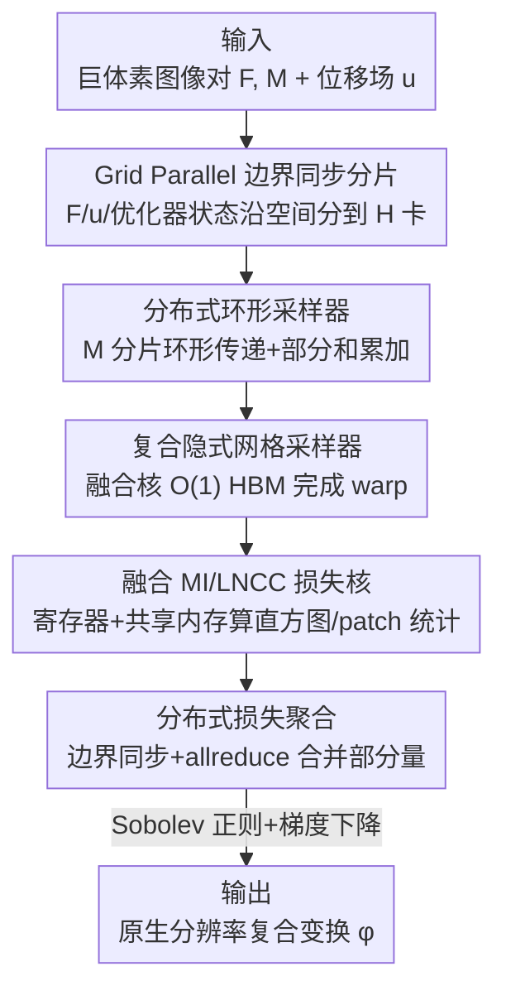

# A Scalable Distributed Framework for Multimodal GigaVoxel Image Registration

**会议**: ICLR2026  
**OpenReview**: [https://openreview.net/forum?id=8dLexnao2h](https://openreview.net/forum?id=8dLexnao2h)  
**代码**: 待确认  
**领域**: 医学图像 / 图像配准 / 分布式系统  
**关键词**: 图像配准, 巨体素, 融合 CUDA 核, 张量分片, 多模态脑 MRI

## 一句话总结
本文提出 FFDP——一套 IO 感知的非 GEMM 融合 CUDA 核加上支持卷积感知张量分片的分布式框架，把传统/深度图像配准流程加速 6–7×、峰值显存降低 20–59%，并首次在 8 张 A6000 上用约一分钟完成 100µm 离体人脑 MRI（超 110 亿变换参数、比临床数据大 570×）的原生分辨率多模态配准。

## 研究背景与动机
**领域现状**：图像配准（image registration）是生物医学与生命科学里无处不在的非线性逆问题——给定固定图像 $F$ 和运动图像 $M$，求一个坐标变换 $\varphi$ 使 $M\circ\varphi$ 对齐 $F$，数学上最小化 $L(\varphi)=C(F,M\circ\varphi)+R(\varphi)$，其中 $C$ 是相似度（如 MSE、LNCC、Mattes 互信息），$R$ 是正则项（如 Sobolev 范数）。现代流程通常先做仿射再做形变，得到复合变换 $\varphi(x)=Ax+t+u(x)$，其中位移场 $u$ 是逐体素向量场。

**现有痛点**：过去十年 MRI、CT、PET、STPT、显微成像把分辨率推高了三个数量级，离体人脑全脑扫描的配准可达 110 亿参数，而当前配准方法只在约 5000 万参数尺度上可靠。一个 250µm 图像对，标准深度配准网络仅第一层就生成 27GB 激活图，外推到临床数据原生分辨率需要约 1.2TB 显存——根本放不下。结果是高分辨率神经影像、计算病理、连接组学里 SOTA 形变配准严重欠拟合需求，只能把数据大幅降采样后跑 ANTs 再把 warp 上采样回去，丢掉了高分辨率采集本想保留的细胞层、轴突束等精细形态。

**核心矛盾**：大模型训练里 IO 感知融合算子（FlashAttention 系）和 5D 并行已经把"放不下的工作负载"分布到多卡，但它们几乎只为 GEMM 类算子（自注意力、FFN、LayerNorm）设计，没有卷积感知的张量分片与同步方案。而配准的瓶颈恰恰是**非 GEMM** 的逐体素算子：网格采样、互信息直方图、局部互相关——这些算子既没有被融合优化，也没有分布式版本。

**本文目标**：把大模型训练里被验证有效的三条理念（IO 感知、在片上内存重算并聚合中间量以减少 HBM 占用、跨主机识别部分聚合量以降通信）迁移到配准的非 GEMM 算子上，做到两点：单卡能放下比现有大 64× 的问题；框架能扩展到任意张 GPU。

**切入角度**：作者用免训练优化器（而非深度网络）来定位瓶颈——因为深度网络巨大的激活内存会掩盖真正的算子瓶颈。在 FireANTs 上 profiling 一个临床 MRI 配准任务，定位出三个内存瓶颈：形变插值与 warp 复合、互相关损失、互信息损失。

**核心 idea**：用一套 O(1) 额外 HBM 的融合核替换这三个内存瓶颈算子，再用"Grid Parallel + 环形采样器"把图像/warp/优化器状态沿空间分片到多卡，从而把配准扩展到巨体素级。

## 方法详解

### 整体框架
FFDP 分两层。**单卡层**把配准里三个内存瓶颈算子（网格采样、互信息、局部互相关）改写成 IO 感知的融合 CUDA 核，把逐体素的中间变量留在寄存器/共享内存里算，避免写回 HBM，使单卡能放下大 64× 的问题。**分布式层**在此基础上用 Grid Parallel 把固定图像、位移场 $u$、优化器状态 $[m_1],[m_2]$ 沿空间维度分片到 $H$ 张卡，每张卡只持有 $N/H$ 的数据；运动图像因为网格采样是随机访问无法静态分片，改用环形采样器在卡间流式传递图像分片、就地累加插值的部分和；最后各分片本地算损失、做边界同步与 allreduce 得到全局损失与梯度，按梯度下降更新各自的 warp 分片。整条管线对任意相似度损失（MSE/LNCC/MI）都成立，且通信量与问题规模 $N$ 解耦。

### 关键设计

**1. 复合隐式网格采样器：把 9N 的网格物化压成 O(1)**

网格采样器是配准的核心算子，对仿射+形变的复合变换，朴素实现要依次物化单位网格 $[x]_\Omega$、仿射网格 $A[x]_\Omega+t$、复合网格 $A[x]_\Omega+t+[u]_\Omega$，对大小为 $N$ 的图像共 $9N$ 的网格开销。本文把整条计算融成一个 CUDA 核，直接计算 $\text{fused\_grid\_sampler}(I;A,t,[u],S,x_{\text{bounds}})(x)=I(Ax+t+Su(x))$，所有坐标在寄存器里现算现用，不在 HBM 里物化任何额外网格，把内存从 $O(n)$ 降到 $O(1)$ 且不损失运行时与精度。这个设计还为分布式埋了两个伏笔：单位网格只由其边界 $x_{\text{bounds}}=(x_{\min},x_{\max})$ 隐式定义，分片时无需实例化局部网格分片 $[x]_{\Omega_h}$；矩阵 $S$ 用来把位移场重缩放到分片图像 $I_h$ 所在的子域 $\Omega_h$ 坐标系，同样不额外开内存。反向传播除仿射矩阵的梯度外与 PyTorch 原版几乎一致。

**2. 隐式 Parzen 窗互信息 + 融合互相关：让两个内存大户只占常数 HBM**

多模态配准最常用的 Mattes 互信息，是联合分布 $P(X,Y)$ 与边缘乘积 $P(X)P(Y)$ 的 KL 散度，分布用核密度估计 $P_I(v)=\frac{1}{N}\sum_k\kappa(v-I_k)$ 离散到 $B$ 个 bin。朴素实现要物化 Parzen 块 $\Psi_I(j,k)=\kappa(b_j-I_k)$，大小 $2k_PBN$；因为 $N\gg B$（$B$ 通常取 32），这对大 $N$ 是巨大瓶颈，一个临床体积 32 bin 就吃 7.5GB HBM。作者利用 $B$ 很小这一点，干脆不物化 $\Psi_I,\Psi_J\in\mathbb{R}^{B\times N}$，而是用高吞吐共享内存逐体素累加直方图条目和部分梯度，把额外 HBM 从 $O(N)$ 降到 $O(1)$，对实验中的图像减少最多 98% HBM、对大图渐近降到 100%。局部互相关 LNCC 同理：朴素实现因大量中间变量是内存受限的，计算图引入 16× HBM、求梯度再叠 16×；本文把所有中间量 $(I,J,I^2,J^2,IJ$ 与窗 $w$ 卷积$)$ 融进一个核，前向只用 5× 内存，反向通过原地修改保存的中间量算输入梯度，省 76.5% 内存，甚至超过 torch.compile。这三个非 GEMM 算子的融合核是单卡能放下大 64× 问题的关键。

**3. Grid Parallel：给卷积类算子做边界同步的空间分片**

Tensor/Sequence/Expert/Context Parallel 在 transformer 上很成功，但它们针对的模型参数和激活不需要边界同步。配准不同：LNCC、全变差、Sobolev 范数这些算子本质是卷积，分片后边界处的 patch 统计必须从相邻分片借像素才数学正确。作者提出 Grid Parallel（GP）作为张量上的抽象：把张量沿某维分片，把分片维度和边界作为元数据存下，并在做卷积前提供同步操作，从相邻分片取足够的边界 padding 补到本地张量上。GP 让固定图像、位移场 $[u]$、优化器状态 $[m_1],[m_2]$ 都能整体分片到 $H$ 张卡，用户照常调用卷积算子而无需关心跨卡边界——相比朴素 DTensor 分片，GP 正确处理了卷积所需的 halo 区。

**4. 分布式环形采样器：不做 allgather 也能跨卡插值运动图像**

GP 能分片固定图像和 warp，但运动图像 $M$ 不能静态分片：网格采样是随机访问，GPU $i$ 上的 warp 向量 $\varphi(x)$ 可能指向 GPU $j$ 上的图像分片，甚至相邻坐标 $\varphi(x_s),\varphi(x_u)$ 落到不同分片。若把整张 $M$ 留在每卡内存，最大问题规模就被单卡显存 $V$ 卡死（$N\le V$），与卡数 $H$ 无关，但我们恰恰希望最大规模随 $H$ 增长。作者的关键观察是：双/三线性插值可以分解为各图像分片上插值部分和的聚合。于是设计环形采样器——图像分片沿环形拓扑在主机间传递，每收到一片就地累加其贡献的部分和，交错进行"取分片"与"聚合"，避免对 $M$ 做昂贵的 allgather，每步只额外付 $N/H$ 的 HBM 来缓存别人的分片，从而让最大问题规模随 $H$ 高效扩展。

**5. 分布式损失聚合：把损失改写成可 allreduce 的部分量**

图像分片后损失也要相应改写才正确。MSE 是逐像素损失，本地算完做 allreduce 即可。LNCC 在分片边界的 patch 统计需要 GP 的边界同步，各分片算完再 allreduce 合到全图。互信息最巧妙：把式 $P_I(v)=\sum_h\frac{N_h}{N}\big(\frac{1}{N_h}\sum_{k\in\Omega_h}\kappa(v-I_k)\big)$ 改写后，括号里红色项就是每卡的本地直方图，对这些直方图按权重 $N_h/N$ 做加权平均的 allreduce 就得到全局正确的联合/边缘分布；通信量只有 $B^2+2B$，与 $N$ 完全无关——这正是 IO 感知里"跨主机识别部分聚合量"理念在非 GEMM 算子上的落地，使分布式互信息高度实用。

## 实验关键数据

### 主实验
在模拟离体脑 MRI 数据集 Faux-OASIS 上，于 1mm、500µm、250µm（原生）三个分辨率对比，分辨率越高本文优势越大（250µm 上几乎碾压所有 baseline）：

| 分辨率 | 方法 | AvgDice ↑ | InvDice ↑ | AvgHD90 (mm) ↓ |
|--------|------|-----------|-----------|----------------|
| 250µm | CLAIRE | 0.809 | 0.378 | 0.570 |
| 250µm | VFA | 0.714 | 0.281 | 0.821 |
| 250µm | TransMorph | 0.689 | 0.191 | 0.973 |
| 250µm | UniGradICON | 0.359 | 0.045 | 2.992 |
| 250µm | **Ours** | **0.895** | **0.597** | **0.216** |
| 500µm | FireANTs | 0.841 | 0.489 | 0.340 |
| 500µm | **Ours** | **0.872** | **0.528** | **0.258** |

并完成 standout demo：把 250µm 在体 MRI 配准到 100µm 离体 FLASH 全脑体积，超 112 亿优化参数（约 44.8GB 显存），单卡放不下；在 8 张 A6000 上约 58 秒完成多模态形变配准，能对齐小脑白质等宏观尺度看不见的精细结构。

### 消融实验
加速现有流程的核加速对比（TransMorph 训练 + FireANTs 优化）：

| 场景 | 配置 | 关键指标 | 说明 |
|------|------|---------|------|
| TransMorph LNCC 训练 | Baseline | 171.2h / 20.0GB | 原生 PyTorch |
| TransMorph LNCC 训练 | Ours | 27.8h / 17.0GB | 6.1× 加速，省 16.5% 显存 |
| FireANTs LNCC | Ours vs FastLNCC | 0.50s vs 3.76s | 7.5× 加速 |
| FireANTs MI | PyTorch 12206MB → Ours 577MB | 显存 | 约 95% 显存削减 |

### 关键发现
- **分辨率越高优势越大**：250µm 上多数深度 baseline（UniGradICON 0.359、TransMorph 0.689）因放不下/欠拟合崩掉，本文 Dice 0.895 一骑绝尘；说明问题瓶颈确实在内存与尺度而非配准算法本身。
- **融合核对临床小数据也有效**：即便 OASIS 只有 30MB，LNCC 核仍把单步从 1.44s 降到 0.50s、显存 1044MB→577MB，互信息核显存从 12.2GB 降到 577MB，几乎只受 $B$ 而非 $N$ 影响。
- **扩展性**：相比分布式配准方法 CLAIRE，本文用约 5× 更少显存即可扩展到任意大问题，而多数深度 baseline 受限于单卡。

## 亮点与洞察
- **把 LLM 训练的系统理念跨界到逆问题**：IO 感知、片上重算、部分聚合本是为 GEMM 设计的，作者识别出它们对非 GEMM 的逐体素算子同样适用，并补上了 transformer 并行缺失的"卷积感知张量分片"，这种跨领域迁移本身就很有启发。
- **隐式化是贯穿全文的主线**：网格用边界隐式表示、Parzen 块不物化、互相关中间量原地复用——三处都靠"别把大张量写进 HBM"省内存，思路统一且可复用到任何内存受限的逐体素算子。
- **互信息的部分聚合改写**最巧妙：把直方图写成各卡本地直方图的加权平均，使分布式互信息通信量降到 $B^2+2B$ 与 $N$ 无关，这条 trick 可直接搬到任何基于直方图/核密度估计的分布式损失。
- **环形采样器**用插值可分解为部分和这一观察，绕开 allgather 把运动图像也分片，是让问题规模真正随卡数扩展的临门一脚。

## 局限与展望
- 作者承认高分辨率配准的精度评估依赖私有标注的基准点，难以复现和横向比较；这也是为何要构造模拟数据集做定量对比。
- 框架聚焦内存/吞吐工程，配准算法本身（损失、正则、变换模型）沿用 FireANTs 等已有方法，并未提出新的配准建模；若底层算法在某模态上欠佳，FFDP 只能更快更大地复现这一不足。
- 环形采样器每步额外 $N/H$ 的 HBM 与环形通信，在卡间带宽受限或 $H$ 很大时通信可能成为新瓶颈，论文未深入讨论通信-计算重叠的极限。
- 评测主要在脑 MRI；对 LSFM/STPT 等模型生物显微数据（C. elegans、斑马鱼、鼠脑）的实际配准效果仍待验证。

## 相关工作与启发
- **vs 大模型 5D 并行（Megatron / DeepSpeed 系）**：它们做 GEMM 类算子（注意力、FFN）的张量/序列并行，本文做卷积感知的 Grid Parallel + 环形采样，补上了边界同步与随机访问插值这两个 transformer 并行不处理的问题。
- **vs CLAIRE**：同为分布式 GPU 配准，本文用约 5× 更少显存扩展到任意大问题，且 250µm 上 Dice 更高（0.895 vs 0.809）。
- **vs FireANTs / TransMorph / SynthMorph / UniGradICON**：这些是 SOTA 优化/深度配准方法，本文不替换它们的配准算法而是当作底座，用融合核与分布式框架把它们加速 6–7×、显存降 20–59%，并让它们能跑到原生分辨率。
- **vs FlashAttention 系融合核**：共享"IO 感知、片上重算、最小化 HBM"理念，但目标算子从 attention 换成网格采样/互信息/互相关等非 GEMM 算子。

## 评分
- 新颖性: ⭐⭐⭐⭐⭐ 首次把 IO 感知融合核 + 卷积感知张量分片系统性地用于巨体素配准，并做出 570× 临床规模的原生分辨率 demo。
- 实验充分度: ⭐⭐⭐⭐⭐ 三分辨率多 baseline 对比 + 核级消融 + 真实 100µm 离体脑 demo，覆盖性能与内存两条主线。
- 写作质量: ⭐⭐⭐⭐ 系统细节扎实、图示清晰，但大量推导/伪代码塞在附录，正文需对照才能完全跟上。
- 价值: ⭐⭐⭐⭐⭐ 直接解锁了此前算力放不下的高分辨率神经影像/连接组学配准，工程价值与科学意义都很高。

<!-- RELATED:START -->

## 相关论文

- [\[CVPR 2025\] CARL: A Framework for Equivariant Image Registration](../../CVPR2025/medical_imaging/carl_a_framework_for_equivariant_image_registration.md)
- [\[CVPR 2026\] KAMP: Knowledge-Anchored Multimodal Pretraining Framework for Medical Image Representation](../../CVPR2026/medical_imaging/kamp_knowledge-anchored_multimodal_pretraining_framework_for_medical_image_repre.md)
- [\[ICLR 2026\] Unified Brain Surface and Volume Registration](unified_brain_surface_and_volume_registration.md)
- [\[ICLR 2026\] CortiLife: A Unified Framework for Cortical Representation Learning across the Lifespan](cortilife_a_unified_framework_for_cortical_representation_learning_across_the_li.md)
- [\[CVPR 2026\] Revisiting 2D Foundation Models for Scalable 3D Medical Image Classification](../../CVPR2026/medical_imaging/revisiting_2d_foundation_models_for_scalable_3d_medical_image_classification.md)

<!-- RELATED:END -->
