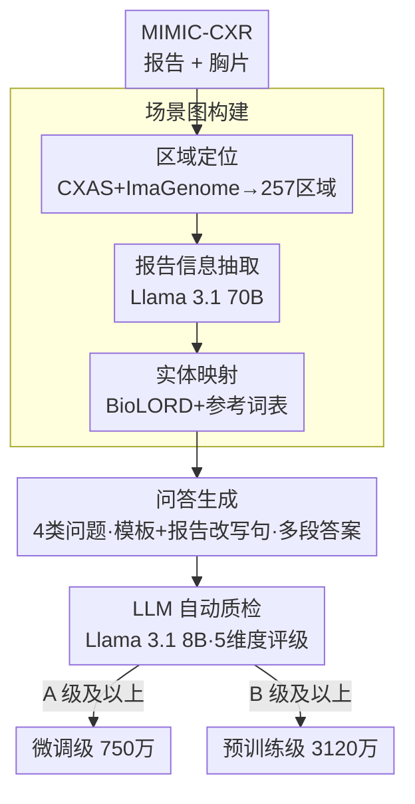

# A Structured, Tagged, and Localized Visual Question Answering Dataset with Full Sentence Answers and Scene Graphs for Chest X-ray Images

**会议**: ICLR2026  
**OpenReview**: [https://openreview.net/forum?id=LrmyW9JLYq](https://openreview.net/forum?id=LrmyW9JLYq)  
**代码**: https://github.com/philip-mueller/mimic-ext-cxr-qba/  
**领域**: 医学图像 / 多模态VQA数据集  
**关键词**: 胸片VQA、场景图、报告信息抽取、边界框定位、结构化标注

## 一句话总结
本文从 MIMIC-CXR 的放射学报告自动构建出 CXR-QBA——一个含 4220 万条问答对、每条答案都带完整句子、边界框和结构化标签（发现/区域/确定性等）的大规模胸片 VQA 数据集，通过"场景图构建 → 模板化问答生成 → LLM 自动质检"三段流水线产出，并给出 3120 万预训练级 + 750 万微调级两个子集和一个配套的 baseline 模型与评测指标。

## 研究背景与动机
**领域现状**：随着大语言模型（LLM）和大型多模态模型（LMM）的兴起，胸片（CXR）判读越来越多地走向"交互式、对话式"任务，视觉问答（VQA）是其中的代表——给定一张图和一个文本问题，模型生成答案。相比分类、报告生成这类"一图固定一个输出"的传统范式，VQA 允许用户按需、按上下文地探查图像。

**现有痛点**：训练鲁棒的医学 VQA 模型需要高质量、大规模的训练数据，但现有胸片 VQA 数据集普遍有三个硬伤：(i) 答案短而简单（多为"是/否"或单词），(ii) 缺少定位信息（没有边界框），(iii) 几乎没有结构化元数据（区域标签、发现/疾病类别、不确定性估计等）。再加上规模偏小（VQA-RAD 仅 3.5K、SLAKE 14K，最大的 CheXinstruct 也才 8.5M 且纯模板化），它们既不适合预训练，也无法支撑"可解释、可定位"的模型开发。

**核心矛盾**：人工标注能保证答案质量和定位精度，但根本无法规模化；而已有的自动化方案（如纯模板生成、或基于图像标注回填）要么答案僵硬、要么不直接以报告为条件，导致"规模"和"答案丰富度/可解释性"难以兼得。

**本文目标**：造一个既大、答案又像真实放射学报告那样有细节、还自带边界框和结构化标签的胸片 VQA 数据集，并把生成它的整条流水线开源、可迁移。

**切入角度**：放射学报告本身就是医生写的"结构化描述"，里面既有发现、又有解剖位置、还有确定性措辞。作者的关键观察是——只要先把报告解析成一张带定位的**场景图（scene graph）**，再从图上按模板派生问答，就能让答案继承报告的文字细节、同时挂上自动算出的边界框和标签。

**核心 idea**：用"报告 → 视觉锚定场景图 → 问答对"这条管线，把放射学报告的语义结构和图像区域的定位结果自动组合成结构化、带标签、可定位的 VQA 数据。

## 方法详解

### 整体框架
整个数据集由一条三阶段自动流水线产出。**第一阶段**先把每份 MIMIC-CXR 研究（一份报告 + 若干胸片）解析成一张视觉锚定的场景图：从报告里抽句子、抽观察项、抽指征，再用分割/检测模型把解剖区域定位成边界框，最后用语义实体映射把抽出来的标签对齐到预定义词表。**第二阶段**以场景图为数据源，按放射科医生共同设计的模板，针对四类问题生成问答对，答案可以是多段（multi-part）、多粒度的完整句子。**第三阶段**用 LLM-as-a-judge 对每条问答从五个维度打分，汇总成 A++ 到 D 的总评级，并据此切出"预训练级"和"微调级"两个子集。最终在 4220 万条问答里，标出 3120 万条预训练（PT）级和其中 750 万条微调（FT）级。

### 关键设计

**1. 视觉锚定场景图构建：把一份报告解析成"句子+观察+区域+指征"的带框图**

数据集的可解释性和定位能力全都建立在场景图上，这一步要解决的痛点是"报告是自由文本、图像区域是像素，二者没有现成对齐"。作者把场景图拆成四类节点——句子节点（直接来自报告，带 section 名）、观察节点（来自 FINDINGS / IMPRESSION 的单个发现，挂着文字描述、边界框，以及阳性/确定性/侧别/区域/发现类别等标签）、区域节点（解剖结构）、指征节点（来自 INDICATION，并关联一个能回答该指征的观察节点）。构建分三步：(a) **区域定位**——用 CXAS 模型在 377,110 张 MIMIC-CXR-JPG 上预测 158 个解剖结构的分割掩膜，再叠加 Chest ImaGenome 提供的 29 个结构边界框，通过交并、并集、外接框等组合派生出 257 个可定位区域（另有 53 个无框/非定位区域，合计 310 个），并丢弃过小的框；(b) **信息抽取**——用 Llama 3.1 70B 配少样本提示，分"抽句子并判 section → 抽指征并关联相关句 → 抽单个观察项"三步从 227,827 份报告里取标签和文字；(c) **实体映射建图**——把抽出来的标签映射到由 PadChest、Chest ImaGenome、SNOMED-CT 整理、经临床专家核验的参考词表（含同义词、层级、关系），并用 BioLORD 句向量做最近概念匹配，从而把观察对齐到边界框、还能从"已识别的发现"反推区域。相比 Chest ImaGenome 用规则抽取、只有 29 区域 53 发现，本文用 LLM 抽取覆盖到 257 区域、221 发现，还会把报告句子改写成只聚焦单个节点的描述。

**2. 模板 + 报告改写句的问答生成：四类问题 × 多段多粒度答案**

光有场景图还不是 VQA，这一步要把图变成"问题—答案"对，且既要规模、又要答案不僵硬。作者和放射科医生共同设计模板，针对四类问题分别生成：**指征类**（用改写后的指征当问题，从指征节点取答案）、**研究异常类**（13 个模板，从过滤后的观察节点生成）、**区域异常类**（6 个模板，对提到的区域提问，并随机采样未提及区域做平衡）、**发现类**（7 个模板，对发现提问，同样随机采样未提及发现做平衡）。每条答案可由多个 answer part 组成，分为 main-answer（主答）、details（细节）、related-information（相关信息）三类，从而控制答案粒度；answer part 既可由场景图信息填模板，也可直接取自被改写的报告句子，还能按场景图的父子边层级化组织。关键在于——答案不是纯模板的，而是掺入了真实报告的改写句，这让答案文本的重复率极低（不同答案类型平均去重因子仅 1–6），却仍带着报告级别的细节。

**3. LLM-as-a-judge 自动质检与 PT/FT 分级：把噪声样本筛出去并分出两档质量**

自动流水线每一步都可能引入错误（抽错标签 → 填错模板/选错观察节点），所以必须有质检。作者用 Llama 3.1 8B 当评委，从五个维度打分：**entailment**（答案是否与原报告事实一致）、**relevance**（答案是否切题）、**completeness**（是否漏内容）、以及问题和答案各自的 **clarity**（是否清晰、语法正确）；同时评估场景图本身有没有缺标签/缺定位/构建问题。把这些子评分汇总成 A++、A+、A、B、C、D 或 not rated 的总评级，并排除所有非正位（non-frontal）图像（这类图定位质量低）。**A 级及以上**记为微调（FT）级，共 750 万；**B 级及以上**记为预训练（PT）级，共 3120 万。人类核验显示 LLM 评委至多 2% 的样本被高估，且整体偏严，证明这套自动评级可信。

**4. 结构化 VQA 任务与 RadStrucVQA 指标：给数据集配上任务定义、baseline 和可定位/可标签的评测**

为了证明数据集有用，作者把它落到一个新任务上——**结构化 VQA**：给定自由文本问题，模型要输出"多段自由文本答案 + 边界框 + 标签（发现、区域等）"，比经典 VQA 更强调结构化输出，从而提升可解释性和临床实用性。baseline 模型基于 LLaVA 架构，用 Rad-DINO 做图像编码、Llama 3.2 3B 做语言模型，把答案、标签、边界框用 XML 风格结构和特殊 token 序列化。配套的 **RadStrucVQA 指标**推广自报告生成的 RadFact：先用 Llama 3.1 8B 判断预测答案段与目标答案段是否双向蕴含，对蕴含的对再判断边界框是否够精确（grounding）、发现/区域标签是否正确（tags），双向计算分别得到 precision 和 recall。作者验证了用小模型 Llama 3.1 8B 判蕴含与 70B/Qwen3-32B 的相关性高达 0.88–0.97，说明指标可靠且省算力。

## 实验关键数据

### 场景图质量评估（vs Chest ImaGenome）
作者把场景图导出的研究级标签和边界框与专家标注对比。发现标签用 Matthews 相关系数（MCC）评，边界框用 30% 阈值下的 IoU/IoP/IoT 评。

| 评估对象 | 指标 | 本文场景图 | Chest ImaGenome |
|--------|------|------|----------|
| 发现标签（MIMIC-JPG, micro MCC） | MCC | 0.71 | 0.67 |
| 发现标签（CXR-LT 长尾类 LT-only） | MCC | 0.71 | 0.59 |
| 发现框（MS-CXR, IoU@30） | IoU | 0.51 | 0.45 |
| 发现框（MS-CXR, IoP@30，框越精越高） | IoP | 0.56 | 0.48 |

关键发现：本文在常见类上略胜，**在长尾类上大幅领先（约 +20%）**，体现了细粒度发现标签（221 类）的价值；边界框的 IoP 更高说明框更小更精（得益于 257 个细粒度区域），但 IoP 整体偏低、IoT 偏高说明框普遍偏大（因为是从报告提到的解剖区域派生、而非逐病灶手标）。

### 问答质量与规模统计
4220 万条问答经 LLM 评级后：**18.6% 为微调级、58.8% 为预训练级、22.6% 被排除**；其中 85% 的单个主答（main answer）被评 A 级及以上。去重统计显示答案文本去重因子仅 1–6（高度多样），而问题文本因模板化重复较多（除指征类问题几乎条条不同）。答案中位长度 14 词，指征类答案明显更长（46 词），阳性发现答案（18 词）显著长于阴性（10 词），贴合真实报告的详略习惯。

### 结构化 VQA 任务结果
baseline 在不同训练子集上训练，并与未在本任务微调的 MAIRA-2、Qwen3-VL(4B)、LLaVA-Med v1.5 比较。

| 模型 / 训练集 | Logical Prec. | Logical Rec. | Grounding Prec. | Grounding Rec. |
|------|------|------|------|------|
| Ours PT(1M) | 0.67 | 0.69 | 0.87 | 0.92 |
| Ours FT(1M) | 0.76 | 0.75 | 0.87 | 0.89 |
| **Ours PT(1M)→FT(1M)** | **0.78** | **0.77** | **0.89** | **0.90** |
| MAIRA-2 | 0.25 | 0.64 | 0.69 | 0.12 |
| Qwen3-VL (4B) | 0.63 | 0.58 | 0.61 | 0.51 |
| LLaVA-Med v1.5 | 0.47 | 0.08 | – | – |

关键发现：
- **"先 PT 1M 再 FT 1M"是最佳配置**，甚至优于训练 2M PT 样本，说明 PT 级数据虽是 B 级也提供了高质量目标，FT 级则进一步提质。
- 所有本文模型都明显超过未在本任务训练的基线；MAIRA-2 能拿到本文最佳模型 75% 的 logical recall（说明它抓到了大部分信息），但 precision 低（会预测多余发现）、且只为阳性发现画框导致 grounding recall 极低（0.12）。
- 标签预测里，**阳性发现（finding-pos）召回明显偏低**（FT 仅 0.31），暴露出对阳性发现的欠预测——但作者强调，正是因为数据集带细粒度标签，才能定位并通过过滤/平衡缓解这类问题。

## 亮点与洞察
- **"报告即结构化标注源"的思路很巧**：医生写报告时其实已经把发现、位置、确定性都写进去了，本文不去重新人工标注，而是用 LLM 把报告解析成场景图，等于"白嫖"了放射科医生的结构化知识，再用分割模型补上像素级定位。这条"文本结构 + 视觉定位"的组合拳可迁移到任何"图像 + 专家文字报告"的领域。
- **模板保规模、报告改写句保多样**：纯模板会让答案僵硬重复，本文把真实报告改写句掺进答案，于是问题可以重复（去重因子上百）但答案高度多样（去重因子 1–6），一举兼顾了"可控生成"和"答案丰富度"。
- **自动质检 + 分级而非一刀切**：不追求"全对"，而是把样本分成 PT/FT 两档分别用于预训练和微调，承认自动数据有噪声但仍可用，这种"分级用数据"的工程观很务实，实验也证明先 PT 再 FT 优于堆量。
- **细粒度标签是可分析性的根**：长尾发现 +20% 的提升、以及能定位"阳性发现欠预测"问题并提出用标签做过滤/平衡，都说明丰富标签不只是数据漂亮，而是真能驱动下游分析和改进。

## 局限与展望
- **作者承认的局限**：数据集完全自动构建，依赖模型和模板，可能引入 LLM 幻觉、模板先验等错误和偏差；虽有自动质检，但质检本身也是 LLM 的、有上限。作者**明确反对**把它当作临床场景下微调/评测的唯一数据源，建议关键应用配小规模、纯人工的金标准集。
- **单一来源偏差**：数据全部来自 MIMIC-CXR 一个数据集，继承了该患者群体的人口学和临床偏差，可能限制模型泛化；且只覆盖胸片单模态、不含纵向（longitudinal）和鉴别诊断类问题。
- **边界框偏大**：框是从报告提到的解剖区域派生的（IoP 偏低），不如逐病灶手标精确，定位粒度受限于区域而非病灶本身。
- **改进思路**：把这套构建框架迁移到其他影像模态、扩展到纵向/鉴别诊断问题类型；针对阳性发现欠预测，利用自带标签做数据过滤与平衡。

## 相关工作与启发
- **vs MIMIC-CXR-VQA / Medical-CXR-VQA**：都从 MIMIC-CXR 派生，但前者依赖 Chest ImaGenome 的现成场景图、后者虽用 LLM 抽取却没有语义实体映射、定位和文字描述抽取；本文做了更全面的 LLM 抽取 + 实体映射 + 像素级定位，答案也更长更结构化。
- **vs CheXinstruct（此前最大，8.5M）**：CheXinstruct 纯模板、问答多样性低、且基于数据集标注而非直接条件于报告；本文规模大 5 倍（42M）、答案掺入报告改写句更多样，且独有边界框 + 标签 + 多段答案。
- **vs MAIRA-2 / ChEX（grounded report generation）**：它们是"带框的报告生成"，本文则把定位带进了 VQA 任务；实验中直接把 MAIRA-2 当基线，显示报告生成模型迁到结构化 VQA 上 precision 和 grounding recall 都明显吃亏。
- **vs Chest ImaGenome / RadGraph（场景图构建）**：前者规则抽取、后者关系抽取模型，本文用 LLM 抽取 + 语义实体映射，区域（257 vs 29）和发现（221 vs 53）覆盖大幅更广，且会改写句子聚焦单个节点。

## 评分
- 新颖性: ⭐⭐⭐⭐ 不是全新范式，但"报告→视觉锚定场景图→结构化/带框/带标签 VQA"的整条自动管线和细粒度标签是扎实的新贡献。
- 实验充分度: ⭐⭐⭐⭐⭐ 场景图对专家标注、质检对人类核验、任务上多基线对比 + 训练子集消融，验证链条完整。
- 写作质量: ⭐⭐⭐⭐ 结构清晰、图表丰富，pipeline 讲得明白；部分细节散在附录。
- 价值: ⭐⭐⭐⭐⭐ 42M 规模 + 边界框 + 结构化标签 + 开源构建管线，对医学多模态预训练是稀缺且高价值的资源。

<!-- RELATED:START -->

## 相关论文

- [\[AAAI 2026\] Q-FSRU: Quantum-Augmented Frequency-Spectral Fusion for Medical Visual Question Answering](../../AAAI2026/medical_imaging/q-fsru_quantum-augmented_frequency-spectral_fusion_for_medical_visual_question_a.md)
- [\[CVPR 2026\] Dual-Level Confidence based Implicit Self-Refinement for Medical Visual Question Answering](../../CVPR2026/medical_imaging/dual-level_confidence_based_implicit_self-refinement_for_medical_visual_question.md)
- [\[CVPR 2026\] MR-RAG: Multimodal Relevance-Aware Retrieval-Augmented Generation for Medical Visual Question Answering](../../CVPR2026/medical_imaging/mr-rag_multimodal_relevance-aware_retrieval-augmented_generation_for_medical_vis.md)
- [\[ICLR 2026\] Learning Self-Critiquing Mechanisms for Region-Guided Chest X-Ray Report Generation](learning_self-critiquing_mechanisms_for_region-guided_chest_x-ray_report_generat.md)
- [\[ICML 2026\] SEMIR: Semantic Minor-Induced Representation Learning on Graphs for Visual Segmentation](../../ICML2026/medical_imaging/semir_semantic_minor-induced_representation_learning_on_graphs_for_visual_segmen.md)

<!-- RELATED:END -->
