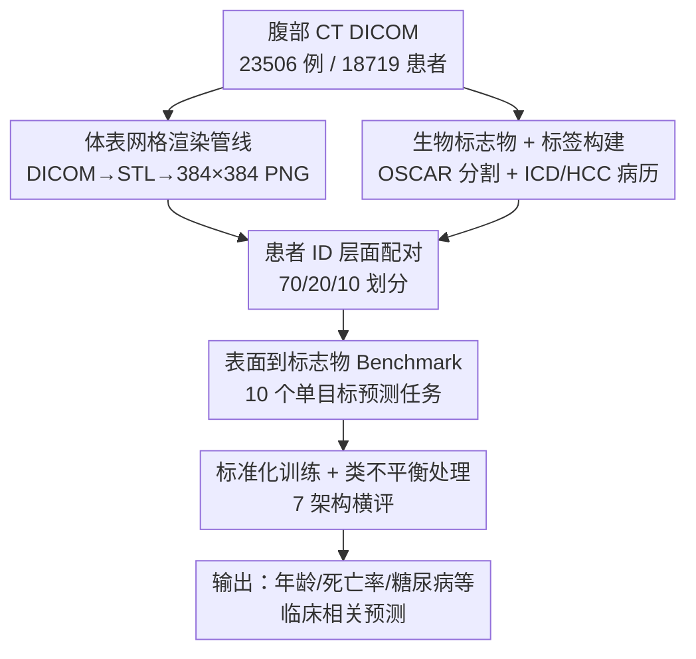

# AbdCTBench: Learning Clinical Biomarker Representations from Abdominal Surface Geometry

**会议**: ICLR 2026  
**OpenReview**: [https://openreview.net/forum?id=dKRAo0a9Gm](https://openreview.net/forum?id=dKRAo0a9Gm)  
**论文**: [项目主页](https://stair-lab.github.io/AbdCTBench/)  
**代码**: https://stair-lab.github.io/AbdCTBench/ (有)  
**领域**: 医学图像  
**关键词**: 体成分分析, 表面几何, 临床生物标志物, 数据集 benchmark, 无创筛查

## 一句话总结
作者从 18,719 名患者的 23,506 例腹部 CT 中提取出 2D 体表网格图像、配上 16 个 CT 生物标志物与上百个疾病/共病标签，构建了首个、也是规模最大的「体表几何 → 内部体成分」数据集 AbdCTBench，并用 7 个主流视觉架构系统证明：仅凭外部腹部表面几何就能预测年龄（MAE 6.22 岁）、死亡率（AUROC 0.839）、伴慢性并发症的糖尿病（AUROC 0.801）等临床相关指标，为无辐射、低成本的消费级健康筛查铺路。

## 研究背景与动机

**领域现状**：体成分分析（visceral fat、肌肉浸润、器官体积等）是评估心代谢健康的重要手段。BMI 和腰围太粗糙，无法区分代谢活跃的内脏脂肪、肌间脂肪与器官病变；CT/MRI 衍生的影像学生物标志物则能提供高精度量化评估，已成为金标准。

**现有痛点**：CT/MRI 这条金标准路径被「可及性」卡死——CT 有电离辐射、不能反复做；MRI 昂贵且设备稀缺；二者都需要专用基础设施和放射科医生，在资源受限地区形成瓶颈，加剧健康不平等。换句话说，最准的测量手段恰恰是最难普及的。

**核心矛盾**：高精度临床影像（CT/MRI 拍内部组织）与广泛可及的消费级技术（如 iPhone 的 LiDAR 深度扫描只能拿到体表）之间存在鸿沟。要做人群级筛查，就必须放弃直接看内部，只能靠外部几何。

**本文目标**：(1) 验证「外部体表几何是否真的能预测内部组织成分」这个核心假设；(2) 提供一个标准化、大规模的数据集与 benchmark，让社区能在「表面几何 → 生物标志物」这一全新的间接推断任务上做方法研究。

**切入角度**：作者的关键洞察是——外部腹部表面几何对内部组织成分具有预测性。腹部脂肪分布、曲率变化等表面特征本身就与内脏脂肪、肌肉量、骨密度等内部指标相关。既然历史上积累了海量 CT 扫描，就可以把它们「降维」成体表网格（模拟未来消费级设备能拿到的输入），同时保留 CT 算出的金标准标签作为监督信号。

**核心 idea**：把已有腹部 CT 渲染成「2D 体表深度网格图」，配对 CT 算出的金标准生物标志物，训练视觉模型只看体表、推断体内——一旦验证可行，推理阶段就能彻底甩掉 CT，改用 LiDAR 等无辐射设备扫出的网格做筛查。

## 方法详解

### 整体框架

AbdCTBench 本质是一个「数据集构建 + 标准化 benchmark」工作，而非新模型。它要解决的是：怎么把一堆原始 CT DICOM 变成「体表图像 ↔ 临床标签」的配对监督数据，以及怎么在这套数据上公平地横评各类视觉架构。整条管线分两路并行再汇合——一路把 CT 渲染成 2D 体表网格图（模型的输入），一路用专用工具从同一份 CT 算出 16 个金标准生物标志物并对接病历里的疾病/共病标签（模型的监督目标）；两路在患者 ID 层面配对后，按 70/20/10 划分，喂给 7 个标准化训练的视觉架构做单目标预测。

### 关键设计

**1. 体表网格渲染管线：把内部 CT「降维」成消费级设备能拿到的外部几何**

要让模型学的是「未来 LiDAR 能给到的输入」，就不能直接喂原始 CT 切片（那是内部解剖），必须先把 CT 转成只剩外表面的几何。作者设计了三段串行的 DICOM→STL→PNG 渲染管线：先做体数据处理（可选的收缩与各向异性平滑，准备数据）；再用 VTK 的 contour filter 做表面提取，生成 3D 三角网格，经网格清理与平滑后导出为二进制 STL 文件；最后用 PyVista 在固定相机位姿下把每个网格渲染成标准化的 $384 \times 384$ PNG 图像（实为深度图投影）。这一步的巧妙之处在于：它人为地丢掉了内部信息，只保留外部表面，从而让「CT 历史数据」变成「模拟消费级体表扫描」的代理——训练用 CT 渲的网格，推理时换成 iPhone LiDAR 扫的网格，输入分布对得上。

**2. 生物标志物与临床标签构建：用 CT 算金标准，给体表图像配上可监督的体内真值**

光有体表图像没有标签学不了。作者用专用工具 OSCAR 处理同一份 DICOM，自动生成分割掩膜，在椎体层面（L1-L5、T10-T12）和器官区域（肝、脾、肾、主动脉）上计算骨密度、脂肪分布、肌肉成分、器官体积、钙化评分等度量，得到 16 个跨多个解剖层级的生物标志物。再把这些 CT 衍生标志物与病历里的 31 个 ICD-10 诊断码、87 个 HCC 分层共病标签、2 个纵向化验值（HbA1c、CRP）对接。所有数据按 HIPAA Safe Harbor 去标识化后公开。这一设计的关键是「金标准来自 CT、输入却只用体表」——监督信号的精度由 CT 保证，而模型在推理时并不需要 CT，从而把高精度临床测量「蒸馏」进体表预测能力里。

**3. 表面到标志物的单目标 Benchmark：把开放问题收敛成 10 个可比的标准任务**

为了让架构横评干净可比，作者从数据集里精选出 10 个生物标志物预测任务，采用单目标学习框架（每个架构在每个任务上独立训练评估），避开多任务学习的相互干扰，从而把「哪个架构擅长哪类预测」这件事看清楚。任务覆盖回归（年龄，MAE 衡量）与二分类（死亡率、钙化评分 >1000、心梗、2 型糖尿病，以及 HCC-108 血管病、HCC-18 伴并发症糖尿病等共病，AUROC 衡量）。同时统一了 7 个跨家族架构的选型（ResNet-18/34/50、DenseNet-121、EfficientNet-B0、ViT-Small/DINOv2、Swin-Base），既含 CNN 也含 Transformer，既含 ImageNet 通用预训练也含 RadImageNet 医学领域预训练与 DINOv2 自监督预训练，目的是回答「架构进展能否迁移到这个间接推断的新问题」。

**4. 标准化训练协议与类不平衡处理：让横评公平、让稀有阳性可学**

跨架构对比若超参不一致就失去意义，作者据医学影像最佳实践定死一套协议：AdamW（weight decay $1\times10^{-4}$）+ 余弦退火，扫三个学习率（$1\times10^{-5}$、$1\times10^{-4}$、$1\times10^{-3}$），batch size 16，训 100 epoch 带早停（patience 10），dropout 0.2，二分类用带 logits 的 BCE、回归用 MSE，全部全量微调。更关键的是数据集严重类不平衡（如死亡率仅 11.4%），作者叠加三招应对：损失上的逆频率加权（类权重取类频率倒数）、训练时的平衡批采样（每个 batch 各类近似等量、防多数类主导）、以及在验证集上按 F1 在 $[0.1, 0.9]$ 区间搜 9 个离散阈值做阈值优化（避免默认 0.5 在不平衡下失真）。这三招让稀有但临床重要的阳性样本不被淹没，也保证不同架构在同一规则下被公平评判。

## 实验关键数据

### 主实验

在 7 个架构上做单生物标志物预测，验证集选最优 checkpoint、测试集报告性能。所有模型都远超 naive baseline（年龄 R² > 0.719），说明体表几何确实承载了可学的预测信号。

| 任务 | 指标 | 最佳架构 | 最佳值 | Naive Baseline |
|------|------|----------|--------|----------------|
| 年龄（回归） | MAE | EfficientNet-B0 | 6.22 年 | 13.16 |
| 钙化评分 Agatston | AUROC | ResNet-34 | 0.848 | 0.500 |
| 死亡率 | AUROC | ResNet-18 | 0.839 | 0.500 |
| HCC-18（伴并发症糖尿病） | AUROC | Swin-Base | 0.801 | 0.500 |
| HCC-96（心律失常） | AUROC | Swin-Base | 0.770 | 0.500 |
| HCC-111（COPD） | AUROC | ResNet-18 | 0.769 | 0.500 |
| HCC-108（血管病） | AUROC | Swin-Base | 0.768 | 0.500 |
| 心梗 MI | AUROC | Swin-Base | 0.742 | 0.500 |
| 2 型糖尿病 | AUROC | ResNet-34 | 0.742 | 0.500 |
| HCC-12（乳腺/前列腺等癌症） | AUROC | ResNet-34 | 0.591 | 0.500 |

### 架构家族分析

| 配置 | 表现 | 说明 |
|------|------|------|
| 小/中型 CNN（ResNet-18/34、EfficientNet-B0） | 多数任务领先 | 持平或超过更大的 ResNet-50 |
| ResNet-50（RadImageNet 医学预训练） | 多数任务落后 | 死亡率仅 0.810，逊于 ResNet-18 的 0.839 |
| ViT-Small（DINOv2 自监督） | 有竞争力但从不夺冠 | 常进前 2-3，但无一任务最优 |
| Swin-Base（层次化局部注意力） | 数个任务最优 | MI、HCC-108/18/96 上夺冠 |

### 关键发现

- **小模型反超大模型**：小到中型 CNN 持续持平或超过更大的 ResNet-50。作者归因于此任务是「体表几何 → 内部生理」的间接推断，预测信号更多体现为局部空间特征（曲率细微变化、脂肪分布），CNN 的局部归纳偏置天然契合；Swin-Base 靠移位窗口的层次化局部注意力在几个任务夺冠，也佐证了「局部 + 全局平衡」有利。
- **医学领域预训练并不占优**：RadImageNet 预训练的 ResNet-50 全面落后。原因是 AbdCTBench 是 CT 衍生的「体表几何」而非原始 CT 影像，与 RadImageNet 训练分布差异大，领域预训练优势失效；DINOv2 自监督同理，都不足以盖过小而强正则网络的优化/泛化优势。
- **伴并发症糖尿病比单纯 T2D 更可预测**：HCC-18（伴慢性并发症糖尿病）AUROC 0.801 明显高于单纯 2 型糖尿病的 0.742，提示体表几何对「已发展出并发症的糖尿病」携带更强信号。
- **癌症类几乎不可预测**：HCC-12 全架构都贴近随机（0.571–0.591）。作者解释为该标签聚合了多种异质癌症、与腹部体成分关系弱，且 HCC 编码相对扫描时间跨越诊断前/治疗中/长期存活，进一步稀释信号——印证「体表几何主要预测心代谢与肌骨指标，而非肿瘤共病」。
- **性别分层差异真实存在**：年龄预测男性明显更准（MAE 5.76, R²=0.81 vs 女性 6.63, 0.70）；钙化评分、MI、COPD 男性更优，而 HCC-18、死亡率女性更优。作者认为这反映脂肪分布（男型/女型肥胖）与衰老（如绝经）的真实生物学差异，但两组都远高于随机，故统一模型已足够稳健。

## 亮点与洞察

- **「用历史 CT 蒸馏出无创筛查能力」的范式很巧**：把已有 CT 当作金标准标签源，却人为只喂模型体表几何，等于在监督阶段「偷用」CT 精度、在推理阶段彻底摆脱 CT。这种「训练靠贵设备、推理靠便宜设备」的代理监督思路，可迁移到任何「高精度模态 ↔ 可及模态」配对的医疗场景。
- **「越小越好」是个反直觉且有用的结论**：在这种间接、信号偏局部的任务上，盲目堆大模型/上医学预训练反而吃亏，小 CNN + 强正则 + 类不平衡处理更香。对资源受限的医疗部署是实在的好消息。
- **类不平衡三件套是可复用的工程模板**：逆频率加权 + 平衡批采样 + 验证集 F1 阈值优化，配合用 AUROC（阈值无关）做模型选择、再单独报阈值相关指标，是处理临床稀有阳性的干净做法。
- **诚实地暴露失败任务**：作者没有藏掉 HCC-12 这种近随机的结果，反而用它来界定方法的能力边界（心代谢/肌骨 yes、肿瘤 no），增强了 benchmark 的可信度。

## 局限与展望

- **单中心数据，跨站泛化未验证**：全部来自单一医疗机构，不同站点的 CT 扫描协议会改变体表几何，多站点评估是关键下一步。
- **无入排标准引入隐性人口偏差**：为最大化数据规模，没设年龄/性别/种族/既往病等入排条件，可能带入人口学偏差。
- **尚未用真·消费级设备验证**：所有体表网格都从 CT 渲染而来，并非 iPhone LiDAR 实扫；早期 LiDAR 在复杂躯干几何上仍吃力，真实设备扫描的验证才是落地的临门一脚。
- **只做单目标、架构规模受限**：受算力限制只评了较小的 CNN/Transformer，未探索大 ViT、医学自监督、U-Net 变体；多任务共享编码器、校准方法（温度缩放、focal loss）与不确定性估计都是值得做的方向。

## 相关工作与启发

- **vs 传统医学影像 benchmark（CheXpert、MIMIC-CXR）**：它们都绑定 CT/MRI/X-ray 等直接拍内部解剖、需专用设备的模态；AbdCTBench 改用体表几何这种可及性高的间接模态，预测信号是间接的，要模型学「几何 ↔ 生理」的关联，是全新一类任务。
- **vs 外部体形分析（人体姿态估计、人体测量学）**：以往体表分析多在非临床领域，从未在规模上把外部腹部几何与 CT 衍生的内部生物标志物系统对接；本文填了这个空白，把医学影像的严谨标签与体表成像的可及性结合。
- **vs 医学影像架构评测研究**：以往架构评测都在直接拍内部解剖的模态上比；本文提供一个「间接推断」的新竞技场，回答 CNN/Transformer/基础模型的架构进展能否迁移过来——结论是小 CNN 在此反而更强。

## 评分
- 新颖性: ⭐⭐⭐⭐ 首个把外部腹部体表几何与 CT 衍生内部生物标志物大规模对接的数据集，「历史 CT 蒸馏无创筛查」范式新颖
- 实验充分度: ⭐⭐⭐⭐ 7 架构 × 10 任务全覆盖，含家族分析、领域预训练对比、阈值与性别分层分析，带 bootstrap 置信区间
- 写作质量: ⭐⭐⭐⭐ 动机清晰、管线交代完整、对失败任务诚实
- 价值: ⭐⭐⭐⭐⭐ 开放数据集 + 评测协议 + 预训练权重，直接推动无辐射低成本健康筛查研究

<!-- RELATED:START -->

## 相关论文

- [\[ICLR 2026\] MedLesionVQA: A Multimodal Benchmark Emulating Clinical Visual Diagnosis for Body Surface Health](medlesionvqa_a_multimodal_benchmark_emulating_clinical_visual_diagnosis_for_body.md)
- [\[ICLR 2026\] Unified Brain Surface and Volume Registration](unified_brain_surface_and_volume_registration.md)
- [\[ICLR 2026\] Towards Interpretable Visual Decoding with Attention to Brain Representations](towards_interpretable_visual_decoding_with_attention_to_brain_representations.md)
- [\[ICLR 2026\] CardioComposer: Leveraging Differentiable Geometry for Compositional Control of Anatomical Diffusion Models](cardiocomposer_leveraging_differentiable_geometry_for_compositional_control_of_a.md)
- [\[CVPR 2026\] Learning Generalizable 3D Medical Image Representations from Mask-Guided Self-Supervision](../../CVPR2026/medical_imaging/learning_generalizable_3d_medical_image_representations_from_mask-guided_self-su.md)

<!-- RELATED:END -->
