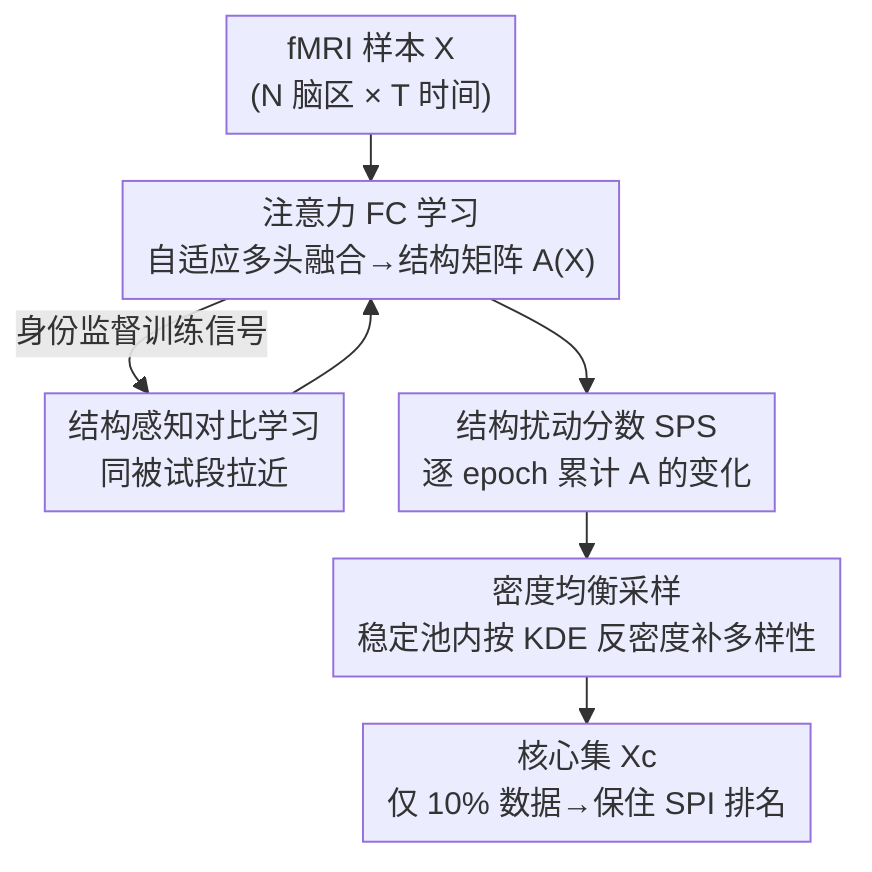

# Accelerating Benchmarking of Functional Connectivity Modeling via Structure-aware Core-set Selection

**会议**: ICLR2026  
**OpenReview**: [https://openreview.net/forum?id=0RYazbfSzW](https://openreview.net/forum?id=0RYazbfSzW)  
**代码**: https://github.com/lzhan94swu/SCLCS  
**领域**: 医学图像 / 脑功能连接 / fMRI  
**关键词**: 功能连接、核心集选择、基准评测加速、自监督、注意力结构

## 一句话总结
为了让"在大规模 fMRI 数据上比较数百种功能连接（FC）建模算子"这件昂贵的事变得可负担，本文把基准评测重新表述成"保留算子排名的子集选择"问题，提出自监督框架 SCLCS——用自适应 Transformer 学每个样本的连接结构、用结构扰动分数（SPS）挑出最稳定的"原型"样本、再用密度均衡采样补多样性，仅用 10% 数据就能保住全集上 130 个 FC 算子的真实排名，排名一致性（nDCG@k）比此前最好的核心集方法高出最多 23.2%。

## 研究背景与动机
**领域现状**：在脑功能连接研究里，"用什么方法把 fMRI 时间序列转成脑区间的连接矩阵"本身就是个方法学难题。学界把这些算子统称为 SPI（statistical pairwise interaction，统计成对交互算子），像 pyspi 这样的库里塞了数百种候选 SPI（皮尔逊相关、互信息、各种谱方法……）。不同 SPI 会给出完全不同的连接拓扑，进而导出不同的科学结论，所以"系统地 benchmark 一遍、挑出最靠谱的算子"被认为是保证神经科学可复现性的关键前置步骤。

**现有痛点**：问题是这一步算不起。要在全量被试上把几百个 SPI 都跑一遍、再评估排名，组合爆炸式的"模型×数据"配对让穷举评测在计算上不可行——它本该是每次分析前的例行体检，现实里却贵到没人愿意做。

**核心矛盾**：直觉上可以"先在一小撮代表性样本上把所有 SPI 比一遍，挑出 top 算子，再只在全量数据上跑这几个算子"。这套两阶段流程的成败全押在一件事上：**这个小核心集（core-set）必须保住 SPI 在全集上的相对排名**。而经典的核心集选择方法目标完全不同——它们是为"训练单个预测模型"挑训练子集（最小化训练损失），既是模型相关的、又默认样本 i.i.d. 静态，根本没考虑 fMRI 时序里蕴含的、决定 FC 结构的时间依赖。拿这种核心集来做跨 SPI 的排名保留，会失配。

**本文目标**：把"为 FC 基准评测选核心集"形式化成一个**排名保留的子集选择问题**，并解决三个由此衍生的挑战——(1) 选择准则要瞄准跨 SPI 的排名稳定性而非单模型训练损失；(2) 要给"样本重要性"一个基于 FC 结构的、有原则的定义；(3) 要缓解 score 型 top-k 选择的脆弱性（在不同采样比例下泛化差、会扭曲排名）。

**切入角度**：作者的关键假设是——**保留住功能连接结构的分布，就能保留 SPI 的排名**。于是不去训练任何预测模型，而是去找一个"结构上有代表性"的子集。判断"哪些样本是基础性原型"的信号，则来自一个新观察：代表常见、基础连接模式的样本，在训练过程中学到的结构表示会很稳定；而噪声或非典型样本会剧烈波动。

**核心 idea**：用一个自适应注意力编码器把每个样本的 FC 结构学出来，用"训练过程中该结构的累计扰动量"（SPS）当作样本重要性的代理，优先挑最稳定的样本，再用密度均衡采样补上多样性——得到既稳健又分布上有代表性的核心集。

## 方法详解

### 整体框架
SCLCS 要解决的是：从全量 fMRI 样本 $\mathcal{X}$ 里挑出一个小子集 $\mathcal{X}_c$（$|\mathcal{X}_c|\ll|\mathcal{X}|$），使得在这个子集上算出来的 SPI 排名 $\mathrm{Rank}(\mathcal{S},\mathcal{X}_c)$ 尽量贴近全集排名 $\mathrm{Rank}(\mathcal{S},\mathcal{X})$（式 1，用 nDCG@k 类的排名差异度量衡量）。直接优化这个目标是不可行的——它要穷举指数级子集、每次评估又得付出我们想省掉的那笔算力。于是作者退而求其次：找"结构上有代表性"的子集作为可行代理。

整条流水线由四个模块串成：先用**注意力 FC 学习**把每个样本编码成一张结构矩阵 $A(X)$；训练过程中持续记录这张矩阵的逐 epoch 变化，算出**结构扰动分数 SPS**；按 SPS 从低到高挑稳定样本，再叠一层**结构感知的密度均衡采样**补多样性；整个编码器则用**结构感知对比学习**（以被试身份为监督信号）来训练。

### 关键设计

**1. 注意力 FC 学习：用可学习融合权重而非均匀平均，逼出能逼近连续 FC 算子的结构编码器**

第一步要的是一个表达力够强的编码器，把每个样本的 FC 结构学出来。作者把一个 fMRI 样本 $X\in\mathbb{R}^{N\times T}$ 的 $N$ 个脑区（ROI）当成 $N$ 个 token、每个 token 的特征维是时间长度 $T$，用多头自注意力建模脑区间关系，第 $h$ 个头给出注意力矩阵 $A_h=\mathrm{softmax}(Q_h K_h^\top/\sqrt{d})$。这里的痛点是**传统 Transformer 的均匀平均多头融合行不通**：作者用 Theorem 1（"平均注意力的干扰"）证明，若各头学到的是结构上互不相交的掩码，均匀平均 $\bar A=\frac1H\sum_h A_h$ 会把支撑集扩张成所有头掩码的并集、并抬高熵，把各头特有的结构糊掉。

修法是把固定权重换成**可学习的自适应融合**：$A=\sum_{h=1}^{H}\alpha_h A_h$，$\sum_h\alpha_h=1,\alpha_h\ge0$（$\alpha$ 经 softmax 归一）。这不只是工程调参——作者用 Theorem 2 证明这个自适应多头注意力族对紧致域上的连续 SPI 映射（行随机矩阵）具有**通用逼近能力**：对任意 $\varepsilon>0$ 都存在合适的头数、温度与参数，使 $\sup_X\lVert A_\theta(X)-S(X)\rVert_F<\varepsilon$。直观上，可学习权重允许稀疏/尖峰的混合（极端时退化为选单个头），既减少头间干扰、又能组合互补模式，算子类严格变大。得到的 $A\in\mathbb{R}^{N\times N}$ 被当作样本 FC 结构的"操作性定义"——注意作者强调它是一个归一化的结构探针，并不试图复刻任何具体 SPI 的原始输出。

**2. 结构扰动分数 SPS：用训练中结构表示的累计抖动量度量样本稳定性，低分即"原型样本"**

有了结构编码器，下一步要定义"哪些样本是最基础的"。核心假设是：代表常见基础连接模式的样本，训练时学到的结构会很稳；噪声或非典型样本会抖得厉害。作者把这个直觉量化为 SPS，定义为一个样本的结构矩阵在 $L$ 个训练 epoch 上的累计 Frobenius 范数变化：

$$\mathrm{SPS}(X)=\frac{1}{L}\sum_{e=1}^{L}\big\lVert A^{(e)}(X)-A^{(e-1)}(X)\big\rVert_F^2,$$

其中 $A^{(e)}(X)$ 是样本在第 $e$ 个 epoch 的注意力结构矩阵。它捕捉的是"样本专属同步图在训练中的结构波动"，而非对某个 SPI 的拟合保真度。为什么低 SPS 就代表稳定原型？作者给了 Proposition 1（"混合驱动的扰动幅度"）：若样本是 $K$ 个原型的随机混合、混合比为 $\lambda_k$，则相邻 epoch 的期望变化 $\mathbb{E}[\Delta_e]=\sum_{k,l}\lambda_k\lambda_l D_{kl}$ 正比于基尼不纯度 $1-\sum_k\lambda_k^2$——也就是说，越是"单一原型的纯粹代表"的样本，结构冲突越小、SPS 越低。因此主选择策略就是按 SPS 升序挑最低的一批。作者还用 Lemma 1 论证 SPS 是个不依赖训练长度的一致估计量，并以收敛性分析支撑其平稳/遍历性假设。

**3. 结构感知的密度均衡采样：纠正 top-k 的偏置，在稳定池里按反密度补多样性**

只按低 SPS 做 top-k 有个隐患：会从"典型模式的密集簇"里反复挑同类样本，核心集多样性低，导致基准排名偏离全集。作者用 Theorem 3（"top-k 选择的持续偏置"）把这件事讲死——存在两个簇 $C_p,C_q$ 时，top-k 会让某个簇的占比持续偏离真实比例 $\delta=\frac{\pi_p\pi_q}{\rho}\gamma>0$，且这个表示误差不随样本量消失。

修法是 SCLCS$_{\text{Dense}}$ 变体：**先保稳健、再促多样**。第一步丢掉 SPS 最高（最不稳定）的 top $\beta$ 分位，保留稳定候选池 $\tilde{\mathcal{X}}=\{X\mid\mathrm{SPS}(X)\le Q_{1-\beta}\}$；第二步在这个池上对 SPS 分布拟合高斯核密度估计（KDE），把样本权重设成局部密度的倒数 $w(X)=\frac{1}{\rho(X)+\epsilon}$ 并归一化，然后按权重无放回地采 $m$ 个样本。这样稀疏区域（往往对应不常见但临床上可能关键的神经亚型）的样本被上采样，既去冗余又保覆盖。作者用 Theorem 4/5 给出覆盖与基准一致性的理论保证，并指出这套密度采样可即插即用到其它 score 型方法上（把 SPS 换成别的指标即可）。

**4. 结构感知对比学习：用被试身份做自监督，逼出任务无关的"脑指纹"结构表示**

编码器靠什么信号训练？作者借鉴 FC 评测中"利用被试间差异"的实践，采用**身份监督的对比学习**：把同一被试同一扫描会话内的不同时间段当正样本对、不同被试的样本当负样本，用 InfoNCE 形式的对比损失（式 17，相似度用余弦、带温度 $\tau$）。先用学到的注意力矩阵作用到 value 嵌入、再过线性层得到节点级嵌入 $Z\in\mathbb{R}^{N\times d}$，全局平均池化成图级嵌入 $z\in\mathbb{R}^d$ 喂进对比损失。这样做的动机很具体：它鼓励模型抓住稳定的、个体特异的"脑指纹"特征——这正是 SPI 类分析想捕捉的东西，从而给结构选择提供一个**任务无关**的信号，参数全用 Adam 优化。

### 损失函数 / 训练策略
训练目标只有结构感知对比损失 $\mathcal{L}_{\text{contrast}}=\frac{1}{|P|}\sum_{(i,j)\in P}-\log\frac{\exp(\mathrm{sim}(z_i,z_j)/\tau)}{\sum_{k\in N(i)}\exp(\mathrm{sim}(z_i,z_k)/\tau)}$，正对 $P$ 取自同被试不同时间段、负样本取自批内其它被试，全参数 Adam 优化。SPS 在训练全程逐 epoch 累积，训练结束后据此做核心集选择；密度均衡采样的关键超参（分位阈值 $\beta$、KDE 带宽等）通过网格搜索在下游排名保留任务上调优。

## 实验关键数据

### 实验设置
- **数据**：REST-meta-MDD，17 站点、1642 名被试的多站点静息态 fMRI；为效率聚焦 904 名被试的子集，每人记录用滑动窗切成重叠时间段，共 **4520 个样本**（458 健康对照、446 MDD 患者）。
- **算子规模**：130 个候选 SPI。
- **基线**：9 个，包括 Random、k-Means、Forgetting、Entropy、EL2N、AUM、CCS、EVA、BOSS（后 7 个是核心集选择 SOTA）。
- **两个下游任务**：脑指纹识别（区分个体，考察细粒度、被试特异结构）与 MDD 诊断（依赖群体级模式）。
- **评测协议**：偏离常规 train/test 划分——每个方法选一个给定大小的核心集，分别在全集（真值）和核心集上算 SPI 排名，用两者一致性打分；指标为 nDCG@5/10/20。

### 主实验
脑指纹排名任务（nDCG@k×100，节选 0.1/0.5 采样比）：

| 方法 | nDCG@5 (0.1) | nDCG@5 (0.5) | nDCG@10 (0.1) | nDCG@20 (0.1) |
|------|------|------|------|------|
| Random | 15.17 | 66.60 | 17.97 | 21.97 |
| AUM | 65.92 | 38.17 | 60.95 | — |
| EVA (SOTA) | 38.40 | 37.80 | 43.37 | 43.22 |
| **SCLCS** | **81.21** | **72.68** | **66.54** | **57.46** |
| SPS$_{\text{MHA}}$（均匀平均消融） | 1.32 | 15.62 | 2.92 | 1.21 |

在 0.1 和 0.5 比例上 SCLCS 不仅分高、方差还小（如 nDCG@5@0.1 为 $81.21\pm2.86$，对比 EVA 的 $38.40\pm40.57$），印证"按低 SPS top-k 挑稳定样本"有效；而采用均匀平均注意力的 SPS$_{\text{MHA}}$ 几乎全面崩盘，从经验上验证了 Theorem 1。

### 消融实验

| 配置 | 现象 | 说明 |
|------|------|------|
| SCLCS（low-SPS top-k） | 在 0.1/0.5 比例最优、方差最小 | 稳定性选择有效 |
| SCLCS$_{\text{Dense}}$（密度均衡） | 在中间比例 0.3 反超 SCLCS（如脑指纹 nDCG@5@0.3 达 79.18 vs 50.24） | 仅靠稳定性不够时，多样性提供纠正信号，呼应 Theorem 3 |
| SPS$_{\text{MHA}}$（均匀平均融合） | 全面最差 | 验证 Theorem 1：均匀平均糊掉头特异结构 |

### 关键发现
- **稳定性与多样性是互补而非二选一**：top-k 低 SPS 在极端采样比例（0.1/0.5）最稳，但在中等比例 0.3 会退化，此时密度均衡的 SCLCS$_{\text{Dense}}$ 最好——这正好对应 Theorem 3 预测的"单纯稳定性排名在簇结构下会持续偏置"。
- **自适应融合是性能命门**：把它换成均匀平均（SPS$_{\text{MHA}}$）后 nDCG 从 80+ 掉到个位数，说明 Theorem 1 揭示的"结构糊化"在实测中是真实且致命的。
- **跨任务一致**：在依赖群体级模式的 MDD 诊断任务上，SCLCS/SCLCS$_{\text{Dense}}$ 同样保持竞争力，说明学到的是任务无关的结构表示。

## 亮点与洞察
- **重新定义了问题本身**：把"基准评测"从"评估每个算子"转成"保住算子排名的子集选择"，并形式化为式 1 的排名保留优化——这是把一个工程难题升格成可研究的 ML 问题，是本文最大的概念贡献。
- **用训练动力学当样本重要性信号很巧**：SPS 不是看某一时刻的表示，而是看表示在训练全程的"抖动量"，把"样本是否纯粹原型"翻译成可计算的累计扰动，并有 Proposition 1 把它和基尼不纯度挂钩，理论直觉都到位。
- **理论密度罕见**：一篇应用导向的核心集论文配了 5 个定理 + 1 个命题 + 1 个引理（通用逼近、平均注意力干扰、top-k 持续偏置、覆盖/一致性保证），把每个设计选择都钉在理论上而非靠 ablation 说话。
- **密度采样可迁移**：把 SPS 换成任意 score，第 3 个设计就能即插即用地给别的核心集方法补多样性，这个"纠偏外挂"思路可复用到其它 score 型选择任务。

## 局限与展望
- **作者明确定位为前置加速工具**：SCLCS 只负责让大规模基准评测算得起，不是最终神经科学发现的方法——这既是诚实定位，也意味着它的价值高度依赖下游"两阶段流程"真的被采用。
- **单数据集验证**：实验只在 REST-meta-MDD（且只用 904/1642 子集）上做，跨数据集、跨疾病、跨采集协议的泛化未充分检验。
- **超参依赖网格搜索**：密度采样的分位阈值 $\beta$、KDE 带宽等靠在下游任务上网格搜索定，可能存在对该评测任务的过拟合风险，换任务时是否需要重调不明确。
- **理论假设的现实性**：SPS 一致性依赖 Lemma 1 的平稳/遍历假设、通用逼近依赖紧致域与连续 SPI——对带硬阈值的离散 SPI 只能退到连续松弛，硬阈值极限需额外极限论证。

## 相关工作与启发
- **vs 经典核心集选择（Forgetting / Entropy / EL2N / AUM / CCS / EVA / BOSS）**：它们都为"训练单个预测模型"挑代理子集、准则模型相关且默认 i.i.d. 静态输入；本文目标是跨数百个 SPI 的排名保留、且显式建模 fMRI 时序结构，实验里这批 SOTA 在排名一致性上被 SCLCS 拉开最多 23.2%。
- **vs 图结构学习（graph structure learning）**：两者都"学结构"，但 SCLCS 把学到的注意力结构当作**诊断探针**（用其训练稳定性来选样本）而非推断输出，定位完全不同，所以作者刻意不深入对比通用结构学习。
- **vs FC benchmarking 工作（pyspi / Liu et al. 2025）**：这些工作把"评测 FC 算子"形式化成定义良好的任务并提供数百个 SPI 的库，但卡在算力上；SCLCS 正是接在它们之上、专门解决"评测算得起"这一环。

## 评分
- 新颖性: ⭐⭐⭐⭐⭐ 首次把核心集选择形式化用于 FC 算子基准评测，问题定义本身就是贡献。
- 实验充分度: ⭐⭐⭐⭐ 两任务、9 基线、多采样比例 + 丰富附录，但只在单一数据集子集上验证。
- 写作质量: ⭐⭐⭐⭐ 理论与方法咬合紧密、动机清晰，唯定理密集对读者门槛较高。
- 价值: ⭐⭐⭐⭐⭐ 把"例行做 FC 基准评测"从不可行变可行，对可复现神经科学有直接实用价值。

<!-- RELATED:START -->

## 相关论文

- [\[CVPR 2026\] Continual Learning for fMRI-Based Brain Disorder Diagnosis via Functional Connectivity Matrices Generative Replay](../../CVPR2026/medical_imaging/forge_continual_learning_for_fmri_based_brain_disorder_diagnosis.md)
- [\[CVPR 2026\] Sketch2CT: Multimodal Diffusion for Structure-Aware 3D Medical Volume Generation](../../CVPR2026/medical_imaging/sketch2ct_multimodal_diffusion_for_structure-aware_3d_medical_volume_generation.md)
- [\[CVPR 2026\] CHIPS: Efficient CLIP Adaptation via Curvature-aware Hybrid Influence-based Data Selection](../../CVPR2026/medical_imaging/chips_efficient_clip_adaptation_via_curvature-aware_hybrid_influence-based_data_.md)
- [\[CVPR 2026\] SIMSPINE: A Biomechanics-Aware Simulation Framework for 3D Spine Motion Annotation and Benchmarking](../../CVPR2026/medical_imaging/simspine_a_biomechanics-aware_simulation_framework_for_3d_spine_motion_annotatio.md)
- [\[CVPR 2026\] SHAPE: Structure-aware Hierarchical Unsupervised Domain Adaptation with Plausibility Evaluation for Medical Image Segmentation](../../CVPR2026/medical_imaging/shape_structure-aware_hierarchical_unsupervised_domain_adaptation_with_plausibil.md)

<!-- RELATED:END -->
