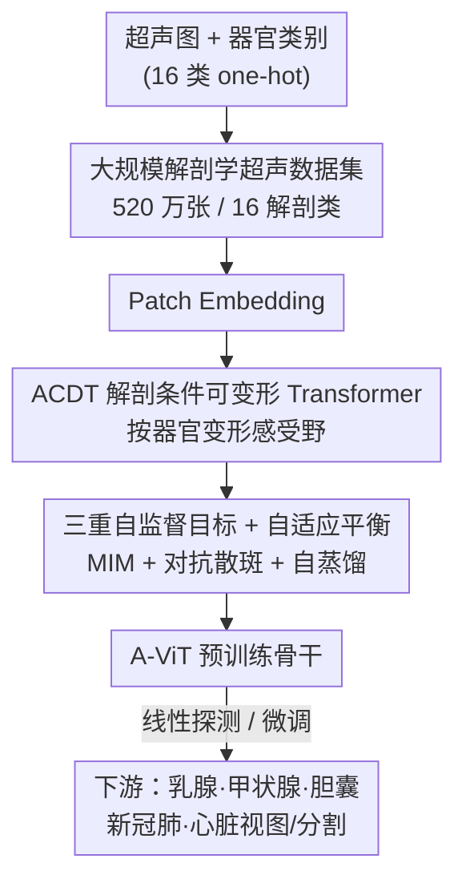

# Anatomy-aware Representation Learning for Medical Ultrasound

**会议**: ICLR2026  
**OpenReview**: [https://openreview.net/forum?id=5ThIWuDkEf](https://openreview.net/forum?id=5ThIWuDkEf)  
**代码**: 待确认  
**领域**: 医学图像 / 自监督学习 / 超声  
**关键词**: 医学超声、自监督表示学习、解剖感知、可变形 Transformer、散斑保留

## 一句话总结
针对医学超声「散斑纹理重、灰度色彩单一、特征因器官而异」三大特性，本文构建了一个 520 万张图的大规模超声数据集，并提出解剖感知的 A-ViT（核心是「解剖条件可变形 Transformer」ACDT）配合「掩码重建 + 对抗 + 自蒸馏」三重自监督目标，在乳腺/甲状腺/胆囊/新冠肺/心脏等多种超声诊断任务上显著超过通用与医学领域的 SSL 基线。

## 研究背景与动机
**领域现状**：医学超声（US）便宜、实时、无电离辐射，是乳腺、甲状腺、胆囊、心脏、肺等多种疾病早筛的首选影像。与此同时，自监督表示学习（SSL）在自然图像上已被证明能在无标注数据上学到通用特征，DINO、MAE 等预训练模型迁移到下游任务后即使标注很少也能稳健工作，这让人自然想到把 SSL 搬到超声上做「超声基础模型」。

**现有痛点**：直接把自然图像（NI）上预训练的 SSL 模型搬到超声任务上，效果很差。作者用 PCA 可视化（Fig.1b）说明，DINOv3 这类 NI 模型在超声上提取的特征杂乱、判别性差。根本原因是超声和自然图像在底层属性上差异巨大——超声充满**散斑噪声**（声波与组织相互作用产生的颗粒状纹理），而散斑在自然图像里几乎不存在；超声基本是**灰度图、像素强度变化范围窄**，NI 模型却高度依赖丰富的色彩信息；更关键的是超声的**诊断特征强烈依赖被成像的器官**，心脏超声看的是全局分布的腔室结构，乳腺超声看的是局部聚集的病灶，这种「同一模态、不同器官特征分布完全不同」的异质性是自然图像里没有的。

**核心矛盾**：超声本身数据稀缺（公开乳腺/甲状腺超声数据集往往不足千张，且受设备、探头、采集手法影响，域偏移严重），用 NI 预训练又因为属性鸿沟救不了场；而已有「解剖感知」的医学 SSL 工作（胎儿超声等）大多只针对**单一解剖域**设计，没法覆盖超声真实临床里十几种器官的异质性。

**本文目标**：（1）凑出足够大、足够多样、覆盖多器官的超声预训练数据；（2）设计一个能**按器官自适应**调整特征提取的 SSL 框架，让表示学习对每种解剖结构都「因地制宜」；（3）让学到的表示能跨多种超声诊断任务通用。

**核心 idea**：把「被成像的器官」作为显式条件注入到 Transformer 的特征提取里——用解剖类别 one-hot 条件化一个可变形卷积，让感受野随器官自适应变形，再叠加专门保留高频散斑的训练目标，从而学到解剖特异、且对超声忠实的表示。

## 方法详解

### 整体框架
ARL（Anatomy-aware Representation Learning）的输入是一张空间超声图像加上它所属器官的解剖类别（16 类之一的 one-hot），输出是一个解剖感知的骨干网络 A-ViT，可被冻结做线性探测、也可微调用于下游分类/分割。整条流水线分三段：先把超声图做标准 patch embedding 切成 token；再送进一串 ACDT 块——这里把器官类别编码成解剖上下文向量并加到 patch 上，驱动一个**可变形卷积**根据器官调整采样位置，再用可变形注意力把解剖条件特征融回主干；整个网络用「掩码图像重建 + 对抗 + 自蒸馏」三重自监督目标联合训练，其中对抗项专门负责把超声特有的高频散斑保住。训练完成后，A-ViT 作为预训练骨干迁移到乳腺、甲状腺、胆囊、新冠肺、心脏视图分类与心脏分割等任务。

### 关键设计

**1. 大规模解剖学超声数据集：先把「数据稀缺」这道坎填平**

SSL 的前提是大规模数据，但超声恰恰最缺数据，这是别人搬 NI 模型的根本原因。作者直接构建了目前最大规模之一的医学超声数据集：约 **520 万张**图像，来自 11 个公开数据集加美国 12 家、韩国 2 家、印度 1 家医疗机构，覆盖 **16 个解剖类别**，包含线阵、凸阵、扇形阵三类探头，像素分辨率从 $64\times64$ 到 $1280\times960$（高宽均值约 $503\times656$），成像深度最深达 24 cm。这份跨地域、跨设备、跨采集条件的多样性既是后续解剖感知学习的「燃料」，也天然缓解了超声最头疼的域偏移问题——预训练时就见过足够杂的分布，下游换个医院的数据也不至于崩。16 类解剖标签还直接成为后面 ACDT 的条件输入来源。

**2. ACDT 解剖条件可变形 Transformer：让感受野随器官「变形」**

这是全文的核心创新，针对的是「诊断特征的空间分布强烈依赖器官」这一痛点。心脏超声的判别信息是全局分布的腔室，乳腺超声则是局部聚集的病灶，用固定感受野的标准卷积/注意力无法同时照顾两类极端。ACDT 的做法是把解剖类别显式条件化进可变形卷积：先把展平的 patch embedding $x_f$ 重排成二维空间块 $x_P$，把 16 类解剖 one-hot 经嵌入层投影成解剖上下文向量 $AC$，加到 patch 上得到 $x_{P,AC}=x_P+AC$；再由它预测每个采样点的偏移 $\Delta p_k=g_\theta(x_{P,AC})$，可变形卷积按这些偏移采样

$$y_P(p)=\sum_{k=1}^{K} w_k\, S\big(x_P,\, p+\Delta p_k\big)$$

其中 $S(\cdot,\cdot)$ 是双线性采样。这样一来，偏移由器官条件决定，感受野就会随解剖结构自适应伸缩——心脏样本采样点铺得开抓全局，乳腺样本收得紧抓局部。随后再把解剖条件特征 $y_P$ 作为 key/value、原始 patch $x_P$ 作为 query 做一次可变形注意力

$$\text{DeformAttn}(x_P,y_P)=\mathrm{Softmax}\!\left(\frac{(x_P W^Q)(y_P W^K)^\top}{\sqrt{d_k}}\right)(y_P W^V)$$

接 FFN、残差、归一化构成一个 ACDT 块，堆叠多块即得到 A-ViT。和那些只服务单一器官的解剖感知 SSL 不同，这里用一个统一条件机制覆盖了十几种器官的异质性。

**3. 三重自监督目标 + 梯度自适应平衡：把超声特有的高频散斑学进去**

光有架构还不够，训练目标也得为超声量身定做。作者组合了三个互补目标。第一项是掩码图像建模（MIM），随机遮住部分 patch 让模型重建，记掩码索引集为 $\Omega$，损失为

$$L_{\text{MIM}}=\frac{1}{|\Omega|}\sum_{i\in\Omega}\lVert x_i-\hat{x}_i\rVert_2^2$$

但纯 $\ell_2$ 重建会把超声里诊断价值很高的高频散斑（如肿瘤恶性度、心功能评估都要用到的散斑纹理）抹糊。于是第二项引入**对抗损失**：训练一个判别器 $D(\cdot)$ 去区分重建 patch 与真实超声 patch，生成侧目标 $L_{\text{adv}}^{(G)}=-\mathbb{E}_{\hat{x}}[\log D(\hat{x})]$，逼着重建结果保留细粒度散斑。第三项是受 DINO 启发的**自蒸馏**，弥补前两项只擅长局部重建、缺全局语义的缺陷，记学生/教师输出分布为 $z_s,z_t$，损失 $L_{\text{SD}}=-\sum_{i=1}^{N} z_t^{(i)}\log z_s^{(i)}$，跨增广视图强制一致性以学全局语义。三者合成时用一个**梯度自适应权重**避免手调，

$$L=L_{\text{SD}}+\big(L_{\text{MIM}}+\lambda L_{\text{adv}}^{(G)}\big),\qquad \lambda=\frac{\lVert\nabla L_{\text{MIM}}\rVert}{\lVert\nabla L_{\text{adv}}^{(G)}\rVert+\varepsilon}$$

即按两项梯度幅值之比动态平衡重建与对抗，让对抗项始终和重建项处在同一量级、训练更稳。

### 损失函数 / 训练策略
最终目标即上式 $L=L_{\text{SD}}+(L_{\text{MIM}}+\lambda L_{\text{adv}}^{(G)})$，其中 $\lambda$ 由梯度幅值比自适应给出，无需手动调权。下游评测遵循 SSL 标准做法：要么在冻结骨干上训一个线性分类器（线性探测），要么端到端微调整个骨干；分割任务则接 UPerNet 解码器再整体微调。所有对比方法统一用 ViT-B / patch 16 作骨干，A-ViT 配同样的深度、隐藏维度和注意力头数以保证算力可比。

## 实验关键数据

### 主实验
下游覆盖五类分类（乳腺癌、胆囊肿瘤、新冠肺、甲状腺癌、心脏视图）加一项心脏左室分割，对比对象包含通用 CV 的 MAE / MoCo v3 / iBOT / SigLIP2 / DINOv3、医学超声的 DMAE / USFM、以及多模态医学的 LVM-Med。乳腺癌分类（BUSI）结果如下：

| 设置 | 指标 | 本文 A-ViT | 代表性基线 |
|------|------|-----------|-----------|
| 线性探测 | Accuracy | **86.62** | MAE 77.64 / USFM 82.39 |
| 微调 | Accuracy | **93.66** | SigLIP2 89.34 / USFM 88.73 |
| 微调 | AUROC | **0.9742** | USFM 0.9376 / SigLIP2 0.9351 |

线性探测下 A-ViT 比 NI 模型 MAE 高出近 9 个点，印证「NI 表示抓不住超声的高频散斑」；微调后进一步把准确率推到 93.66%、AUROC 0.9742，全面压过专门的超声基础模型 USFM。跨任务的综合对比里 A-ViT 也在每一项都拿到最佳：

| 任务 | 指标 | 本文 | 最强基线 |
|------|------|------|----------|
| 心脏分割 | Dice / mIoU | **92.16 / 85.67** | USFM 91.13 / 84.15 |
| 心脏视图分类 | Top-1 | **91.80** | MoCo v3 91.08 |
| 甲状腺癌 | Acc / AUROC | **87.07 / 0.9475** | Dino v3 86.24 / 0.9428 |
| 新冠肺 | Acc / AUROC | **91.44 / 0.9714** | USFM 87.67 / 0.9475 |
| 胆囊肿瘤 | Acc / AUROC | **89.89 / 0.9511** | USFM 86.64 / 0.9347 |

### 消融实验
乳腺癌分类上的逐项消融（Table 3）清晰拆开了各组件贡献：

| 配置 | 数据 | Accuracy | 说明 |
|------|------|----------|------|
| 仅 MIM | 自然图像 | 83.09 | NI 预训练基线 |
| 仅 MIM | 超声 | 89.43 (+6.34) | 换成超声域预训练 |
| + ACDT | 超声 | 92.25 (+2.82) | 加解剖条件可变形 |
| + 对抗 | 超声 | 92.95 (+0.70) | 保住高频散斑 |
| + 自蒸馏 | 超声 | 93.66 (+0.71) | 补全局语义 |

### 关键发现
- **域对齐贡献最大**：仅把预训练数据从自然图像换成超声（其余不变），准确率就从 83.09 跳到 89.43（+6.34），说明超声与自然图像的属性鸿沟是首要瓶颈，数据域比花哨结构更关键。
- **ACDT 是结构层面的最大增益**：在已对齐域之上加 ACDT 再涨 +2.82，证明解剖条件可变形注意力确实在「按器官细化特征」。
- **对抗与自蒸馏各补一块短板**：对抗项（+0.70）针对乳腺钙化等高频诊断线索，自蒸馏（+0.71）强化全局语义，二者增益相近且互补。
- **小数据鲁棒性强**：在心脏视图分类上把训练集压到原始 1%（约 0.4K 张）时，A-ViT 仍以明显优势超过最强基线，体现解剖感知预训练在低资源临床场景的价值。

## 亮点与洞察
- **把「器官」当成一等条件变量**：以往解剖感知 SSL 都只服务单一器官，本文用 16 类 one-hot + 可变形卷积偏移，让一个模型同时照顾全局型（心脏）和局部型（乳腺）特征分布，是「条件化感受野」思路在医学影像里的漂亮落地。
- **对抗损失用得很对症**：超声散斑既是噪声又是诊断信号，纯 $\ell_2$ 重建会抹掉它，用 GAN 判别器逼模型保高频，是针对模态物理特性的设计，可迁移到任何「高频纹理即信号」的影像（如某些病理、雷达图）。
- **梯度幅值自适应平衡多目标**：$\lambda$ 由两项梯度范数之比自动给出，省掉了多损失联调里最烦的权重网格搜索，这个 trick 对任何「重建 + 对抗」组合都通用。
- **数据工程本身就是贡献**：520 万张、16 解剖类、跨三大洲设备的数据集，是这套方法能 work 的真正底座，也提醒做医学基础模型「数据规模与多样性」往往比结构创新更决定上限。

## 局限与展望
- **依赖准确的解剖类别标签**：ACDT 的条件输入是器官 one-hot，推理时需要知道图像属于哪个器官；若部位标注缺失或错误，自适应偏移可能反受其害，论文未讨论标签噪声/未知器官的鲁棒性。
- **解剖类别固定为 16 类**：超出这 16 类的新器官如何零样本泛化、能否平滑扩展，文中未给方案。
- **数据集与部分下游集未公开**：甲状腺、心脏视图数据为自建且未开源，复现完整结果有门槛；公开数据集（如 BUSI 仅 655 张）规模偏小，部分任务的统计显著性需谨慎看待。
- **跨任务横向比较有 caveat**：不同下游任务难度、数据量差异极大（从 655 到近 4 万），各表内的「最佳」不宜直接跨任务比大小。
- **改进方向**：可探索把硬性 one-hot 条件换成软解剖嵌入或自动器官识别，做到推理端免标签；并验证在更多探头/疾病上的开放集泛化。

## 相关工作与启发
- **vs MAE / DINOv3（NI 自监督）**：它们在自然图像上学通用表示，迁移到超声时因散斑/灰度/解剖异质三重鸿沟而退化；本文在超声域预训练并显式注入解剖条件，正是补上这三块短板，乳腺线性探测上比 MAE 高约 9 个点。
- **vs USFM / DMAE（超声/医学专用 SSL）**：它们也在医学数据上预训练，但缺少「按器官自适应」的机制；本文用 ACDT 的解剖条件可变形注意力进一步细化器官特异特征，在乳腺、甲状腺、胆囊、新冠等任务上全面反超 USFM。
- **vs 胎儿超声等单器官解剖感知 SSL（Jiao 2020 / Fu 2022）**：它们把解剖先验绑死在单一域，无法覆盖临床真实的多器官异质性；本文用统一的 16 类条件机制把「一个模型管多器官」做了出来，这正是面向通用超声基础模型的关键一步。

## 评分
- 新颖性: ⭐⭐⭐⭐ 把解剖类别条件化进可变形 Transformer 覆盖多器官异质性，思路清晰且对症
- 实验充分度: ⭐⭐⭐⭐⭐ 六类下游任务 + 多基线 + 逐项消融 + 小数据鲁棒性，覆盖面足
- 写作质量: ⭐⭐⭐⭐ 动机—方法—实验链条完整，公式与图示到位
- 价值: ⭐⭐⭐⭐ 520 万图数据集 + 解剖感知 SSL，为超声基础模型提供了可用底座

<!-- RELATED:START -->

## 相关论文

- [\[ICLR 2026\] MedGMAE: Gaussian Masked Autoencoders for Medical Volumetric Representation Learning](medgmae_gaussian_masked_autoencoders_for_medical_volumetric_representation_learn.md)
- [\[ICLR 2026\] CortiLife: A Unified Framework for Cortical Representation Learning across the Lifespan](cortilife_a_unified_framework_for_cortical_representation_learning_across_the_li.md)
- [\[CVPR 2026\] Ultrasound-CLIP: Semantic-Aware Contrastive Pre-training for Ultrasound Image-Text Understanding](../../CVPR2026/medical_imaging/ultrasound-clip_semantic-aware_contrastive_pre-training_for_ultrasound_image-tex.md)
- [\[ICML 2026\] Which Anatomy Matters Under Limited Labels? A Data-Efficient Anatomy-Aware Benchmark for Cardiac Pathology Prediction](../../ICML2026/medical_imaging/which_anatomy_matters_under_limited_labels_a_data-efficient_anatomy-aware_benchm.md)
- [\[AAAI 2026\] Multivariate Gaussian Representation Learning for Medical Action Evaluation](../../AAAI2026/medical_imaging/multivariate_gaussian_representation_learning_for_medical_action_evaluation.md)

<!-- RELATED:END -->
