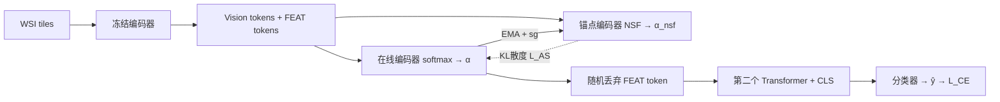

# ASMIL: Attention-Stabilized Multiple Instance Learning for Whole-Slide Imaging

**会议**: ICLR 2026  
**OpenReview**: [https://openreview.net/forum?id=CYmjrbQRyM](https://openreview.net/forum?id=CYmjrbQRyM)  
**代码**: [https://github.com/Linfeng-Ye/ASMIL](https://github.com/Linfeng-Ye/ASMIL)  
**领域**: 医学图像 / 计算病理 / 多示例学习  
**关键词**: 全切片图像、多示例学习、注意力稳定、锚点模型、EMA、归一化 Sigmoid  

## 一句话总结
本文首次识别出注意力 MIL 在全切片图像（WSI）训练中的"注意力动态不稳定"失败模式，提出 ASMIL：用 EMA 锚点模型蒸馏稳定注意力、用归一化 sigmoid 抑制注意力过度集中、用 token 随机丢弃缓解过拟合，三招合一在多个病理数据集上把 F1 提升最高 6.49%。

## 研究背景与动机

**领域现状**：全切片图像是吉像素级的病理大图，肿瘤区往往只占切片极小一部分，且像素级标注不现实，因此只能用切片级弱标签做多示例学习（MIL）。基于注意力的 MIL（ABMIL、TransMIL 等）把每个 tile 当成一个示例、用注意力加权聚合成 bag-level 表示，既是 WSI 分型的事实标准，其注意力热图还被当作临床可解释性证据。

**现有痛点**：注意力 MIL 已知有两个老毛病——（PII）注意力过度集中，模型把权重几乎全压在少数几个 tile 上，损害泛化与可解释性；（PIII）过拟合，因为 WSI 数据集每类往往只有几百张切片、tile 高度冗余。本文在四种代表性注意力 MIL、两个公开数据集上做实验，发现了第三个、且此前从未被报道的失败模式。

**核心矛盾**：（PI）注意力动态不稳定——对同一张 WSI，注意力分布在不同 epoch 间剧烈震荡而非收敛到稳定模式。作者用相邻 epoch 注意力分布间的 Jensen-Shannon 散度量化，发现 TransMIL 等的 JSD 持续大幅波动，对应更高的交叉熵和更差的性能。注意力不收敛意味着模型每个 epoch 关注的组织区域都在变，既掉点又破坏可解释性。

**本文目标**：用一个统一框架同时解决 PI、PII、PIII 三个问题。

**核心 idea**：引入一个与在线模型同构、但用 EMA 更新（不走反传）的**锚点模型**作为稳定参考——在线注意力去对齐锚点注意力即可获得稳定性；锚点分支用**归一化 sigmoid** 取代 softmax 来天然抑制过度集中；再叠加 **token 随机丢弃**做正则。

## 方法详解

### 整体框架
每张 WSI 切成 tile、经冻结的预训练编码器变成 vision token，与可训练的 FEAT token 一起送入在线编码器和锚点编码器两个分支。在线分支用 softmax 得注意力 α，锚点分支用归一化 sigmoid 得 α^nsf，两者间的 KL 散度作为稳定化损失 $L_{AS}$ 把在线注意力拉向锚点。锚点用 stop-gradient + EMA 从在线模型更新，不走反传。训练时对 FEAT token 随机丢弃一部分，剩余 token 加 [CLS] token 送入第二个 transformer 得到 bag 表示并分类。总损失 $L = L_{CE} + \beta L_{AS}$，推理时只用在线模型、丢弃锚点，因此不增加推理开销。

### 关键设计

**1. EMA 锚点模型稳定注意力：用"数据相关的功能正则"替代标量惩罚。** 针对 PI，作者复制在线模型的注意力模块作为锚点，参数按 $\theta'_t \leftarrow m\theta'_{t-1} + (1-m)\theta_t$ 做指数滑动平均更新，输入与在线模型相同但只读不反传。由于 EMA 天然平滑了参数的高频抖动，锚点给出的注意力分布比在线分支更稳更一致，于是把在线注意力 α 往锚点分布拉就能传递这种稳定性。作者特别论证为什么要用锚点而非熵/ℓ2/温度这类标量惩罚：标量惩罚是内容无关的、只作用于当前 batch，编码不了示例间的关系结构；而 EMA 锚点给出的是条件于整个 bag 的、数据相关的目标分布，让在线注意力贴近它相当于做了一种能捕捉 inter-instance 关系的功能正则，这是标量正则做不到的。

**2. 锚点分支用归一化 sigmoid（NSF）抑制过度集中：可证明的"选择性展平"。** 针对 PII，作者把过度集中归因于 softmax 的指数特性——少数 token 的分数经指数放大后会吞掉其余 token 的权重。NSF 定义为 $\alpha^{nsf}_i(z) = \sigma(z_i) / \sum_j \sigma(z_j)$，其中 $\sigma$ 是 sigmoid。由于 sigmoid 对大正值饱和到 1、对负值压向 0，NSF 能把真正有信息的"高分" token 拉平到接近相等、同时把"低分" token 压到很小。论文用 Theorem 1 给出严格界：对高分集合内任意两 token，其 NSF 权重比 $\le 1 + e^{-\tau}$（随阈值 τ 增大趋于 1），低分 token 权重 $\le e^{-\tau}/h$；并证明 softmax 用单一温度无法同时满足"压制低分"和"展平高分"两个目标（两个温度约束在 $\frac{\gamma}{\log\kappa} > \frac{2\tau}{\log(h/\varepsilon)}$ 时不可兼得）。关键细节：NSF 不能直接用在在线模型上——会导致梯度消失而掉点（在线模型靠 softmax 学习），所以 NSF 只放在锚点分支当稳定先验，通过 KL 间接引导在线模型。该 KL 对在线分数 $z_i$ 的梯度极简洁：$\frac{\partial KL(\alpha^{nsf}\|\alpha)}{\partial z_i} = \alpha_i - \alpha^{nsf}_i$，即梯度下降直接把在线注意力推向锚点分布。

**3. FEAT token 随机丢弃缓解过拟合：专为 ASMIL 设计的 token 级正则。** 针对 PIII，作者把 N 个可训练 FEAT token（$N \ll M$，M 为 tile 数，相当于通过 token reduction 做信息聚合）在训练时按 Bernoulli 掩码以比例 $B \in [0,1)$ 随机丢弃，保留集大小 $\tilde{N} \sim \text{Binomial}(N, 1-B)$；推理时不丢（B=0）保留全部内容。这种随机移除阻止 FEAT token 之间的协同适应、防止模型过度依赖某几个 token，消融显示 B≈0.5 附近性能峰值最稳。值得注意的是，由于 ASMIL 的注意力对齐假设在线/锚点 token 间一一对应，像 MIL-Dropout 那类通用实例丢弃方法无法直接套用，所以作者专门设计了这套作用在可训练 token 上的丢弃方案。

## 实验关键数据

数据集：CAMELYON-16 / CAMELYON-17 / BRACS 三个公开 WSI 分型数据集；两种特征 backbone（ImageNet 预训练 ResNet-18、域内 SSL 预训练 ViT-S）；对比 11 个注意力 MIL 基线。

### 主实验表格（ViT-S SSL backbone，F1 / AUC）

| 方法 | CAM-16 F1 | CAM-17 F1 | BRACS F1 | BRACS AUC |
|------|-----------|-----------|----------|-----------|
| ABMIL (ICML18) | 0.914 | 0.522 | 0.680 | 0.866 |
| TransMIL (NeurIPS21) | 0.922 | 0.554 | 0.631 | 0.841 |
| DTFD-MIL (CVPR22) | 0.948 | 0.627 | 0.612 | 0.870 |
| ACMIL (ECCV24) | 0.954 | 0.562 | 0.722 | 0.888 |
| AEM (MICCAI25) | 0.947 | 0.647 | 0.742 | 0.905 |
| HDMIL (CVPR25) | 0.958 | 0.571 | 0.717 | 0.874 |
| **ASMIL (Ours)** | **0.965** | **0.689** | **0.781** | **0.914** |

ASMIL 在 ViT-SSL backbone 下全数据集 SOTA：BRACS F1 比次优高 3.9 个点、CAMELYON-17 F1 提升 6.49%（肿瘤稀疏、弱监督最难的场景增益最明显）；ResNet-18 特征下也与最强基线持平或更优。

### 消融实验表格

组件消融（BRACS）：

| Anchor | NSF | rd | F1 | AUC |
|--------|-----|-----|------|------|
| ✓ | ✓ | ✓ | **0.781** | **0.914** |
| ✓ | ✓ | ✗ | 0.765 | 0.903 |
| ✓ | ✗ | ✓ | 0.759 | 0.895 |
| ✓ | ✗ | ✗ | 0.747 | 0.887 |
| ✗ | ✗ | ✓ | 0.728 | 0.868 |
| ✗ | ✗ | ✗ | 0.712 | 0.860 |

三组件缺一不可，其中**锚点模型贡献最大**（从 0.712 加到 0.747）。

即插即用消融（Table 2）：把 Anchor + NSF 加到现有方法上一致涨点，ABMIL 在 BRACS 上 F1 增益最高达 **10.73%**；仅 DSMIL 在 CAMELYON-16 上加 anchor 时 F1 微降 0.001。

### 关键发现
- 注意力不稳定是真实且普遍的失败模式，JSD 持续震荡与高交叉熵相关；ASMIL 让注意力稳定收敛并一致高亮癌变区。
- 锚点 + NSF 是可迁移的通用插件，给老方法直接涨点。
- 定位任务（FROC / Dice / 切片级特异度）上 ASMIL 热图比基线更完整覆盖所有癌变区，归功于 NSF 减轻了过度集中。

## 亮点与洞察
- **发现新问题本身就是贡献**：首次系统识别并量化"注意力动态不稳定"，用 JSD 把一个模糊直觉变成可测指标，这类"指出大家都没注意到的失败模式"的工作往往启发力强。
- **EMA 锚点 + 注意力 KL 对齐**这一组合把自监督里的 teacher-student/动量编码器思想迁移到 MIL 注意力稳定上，且论证清楚它与 MHIM-MIL 的 EMA teacher 的本质差异（对齐注意力分布 vs 挖掘难样本）。
- **NSF 的理论刻画**：用一条定理证明"选择性展平"是 softmax 单温度做不到的，给"换激活函数"这种工程改动提供了扎实的数学理由。
- 锚点推理时丢弃，**零额外推理开销**，工程上很友好。

## 局限与展望
- 锚点 + NSF 假设在线/锚点 token 一一对应，导致通用实例丢弃（如 MIL-Dropout）无法直接整合，方法的正则手段被绑定到自家 token 设计上，灵活性受限。
- 引入了 EMA 因子 m、损失权重 β、FEAT token 数、丢弃率 B、锚点更新频率等多个超参，调参负担不轻（虽有消融但跨数据集稳健性需更多验证）。
- DSMIL 上加 anchor 出现微降，说明该插件并非对所有架构都正收益，何时失效缺乏先验判据。
- 实验集中在三个相对小的病理数据集，向更大规模、多癌种 WSI 的泛化性仍待验证。

## 相关工作与启发
- **注意力 MIL 谱系**：ABMIL（可学习实例权重 + 热图）→ TransMIL（transformer 建模示例间关系）→ DSMIL（双流 max-pooling + 非局部注意力）→ CLAM（类特定注意力池化 + 实例聚类监督）。
- **对抗过度集中**：ACMIL 随机掩 top-K 实例、AEM 加熵正则展平注意力、CAMIL 用邻域约束抑噪——ASMIL 走了"换激活函数 + 锚点蒸馏"的不同路线。
- **对抗过拟合**：DTFD-MIL 拆 pseudo-bag、MHIM-MIL 用 EMA teacher 做难负挖掘、MIL-Dropout 随机移除 top-K 实例——ASMIL 的 token 丢弃与之互补。
- **启发**：把"训练动态稳定性"作为单独的优化目标，而非只盯最终精度，是一个值得在其他弱监督/小样本任务里复用的视角；EMA 参考分支 + 分布对齐是稳定任何"会震荡的中间表示"的通用模板。

## 评分
- **新颖性**: ⭐⭐⭐⭐ 首次识别并量化注意力不稳定这一新失败模式，锚点 + NSF + token 丢弃的组合有清晰动机和理论支撑，虽单个组件都有渊源但整合与问题定义新颖。
- **实验充分度**: ⭐⭐⭐⭐ 三数据集、两 backbone、11 基线、组件消融 + 即插即用消融 + 定位任务齐全，附录还覆盖生存预测和非 WSI 数据；不足是数据集规模偏小。
- **写作质量**: ⭐⭐⭐⭐ 问题（PI/PII/PIII）分类清晰，Theorem 1 论证严谨，图示直观，方法与动机一一对应。
- **价值**: ⭐⭐⭐⭐ 锚点 + NSF 作为可迁移插件给现有方法直接涨点（最高 +10.73%），且零推理开销，对计算病理社区实用价值高。

<!-- RELATED:START -->

## 相关论文

- [\[CVPR 2026\] Contrastive Cross-Bag Augmentation for Multiple Instance Learning-based Whole Slide Image Classification](../../CVPR2026/medical_imaging/contrastive_cross-bag_augmentation_for_multiple_instance_learning-based_whole_sl.md)
- [\[CVPR 2026\] Universal-to-Specific: Dynamic Knowledge-Guided Multiple Instance Learning for Few-Shot Whole Slide Image Classification](../../CVPR2026/medical_imaging/universal-to-specific_dynamic_knowledge-guided_multiple_instance_learning_for_fe.md)
- [\[ICLR 2026\] Mixture of Mini Experts: Overcoming the Linear Layer Bottleneck in Multiple Instance Learning](mixture_of_mini_experts_overcoming_the_linear_layer_bottleneck_in_multiple_insta.md)
- [\[CVPR 2026\] TopoSlide: Topologically-Informed Histopathology Whole Slide Image Representation Learning](../../CVPR2026/medical_imaging/toposlide_topologically-informed_histopathology_whole_slide_image_representation.md)
- [\[AAAI 2026\] Towards Effective and Efficient Context-aware Nucleus Detection in Histopathology Whole Slide Images](../../AAAI2026/medical_imaging/towards_effective_and_efficient_context-aware_nucleus_detection_in_histopatholog.md)

<!-- RELATED:END -->
