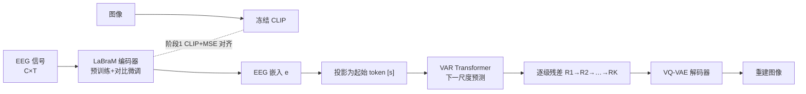

# Autoregressive Visual Decoding from EEG Signals

**会议**: ICLR 2026  
**OpenReview**: [https://openreview.net/forum?id=TKjfzuVLX4](https://openreview.net/forum?id=TKjfzuVLX4)  
**代码**: [https://github.com/ddicee/avde](https://github.com/ddicee/avde)  
**领域**: 脑机接口 / EEG 视觉解码 / 自回归图像生成  
**关键词**: EEG-to-Image, 视觉解码, LaBraM, 下一尺度预测(VAR), 对比学习, 脑机接口  

## 一句话总结
AVDE 把"EEG 信号解码成图像"重写成一个**两阶段、自回归**的轻量流程：先用预训练 EEG 大模型 LaBraM 配合对比学习把脑电对齐到 CLIP 图像空间，再用 VAR 的"下一尺度预测"从 EEG 嵌入出发逐级生成图像，只用 10% 的参数就在检索和重建两项任务上超过了此前依赖大扩散模型的 SOTA。

## 研究背景与动机
- **领域现状**: 从非侵入式脑信号解码视觉内容是认知科学与生成式 AI 的交叉前沿。fMRI 解码精度高但慢、贵、设备受限；EEG 因毫秒级时间分辨率、便携、低成本成为更可部署的替代品，近期工作（ATM、NICE 等）已在图像检索和重建上展现潜力。
- **现有痛点**: 主流 EEG 视觉解码沿用 unCLIP 范式——EEG 编码器 → 扩散先验 → Stable Diffusion 的**多阶段流水线**（图 1 是五阶段）。三个硬伤：① 串行多阶段会**逐级累积误差**，损害重建保真度；② EEG 编码器多是**从零训练**，少量图文对难以从高噪声脑电中抽到好特征；③ 扩散模型动辄 30 亿参数，**算力/显存开销**让实时 BCI 不现实。
- **核心矛盾**: EEG 是高噪声、低信息密度的一维时序信号，而图像是结构化的高维视觉内容，二者分布鸿沟巨大；要弥合它就得堆复杂多阶段管线，但管线越复杂越不可控、越不可部署——**保真度 vs 简洁可部署**难以两全。
- **本文目标**: 用一个直接、连贯、轻量的框架替代多阶段扩散管线，既保住 EEG 与图像之间的直接映射关系，又把参数和推理成本压到可实际部署的量级。
- **核心 idea**: **【迁移预训练 EEG 表示】** 用在 2000+ 小时脑电上预训练的 LaBraM 替代从零训练的编码器；**【自回归下一尺度预测替代扩散】** 借 VAR 框架把 EEG 嵌入当作图像的"最粗尺度"，用一个 transformer 由粗到细自回归生成，让生成过程天然对齐人脑由低级到高级的层级视觉感知。

## 方法详解

### 整体框架
AVDE 是清晰的**两阶段**流程。阶段一做"对齐"：用预训练 LaBraM 编码 EEG、冻结 CLIP 编码图像，靠对比+回归联合目标把脑电拉进图像表示空间，得到一个信息量充足的 EEG 嵌入。阶段二做"生成"：把这个 EEG 嵌入作为最粗尺度的起点 token `[s]`，喂给一个 decoder-only transformer，按"下一尺度预测"自回归地预测 VQ-VAE 多尺度残差图，由粗到细逐级累积成完整特征图，再由 VQ-VAE 解码器还原成图像。

### 关键设计
**1. 用预训练 LaBraM 取代从零训练的 EEG 编码器：把脑电特征抽取站在巨人肩上。** EEG 视觉解码长期受制于"图文对太少、信号太噪"，编码器从零训练很难收敛到好特征。AVDE 改用 LaBraM——一个在 2000+ 小时、跨多数据集多采集条件的脑电上预训练的模型。它的编码流程是：把 $X \in \mathbb{R}^{C\times T}$（通道×时间）在时间维按非重叠窗口 $w$ 切 patch，经卷积块（1D 卷积+组归一化+GELU）抽局部时序特征 $e_{c_j,k}\in\mathbb{R}^d$，再加上可训练的时间嵌入 $te_k$ 与空间嵌入 $se_j$ 注入时空上下文，最后用 Transformer 编码器整合整段 EEG 的跨时间、跨通道依赖。这种迁移学习让编码器在跨被试时也能泛化、抽到语义有意义的特征，是后续生成质量的根基。

**2. 对比+回归联合对齐：既要结构对齐又要点对点精度。** LaBraM 原本主要在临床脑电上预训练，并非针对视觉刺激响应，所以要微调到图像空间。给定配对 EEG-图像，LaBraM 编 EEG 得 $e$、冻结 CLIP 编图像得 $z$，用双向对比损失把对应对拉近、非对应对推远：$L_{CLIP} = -\frac{1}{B}\sum_i \big(\log\frac{\exp(s(e_i,z_i)/\tau)}{\sum_j \exp(s(e_i,z_j)/\tau)} + \log\frac{\exp(s(e_i,z_i)/\tau)}{\sum_k \exp(s(e_k,z_i)/\tau)}\big)$，其中 $s$ 是余弦相似度、$\tau$ 是可学习温度。但纯对比只管"相对排序"不管"绝对位置"，于是再叠一个直接回归项：$L_{Combined} = \lambda L_{CLIP} + (1-\lambda) L_{MSE}$（$\lambda=0.8$）。对比负责把脑电结构性地放进图像流形，MSE 负责点对点把它钉到对应图像嵌入附近，二者合起来训练更稳、映射更准。

**3. 下一尺度预测的自回归生成：用 VAR 把"由粗到细"做成天然的脑视觉隐喻。** 抛弃多阶段扩散，AVDE 借 VAR 思路：预训练 VQ-VAE 把图像量化成 $K$ 个分辨率递增的多尺度残差图 $(R_1,\dots,R_K)$，累积上采样即可逐级重建特征图 $F_k = \sum_{i=1}^k \mathrm{up}(R_i,(h,w))$。一个 decoder-only transformer 以 EEG 嵌入 $e$ 为条件自回归预测这些残差：$p(R_1,\dots,R_K)=\prod_{k=1}^K p(R_k\mid R_1,\dots,R_{k-1},e)$。具体地，$e$ 先投影成起始 token `[s]` 启动生成，每个尺度 $k$ 用上一累积图的下采样版 $\tilde F_{k-1}=\mathrm{down}(F_{k-1},(h_k,w_k))$ 作输入；训练用 block-wise 因果注意力掩码保证只看合法上下文、用交叉熵监督；推理则从 EEG 嵌入起逐级自回归到最高分辨率，再交给 VQ-VAE 解码器出图。关键在于：EEG 嵌入就是图像"最粗的那一层"，整条生成链与脑电输入**直接相连**、误差不再跨阶段累积，而由粗到细的过程恰好镜像了人脑从 V1（边缘/色彩）→ V2/V4（轮廓/结构）→ IT（整体物体）的层级视觉感知。

## 实验关键数据
数据集：THINGS-EEG（10 被试、1654 概念训练 / 200 概念测试、RSVP 范式、63 通道）为主，EEG-ImageNet 为补充。任务：200-way 零样本检索 + 图像重建。

### 主实验表格（200-way 零样本检索，Top-1/Top-5 平均）

| 方法 | 被试内 Top-1 | 被试内 Top-5 | 跨被试 Top-1 | 跨被试 Top-5 |
|------|------|------|------|------|
| EEGNetV4 | 0.186 | 0.441 | 0.089 | 0.224 |
| NICE | 0.242 | 0.512 | 0.113 | 0.273 |
| ATM (Li et al. 2024) | 0.269 | 0.548 | 0.115 | 0.280 |
| **AVDE (Ours)** | **0.300** | **0.582** | **0.143** | **0.329** |

重建质量（Subject-08）：

| 方法 | PixCorr↑ | SSIM↑ | AlexNet(5)↑ | Inception↑ | CLIP↑ | SwAV↓ |
|------|------|------|------|------|------|------|
| Li et al. 2024 | 0.160 | 0.345 | 0.866 | 0.734 | 0.786 | 0.582 |
| CognitionCapturer | 0.175 | 0.366 | 0.610 | 0.721 | 0.744 | 0.577 |
| **AVDE** | **0.188** | **0.396** | **0.889** | **0.765** | **0.795** | **0.557** |

效率对比（单 A100，batch=1）：

| 方法 | Params(M) | FLOPs(G) | 推理时间(ms) | 显存(MB) |
|------|------|------|------|------|
| Li et al. 2024 | 3818.1 | 8738.6 | 310.4 | 4826.7 |
| **AVDE** | **425.3** | **1350.5** | **91.2** | **1809.6** |

### 消融实验表格（各被试平均重建指标）

| 配置 | PixCorr↑ | SSIM↑ | CLIP↑ | SwAV↓ |
|------|------|------|------|------|
| **LaBraM+VAR（完整）** | **0.147** | **0.366** | **0.747** | **0.586** |
| ATM+VAR（换编码器） | 0.141 | 0.351 | 0.731 | 0.601 |
| EEGNet+VAR（换编码器） | 0.132 | 0.323 | 0.712 | 0.627 |
| LaBraM+Li et al.（换 unCLIP） | 0.138 | 0.346 | 0.726 | 0.606 |
| LaBraM+LDM-4（换扩散） | 0.139 | 0.343 | 0.731 | 0.609 |
| LaBraM+DiT-XL/2（换扩散） | 0.143 | 0.354 | 0.735 | 0.594 |

### 关键发现
- **参数砍 90%、推理快 3.4 倍、显存省 2.7 倍**，同时检索/重建全面超 SOTA，证明轻量自回归路线对 BCI 实用性的价值。
- 消融显示**编码器和生成框架都重要**：换掉 LaBraM 或换回 unCLIP/扩散都会掉点，说明"预训练编码器 + 自回归生成"是协同的，不是单点贡献。
- **可解释性**：可视化 10 个累积尺度的中间重建，早期出边缘/色彩（V1）、中期出轮廓结构（V2/V4）、后期出语义完整物体（IT），生成过程与人脑层级视觉感知高度对应；区域-尺度相关性分析进一步支持这一对应。

## 亮点与洞察
- **把范式从"多阶段扩散"切到"单链自回归"**是最核心的洞察：EEG 嵌入直接当最粗尺度，让脑信号与图像在生成链上始终直连，从机制上消除了 unCLIP 流水线的跨阶段误差累积。
- **"下一尺度预测"与脑科学的契合不是事后包装**——由粗到细的层级生成天然对应 V1→V2/V4→IT 的视觉通路，让模型既高效又具备神经可解释性，对认知科学研究也有工具价值。
- **充分利用预训练大模型**（LaBraM + VAR 都用官方预训练权重初始化）是它能在小数据、高噪声场景做好的关键，给"EEG 数据稀缺"这一长期痛点提供了可复制的解法。

## 局限与展望
- 重建质量评测主要在检索最好的 Subject-08 上报告（沿用前人惯例），跨被试重建的绝对指标仍不高，**个体差异/跨被试泛化**仍是开放难题。
- 依赖 VQ-VAE 的多尺度离散 token 与 CLIP/CFG 等外部组件，**生成多样性与细节上限**受这些预训练模块约束；top-k=900、CFG=4.0 等也需调参。
- 论文聚焦 THINGS-EEG / EEG-ImageNet 的物体概念图像，对更复杂场景、动态视觉或真实 BCI 在线解码的适用性还需验证。

## 相关工作与启发
- **EEG 视觉解码（unCLIP 系）**：ATM、NICE、CognitionCapturer、GeoCap 等多走 EEG 编码器→扩散先验→Stable Diffusion 路线，AVDE 正是针对其多阶段、重算力的痛点做减法。
- **预训练脑电大模型**：LaBraM 提供跨数据集的通用 EEG 表示，是本文"迁移学习抽特征"的基石，呼应了视觉/语言领域用大规模预训练打底的趋势。
- **视觉自回归 VAR**：把 GPT 式"下一 token"换成"下一尺度"的图像生成范式，AVDE 把它从纯图像生成迁到条件化的脑信号解码，是 VAR 应用面的有趣扩展。
- **启发**：当一个任务被多阶段管线统治、误差累积又算力沉重时，回到"端到端单链 + 强预训练初始化"往往能同时拿到效果和效率；而选生成范式时，若能让生成过程的结构（如由粗到细）与领域先验（如脑视觉层级）对齐，可解释性几乎是免费赠送的。

## 评分
- **新颖性**: ⭐⭐⭐⭐ 首次把 VAR 的"下一尺度预测"用于 EEG 视觉解码，并用 EEG 嵌入充当最粗尺度，范式切换干净且与脑科学契合，思路新颖。
- **实验充分度**: ⭐⭐⭐⭐ 两数据集、检索+重建双任务、编码器/生成框架双重消融、效率与中间尺度可解释性分析齐全；扣分在跨被试重建绝对指标偏低、重建主报告集中在单一最佳被试。
- **写作质量**: ⭐⭐⭐⭐ 动机—方法—实验逻辑清晰，公式与图示到位，神经科学类比讲得有画面感。
- **价值**: ⭐⭐⭐⭐ 参数与推理成本大幅下降且效果更好，对可部署 BCI 有现实意义，并为 EEG 解码与脑视觉机制研究提供了高效可解释的新工具。

<!-- RELATED:START -->

## 相关论文

- [\[ICLR 2026\] A Cognitive Process-Inspired Architecture for Subject-Agnostic Brain Visual Decoding](a_cognitive_process-inspired_architecture_for_subject-agnostic_brain_visual_deco.md)
- [\[ICLR 2026\] Towards Interpretable Visual Decoding with Attention to Brain Representations](towards_interpretable_visual_decoding_with_attention_to_brain_representations.md)
- [\[NeurIPS 2025\] MEGState: Phoneme Decoding from Magnetoencephalography Signals](../../NeurIPS2025/medical_imaging/megstate_phoneme_decoding_from_magnetoencephalography_signals.md)
- [\[ICLR 2026\] SEED: Towards More Accurate Semantic Evaluation for Visual Brain Decoding](seed_towards_more_accurate_semantic_evaluation_for_visual_brain_decoding.md)
- [\[ICLR 2026\] HEEGNet: Hyperbolic Embeddings for EEG](heegnet_hyperbolic_embeddings_for_eeg.md)

<!-- RELATED:END -->
