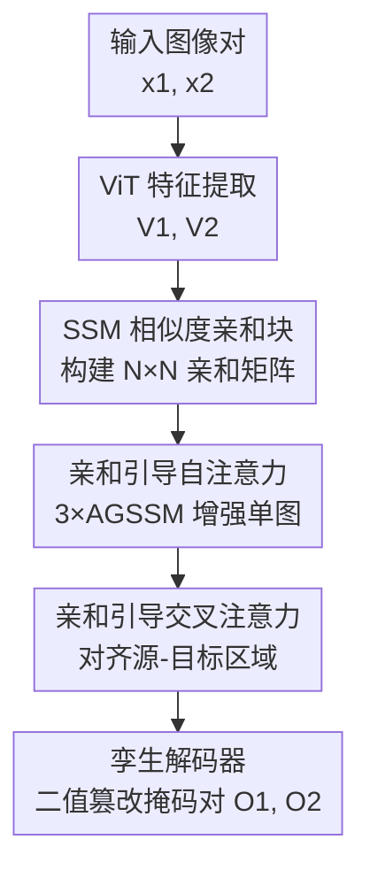

# BioTamperNet: Affinity-Guided State-Space Model Detecting Tampered Biomedical Images

**会议**: ICLR2026  
**OpenReview**: [https://openreview.net/forum?id=TB0Pdvxpm8](https://openreview.net/forum?id=TB0Pdvxpm8)  
**代码**: https://github.com/SoumyaroopNandi/BioTamperNet  
**领域**: 医学图像  
**关键词**: 生物医学图像取证, 重复区域检测, 状态空间模型, 亲和引导注意力, 孪生网络

## 一句话总结
BioTamperNet 用状态空间模型（SSM）近似出的"亲和引导注意力"搭起一个孪生网络，把生物医学论文里被篡改的重复区域（源区域和被复制的目标区域）一起定位出来，在 BioFors 真实撤稿论文数据集上把 MCC 从此前最好的 0.43 左右拉到 0.70，且只用 36.7M 参数、29.6 GFLOPs。

## 研究背景与动机
**领域现状**：科研图像造假（尤其是把同一块细胞、凝胶条带复制粘贴到别处）是学术不端和"可复现性危机"的重灾区，人工核查既慢又容易漏掉细微的复制。已有的图像取证模型（ManTra-Net、TruFor、SparseViT 等）几乎都在自然图像上训练，主攻的是"拼接（splicing）"留下的低层伪影。

**现有痛点**：生物医学图像和自然图像差异巨大——它显微镜、Western blot、FACS 散点图、宏观扫描四种模态各不相同，纹理高度重复、低对比、缺乏语义边界。在这种数据上，自然图像取证器要么把正常的重复结构（细胞团、凝胶条带）误判成篡改，要么只盯着低层噪声痕迹而抓不到"复制—粘贴"这种结构级操作。更要命的是，权威基准 BioFors 的训练集**只有干净图、没有任何带篡改标注的样本**，监督训练无从下手。

**核心矛盾**：篡改检测需要"找出两块在语义上高度相似但分布在不同位置的区域"，这本质是一个全局相似度匹配问题；可生物医学图里到处都是天然重复结构，朴素的相似度匹配会被这些重复结构淹没，而且 ViT/CNN 在小数据、多模态切换下又容易过拟合甚至灾难性遗忘。

**本文目标**：(1) 在没有真实篡改训练样本的前提下，训练出能同时定位"源区域"和"目标区域"的检测器；(2) 用一个统一架构覆盖外部重复（EDD）、内部重复（IDD）、剪切/锐变（CSTD）三类任务；(3) 控制算力。

**切入角度**：作者注意到 SSM（Mamba / VMamba 那套选择性扫描）的"读出"公式 $y_k=\bar{C}h_k$ 在归一化后天然就是一种带全局上下文的相似度聚合，于是把它改造成显式的"亲和矩阵"来引导注意力，既得到全局匹配能力又保持线性复杂度。

**核心 idea**：用 SSM 近似出的"亲和图"去引导孪生网络的自注意力和交叉注意力，让模型显式地按"哪两块最像"去对齐源—目标重复区域，而不是靠低层伪影。

## 方法详解

### 整体框架
BioTamperNet 是一个**孪生（Siamese）架构**：输入一对图像 $x_1,x_2\in\mathbb{R}^{B\times H\times W\times3}$，输出一对二值篡改掩码 $O_1,O_2$，分别标出每张图里被复制的源区域和目标区域。整条流水线是「ViT 特征提取 → 孪生重复检测器（亲和块 + 亲和引导自注意力 + 亲和引导交叉注意力）→ 轻量解码器」。

先用一个在 BioFors 四类图上预训练的 ViT 抽出层次化特征 $V_1,V_2\in\mathbb{R}^{B\times N\times C}$（$N=H\times W$，$C=384$）。两路特征送进孪生重复检测器：先在每路内部用 SSM 算出"哪些位置互相像"的亲和图，用它引导**自注意力**强化单图内部的重复线索；再用**交叉注意力**让两张图互相对齐，把一张图的目标区域和另一张图的源区域勾连起来。最后两个共享结构的解码器把增强后的特征 $V_1',V_2'$ 各自解码成单通道概率图，双线性上采样回原分辨率。

### 关键设计

**1. SSM 相似度亲和块：把状态空间读出当成全局相似度算子**

这一块要解决的痛点是：生物医学图里天然重复结构太多，普通点积注意力会被自相关淹没，且 $N\times N$ 的全注意力又贵。作者先用选择性扫描 SSM 把空间 token 上下文化，再借 SSM 的读出公式构造亲和矩阵。具体地，把读出做归一化得到全局上下文相似度

$$y_k=\frac{\bar{C}h_k}{\bar{C}n_k}+\bar{D}v_k,\qquad h_k=\bar{A}h_{k-1}+\bar{B}v_k,\quad n_k=\sum_{j\le k}B_j$$

其中 $\bar{A}$ 把 $j\le k$ 的历史上下文聚合进来，分母 $\bar{C}n_k$ 保证注意力权重归一（和为 1）。为了稳定估计，对 $\bar{C}_k,\bar{B}_k$ 用 ELU 加正偏移 $\mathrm{ELU}(V_k)+1$，再注入旋转位置编码 RoPE 并归一化，最后用点积得到显式亲和矩阵 $\mathit{Aff}_k=\bar{C}_k\bar{B}_k^\top\in\mathbb{R}^{B\times N\times N}$。

亲和矩阵的对角线天然偏大（每个位置和自己最像），作者引入一个**空间抑制核**把它压下去：

$$K(i,j,i',j')=\frac{(i-i')^2+(j-j')^2}{(i-i')^2+(j-j')^2+\sigma^2}$$

它对距离近的位置取小值、远的取接近 1，逐元素相乘 $\mathit{Aff}'_k=\mathit{Aff}_k\odot K$ 后就削弱了"自己对自己"的虚高相似。再用**双向 softmax**（行方向 $\mathit{Aff}^{row}$ 与列方向 $\mathit{Aff}^{col}$ 相乘，温度 $\alpha=5$）强制"互为最相似"才算数，最终经四层卷积细化得到亲和图，突出每个位置 top-k 最相似的区域。这样模型找的是结构级的"互相最像"，而不是低层噪声。

**2. 亲和引导自注意力（AGSSM）：让亲和图直接调制单图内部的注意力**

光有亲和矩阵还不够，要把它喂进注意力机制去真正增强特征。作者把亲和图展平成 $\mathit{Affinity\_Map}^{flat}_k\in\mathbb{R}^N$，送进 AGSSM 块：先经深度可分卷积 + 全连接得到门控 $a=\mathrm{SiLU}(\mathrm{FC}(\mathrm{Norm}(\cdot)))$，再用**线性注意力**（而非二次复杂度的 softmax 注意力）按亲和图加权，最后残差 + MLP。为了捕捉多样的局部交互，三个并行 AGSSM 块输出取平均

$$\mathrm{AGSSM\_Self\_Attn}_k=\frac{1}{3}\sum_{i=1}^{3}\mathrm{AGSSM}_i(\cdot)$$

再经 $1\times1$ 卷积投影、与原特征 $V_k$ 残差相加。它的有效性在于：自注意力的"该看哪里"完全由亲和图指挥，所以模型会主动聚焦到图内那些互相重复的区域（对应内部重复 IDD），而线性注意力保证整块开销很小（亲和计算只在 $40\times40$ 的 token 网格上做，全 $N\times N$ 操作只增加约 1.0 GFLOPs，不到总量 4%）。

**3. 亲和引导交叉注意力：把"源在 A、目标在 B"显式对齐起来**

外部重复（EDD）的核心是跨图匹配：图 1 里的某块是从图 2 复制来的。自注意力增强后，作者用多头交叉注意力让两路互相查询，$Q=\mathrm{Flatten}(\mathrm{Self\_Attn}_1)$、$K$ 来自另一路，更新

$$V_1'=\mathrm{Self\_Attn}_1+\mathrm{CrossAttn}(\mathrm{Self\_Attn}_1,\,\mathrm{Conv}_{1\times1}(\mathrm{Self\_Attn}_2))$$

注意力分数里加了一个由 AGSSM 相似度导出的**亲和引导项** $\Lambda$，即 $A=(W_QV_1)(W_KV_2)^\top+\Lambda$。论文给了一条 Proposition 1 作为理论支撑：若 patch $i$ 在另一图存在重复对应 $j$ 且满足间隔条件 $A_{ij}\ge A_{ik}+\delta$，则交叉注意力更新会被 $j$ 主导，满足界

$$\big\|V_1'(i)-(V_1(i)+W_VV_2(j))\big\|\le\epsilon,\quad \epsilon=\sum_{k\ne j}\alpha_{ik}\|W_VV_2(k)-W_VV_2(j)\|$$

直观说就是：亲和间隔 $\delta$ 越大，$\alpha_{ij}\ge e^{\delta}\alpha_{ik}$，softmax 越尖锐，更新越精准地把"目标区域"对齐到"源区域"上。这正是 BioTamperNet 区别于绝大多数取证器的地方——它能同时输出源和目标，而不只是标出一个可疑区域。

**4. 统一伪配对训练范式：在无篡改标注的数据上撑起三任务监督**

BioFors 训练集没有任何篡改样本，作者用合成把数据"造"出来：往干净图里插入复制 patch，配上几何增广（缩放、旋转、翻转、裁剪）和噪声扰动，再用 GAN 生成更逼真的重复 patch 并做融合，提升真实感。关键的统一技巧是：EDD 本来需要"图像对 + 一对掩码"，而 IDD/CSTD 只有单图单掩码；作者把每张 IDD/CSTD 图按重复掩码**切成两半，造出伪配对**，于是三类任务都能塞进同一个 EDD 风格的训练框架，单一架构无需改动即可通吃。跨模态部署时还用**域自适应批归一化**稳定学习，避免在显微镜→凝胶图迁移时灾难性遗忘（朴素微调源域 MCC 会掉 17.2%）。

### 损失函数 / 训练策略
训练目标是三个阶段二值交叉熵的加权和：

$$\mathcal{L}=w_{self}\mathcal{L}^{self}_{BCE}+w_{cross}\mathcal{L}^{cross}_{BCE}+w_{fused}\mathcal{L}^{fused}_{BCE}$$

即在自注意力输出、交叉注意力输出、融合输出三处都施加分割监督。编码器用 ImageNet-1k 预训练的 ViT-Base 初始化，AdamW（学习率 $1\times10^{-4}$），先在合成三元 patch 上预训练 74 epoch，再在 BioFors 上微调 100 epoch；配合早停和余弦学习率衰减。输入统一 resize 到 $224\times224$，特征层次从 $4096\times4096$ 降到 $40\times40$。

## 实验关键数据

### 主实验
在 BioFors（30,536 训练图、17,269 测试图，测试集来自真实撤稿论文）上，以 Matthews 相关系数 MCC 评估 EDD 与 IDD（image / pixel 两级）。下表为四模态合并（Combined）结果：

| 任务 | 指标 | BioTamperNet | 此前最好 | 提升 |
|------|------|------|----------|------|
| EDD Combined | Image MCC | **0.701** | MONet 0.438 | +0.263 |
| EDD Combined | Pixel MCC | **0.526** | MONet 0.410 | +0.116 |
| IDD Combined | Image MCC | **0.701** | SparseViT 0.343 | +0.358 |
| IDD Combined | Pixel MCC | **0.534** | DF-ZM 0.364 | +0.170 |

CSTD 任务上 BioTamperNet image/pixel MCC 为 0.514/0.346，远超 TruFor 的 0.173/0.092；在合成科研诚信基准上 pixel-level MCC 也领先：RSIID 0.965（SparseViT 0.842）、Western Blots 0.913（0.739）。

### 消融实验
EDD 上各模态 MCC（部分）：

| 配置 | Microscopy | Blot/Gel | Macroscopy | 说明 |
|------|-----------|----------|-----------|------|
| BioTamperNet (Full) | **0.487** | **0.589** | 0.577 | 完整模型 |
| w/o Affinity | 0.421 | 0.489 | 0.462 | 去掉亲和引导 |
| w/o SSM (CNN) | 0.393 | 0.453 | 0.437 | SSM 换 4 层 CNN，掉点最多 |
| w/o SSM (ViT-MHA) | 0.407 | 0.466 | 0.445 | SSM 换 4 层 ViT |
| w/o Self-Attn | 0.451 | 0.509 | 0.492 | 去自注意力 |
| w/o Cross-Attn | 0.444 | 0.497 | 0.481 | 去交叉注意力 |
| + Global SSM | 0.467 | 0.539 | 0.580 | 加全局 SSM 几乎无增益 |

### 关键发现
- **SSM 是最关键组件**：换成 CNN 后掉点最严重（如 Microscopy 0.487→0.393），说明 SSM 的全局上下文 + 小数据收敛能力是不可替代的；换成 ViT-MHA 也明显变差，印证 ViT 在数据稀疏场景收敛差。
- **亲和引导贡献第二大**：去掉后各模态普遍掉 0.06–0.10。自注意力、交叉注意力各去其一都会掉点，说明"图内找重复"和"跨图对齐"二者缺一不可。
- **全局建模无用**：再加一层 Global SSM 几乎没提升甚至略降，因为生物医学复制多是局部/小位移，长程推理用不上。
- **抗扰动鲁棒**：在亮度、JPEG 压缩、对比度、噪声扰动下始终领先。
- **轻量**：36.7M 参数、29.6 GFLOPs（512×512），比 TruFor（68.7M/236.5G）、SparseViT（50.3M/46.2G）都小，却更准。

## 亮点与洞察
- **把 SSM 读出公式"反用"成相似度算子**：$y_k=\bar{C}h_k/\bar{C}n_k$ 归一化后恰好是带全局上下文的注意力权重——这个观察让作者用线性复杂度拿到了全注意力级别的匹配能力，是全文最巧的一步，可迁移到任何需要全局相似度匹配的任务（检索、配准、共分割）。
- **同时输出源和目标**：绝大多数取证器只标"哪里被改了"，BioTamperNet 靠交叉注意力把"被复制的目标"和"原始的源"一起定位，对追溯造假来源更有用。
- **伪配对统一三任务**：把单图任务切半造伪配对、塞进 EDD 框架，是个低成本却很实用的工程技巧，省去为每个任务单独设计头部。
- **空间抑制核**这种"按距离压对角线"的简单设计，干净地解决了重复纹理导致的自相关虚高，思路可复用到任何重复结构密集的匹配场景。

## 局限与展望
- 作者自承三类失败模式：(i) 源—目标完全重叠时复制边界消失而漏检；(ii) 高度重复纹理/密集生物结构上的误报；(iii) 染色密集、CSTD 掩码很小的凝胶图边界对比度低。
- 提出的补救（重叠感知后处理、辅助边界头、循环一致性正则、熵驱动难负样本挖掘、染色不变增广等）尚停留在设想，未在正文给出验证。
- 评测局限于 BioFors 及两个合成基准，真实世界造假手法的多样性（如 AI 生成式篡改）覆盖有限；理论 Proposition 1 依赖"存在清晰间隔 $\delta$"的强假设，在边界模糊时未必成立。
- 展望：把模型扩展到视频级造假检测，引入时序注意力与时空一致性约束。

## 相关工作与启发
- **vs MONet（ICIP 2022）**：MONet 只能做 EDD 且表现与早期基线相当；BioTamperNet 统一覆盖 EDD/IDD/CSTD 且全面领先，关键差异是用 SSM 亲和而非纯 patch 比对。
- **vs TruFor / SparseViT（CVPR 2023 / AAAI 2025）**：它们基于 noiseprint / 低层伪影，擅长拼接检测，但在生物医学重复纹理上把正常结构误判成篡改；BioTamperNet 用结构级亲和匹配规避了这一点，且参数/算力更省。
- **vs ManTra-Net（CVPR 2019）**：ManTra-Net 抓低层操作痕迹、无上下文理解，难以识别连贯的复制模式；本文显式建模源—目标对应关系。
- **vs Mamba / VMamba**：本文不是直接用 SSM 做骨干分类，而是把 SSM 的读出改造成显式亲和图来引导注意力，属于 SSM 的一种非常规用法。

## 评分
- 新颖性: ⭐⭐⭐⭐⭐ 把 SSM 读出反用成亲和相似度算子、统一三任务并能同时定位源—目标，角度新颖
- 实验充分度: ⭐⭐⭐⭐ BioFors + 两合成基准 + 消融 + 鲁棒性 + 复杂度齐全，但失败模式的补救方案未验证
- 写作质量: ⭐⭐⭐⭐ 结构清晰、公式完整，部分符号（如 $\bar{B}$ 的泰勒近似）稍密
- 价值: ⭐⭐⭐⭐⭐ 科研诚信/打假是高价值且被忽视的场景，方法轻量、在真实撤稿数据上大幅领先

<!-- RELATED:START -->

## 相关论文

- [\[CVPR 2026\] GeoSemba: Reconstructing State Space Model for Cross Paradigm Representation in Medical Image Segmentation](../../CVPR2026/medical_imaging/geosemba_reconstructing_state_space_model_for_cross_paradigm_representation_in_m.md)
- [\[ICLR 2026\] Detecting Invariant Manifolds in ReLU-Based RNNs](detecting_invariant_manifolds_in_relu-based_rnns.md)
- [\[NeurIPS 2025\] DyG-Mamba: Continuous State Space Modeling on Dynamic Graphs](../../NeurIPS2025/medical_imaging/dyg-mamba_continuous_state_space_modeling_on_dynamic_graphs.md)
- [\[NeurIPS 2025\] Generalizable, Real-Time Neural Decoding with Hybrid State-Space Models](../../NeurIPS2025/medical_imaging/generalizable_real-time_neural_decoding_with_hybrid_state-space_models.md)
- [\[ICLR 2026\] Characterizing Human Semantic Navigation in Concept Production as Trajectories in Embedding Space](characterizing_human_semantic_navigation_in_concept_production_as_trajectories_i.md)

<!-- RELATED:END -->
