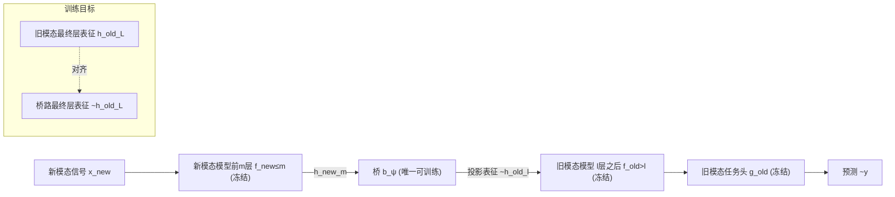

# BioX-Bridge: Model Bridging for Unsupervised Cross-Modal Knowledge Transfer across Biosignals

**会议**: ICLR 2026  
**OpenReview**: [https://openreview.net/forum?id=1448q0s3zZ](https://openreview.net/forum?id=1448q0s3zZ)  
**代码**: [https://github.com/chenqi-li/BioX-Bridge](https://github.com/chenqi-li/BioX-Bridge)  
**领域**: 生物信号 / 跨模态知识迁移 / 参数高效迁移  
**关键词**: biosignal, cross-modal transfer, model bridging, foundation model, ECG/EEG/PPG/EMG, low-rank, prototype network  

## 一句话总结
不再训练一个完整的学生模型去蒸馏，而是冻结两个生物信号基础模型、只训练一个轻量"桥接网络"把新模态的中间表征投影到旧模态的表征空间，从而以 1%~12% 的可训练参数实现 ECG↔EEG↔PPG↔EMG 之间的无监督跨模态知识迁移。

## 研究背景与动机
- **领域现状**：ECG、EEG、PPG、EMG 等生物信号各有功能、保真度、佩戴舒适度与成本上的差异，但又彼此相关（反映同一套生理状态），因此存在"用更便宜/更舒适的模态替代昂贵金标准模态完成同一任务"的空间（如用手表 PPG 替代 12 导联 ECG）。同时生物信号基础模型（LaBraM、HuBERT-ECG、PaPaGei、NormWear 等）正快速发展，单模态预训练后下游表现强。
- **现有痛点**：新模态往往缺少大规模标注数据。现有无监督跨模态迁移走两条路——**数据翻译**（把新模态原始信号 GAN 翻译成旧模态，但基本只在 PPG↔ECG 这一对上验证，难推广）和**知识蒸馏**（训一个完整学生模型去模仿教师）。蒸馏需要同时跑教师前向 + 学生前向 + 学生反传，显存/算力开销巨大；基础模型越做越大让这一问题雪上加霜。论文给的例子：把 PPG 基础模型 PaPaGei 蒸馏到 ECG-FM 学生模型、batch=8 就要 >32GB 显存。
- **核心矛盾**：基础模型蕴含的表征能力与任务知识很值钱，但"重新训一个全尺寸学生模型"既浪费这些现成知识，又在隐私/数据不可外传（须本地、低资源训练）场景下不可行。
- **本文目标**：在**不训练任何完整模型**的前提下，复用两个冻结基础模型的能力，把"旧模态模型的任务知识"迁移给"新模态输入"，且可训练参数尽量少。
- **核心 idea**：**【模型桥接 Model Bridging】**——把迁移问题重新表述为"在两个冻结模型的某两层之间架一座桥"。桥把新模态第 m 层的中间表征投影成旧模态第 l 层的表征，于是新模态数据可以"借道"旧模态模型的后半段 + 任务头直接出预测，只有桥需要训练。

## 方法详解

### 整体框架
给定：旧模态有标注数据 + 冻结的旧模态编码器 $f^{(old)}_\theta$ 与任务头 $g^{(old)}_\omega$；新模态只有无标注数据；以及一份**成对但无标注**的数据集 $D^{(pair)}=\{(x^{(old)}_i, x^{(new)}_i)\}$（同时采集的两模态信号）。目标是得到能在新模态上做预测的模型。BioX-Bridge 把新模态模型前 $m$ 层 $f^{(new)}_{\phi\le m}$、桥 $b_\psi$、旧模态模型 $l$ 层之后 $f^{(old)}_{\theta>l}$、任务头 $g^{(old)}_\omega$ 串成一条推理链：$\tilde{y}=g^{(old)}_\omega\circ f^{(old)}_{\theta>l}\circ b_\psi\circ f^{(new)}_{\phi\le m}(x^{(new)})$。整个流程分三步：先选桥的两端位置 $(m,l)$，再设计并训练桥 $b_\psi$，最后用桥做推理——**只有桥的参数 $\psi$ 需要更新**。

### 关键设计

**1. 模型桥接：把"训学生"换成"训一座桥"**，这是全文的范式转变。论文先证明一个直觉等式：只要桥能让 $\tilde{h}^{(old)}_l=h^{(old)}_l$（投影出的表征等于旧模态真实第 $l$ 层表征），那么经过冻结的后半段网络就有 $\tilde{h}^{(old)}_L=h^{(old)}_L$，最终 $\tilde{y}=\hat{y}$——桥路预测会与"旧模态模型在配对旧信号上的预测（即伪标签）"完全一致。于是迁移目标不是去拟合人工标注，而是去对齐两个冻结模型的中间表征。相比蒸馏要反传整个学生模型，这里冻结两个大模型、只让梯度流过桥，显存和算力都大幅下降，也天然把基础模型里的任务知识"原封不动"地复用。

**2. 两阶段桥位置选择：先选输入端 $m$，再选输出端 $l$**。桥可以架在 $L\times M$ 种层对组合上，暴力搜索最优位置太贵，而位置又是影响迁移效果最关键的因素之一。论文用一个解耦的两阶段策略：**输入端 $m$** 遵循"garbage in, garbage out"——要选新模态里对伪标签最有判别力的那层，做法是对每层中间表征做线性探针（linear probing），取对伪标签 $\hat{y}_i=g^{(old)}_\omega\circ f^{(old)}_\theta(x^{(old)}_i)$ 分类准确率最高的层，即 $\arg\min_m \frac{1}{|D^{(pair)}|}\sum_i L_{probe}(g_\eta(h^{(new)}_{m,i}),\hat{y}_i)$；**输出端 $l$** 则要让投影任务尽量容易——选旧模态里与已定 $m$ 层表征"最相似"的那层，用线性 CKA（Centered Kernel Alignment）度量，即 $\arg\max_l \text{CKA}_{linear}(H^{(new)}_m, H^{(old)}_l)$。两阶段都只需前向 + 一个轻量探针/相似度计算，开销随层数线性增长，远小于训练成本。消融显示该策略显著优于固定位置（BAcc 52.02 vs 固定平均 48.34）。

**3. 原型网络作为桥架构：低秩近似 + 可学习原型集，破解高维投影爆炸**。新旧模态表征维度天差地别，朴素做法是一个全秩线性层，但参数会爆炸——以 LaBraM→HuBERT-ECG 为例，$181\times200\times93\times512\approx1.7$ 十亿参数。桥用两个模块绕开它：**原型集** $P\in\mathbb{R}^{N_p\times d^{(old)}_l}$ 是一组可学习原型向量（用旧模态第 $l$ 层真实表征里随机抽 $N_p$ 个 token/特征图来初始化，从而注入旧模态先验），桥的输出表征由这些原型按权重聚合而成；**低秩近似模块** $A\in\mathbb{R}^{d^{(new)}_m\times r},\ B\in\mathbb{R}^{r\times N^{(old)}_l N_p}$ 负责从新模态表征算出原型的聚合权重，整体写成 $\tilde{h}^{(old)}_l=\text{Reshape}\big(\text{Pool}(h^{(new)}_m)\otimes A\otimes B\big)\otimes P$。低秩分解把可训练量从十亿级压到百万级以下，原型集则提供了把表征"重组"成旧模态空间的灵活性。消融显示秩 $r$ 与原型数 $N_p$ 太小欠参数化、太大过参数化，约 0.75M 参数时最优。

**4. 末层对齐训练：只在最后一层算损失以吸收误差传播**。理论上可以在 $l$ 到 $L$ 之间任意层对齐，但论文实证发现**只在最终第 $L$ 层对齐**效果最好：目标是 $\arg\min_\psi L_{align}(f^{(old)}_\theta(x^{(old)}),\ f^{(old)}_{\theta>l}\circ b_\psi\circ f^{(new)}_{\phi\le m}(x^{(new)}))$，损失可用 cosine 或 MAE。原因是若在中间 $l$ 层对齐，小的对齐误差会沿冻结网络一路放大；而在末层对齐时，这种误差增长会直接反映进对齐损失里，迫使桥把"误差传播"也一并考虑进去，得到更好的下游表现。训练时只采样配对数据、只更新 $\psi$。

## 实验关键数据

### 主实验表格
三个数据集（ISRUC 睡眠分期、FOG 帕金森步态冻结检测、WESAD 压力检测）、四种模态、六个迁移方向。报告 Balanced Accuracy (BAcc)、F1-Macro、F1-Weighted、可训练参数。Oracle = 用旧模态数据的监督上界（即蒸馏里的教师）。

| 数据集 / 方向 | 方法 | BAcc↑ | F1-M↑ | F1-W↑ | Params↓ |
|---|---|---|---|---|---|
| ISRUC EEG→ECG | KD | 60.24 | 61.01 | 72.96 | 30.4M |
| | BioX-Bridge | 60.11 | **61.20** | **74.02** | **1.8M** |
| ISRUC ECG→EEG | KD-Contrast | 65.92 | 62.91 | 70.27 | 5.8M |
| | BioX-Bridge | 62.55 | **64.37** | **76.42** | **0.2M** |
| FOG EEG→EMG | KD-Contrast | 72.21 | 71.95 | 71.95 | 136.1M |
| | BioX-Bridge | **72.24** | **72.12** | **72.16** | **1.2M** |
| WESAD PPG→ECG | KD-Contrast | 50.85 | 49.31 | 63.72 | 30.4M |
| | BioX-Bridge | **52.02** | **52.62** | **65.12** | **0.4M** |

可训练参数减少 **87.9%~99.1%**，同时迁移性能持平或更优。WESAD（PPG→ECG）仅用 1.3% 参数即在所有指标上超基线约 1~2%。

### 消融实验表格
WESAD（PPG→ECG）上的消融：

| 消融项 | 设置 | BAcc↑ | F1-M↑ | F1-W↑ |
|---|---|---|---|---|
| 桥位置选择 | Fixed（9 个预设位置均值） | 48.34 | 46.83 | 58.37 |
| | BioX-Bridge（两阶段选择） | **52.02** | **52.62** | **65.12** |
| 基础模型替换 | KD（ECG-FM, 90.8M） | 48.44 | 45.84 | 54.18 |
| | BioX-Bridge（ECG-FM, 0.11M） | **58.80** | **57.11** | **72.12** |

- **秩/原型数**：性能在约 0.75M 参数处达峰，过小欠参数化、过大过参数化。
- **配对数据量**：降到 20% 数据时性能仅退化约 2%，低数据鲁棒。

### 关键发现
- **效率优势随模型变大而放大**：把 ECG 基础模型换成更大的 ECG-FM（90M），蒸馏方法在 V100 上 batch 只能开到 4、训 50 epoch 要 6.5 小时；BioX-Bridge 只要 1.9 小时，且性能反超蒸馏 10~17%。
- **迁移上界受教师约束**：迁移性能本质受旧模态教师天花板限制（ISRUC 上从弱 ECG 教师 63.54% 迁出的 EEG 模型只有 62.55%，远低于监督 EEG 的 80.13%），这是知识迁移固有特性，而非方法缺陷。
- 反过来在 ISRUC ECG→EEG 这种教师较弱的方向上，BioX-Bridge（60.11%）能逼近监督 ECG oracle（63.54%），说明无监督也能逼近有监督。

## 亮点与洞察
- **把"跨模态迁移"重述为"模型缝合/桥接"问题**，是相比知识蒸馏范式的根本转变：不动两个大模型，只插一座可训练的桥，天然继承基础模型的全部知识，且对隐私敏感的本地低资源训练特别友好。
- **位置选择的两阶段解耦设计很巧**：输入端按"对伪标签的判别力"选、输出端按"与输入表征的相似度（CKA）"选，把一个 $L\times M$ 的搜索拆成两个线性扫描，既便宜又有清晰的物理直觉。
- **原型网络 + 低秩近似**把十亿级的朴素投影压到亚百万级，是该框架能"几乎不训参数"的关键工程支撑。
- **末层对齐**的误差传播论证有说服力，是一个容易被忽略但实证有效的细节。

## 局限与展望
- **受教师上界限制**：迁移性能天然不超过旧模态教师，弱教师方向（如 ISRUC 用 ECG 当老师）效果有限，论文也坦承这是知识迁移固有问题。
- **依赖配对数据 $D^{(pair)}$**：需要同时采集的两模态成对信号来训练桥，虽无需标注，但同步采集本身在某些场景仍有门槛。
- **基础模型仍偏小**：当前生物信号基础模型（5~136M）规模远小于语言/视觉，作者主张方法在模型 scale up 后价值更大，但这点尚待更大模型验证。
- **位置选择仍是启发式**：两阶段策略优于固定位置，但未必是全局最优；联合搜索 $(m,l)$ 或可学习位置选择是潜在方向。

## 相关工作与启发
- **跨模态知识蒸馏**：从视觉→深度/射频/声音的早期工作，到生物信号上的 Brant-X（EEG→其他模态的两级语义对齐）、PPG→加速度计蒸馏。BioX-Bridge 的差别是不训全尺寸学生。
- **数据翻译**：CardioGAN 等用 GAN 做 PPG↔ECG 翻译，受限于特定模态对；本文通过表征层桥接绕开了原始信号翻译。
- **模型缝合（model stitching）与 CKA 表征相似度**：桥位置选择直接借用线性探针与 CKA 这两个表征分析工具，是把"表征可解释性度量"用作"架构搜索准则"的好例子。
- **启发**：这套"冻结大模型 + 训练轻量桥 + 借表征相似度选缝合点"的范式，原则上可推广到任意两个深度模型之间（文中也提到兼容任意深度生物信号模型），对参数高效迁移、异构基础模型互操作很有借鉴价值。

## 评分
- **新颖性**: ⭐⭐⭐⭐ 把跨模态无监督迁移从"训学生蒸馏"重述为"训一座桥缝合两个冻结模型"，配套两阶段位置选择与原型+低秩桥架构，范式转变清晰。
- **实验充分度**: ⭐⭐⭐⭐ 3 数据集 / 4 模态 / 6 迁移方向 + 位置/秩/原型/数据量/基础模型多组消融，参数节省与效率证据扎实；不足是数据集规模偏小、基础模型偏小。
- **写作质量**: ⭐⭐⭐⭐ 动机—等式推导—三大组件—实验逻辑顺畅，图 1/2/3 把范式对比、整体流程、位置选择讲得很直观。
- **价值**: ⭐⭐⭐⭐ 直击"基础模型变大后蒸馏不可承受 + 隐私场景须本地低资源训练"的真实痛点，参数省 88~99% 且性能不降，对可穿戴健康监测落地价值高。

<!-- RELATED:START -->

## 相关论文

- [\[ICLR 2026\] sleep2vec: Unified Cross-Modal Alignment for Heterogeneous Nocturnal Biosignals](sleep2vec_unified_cross-modal_alignment_for_heterogeneous_nocturnal_biosignals.md)
- [\[ICLR 2026\] CodeBrain: Bridging Decoupled Tokenizer and Multi-Scale Architecture for EEG Foundation Model](codebrain_bridging_decoupled_tokenizer_and_multi-scale_architecture_for_eeg_foun.md)
- [\[CVPR 2026\] Any2Any 3D Diffusion Models with Knowledge Transfer: A Radiotherapy Planning Study](../../CVPR2026/medical_imaging/any2any_3d_diffusion_models_with_knowledge_transfer_a_radiotherapy_planning_stud.md)
- [\[ICLR 2026\] ProstaTD: Bridging Surgical Triplet from Classification to Fully Supervised Detection](prostatd_bridging_surgical_triplet_from_classification_to_fully_supervised_detec.md)
- [\[ICLR 2026\] Joint Adaptation of Uni-modal Foundation Models for Multi-modal Alzheimer's Disease Diagnosis](joint_adaptation_of_uni-modal_foundation_models_for_multi-modal_alzheimers_disea.md)

<!-- RELATED:END -->
