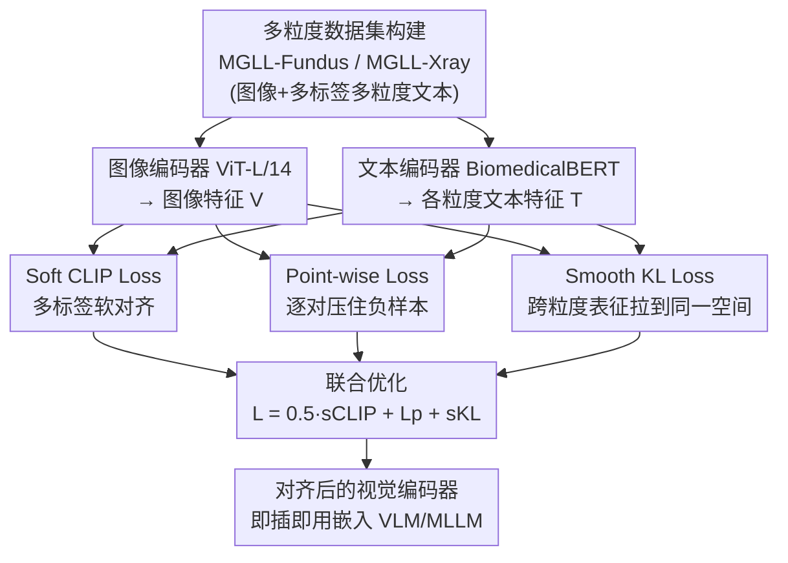

# Boosting Medical Visual Understanding From Multi-Granular Language Learning

**会议**: ICLR 2026  
**arXiv**: [2511.15943](https://arxiv.org/abs/2511.15943)  
**代码**: [https://github.com/HUANGLIZI/MGLL](https://github.com/HUANGLIZI/MGLL)  
**领域**: 医学图像 / 多模态VLM  
**关键词**: 医学图像预训练, 多标签对比学习, 多粒度对齐, CLIP改进, 视觉-语言预训练

## 一句话总结
提出 Multi-Granular Language Learning (MGLL)，一个即插即用的对比学习框架，通过 soft CLIP loss、point-wise loss 和 smooth KL 散度联合优化，实现医学图像与多标签多粒度文本描述的对齐，在眼底和 X 光数据集上全面超越 SOTA 方法，并可作为视觉编码器嵌入多模态大语言模型提升诊断准确率最高达 34.1%。

## 研究背景与动机

**领域现状**：CLIP 等对比学习方法在通用视觉领域取得了巨大成功，通过图像-文本对的匹配学习跨模态对齐表征。许多医学视觉基础模型也借鉴 CLIP 进行预训练。

**现有痛点**：标准 CLIP 采用单标签、单粒度的图文配对策略，但医学图像天然具有 **多标签** 和 **多粒度** 特性。例如，一张眼底图像可能同时包含"糖尿病黄斑水肿"和"糖尿病视网膜病变"两种疾病（多标签），并且每种疾病还有粗粒度（疾病类别）和细粒度（严重程度、临床描述）的区分（多粒度）。现有多标签对比方法关注实例-标签关联但忽略跨粒度语义。

**核心矛盾**：医学图像编码的信息比自然图像更复杂、更层次化，但数据因隐私和标注成本更稀缺。单粒度单标签监督浪费了丰富的层级标注信息，但直接将多粒度信息混合编码又会让不同语义层级的特征互相干扰。

**本文目标**：如何在一个统一框架中同时实现多标签对齐（一个图像对应多个标签）和跨粒度对齐（不同层级标注的一致性）？

**切入角度**：构建多粒度文本描述数据集，设计三个互补的损失函数分别优化多标签对齐和跨粒度一致性。

**核心 idea**：用 soft CLIP loss 做多标签软对齐 + point-wise loss 做逐对精细对齐 + smooth KL 散度做跨粒度特征一致性约束，三者联合优化实现医学图像的全面视觉-语言对齐。

## 方法详解

### 整体框架
MGLL 要解决的问题是：医学图像天然带有多标签、多粒度的结构（一张眼底图可能同时有"糖尿病黄斑水肿"和"糖尿病视网膜病变"，每种病又有疾病类别这样的粗粒度和严重程度、临床描述这样的细粒度），而 CLIP 式预训练只做单标签、单粒度的硬匹配，把这些层级标注白白浪费掉。MGLL 的整体做法是把 CLIP 的双塔结构原样保留——图像编码器用 ViT-L/14、文本编码器用 BiomedicalBERT——不引入任何额外的粒度敏感编码器，只在对比损失上做文章：让一张图像同时软对齐它的多个标签，再让同一图像在不同粒度文本下的表征收敛到一致的特征空间。因为只换损失、不动结构，计算成本零增加，可即插即用替换任何视觉-语言模型的对比目标。

为支撑这种多粒度监督，作者还构建了两个配套数据集。**MGLL-Fundus** 收集了 246,389 对眼底图像-多粒度文本，来源于 49 个公开数据集、覆盖 50+ 种疾病，粒度包括正常/异常标签、具体疾病类别、临床解释描述三层；**MGLL-Xray** 收集了 190,882 张来自 MIDRC 数据库的 X 光图像，粒度包括成像方式（CR/DX）、检查描述（Study Description）、序列描述（Series Description）。这两个数据集把"同一图像配多层级文本"这件事真正落地，是后面三个损失能起作用的前提。

整个 pipeline 是一个"双塔编码 → 三路损失并行约束 → 联合优化"的结构：图像与多粒度文本各自编码后，得到的特征同时喂给三个互补损失，soft CLIP loss 与 point-wise loss 一正一负撑起多标签对齐、smooth KL 散度横向拉齐各粒度，三者加权联合优化，最终产出一个可即插即用嵌入下游 VLM/MLLM 的视觉编码器。

### 关键设计

**1. Soft CLIP Loss $\mathcal{L}_{\text{sCLIP}}$：把单标签硬匹配换成多标签软对齐**

标准 CLIP 强制每张图像只对齐一个标签，但医学图像常常一图多病，硬匹配会逼模型在多个正确标签里只认一个，产生偏差表征。soft CLIP loss 允许图像特征 $V_i$ 同时与多个文本标签 $\{T_{i1}, T_{i2}, ..., T_{iM_i}\}$ 对齐，每个图像-文本对给一个软权重 $w_{ik}$，由标签共现矩阵归一化得到：$w_{ik} = \frac{\text{cooccurrence}(V_i, T_{ik})}{\sum_k \text{cooccurrence}(V_i, T_{ik})}$。这样优化下来，图像特征会收敛到它所有关联文本特征的加权中心，而不是被某一个标签独占，自然处理了一对多的映射。

**2. Point-wise Loss $\mathcal{L}_P$：在每个粒度层级里逐对地压住负样本**

soft CLIP loss 解决的是正样本之间怎么软分配，但它不直接管负样本——而多标签判别恰恰需要把不该匹配的对压下去。point-wise loss 用二元交叉熵补上这一块：用 $y_{ij} \in \{0, 1\}$ 标记图像 $V_i$ 与文本 $T_j$ 是否真的匹配，再用 sigmoid 把相似度归一化成概率，逐对计算损失：

$$\mathcal{L}_P = -\sum_{i,j} \frac{y_{ij} \log \sigma(x_{ij}) + (1-y_{ij}) \log(1-\sigma(x_{ij}))}{N}$$

当 $y_{ij}=0$ 时，这一项会显式地最小化 $\sigma(x_{ij})$、把无关对的相似度往下压。它和 soft CLIP loss 一正一负互补，合起来才把多标签判别能力撑起来——消融里 point-wise loss 单独贡献也最大。

**3. Smooth KL 散度 Loss $\mathcal{L}_{\text{sKL}}$：把不同粒度的表征拉到同一个空间**

前两个损失只保证了"图像和文本对得上"，但不同粒度（疾病类别 / 临床描述 / 检查信息）如果各自为政，特征会散落在不同子空间，跨粒度根本泛化不了。smooth KL 散度给这件事加一个一致性约束：对 $m$ 个粒度层级的预测分布 $\{P_1, ..., P_m\}$，先算它们的均值分布 $M = \frac{1}{m}\sum_i P_i$，再把每个粒度分布到均值分布的 KL 散度都最小化：

$$\mathcal{L}_{\text{sKL}} = \sum_{i=1}^m D_{\text{KL}}(P_i \| M)$$

最小化到均值的 KL 散度会逼着所有粒度的表征趋于一致（理想情况下 $P_1 = P_2 = ... = P_m = M$），于是同一张图在粗、细粒度下学到的语义不会互相打架，跨粒度泛化才成立。

### 损失函数
最终目标是三项的加权和，soft CLIP 权重较低、point-wise 与 smooth KL 各占主导：$\mathcal{L}_{\text{MGLL}} = 0.5 \cdot \mathcal{L}_{\text{sCLIP}} + 1.0 \cdot \mathcal{L}_P + 1.0 \cdot \mathcal{L}_{\text{sKL}}$。

## 实验关键数据

### 主实验
在 9 个眼底下游数据集和 3 个 X 光数据集上对比 MGLL 与 CLIP、CheXzero、MRM、UniChest 等 SOTA：

| 方法 | MIDRC-XR AUC (LP/FT) | MIDRC-Portable AUC (LP/FT) | ChestX-ray14 AUC (LP/FT) |
|------|---------------------|--------------------------|-------------------------|
| CLIP | 54.72 / 88.52 | 71.43 / 91.83 | 69.75 / 82.05 |
| UniChest | 59.02 / 92.51 | 78.49 / 95.44 | 76.15 / 85.84 |
| FG-CLIP | 58.31 / 93.29 | 80.31 / 96.93 | 76.62 / 85.10 |
| **MGLL** | **61.25 / 99.08** | **83.86 / 99.75** | **82.94 / 87.37** |

MGLL 在所有数据集的 linear probe 和 fine-tune 设置下均取得最佳结果。在多标签数据集 RFMiD 上，MGLL linear probe 超越次优方法 16.6%，fine-tune 超越 6.7%。

嵌入 MLLM 的效果——替换 7 个 MLLM 的视觉编码器：

| MLLM | 原始准确率 | +MGLL 准确率 | 提升 |
|------|-----------|-------------|------|
| InstructBLIP | 47.29% | 61.99% | +14.7% |
| LLaVA | 72.73% | 79.98% | +7.3% |
| LLaVA-Med | 24.28% | 58.37% | +34.1% |
| Med-Flamingo | 26.97% | 58.70% | +31.7% |
| InternVL | 77.35% | 81.96% | +4.6% |
| Janus-Pro | 68.92% | 79.80% | +10.9% |

医学专用模型（LLaVA-Med、Med-Flamingo）提升最为显著，通用模型（LLaVA、InternVL）也有明显增益。

### 消融实验
在 RFMiD 数据集上的损失函数消融：

| 配置 | LP AUC | FT AUC | 说明 |
|------|--------|--------|------|
| CLIP baseline | 44.66 | 65.10 | 单标签单粒度 |
| $\mathcal{L}_P$ only | 70.34 | 88.25 | point-wise 贡献最大 |
| $\mathcal{L}_{\text{sCLIP}}$ only | 67.86 | 85.13 | soft CLIP 也有明显提升 |
| $\mathcal{L}_{\text{sCLIP}} + \mathcal{L}_P$ | 75.73 | 90.31 | 两者互补 |
| 完整 MGLL | **79.62** | **92.83** | +sKL 进一步提升 |

粒度数量消融（MIDRC-XR-Portable）：1 粒度 → 2 粒度 → 3 粒度，AUC 呈单调递增（LP: 80.54 → 82.92 → 83.86），验证了保留层次化信息结构的重要性。

### 关键发现
- Point-wise loss 贡献最大（AUC 提升 25.68%），因为它同时优化正负样本对
- Smooth KL 散度作为跨粒度约束提供额外 ~4% AUC 提升
- 编码器选择上 ViT-L/14 优于 ViT-H/14（更大不一定更好，暗示过拟合），BERT 优于 CLIP text encoder 和 LLaMA
- MGLL 在低分辨率甚至有噪声文本条件下依然大幅优于 CLIP，鲁棒性强

## 亮点与洞察
- **即插即用设计**：不引入任何额外编码器参数，仅通过损失函数改进就实现了多标签+多粒度对齐，可直接替换任何 VLM 的对比学习目标
- **理论分析优雅**：从梯度分析推导出 soft CLIP 让图像特征收敛到文本特征的加权中心（Eq.10），直觉上非常清晰
- **大规模数据集构建有工程价值**：MGLL-Fundus（246K对，49 个数据集，50+ 疾病）和 MGLL-Xray（190K 张）填补了医学多粒度预训练数据的空白
- **嵌入 MLLM 的评估范式**：用 MGLL 替换 7 个 MLLM 的视觉编码器进行评估，这个实验设计思路可迁移到其他域特定视觉编码器的评估

## 局限与展望
- **粒度定义依赖领域知识**：需要人工为每个医学领域设计粒度层级和收集对应文本，通用性受限
- **仅验证了分类任务**：缺少分割、检测等下游任务的验证，而这些在医学影像中同样重要
- **数据集偏向眼底和胸部 X 光**：对 CT、MRI、病理切片等模态的泛化能力未知
- **粒度间关系建模较粗粒度**：smooth KL 简单地拉齐各粒度分布到均值，但没有显式建模粒度间的层级/包含关系（如"疾病类别"是"严重程度"的上位概念）
- **可改进**：探索自动从医学报告中提取多粒度标注、将层级关系（树结构）编码到损失函数中

## 相关工作与启发
- **vs CLIP**: CLIP 做单标签硬匹配，MGLL 做多标签软匹配 + 跨粒度一致性，在医学场景下提升巨大（RFMiD 上 LP AUC: 44.66 → 79.62）
- **vs MedCLIP**: MedCLIP 通过语义匹配解决假阴性，但仍是单粒度；MGLL 从根本上改变了监督信号的结构
- **vs UniChest**: UniChest 针对胸部 X 光做领域适配，MGLL 提供更通用的多粒度框架，在 X 光和眼底上都有效
- **vs SupCon**: 监督对比学习利用标签结构但局限于固定标签空间，MGLL 通过文本编码器实现开放语义

## 评分
- 新颖性: ⭐⭐⭐⭐ 多标签+多粒度对齐的组合是新的，但各个损失函数单独看并不新颖
- 实验充分度: ⭐⭐⭐⭐⭐ 11个下游数据集+7个MLLM+完善的消融，评估非常全面
- 写作质量: ⭐⭐⭐⭐ 理论分析和实验展示清晰，但相关工作部分略 crowded
- 价值: ⭐⭐⭐⭐ 对医学视觉预训练有直接参考价值，数据集和方法均可直接复用

<!-- RELATED:START -->

## 相关论文

- [\[AAAI 2026\] Sim4Seg: Boosting Multimodal Multi-disease Medical Diagnosis Segmentation with Region-Aware Vision-Language Similarity Masks](../../AAAI2026/medical_imaging/sim4seg_boosting_multimodal_multi-disease_medical_diagnosis_segmentation_with_re.md)
- [\[CVPR 2026\] MedGRPO: Multi-Task Reinforcement Learning for Heterogeneous Medical Video Understanding](../../CVPR2026/medical_imaging/medgrpo_multi-task_reinforcement_learning_for_heterogeneous_medical_video_unders.md)
- [\[ICLR 2026\] U2-BENCH: Benchmarking Large Vision-Language Models on Ultrasound Understanding](u2-bench_benchmarking_large_vision-language_models_on_ultrasound_understanding.md)
- [\[ICLR 2026\] M3CoTBench: Benchmark Chain-of-Thought of MLLMs in Medical Image Understanding](m3cotbench_benchmark_chain-of-thought_of_mllms_in_medical_image_understanding.md)
- [\[CVPR 2026\] MedMO: Grounding and Understanding Multimodal Large Language Model for Medical Images](../../CVPR2026/medical_imaging/medmo_grounding_and_understanding_multimodal_large_language_model_for_medical_im.md)

<!-- RELATED:END -->
