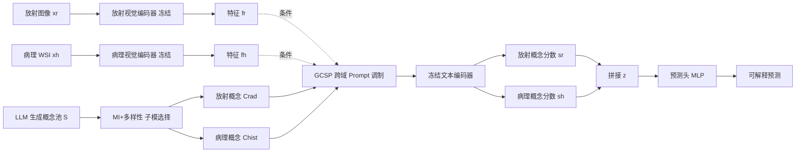

# Bridging Radiology and Pathology Foundation Models via Concept-Based Multimodal Co-Adaptation

**会议**: ICLR 2026  
**OpenReview**: [https://openreview.net/forum?id=oxgcPoDkNv](https://openreview.net/forum?id=oxgcPoDkNv)  
**代码**: [https://github.com/HKU-MedAI/CTF](https://github.com/HKU-MedAI/CTF)  
**领域**: 医学影像 / 多模态融合 / 参数高效微调  
**关键词**: 医学基础模型, 放射-病理融合, 概念瓶颈, Prompt Tuning, 可解释性, 生存分析  

## 一句话总结
提出 CTF（Concept Tuning and Fusing）框架，用一组临床概念作为放射学与病理学基础模型之间的"共享语义接口"，在融合之前先让两个域的概念表征互相条件化（cross-domain co-adaptation），仅训练 0.15% 的额外参数就在生存分析和癌症分级上超越各类潜空间融合 baseline，且预测可解释。

## 研究背景与动机
**领域现状**：医学基础模型（FM）在放射学疾病分类、病理肿瘤分级等单模态任务上泛化能力很强，参数高效微调（PEFT）也让它们能低成本适配下游任务。但真实临床诊断往往依赖多个异构域的联合判断——CT/MRI 提供宏观结构信息，病理切片揭示微观细胞细节，两者结合才能完整刻画疾病进程并准确预测生存、分级等结局。

**现有痛点**：当前把放射、病理 FM 联合起来的做法基本是"各自为政再拼接"。主流范式是把每个域的 FM 当作**冻结的特征提取器**，在静态潜特征上做简单融合（concat、co-attention）。这有两个硬伤：一是静态特征无法针对下游任务和模态间的相互作用做调整，融合深度受限；二是结果是"黑盒"，融合层的推理过程不透明，难以满足高风险医疗决策对可解释性的刚需。而全量微调大 VLM 既昂贵，又容易困在预训练域内，削弱跨域知识迁移。

**核心矛盾**：要让两个不同域的专家模型产生"深层协同理解"，关键不是简单地把它们的输出拼起来，而是要在它们之间架一座**可解释的语义桥**。临床概念（如"肿瘤坏死""细胞异型性"）天然能充当这座桥——但如果把概念当成固定定义就太脆弱了：一个概念在某个域的预后含义，往往依赖另一个域的上下文。比如放射上的"不规则肿瘤边缘"，在病理证据"淋巴血管侵犯"的伴随下会危险得多。

**本文目标**：让概念不再是静态瓶颈，而是一个**可以被另一模态动态调制的协同媒介**——在特征提取阶段就强迫每个模态"感知"对方，再做融合。

**核心 idea**：**用临床概念作共享语义接口 + 跨域条件化 Prompt** —— 在冻结两个 FM 视觉编码器的前提下，通过一套 Global-Context-Shared Prompt（GCSP）机制，让一个域（如放射）对概念的语义解读被另一个域（如病理）的视觉特征所调制，从而在融合前完成跨域的概念协同适配，最终用对齐分数做可解释预测。

## 方法详解

### 整体框架
CTF 分三个阶段串联：① **预后概念选择**——为每个域生成大候选概念池，再用子模优化筛出一个既预后相关又语义多样的紧凑子集；② **跨域概念协同适配**（核心）——用 GCSP 机制为每个概念动态生成一段 case-specific 前缀，让概念的文本嵌入同时感知下游任务与对侧域的患者上下文；③ **融合与可解释预测**——把协同适配后的概念对齐分数拼接，送入预测头。全程只有轻量 prompt 模块和预测头可训练，端到端优化。

### 关键设计

**1. 预后概念选择：用子模优化平衡相关性与多样性。** 一座好用的概念桥需要概念既"对预后有用"又"彼此不冗余"（避免同时选"irregular margins"和"ill-defined borders"这种近义词）。作者把它形式化为最大化一个子模目标 $F(C)=\sum_{c\in C} d(c) + \lambda \sum_{c\in C}\min_{c'\in C\setminus\{c\}}(1-\sigma(t_c,t_{c'}))$，其中 $d(c)$ 是概念的预后相关性、$\sigma$ 是概念文本嵌入的余弦相似度。由于精确求解 NP-hard，采用两阶段贪心：先用**互信息**给每个候选概念打相关分——对每张图算对齐分 $a(x_i,c)=(t_c^\top f_i)/(\|t_c\|\|f_i\|)$，再用 kNN 估计该分数与患者标签 $Y$ 的互信息 $d(c)=I(\hat A_c;Y)$ 并降序排序；然后从最高分概念出发，每步贪心加入与已选集合**语义最不相似**的概念 $c^*=\arg\max_{c'}\min_{c\in C}(1-\sigma(t_{c'},t_c))$，直到选满 $k$ 个。这步在冻结编码器下离线做一次，得到 $C_{rad}$ 和 $C_{hist}$。

**2. GCSP：用三段式 Prompt 让概念被跨域上下文动态调制。** 这是全文的核心。静态概念表征无法捕捉"一个发现的含义会随互补信息而变"，所以作者为每个概念在过冻结文本编码器之前，拼一段动态前缀 $P^{tuned}=\text{Concat}(P_G, P_C(f_h), P_S(f_r,f_h))$，三部分各司其职。**Global Prompt $P_G$**：每个概念学一个域内共享的向量，把概念的预训练含义整体适配到下游任务，与具体患者无关。**Context Prompt $P_C$**：跨域引导的关键，用 MoE 风格实现——对一个放射概念，由**病理特征** $f_h$ 通过一个门控网络 $g_r$ 产生混合权重 $\alpha=\text{softmax}(g_r(f_h))$，对一组可学习的基础 prompt 做加权 $P_C(f_h)=\sum_i \alpha_i P_{C,i}^{basis}$，从而用对侧模态给概念语义打上患者特异的跨域条件（病理概念则对称地被放射特征调制）。**Shared Prompt $P_S$**：捕捉整体患者级协同，先用小 MLP 把两模态拼接特征压成共享潜向量 $f_S=\phi_S(\text{Concat}(f_r,f_h))$，再分别投影给两个 VLM，为所有概念提供一致的患者级调整信号。三者拼起来，让每个概念既懂任务、又懂对侧域、还懂整体患者画像。

**3. 概念分数融合与冻结骨干预测。** 把 $P^{tuned}$ 前置到概念 token 串送入文本编码器得到调制后的嵌入 $\tilde t_c$，再算每张图与其对应概念的余弦对齐分数，得到 $s_r\in\mathbb{R}^{|C_{rad}|}$ 和 $s_h\in\mathbb{R}^{|C_{hist}|}$——这两个向量本身就是"患者在各概念上的强度"的可解释表示。拼成 $z=\text{Concat}(s_r,s_h)$ 后过预测头 $\text{MLP}_{pred}$ 输出结果。所有 FM 编码器全程冻结，只有 prompt 模块和预测头可训练，合计 0.5M 参数（占两个 FM 共 307M 的 0.15%）。生存分析用 Cox 偏似然损失优化风险分数，分级任务用交叉熵；注意 MI 排序只在离线选概念时用，推理时只算余弦对齐分数、不需要标签或 MI。

## 实验关键数据

### 主实验表格

生存预测（C-index ↑，10 次分层划分均值）：

| Model | TCGA-LGG | TCGA-GBM | Center1-GC |
|---|---|---|---|
| Radiology-Only | 0.598 | 0.477 | 0.614 |
| CLAM (病理单模态) | 0.689 | 0.497 | 0.631 |
| Cross-Attention (潜融合) | 0.685 | 0.527 | 0.631 |
| PIBD (SOTA 潜融合) | 0.687 | 0.531 | 0.638 |
| M4Survive (自适应融合) | 0.709 | 0.545 | 0.642 |
| **CTF (Ours)** | **0.713** | **0.579** | **0.665** |

癌症分级（AUC ↑）：

| Model | TCGA-GBMLGG (3-way) | Center2-CHS (5-way) | Center1-GC (5-way) |
|---|---|---|---|
| MOTCAT (SOTA 潜融合) | 0.865 | 0.826 | 0.641 |
| M4Survive | 0.861 | 0.830 | 0.649 |
| **CTF (Ours)** | **0.903** | **0.854** | **0.660** |

CTF 在全部三个生存队列和三个分级队列上都拿到 SOTA：TCGA-LGG 上 C-index 比最强 baseline 高 3.8%，分级上平均 AUC 比最强融合 baseline（MOTCAT）高 3.6%，且只增加 0.15% 参数。

### 消融实验表格

在 Center1-GC 上的消融（Δ 为相对完整 CTF 的绝对变化）：

| 类别 | 变体 | C-index | Δ | AUC | Δ |
|---|---|---|---|---|---|
| 完整 | CTF (Full) | 0.665 | — | 0.660 | — |
| Prompt | w/o Context $P_C$ | 0.629 | -0.036 | 0.635 | -0.025 |
| Prompt | w/o Global $P_G$ | 0.642 | -0.023 | 0.640 | -0.020 |
| Prompt | w/o Shared $P_S$ | 0.653 | -0.012 | 0.651 | -0.009 |
| 调制策略 | Static Concepts (CBM) | 0.586 | -0.079 | 0.622 | -0.038 |
| 调制策略 | Static + Prompt Tuning | 0.638 | -0.027 | 0.635 | -0.025 |
| 概念选择 | Random Selection | 0.622 | -0.043 | 0.654 | -0.006 |
| 概念选择 | Top-MI only | 0.646 | -0.019 | 0.642 | -0.018 |
| 骨干 | Expert (BiomedCLIP+MUSK) | 0.680 | +0.015 | 0.658 | -0.002 |

### 关键发现
- **跨域对话是核心驱动**：去掉 Context Prompt 导致最大跌幅（C-index -0.036），直接证明"让每个模态在解读概念时感知对方"是 CTF 成功的主因。
- **动态调制 >> 静态概念**：退化成标准 CBM（静态概念 + 无 prompt tuning）C-index 暴跌 0.079，说明把概念当固定瓶颈是真正的性能瓶颈；即便加上 prompt tuning，只要概念本身不被跨域条件化，仍有明显差距。
- **概念选择策略有效**：随机选概念掉 0.043，只用相关性（Top-MI）也掉 0.019，验证了"相关性 + 多样性"双重子模目标的必要性。
- **方法对骨干鲁棒且能吃专家模型红利**：换用更强的病理专家骨干（MUSK）甚至能再涨 0.015，说明 CTF 是个能随基础模型升级而受益的通用框架。

## 亮点与洞察
- **范式转变："融合前协同"而非"融合后拼接"**：以往工作要么在固定潜特征上做花式融合，要么各自微调骨干；CTF 第一次把"跨域条件化"放到融合**之前**的概念语义层，思路上很有启发——融合的深度本质上取决于"特征在被融合前是否已经互相知道对方"。
- **可解释性与性能不再二选一**：把预测显式 ground 在概念对齐分数上，既保留了 CBM 的透明度（能看到每个临床概念的贡献），又通过动态 prompt 突破了 CBM 刚性瓶颈的性能天花板。
- **极致参数效率**：0.15% 可训练参数、冻结全部 FM，对真实临床部署（算力受限 + 需复用预训练专家模型）非常友好。
- **MoE 式 Context Prompt 设计巧妙**：用对侧特征当门控、对一组共享基础 prompt 加权，既实现了患者特异的跨域条件化，又控制了参数量，是把"跨域引导"工程化的关键一招。

## 局限与展望
- **概念池依赖 LLM 生成**：候选概念由 LLM 按域生成，其质量、覆盖度和临床准确性会直接影响上限，论文未深入分析 LLM 幻觉概念带来的风险。
- **仅放射 + 病理两域、且需配对数据**：框架天然假设同一患者有配对的放射与病理影像，对缺模态/非配对场景的鲁棒性、以及扩展到基因组等更多域的能力尚待验证。
- **私有数据集占比较高**：Center1-GC、Center2-CHS 为 in-house 队列，外部可复现性受限；样本量与多中心泛化也有待更大规模验证。
- **概念分数的临床可信度**：可解释性建立在"概念对齐分数合理"之上，但分数是否真正对应临床医生的判断逻辑，仍需专家评估闭环（论文提到临床合理性但未做大规模人评）。

## 相关工作与启发
- **多模态临床融合**：相对 MOTCAT、PIBD 等潜空间融合（co-attention、信息论解耦），CTF 强调"动态对话"而非"组合已固定的特征"；相对 M4Survive 这类自适应融合（微调架构组件），CTF 用概念语义协同替代了骨干微调。
- **基础模型适配 / PEFT**：延续 prompt tuning、adapter 路线，但创新点在于把 prompt 从"任务适配"升级为"跨域条件化"——让一个域动态影响另一个域内的语义解读。
- **概念瓶颈与可解释多模态**：受 CBM、ConceptCLIP 启发，但关键区别是不把概念当静态瓶颈，而当成跨域引导的媒介，从而兼得跨域协同与概念透明。
- **启发**：这套"用可解释中间表示 + 跨模态条件化 prompt 替代黑盒潜融合"的范式，理论上可推广到任何需要异构专家模型协同、又要求可解释的高风险领域（如多组学诊断、工业多传感器质检）。

## 评分
- **新颖性**: ⭐⭐⭐⭐ — "概念作为可被跨域动态调制的协同媒介"是一个有辨识度的新视角，GCSP 的三段式（global/context/shared）+ MoE 门控设计实现得很完整，跳出了静态潜融合与刚性 CBM 的双重窠臼。
- **实验充分度**: ⭐⭐⭐⭐ — 覆盖生存分析 + 癌症分级两类任务、四个数据集（含两个私有队列）、10 次分层划分 + 配对 t 检验，消融拆解了每个 prompt 组件、概念选择策略和骨干敏感性，证据链比较扎实；扣分在私有数据占比与外部多中心验证不足。
- **写作质量**: ⭐⭐⭐⭐ — 动机叙事清晰（用"不规则边缘 + 淋巴血管侵犯"这类临床例子把跨域条件化讲活了），方法分阶段层次分明，图 2 总览到位。
- **价值**: ⭐⭐⭐⭐ — 在临床急需的"放射 + 病理联合诊断 + 可解释 + 低成本部署"交叉点上给出了实用且可扩展的方案，对复用医学基础模型的研究与落地都有参考价值。

<!-- RELATED:START -->

## 相关论文

- [\[ICLR 2026\] Joint Adaptation of Uni-modal Foundation Models for Multi-modal Alzheimer's Disease Diagnosis](joint_adaptation_of_uni-modal_foundation_models_for_multi-modal_alzheimers_disea.md)
- [\[ICLR 2026\] CodeBrain: Bridging Decoupled Tokenizer and Multi-Scale Architecture for EEG Foundation Model](codebrain_bridging_decoupled_tokenizer_and_multi-scale_architecture_for_eeg_foun.md)
- [\[AAAI 2026\] G2L: From Giga-Scale to Cancer-Specific Large-Scale Pathology Foundation Models via Efficient Fine-Tuning](../../AAAI2026/medical_imaging/g2lfrom_giga-scale_to_cancer-specific_large-scale_pathology_foundation_models_vi.md)
- [\[ICLR 2026\] You Point, I Learn: Online Adaptation of Interactive Segmentation Models for Handling Distribution Shifts in Medical Imaging](you_point_i_learn_online_adaptation_of_interactive_segmentation_models_for_handl.md)
- [\[CVPR 2026\] CoFiDA-M: Concept-Aware Feature Modulation for Cross-Domain Adaptation with Image-Only Inference](../../CVPR2026/medical_imaging/cofida-m_concept-aware_feature_modulation_for_cross-domain_adaptation_with_image.md)

<!-- RELATED:END -->
