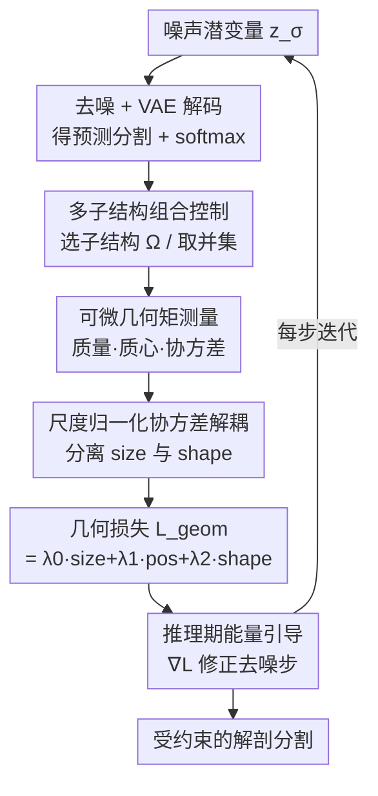

# CardioComposer: Leveraging Differentiable Geometry for Compositional Control of Anatomical Diffusion Models

**会议**: ICLR2026  
**OpenReview**: [https://openreview.net/forum?id=JyboUMeEUi](https://openreview.net/forum?id=JyboUMeEUi)  
**代码**: https://github.com/kkadry/CardioComposer  
**领域**: 医学图像 / 扩散模型  
**关键词**: 解剖生成, 几何引导, 可微几何矩, 能量引导, 组合控制

## 一句话总结
CardioComposer 把"大小/位置/形状"写成基于体素几何矩的可微损失，在无条件 3D 解剖扩散模型采样过程中做能量引导（梯度修正），无需重训就能对心脏等多类别解剖分割的各个子结构做解耦、可组合的几何控制。

## 研究背景与动机

**领域现状**：3D 解剖分割（label map）是物理仿真平台的燃料——虚拟临床试验、计算生理学、医疗器械评估都靠它喂数据。于是大家想用生成模型批量造解剖：要么用条件扩散按属性生成稀有变体，要么用 inpainting 编辑已有病人几何造"数字兄弟"。

**现有痛点**：为仿真造解剖和为艺术造形状完全不同。仿真有几个硬约束：① **尺度敏感**——毫米级的几何变化就能让生理行为剧烈波动；② **属性特异**——大小和位置对生物力学结果的作用机制不同，必须能分别拨动；③ **组合性**——多个子结构（心室、血管、瓣膜）的几何是相互耦合的，仿真结果取决于它们的集体排布；④ **可解释**——要给临床医生和器械工程师用，控制原语必须是他们能看懂的生理量。现有方法在"可控性"和"真实性"之间二选一：简单几何原语（圆柱代冠脉、截断椭球代心腔）参数可控但不真实；自编码器用全局 shape vector 真实但不可解释；条件训练能塞属性但**必须重训**，而且大多只支持体积/截面积这类 size 变量，加新约束就得重新训一遍模型。

**核心矛盾**：可控性来自"把约束写进训练"，但写进训练就僵化（只能控训练时见过的属性、加约束要重训）；灵活性来自"推理期引导"，但已有的能量引导大多只能做粗糙的定位，给不出精确的几何控制，也不为多类别分割设计。

**本文目标**：要一个推理期、无需重训、可解释、能解耦单属性、又能对任意数量子结构组合约束的几何控制框架。

**切入角度**：作者的关键观察是——无条件扩散模型本身已经学到了"什么是真实解剖"这个先验，那就不必把几何约束烤进网络权重里，而可以在采样时用一个**可微的几何度量**算出当前预测的几何属性，和目标比较得到梯度，把这个梯度当成"力"去推采样轨迹。只要这个几何度量是逐子结构、可分项的，组合控制和解耦控制就天然成立。

**核心 idea**：把 size/position/shape 表示成体素几何矩（零阶质量、一阶质心、二阶协方差），构造可微的 moment loss，在无条件潜扩散采样的每一步做 DPS 式梯度修正，从而用一个无条件模型实现对多子结构的解耦 + 组合几何控制。

## 方法详解

### 整体框架

CardioComposer 在一个**已训练好的无条件 3D 解剖潜扩散模型**之上做推理期引导，本身不改训练。给定一组目标几何属性（每个子结构想要的大小、位置、形状，用可解释的椭球原语表示），框架在反向扩散的**每一步去噪**里插入一个几何修正：先把当前噪声潜变量去噪并解码成体素分割预测，对它做逐类 softmax 得到概率体；再挑出关心的子结构、算出它们的几何矩；把测得的矩和目标矩比出一个几何损失；最后对噪声潜变量求这个损失的梯度，用它修正这一步的去噪方向。整个过程没有任何额外训练，换约束、加子结构只是换损失项，模型权重一动不动。

形式上，把分割体记为 $x \in \mathbb{R}^{C\times H\times W\times D}$（$C$ 个组织通道），VAE 编码到潜空间 $z=\mathcal{E}(x)$、解码回 $\tilde{x}=\mathcal{D}(z)$。扩散用 Karras 等的 EDM 形式，去噪函数 $D_\theta$ 估计 clean 预测。引导通过把无条件去噪结果加上一个几何梯度项实现：

$$\underbrace{D^w_\theta(z_\sigma;\sigma)}_{\text{引导后去噪}}=\underbrace{D_\theta(z_\sigma;\sigma)}_{\text{无条件去噪}}-\sigma^2\cdot w\cdot\nabla_{z_\sigma}\mathcal{L}_{\text{geom}}$$

其中 $w$ 是引导权重，$\mathcal{L}_{\text{geom}}$ 是下面定义的复合几何损失。

### 关键设计

**1. 可微几何矩测量：把"大小/位置/形状"变成能求导的标量**

传统形态测量虽然能量出长度、体积、位置，但它们不可微、且只能描述孤立特征，没法塞进梯度引导的回路。本文的做法是把每个子结构 $\Omega_k$ 的几何用**体素几何矩**统一表达，而且全程可微。对第 $k$ 个子结构（其 flatten 后的体素占据网格 $\Omega_k$、归一化坐标 $p\in[0,1]^3$），三个矩分别为

$$M_k=\mathbf{1}^T\Omega_k,\qquad C_k=\frac{\Omega_k^T p}{M_k},\qquad S_k=\frac{1}{M_k}p^T\,\mathrm{diag}(\Omega_k)\,p-C_k^T C_k$$

即零阶矩 $M_k$ 给体积/质量（对应 size），一阶矩 $C_k$ 给质心（对应 position），二阶中心矩 $S_k$ 给协方差（对应 shape——长宽比和朝向）。这套度量为什么有效：它直接定义在 softmax 后的连续概率体上，每个矩对潜变量都可导，于是"我想让右心室大一点"这种意图就能化成一个能反传的损失；而且每个子结构单独算，天然支持后面的解耦和组合。

**2. 尺度归一化协方差解耦：让形状约束不连带改变大小**

直接用协方差 $S_k$ 当 shape 会有问题——协方差既编码了朝向/长宽比，也编码了绝对尺度，于是"约束形状"会顺手把体积也拽动，size 和 shape 纠缠在一起。作者用特征值归一化把尺度抽走：$S^n_k=S_k/\mathrm{tr}(\Lambda)$，其中 $\Lambda$ 是 $S_k$ 特征分解得到的特征值矩阵。除以特征值之迹（即除掉"总尺度"）之后，$S^n_k$ 只保留长宽比和朝向，与绝对大小无关。这一步是后面"分别拨动 size/shape 互不干扰"能成立的几何前提；实验里也确实观察到唯一的残余耦合是 shape→mass（因为数据集里 size 和 shape 本身相关），其余基本解耦。

**3. 多子结构组合控制：用子结构选择 + 加权复合损失拼任意约束**

仿真真正在乎的是多个结构的集体排布，所以约束必须能"按结构拼装"。框架把分割映射到一组子结构体素图 $\Omega\in\mathbb{R}^{E\times H\times W\times D}$，其中每个子结构既可以是单个组织通道，也可以是若干通道的**并集**（比如把两条腔静脉、或全部心腔当成一个子结构）。对选中的每个属性算 MSE：$\mathcal{L}_{\text{size}}=\mathcal{L}_{\text{MSE}}(M,\bar M)$、$\mathcal{L}_{\text{pos}}=\mathcal{L}_{\text{MSE}}(C,\bar C)$、$\mathcal{L}_{\text{shape}}=\mathcal{L}_{\text{MSE}}(S^n,\bar S^n)$，再加权求和成 $\mathcal{L}_{\text{geom}}=\lambda_0\mathcal{L}_{\text{size}}+\lambda_1\mathcal{L}_{\text{pos}}+\lambda_2\mathcal{L}_{\text{shape}}$。想做解耦控制，只要把对应的 $\lambda_i$ 置零即可（如只留 $\lambda_0$ 就是纯 size 控制）；想做多部件组合，就让 $E$ 取更多子结构、每个子结构都进损失。因为约束是逐子结构、逐属性叠加的，所以"控 1 个 / 3 个 / 6 个子结构"只是改一下进损失的集合，不需要任何重训——这正是条件训练做不到的灵活度。

**4. 推理期能量引导：DPS 式梯度修正，把先验和约束分离**

有了可微损失，怎么把它注入采样？作者借用扩散后验采样（DPS）的思路：在每个去噪步，先让无条件模型给出 clean 预测 $\hat z_0=D_\theta(z_\sigma;\sigma)$，解码成分割 $\hat x_0$，算出 $\mathcal{L}_{\text{geom}}$，再用它对 $z_\sigma$ 的梯度去修正这一步（公式见整体框架）。这样设计的好处是把两件事彻底解耦：**"什么是真实解剖"由无条件扩散先验负责，"我要什么几何"由能量梯度负责**。相比把约束烤进权重的条件训练，它不需要重训、能随时换约束、还能加全新属性；相比已有只能做粗定位的能量引导，它给的是基于矩的精确几何控制，并支持多标签分割。

### 损失函数 / 训练策略

无条件扩散模型在 TotalSegmentator 心脏标签上训练（11 通道、2mm 各向同性，人工筛掉低质量后 596 例，80/20 划分），用 EDM 的 clean 预测目标 $\mathcal{L}=\mathbb{E}_{\sigma,z,n}[\lambda(\sigma)\|D_\theta(z_\sigma;\sigma)-z\|^2_2]$ 训练。引导阶段不训练，只在采样时叠加 $\mathcal{L}_{\text{geom}}$，引导权重 $w$ 和各 $\lambda_i$ 经验调；作者报告同一套权重能迁移到主动脉、脊柱、膝关节等完全不同的解剖系统，几乎不用重调。

## 实验关键数据

数据集主体为心脏分割，并额外构建主动脉、脊柱、膝关节三套多类别 label map 验证泛化。基线是三种条件训练方式（显式拼接 + ANG、隐式 3D 热图 + CFG、cross-attention + CFG），评测涵盖条件保真度（目标矩与样本矩的 L1）、形态学指标（Precision/Recall/Fréchet Distance）、点云指标（MMD/COV/1-NNA）。

### 主实验：多子结构组合生成

下表对比本文与最强条件基线（隐式 dropout）在不同约束子结构数下的表现（MMD ×10³）：

| 约束子结构数 | 方法 | FD (↓) | Pr. (↑) | Re. (↑) | MMD (↓) | COV (↑) | 1-NNA |
|------|------|------|------|------|------|------|------|
| 0 | Implicit | 1622 | 0.00 | 0.99 | 55.7 | 0.288 | 0.915 |
| 0 | **Ours** | **34.6** | **0.70** | 0.87 | **9.40** | **0.53** | **0.55** |
| 1 | Implicit | 227 | 0.00 | 0.87 | 17.1 | 0.40 | 0.79 |
| 1 | **Ours** | **38.5** | **0.60** | 0.83 | **9.39** | **0.52** | **0.57** |
| 3 | Implicit | 29.8 | 0.80 | 0.81 | 9.21 | 0.48 | 0.58 |
| 3 | **Ours** | **32.7** | 0.78 | **0.94** | **8.60** | **0.58** | **0.52** |
| 6 | Implicit | 31.1 | 0.82 | 0.95 | 8.11 | 0.56 | 0.50 |
| 6 | **Ours** | 35.5 | 0.80 | 0.94 | 8.50 | 0.58 | 0.50 |

关键现象：约束少（0~1 个子结构）时，隐式条件基线几乎崩溃（FD 高达 1622/227、Precision=0），因为它用六通道独立 dropout 训练，"全条件"配置远比"全无条件"常见，于是少约束/无约束恰好落在训练里最罕见的配置上、生成质量极差；而本文是无条件模型 + 选子结构引导，不受这种训练分布偏置影响，少约束时依然稳定。约束多（3~6 个）时两者趋于接近，本文在多数点云指标上仍略优。

### 消融：几何解耦

用心肌标签的 100 个目标矩，分别跑无损失、全损失、单项损失：

| 配置 | 行为 | 说明 |
|------|------|------|
| Uncond.（无损失） | 各属性边缘分布都很宽 | 不施加任何几何约束 |
| Mass only | mass 边缘收成尖峰，其余仍宽 | 单项只收紧自己对应的属性 |
| Centroid only | position 保真显著提升，其余近乎不变 | 解耦成立 |
| Shape only | shape 收紧，但 mass 也被一并改善 | 唯一残余耦合（数据里 size↔shape 相关） |
| Full（$\mathcal{L}_{\text{geom}}$） | 所有边缘同时塌成各自目标尖峰 | 组合控制成立 |

### 关键发现
- **解耦基本成立、且符合数据先验**：单项损失只收紧对应属性，唯一例外是 shape→mass 的弱耦合，作者归因于数据集里 size 和 shape 本身相关——这是个诚实的、有解释的"非完美解耦"。
- **少约束是本文相对条件基线的最大优势区**：隐式 dropout 基线在 0/1 子结构时 FD 爆到几百上千、Precision 归零，本文稳定在 FD≈35、MMD≈9，说明"无条件先验 + 推理期引导"绕开了条件训练的稀有配置退化问题。
- **跨解剖系统泛化**：同一套损失权重直接迁移到主动脉/脊柱/膝关节并保持高保真，引导对非凸、分支、曲管结构以及多组织 Boolean 并集都适用。
- **下游可用性**：可对病人 RV 做"质量翻倍/减半"的几何 inpainting，再转四面体网格做双心室加压仿真，RV 体积变化直接调制壁位移，验证了"编辑解剖→改变仿真结果"的反事实闭环。

## 亮点与洞察
- **把几何属性写成可微矩、再走 DPS 引导**，是个干净的"先验与约束分离"范式：无条件模型管真实性，能量梯度管可控性，于是换约束/加属性/加子结构都不用碰训练——这条思路可直接迁到任何"有好生成先验、但想在推理期插入物理/几何约束"的领域。
- **尺度归一化协方差** 这个小设计很关键：用 $S/\mathrm{tr}(\Lambda)$ 把绝对尺度从二阶矩里抽掉，才让 size 和 shape 真正能分开拨，否则解耦无从谈起。
- **用条件训练的"稀有配置退化"反衬推理期引导的鲁棒性**，是个很有说服力的实验设计：它不只说"我也能做条件生成能做的事"，而是指出条件训练在少约束时有结构性缺陷，而推理期引导天然没有。
- **椭球原语作为可解释接口**，把"size/position/shape"翻译成临床医生和器械工程师能直接拨动的几何量，照顾了真实落地的可用性。

## 局限与展望
- 作者承认：① 各几何矩的相对权重仍需经验调（不过同一套权重跨解剖系统迁移良好，额外调参很少）；② 子结构目前只能按 label class 定义，无法表达"截面"这类局部特征；③ 扩散模型可能生成拓扑错误的解剖（断开的主动脉、多个左心房），让仿真物理失真，目前只能事后过滤、浪费算力。
- 自己看：评测主表只系统对比了"隐式"这一个条件基线，三类条件基线在多约束下的完整对照不够直观；解耦实验里 shape→mass 的耦合虽被解释为数据相关，但没量化它对下游仿真的影响。
- 改进方向：把拓扑正确性也写成可微约束（如连通性/亏格惩罚）直接进引导回路，省掉事后过滤；把子结构定义从"按通道"扩展到"按空间区域"，以支持截面级的局部几何控制。

## 相关工作与启发
- **vs 条件训练（显式/隐式拼接、cross-attention）**：它们把几何属性烤进训练，加新约束要重训、且大多只支持 size 类变量；本文推理期引导无需重训、支持 size/position/shape 三类属性的解耦与组合，且在少约束时不会像条件 dropout 那样退化。
- **vs 几何原语方法（圆柱代冠脉、截断椭球代心腔）**：原语参数可控但不真实；本文把椭球只当"可解释的目标接口"，真实性交给扩散先验，兼得可控与真实。
- **vs 已有能量引导 / self-guidance**：以往能量引导多做粗定位，self-guidance 虽能控基本 size/position 但面向文生图、不处理多标签分割、也不控朝向/长宽比；本文用基于矩的可微损失把精确几何控制扩展到 3D 多类别解剖体素图。
- **vs 形变编辑 / inpainting "数字兄弟"**：形变编辑只能改已有结构，inpainting 在罕见/病理样本上易引入形态偏置；本文既能从头生成、也能做几何引导的 inpainting 编辑。

## 评分
- 新颖性: ⭐⭐⭐⭐⭐ 把几何矩做成可微损失、用 DPS 引导无条件解剖扩散，"先验/约束分离"的范式干净且少见。
- 实验充分度: ⭐⭐⭐⭐ 解耦、组合、跨系统泛化、下游仿真闭环都覆盖到，但条件基线的完整对照略弱。
- 写作质量: ⭐⭐⭐⭐⭐ 动机的四条仿真约束推导清晰，图文与公式对应到位。
- 价值: ⭐⭐⭐⭐⭐ 给计算医学/器械仿真提供了即插即用、可解释、无需重训的几何控制工具，落地性强。

<!-- RELATED:START -->

## 相关论文

- [\[CVPR 2026\] Anatomica: Localized Control over Geometric and Topological Properties for Anatomical Diffusion Models](../../CVPR2026/medical_imaging/anatomica_localized_control_over_geometric_and_topological_properties_for_anatom.md)
- [\[ICLR 2026\] DM4CT: Benchmarking Diffusion Models for Computed Tomography Reconstruction](dm4ct_benchmarking_diffusion_models_for_computed_tomography_reconstruction.md)
- [\[ICLR 2026\] Adaptive Domain Shift in Diffusion Models for Cross-Modality Image Translation](adaptive_domain_shift_in_diffusion_models_for_cross-modality_image_translation.md)
- [\[ICLR 2026\] Improving 2D Diffusion Models for 3D Medical Imaging with Inter-Slice Consistent Stochasticity](improving_2d_diffusion_models_for_3d_medical_imaging_with_inter-slice_consistent.md)
- [\[ICLR 2026\] Are EEG Foundation Models Worth It? Comparative Evaluation with Traditional Decoders in Diverse BCI Tasks](are_eeg_foundation_models_worth_it_comparative_evaluation_with_traditional_decod.md)

<!-- RELATED:END -->
