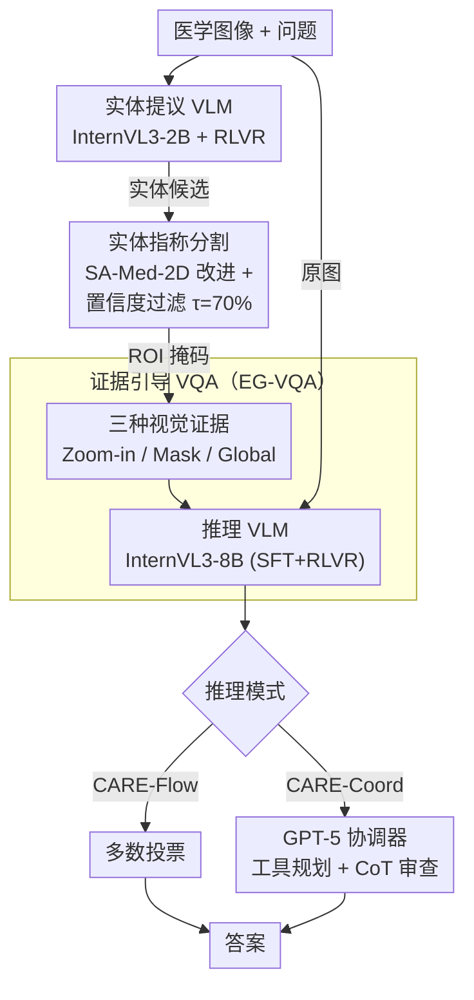

# CARE: Towards Clinical Accountability in Multi-Modal Medical Reasoning with an Evidence-Grounded Agentic Framework

**会议**: ICLR 2026  
**arXiv**: [2603.01607](https://arxiv.org/abs/2603.01607)  
**代码**: [https://xypb.github.io/CARE-Project-Page/](https://xypb.github.io/CARE-Project-Page/)  
**领域**: 医学图像 / 多模态VLM / Agent  
**关键词**: 医学VQA, 证据引导推理, Agent框架, 指称分割, 临床可问责性

## 一句话总结
提出 CARE 框架——将医学 VQA 拆分为"实体提议→指称分割→证据引导问答"三阶段专家管道，用 RLVR 微调各 VLM，并引入 GPT-5 作为动态协调器进行工具规划与 CoT 审查，在 4 个医学 VQA 基准上以 10B 参数量（77.54% 平均准确率）超越 32B 端到端 SOTA（72.29%）。

## 研究背景与动机

**领域现状**：多模态大模型（Lingshu、HuatuoGPT-Vision、medgemma 等）在医学 VQA 上持续刷新指标，但几乎所有方法都是端到端单次推理——输入图片+问题，直接输出答案。这种"黑盒"模式无法告诉临床医生"模型看了哪里、依据是什么"。

**现有痛点**：问题可以分为三个层次。(1) **不可审计**：端到端 VLM 的推理过程不透明，临床医生无法验证模型是否关注了正确的解剖结构或病变区域，这在医疗场景中是致命的——错误诊断的问责链断裂。(2) **Grounding 与 Reasoning 脱耦**：虽然有些工作（MedPLIB、UniBiomed）给 VLM 加上了视觉定位头，但定位结果并未被反馈到推理过程中，只是作为辅助多任务输出，答案质量并没有因为定位而实质性提升。(3) **单模型耦合的脆弱性**：一些通用域方法（DeepEyes、Fan et al.）尝试在单个生成式模型内交替进行 grounding 和 reasoning，但这要求海量配对数据和多轮 RL，且早期定位错误会直接放大下游推理的幻觉——小而关键的病变一旦被漏掉，后续的 CoT 全部建立在错误前提上。

**核心矛盾**：准确性 vs 可问责性之间的张力。更大的端到端模型（如 Lingshu-32B、InternVL3-38B）准确率更高，但每一步都在黑盒内完成；小模型可以做可解释推理，但能力不足。把定位和推理耦合在同一个 VLM 里，既难训练，又容易因为单点失败导致级联幻觉。

**本文目标** (1) 如何让医学 VQA 的每一步推理都有像素级可视化证据支撑？(2) 如何在不牺牲准确率的前提下实现这种可问责性？(3) 如何让小模型组合胜过大模型？

**切入角度**：作者观察到，临床医生的诊断流程本身就是"分阶段"的——先假设可能涉及的解剖结构/病变（实体候选），再在影像上精确定位这些区域（视觉定位），最后综合局部细节和全局信息做出判断。这种人类工作流天然具有可审计性：每一步都有明确的输入输出和可检查的中间结果。

**核心 idea**：用三个轻量专家模型（实体提议 VLM + 指称分割模型 + 证据引导 VQA VLM）模拟临床分阶段诊断流程，并用一个强力 VLM 协调器做动态规划和答案审查，实现"小模型工具链 > 大模型单次推理"。

## 方法详解

### 整体框架
CARE 要回答的是一张医学图像加一个自然语言问题，但它拒绝端到端"看一眼直接答"，而是把这条链拆成三个可单独检查的环节，模仿医生"先猜哪里、再定位、最后循证下判断"的流程。第一环是**医学实体提议**：一个经 RLVR 微调的 InternVL3-2B 读图读题，提出若干可能相关的医学实体（解剖结构、病变、器械），相当于先列出"该关注哪些部位"。第二环是**实体指称分割**：一个基于 SA-Med-2D 改进的专家分割模型把这些实体在像素层面圈出 ROI 掩码，并给每个掩码打置信度分数，过滤掉靠不住的定位。第三环是**证据引导 VQA（EG-VQA）**：一个经 SFT + RLVR 微调的 InternVL3-8B 拿着原图加上从掩码派生的视觉证据做最终推理。整条链的中间产物——实体列表、分割掩码、所选证据类型——都是可视、可审计的，这正是它对"临床可问责"的回答。

在这条链之上有两种跑法：**CARE-Flow** 是静态管道，三种视觉证据全部跑一遍后对答案做多数投票；**CARE-Coord** 则让 GPT-5 当动态协调器，自己决定调哪种证据、怎么编排工具调用，并在最后审查 CoT 与答案是否自洽。

### 关键设计

**1. 实体提议 VLM 的 RLVR 训练：把"图里有哪些相关实体"变成可训练的生成任务**

开放式的实体提议没有固定答案空间，传统精确匹配的二值奖励在这里几乎是非 0 即 1，梯度很容易消失。作者先解决数据问题：没有现成的实体提议数据集，就从 SA-Med-20M 里随机采样分割掩码/实体名，合成 10k 条训练 + 1k 条测试的 (图像, 问题, 实体) 配对。训练用 DAPO 算法，奖励由四块组成——**相似度奖励** $R_{\text{sim}}$ 用 MiniLM-L6-v2 编码预测实体和 GT 实体，构出余弦相似度矩阵后用 Kuhn-Munkres 最佳二部匹配求最优配对、取平均相似度；**数量奖励** $R_{\text{count}}$ 在实体数落在 1-5 之间给 1 分否则 0；**去重惩罚** $R_{\text{rep}} = 1/(r+1)$（$r$ 为重复实体数）压制重复；**格式奖励** $R_{\text{format}}$ 保证 `<think>`/`<answer>` 标签规范。

这套连续奖励的好处是绕开了二值奖励的"梯度为零"，对合成数据与真实问题之间的 domain gap 也更鲁棒；而 Kuhn-Munkres 全局匹配比贪心匹配稳——贪心只要碰上一个实体配对就发奖励，模型容易学偏。消融里 KM + Sim 组合把实体准确率做到 85.2%，远高于 Greedy + Binary 的 72.8%。

**2. 实体指称分割模型：给文本描述的实体在图像里圈出像素级 ROI**

这里刻意不用 VLM 自带的 grounding head，而是上专家分割模型，因为微小但临床关键的病变恰恰是专家模型定位更准的地方。做法是在 SA-Med-2D（SAM 的医学影像版，600M 参数）上加文本理解能力：用一个冻结的 Bio-ClinicalBERT 把实体名编成 token 序列，与图像 token 拼接后再加一个二值模态嵌入（图像=0、文本=1）送进 SAM 编码器；解码时只把图像 token 当 key/value，文本 token 经投影后作为 query 喂给 SAM 掩码解码器。微调只更新图像投影器、编码器和文本投影器，保留 SAM 的预训练视觉特征。

为了不让坏掩码污染下游，每张掩码概率图都算一个置信度 $C(M_p) = 1 - \text{Entropy}(M_p) / \log(2)$，低于阈值 $\tau_C = 70\%$ 的直接丢弃。这套专家分割的收益是实打实的：在 MeCo-G 基准上平均 Dice 做到 81.9%，把 LISA-7B（62.7%）和 BiomedParse（30.1%）甩开一大截。

**3. 证据引导 VQA（EG-VQA）：把 ROI 翻译成三种互补证据再喂给推理模型**

分割出 ROI 之后，并不是简单地把掩码叠回原图——医学影像的像素值有物理含义（如 CT 的 HU 值），直接叠加会破坏信息。CARE 改成把 ROI 转成三种粒度不同、互补的证据：**Zoom-in 裁剪**围绕 ROI 裁剪放大，提供高分辨率局部细节，适合要看纹理/形态的问题；**Binary Mask** 把二值掩码当额外图像通道输入，充当空间注意力先验，适合判位置/形状的问题；**Global 全局**则在不需要局部定位时（如判影像模态、扫描轴向）用全一掩码，保住全局视角。三种证据在训练时混合使用，让模型学会按问题类型挑合适的视觉线索。

EG-VQA 的训练分两阶段：先用已训好的实体提议 + 分割模型给原始 VQA 数据自动标注视觉线索，再在标注后的数据上先 SFT 注入医学知识、后接 DAPO-RFT 优化推理。RFT 阶段除了准确率奖励和格式奖励，还引入 CoT 长度奖励 $R_{\text{length}} = 0.25 \cdot \min(1, |\hat{y}|/L)$ 鼓励模型把推理展开充分。

### 损失函数 / 训练策略
整体的 RLVR 都用 DAPO（Decoupled Asymmetric PPO）：实体提议 VLM 的总奖励 $R_{\text{Entity}} = R_{\text{sim}} + R_{\text{count}} + R_{\text{rep}} + R_{\text{format}}$，EG-VQA VLM 的总奖励 $R_{\text{EG-VQA}} = R_{\text{acc}} + R_{\text{format}} + R_{\text{length}}$。训练上贯穿一条"SFT → RFT 两阶段"的思路——SFT 负责注入新知识、记住医学事实，RFT 再把输出分布拨向合理的 CoT，二者互补。消融印证了这一点：SFT + DAPO + 长度奖励的组合最优，比纯 SFT 高 +2.4%、比纯 DAPO 高 +3.6%。分割模型则单独用标准 Dice + CE loss 训练，只微调投影层。

## 实验关键数据

### 主实验（4 个医学 VQA 基准，准确率 %）

| 方法 | 参数量 | OMVQA-3k | VQA-RAD | SLAKE | VQA-Med-2019 (OOD) | 平均 |
|------|--------|----------|---------|-------|---------------------|------|
| GPT-4o | - | 64.07 | 58.54 | 63.55 | 59.60 | 61.44 |
| GPT-5 | - | 74.73 | 63.19 | 67.75 | 62.20 | 66.97 |
| InternVL3-8B | 8B | 75.97 | 61.86 | 66.13 | 57.40 | 65.34 |
| HuatuoGPT-Vision-34B | 34B | 76.80 | 60.75 | 64.12 | 60.60 | 65.57 |
| Lingshu-32B | 32B | 83.97 | 64.75 | 82.25 | 58.20 | 72.29 |
| CARE-Flow-S | 4B | 94.53 | 56.32 | 78.44 | 53.60 | 70.72 |
| CARE-Flow-B | 10B | 96.17 | 63.64 | 83.21 | 56.60 | 74.91 |
| **CARE-Coord-B** | **10B** | **97.97** | **68.29** | **83.11** | **60.80** | **77.54** |

CARE-Flow-B（10B）比同规模基线提升 +10.9%，比 Lingshu-32B 高 +2.6%。加入协调器后 CARE-Coord-B 进一步超出 Lingshu-32B 达 +5.2%。

### 消融实验——视觉证据与协调器的效果

| 训练阶段视觉线索 | 协调器 | ID 平均 | OOD | 总体 | vs 基线 |
|------------------|--------|---------|-----|------|---------|
| 无证据 | 无 | 77.9 | 56.0 | 72.4 | +0.0 |
| Mask | 无 | 79.6 | 54.0 | 73.2 | +0.8 |
| Zoom | 无 | 79.5 | 56.8 | 73.8 | +1.4 |
| Mask + Zoom | 无 | 80.2 | 55.6 | 74.1 | +1.7 |
| 三种全部 (CARE-Flow) | 无 | 81.0 | 56.6 | 74.9 | +2.5 |
| 三种全部 | Planning | 80.8 | 53.4 | 74.8 | +2.4 |
| 三种全部 (CARE-Coord) | Planning + Review | 83.1 | 60.8 | **77.5** | **+5.1** |

### 训练策略消融

| 训练策略 | ID 平均 | OOD | 总体 | vs 基线 |
|----------|---------|-----|------|---------|
| 基线 (InternVL3-8B 原始) | 67.9 | 57.4 | 65.3 | +0.0 |
| + SFT | 77.8 | 56.6 | 72.5 | +7.2 |
| + GRPO | 75.2 | 54.0 | 69.9 | +4.6 |
| + DAPO | 77.0 | 54.2 | 71.3 | +6.0 |
| + SFT + DAPO | 79.3 | 56.2 | 73.5 | +8.2 |
| + SFT + DAPO + $R_{\text{length}}$ (CARE-Flow) | 81.0 | 56.6 | **74.9** | **+9.6** |

### 关键发现
- **视觉证据组合的价值**：三种证据全部使用比无证据基线高 +2.5%，且三种相互互补——单独用 zoom-in 效果最好（+1.4%），但三种组合更稳健
- **协调器审查是最大增益来源**：仅加 Planning 反而没有明显收益（+2.4 vs +2.5），但加上 CoT-Answer Review 后跃升至 +5.1%，说明迭代审查而非仅仅规划才是协调器的核心价值
- **SFT + DAPO 互补**：单独 SFT（+7.2%）强于单独 DAPO（+6.0%），但组合（+8.2%）更好，再加长度奖励（+9.6%）最优。这验证了"SFT 注入知识 + RFT 优化推理"的假设
- **协调器的行为分析**：GPT-5 协调器总共修改了 7.89% 的样本，其中 4.84% 是纠正（✗→✓），3.05% 是误改（✓→✗），净收益 +1.79%。OOD 数据上纠正率更高（VQA-Med-2019 上 7.6% ✗→✓），说明强协调器增强了泛化能力
- **专家分割 vs 通用分割**：将分割模型从本文的 SA-Med-2D 改进版替换为 BiomedParse，VQA 准确率下降 3.4%，证明专家分割模型对整个管道至关重要
- **GPT-5 vs 其他协调器**：GPT-5 协调器（77.5%）远优于 GPT-4o（73.3%）和 InternVL3-38B（74.0%），因为弱协调器容易选错证据类型或过度改写专家答案

## 亮点与洞察
- **"临床工作流仿生"的系统设计哲学**：不是简单地把 VLM 做得更大，而是模拟医生"假设→定位→循证诊断"的三步流程来设计系统。这种设计哲学让每一步都有可审计的中间结果（提议的实体列表、分割掩码、选择的证据类型），天然满足医疗场景对可追溯性的要求。这种思路可以迁移到任何需要问责性的高风险决策场景（法律、金融）
- **RLVR 用于开放式概念提议的巧妙设计**：实体提议没有固定答案空间，传统 RL 的二值奖励在这种场景下容易梯度消失。作者用 embedding 相似度 + KM 最佳匹配作为连续奖励信号，既保持了语义灵活性又提供了稳定的梯度。这个 reward shaping 方案可以复用到任何"生成集合需要与参考集合软匹配"的 RL 训练中
- **小模型+工具链的参数效率**：10B 的模块化管道超越 32B 端到端模型，甚至 4B 版本就能和 38B 的 InternVL3 打平。这证明了在垂直领域，精心设计的 agent + 专家工具策略比盲目扩大模型更有效。关键是每个模块只需解决一个相对简单的子问题，2B 足以做实体提议，600M 足以做分割

## 局限与展望
- **对强协调器的依赖**：CARE-Coord 的性能优势高度依赖 GPT-5，换成 GPT-4o 后掉 4.2%，换成开源 InternVL3-38B 后掉 3.5%。自训练的 InternVL3-8B 协调器虽然比多数投票好，但无法做 CoT 审查。如何训练一个小型但可靠的协调器是关键的开放问题
- **三阶段管道的错误级联**：实体提议→分割→VQA 的串行依赖意味着上游错误不可恢复。虽然置信度过滤（$\tau_C = 70\%$）可以丢弃不可靠的分割，但错误的实体提议本身无法被下游检测到
- **合成训练数据的局限**：实体提议的训练数据是从分割数据集合成的，问题类型单一，可能无法覆盖真实临床问题的多样性
- **部署成本**：CARE-Coord 每个问题需要调用 GPT-5 API 做规划和审查，延迟和成本在实际临床部署中是障碍
- **OOD 泛化仍有差距**：在 VQA-Med-2019 上 CARE-Coord 只有 60.8%，相比 ID 平均 83.1% 有明显差距。CARE-Flow 在 OOD 上更弱（56.6%），说明视觉证据管道对分布外数据的适应性仍需改进

## 相关工作与启发
- **vs Lingshu-32B**（端到端医学 VLM）: Lingshu 用大规模医学数据预训练 32B 模型实现域内强表现，但不产生任何中间证据。CARE 用 10B 模块化系统超越之，关键优势在于可审计性和参数效率。劣势是需要多次模型调用，延迟更高
- **vs DeepEyes-7B**（单模型视觉推理）: DeepEyes 在单个 VLM 内交替 grounding 和 reasoning，需要多轮交互和大量训练。CARE 将这两个任务解耦给专家模型，避免了单模型内的错误放大，且不需要复杂的多轮 RL
- **vs MedVLM-R1-2B**（医学推理模型）: MedVLM-R1 用 2B 参数做 CoT 推理但不做 grounding，平均只有 51.35%。CARE 证明了"推理 + 定位"的组合远比"纯推理"有效
- **vs BiomedParse / SA-Med-2D**（分割模型）: 本文的分割改进版在 MeCo-G 上 Dice 81.9% 显著优于 BiomedParse 的 30.1%，且将其替换到管道中会导致 VQA 掉 3.4%，说明专家分割质量对整体很关键

## 评分
- 新颖性: ⭐⭐⭐⭐ 将临床诊断工作流形式化为 agent 管道的思路很有启发性，RLVR + KM 匹配的 reward 设计也很巧妙；但三阶段分解的框架本身在通用域已有先例
- 实验充分度: ⭐⭐⭐⭐⭐ 4 个基准 × 多类基线 + 5 个维度的消融（证据类型、训练策略、协调器、分割模型、实体提议），每个消融都有清晰的结论
- 写作质量: ⭐⭐⭐⭐ 论文结构清晰，图表信息量大，但方法细节散布在正文和附录中需要反复跳转
- 价值: ⭐⭐⭐⭐⭐ 为医学 AI 提出了"可问责"的具体技术路径，而非空谈可解释性；10B 超 32B 的效率故事对资源有限的医疗机构有实际意义

<!-- RELATED:START -->

## 相关论文

- [\[AAAI 2026\] PulseMind: A Multi-Modal Medical Model for Real-World Clinical Diagnosis](../../AAAI2026/medical_imaging/pulsemind_a_multi-modal_medical_model_for_real-world_clinical_diagnosis.md)
- [\[CVPR 2026\] Med-CMR: A Fine-Grained Benchmark Integrating Visual Evidence and Clinical Logic for Medical Complex Multimodal Reasoning](../../CVPR2026/medical_imaging/med-cmr_a_fine-grained_benchmark_integrating_visual_evidence_and_clinical_logic_.md)
- [\[CVPR 2026\] Clinically-Grounded Counterfactual Reasoning for Medical Video Diagnosis](../../CVPR2026/medical_imaging/clinically-grounded_counterfactual_reasoning_for_medical_video_diagnosis.md)
- [\[CVPR 2026\] EMAD: Evidence-Centric Grounded Multimodal Diagnosis for Alzheimer's Disease](../../CVPR2026/medical_imaging/emad_evidence-centric_grounded_multimodal_diagnosis_for_alzheimers_disease.md)
- [\[ICLR 2026\] Joint Adaptation of Uni-modal Foundation Models for Multi-modal Alzheimer's Disease Diagnosis](joint_adaptation_of_uni-modal_foundation_models_for_multi-modal_alzheimers_disea.md)

<!-- RELATED:END -->
