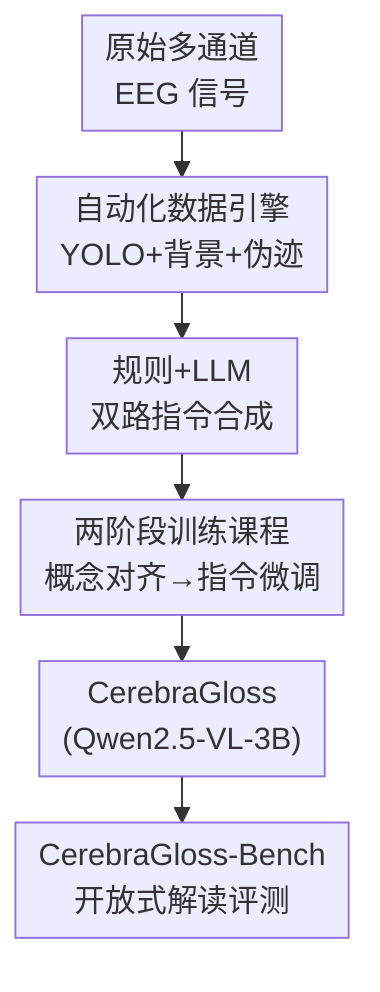

# CerebraGloss: Instruction-Tuning a Large Vision-Language Model for Fine-Grained Clinical EEG Interpretation

**会议**: ICLR2026  
**OpenReview**: [https://openreview.net/forum?id=Xi1jkajWi9](https://openreview.net/forum?id=Xi1jkajWi9)  
**代码**: https://github.com/iewug/CerebraGloss  
**领域**: 医学图像 / 多模态VLM  
**关键词**: 临床EEG解读, 视觉语言模型, 指令微调, 自动数据引擎, 波形检测

## 一句话总结
本文把临床脑电图（EEG）波形当成一种"专门的视觉语言"，用一条全自动数据引擎（含定制的 YOLO 波形检测器）合成 9.4 万条 EEG 图文指令数据，对 Qwen2.5-VL-3B 做两阶段指令微调，得到首个能做"描述 + 多选题 + 多轮对话"的生成式 EEG 解读模型 CerebraGloss，并在自建的开放式基准 CerebraGloss-Bench 上超过 GPT-5、在 TUSZ 癫痫检测上刷新 SOTA。

## 研究背景与动机
**领域现状**：临床 EEG 是神经科最基础的诊断工具，但其价值要靠训练有素的专家逐段肉眼审阅原始波形才能释放。计算方法从传统机器学习（手工特征 + SVM）演进到 CNN/RNN，再到 BERT/GPT 式的自监督脑电基础模型（如 LaBraM）。

**现有痛点**：人工审阅有三大问题——费力（一份记录要看几小时）、主观（不同医生判读差异大）、不完整（实际只挑重点标注，大量信号被忽略）。而已有的计算模型几乎全是"专才分类器"：只会做癫痫检测、睡眠分期这类孤立的封闭集分类，无法把多种发现综合成一段整体性、解释性的分析。一句话——这个领域"造出了分类器，却没造出会解读的医生"。

**核心矛盾**：LVLM（大视觉语言模型）本可以把波形当视觉语言来"读"，带来从"窄分类"到"全面解读"的范式转变；但卡住这一跃迁的根本瓶颈是**数据**——缺少把 EEG 可视化图像和细粒度、专家级解读配对起来的大规模指令数据集。人工标注这种细粒度解读又贵到不可行。

**本文目标**：(1) 在没有现成数据的前提下，造出大规模 EEG 图文指令数据；(2) 训出一个能统一做描述/问答/对话的生成式解读模型；(3) 建一个能评测"开放式解读能力"而非单一分类指标的基准。

**切入角度**：既然人工标不起，那就用一套程序化的"数据引擎"——把领域知识写进检测器和规则里，直接从原始信号自动产出结构化标注，再用强 LLM（Gemini 2.5 Flash）把结构化标注润色成自然的指令对话。

**核心 idea**：用"自动数据引擎合成指令数据 + 通用 LVLM 两阶段微调"替代"昂贵人工标注 + 专才分类器"，把 EEG 解读从分类升级为生成式对话。

## 方法详解

### 整体框架
CerebraGloss 的核心不是改模型结构，而是一条"数据驱动"的完整管线：**原始多通道 EEG 信号 → 自动化数据引擎产出结构化标注 → 规则与 LLM 双路合成指令数据 → 两阶段训练把通用 LVLM 改造成 EEG 解读专家 → 用自建基准评测开放式解读能力**。模型本体直接沿用 Qwen2.5-VL-3B（视觉编码器 + LLM 解码器 + 跨模态投影器），输入是渲染成图像的 10 秒 EEG 片段，输出是自由文本的临床解读。整条管线的关键在于"数据怎么无监督地造出来"和"训练怎么在学会 EEG 的同时不忘掉通用能力"。

### 关键设计

**1. 自动化数据引擎：把专家审阅流程拆成三个可程序化的标注模块**

人工标注细粒度 EEG 解读太贵，本文转而设计一条"数据引擎"，输入原始多通道信号、程序化输出结构化临床标注，由三个模块组成。第一个是关键波形事件检测：作者训练了一个专门的目标检测模型 **CerebraGloss-YOLO**，把多通道时序信号当图像，定位并分类九种临床关键波形（棘波、尖波、棘/尖慢复合波、K 复合波、睡眠纺锤波、高频噪声、正向尖瞬变即眨眼、正负方波即侧向眼动）。为此标注团队耗时数月，从 DREAMS、TUH EEG 语料子集及私有数据中精标出 2,849 个 10 秒片段、共 46,258 个专家边界框。第二个是背景节律刻画：把振幅定义为峰峰电压的一半，再先找功率谱密度最高的标准频段（δ/θ/α/β/γ），在该频段内取峰值幅度对应的频率作为主频。第三个是伪迹识别：用统计与形态学特征标记肌电（高频功率）、眼动（额区通道空间相关）、呼吸（节律性慢波）等生理伪迹，以及电极噪声（极端局部振幅 + 与邻道相关性丧失）、平直线（近零方差）等非生理伪迹。这套引擎把"专家看波形"的过程拆成机器可执行的检测+测量+判别，是后面所有数据的源头。

**2. 规则与 LLM 双路指令合成：先用模板兜底事实，再用强模型升华成对话**

光有结构化标注还不是指令数据，需要把它转成"用户问—模型答"的形式。作者从 140 万个 10 秒片段（共 3,889 小时，涵盖 TUAB/TUEV/TUSZ/TUAR/TUEP/TUSL/DREAMS/HMC 等）出发，走两路。规则路：用模板把标注合成详细 caption，覆盖导联配置、伪迹、睡眠事件、痫样活动（含偶极子特征评估）、背景特征五个方面，并配套生成多选/二元问答；为压住自动标注引入的误差，还用了事件优先级掩码、孤立事件空间剪枝、事件分组归纳整合等清洗策略。LLM 路：把规则 caption、YOLO 与伪迹检测器的边界框、睡眠分期等喂给 Gemini 2.5 Flash 当教师模型，用精心设计的 one-shot 提示（睡眠和癫痫各一套），并**约束其输出只能基于给定上下文**以抑制事实幻觉，最终产出 9.4 万条高质量样本，按 1:1:1 平衡为三类：详细描述（Description）、需要更深推理的复杂多选题（Complex MCQ）、模仿临床问诊的多轮对话（Conversation）。值得注意的是，整个数据生成过程**不使用 EEG 渲染图像本身**，全靠结构化标注，图像只在最终训练时作为模型输入。

**3. 两阶段训练课程：先对齐 EEG 视觉概念、再指令微调，并混入通用数据防遗忘**

把通用 LVLM 改造成 EEG 专家，关键是"学会新视觉词汇但不忘旧本领"。Stage 1（EEG 概念特征对齐）：冻结视觉编码器和 LLM 解码器，**只全参微调投影器**，用 140 万条 EEG 图文对掺上 55.8 万条 LLaVA 通用图文对，把波形视觉特征对齐到语言空间。这里有个反直觉的细节——采用**早停**，在训练损失收敛之前（约 0.05 epoch）就停，因为再练下去模型会被程序化、模板味重的 caption 带出"描述偏置"，反而损害开放式推理。Stage 2（EEG 指令微调）：冻结视觉编码器，对 LLM 解码器和投影器全参微调，训练 1 epoch；数据除 EEG 专用部分（10 万规则多选题 + 9.4 万 Gemini 指令样本 + 5 万规则 caption）外，还掺 5 万通用样本（CoSyn-400K 与 LLaVA-Instruct-150K）以保留通用指令跟随能力。两阶段在 8×A800 上各约 4 小时，AdamW、有效 batch 256、峰值学习率 $1\times10^{-5}$、cosine 调度、warmup 0.1。

**4. CerebraGloss-Bench：首个开放式 EEG 解读 + 多类波形检测基准**

已有 EEG 基准（TUSZ 癫痫、HMC 分期）都是封闭集分类，存在三个根本缺陷：把文件级标签错误下传到每个片段造成"标签—粒度错配"、把可能含多个共现事件的复杂信号过度简化、忽略"同一波形在不同患者状态下含义不同"的上下文依赖。为此作者构建并公开 CerebraGloss-Bench：90 个有挑战性的 10 秒、完整 19 通道 10-20 系统片段，每段配四件套——自由文本描述、复杂多选题、对话式问答、九类波形的通道级密集边界框。文本先程序化生成、再由临床专家审校验证；数据全部来自私有院内采集且与训练集**受试者完全不重叠**以防泄漏，覆盖背景节律/伪迹/睡眠/痫样四大类共十七子类。

### 损失函数 / 训练策略
两阶段均为标准的语言建模（自回归生成）目标，区别在于解冻范围与早停：Stage 1 仅训投影器并在欠拟合点早停以"只学视觉词汇、不覆盖推理能力"；Stage 2 解冻 LLM+投影器训满 1 epoch，并以通用数据正则化防灾难性遗忘。

## 实验关键数据

### 主实验
在 CerebraGloss-Bench 上，MCQ 用准确率、Description 用 ROUGE-1、对话 QA 用 GPT-5 当裁判打 1-10 分。CerebraGloss-3B 全面超过包括 GPT-5 在内的专有大模型；而 LLaVA-Med、BioMedGPT 这类生物医学 LVLM 因训练语料里没有 EEG 图文配对，几乎读不懂波形。

| 模型 | MCQ (Acc%) | Description (ROUGE-1%) | QA (GPT-5 分) |
|------|------|------|------|
| LLaVA-Med | / | 8.87 | 2.83 |
| BioMedGPT | / | 11.82 | 1.29 |
| Qwen2.5-VL-32B | 37.78 | 36.90 | 3.57 |
| Gemini 2.5 Pro | 52.22 | 37.95 | 3.86 |
| GPT-5 | 70.00 | 37.07 | 4.58 |
| **CerebraGloss-3B** | **80.00** | **44.19** | **4.76** |

在标准临床分类任务上（平衡准确率），CerebraGloss 在 TUSZ 癫痫检测上刷新 SOTA，HMC 睡眠分期上有竞争力但略逊最强脑电基础模型；而通用 LVLM 基本只有随机水平。波形检测任务上 CerebraGloss-YOLO 取得 mAP@0.5 = 40.95%，作为该新任务的首个基线。

| 模型 | 类型 | TUSZ | HMC |
|------|------|------|------|
| CNN-Transformer | DL | 75.53 | 68.35 |
| LaBraM | LEM | 77.48 | 68.92 |
| Gram | LEM | 78.29 | **69.97** |
| Qwen2.5-VL-3B（基座） | LVLM | 55.02 | 25.00 |
| **CerebraGloss-3B** | LVLM | **79.21** | 62.02 |

### 消融实验

| 配置 | TUSZ | HMC | MCQ | Desc | QA | 说明 |
|------|------|------|------|------|------|------|
| Stage1=0.05, Stage2=1（完整） | 79.21 | 62.02 | 80.00 | 44.19 | 4.76 | 最优配置 |
| Stage1=0.20 | 79.23 | 61.16 | 74.44 | 41.69 | 4.30 | Stage1 练过头，生成任务掉点 |
| Stage2=0（不指令微调） | 54.36 | 24.09 | 37.78 | 22.08 | 2.67 | 几乎退回基座水平 |
| Stage2 w/o aug（去 Gemini 9.4 万） | 78.39 | 61.29 | 47.78 | 9.02 | 2.34 | 丧失开放生成能力，退化成只会出 MCQ |
| Stage2 w/o cap（去 5 万规则 caption） | 78.73 | 61.80 | 78.89 | 51.09 | 4.58 | 描述更像基准风格，但其他任务降 |
| 7B 版本 | 80.21 | 63.34 | 81.11 | 44.23 | 4.64 | 整体随规模提升 |

### 关键发现
- **Stage 1 必须早停**：0.05 epoch 的"欠拟合"点在三项生成任务上全面最好；练到 0.1/0.2 epoch 虽对 TUSZ/HMC 分类影响不大，却会注入"描述偏置"，损害开放式推理——说明对齐阶段只需让模型获得 EEG 视觉词汇，不能覆盖其预训练推理能力。
- **Gemini 增强数据是开放生成能力的命脉**：去掉这 9.4 万条后，模型彻底失去自由生成能力、退化成只会套 MCQ 格式甚至输出乱码（因为剩下的 Stage 2 数据几乎全是 MCQ），但 TUSZ/HMC 不降，因为它们靠规则多选题学习。
- **规则 caption 起正则化作用**：去掉后 Description 反而更贴基准风格、分数上升，但其他任务下降——简单模板数据把模型锚在更基础的特征空间，防止它过拟合 LLM 文风。
- **HMC 略逊有解释**：睡眠分期常需几分钟的时间上下文，而本模型按 10 秒片段解读、且为广义描述而非单任务优化，自然在这种"上下文贫乏的单分类"上吃亏。

## 亮点与洞察
- **"波形即视觉语言"的范式迁移很巧**：不改模型结构，把领域难题完全转化为"如何无监督造数据"，让通用 LVLM 直接复用其视觉表征——这套思路可迁移到任何"专家靠看图判读、但缺图文配对标注"的领域（如工业示波、地震波、心电图）。
- **数据引擎全程不用图像本身**：标注、规则 caption、LLM 增强都只基于结构化标注，图像只在训练时作为输入。这把"标注质量"和"渲染质量"解耦，也意味着引擎可独立于具体可视化样式复用。
- **早停当正则**：用"故意欠拟合的对齐阶段"防止程序化数据的风格污染推理能力，是一个反直觉但有数据支撑的训练 trick。
- **小模型打赢 GPT-5**：3B 模型在专门基准上压过 GPT-5，再次印证"领域内指令微调 + 高质量合成数据"在垂直任务上的杠杆。

## 局限与展望
- 作者承认模型仍会**幻觉出不存在的波形**（假阳性），根源是全自动数据管线本身带噪——这是合成数据驱动方案的固有风险。
- 模型基于**渲染图像**而非原始信号建模，刻意贴合临床实践；作者指出直接 signal-to-text 建模是更有野心的方向。
- HMC 睡眠分期受限于 10 秒片段、缺乏分钟级时间上下文，时序推理能力有待扩展。
- 明确声明仅为**非商业学术研究原型**，不得用于临床诊断；输出必须经合格临床专家审阅，不能替代专业医学判断。
- 波形检测 mAP 仅 40.95%，作为新任务首个基线尚有大幅提升空间。

## 相关工作与启发
- **vs EEG-CLIP / ELM-MIL（对齐式表征学习）**：它们在多小时记录与摘要级报告间做粗粒度对齐、服务于分类；本文聚焦把文本描述**接地到具体波形事件**的细粒度生成，目标根本不同。
- **vs NeuroLM（指令微调式）**：NeuroLM 把分类任务改写成多选格式，本质上仍是**非生成**的、无法自由输出或对话；CerebraGloss 是真正的生成式解读。
- **vs 脑到文本解码**：那条线是重建用户内在言语（脑机接口方向），与本文"解读 EEG 信号的临床意义"是两回事，作者特意做了区分。
- **vs LLaVA-Med / BioMedGPT（通用生物医学 LVLM）**：它们语料里没有 EEG 图文配对，在本基准上几乎读不懂波形，凸显**领域内指令微调**的必要性。

## 评分
- 新颖性: ⭐⭐⭐⭐⭐ 首个生成式、对话式临床 EEG 解读 LVLM，并配套数据引擎 + 开放式基准，范式层面的开创。
- 实验充分度: ⭐⭐⭐⭐ 覆盖开放式基准、两个标准临床任务、波形检测、消融与规模实验，较完整；但波形检测缺可比基线、HMC 略逊。
- 写作质量: ⭐⭐⭐⭐ 动机—数据—训练—评测的逻辑链清晰，附录详尽。
- 价值: ⭐⭐⭐⭐⭐ 开源模型/基准/工具，为"把 LVLM 用于医疗时序可视化解读"提供了可复用的完整范式。

<!-- RELATED:START -->

## 相关论文

- [\[ICLR 2026\] U2-BENCH: Benchmarking Large Vision-Language Models on Ultrasound Understanding](u2-bench_benchmarking_large_vision-language_models_on_ultrasound_understanding.md)
- [\[AAAI 2026\] G2L: From Giga-Scale to Cancer-Specific Large-Scale Pathology Foundation Models via Efficient Fine-Tuning](../../AAAI2026/medical_imaging/g2lfrom_giga-scale_to_cancer-specific_large-scale_pathology_foundation_models_vi.md)
- [\[AAAI 2026\] Small but Mighty: Dynamic Wavelet Expert-Guided Fine-Tuning of Large-Scale Models for Optical Remote Sensing Object Segmentation](../../AAAI2026/medical_imaging/small_but_mighty_dynamic_wavelet_expert-guided_fine-tuning_of_large-scale_models.md)
- [\[CVPR 2026\] Instruction-Guided Lesion Segmentation for Chest X-rays with Automatically Generated Large-Scale Dataset](../../CVPR2026/medical_imaging/instruction-guided_lesion_segmentation_for_chest_x-rays_with_automatically_gener.md)
- [\[AAAI 2026\] Coarse-to-Fine Open-Set Graph Node Classification with Large Language Models](../../AAAI2026/medical_imaging/coarse-to-fine_open-set_graph_node_classification_with_large_language_models.md)

<!-- RELATED:END -->
