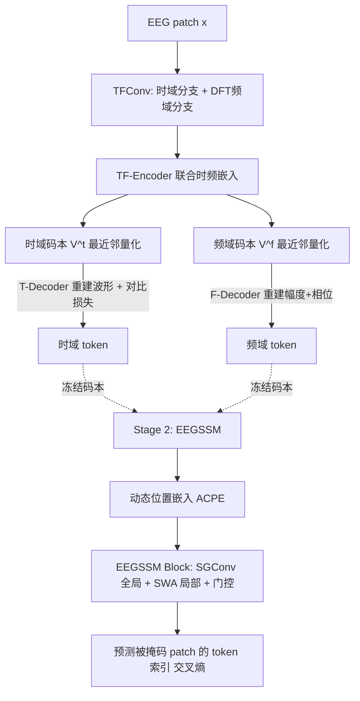

# CodeBrain: Bridging Decoupled Tokenizer and Multi-Scale Architecture for EEG Foundation Model

**会议**: ICLR 2026  
**OpenReview**: [https://openreview.net/forum?id=msJgEkjwh5](https://openreview.net/forum?id=msJgEkjwh5)  
**代码**: [https://github.com/jingyingma01/CodeBrain](https://github.com/jingyingma01/CodeBrain)  
**领域**: EEG 基础模型 / 神经科学与认知 / 时间序列表示学习  
**关键词**: EEG foundation model, 解耦 tokenizer, 时频离散化, 状态空间模型, 小世界拓扑, 自监督预训练  

## 一句话总结
CodeBrain 用「时频双码本解耦 tokenizer + 全局结构卷积 SSM 与滑动窗注意力并行的多尺度架构」打造 EEG 基础模型，在最大公开 EEG 语料上预训练后，于 8 类任务 10 个数据集上稳定超越现有 EEG 基础模型，并提供码本级的可解释性。

## 研究背景与动机
- **领域现状**：脑电（EEG）有高时间分辨率，应用涵盖睡眠分期、情绪识别、运动想象等。为摆脱「每个任务从头训一个小模型」的低复用困境，EEG 基础模型（EFM）兴起，普遍沿用 NLP 的掩码自监督范式：把信号切 patch、编码、重建被掩码部分。由于原始信号噪声大，近期工作引入码本量化（VQ-VAE 式）来抽象掉低层波动，得到更鲁棒的离散表示。
- **现有痛点一（tokenizer 不解耦异质信号）**：现有 EFM 直接套用为图像设计的单一码本 VQ-VAE。但 EEG 是**时频异质**的——时域反映瞬态神经事件、频域反映节律，二者在一个域匹配的 patch 在另一个域可能完全分歧。混合码本会把两种域特定模式糅在一起，既削弱表示能力，又让 token 难以对齐到临床可解释的神经事件或频谱节律。
- **现有痛点二（全局依赖建模低效）**：大脑遵循**小世界拓扑**——稀疏的全局连接 + 强局部相关。而多数 EFM 用全连接自注意力的 Transformer，这种「过度连接」既与大脑稀疏结构不符，又因序列长度二次复杂度而难以高效捕获全局依赖。
- **现有痛点三（忽视 patch 内局部依赖）**：EEG 在短时窗内有丰富局部波形（如睡眠波形等瞬态事件），但多数 EFM 把每个 patch 压成单个 token、只在 patch 级做注意力，丢掉了 patch 内的局部动态。
- **本文目标**：构建一个兼具**域特定可解释性**与**脑启发多尺度高效建模**的 EEG 基础模型。
- **核心 idea**：**「解耦 + 多尺度」双管齐下**——用时频双码本把异质信号拆成两套离散 token（表示空间二次扩张 + 可解释），再用「全局结构卷积 SSM + 局部滑动窗注意力」并行的架构去匹配大脑稀疏全局 / 强局部的拓扑。

## 方法详解

### 整体框架
CodeBrain 是两阶段预训练框架。**第一阶段（TFDual-Tokenizer）**：把每个归一化 EEG patch 分别离散化成时域 token 和频域 token，用两套独立码本学习域特定的离散表示。**第二阶段（EEGSSM）**：在 token 空间做掩码自监督——随机掩码 patch，用结构卷积 SSM（全局）配合滑动窗注意力（局部）的多尺度骨干预测被掩码 patch 在第一阶段码本中的 token 索引。

### 关键设计

**1. TFDual-Tokenizer：时频解耦的双码本离散化** 把异质 EEG 拆成两条 token 流是全文起点。共享神经编码器先对 patch 做 DFT 得频域表示，时域 $x_i$ 与频域 $x_i[k]$ 并行过 TFConv（卷积+BN+ReLU），拼成时频嵌入 $e_i^p = \text{Concat}\{e_i^t, e_i^f\}$，加位置嵌入后送进 Transformer 编码器得 $\tilde{e}_i$。随后两套独立码本各自最近邻量化：$p_{ti}=\arg\min_j\|\tilde{e}_i - v_{tj}\|_2$、$p_{fi}=\arg\min_j\|\tilde{e}_i - v_{fj}\|_2$。论文以 Proposition 2.1 论证「解耦码本不弱于联合码本」，且每套 $K$ 个码字时表示空间从 $K$ 扩到约 $K^2$，二次扩张提升判别力，同时让 token 可对齐到神经事件 / 频谱节律。

**2. 域特定重建监督：频域重幅相、时域加对比** 两个域的码本用不同目标训练，以匹配各自物理含义。频域分支从码嵌入预测幅度 $A_i$ 与相位 $\phi_i$（由 DFT 实部虚部算出，z-score 归一），用 MSE 监督 $\mathcal{L}_i^f = \|y_i^A - A_i\|_2^2 + \|y_i^P - \phi_i\|_2^2$。时域分支因直接重建原始波形易不收敛，引入 SimCLR 对比损失稳定训练：把一段信号切两半，鼓励同段两半表示相似、不同段相同位置表示相异 $\mathcal{L}_m^{CL} = -\log\frac{\exp(\text{sim}(e_{m1}^h,e_{m2}^h)/\tau)}{\sum_k \mathbb{1}_{[k\neq i]}\exp(\text{sim}(e_{mi}^h,e_{sk}^h)/\tau)}$，再叠加原始信号重建。总 tokenizer 损失把对比、时频重建与码本 / commitment 损失（带 stop-gradient）合在一起。

**3. EEGSSM 多尺度骨干：全局 SGConv + 局部 SWA + 门控** 第二阶段用结构卷积 SSM 匹配大脑「稀疏全局」。SGConv 把 SSM 写成 DFT 形式的卷积 $y = F_N^{-1} D_k F_N u$，可经 FFT 在 $O(N\log N)$ 算完，且用稀疏参数化 + 核衰减（衰减系数 $\alpha$ 取 0.5）把卷积核拆成多个上采样子核 $k_i = \alpha^i \,\text{Upsample}(w_i)$，获得全局感受野却比 S4 更省。并行地，滑动窗注意力（SWA）在固定小窗内做注意力，捕获被前人忽略的 patch 内局部瞬态事件，把全局自注意力的二次复杂度降到线性。两路输出经 WaveNet 式门控融合 $z = \tanh(W_f \cdot \text{Concat}(y_{sg}, y_{swa})) \odot \sigma(W_g \cdot \text{Concat}(y_{sg}, y_{swa}))$，抑制无关特征、稳定深层训练。

**4. 动态位置嵌入 + 掩码 token 预测的自监督** 为适配下游不同电极布局，先用单个非对称核的深度可分 2D 卷积（ACPE 设计）学动态位置嵌入，让模型学相对通道结构并泛化到异质通道。预训练用 MAE：按伯努利分布以比例 $r$（0.5）掩码，模型对被掩码 patch 预测其在 TFDual-Tokenizer 码本中的 token 索引，用交叉熵 $\mathcal{L}_p = -\sum_j \sum_{n\in\{m_i=1\}} p(v_{nj}|x_{nj})$ 监督，从而把第一阶段的可解释离散语义注入表示学习。

## 实验关键数据

### 主实验表格
预训练于 TUH EEG Corpus（约 9,246 小时、110 万样本），多类任务报 Cohen's Kappa / Weighted F1 / Balanced Acc，二分类报 AUROC / PRAUC / Balanced Acc，5 个随机种子。

| 数据集（任务） | 指标 | 最强基线 CBraMod | CodeBrain |
|---|---|---|---|
| FACED（9 类情绪） | Kappa | 0.5041 | **0.5406** |
| SEED-V（5 类情绪） | Kappa | 0.2569 | **0.2735** |
| ISRUC S3（5 类睡眠） | Weighted F1 | 0.8056 | **0.8202** |
| BCIC2020-T3（5 类想象语音） | Kappa | 0.4216 | **0.5127** |
| Mental Arithmetic（2 类） | AUROC | 0.7905 | **0.8707** |
| CHB-MIT（2 类癫痫） | PRAUC | 0.3689 | **0.4377** |

在想象语音（Kappa 0.42→0.51）和精神压力检测（AUROC 0.79→0.87）等任务上提升尤为显著。

### 消融实验表格
以 FACED（9 类）的 Cohen's Kappa 为例（完整为 Dual+CL+SWA+SGConv+Gate）：

| 变体 | Kappa |
|---|---|
| 完整 CodeBrain（Dual 码本） | **0.5406** |
| 仅时域码本 | 0.4618 |
| 仅频域码本 | 0.5006 |
| Mixed（混合单码本） | 0.4676 |
| 去对比损失 CL | 0.5222 |
| 去 SWA（局部注意力） | 0.5192 |
| 去 SGConv（全局） | 0.1936 |
| 去门控 Gate | 0.2578 |

### 关键发现
- **解耦码本 > 混合码本**：Dual（0.5406）显著高于 Mixed（0.4676），印证时频解耦带来表示增益，且单独时域 / 频域都不如双码本。
- **全局 SGConv 是命脉**：去掉 SGConv 性能崩到 0.1936（且方差极大），说明结构卷积 SSM 提供的全局建模不可替代；门控同样关键（去掉降到 0.2578）。
- **局部 SWA 与对比损失锦上添花**：各贡献约 2 个百分点 Kappa，验证「补 patch 内局部依赖」「稳定时域码本训练」的设计动机。
- 论文还配套了 scaling-law 分析与码本可解释性（token 对应神经事件 / 频谱节律）的定性 + 定量验证。

## 亮点与洞察
- **把「异质性」上升为架构原则**：不是简单堆模块，而是先指出 EEG 的时频异质 + 大脑小世界拓扑，再让 tokenizer（解耦）和骨干（稀疏全局 + 强局部）逐一对应，设计动机一以贯之。
- **可解释性落到 token 级**：双码本让离散 token 可关联到临床神经事件 / 频谱节律，是 EFM 里少见的「表示级可解释」。
- **SSM 替代全注意力的高效路线**：SGConv 的 $O(N\log N)$ + SWA 线性局部注意力，给长序列生理信号基础模型提供了比纯 Transformer 更契合稀疏拓扑的骨干。

## 局限与展望
- 域特定可解释性主要靠定性可视化 + 命题论证，token 与具体临床事件的对应仍偏启发式，缺乏大规模标注级验证。
- 两阶段训练（tokenizer 10 小时 + 骨干 24 小时、多张 A100）成本不低，端到端单阶段化是潜在方向。
- 下游统一用三层 MLP 聚合通道并全量微调，未充分探索 few-shot / 线性探测下表示质量。
- 仅评估头皮 19 通道、200Hz 重采样的设定，对高密度 / 颅内 EEG 或非标准布局的泛化待验证。

## 相关工作与启发
- **EFM 谱系**：BENDR（对比）、BIOT（连续 patch token）、LaBraM（VQ 离散神经 token）、EEGPT / CBraMod（掩码重建）。CodeBrain 在「离散 tokenization」路线上把单码本升级为时频双码本。
- **状态空间模型**：SGConv / S4 等结构 SSM 为长序列提供线性 / 准线性全局建模，本文将其引入 EEG 并与局部注意力融合。
- **启发**：对其他**异质多模态生理信号**（如同时含时频 / 多导联结构的信号），"按物理域解耦码本 + 用领域拓扑先验选骨干"是一条可迁移的设计范式。

## 评分
- **新颖性**: ⭐⭐⭐⭐ 时频解耦双码本 + SSM/SWA 多尺度骨干的组合在 EFM 中是新颖且动机清晰的设计，并首次提供表示级可解释性。
- **实验充分度**: ⭐⭐⭐⭐ 8 任务 10 数据集 + 5 种子 + 细致消融 + scaling-law + 可解释性分析，覆盖面广；few-shot / 线性探测略缺。
- **写作质量**: ⭐⭐⭐⭐ 三大痛点 → 三大设计的对应关系叙述清晰，公式与图示完整。
- **价值**: ⭐⭐⭐⭐ 在最大公开 EEG 语料上稳定 SOTA 且代码权重开源，对 EEG 基础模型社区有实用价值。

<!-- RELATED:START -->

## 相关论文

- [\[ICLR 2026\] Bridging Radiology and Pathology Foundation Models via Concept-Based Multimodal Co-Adaptation](bridging_radiology_and_pathology_foundation_models_via_concept-based_multimodal_.md)
- [\[ICLR 2026\] BioX-Bridge: Model Bridging for Unsupervised Cross-Modal Knowledge Transfer across Biosignals](biox-bridge_model_bridging_for_unsupervised_cross-modal_knowledge_transfer_acros.md)
- [\[NeurIPS 2025\] BrainOmni: A Brain Foundation Model for Unified EEG and MEG Signals](../../NeurIPS2025/medical_imaging/brainomni_a_brain_foundation_model_for_unified_eeg_and_meg_signals.md)
- [\[ICLR 2026\] A Cognitive Process-Inspired Architecture for Subject-Agnostic Brain Visual Decoding](a_cognitive_process-inspired_architecture_for_subject-agnostic_brain_visual_deco.md)
- [\[ICLR 2026\] Joint Adaptation of Uni-modal Foundation Models for Multi-modal Alzheimer's Disease Diagnosis](joint_adaptation_of_uni-modal_foundation_models_for_multi-modal_alzheimers_disea.md)

<!-- RELATED:END -->
