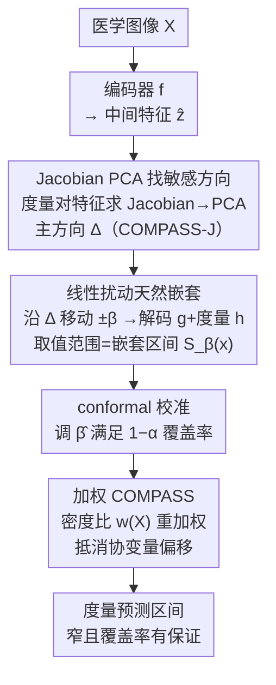

# COMPASS: Robust Feature Conformal Prediction for Medical Segmentation Metrics

- **会议**: ICLR2026
- **arXiv**: [2509.22240](https://arxiv.org/abs/2509.22240)
- **代码**: [GitHub](https://github.com/matthewyccheung/compass)
- **领域**: 医学图像分割 / 不确定性量化
- **关键词**: conformal prediction, medical segmentation, uncertainty quantification, feature perturbation, covariate shift

## 一句话总结

COMPASS 通过在分割网络的中间特征空间沿**对目标度量最敏感的低维子空间**进行线性扰动来构建 conformal prediction 区间，在四个医学分割任务上实现了比传统 CP 方法显著更窄的预测区间，同时保持有效覆盖率。

## 研究背景与动机

**领域现状**: 医学图像分割中，临床价值通常不在于像素级分割精度，而在于由分割推导出的**下游度量**（如器官面积/体积等放射组学指标）。Conformal Prediction (CP) 是一种无分布假设的不确定性量化框架，可为预测提供统计保证。

**痛点**: (1) 像素级 CP 方法（如生成像素级可信集）提供的保证与实际临床关心的标量度量不对齐；(2) 将分割-度量管道当作黑盒直接对输出标量做 CP（Split CP），区间虽对齐但**效率低**（区间太宽），因为未利用神经网络的归纳偏置。

**核心矛盾**: Feature CP (FCP) 已证明在语义特征空间中工作可以生成更紧的区间，但 FCP 需要在高维特征空间中求解复杂的对抗优化问题，对典型 CNN/Transformer 的特征维度**计算不可行**。

**目标**: 设计一种计算可行的 Feature CP 方法，利用分割网络的中间表征为下游临床度量生成**高效**（窄）且**有效**（覆盖率有保证）的预测区间。

**切入角度**: 不在全维特征空间搜索，而是利用**目标度量关于特征的梯度 Jacobian** 找到低维敏感子空间，只沿该方向扰动。

**核心 idea**: 对分割网络中间层特征计算目标度量的 Jacobian，通过 PCA 提取主方向作为扰动方向，沿此方向线性扰动特征即可单调改变度量——因此仅需两次前向传播（正/负端点）即可高效构建嵌套预测区间。

## 方法详解

### 整体框架

COMPASS 要解决的问题是：给一张医学图像和一个训练好的分割网络，临床真正关心的是分割推出的标量度量（如器官面积），怎样为这个度量配一条**又窄又有覆盖率保证**的预测区间。它把分割网络看成三段串联——编码器 $f: \mathcal{X} \to \mathcal{Z}$ 把图像压成中间特征、解码器 $g: \mathcal{Z} \to \mathcal{S}$ 还原分割、度量函数 $h: \mathcal{S} \to \mathbb{R}$ 算出标量。整条 pipeline 的核心动作是「在特征空间里轻轻推一下特征，看度量怎么变」：先对中间特征 $\hat{z}$ 算出度量最敏感的扰动方向 $\Delta$，再让特征沿这条方向移动 $\pm\beta$、经 $g$ 和 $h$ 传播，度量随之变化的范围就构成预测区间 $S_\beta(x) = [\min_{b \in [-\beta, \beta]} m_x(b),\, \max_{b \in [-\beta, \beta]} m_x(b)]$；最后用 conformal calibration 把 $\beta$ 调到目标覆盖率，遇到校准/测试分布不一致时再加一层密度比加权。

### 关键设计

**1. Jacobian PCA 找敏感方向：把全维搜索压成一条直线（COMPASS-J）**

FCP 之所以不可行，是因为它要在成百上千维的特征空间里做对抗优化。COMPASS 换了个思路：与其在所有方向上找，不如只盯住特征里对目标度量影响最大的那个方向。具体做法是，对训练集中每个样本 $i$ 计算目标度量 $\hat{y}$ 对特征 $\hat{z}_i$ 的 Jacobian $J_i = \frac{d\, h(g(\hat{z}_i))}{d\hat{z}_i}$，再沿空间维度求和压成通道级向量 $\mathcal{J}_i$；对训练集所有 $\mathcal{J}_i$ 做 PCA，取前 $L$ 个主成分 $V_L$。任意新样本的扰动方向就是它的 Jacobian 在这组主方向上的投影并归一化：

$$\mathbf{d}_i = V_L V_L^T \mathcal{J}_i, \quad \Delta_i = \mathbf{d}_i / \|\mathbf{d}_i\|_2$$

之所以敢只取主方向，是因为第一主成分通常解释了 >90% 的度量方差（实验验证）。更关键的是，沿这个主方向扰动在四个数据集上都表现出**单调的度量变化**——度量随扰动幅度只增不减或只减不增。单调意味着预测区间不必扫描整段 $[-\beta, \beta]$，只评估正负两个端点就拿到了最值，把高维优化彻底简化成两次前向传播。

**2. 线性扰动天然嵌套：让覆盖率保证白送**

CP 要有统计保证，预测集必须满足嵌套性——区间参数变大时旧区间被新区间包住。深度特征空间是非线性的，嵌套性并不是平凡成立的。COMPASS 用一个 conservative envelope 的构造绕过这个难点：把预测集定义为扰动区间上度量的取值范围 $S_\beta(x) = [\min m_x(b), \max m_x(b)]_{b \in [-\beta, \beta]}$。因为 $\beta_1 \leq \beta_2 \Rightarrow [-\beta_1, \beta_1] \subseteq [-\beta_2, \beta_2]$，更大的扰动范围里取最值只会让区间变宽不会变窄，于是 $S_{\beta_1} \subseteq S_{\beta_2}$ 从定义上就成立。有了嵌套性，再配上标准 CP 的交换性条件，marginal coverage 直接得到保证：

$$\mathbb{P}(Y_{n+1} \in S_{\hat{\beta}}(X_{n+1}) | D_{\text{tr}}) \geq 1 - \alpha$$

**3. 加权 COMPASS：用密度比抵消分布偏移**

校准集和测试集分布不一致（协变量偏移）时，等权分位数会算偏、覆盖率失守。COMPASS 训练一个辅助分类器去区分校准样本和测试样本，由它估计密度比 $w(X_i) = p_{\text{test}}(X_i) / p_{\text{cal}}(X_i)$，再用加权符合性分位数替代等权分位数来还原目标覆盖率。这里的讲究在于喂给分类器的输入：用模型深层特征或 Jacobian，而不是类别标签或 logits——前者携带的度量敏感信号更丰富，对偏移更敏感，因此在实验中两个偏移方向上都能稳住覆盖率。

### 损失函数

COMPASS 不修改分割模型的训练。面积度量通过对 logits 应用 soft sigmoid 后求和得到（可微），使 Jacobian 计算可行。

## 实验关键数据

### 主实验：不同 CP 方法的区间大小（像素², Mean±Std, α=0.10）

| 数据集 | COMPASS-J | COMPASS-L | E2E-CQR | Local CP | Output-CQR | SCP |
|--------|----------|----------|---------|----------|-----------|-----|
| H&E | **3160±336** | 3139±375 | 3433±293 | 4223±558 | 3879±369 | 3509±333 |
| Skin Lesion | **1179±53** | 1208±58 | 1351±75 | 2433±101 | 4581±36 | 1813±127 |
| Nodule | **2444±174** | 2510±180 | 2788±154 | 3311±133 | 5603±57 | 3076±200 |
| PolyP | **4056±293** | 4397±469 | 6184±616 | 5965±1011 | 4981±675 | 6237±564 |

> COMPASS-J 在所有数据集的所有 α 水平上均产生最窄区间。相比 SCP，Skin Lesion 上区间缩窄 **35%**，PolyP 上缩窄 **35%**。

### 消融实验：加权 CP 在分布偏移下的表现（α=0.10）

| 方法 | H&E (hard shift) 覆盖率 | Skin Lesion (easy shift) 覆盖率 |
|------|----------------------|---------------------------|
| 无加权 SCP | ❌ 欠覆盖 | ✅ 过覆盖 |
| 类别加权 SCP | ✅ | ❌ 欠覆盖 |
| COMPASS-L + 特征加权 | ❌ 欠覆盖 | ✅ |
| COMPASS-J + 特征加权 | ✅ **最窄** | ✅ **最窄** |
| COMPASS-J + Jacobian 加权 | ✅ **最窄** | ✅ **最窄** |

> 只有 COMPASS-J（深层特征或Jacobian加权）在**两种偏移方向**上同时维持目标覆盖率，且区间最窄。

### 关键发现

1. **单调性普遍成立**: 沿 COMPASS-J 方向扰动在所有四个数据集上均导致度量单调变化，使得高效端点算法成立
2. **压缩幂律关系**: 特征空间分数 $R_{\text{COMPASS}}$ 与输出空间误差 $R_{\text{SCP}}$ 之间存在亚线性缩放（log-log 斜率 <1），系统性压缩尾部分布，这是区间更紧的根本机制
3. **深层表征 > 浅层**: COMPASS-J（深层特征）始终优于 COMPASS-L（logits），因为深层特征提供更丰富的度量敏感信号

## 亮点与洞察

- "沿敏感子空间扰动"的核心思路优雅简约：Jacobian→PCA→一条直线→两个端点，将 FCP 的不可行优化问题简化到两次前向传播
- 单调性的经验验证非常关键——它是高效算法的前提，且可通过 Jacobian 第一主成分的解释方差预判
- 压缩幂律的发现为 COMPASS 的效率优势提供了深层解释，不仅是经验观察
- 加权 COMPASS 在分布偏移下的鲁棒性有实际临床意义

## 局限性

- COMPASS 性能依赖于预训练模型表征的质量——若特征与度量关系非单调，需退化为全扫描算法
- 加权 CP 在大分布偏移（校准与测试集特征空间重叠不足）时密度比估计不准确
- 仅验证了面积度量，对纹理、形状等更复杂度量的适用性未探讨
- 基于 U-Net 架构验证，对 Transformer 类分割架构的最优层选择可能不同

## 相关工作与启发

- **Feature CP** (Teng et al., 2022): 首次证明特征空间CP可产生更紧区间，但对抗搜索不可行
- **Lambert et al. (2024)**: 端到端 CQR 用 Tversky 损失训练像素级上下界，优化的是代理目标而非目标度量
- **Split CP / CQR**: 标准输出空间方法，简单但区间宽
- **启发**: COMPASS 的"Jacobian→PCA→主方向扰动"范式可推广到任何可微度量的不确定性量化（3D体积、形状指标等）

## 评分

⭐⭐⭐⭐⭐ (5/5)

- **创新性**: ⭐⭐⭐⭐⭐ — 将 FCP 的计算瓶颈通过 Jacobian PCA 降维优雅解决，理论证明和经验验证都很扎实
- **实验**: ⭐⭐⭐⭐⭐ — 4 数据集 × 3 α 水平 × 6 基线 × 100 随机划分，标准+分布偏移+消融，极为充分
- **实用性**: ⭐⭐⭐⭐⭐ — 代码开源、即插即用、对临床度量不确定性量化有直接价值
- **写作**: ⭐⭐⭐⭐ — 理论与实验结构清晰，图示直观

<!-- RELATED:START -->

## 相关论文

- [\[AAAI 2026\] Small but Mighty: Dynamic Wavelet Expert-Guided Fine-Tuning of Large-Scale Models for Optical Remote Sensing Object Segmentation](../../AAAI2026/medical_imaging/small_but_mighty_dynamic_wavelet_expert-guided_fine-tuning_of_large-scale_models.md)
- [\[ICLR 2026\] SEED: Towards More Accurate Semantic Evaluation for Visual Brain Decoding](seed_towards_more_accurate_semantic_evaluation_for_visual_brain_decoding.md)
- [\[AAAI 2026\] GuideGen: A Text-Guided Framework for Paired Full-Torso Anatomy and CT Volume Generation](../../AAAI2026/medical_imaging/guidegen_a_text-guided_framework_for_paired_full-torso_anatomy_and_ct_volume_gen.md)
- [\[AAAI 2026\] FaNe: Towards Fine-Grained Cross-Modal Contrast with False-Negative Reduction and Text-Conditioned Sparse Attention](../../AAAI2026/medical_imaging/fane_towards_fine-grained_cross-modal_contrast_with_false-negative_reduction_and.md)
- [\[CVPR 2025\] Multi-Resolution Pathology-Language Pre-training Model with Text-Guided Visual Representation](../../CVPR2025/medical_imaging/multi-resolution_pathology-language_pre-training_model_with_text-guided_visual_r.md)

<!-- RELATED:END -->
