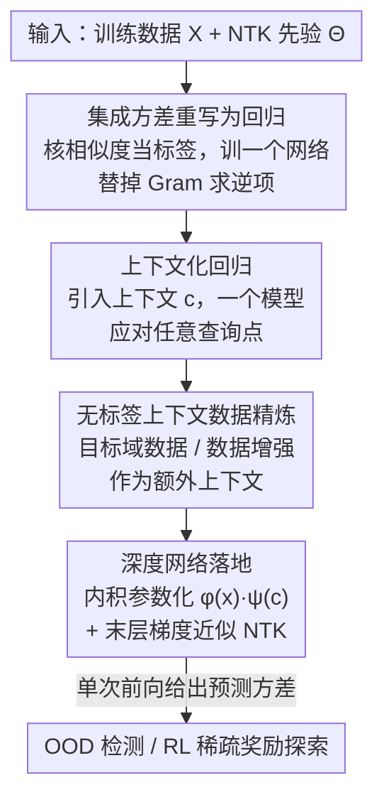

# Contextual Similarity Distillation: Ensemble Uncertainties with a Single Model

**会议**: ICLR 2026  
**OpenReview**: [https://openreview.net/forum?id=arms7s9dDK](https://openreview.net/forum?id=arms7s9dDK)  
**代码**: https://github.com/anyboby/contextual-similarity-distillation （有，另含 VizDoom 复现仓）  
**领域**: 强化学习 / 不确定性量化  
**关键词**: 认识不确定性、深度集成、神经正切核、单模型估计、稀疏奖励探索

## 一句话总结
用单个模型、单次前向就估计出"无穷大随机初始化集成"的预测方差——把集成方差重新表述成一个带核相似度标签的监督回归问题，从而无需真的训练集成、也无需求逆 Gram 矩阵，就能给出和深度集成相当甚至更好的不确定性，并在 OOD 检测和稀疏奖励 RL 探索上验证。

## 研究背景与动机
**领域现状**：不确定性量化是深度学习、尤其是强化学习的核心需求——探索时要靠它驱动"对不确定的动作更乐观"、离线 RL 要靠它压制高估、安全/医疗诊断要靠它做离群检测。目前最可靠的实用方案是**深度集成（deep ensembles）**：独立随机初始化训练若干个网络，用它们在同一输入上预测的方差当作认识不确定性（epistemic uncertainty）。完全贝叶斯推断理论上更漂亮，但要么近似很粗、要么采样很贵。

**现有痛点**：深度集成虽然比完整贝叶斯便宜，但仍然要**训练并保存好几个网络**，随着模型参数量增大，这个开销越来越难承受。理论上，宽网络集成的方差有解析表达式（见下文 NTK GP），但那个表达式里要对训练 Gram 矩阵 $\Theta(X,X)$ 求逆——在 RL 这种样本量动辄上亿的场景里，直接解析求解同样不可行。

**核心矛盾**：可靠的不确定性（来自集成的多样性）和计算可扩展性（单模型、单次前向）之间存在张力。已有的"单模型不确定性"方法（如 RND、预测误差类）大多缺乏一个明确的"这就是集成/后验方差"的理论解释，只是经验上能用。

**本文目标**：在**不真正训练、也不评估任何集成**的前提下，用一个模型直接估计出无穷大随机初始化集成的预测方差；并且要能用上无标签数据/数据增强来进一步精炼这个估计。

**切入角度**：作者从宽网络的可预测训练动力学出发——Jacot 等人的**神经正切核（NTK）**理论表明，无穷宽网络在梯度下降下的训练轨迹可被 NTK 解析刻画，集成则对应一个 **NTK 高斯过程（NTK GP）**，其预测方差有闭式解。关键观察是：这个闭式方差里那个"难算的求逆项"，恰好可以被重新解读为**另一个监督回归任务训练到收敛后的输出**。

**核心 idea**：把"估计集成方差"改写成"用核相似度当标签的回归问题"——训练单个网络去拟合"训练点和查询点之间的核相似度"，收敛后它的输出就等于难算的求逆项，于是方差 = 核先验 − 该回归输出，一次前向即得。

## 方法详解

### 整体框架
方法叫**上下文相似度蒸馏（Contextual Similarity Distillation, CSD）**。目标是逼近无穷大集成的预测方差。先看理论锚点：在 NTK 体制下，无穷宽网络集成（无穷多次随机初始化）在测试点 $x$ 的预测方差有闭式解

$$\mathbb{V}[f(x,\theta_\infty)] = \Theta(x,x) - \Theta(x,X)\Theta(X,X)^{-1}\Theta(X,x)$$

其中 $\Theta(\cdot,\cdot)$ 是 NTK（可理解为基于梯度表示的输入相似度），$X$ 是训练集。第一项 $\Theta(x,x)$ 是"核先验不确定性"，第二项才是麻烦——它含训练 Gram 矩阵的逆 $\Theta(X,X)^{-1}$，大数据/大模型下根本算不动。

CSD 的整条逻辑链是：**①** 先在"查询点已知"的简化设定下，把那个求逆项重写成单个网络的回归输出（单查询版）；**②** 再引入上下文变量 $c$，把"每个查询训一个模型"升级成"一个上下文化模型应对任意查询"；**③** 这套上下文化表述天然允许塞入无标签上下文数据（目标域数据/数据增强）来精炼方差估计；**④** 最后给出深度网络上的高效落地（内积参数化 + 只用末层梯度近似 NTK）。推理时输入 $x$，单次前向得到方差，可直接当 OOD 检测分数或 RL 内在奖励。

### 关键设计

**1. 把集成方差重写成回归问题：核相似度当标签，回归输出替掉 Gram 求逆**

痛点是闭式方差里 $\Theta(X,X)^{-1}$ 算不动。作者的关键洞察是：先在"测试查询点 $x_t$ 事先已知"的简化情形下，构造一个和 $f$ 同架构、同初始化分布（因而同 NTK）的网络 $g$，让它去解一个普通的监督回归——**标签函数取核相似度** $Y_{x_t}(X)=\Theta(X,x_t)$，即"每个训练点 $x_i$ 和查询点 $x_t$ 有多相似"。在小初始化（$g(x,\tilde\theta_0)\approx 0$）下，$g$ 训练到收敛后的输出恰好是

$$g_{x_t}(x,\tilde\theta_\infty) = \Theta(x,X)\Theta(X,X)^{-1}\Theta(X,x_t)$$

这正好是闭式方差里那个含求逆的麻烦项！于是查询点 $x_t$ 的集成方差可写成 $\mathbb{V}[f(x_t)] = \Theta(x_t,x_t) - g_{x_t}(x_t,\tilde\theta_\infty)$。妙在 $g$ 是普通梯度下降回归"自然"训出来的，全程**没有显式求逆、也没训练任何集成**。这把"不确定性估计"重新表述成了"预测核相似度的回归问题"——一个概念上很关键的视角转换。它的局限是：标签函数依赖具体 $x_t$，换一个查询点就得重训一个 $g$。

**2. 上下文化回归：一个模型应对任意查询点**

设计 1 每个查询训一个模型显然不实用。这里把 $g$ 升级成**带上下文变量的回归模型** $g(x,c,\tilde\theta_t)$：上下文 $c$ 决定训练时用哪个标签函数，即构造一族由 $c$ 参数化的标签函数 $Y_c(X)=\Theta(X,c)$。对一组上下文数据 $C=\{c_i\}$，模型被同时优化去解所有这些上下文对应的回归任务。直觉上，这相当于沿着新维度 $c$ 把设计 1 里一个个 $g_{x_t}$"缝合"起来、在它们之间插值。只要模型保持住近似的训练动力学，就能对任意查询点 $x$ 令 $c=x$ 评估：

$$\mathbb{V}[f(x,\theta_\infty)] \approx \Theta(x,x) - g(x,x,\tilde\theta_\infty)$$

这里 $g(x,x)$ 可解读为"集成通过观察训练数据、按与 $x$ 的相似度加权后获得的置信度"，方差就是先验不确定性 $\Theta(x,x)$ 减去这个置信度。代价是：对训练时没见过的上下文 $c\notin C$ 要靠 $g$ 泛化，且引入 $c$ 会扰动训练动力学，所以这一步进入了近似算法的范畴（原文附录 B.1 专门讨论了用到的近似及其影响）。

**3. 用无标签上下文数据精炼不确定性**

把方差估计写成上下文化回归后，带来一个"免费"的好性质：训练时可以塞入**无标签的上下文数据** $C$。理论上当查询点事先已知时能拿到精确方差（NTK 体制下），而上下文化表述意味着——只要手上有目标域的无标签数据，就把它们当上下文加进训练，就能在关心的域上得到更好的不确定性估计。更进一步，还能用**数据增强**生成上下文（沿用对比学习里那套增强）。值得强调的是：和对比学习不同，CSD 的增强**不需要保持原标签语义**，原则上任何无标签数据都能用。这对应文中三个变体——CSD（只用训练集当上下文）、CSD-Aug.（加数据增强）、CSD-OOD（用评估分布的无标签数据当上下文）。这条路把"自监督式利用无标签数据"引入了不确定性量化，而这在传统集成/MC dropout 里并不容易做到。

**4. 深度网络上的高效落地：内积参数化 + 末层梯度近似 NTK**

要在真实深度网络上跑得快，作者做了两处工程化近似。其一，把上下文化模型**参数化成内积形式** $g(x,c,\tilde\theta_\infty)=\phi(x,\tilde\theta_{\text{feat}})^\top\psi(c,\tilde\theta_{\text{ctxt}})$——可理解为给回归模型加了一层"由上下文 $c$ 决定的末层权重" $\psi(c)$；好处是 $g(X,C)$ 整个 $N_D\times N_C$ 矩阵能一次算出，不必对每个 $(x_i,c_j)$ 都跑一次前向。其二，**用末层梯度近似 NTK 先验**：完整 NTK $\Theta(x,x')$ 不参与反向传播，但对大模型仍可能很贵；作者发现只取末层权重 $\theta_0^L$ 的梯度就够用，此时若末层是稠密层 $f(x,\theta_0)=\varphi(x)^\top\theta_0^L$，则 $\Theta_L(x,x')=\varphi(x)^\top\varphi(x')$，即直接用倒数第二层特征的内积当核，进一步加速。训练就是个普通平方损失回归：从 $X$ 和 $C$ 里随机采样 $(x_i,c_i)$，最小化 $g(x_i,c_i)$ 与标签 $\Theta_L(x_i,c_i)$ 的平方差。上下文数据的最简选择是直接复用训练集 $c_i\sim X$，实践中就很好用。

### 损失函数 / 训练策略
核心训练目标是一个标准的监督平方损失回归：

$$\mathcal{L}(\tilde\theta_t) = \frac{1}{N}\sum_i^N \frac{1}{2}\big(g(x_i,c_i,\tilde\theta_t) - \Theta_L(x_i,c_i)\big)^2$$

其中 $(x_i,c_i)$ 从训练集 $X$ 和上下文集 $C$ 中随机采样，标签 $\Theta_L$ 用末层梯度近似的 NTK 给出。整个流程完全契合常规梯度下降训练管线——不需要训练多个模型、不需要随机前向采样、也不需要显式核矩阵求逆。

## 实验关键数据

### 主实验：分布漂移检测（OOD detection）
在 MNIST / FashionMNIST / KMNIST / NotMNIST 四个数据集上互为 ID/OOD（外加 ID 的扰动版），训练于一个、在其余漂移分布上评估不确定性，10 个种子、所有 ID/OOD 排列取平均。指标为 AUROC（OOD 样本不确定性高于 ID 样本的概率）、AUPR-IN、AUPR-OUT。

| 方法 | Acc. | AUROC | AUPR-IN | AUPR-OUT |
|------|------|-------|---------|----------|
| MC dropout | 94.39 | 85.67 | 81.73 | 86.44 |
| BNN-MCMC | 87.70 | 83.17 | 82.65 | 82.28 |
| BNN-Laplace | 90.86 | 81.38 | 79.43 | 81.84 |
| RND | 96.18 | 94.40 | 94.17 | 94.01 |
| ENS(3) | 96.91 | 92.30 | 92.83 | 91.37 |
| ENS(15) | 97.18 | 94.00 | 94.70 | 92.99 |
| **CSD** | 96.29 | **96.63** | **96.94** | **96.19** |
| **CSD-Aug.** | 96.28 | **98.22** | **98.51** | **97.80** |
| **CSD-OOD** | 96.30 | **98.57** | **98.86** | **98.19** |

单模型的 CSD 在 AUROC/AUPR 上**全面超过 15 成员的深度集成 ENS(15)** 以及 MC dropout、两种贝叶斯 NN、RND；加上数据增强（CSD-Aug.）或目标域无标签上下文（CSD-OOD）后还能再涨约 1.5–2 个点。注意分类精度（Acc.）上 CSD 略低于纯集成（96.3 vs 97.2），说明它的优势主要在"不确定性校准"而非分类性能本身。

### 第二实验：VizDoom 稀疏奖励探索
把 CSD 的不确定性当作 DQN 的内在奖励，在 VizDoom MyWayHome 的三档难度（Dense / Sparse / Very Sparse，出生点离目标越来越远）上跑视觉导航，10 个种子。对比 DQN、RND、bootstrapped DQN（BDQN+P）、信息导向采样（IDS-C51）。

### 关键发现
- **单模型打赢 15 成员集成**：CSD 用一个模型、一次前向就在 OOD 检测上超过 ENS(15)，是最直接的"可扩展性 + 可靠性兼得"证据。
- **无标签数据确实有用**：CSD-OOD > CSD-Aug. > CSD，证明上下文化表述带来的"塞无标签目标域数据/增强"这条路真的能精炼不确定性，这是传统集成不易做到的。
- **稀疏奖励探索最能拉开差距**：在 VizDoom 里**只有 CSD 在所有种子、所有环境下都找到了目标**，RND 次之；有趣的是 Sparse 档反而比 Very Sparse 更难（作者归因于出生点位于迷宫侧支）。
- **精度略让位于校准**：CSD 分类精度略低于纯集成，提示它的设计取向是把容量更多投向不确定性估计而非判别性能。

## 亮点与洞察
- **视角转换最漂亮**：把"估计集成方差"等价改写成"预测核相似度的监督回归"，让一个本来要求逆大矩阵/训练一堆模型的问题，落进了最普通的梯度下降回归管线——这个 reframing 本身比具体网络实现更有启发性。
- **上下文变量 $c$ 是把"单查询"变"通用"的枢纽**：用一族 $c$-参数化的标签函数把无数个 per-query 回归"缝"进一个模型，这种"上下文化标签函数"的思路可迁移到其他"每个查询都要解一次优化"的场景。
- **打通了自监督与不确定性量化**：因为增强不需要保标签，CSD 可以像对比学习那样吃任意无标签数据来改不确定性，这在 MC dropout / 集成里很难嵌入，是一个值得继续挖的接口。
- **工程化近似很务实**：内积参数化让 $N_D\times N_C$ 标签矩阵批量可算，末层梯度近似 NTK 把核计算压到一次特征内积，两个近似让理论方法真的能在高维 RL 上跑起来。

## 局限与展望
- **理论保证在近似下会松动**：精确等价只在 NTK 体制（无穷宽、查询点已知）下成立；引入上下文变量 $c$、要求对未见 $c$ 泛化、用末层梯度近似 NTK，都把方法推入"近似算法"范畴，实际偏离 NTK 理想的程度有多大原文未给出强保证（作者在附录 B.1 自陈这些近似）。
- **只刻画认识不确定性**：当前只估计 epistemic 方差，没有显式分离 aleatoric（数据噪声）不确定性；作者把"在一个模型里完整分离两类不确定性"列为未来方向。
- **实验规模偏小**：OOD 检测停留在 MNIST 家族、RL 限于 VizDoom，尚未在大规模视觉/连续控制/离线 RL 上验证可扩展性主张。
- **上下文/增强设计仍靠经验**：哪种增强、哪些无标签上下文最有助于不确定性，目前是沿用对比学习那套、缺乏针对不确定性量化专门设计的增强，作者也认为这是值得专门研究的方向。

## 相关工作与启发
- **vs 深度集成（Lakshminarayanan 2017）/ bootstrapped DQN**：它们靠训练多个随机初始化网络、用成员间方差度量不确定性，可靠但贵；CSD 用单模型直接估计"无穷集成"的方差，OOD 上反超 ENS(15)，省下训练 N 个模型的开销。
- **vs RND（Burda 2019）等单模型法**：RND 用预测误差当不确定性，经验有效但**缺乏"这是集成/后验方差"的理论解释**；CSD 同样单模型，却给出明确的 NTK GP 方差解释，OOD 上也优于 RND。
- **vs NTK GP 直接求解（He 2020）**：He 等给出集成方差的 NTK GP 闭式解，但要对大 Gram 矩阵求逆、对大数据/大模型不可行；CSD 把求逆项改写成梯度回归，规避了显式求逆。
- **vs 基于 NTK 的近期不确定性估计（Wilson 2025 采样式 / Calvo-Ordoñez 2024 多回归模型）**：后者要么靠采样、要么用多个回归模型；CSD 用单个上下文化回归模型实现单模型估计，更贴合标准深度学习训练。

## 评分
- 新颖性: ⭐⭐⭐⭐⭐ 把集成方差等价改写成核相似度回归、再上下文化成单模型，是一个干净且有理论根基的新视角
- 实验充分度: ⭐⭐⭐ 结论清晰（单模型胜 15 集成、唯一全解 VizDoom），但数据集规模偏小、缺大规模/离线 RL 验证
- 写作质量: ⭐⭐⭐⭐ 从 NTK 理论到工程落地推导连贯，近似与局限交代诚实
- 价值: ⭐⭐⭐⭐ 给"可扩展不确定性量化"提供了原则性单模型方案，对 RL 探索/OOD 检测都有直接用处

<!-- RELATED:START -->

## 相关论文

- [\[ICLR 2026\] CUPID: A Plug-in Framework for Joint Aleatoric and Epistemic Uncertainty Estimation with a Single Model](cupid_a_plug-in_framework_for_joint_aleatoric_and_epistemic_uncertainty_estimati.md)
- [\[CVPR 2026\] From Infusion to Assimilation Distillation for Medical Image Segmentation](../../CVPR2026/medical_imaging/from_infusion_to_assimilation_distillation_for_medical_image_segmentation.md)
- [\[CVPR 2026\] Momentum Memory for Knowledge Distillation in Computational Pathology](../../CVPR2026/medical_imaging/momentum_memory_for_knowledge_distillation_in_computational_pathology.md)
- [\[CVPR 2026\] PDD: Manifold-Prior Diverse Distillation for Medical Anomaly Detection](../../CVPR2026/medical_imaging/pdd_manifold-prior_diverse_distillation_for_medical_anomaly_detection.md)
- [\[ICLR 2026\] Spike-based Digital Brain: A Novel Fundamental Model for Brain Activity Analysis](spike-based_digital_brain_a_novel_fundamental_model_for_brain_activity_analysis.md)

<!-- RELATED:END -->
