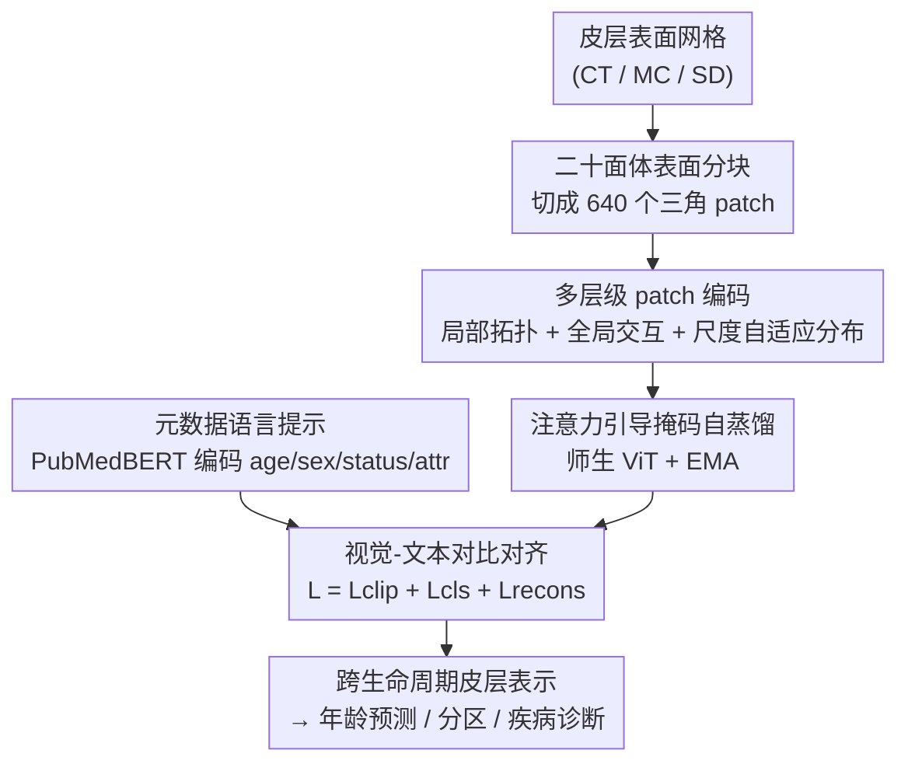

# CortiLife: A Unified Framework for Cortical Representation Learning across the Lifespan

**会议**: ICLR2026  
**OpenReview**: [https://openreview.net/forum?id=aHFqIC86Ya](https://openreview.net/forum?id=aHFqIC86Ya)  
**代码**: 待确认  
**领域**: 医学图像 / 脑皮层表示学习 / 视觉-语言预训练  
**关键词**: 皮层表面, 跨生命周期, 二十面体分块, 掩码自蒸馏, 元数据提示

## 一句话总结
CortiLife 把 CLIP 式视觉-语言预训练第一次搬到非欧的大脑皮层表面上，用「二十面体分块 + 三流多层级编码 + 注意力引导掩码自蒸馏 + 元数据语言提示」做出一个能横跨婴儿到老年的统一皮层表示，在年龄预测、皮层分区和四类脑疾病诊断上全面超过 CLIP/ACLIP/DetailCLIP 等 SOTA。

## 研究背景与动机
**领域现状**：大脑皮层的厚度（CT）、表面积、平均曲率（MC）、沟深（SD）等形态学指标是研究脑发育、衰老和疾病的关键生物标志物。为了在这种「球面拓扑」上做表示学习，主流做法是 Spherical CNN / Spherical U-Net（在重采样后的皮层网格上做球面卷积、池化）和 Surface Vision Transformer（在皮层 patch 上做自注意力）。

**现有痛点**：这些模型几乎都只在**单一年龄段队列**上训练（要么只做婴儿、要么只做老年），无法刻画大脑跨越整个生命周期的剧烈结构变化，泛化性很差。另一条线 CLIP 式视觉-语言模型在 2D 自然图像和医学影像（X 光、MRI、CT）上很成功，但直接迁到皮层表面会撞上三道墙。

**核心矛盾**：把 CLIP 范式搬到皮层表面，要同时解决三个相互纠缠的难题——(1) 皮层是高度折叠的**非欧流形**，标准方形/立方 patch 切不动；(2) 为了跨被试可比，预处理会把每个人的皮层**配准**到公共模板，这一步会抹平个体的脑回-脑沟折叠差异，导致不同被试对应 patch 高度相似，**个体化信息被同质化**；(3) 不同年龄段、不同模态（CT/MC/SD）的皮层特征**分布漂移**严重，统一建模困难。

**本文目标**：造一个跨整个生命周期、跨模态都能用的统一皮层表示框架，子问题就是分别破上面三道墙。

**切入角度**：作者的观察是——皮层数据天然适合「先 token 化、再做视觉-语言对齐」这一套，关键在于 token 化阶段要专门设计成能保留局部拓扑、又能抗同质化与分布漂移；同时被试的元数据（年龄、性别、健康状态、特征类型）本身就携带「发育语义」，可以当文本端来引导视觉编码器。

**核心 idea**：用一个「面向流形的表面 tokenizer + 元数据文本提示的视觉-语言对齐」框架，让一套表示同时具备**年龄感知**和**模态感知**能力。

## 方法详解

### 整体框架
CortiLife 的输入是单一形态学模态的皮层表面网格 $x_c \in \mathbb{R}^{N_v \times 1}$（每个顶点存一个 CT/MC/SD 值，全脑 81,924 个顶点），输出是一套既能冻结编码器直接用、又能微调下游的通用皮层表示。整条管线分三段：先用**表面 tokenizer** 把非欧皮层流形压成紧凑 token（分块 + 三流多层级编码），再用**掩码自蒸馏**做视觉表示学习（师生网络 + 注意力引导掩码），最后用**元数据语言提示**把年龄/性别/健康/特征类型这些信息编码成文本、和视觉表示做 CLIP 式对比对齐。三个损失（重建 + 对齐 + 图文对比）联合训练。

### 关键设计

**1. 二十面体表面分块：把非欧皮层切成等顶点数的三角 patch**

第一道墙是皮层的非欧流形结构，方形/立方 patch 切不动。作者采用二十面体细分策略：先把皮层细分成局部三角面片，再聚合成规则的三角形 patch，使**每个 patch 含相同顶点数**。给定 $N_v$ 个顶点的皮层图 $x_c \in \mathbb{R}^{N_v \times 1}$，重组后得到三角 patch 集合 $x_p \in \mathbb{R}^{P \times N_p}$，其中 $P=640$（每个半球 320 个 patch），$N_p$ 是每个 patch 的顶点数。这一步把 ViT 那套「图像切 patch」的范式安全地搬到了球面拓扑上，又不破坏皮层的几何连续性，是后面所有编码的前提。

**2. 三流多层级 patch 编码：同时抗同质化和分布漂移**

光分块还不够，配准带来的同质化和跨年龄分布漂移都发生在 token 化阶段。作者给每个 patch 设计了**三条互补的编码流**：

- **局部拓扑编码**——用球面卷积构成的 Spherical ResBlock（1 个 stem + 4 层 BN + 4 层带残差的球面卷积）抓 patch 内细粒度的几何/形态线索，把 $x_p \in \mathbb{R}^{1\times N_p}$ 编成 $e^L_p \in \mathbb{R}^{1\times M_v}$。这些细粒度特征是区分个体、抵抗同质化的基础。
- **全局交互编码**——4 层自注意力 + 4 层前馈，跨 patch 建长程依赖，得到 $e^G_p \in \mathbb{R}^{1\times M_p}$，给出刻画全脑结构变化的整体视角。
- **patch 级分布编码（尺度自适应编码器）**——这是专门对付分布漂移的核心。先在每个 patch 内统计均值 $x_{pm}$ 和标准差 $x_{ps}$，再投影到 $n$ 个尺度空间：

$$z_i(x_m) = \mathrm{LN}(x_m \cdot w_i + k_i \cdot b_i),\quad i\in[1,\dots,n],\ x_m\in[x_{pm}, x_{ps}]$$

其中 $k_i$ 是预设尺度值，$w_i, b_i$ 是第 $i$ 个尺度空间的可学习权重和偏置，$k_i \cdot b_i$ 充当「尺度相关偏置」把统计量映到不同尺度空间。然后用一个门控权重把多尺度表示聚合起来：

$$y(x_m)=\sum_{i=1}^{n}\alpha_i(x_m)\cdot z_i(x_m),\quad \alpha_i(x_m)=\frac{\log^{-1}\!\big(\tfrac{|x_m|}{k_i}+\epsilon\big)}{\sum_{j=1}^{n}\log^{-1}\!\big(\tfrac{|x_m|}{k_j}+\epsilon\big)}$$

与 patch 内在分布越契合的尺度被赋更大权重，于是它既**统一了跨年龄的分布层级**、又**保留了各年龄段特有的分布特征**，输出 $e^S_p \in \mathbb{R}^{P\times M_s}$。最后把三流特征沿通道拼接、过一个线性层做通道交互，得到每个 patch 的 token $e_{tokenizer}\in\mathbb{R}^{1\times(M_v+M_p+2M_s)}$（$M_v{=}256, M_p{=}256, M_s{=}32$）。

**3. 注意力引导的掩码自蒸馏：让模型重建细节的同时对齐发育语义**

皮层有大量空间冗余，天然适合 MAE 式掩码重建。但作者的目标不止重建，还要和元数据做 CLIP 对齐——而随机掩码不能保证「发育上信息量大的区域」可见，会损害对齐。于是改用**师生自蒸馏**：师生共享 10 层 Transformer，教师用 EMA 从学生更新；教师处理全部 patch token 抓整体表示，学生只看被掩码后的子集。**掩码哪些 patch 不是随机决定，而是由教师的自注意力分数决定**：

$$\mathrm{AttScore}_j=\frac{1}{H}\sum_{i=1}^{H}\mathrm{Softmax}\!\Big(\frac{Q_i\cdot K_i(j)}{\sqrt{d}}\Big)$$

其中 $Q_i$ 是发育感知的 [CLS] token 的 query，$K_i(j)$ 是第 $i$ 个头里 patch $j$ 的 key。保留注意力权重最高的 25% 区域，让学生专注最有信息量的皮层区域。训练用两个损失：重建损失

$$L_{recons}=\frac{1}{|M|}\sum_{i\in M}|\hat{x}_i-x_i|^2+\frac{1}{|V|}\sum_{i\in V}|\hat{x}_i-x_i|^2$$

（$M$/$V$ 是掩码/可见 patch 的顶点），以及用 KL 散度约束师生全局表示一致的对齐损失 $L_{cls}=\lambda\cdot \mathrm{KL}\big(p(t)\,\|\,p(s)\big)$。

**4. 元数据语言提示 + 对比对齐：让表示同时年龄感知与模态感知**

为了跨生命周期、跨模态都鲁棒，作者把元数据（年龄、性别、健康状态、特征类型）灌进文本端引导视觉编码器学发育语义。文本编码器用生物医学领域预训练的 **PubMedBERT**，提供固定语义空间、对相似元数据给出可判别 embedding；提示模板为「The age of the subject is [age]. The gender of the subject is [gender]. Health status: [status]. Attribute: [feature type].」。视觉 embedding $E^i_{student}$ 与文本 embedding $T_j$ 做对比学习，相似度 $s_{i,j}=\frac{E^i_{student}\cdot T_j}{\|E^i_{student}\|\|T_j\|}$、logits 由可学习温度 $\tau$ 缩放，再做双向（图→文 $L_{I2T}$ 与文→图 $L_{T2I}$）匹配，$L_{clip}=(L_{I2T}+L_{T2I})/2$。总损失把三者相加：$L=L_{clip}+L_{cls}+L_{recons}$。正是「把年龄/模态写进文本提示」这一步，让一套表示同时具备年龄感知和模态感知。

### 损失函数 / 训练策略
预训练用 AdamW（lr=5e-4，weight decay=1e-4），batch size 64，10 个 epoch，4 张 NVIDIA 3090；下游微调用 SGD（lr=0.001），batch size 40，单卡 200 epoch。掩码比例的选择见原文附录（⚠️ 具体值以原文为准）。

## 实验关键数据

数据集横跨整个生命周期，共 9 个数据集、13,928 个样本，年龄从 26 周（胎儿/婴儿）一路到 95 岁；用 CT、MC、SD 三种皮层模态做泛化评估，每例预处理后 81,924 个顶点（每半球 40,962）。评估分两档：冻结编码器（年龄预测 + 皮层分区）与微调编码器（四类脑疾病诊断）。

### 主实验

冻结编码器下，CortiLife 在年龄预测（MAE，越低越好）和皮层分区（DICE，越高越好）上全面领先：

| 任务 | 指标 | 模态 | CortiLife | 次优 baseline |
|------|------|------|-----------|--------------|
| 年龄预测 | MAE↓ | CT / MC / SD | 3.124 / 2.990 / 3.006 | DetailCLIP 3.156 / 3.112 / 3.137 |
| 皮层分区 | DICE↑ | CT / MC / SD | 0.905 / 0.925 / 0.957 | DetailCLIP 0.785 / 0.804 / 0.832 |

皮层分区上对次优分别领先 0.120 / 0.121 / 0.038，提升幅度相当大。微调编码器做脑疾病诊断（CHD 婴幼儿期 / ADHD 青少年-成人 / AD 老年），对比 9 个 SOTA（5 个非预训练 + 4 个预训练）：

| 模态 | 数据集 | 指标 | CortiLife | 说明 |
|------|--------|------|-----------|------|
| CT | CHD / ADHD / AD | ACC | 0.806 / 0.697 / 0.928 | 较最强 baseline 提升 1.4% / 1.6% / 0.2% |
| MC | CHD / ADHD / AD | ACC | 0.667 / 0.632 / 0.939 | 全部最优 |
| SD | CHD / ADHD / AD | AUC | 0.799 / 0.657 / 0.991 | 较次优 ACC 提升 1.8% / 0.7% / 1.6% |

结论是：跨所有生命周期阶段、跨所有模态都达到 SOTA，泛化能力得到验证。

### 消融实验

三流编码缺一不可（脑疾病诊断任务，✓/✗ 表示保留/去掉某一流）：

| local | global | statistical | CHD-ACC(CT) | CHD-AUC(MC) | 说明 |
|:---:|:---:|:---:|:---:|:---:|------|
| ✗ | ✓ | ✓ | 0.738 | 0.677 | 去局部拓扑 |
| ✓ | ✗ | ✓ | 0.740 | 0.610 | 去全局交互 |
| ✓ | ✓ | ✗ | 0.792 | 0.718 | 去尺度自适应分布 |
| ✓ | ✓ | ✓ | **0.806** | **0.776** | 完整模型 |

另外用最大均值差异（MMD）直接验证了尺度自适应编码器的抗漂移效果：

| 条件 | 1-3岁 vs 6-66岁 | 6-64岁 vs 55-95岁 | 1-3岁 vs 55-95岁 |
|------|:---:|:---:|:---:|
| 编码前 | 0.852 | 0.592 | 1.029 |
| 编码后 | 0.473 | 0.271 | 0.933 |

### 关键发现
- **三流缺一不可，全局交互流最敏感**：去掉全局交互后 MC 的 AUC 从 0.776 掉到 0.610，掉幅最大；去局部拓扑次之；尺度自适应分布流去掉也有可见下降。说明长程跨 patch 依赖对皮层这种全局结构变化最关键。
- **尺度自适应编码器真的在压分布漂移**：MMD 在三对跨年龄组合上都显著下降（如 1-3 岁 vs 6-66 岁从 0.852 → 0.473），直接证明它统一了跨年龄分布层级。
- **t-SNE 可视化**：在 ADNI 上，仅喂皮层特征（不给文本）得到的 embedding 沿年龄连续呈平滑梯度，且能区分性别异质性、并把这种异质性延伸到疾病状态，说明学到的表示确实编码了发育语义。

## 亮点与洞察
- **把 CLIP 范式第一次搬到非欧皮层表面**：核心难点不在对比学习本身，而在「token 化」要专门为流形 + 同质化 + 分布漂移设计，这个 problem framing 很干净，把脑表面表示学习和大模型范式接上了。
- **尺度自适应编码器是个可迁移的小工具**：用一组可学习尺度基 + 对数门控权重去吸收跨域分布漂移，本质是 domain-shift 友好的归一化，思路可以迁到任何「同一指标在不同子群分布不同」的医学/时序场景。
- **注意力引导掩码替代随机掩码**：MAE 的随机掩码对「需要语义对齐」的任务是有害的，用教师 [CLS] 注意力挑出发育信息量最高的 25% 区域，让重建和对齐这两个本来有张力的目标能共存，是个值得复用的 trick。
- **元数据当文本提示**：把结构化元数据（年龄/性别/健康/模态）写成自然语言喂 PubMedBERT，等于免费拿到一个发育语义先验，比纯视觉自监督多了一条监督信号。

## 局限与展望
- 只覆盖 CT/MC/SD 三种形态学模态，没有结合功能 MRI、扩散 MRI 等其他模态；多模态联合是自然延伸。
- 强依赖**配准后**的标准皮层模板（81,924 顶点、二十面体细分），对配准质量和预处理管线敏感；虽然显式对抗了配准同质化，但整个框架仍建立在配准之上。
- 元数据提示模板是固定句式，依赖元数据完整可得（年龄/性别/诊断标签齐全），对元数据缺失或噪声的鲁棒性未讨论。
- 疾病诊断都是二分类（病 vs 健康对照），且部分提升幅度较小（如 CT 上 AD 只提升 0.2%），临床多分类/细分型场景下的优势还需验证。

## 相关工作与启发
- **vs Spherical CNN / Spherical U-Net / Surface ViT**：它们尊重球面拓扑、在分区和发育映射上有效，但都局限在特定队列/发育阶段；CortiLife 用统一的视觉-语言预训练 + 尺度自适应分布编码，第一次做到跨整个生命周期泛化。
- **vs CLIP / ACLIP / DetailCLIP / CARZero**：这些是 2D 或体素影像上的 CLIP 变体，没法处理非欧皮层表面；CortiLife 的表面 tokenizer 把它们缺的「流形 token 化」补上，因而在冻结和微调两档都全面超过它们。
- **vs BiomedCLIP / UniMed-CLIP 等医学 CLIP**：同属医学领域的视觉-语言预训练，但都聚焦图像/体积数据，留下了非欧皮层表面这块空白，CortiLife 正是填这块空白。

## 评分
- 新颖性: ⭐⭐⭐⭐⭐ 首个面向皮层表面、跨生命周期的视觉-语言框架，表面 tokenizer 与尺度自适应编码器都是针对性创新
- 实验充分度: ⭐⭐⭐⭐⭐ 9 数据集 1.3 万样本横跨胎儿到老年，覆盖 3 模态 × 6 下游任务，含 MMD/t-SNE 等机制级验证
- 写作质量: ⭐⭐⭐⭐ 动机三道墙讲得清楚、图文对应好；部分符号和附录细节需查原文
- 价值: ⭐⭐⭐⭐⭐ 给脑影像表示学习接上大模型范式，多个下游任务有现实临床意义

<!-- RELATED:START -->

## 相关论文

- [\[ICLR 2026\] Anatomy-aware Representation Learning for Medical Ultrasound](anatomy-aware_representation_learning_for_medical_ultrasound.md)
- [\[CVPR 2026\] Focus-to-Perceive Representation Learning: A Cognition-Inspired Hierarchical Framework for Endoscopic Video Analysis](../../CVPR2026/medical_imaging/focus-to-perceive_representation_learning_a_cognition-inspired_hierarchical_fram.md)
- [\[CVPR 2025\] CycleULM: A Unified Label-Free Deep Learning Framework for Ultrasound Localisation Microscopy](../../CVPR2025/medical_imaging/cycleulm_a_unified_label-free_deep_learning_framework_for_ultrasound_localisatio.md)
- [\[CVPR 2026\] GaussianPile: A Unified Sparse Gaussian Splatting Framework for Slice-based Volumetric Reconstruction](../../CVPR2026/medical_imaging/gaussianpile_a_unified_sparse_gaussian_splatting_framework_for_slice-based_volum.md)
- [\[CVPR 2026\] MuViT: Multi-Resolution Vision Transformers for Learning Across Scales in Microscopy](../../CVPR2026/medical_imaging/muvit_multi-resolution_vision_transformers_for_learning_across_scales_in_microsc.md)

<!-- RELATED:END -->
