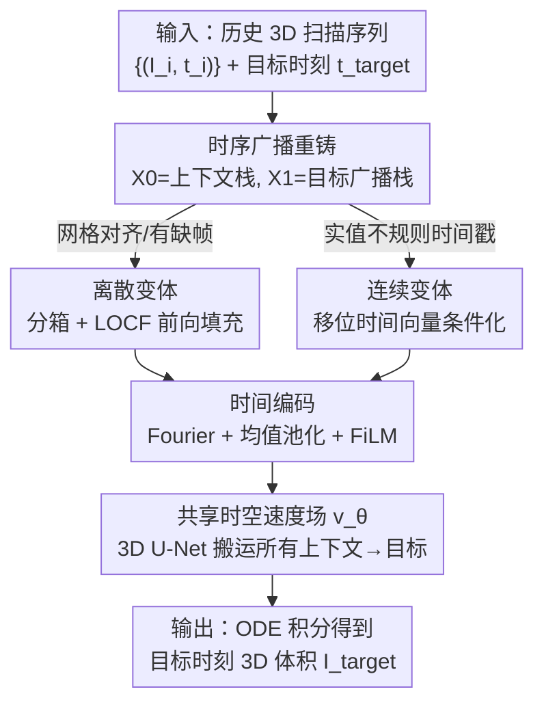

# CRONOS: Continuous time reconstruction for 4D medical longitudinal series

**会议**: ICLR2026  
**OpenReview**: [https://openreview.net/forum?id=XxqdbYD74l](https://openreview.net/forum?id=XxqdbYD74l)  
**代码**: https://github.com/MIC-DKFZ/Longitudinal4DMed （待开源）  
**领域**: 医学图像 / 时空预测 / 流匹配  
**关键词**: 4D 医学影像、纵向序列、连续时间、流匹配、序列到图像预测

## 一句话总结
CRONOS 把流匹配（Flow Matching）重铸成"序列到图像"的搬运问题，用一个共享的时空速度场把多张历史 3D 扫描同时朝目标体积搬运，从而在一个模型里同时支持网格对齐（discrete）和任意实值时间戳（continuous）的体素级 4D 医学影像预测，在 Cine-MRI、灌注 CT、纵向胶质瘤 MRI 三个数据集上全面超过现有时空基线和强启发式 LCI。

## 研究背景与动机
**领域现状**：纵向医学影像（同一病人在数月到数年间的多次扫描，或天然时空模态如超声 / cine-MRI / 灌注 CT）是疾病进展监测、疗效评估、发育评估的核心数据。但当前医学影像里的时空学习绝大多数停留在单时间点（image-to-image）分析上。

**现有痛点**：现有方法各有硬约束，没有一个能同时满足"多输入 + 高保真 + 3D + 连续时间"四个条件：医学生成方法（BrLP、ImageFlowNet 等）大多只吃单张先验扫描，或绑死某种疾病（如 Alzheimer 占了纵向研究不成比例的份额）、或只面向全局标签；自然视频预测方法（ConvLSTM、SimVP、ViViT、视频扩散）是为大规模 2D 稠密视频设计的，迁移到"数据量小、序列稀疏"的 3D 医学影像上表现很差；插值类方法只能填两次采集之间的中间帧，做不了向未来外推的预测。

**核心矛盾**：临床真实采集是**不规则**的——一个病人几年里也就拍几次，时间戳是连续实值而非整齐网格。若硬把它量化到网格：网格太粗会丢时间精度，太细（如按天分辨率拍几年）会让序列长度膨胀到上千、绝大多数槽位是空的，计算爆炸。也就是说"固定网格"这个前提本身和临床数据的稀疏不规则性是冲突的。

**本文目标**：做一个统一框架，从**多张**过去扫描做 many-to-one 预测 $\{I_i, t_i\}_{i=1}^{T}, t_{\text{target}} \mapsto I_{\text{target}}$，在**同一个模型**里既能处理离散网格、也能直接吃任意实值时间戳，且不依赖任何特定疾病假设，全程在 3D 体素空间操作。

**切入角度**：作者注意到流匹配（FM）本质是学一个 ODE，把一个分布 $p$ 沿直线路径搬到另一个等维分布 $q$。如果把"上下文图像序列"当成起点分布、把"目标图像（广播成同形状的栈）"当成终点分布，那么 FM 天然就变成了"序列到图像的搬运"。

**核心 idea**：用一个共享速度场 $v_\theta$ 把 $T$ 张上下文体积**同时**朝目标搬运（temporal broadcasting），把真实采集时间戳作为条件注入流方程，从而把流匹配从"噪声→图像"改造成"历史扫描序列→任意时刻目标扫描"。

## 方法详解

### 整体框架
CRONOS 要解决的是：给一组带时间戳的历史 3D 扫描 $\{(I_i, t_i)\}_{i=1}^{T}$ 和一个目标时间 $t_{\text{target}}$，预测出目标时刻的 3D 体积 $I_{\text{target}}$。它的核心转法是把这个预测问题**重铸成流匹配的搬运问题**：经典 FM 学一条从噪声 $X_0\sim p$ 到样本 $X_1\sim q$ 的速度场，CRONOS 则令起点 $X_0=[I_1,\dots,I_T]$ 是上下文序列、终点 $X_1=[I_{\text{target}},\dots,I_{\text{target}}]$ 是把目标图像广播 $T$ 份后的栈——于是同一个速度场 $v_\theta$ 会**同时**把所有 $T$ 张上下文体积沿各自路径搬向目标，等价于在共享参数下做 $T$ 次逐帧搬运。

围绕这个重铸，CRONOS 给出两个互补变体共用同一个 3D U-Net 骨干：**discrete 变体**先把不规则序列分箱到固定网格、用"最近观测前向填充"补缺帧，把时间隐式编码进流步 $\tau$ 和帧序；**continuous 变体**则跳过网格化，直接把实值时间戳作为条件喂进网络，让流步 $\tau$ 携带真实时间信息。时间（流步与真实时间戳）通过 Fourier 编码 + 跨序列平均池化后用 FiLM 注入每个残差层。训练时学速度场逼近常量真值速度 $X_1-X_0$，推理时用数值 ODE 求解器从 $X_0$ 积分到 $X_1$ 得到预测。

### 关键设计

**1. 时序广播：把流匹配重铸成序列到图像搬运**

痛点直接来自动机：经典流匹配只会在两个**等维**分布之间学搬运（噪声→图像），而"多张历史扫描→单张目标"是不等维的，套不进 FM。CRONOS 的做法是把目标图像**广播**成和上下文序列同形状的栈：令 $X_0=[I_1,\dots,I_T]$，$X_1=[I_{\text{target}},\dots,I_{\text{target}}]$，这样 $X_0,X_1$ 维度对齐，FM 的直线耦合 $X_\tau=(1-\tau)X_0+\tau X_1+\sigma(\tau)\epsilon$ 就合法了。沿这条直线路径，真值速度是常量 $u_\tau(X_\tau)=X_1-X_0$，于是训练目标退化为一个干净的回归损失

$$\mathcal{L}_{\text{CFM}}=\mathbb{E}_{X_0,X_1,\tau}\,\lVert v_\theta(X_\tau,\tau)-(X_1-X_0)\rVert_2^2.$$

这一步的巧妙在于：广播后单个共享速度场 $v_\theta$ 一次前向就把全部 $T$ 张上下文同时朝目标搬运，等价于 $T$ 路逐帧搬运但共享参数——既利用了多输入（比单上下文方法精度高），又把多对一预测干净地表达成了一次流搬运，而不需要复杂的序列建模架构。

**2. 离散变体：分箱网格 + LOCF 前向填充处理缺帧**

当采集近似落在规则网格上、但存在缺帧时，CRONOS 先用分箱算子 $E^{\text{grid}}_g$ 把每张 $I_i$ 按时间戳 $t_i$ 指派到最近的网格索引，再用"最近观测前向填充"（Last-Observation-Carry-Forward, LOCF）算子 $F_{\text{LOCF}}$ 把空槽用最近一次可得的扫描补上：

$$X_0=\big(F_{\text{LOCF}}\circ E^{\text{grid}}_g\big)\big(\{(I_i,t_i)\}_{i=1}^{T}\big)=[\hat I_1,\dots,\hat I_K].$$

缺帧先零初始化、再被最近观测替换。这样 $X_0$ 在均匀网格上被良定义，时间顺序通过流步 $\tau$ 和帧索引**隐式**捕获，无需显式时间戳。作者在此变体下设噪声强度 $\sigma=0$（训练与推理都是），并在消融里验证了非零噪声的影响。这个设计让优化更稳、保住了帧序，缺点是当真实时间不规则时强行上网格会带来计算浪费。

**3. 连续变体：实值时间戳直接条件化**

这是 CRONOS 真正区别于所有基线的地方，也是"连续时间"的落点。它跳过分箱和 LOCF，直接把实值时间戳作为条件注入。具体地，沿流步 $\tau$ 构造一个**移位时间向量**，把上下文时间戳整体朝目标时间插值：

$$T_\tau=(1-\tau)\,t_{\text{ctx}}+\tau\,t_{\text{target}},$$

并用它条件化速度场，轨迹变为 $X_1=X_0+\int_0^1 v_\theta(X_\tau,T_\tau)\,d\tau$。这样流步 $\tau$ 携带了**真实**时间几何信息，能在任意目标时刻做预测（插值或外推），既不用零填充也不用人造帧。它的计算量只随上下文图像数量增长，而不随网格范围 $K\cdot\Delta$ 增长，因此比离散变体更省显存、训练更快——这正好对上临床数据"采集次数少、间隔不规则"的特点。论文还显示：若把时间戳信息完全去掉，连续变体相对离散变体的优势会进一步拉大，说明增益确实来自对真实时间的建模。

**4. 时间编码：Fourier 嵌入 + 均值池化 + FiLM 注入**

流步和连续时间都需要喂进网络且要兼容变长序列。CRONOS 用 Fourier 特征 $\gamma(t)=[\sin(2\pi f_k t),\cos(2\pi f_k t)]_{k=1}^{K}$ 编码时间。为了在变长输入下保持维度一致，连续设定里把各上下文时间嵌入做**均值池化** $\text{Enc}(t)=\frac{1}{T}\sum_{i=1}^{T}\gamma(t_i)$，再通过 FiLM 加到每个残差层上。这个看似简单的设计解决了"序列长度不固定、不能直接拼接时间嵌入"的工程难题，让同一个 3D U-Net 骨干能无缝吃下不同长度的上下文序列。

### 损失函数 / 训练策略
训练损失就是流匹配的速度回归 $\mathcal{L}=\lVert v_\theta(T'_\tau, X_\tau)-(I_{\text{target}}-I)\rVert^2$（按 Algorithm 1）：每步采一个病人序列、采随机流步 $\tau\sim U(0,1)$、把目标重复 $T$ 份、插值时间戳 $T'_\tau=(1-\tau)[t_1,\dots,t_n]+\tau\,t_{\text{target}}$、线性插值 $X_\tau=(1-\tau)I+\tau I_{\text{target}}+\sigma(\tau)\epsilon$，用 AdamW 更新。推理时初始化 $X_0\leftarrow I$，在 $\{\tau_0=0,\dots,\tau_N=1\}$ 网格上用 ODE 数值积分求 $\hat X_N$。离散变体取 $\sigma=0$。

## 实验关键数据

### 主实验
三个公开数据集：ACDC（心脏 cine-MRI）、ISLES（卒中灌注 CT）、Lumiere（纵向胶质瘤 MRI）。指标为 NRMSE↓、SSIM↑、PSNR↑，报告三次运行的均值（标准差）。LCI（Last Context Image，直接复用最后一张可得扫描）是一个出乎意料地强的启发式下界。

| 数据集 | 方法 | NRMSE [$10^{-2}$]↓ | SSIM [%]↑ | PSNR [dB]↑ |
|--------|------|------|------|------|
| ACDC | LCI | 4.48 | 92.79 | 28.918 |
| ACDC | SimVP | 9.27 | 49.08 | 20.715 |
| ACDC | ViViT | 13.90 | 17.06 | 17.252 |
| ACDC | **CRONOS discrete** | 3.97 | **94.51** | **30.510** |
| ACDC | **CRONOS cont.** | **3.74** | 94.34 | 29.750 |
| ISLES | LCI | 5.25 | 96.29 | 29.002 |
| ISLES | SimVP | 13.06 | 48.82 | 20.799 |
| ISLES | **CRONOS discrete** | 4.50 | **97.33** | 30.542 |
| ISLES | **CRONOS cont.** | **4.38** | 97.31 | **30.809** |
| Lumiere | LCI | 8.38 | 88.35 | 21.631 |
| Lumiere | NODE+LSTM | 13.07 | 48.66 | 17.742 |
| Lumiere | **CRONOS discrete** | 7.92 | **91.43** | 22.427 |
| Lumiere | **CRONOS cont.** | **7.55** | 89.32 | **22.551** |

关键观察：常规时空基线（ConvLSTM / SimVP / ViViT / NODE+LSTM）在这三个小样本 3D 数据集上**全面输给** LCI 这个简单启发式（因为医学影像变化缓慢，"照抄上一帧"已经很接近），而 CRONOS 是唯一能稳定超过 LCI 的方法。ViViT 在 Lumiere 上 40 GB GPU 直接 OOM。

### 消融实验
连续 ACDC（把 ACDC 重采样模拟不规则采集）上对比离散与连续变体，检验显式时间戳条件化的价值：

| 配置 | SSIM↑ | PSNR↑ | NRMSE↓ | 说明 |
|------|-------|-------|--------|------|
| LCI | 93.27 | 29.77 | 0.0349 | 启发式下界 |
| NODE+LSTM | 57.50 | 22.87 | 0.0728 | 连续时间基线 |
| CRONOS discr. | 93.27 | 29.77 | 0.0348 | 无显式时间戳，仅追平 LCI |
| **CRONOS cont.** | **93.86** | **30.09** | **0.0330** | 显式时间戳条件化，超过 LCI |

在不规则采样下，缺了显式时间戳的离散变体只能追平 LCI、无法超越；加上实值时间戳条件化后才拿到一致提升。

### 关键发现
- **显式时间戳是连续场景的胜负手**：规则网格时离散变体已经很强；一旦采集不规则，必须靠连续变体的实值时间条件化才能压过 LCI。若完全移除时间戳信息，连续相对离散的优势会进一步放大，坐实增益来自对真实时间的建模。
- **连续变体更省更快**：其计算只随上下文图像数量增长、不随网格范围 $K\cdot\Delta$ 增长，显存和训练时间都优于需要零填充的离散变体；推理预算与自然影像基线同量级。
- **极端稀缺也能赢**：Lumiere 数据极少、肿瘤轨迹异质，连 CRONOS 能超过 LCI 都属意外，凸显显式连续时间条件在数据稀缺下的价值。
- **对超参鲁棒**：在特征维度、训练噪声、积分设置上的消融差异都不显著。作者还跑了一个潜在扩散的 image-to-image 基线，训练/推理贵了几个数量级（单步推理慢一个量级），却仍打不过简单的 LCI。

## 亮点与洞察
- **把预测问题重铸成流搬运**：最让人"啊哈"的是 temporal broadcasting——把目标广播成栈、令 $X_0$=上下文序列、$X_1$=目标栈，于是 many-to-one 预测被干净地表达成一次共享速度场的搬运，避开了复杂序列建模架构。这个"广播对齐维度"的技巧可迁移到任何"多输入→单输出"且想用 FM/扩散框架的任务。
- **一个模型吃两种时间制**：同一个 3D U-Net 既能跑网格对齐（隐式时间）又能跑实值时间戳（显式条件），靠的是流步 $\tau$ 与移位时间向量 $T_\tau$ 的统一表述，这种"时间作为流参数"的视角很优雅。
- **均值池化解决变长时间嵌入**：用 $\frac{1}{T}\sum\gamma(t_i)$ + FiLM 让变长序列共享同一骨干，是个简单但实用的工程 trick，可直接搬到其他变长时序条件化场景。
- **诚实的基线对照**：论文坦承 LCI 这个"照抄上一帧"的启发式强到大多数时空模型都打不过，并把它当主竞争对手，这种实事求是的设定让结论更有说服力。

## 局限与展望
- **作者承认**：体素级保真指标（NRMSE / PSNR / SSIM）不一定对齐临床真正关心的轨迹建模，缺少面向时空预测的专用评测指标；纵向 / 时空数据集本身稀缺，制约了鲁棒评估；医学影像缺大规模时空基础模型仍是瓶颈。
- **连续设定靠模拟**：因为没有公开的密集连续采集协议，"连续"实验是把 ACDC 重采样模拟出来的，并非真实不规则临床序列，外推到真实场景的程度尚待验证。
- **自己发现的局限**：评估只在三个相对小的数据集上；广播 + 流匹配假设目标到各上下文是"近直线"搬运，对突变型病变（如急性事件）这种线性插值先验是否成立存疑；LCI 之所以强是因为医学影像变化缓慢，在变化剧烈的模态上各方法排序可能改写。
- **改进思路**：引入针对时空轨迹的临床相关指标、把方法扩到更大规模多中心纵向队列、探索把它当作时空医学基础模型的预训练骨干。

## 相关工作与启发
- **vs 单上下文医学生成（BrLP / ImageFlowNet / NODER）**：它们只吃单张先验扫描做 image-to-image，捕捉不了多观测的纵向演化；CRONOS 联合多张历史扫描做 many-to-one，且支持连续时间外推。
- **vs 自然视频预测（ConvLSTM / SimVP / ViViT / 视频扩散）**：这些为大规模 2D 稠密视频设计，迁移到小样本稀疏 3D 医学序列表现很差（实验里全面输给 LCI）；CRONOS 专为 3D 体素 + 稀疏序列设计。
- **vs 经典流匹配（Lipman et al.）**：经典 FM 学"噪声→图像"的单流；CRONOS 把 $X_0$ 重解释为上下文序列、$X_1$ 为目标广播栈，将 FM 扩成"序列到图像"的时空搬运，并注入真实时间戳。
- **vs 插值类方法（Zhu et al. 2024a）**：插值只能填两次采集间的中间帧，做不了向未来的预测；CRONOS 既能插值也能外推到任意目标时刻。

## 评分
- 新颖性: ⭐⭐⭐⭐⭐ 首个在 3D 医学数据上实现连续序列到图像预测，重铸 FM 的视角很巧
- 实验充分度: ⭐⭐⭐⭐ 三模态三数据集 + 多基线 + 消融，但连续设定靠模拟、数据规模偏小
- 写作质量: ⭐⭐⭐⭐ 动机与方法清晰，符号略密但自洽
- 价值: ⭐⭐⭐⭐⭐ 为多上下文连续时间 4D 医学预测立了统一框架与可复现基准，承诺开源

<!-- RELATED:START -->

## 相关论文

- [\[ICLR 2026\] ODEBRAIN: Continuous-Time EEG Graph for Modeling Dynamic Brain Networks](odebrain_continuous-time_eeg_graph_for_modeling_dynamic_brain_networks.md)
- [\[ICLR 2026\] Functional MRI Time Series Generation via Wavelet-Based Image Transform and Spectral Flow Matching for Brain Disorder Identification](functional_mri_time_series_generation_via_wavelet-based_image_transform_and_spec.md)
- [\[NeurIPS 2025\] Self-Supervised Learning via Flow-Guided Neural Operator on Time-Series Data](../../NeurIPS2025/medical_imaging/self-supervised_learning_via_flow-guided_neural_operator_on_time-series_data.md)
- [\[CVPR 2026\] Learning Diffeomorphism for Medical Image Registration with Time-Embedded Architectures Using Semigroup Regularization](../../CVPR2026/medical_imaging/learning_diffeomorphism_for_medical_image_registration_with_time-embedded_archit.md)
- [\[CVPR 2026\] Personalized Longitudinal Medical Report Generation via Temporally-Aware Federated Adaptation](../../CVPR2026/medical_imaging/personalized_longitudinal_medical_report_generation_via_temporally-aware_federat.md)

<!-- RELATED:END -->
