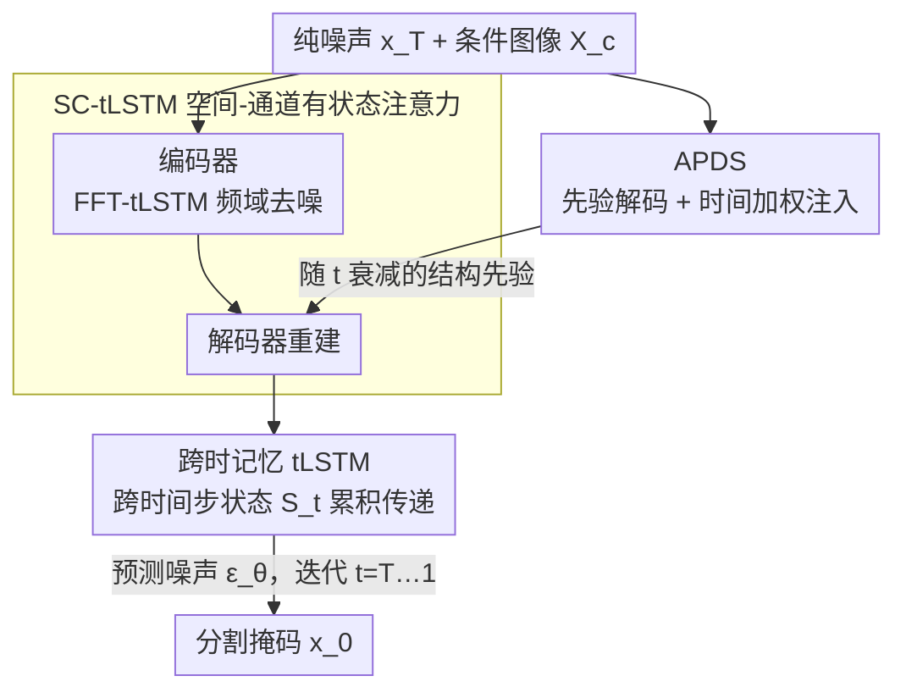

# Cross-Timestep: 3D Diffusion Model with Trans-temporal Memory LSTM and Adaptive Priori Decoding Strategy for Medical Segmentation

**会议**: ICLR2026  
**OpenReview**: [https://openreview.net/forum?id=TE3asYO8PQ](https://openreview.net/forum?id=TE3asYO8PQ)  
**代码**: https://github.com/Wushangqian404/Cross-Timestep  
**领域**: 医学图像 / 扩散模型 / 3D 分割  
**关键词**: 3D 医学分割, 扩散模型, 初期崩溃, 跨时间步记忆, 时间加权先验

## 一句话总结
针对扩散模型用于 3D 医学分割时在高噪声起点处"开局崩溃"、且各时间步彼此孤立的两大顽疾，本文提出 Cross-Timestep，用「自适应先验解码（APDS）」从条件图像注入随时间衰减的结构先验来稳住反向扩散的初期，再用「跨时记忆 LSTM（tLSTM）」把低频结构和不确定性显著区跨时间步显式传递下去，在两个多中心鼻咽癌数据集上全面超过现有 SOTA。

## 研究背景与动机
**领域现状**：医学图像分割要把解剖结构精确勾画出来。要训练鲁棒模型通常得把不同医院、不同扫描仪的影像汇总起来，但这会带来巨大的风格差异（成像风格、灰度分布、对比度都不一样），传统分割网络在这种域偏移下性能明显退化。扩散模型（DDPM）因为"由粗到细"的去噪过程会先恢复全局结构再补细节，天然对风格变化更鲁棒，因而成为很有吸引力的替代方案。

**现有痛点**：扩散模型的成功几乎全在 2D 分割任务上。作者观察到一个明确的失败模式——把 2D 上 work 的扩散分割直接搬到 3D 体数据时，只要反向采样从很高的噪声时间步（接近纯高斯噪声）起步，模型就会产出完全不成形的结果，根本恢复不出目标结构。作者把这个现象命名为「初期崩溃（initial-stage collapse）」。从中低时间步起步反而能正常采样，唯独高噪声起点会整体崩掉。

**核心矛盾**：3D 体数据的流形比 2D 大得多，而在极端噪声水平下可用的结构线索又微乎其微；标准扩散采样器逐步去噪时，每一步都是孤立的、彼此不通信的——它没有任何机制把跨时间步累积的证据传下去，于是在最关键的开局阶段既"看不清"又"记不住"，自然容易跑飞。

**本文目标**：要同时解决两件事——(i) 让反向扩散在极端噪声起点也能可靠地"起步"；(ii) 让相邻时间步之间不再各干各的，而是把已经积累的结构证据连贯传递下去。

**切入角度**：开局看不清，那就别让模型在纯噪声里硬猜——从干净的条件图像里抽一份"粗略草图"当脚手架先撑住；同时把扩散的逐步去噪看成一条有状态的轨迹，用循环网络的记忆单元把这条轨迹的状态显式带过每一步。

**核心 idea**：用一个只看条件分支的先验解码器提供"随时间衰减的结构先验"防止开局崩溃，再把 LSTM 的记忆单元改造成"跨时间步记忆载体"，让后面的步骤是在精修而非重新发现结构。

## 方法详解

### 整体框架
Cross-Timestep 是一个 3D 条件扩散分割框架：前向过程对真值分割掩码 $x_0$ 逐步加高斯噪声直到变成纯噪声 $x_T$；反向过程由网络 $M_\theta$ 在干净医学图像 $X_c$ 的条件下，从纯噪声 $x_T$ 出发迭代去噪，最终生成分割掩码 $x_0$。训练沿用 DDPM 的简化目标，让网络预测噪声 $\epsilon$：$L_{simple}=\mathbb{E}_{t,x_0,\epsilon}\big[\,\lVert\epsilon-M_\theta(x_t,X_c,t)\rVert^2\,\big]$。

在这个标准骨架上，本文塞进两类创新部件。第一类是 **APDS**：它只挂在网络的条件分支上，从条件图像 $X_c$ 解出一份先验掩码，再以随时间衰减的权重注入主分支，专治"初期崩溃"。第二类是 **tLSTM**：把循环记忆单元嵌进去噪器，让一个"跨时间步状态" $S_t$ 在去噪轨迹上持续传递，证据得以累积而非每步重来。tLSTM 有两个基础实现（Conv-tLSTM、Linear-tGRU）和两个扩展（SC-tLSTM、FFT-tLSTM），分别负责空间-通道注意力的有状态化和频域去噪。推理时一个完整去噪步可写成：编码器用 FFT-tLSTM/SC-tLSTM 抽特征、解码器用 SC-tLSTM 重建并由 APDS 稳住，预测噪声 $\epsilon_\theta$ 后按 DDPM 公式得到 $x_{t-1}$。

### 关键设计

**1. APDS（自适应先验解码）：用随时间衰减的结构先验稳住反向扩散的开局**

这一招直接针对"初期崩溃"。痛点是：在 $t$ 接近 $T$ 的极端噪声下，主分支输入几乎是纯噪声，模型没有任何可靠的结构起点。APDS 的做法是**只在条件分支上**额外接一个先验解码器（Prior Decoder, PD）：把嵌入了当前时间步信息的条件图像 $X_c$ 送进几层 bottleneck，再让 PD 把这些深层特征与条件编码器的多尺度跳连融合，解出一份初步分割掩码 $F_{prior}$——它是对目标结构 $x_0$ 的一份粗略但稳定的近似。

接着用「反向加法（Reverse Addition, RA）」把这份先验注入主分支特征 $F_{main}$：$F_{refined}=F_{main}\odot(1-\sigma(F_{prior}))$，即用先验掩码的反向（背景区）去抑制主分支、突出前景。更关键的是时间加权融合：在主分支每个上采样阶段，用一个随时间变化的权重 $\omega_t$ 把先验和精修特征融合，$F_{fused}=(1-\omega_t)\odot F_{refined}+\omega_t\odot F_{prior}$。$\omega_t$ 在 $t$ 大（高噪声开局、主分支最不稳）时取大值、随 $t\to 0$ 逐渐衰减。这样先验在模型最需要扶持时最强、在模型自己靠谱起来后优雅退场——既防住了开局崩溃，又不会把扩散模型退化成一个普通 U-Net（实验 4.3 专门验证了主分支输出后期会反超先验输出，说明先验只是"脚手架"而非"拐杖"）。因为 $X_c$ 本身已含时间嵌入，PD 自然能在高噪声时给更全局的结构引导、在低噪声时给更精细的引导。APDS 可无缝插进任意 3D 扩散模型。

**2. tLSTM（跨时记忆 LSTM）：把孤立去噪改造成有记忆的连贯轨迹**

痛点是标准扩散每个时间步彼此孤立，结构证据每步都得重新发现。tLSTM 的核心是把 LSTM 的记忆单元 $C_t$ 升级成"跨时间步记忆载体"。基础实现 Conv-tLSTM 把所有门控里的矩阵乘换成 3D 卷积，让隐状态 $h_t$ 和记忆单元 $C_t$ 都以完整 3D 张量形式保存、从而保留体素间的空间相关性；同时引入时间感知调制——先用时间步嵌入 $E_t$ 调制上一隐状态 $h_{t-1}$ 得到 $h'_t$，让循环单元始终知道自己处在去噪的哪个阶段。三个门 $i_t,f_t,o_t$ 都用 3D 卷积算出，候选记忆 $\tilde C_t=\tanh(W_{xc}*X_t+W_{hc}*h'_t+b_c)$，记忆更新 $C_t=f_t\odot C_{t-1}+i_t\odot\tilde C_t$，隐状态 $h_t=o_t\odot\tanh(C_t)$。直觉上 $C_t$ 显式保留三样东西：低频结构草图（来自 $\tilde C_t$）、残余噪声统计（经遗忘门 $f_t$ 过滤）、不确定性显著线索（由 $i_t,o_t$ 调制），于是每个去噪步是在精修而非重新发现结构。

轻量版 Linear-tGRU 基于 GRU，把 cell 和隐状态合并、把遗忘/输入门合成更新门 $z_t$，并用线性层替代卷积：更新门 $z_t$ 保证粗结构和残差统计跨时间步持久记忆，重置门 $r_t$ 在出现强新证据时选择性刷新显著区。它牺牲细粒度空间编码换计算效率，适合长程去噪。两者是可插拔的循环控制器，互相组合空间很大。

**3. SC-tLSTM：把空间-通道注意力做成有状态、随时间演化的版本**

普通的空间-通道注意力是无状态的、每步独立算。SC-tLSTM 把它改造成跨时间步有记忆：输入特征图分两条循环分支处理。空间分支沿 X/Y/Z 三轴分别平均池化得到三个空间摘要 $P_{xyz}=\mathrm{Concat}(\mathrm{Pool}_x,\mathrm{Pool}_y,\mathrm{Pool}_z)$，送进以 Conv-tLSTM 为主的循环块产生空间注意力图 $M_s$，从而跨时间步记住"应该关注哪里"。通道分支用平均池化+最大池化聚合空间信息得到 $P_{channel}$，送进以 Linear-tGRU 为主的循环块跟踪通道重要性随时间的演化，得到通道注意力图 $M_c$。最后顺序施加——先通道后空间：$F'=M_c\odot F$，$F_{out}=M_s\odot F'$。这样注意力在整条重建轨迹上学习"关注什么、关注哪里"，而不是每个时间步从零判断。

**4. FFT-tLSTM：在频域里把结构和噪声分开去噪**

结构信息和噪声在频域往往更可分。FFT-tLSTM 先把噪声输入 $X_t$ 和条件图像 $X_c$ 都做 3D 快速傅里叶变换得到频谱 $F_t,F_c$，融合并滤波后送进一个有状态循环块——时间步记忆让它更好地把握"哪段频率属于噪声"。输出再被条件频谱 $F_c$ 作为门控调制以放大相关结构频率：$\tilde F=\mathrm{tLSTM}(\mathrm{Filter}(F_t+F_c))\odot F_c$，最后逆 FFT 回空间域并与原噪声输入残差相连：$X_{out}=\mathrm{iFFT}(\tilde F)+X_t$。这给编码器提供了频域层面的抗噪能力，与 SC-tLSTM 的有状态特征提取互补。

### 损失函数 / 训练策略
训练目标即 DDPM 的标准噪声预测损失 $L_{simple}=\mathbb{E}_{t,x_0,\epsilon}[\lVert\epsilon-M_\theta(x_t,X_c,t)\rVert^2]$，其中 $x_t=\sqrt{\bar\alpha_t}x_0+\sqrt{1-\bar\alpha_t}\epsilon$、$\epsilon\sim\mathcal N(0,I)$。前向是固定方差表 $\{\beta_t\}$ 的马尔可夫链 $q(x_t|x_{t-1})=\mathcal N(x_t;\sqrt{1-\beta_t}x_{t-1},\beta_t I)$；推理时从纯噪声 $x_T$ 起，对 $t=T,\dots,1$ 迭代 $x_{t-1}=\frac{1}{\sqrt{\alpha_t}}\big(x_t-\frac{1-\alpha_t}{\sqrt{1-\bar\alpha_t}}\epsilon_\theta\big)+\sigma_t z$，每一步同时更新跨时间步状态 $S_t=\mathrm{tLSTM}(S_{t+1},\phi(x_t,X_c,t))$ 并以 $S_t$ 为条件去噪。

## 实验关键数据

### 主实验
在两个多中心鼻咽癌（NPC）分割数据集上评测：LNCTVSeg（4 家机构 262 名患者共 440 例 CT，淋巴结 CTV 勾画）和 OAseg（3 家机构 T1 加权 MRI，GTV 分割）。t-SNE 证实数据集间风格差异显著，是检验域偏移鲁棒性的理想试验台。对比 TransBTS、SwinUNETR、UNETR、3DUXNET、nnFormer、Perspective+ 以及扩散类的 Diff-UNet。

| 方法 | LNCTVSeg Dice↑ | LNCTVSeg IoU↑ | LNCTVSeg HD95↓ | OASeg Dice↑ | OASeg IoU↑ | OASeg HD95↓ |
|------|------|------|------|------|------|------|
| nnFormer | 80.3 | 71.5 | 4.31 | 68.4 | 62.4 | 7.76 |
| Perspective+ | 82.4 | 73.6 | 3.27 | 69.6 | 62.8 | 7.09 |
| Diff-UNet | 81.7 | 72.2 | 3.91 | 71.5 | 64.2 | 6.88 |
| **Ours** | **83.7** | **74.2** | **2.44** | **72.8** | **65.4** | **6.24** |

本文在所有指标上一致领先：Dice/IoU 最高、HD95（边界精度）最低，尤其在多中心风格差异大的场景下优势明显。

### 消融实验
tLSTM 组件消融（Table 1）和 APDS/SC/FFT 模块消融（Table 3）：

| 配置 | LNCTVSeg Dice | LNCTVSeg HD95 | 说明 |
|------|------|------|------|
| 仅 LSTM | 79.5 | 6.93 | 标准 LSTM 时间模块 |
| + Conv-LSTM | 81.1 | 5.48 | 3D 卷积门控 |
| + Conv-LSTM + Linear-GRU | 82.5 | 3.81 | 两类循环单元组合 |
| + t-cell（完整 tLSTM） | **83.7** | **2.44** | 加入跨时记忆单元 |
| 仅 APDS（无 SC/FFT） | 77.3 | 8.51 | 只有先验解码 |
| APDS + SC | 82.1 | 4.32 | 加空间-通道有状态注意力 |
| APDS + FFT | 81.8 | 4.85 | 加频域去噪 |
| APDS + SC + FFT（完整） | **83.7** | **2.44** | 全部模块 |

### 关键发现
- **"初期崩溃"被坐实并被 APDS 治好**：从不同噪声起点起步测平均 Dice，基线 Diff 和 Diff+tLSTM 在 $t<600$ 还行，但 $t>700$（输入≈纯噪声）时彻底崩溃、输出不成形；而带 APDS 的变体在全噪声水平都稳定，高噪声区也能保持有效分割。说明结构先验是开局不崩的关键。
- **先验是脚手架不是拐杖**：从 $t=1000$ 起记录"主分支输出 Diff Out"与"先验输出 APDS Out"的 Dice，开局 Diff Out 依赖 APDS，但随 $t$ 下降 Diff Out 迅速反超并显著更高——证明 APDS 没有束缚模型学习能力，扩散的渐进精修特性得以保留。
- **t-cell 贡献最关键**：tLSTM 消融里，从 Conv/Linear 组合（82.5）加入 t-cell 跨时记忆单元后 Dice 再涨到 83.7、HD95 从 3.81 砍到 2.44，显式的时间感知记忆对稳定性和精度提升最大。
- **效率均衡**：训练时间 33.4h，远低于 SwinUNETR（45.3h）和 nnFormer（80.4h），显存（15152 MiB）和推理延迟适中，与轻量的 Diff-UNet 资源相当但精度显著更高，适合临床落地。

## 亮点与洞察
- **把"开局崩溃"作为一个被命名、被量化、被验证的失败模式**：作者没有泛泛说扩散难用于 3D，而是精确定位到"高噪声起点采样崩溃"，并用从不同 $t$ 起步的 Dice 曲线把它画出来——问题定义本身就很有说服力。
- **时间加权的先验注入很巧**：$\omega_t$ 随 $t$ 衰减让先验"高噪声时强势托底、低噪声时优雅退场"，既解决初期不稳又避免退化成 U-Net，这种"按需扶持"的思路可迁移到任何需要外部先验但又怕过度依赖的条件生成任务。
- **把 LSTM 记忆单元重新解释为"跨时间步证据累积器"**：扩散的时间步天然是一条序列，但以往很少有人用循环记忆显式连接它们。把 $C_t$ 当作低频结构+残差统计+显著线索的载体，让"每步精修而非重发现"，这个视角对所有迭代式生成模型都有启发。
- **tLSTM 做成可插拔家族（Conv/Linear/SC/FFT）**：同一记忆机制在空间、通道、频域多处复用，模块化程度高、扩展空间大。

## 局限与展望
- **只在鼻咽癌 CT/MRI 两个数据集上验证**：虽然是多中心、有域偏移，但都是 NPC 任务，跨器官、跨模态（如超声、病理）的泛化性还未知。
- **推理延迟偏高**：扩散需迭代采样，本文推理时间 0.17s 是对比方法里最慢的（nnFormer 仅 0.03s），多步去噪的固有代价对实时临床场景仍是负担。
- **多个 tLSTM 变体的取舍缺乏系统指引**：Conv/Linear/SC/FFT 四种单元如何针对具体任务选择/组合，论文给了灵活性但没给清晰的选型准则，部分更新公式还放在附录（如 Linear-tGRU 候选隐状态），复现需依赖代码。
- **改进方向**：可探索把 APDS 的时间加权先验思想推广到其他高维生成任务的稳定化；或用更少采样步（如蒸馏/一致性模型）压低延迟，缓解扩散推理慢的短板。

## 相关工作与启发
- **vs 2D 扩散分割方法**（集成条件引导/不确定性建模/Transformer 上下文）：它们主要在 2D 上改边界和全局一致性，本文首次把扩散系统性地用于 3D 医学分割，并直面 3D 特有的初期崩溃问题。
- **vs Diff-UNet 等多步融合方法**：Diff-UNet 是对独立的每步预测做事后融合（post-hoc fusion）来降方差，本质上各步仍孤立；本文 tLSTM 是在采样过程中显式累积跨时间步状态，从根因上让证据连贯传递，而非事后平均。
- **vs 3D 生成式扩散工作**（聚焦合成与显存/效率工程）：以往 3D 扩散多在解决"如何处理大张量"，本文则同时攻"可靠初始化（APDS）"和"显式时间累积（tLSTM）"两个互补问题，针对的是初期崩溃的根因而非算力可行性。

## 评分
- 新颖性: ⭐⭐⭐⭐ 首次把扩散系统用于 3D 医学分割并命名/解决"初期崩溃"，APDS 时间加权先验 + tLSTM 跨时记忆两个思路都有原创性。
- 实验充分度: ⭐⭐⭐⭐ 多中心两数据集、SOTA 对比 + 三类消融 + 崩溃现象/过度干预专项分析 + 计算成本，较扎实；但仅限 NPC 任务、跨器官泛化未验。
- 写作质量: ⭐⭐⭐⭐ 问题定义清晰、图文配合好，公式完整；部分关键更新式放附录略影响自洽阅读。
- 价值: ⭐⭐⭐⭐ 为扩散类 3D 医学分割提供了可复用的稳定化基础设施（APDS 可插任意 3D 扩散），临床域偏移鲁棒性强、代码开源。

<!-- RELATED:START -->

## 相关论文

- [\[ICLR 2026\] Adaptive Domain Shift in Diffusion Models for Cross-Modality Image Translation](adaptive_domain_shift_in_diffusion_models_for_cross-modality_image_translation.md)
- [\[ICLR 2026\] Johnson-Lindenstrauss Lemma Guided Network for Efficient 3D Medical Segmentation](johnson-lindenstrauss_lemma_guided_network_for_efficient_3d_medical_segmentation.md)
- [\[CVPR 2026\] GeoSemba: Reconstructing State Space Model for Cross Paradigm Representation in Medical Image Segmentation](../../CVPR2026/medical_imaging/geosemba_reconstructing_state_space_model_for_cross_paradigm_representation_in_m.md)
- [\[CVPR 2025\] VISTA3D: A Unified Segmentation Foundation Model For 3D Medical Imaging](../../CVPR2025/medical_imaging/vista3d_a_unified_segmentation_foundation_model_for_3d_medical_imaging.md)
- [\[ICLR 2026\] Improving 2D Diffusion Models for 3D Medical Imaging with Inter-Slice Consistent Stochasticity](improving_2d_diffusion_models_for_3d_medical_imaging_with_inter-slice_consistent.md)

<!-- RELATED:END -->
