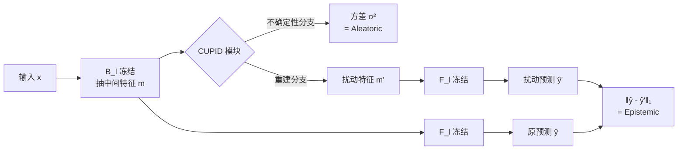

# CUPID: A Plug-in Framework for Joint Aleatoric and Epistemic Uncertainty Estimation with a Single Model

**会议**: ICLR 2026  
**OpenReview**: [https://openreview.net/forum?id=nF81AkEzXg](https://openreview.net/forum?id=nF81AkEzXg)  
**代码**: [https://github.com/a-Fomalhaut-a/CUPID](https://github.com/a-Fomalhaut-a/CUPID)  
**领域**: 不确定性估计 / 可信深度学习（医学影像、OOD 检测）  
**关键词**: aleatoric uncertainty, epistemic uncertainty, plug-in module, OOD detection, misclassification detection  

## 一句话总结
CUPID 是一个可插入预训练网络任意中间层、无需改结构也无需重训的即插即用模块，用一次前向就联合估计数据噪声（aleatoric）和模型无知（epistemic）两类不确定性。

## 研究背景与动机
**领域现状**：在医学诊断、自动决策这类高风险场景里，深度模型的过度自信会导致严重后果，因此可靠的不确定性估计是落地的前提。学界普遍把不确定性拆成两类：aleatoric（源自数据本身的噪声/歧义，不可消除）与 epistemic（源自模型对自身参数/训练数据覆盖不足的无知，可随数据增加而减少）。在糖网/青光眼筛查里，高 aleatoric 往往意味着图像模糊噪声大、该重拍，高 epistemic 则意味着模型没见过这种病理模式、该送专家复核——分清两者直接决定该采取什么行动。

**现有痛点**：现有方法大多有两个硬伤之一。要么只估一类不确定性、或根本分不清两类；要么属于"model-redefining"路线——BNN 把权重当分布、Evidential Deep Learning 套 Dirichlet、Deep Ensemble 训多个模型——这些都要改架构或从头重训，计算昂贵且无法兼容已上线的系统。即便是较轻量的 model-preserving 路线（MC Dropout、test-time augmentation、梯度范数代理），也常常只覆盖单一类型或推理时要多次前向。

**核心矛盾**：既要"联合且可区分地"估计两类不确定性，又要"不碰原模型、不重训、可随处插拔"，这两个目标在已有工作里几乎是互斥的。

**本文目标**：做一个真正即插即用、模型无关、单模型单前向就能同时输出 aleatoric 与 epistemic 估计的通用模块，并且能插在不同深度来观察不确定性如何在网络中演化。

**核心 idea**：**[即插即用三件套]** 在选定中间层放一个 CUPID 模块（特征提取器 + 重建分支 + 不确定性分支）。aleatoric 用一个学到的"贝叶斯恒等映射"输出输入相关方差来建模；epistemic 用"对内部特征做结构化扰动后输出变了多少"来度量——把不确定性估计变成可解释、模块化、与基座解耦的旁路。

## 方法详解

### 整体框架
把预训练模型 $M$ 拆成 $M(x)=F_l(B_l(x))$：$B_l$ 抽到第 $l$ 层中间特征 $m_{l,n}$，$F_l$ 再映射到输出。CUPID 模块 $C$ 作用在 $m_{l,n}$ 上，输出一个被扰动重建的特征 $m'_{l,n}$ 和一个 aleatoric 方差估计 $\hat\sigma_n$。重建特征再喂回网络剩余部分得到扰动预测 $\hat y' = F_l(m'_{l,n})$；原预测 $\hat y$ 与扰动预测 $\hat y'$ 之间的差距就是 epistemic 估计。整个过程只训 CUPID 模块（$F_l$、$B_l$ 全程冻结）。

### 关键设计

**1. 贝叶斯恒等映射估 aleatoric：让网络自己吐出输入相关方差。** CUPID 假设输出被异方差高斯噪声污染，即 $p(y_n\mid x_n,\theta,\omega)=\mathcal N(\hat y'_n,\hat\sigma_n^2)$，其中 $\hat\sigma_n^2$ 由不确定性分支按输入预测。通过最大化对数似然，损失退化成大家熟悉的异方差回归目标——为数值稳定预测对数方差 $s_n=\log\hat\sigma_n^2$：

$$\mathcal L_{alea}=\frac1N\sum_n\Big[\tfrac12\exp(-s_n)\lVert y_n-\hat y'_n\rVert_2^2+\tfrac12 s_n\Big]$$

预测方差 $\hat\sigma_n^2$ 直接作为 aleatoric 估计 $U_{alea}(x_n)$。这个似然原理在分类上同样适用：把 logits 过 Softmax 得到概率向量，与 one-hot 标签都视作连续分布，定义 Brier 风格的异方差目标即可，因此分类回归通吃。

**2. 结构化扰动测 epistemic：在"输出几乎不变"的约束下把特征推得越远越好。** 重建分支被训练去找一个 $m'_{l,n}$，它在特征空间里尽量远离原特征、但喂回网络后预测尽量不变。损失把"特征要变大"和"预测要一致"两项对冲：

$$\mathcal L_{epis}=\frac1N\sum_n\Big(\lVert\hat y_n-\hat y'_n\rVert_1-\lambda_1\lVert m'_{l,n}-m_{l,n}\rVert_1\Big)$$

为避免扰动无限膨胀的平凡解，CUPID 初始化在恒等映射附近。epistemic 量化为 $U_{epis}(x)=\lVert F_l(m_{l,n})-F_l(m'_{l,n})\rVert_1$。

**3. 一阶泰勒解释：epistemic ∝ 敏感度 × 偏离度，统一两种失败模式。** 对 $F_l$ 在 $m_{l,n}$ 处做一阶泰勒展开可得

$$U_{epis}(x)\approx\lVert\nabla_{m_{l,n}}F_l(m_{l,n})\cdot(m'_{l,n}-m_{l,n})\rVert_1\;\propto\;\text{Sensitivity}\times\text{Deviation}$$

Jacobian 反映输出对特征扰动的局部敏感度，扰动幅度 $\lVert m'-m\rVert_1$ 反映样本偏离训练流形的程度。分布内被错分的样本往往敏感度高，OOD 样本则偏离度异常大——CUPID 用同一个量同时响应这两种失败模式，这是它能在 misclassification 和 OOD 两个任务都奏效的根本原因。

**4. 统一损失联合优化。** 总损失 $\mathcal L_{CUPID}=\mathcal L_{epis}+\lambda_2\mathcal L_{alea}$，两类不确定性在单一模型里同时学，$\lambda_2$ 平衡两项权重。

## 实验关键数据

### 主实验表格

医学影像误分类检测（误分类样本为正例）：

| 方法 | GLV2 AUC↑ | GLV2 AURC↓ | HAM10000 AUC↑ | HAM10000 Spearman↑ |
|------|-----------|------------|---------------|--------------------|
| **CUPID Alea.** | **0.870** | **0.018** | 0.769 | 0.722 |
| **CUPID Epis.** | 0.769 | 0.034 | **0.855** | 0.907 |
| MC Dropout | 0.768 | 0.027 | 0.829 | 0.861 |
| Rate-in | 0.815 | 0.024 | 0.846 | 0.915 |
| BNN | 0.829 | 0.025 | 0.793 | 0.821 |

GLV2 上 aleatoric 占主导（CUPID Alea. 最优），HAM10000 上 epistemic 占主导（CUPID Epis. 最优）——同一框架自动揭示不同数据集的主导不确定性来源。

OOD 检测（OOD 样本为正例，ID=GLV2）：

| 方法 | PAPILA AUC↑ | ACRIMA AUC↑ | CIFAR10 AUC↑ |
|------|-------------|-------------|--------------|
| **CUPID Alea.** | 0.379 | 0.717 | **0.983** |
| **CUPID Epis.** | **0.877** | **0.978** | 0.898 |
| MC Dropout | 0.733 | 0.869 | 0.887 |
| IGRUE | 0.636 | 0.941 | 0.978 |

同任务的细微分布偏移（PAPILA/ACRIMA 都是青光眼）由 epistemic 抓得最准；极端域差异（CIFAR-10）则 aleatoric 反而最强（AUC 0.983），因为它对"既稀有又不可预测"的输入分配高方差。

超分辨率回归（Pearson↑，越高越好）：

| 方法 | Set5 | BSDS100 | IXI(MRI) |
|------|------|---------|----------|
| **CUPID Alea.** | **0.528** | **0.536** | 0.677 |
| **CUPID Epis.** | 0.416 | 0.464 | **0.734** |
| BayesCap | 0.485 | 0.427 | 0.447 |
| in-rotate | 0.493 | 0.465 | 0.598 |

自然图像上 aleatoric 主导；而 IXI 脑部 MRI（与 DIV2K 训练分布差异大）上 epistemic 反超，印证域偏移下 epistemic 更有信息量。

### 消融实验表格

差分特征损失（"No max"= 去掉 $-\lambda_1\lVert m'-m\rVert_1$ 项）对 OOD 的影响：

| 配置 | PAPILA AUC↑ | ACRIMA AUC↑ | CIFAR10 AUC↑ |
|------|-------------|-------------|--------------|
| Max (Epis.) | **0.877** | 0.978 | 0.898 |
| No max (Epis.) | 0.839 | 0.977 | — |

去掉"把特征推远"的项后 epistemic 性能（尤其 PAPILA 这种细微偏移）明显下降，说明结构化扰动的"最大化偏离"是 epistemic 估计的关键。

### 关键发现
- **插入位置决定捕获哪类不确定性**：CUPID 越靠近输出层，aleatoric 估得越准；越靠近输入/浅层，epistemic 估得越好。这与概念吻合——aleatoric 在高层语义特征处更突显，epistemic 反映表征在网络深处如何传播累积，且 epistemic 主要在最后几层累积。
- **直接从输入特征估 aleatoric 不够**，需要更深的激活才有可靠信号。
- 两个分支互补：跨任务/跨域的各种偏移类型，总有一支能扛住。

## 亮点与洞察
- **真正"零侵入"**：基座网络全程冻结，只训一个旁路模块，与已上线系统天然兼容，省去重训成本，这是相比 BNN/Deep Ensemble/EDL 的最大工程优势。
- **用泰勒展开把 epistemic 拆成"敏感度×偏离度"**，给出了为什么同一个量能同时抓 misclassification 与 OOD 的理论解释，不是纯经验拼凑。
- **把"插在哪层"变成一个分析工具**：通过逐层插入观察不确定性演化，得到"epistemic 累积在深层、aleatoric 在高层语义处"的可解释结论，这对理解网络内部不确定性来源有独立价值。
- **分类回归、医学/自然/MRI 跨域全覆盖**，且能自动揭示每个数据集的主导不确定性类型，对风险感知决策（重拍/复核/补数据）有直接指导意义。

## 局限与展望
- aleatoric 与 epistemic 哪一支占主导高度依赖数据集，需要两支都跑才能知道，实际部署时如何自动选择/融合两支仍需人工判断。
- epistemic 的"最大化特征偏离"依赖恒等映射初始化来避免平凡解，$\lambda_1,\lambda_2$ 等超参对结果敏感，缺乏自适应设定。
- 评测均基于 ResNet18 / ESRGAN 等中等规模模型，在大模型、Transformer、多模态场景下的可扩展性与开销尚未验证。
- epistemic 估计需要原预测与扰动预测两次 $F_l$ 前向，相比纯 aleatoric 单分支有额外计算。

## 相关工作与启发
- **Model-redefining**：BNN（权重当分布）、Evidential Deep Learning（Dirichlet 框架）、Deep Ensemble、HyperDM（贝叶斯超网+条件扩散）——能力强但要改架构/重训。
- **Model-preserving**：MC Dropout、test-time augmentation、梯度范数代理、BayesCap（冻结输出上学不确定性）、Rate-In（自适应 dropout 率）、RUE（重建误差测分布偏移）——CUPID 属于这一阵营，但同时联合估两类且可任意层插入，区别于这些大多单类型/单插入点的方法。
- **启发**：BayesCap 的"贝叶斯恒等映射"思路被 CUPID 用于 aleatoric 分支；"在输出不变约束下最大化特征扰动"这一对抗式重建思路，可迁移到表征鲁棒性分析、OOD 评分函数设计等方向。

## 评分
- **新颖性**: ⭐⭐⭐⭐ —— "插即用、单模型联合估两类不确定性"的组合在 model-preserving 路线里少见，泰勒展开的"敏感度×偏离度"解释提供了清晰直觉。
- **实验充分度**: ⭐⭐⭐⭐ —— 覆盖误分类/OOD/超分三任务、医学+自然+MRI 多域、多 baseline 对比，并有插入位置与差分损失消融；但仅限中等规模骨干。
- **写作质量**: ⭐⭐⭐⭐ —— 公式推导清晰，图示（1D toy、pipeline、逐层趋势）直观，"Cupid 之箭揭示隐藏情感"的比喻贴切。
- **价值**: ⭐⭐⭐⭐ —— 对医学影像等高风险落地场景有直接工程价值：免重训、可解释、能指导重拍/复核/补数据等具体行动。

<!-- RELATED:START -->

## 相关论文

- [\[ICLR 2026\] Contextual Similarity Distillation: Ensemble Uncertainties with a Single Model](contextual_similarity_distillation_ensemble_uncertainties_with_a_single_model.md)
- [\[CVPR 2026\] Delving Aleatoric Uncertainty in Medical Image Segmentation via Vision Foundation Models](../../CVPR2026/medical_imaging/delving_aleatoric_uncertainty_in_medical_image_segmentation_via_vision_foundatio.md)
- [\[ICLR 2026\] Joint Adaptation of Uni-modal Foundation Models for Multi-modal Alzheimer's Disease Diagnosis](joint_adaptation_of_uni-modal_foundation_models_for_multi-modal_alzheimers_disea.md)
- [\[CVPR 2026\] A Supervised Multi-task Framework for Joint cryo-ET Restoration Enabled by Generative Physical Simulation](../../CVPR2026/medical_imaging/a_supervised_multi-task_framework_for_joint_cryo-et_restoration_enabled_by_gener.md)
- [\[ICLR 2026\] CARE: Towards Clinical Accountability in Multi-Modal Medical Reasoning with an Evidence-Grounded Agentic Framework](care_towards_clinical_accountability_in_multi-modal_medical_reasoning_with_an_ev.md)

<!-- RELATED:END -->
