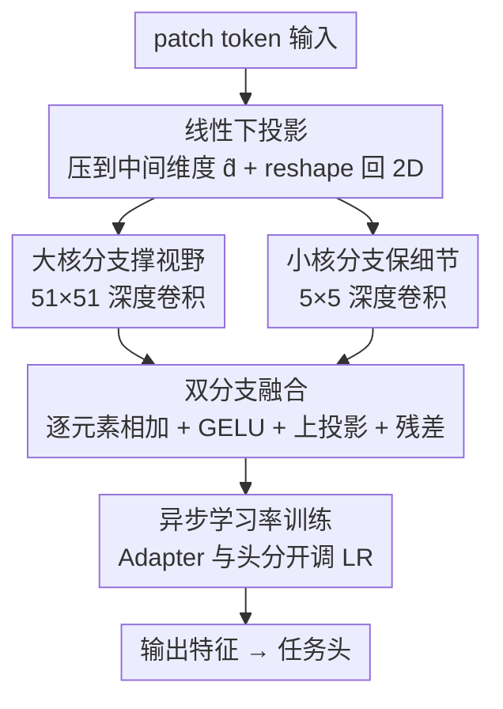

# Dual-Kernel Adapter: Expanding Spatial Horizons for Data-Constrained Medical Image Analysis

**会议**: ICLR2026  
**OpenReview**: [https://openreview.net/forum?id=Z6KGt1veeP](https://openreview.net/forum?id=Z6KGt1veeP)  
**代码**: https://github.com/misswayguy/DKA  
**领域**: 医学图像 / 参数高效微调  
**关键词**: Adapter, 有效感受野, 大核卷积, 低数据, 医学影像

## 一句话总结
作者先系统地证明：在医学影像这种极端缺数据的场景下，标准 Adapter 不仅没用、甚至比纯线性探测还差，根因是训练数据一少，Adapter 的有效感受野（ERF）会急剧收缩；据此提出双核适配器 DKA——用一条大核（51×51）深度卷积撑开 ERF、一条小核（5×5）深度卷积保住局部细节并联融合，在分类与分割、自然预训练与医学预训练骨干上都刷出新 SOTA。

## 研究背景与动机
**领域现状**：把大型预训练模型迁移到下游任务时，Adapter 这类参数高效微调（PEFT）方法已成为主流——冻结骨干、只训练插入的小模块，省显存又省标注。在医学影像里它尤其受欢迎，因为这个领域天然资源受限。

**现有痛点**：医学影像的标注极其昂贵——放射科专家要在高分辨率 2D/3D 扫描上逐结构勾画，加上 HIPAA、GDPR 等隐私法规和机构间数据壁垒，可用数据被切得支离破碎。于是很多临床任务实际运行在「不到 1% 训练数据」的极端低数据区。可是没人认真研究过：Adapter 在这种数据约束下到底还灵不灵？

**核心矛盾**：作者用 ViT-B / Swin-T / Swin-B 在 COVID、BUSI、ISIC-2019 等数据集上从 0.63% 到 100% 训练量扫了一遍，发现一个反直觉的现象：数据越少，Adapter 的增益越小；当训练数据降到 1% 及以下，Adapter 在医学数据上的增益直接变成**负数**——还不如冻结骨干只训练一个线性头（linear probing）。进一步可视化发现，训练数据越少，Adapter 学到的**有效感受野（ERF）越小**。而医学图像往往低对比度、边界模糊、病灶小且不规则，恰恰最需要大感受野去捕捉长程上下文。标准 Adapter 没有任何「扩大 ERF」的归纳偏置，在监督信号稀薄时根本撑不开感受野。

**本文目标**：设计一种自带「扩大 ERF」归纳偏置的新 Adapter，使其在极端低数据下也能稳定增益，同时不牺牲全数据下的表现。

**切入角度**：既然问题出在 ERF 太小，而已有研究（RepLKNet、SLaK 等）表明大核卷积能显著扩大 ERF、引入捕捉广域上下文的强归纳偏置——那就把大核卷积直接塞进 Adapter。但纯大核又会丢局部细节，所以再并一条小核分支兜底。

**核心 idea**：用「大核撑视野 + 小核保细节」的双分支深度卷积替换 Adapter 内部的瓶颈变换，给 Adapter 装上一个先天就偏向大 ERF 的结构。

## 方法详解

### 整体框架
DKA（Dual-Kernel Adapter）本质是对标准瓶颈式 Adapter 的「中间变换」做手术。标准 Adapter 是「下投影 → 非线性 → 上投影 + 残差」，DKA 把中间那段换成一个双分支深度卷积模块。具体地：输入 patch token 先经线性下投影压到中间维度 $\hat d$，再 reshape 回 2D 空间布局（这样才能做卷积），然后并联送进两条深度卷积分支——一条大核（51×51）负责把 ERF 撑大、建模长程依赖，一条小核（5×5）负责保住细粒度局部结构；两条分支输出逐元素相加，过 GELU 激活，再线性上投影回原维度，最后加残差连回输入。这些 DKA 模块按 Yin et al. (2024) 的放置策略插入 Transformer block 内部，训练时只更新 DKA 和任务头、冻结骨干。

形式化地，DKA 的运算为：

$$f_{\text{DKA}}(x) = x + \text{Up}\big(\sigma(\text{DWConv}_{\text{large}}(\text{Down}(x)) + \text{DWConv}_{\text{small}}(\text{Down}(x)))\big)$$

其中 $\text{Down}(\cdot)$、$\text{Up}(\cdot)$ 是线性投影，$\text{DWConv}_{\text{large}}$、$\text{DWConv}_{\text{small}}$ 是核尺寸分别为 51 和 5 的深度卷积，$\sigma$ 是 GELU。

### 关键设计

**1. 诊断：把低数据下 Adapter 失效归因于 ERF 收缩**

这是全文的立论基石，也是后续设计的依据。作者没有直接拍脑袋造模块，而是先做了「首个系统性研究」：在三种骨干、五个数据集上以 $\Delta\text{ACC} = \text{ACC}_{\text{LinearProbing+Adapter}} - \text{ACC}_{\text{LinearProbing}}$ 度量 Adapter 的净增益，扫描 0.63%–100% 的训练量。结论分三层递进：① 数据越少 Adapter 增益越小，且在医学数据（域外）上衰减远比自然图像（域内）剧烈；② 数据 ≤1% 时医学任务上 $\Delta\text{ACC}$ 转负，Adapter 反而拖累模型；③ 用 Araujo et al. (2019) 的 ERF 定义（输出单元对所有输入像素的非可忽略影响区域）做可视化，发现训练数据越少 ERF 越小。三条串起来给出了一个可检验的因果假设——低监督限制了 Adapter 学习空间弥散特征与长程依赖的能力，而这恰是医学影像最需要的。这一步的价值在于：它把「换个更强模块」的工程冲动，变成了「补上 ERF 这个缺失的归纳偏置」的精准手术。

**2. 双核并联：大核撑 ERF、小核保细节，缺一不可**

针对诊断出的 ERF 缺陷，DKA 的核心动作是在 Adapter 瓶颈里并联两条深度卷积。大核（51×51）提供强归纳偏置去扩张感受野、建模长程上下文，这是直接对症下药；但只用大核会丢失病灶边界这类细粒度局部信息，所以并一条小核（5×5）兜底。两者用深度卷积（每通道独立滤波）保证计算开销可控，输出相加后再激活上投影。消融（Single vs. Dual）证明：单 51×51 或单 5×5 都打不过双分支，尤其在低数据区差距最明显——小核擅长局部、大核擅长全局，唯有并联才能两头都占。核尺寸扫描进一步锁定 5×5 + 51×51 是最优组合，核太小撑不开 ERF、核太大又会过度平滑掉细节，在低数据下两种极端都掉点。

**3. 大核而非参数量才是增益来源**

一个自然的质疑是：DKA 比基线多了点可训练参数，会不会增益只是参数堆出来的？作者做了控制变量实验：固定 DKA 中间维度 $\hat d = 16$，让参数增量**只来自加大核尺寸**（11×11 → 51×51）；同时把其他 Adapter 基线的 $\hat d$ 调大到参数量与 DKA 对齐。结果是——在相同参数预算下 DKA 仍全面领先，而且「加大核尺寸」带来的提升斜率明显比「加大隐藏维度」更陡。这条实验把功劳干净地记在大核（即 ERF）头上，而非参数量，反过来印证了设计 1 的诊断。

**4. 异步学习率：Adapter 与头分开调，是涨点的关键钥匙**

作者发现一个容易被忽略的训练细节：常规做法给 Adapter 和任务头用同一个学习率，但二者角色不同，未必最优。在 COVID + ViT-B 上扫描两者学习率组合（5e-2 / 1e-3 / 1e-4 / 1e-5）后发现，**非对称**学习率（两者不同）几乎总优于对称配置，最佳点从来不在「两者相等」的对角线上。最终落定 DKA 模块用 1e-3、任务头用 1e-4。摘要里明确点名：异步学习率对 DKA 的增益「至关重要」，说明这不是锦上添花的调参，而是让双核结构真正发挥的必要条件。

### 损失函数 / 训练策略
冻结全部预训练权重，只训练 DKA 模块与任务头。中间维度 $\hat d$ 分类设 16、分割设 192；学习率头 1e-4、DKA 1e-3；分类训 100 epoch、分割训 300 epoch。低于 100% 数据时做 5 折交叉验证、固定测试集，结果取折平均。

## 实验关键数据

### 主实验
ViT-B 骨干下三个分类数据集的 ACC（%），低数据区（0.63%、1.25%）与全量（100%）对比：

| 数据集 | 数据量 | DKA | Adapter | Convpass | Linear Probing | Full FT |
|--------|--------|-----|---------|----------|----------------|---------|
| COVID | 0.63% | **89.01** | 83.29 | 84.72 | 86.84 | 87.43 |
| COVID | 100% | **99.21** | 98.33 | 98.45 | 94.85 | 98.43 |
| BUSI | 0.63% | **74.23** | 63.18 | 64.83 | 73.48 | 71.17 |
| ISIC-2019 | 0.63% | **60.52** | 52.77 | 54.72 | 59.15 | 60.04 |

Segmenter-B 骨干下分割（mIoU %）同样领先，例如 BUSI 0.63% DKA 26.85 vs Adapter 18.18、Linear Probing 25.53；BRATS 100% DKA 74.96 vs Full FT 73.08。在医学预训练骨干（RadImageNet-ResNet-50 分类、MedSAM 分割）上结论一致：ISIC-2019 0.63% DKA 53.69 vs Adapter 51.32，证明增益不依赖自然图像预训练。

注意关键现象：低数据区里很多 PEFT 方法（BitFit、Prompt、LoRA、Adapter）都跌破 Linear Probing，唯有 DKA 在 0.63% 这种极端设定下还能**超过 Full Fine-tuning**。

### 消融实验

| 配置 | 关键指标（BUSI, 0.63% ACC） | 说明 |
|------|------|------|
| Dual (5×5 + 51×51) | 74.23 | 完整双核，最优 |
| Single (51×51) | 低于双核 | 只大核，丢局部细节 |
| Single (5×5) | 低于双核 | 只小核，ERF 不够 |
| 核组合 51×51 + 3×3 | 65.58 | 小核过小掉点 |
| 核组合 71×71 + 5×5 | 72.41 | 大核过大掉点 |
| 中间维度 $\hat d$=16 | 74.23 | 分类最优，再大略降（过拟合） |

### 关键发现
- **大核是增益主因**：相同参数预算下，靠加大核尺寸涨点的斜率远比加隐藏维度陡，说明功劳在 ERF 扩张而非参数量。
- **双分支缺一不可**：单大核或单小核都打不过并联，低数据区差距最明显。
- **异步学习率至关重要**：最佳学习率组合从不在「Adapter 与头相等」的对角线上，DKA=1e-3、头=1e-4 是甜点。
- **中间维度有甜点**：分类 $\hat d$=16 达峰后略降（冗余/过拟合），分割任务更复杂、$\hat d$=192 才最优。

## 亮点与洞察
- **先诊断后开方**：不像很多「换个模块刷 SOTA」的工作，DKA 先用 $\Delta\text{ACC}$ + ERF 可视化把低数据失效的根因坐实成「ERF 收缩」，再对症下药。这种「现象 → 假设 → 设计 → 反向验证（大核 vs 参数量）」的闭环非常扎实。
- **把大核卷积的归纳偏置嫁接进 PEFT**：大核扩 ERF 在 backbone 设计里已被验证，但把它压缩进 Adapter 这种极小模块、且专门服务于「低数据 + 域外」的医学场景，是一个干净的迁移。
- **异步学习率这个「免费午餐」可复用**：Adapter 与头分开调 LR 几乎零成本，却被证明是关键，可迁移到其他 PEFT 方法上一试。

## 局限与展望
- **大核 51×51 的实际开销与显存**：虽然用了深度卷积控制开销，但 51×51 这种超大核在高分辨率 3D 医学体数据上的算力/显存表现，文中主要在 2D 上验证，3D 推广性待考。
- **ERF 因果链偏经验**：「低数据 → ERF 缩小 → 性能下降」是一条有可视化支撑的假设，但仍是相关性证据居多，缺乏更严格的理论刻画。
- **核尺寸/中间维度需按任务调**：分类与分割的最优 $\hat d$（16 vs 192）相差一个数量级，超大核固定为 51 也偏经验，换数据集/模态可能要重扫，部署时有调参成本。

## 相关工作与启发
- **vs 标准 Adapter / AdapterFormer / Convpass**: 它们的中间变换缺乏扩 ERF 的归纳偏置，低数据下 ERF 收缩导致掉点；Convpass 虽加了 3×3 卷积分支但核太小撑不开视野。DKA 用 51×51 大核直击 ERF，并用 5×5 兜住细节。
- **vs LoRA / BitFit / Prompt**: 这些 PEFT 在极端低数据医学任务上普遍跌破 Linear Probing，因为它们调的是注意力/偏置/token，与「空间感受野不足」这一医学影像核心痛点不对口；DKA 直接在空间维度补课。
- **vs 大核 backbone（RepLKNet / SLaK / ConvNeXt）**: 它们在从头训练的全尺寸网络里用大核，DKA 把同样的「大核扩 ERF」思想浓缩进冻结骨干 + 小适配器的 PEFT 范式，并专门面向低数据迁移。

## 评分
- 新颖性: ⭐⭐⭐⭐ 把大核扩 ERF 的归纳偏置精准嫁接到 PEFT，并用诊断坐实动机，思路清晰但单点创新。
- 实验充分度: ⭐⭐⭐⭐⭐ 分类+分割、自然+医学预训练、多骨干多数据集，参数对齐/核尺寸/学习率/维度消融齐全。
- 写作质量: ⭐⭐⭐⭐ 「诊断→设计→验证」逻辑闭环，图表支撑足，叙述清楚。
- 价值: ⭐⭐⭐⭐ 低数据医学影像是高频真实场景，方法轻量易插、有开源代码，落地性强。

<!-- RELATED:START -->

## 相关论文

- [\[NeurIPS 2025\] STAMP: Spatial-Temporal Adapter with Multi-Head Pooling](../../NeurIPS2025/medical_imaging/stamp_spatial-temporal_adapter_with_multi-head_pooling.md)
- [\[AAAI 2026\] Decoding with Structured Awareness: Integrating Directional, Frequency-Spatial, and Structural Attention for Medical Image Segmentation](../../AAAI2026/medical_imaging/decoding_with_structured_awareness_integrating_directional_frequency-spatial_and.md)
- [\[CVPR 2026\] SemiGDA: Generative Dual-distribution Alignment for Semi-Supervised Medical Image Segmentation](../../CVPR2026/medical_imaging/semigda_generative_dual-distribution_alignment_for_semi-supervised_medical_image.md)
- [\[ICLR 2026\] CONSIGN: Conformal Segmentation Informed by Spatial Groupings via Decomposition](consign_conformal_segmentation_informed_by_spatial_groupings_via_decomposition.md)
- [\[CVPR 2025\] SACB-Net: Spatial-Awareness Convolutions for Medical Image Registration](../../CVPR2025/medical_imaging/sacb-net_spatial-awareness_convolutions_for_medical_image_registration.md)

<!-- RELATED:END -->
