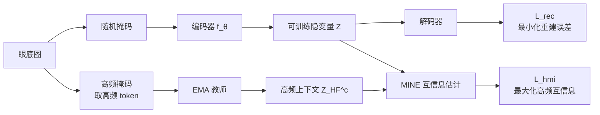

# Frequency-Balanced Retinal Representation Learning with Mutual Information Regularization

**会议**: ICLR 2026  
**OpenReview**: [https://openreview.net/forum?id=K5tcKEQaUr](https://openreview.net/forum?id=K5tcKEQaUr)  
**代码**: 待确认  
**领域**: 医学影像 / 自监督表示学习  
**关键词**: 视网膜眼底图像, Masked Autoencoder, 频率偏置, 互信息正则, 信息瓶颈  

## 一句话总结
作者从空间频率视角剖析 MAE，发现它偏爱低频背景、欠编码诊断关键的高频细节，进而在互信息框架下提出 RetMAE：不改架构，仅加一个高频互信息正则（HighFreqMI），就让视网膜编码器学到"频率平衡"的表征，仅用约 25.6k 张无标注眼底图就刷过现有眼底基础模型。

## 研究背景与动机
**领域现状**：眼底照相（fundus photography）的基础模型主要有两条路线——自监督学习（以 MAE / RETFound 为代表）和视觉-语言预训练（以 RET-CLIP 为代表）。后者需要昂贵且稀缺的图文配对，因此在公开数据上，能直接吃大量无标注眼底图的 MAE 类方法更实用。

**现有痛点**：MAE 的重建目标（随机掩码 + 像素级 MSE）隐含假设"图像各区域信息密度均匀"。但眼底图恰恰相反——绝大多数面积是平滑的低频背景，而真正用于诊断的结构（微动脉瘤、渗出、出血、视盘、血管边缘）稀疏地集中在高频带。这个"均匀信息假设"与眼底图"强空间异质"的诊断信号分布严重错配。

**核心矛盾**：作者用 CKA 量化 MAE 特征与频率分离输入的对齐度，发现一个反直觉现象（Table 1）：MAE 表征与低频成分高度对齐（CKA=0.990）却与高频成分几乎不对齐（CKA=0.164）；可线性探测 AUROC 却完全相反——只保留 25% 的高频 token 反而拿到最高 AUROC（0.727），远超同等 token 预算下的随机掩码（0.647）和只留低频（0.641）。也就是说，**MAE 优先编码了最没用（低频）的那一段信息**，把携带主要诊断信号的高频 token 给压没了。

**本文目标**：在不动 backbone、不引入图文配对的前提下，纠正 MAE 的低频偏置，学出"既紧凑又诊断充分"的频率平衡表征。

**核心 idea**：把 MAE 写成互信息（MI）拉格朗日量，**用一个高频互信息正则把瓶颈的注意力从低频冗余拉向高频诊断线索**——这是一个纯目标函数层面的修正，不需要改网络结构。

## 方法详解

### 整体框架
RetMAE 在标准 MAE 的重建分支之外，并行挂一条高频互信息正则分支。给定输入，一路走常规随机掩码 → 编码器 $f_\theta$ → 解码器，做像素重建 $\mathcal{L}_{rec}$；另一路对同一张图做"高频掩码"（只喂高频 token）送进编码器的 EMA 教师，得到紧凑的高频上下文隐变量 $Z^{HF}_c$，再用 MINE 估计的互信息把可训练隐变量 $Z$ 与之对齐（$\mathcal{L}_{hmi}$）。两条分支共享同一个编码器，最终联合优化。

### 关键设计

**1. 把 MAE 重写成互信息拉格朗日量，给"纠偏"找到理论落点。** 作者沿用信息瓶颈视角，把 MAE 目标写成 $\mathcal{L}=I(X_V;Z)+\beta\,I(X_V;X_M\mid Z)$：第一项 $I(X_V;Z)$ 度量隐变量 $Z$ 的复杂度（要压缩、去冗余），第二项 $I(X_V;X_M\mid Z)$ 是"信息失真"项（要保留足够信息去预测被掩码部分 $X_M$）。Theorem 1 证明，在解码器为固定方差各向同性高斯的假设下，最小化重建 MSE 等价于最小化条件互信息 $I(X_V;X_M\mid Z)$——也就是说标准重建损失天然在管第二项。于是问题清晰化：第二项已经被 $\mathcal{L}_{rec}$ 管住了，**真正需要动手脚的是第一项 $I(X_V;Z)$**，而 MAE 在这一项上把容量浪费在了低频背景。

**2. 用"对齐紧凑高频上下文"来收紧边际项 $I(X_V;Z)$。** 直接约束 $I(X_V;Z)$ 不可解，作者改用对齐的办法。Theorem 2 给出界：若上下文表征 $Z_c=g(X)$ 是 $\varepsilon$-紧凑的（$I(X;Z_c)\le\varepsilon$），且训练把 $Z$ 与 $Z_c$ 对齐到误差 $\delta$，则 $I(X_V;Z)\le I(X_V;Z_c)+\delta\le\varepsilon+\delta$。关键在于上下文选什么——作者选**高频聚焦的上下文**：这样在收紧 $I(X_V;Z)$（去冗余）的同时，把保留下来的那点信息导向高频诊断线索，而不是低频背景。这正是 RetMAE 与同类 MI-MAE（强制掩码不变性）的根本区别。

**3. HighFreqMI：用 MINE 把可训练隐变量对齐到 EMA 高频上下文。** 高频上下文 $Z^{HF}_c$ 由"高频 token → 编码器 EMA 教师"产生。互信息不可直接算，作者用 Donsker–Varadhan 下界的 MINE 估计器：$\mathcal{L}_{MINE}(Z_c,Z)=-\mathbb{E}_{p(Z_c,Z)}[f_\psi(Z_c,Z)]+\log\mathbb{E}_{p(Z_c)\otimes p(Z)}[\exp f_\psi(Z_c,Z')]$，正则项即 $\mathcal{L}_{hmi}=\mathcal{L}_{MINE}(Z,Z^{HF}_c)$。基础版总损失为 $\mathcal{L}_{total}=\lambda_{rec}\mathcal{L}_{rec}+\lambda_{hmi}\mathcal{L}_{hmi}$。因为 Theorem 2 要求上下文"紧凑"，所以 HighFreqMI 设了 warm-up，等 EMA 教师稳定后才激活。整套机制不改架构、不需配对文本，增益纯由目标函数贡献。

**4. 高频 token 提取与可选的辅助互信息。** 高频 token 的选法是工程关键：先对绿通道（血管/病灶对比最强）加 Soft-FOV 掩码，高斯模糊抑低频，转 Fourier 域用 Butterworth 高通滤波（在带血管/病灶标注的小留出集上调参），逆变换得高通响应图，再二值化 Soft-FOV 抑制残余背景，最后把每个 ViT patch 内的响应取均值作为 token 高频分数，取**前 25%** 为高频 token。此外作者给出辅助版：额外加 $\mathcal{L}_{aux}=\mathcal{L}_{MINE}(Z,Z^{aux}_c)$，把 $Z$ 与冻结的预训练眼底编码器（如 RET-CLIP）特征对齐，总损失 $\mathcal{L}_{total}=\lambda_{rec}\mathcal{L}_{rec}+\lambda_{hmi}\mathcal{L}_{hmi}+\lambda_{aux}\mathcal{L}_{aux}$，实验固定 $\lambda_{rec}{=}1,\lambda_{hmi}{=}0.1,\lambda_{aux}{=}0.01$。消融显示 $\mathcal{L}_{hmi}$ 单独贡献最大。

## 实验关键数据

数据集：IDRiD、RFMiD（拆 DR / AMD 两个子集）、CHAKSU 四个公开基准，覆盖糖网（DR）、AMD、青光眼（GL）三类；APTOS 仅作分布外（OOD）测试集。评测主用线性探测 AUROC（冻结编码器只训线性头）。

### 主实验表格（线性探测 AUROC）

| 方法 | 辅助信号 | IDRiD | RFMiD(DR) | RFMiD(AMD) | CHAKSU | APTOS† | AVG |
|------|:---:|:---:|:---:|:---:|:---:|:---:|:---:|
| MAE | ✗ | 0.726 | 0.721 | 0.793 | 0.371 | 0.812 | 0.685 |
| RETFound | ✗ | 0.736 | 0.760 | 0.784 | 0.464 | 0.706 | 0.690 |
| **RetMAE** | ✗ | 0.816 | 0.848 | 0.852 | 0.516 | 0.862 | **0.779** |
| UrFound | ✓ | 0.836 | 0.955 | 0.953 | 0.604 | 0.927 | 0.855 |
| MAE | ✓ | 0.887 | 0.949 | 0.959 | 0.912 | 0.910 | 0.923 |
| RET-CLIP | ✓ | 0.898 | 0.955 | 0.962 | 0.930 | 0.940 | 0.937 |
| **RetMAE** | ✓ | 0.910 | 0.952 | 0.980 | 0.911 | 0.952 | **0.941** |

纯图像（无辅助）设定下 RetMAE 0.779 大幅领先 MAE/RETFound；加辅助后 0.941 超过用了图文监督的 RET-CLIP（0.937），且在 OOD 的 APTOS 上拿到最高 0.952。全量微调（Table 4）RetMAE 平均 0.928，同样超 RET-CLIP（0.910）和 RETFound（0.876）。

### 消融实验表格（信号级 vs 隐变量级高频，平均 AUROC）

| 方法 | AVG | + $\mathcal{L}_{hmi}$ |
|------|:---:|:---:|
| MAE | 0.685 | **0.750** |
| MAE w/ HF masking | 0.679 | 0.737 |
| MAE w/ HF input | 0.746 | 0.769 |

无论叠在哪种 MAE 变体上，加 $\mathcal{L}_{hmi}$ 都稳定涨点，说明隐变量级的高频正则捕到了输入级（HF 掩码 / HF 通道拼接）拿不到的信息；而后两者还需改架构或额外预处理。

### 关键发现
- **诊断信号反比效应**：与 MAE 表征对齐度越高（低频，CKA=0.990）AUROC 越低（0.641）；对齐度越低（高频，CKA=0.164）AUROC 反而最高（0.727）——证实 MAE 优先编码了最没诊断价值的低频带。
- **数据效率**：仅约 25.6k 张无标注眼底图，RetMAE 五基准 macro-AUROC 达 0.940，而 RETFound 用了 904k、UrFound 用了 187k 图像。
- **高频对齐而非语言监督才是增益主因**：辅助版相比纯辅助基线 ΔAUROC +0.018，且匹配甚至超过 RET-CLIP。

## 亮点与洞察
- **诊断角度的"反直觉"实证**：用 CKA × 线性探测交叉验证，把"MAE 学得最好的恰是最没用的频带"这件事钉死，问题定义本身就很扎实。
- **理论与工程闭环**：Theorem 1 把重建损失对应到条件 MI、Theorem 2 把上下文对齐对应到边际 MI 上界，让"加一个高频对齐正则"不是拍脑袋而是有信息瓶颈落点。
- **零架构改动**：增益完全来自目标函数，可即插即用叠在已有 MAE 编码器上，落地成本低。
- **数据高效**：在医学影像标注稀缺、配对图文更稀缺的现实约束下，用 1/35 量级的数据打平/超越图文模型很有说服力。

## 局限与展望
- 高频提取依赖一套手工流水线（绿通道 + Soft-FOV + 高斯模糊 + Butterworth），且滤波器要在带血管/病灶标注的小留出集上调参，跨设备/跨模态迁移时这套先验是否稳健需验证。
- 最优结果（HF input + $\mathcal{L}_{hmi}$ 在 Table 2 达 0.769）来自需要改架构的 HF input 变体，纯隐变量级正则虽更轻量但非绝对最强，存在精度-简洁的权衡。
- 方法以眼底这一"高频稀疏诊断信号"特性为前提，能否推广到信息密度分布不同的其他医学模态（如 CT、病理切片）尚待检验。
- 评测以线性探测/微调 AUROC 为主，缺少病灶级定位、可解释性等更贴近临床决策的指标。

## 相关工作与启发
- **眼底基础模型**：RETFound（眼底 MIM）、UrFound（解剖先验引导掩码）、RET-CLIP/KeepFIT/FLAIR（图文对齐）。RetMAE 与它们正交——把瓶颈导向病灶高频 token，原则上可与层级化掩码目标组合。
- **频率结构 / 频域 MIM**：以往 Fourier/band-aware 方法多在频域输入或重建目标上做文章；RetMAE 改为正则化"由原始高频区域导出的语义隐表征"，与前者互补。
- **MI 表示学习**：信息瓶颈、MINE（Donsker–Varadhan 下界）、MI-MAE（Huang et al. 2025，约束复杂度项）。RetMAE 把同一框架特化为高频域约束。
- **启发**：当数据存在强空间异质的"信息密度错配"时，与其改架构或加监督，不如先把自监督目标的信息流向校准到任务关键频带——这是一个可迁移到其他异质模态的思路。

## 评分
- **新颖性**: ⭐⭐⭐⭐ 频率视角剖析 MAE + 互信息理论落点 + 高频对齐正则的组合在眼底领域是新的，且把"反直觉的频率-诊断错配"做实，问题定义有原创性。
- **实验充分度**: ⭐⭐⭐⭐ 五基准 × 线性探测/全微调，含 CKA、PCA、数据效率等机制分析与信号级基线对比；略欠病灶级定位与更多模态外推。
- **写作质量**: ⭐⭐⭐⭐ 从现象 → 理论 → 方法 → 验证逻辑闭环清晰，定理与图表配合到位。
- **价值**: ⭐⭐⭐⭐ 不改架构、不用配对文本、数据高效，对标注稀缺的医学影像落地友好，思路可迁移。

<!-- RELATED:START -->

## 相关论文

- [\[ICLR 2026\] MedGMAE: Gaussian Masked Autoencoders for Medical Volumetric Representation Learning](medgmae_gaussian_masked_autoencoders_for_medical_volumetric_representation_learn.md)
- [\[ECCV 2024\] Architecture-Agnostic Untrained Network Priors for Image Reconstruction with Frequency Regularization](../../ECCV2024/medical_imaging/architecture-agnostic_untrained_network_priors_for_image_reconstruction_with_fre.md)
- [\[ICLR 2026\] Lightweight Transformer for EEG Classification via Balanced Signed Graph Algorithm Unrolling](lightweight_transformer_for_eeg_classification_via_balanced_signed_graph_algorit.md)
- [\[ICLR 2026\] Anatomy-aware Representation Learning for Medical Ultrasound](anatomy-aware_representation_learning_for_medical_ultrasound.md)
- [\[ICLR 2026\] Histopathology-Genomics Multi-modal Structural Representation Learning for Data-Efficient Precision Oncology](histopathology-genomics_multi-modal_structural_representation_learning_for_data-.md)

<!-- RELATED:END -->
