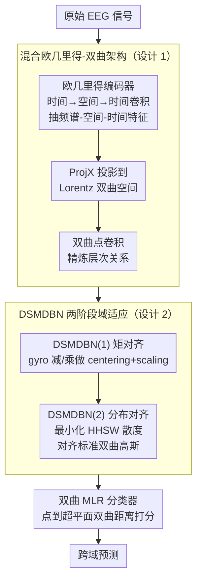

# HEEGNet: Hyperbolic Embeddings for EEG

**会议**: ICLR 2026  
**arXiv**: [2601.03322](https://arxiv.org/abs/2601.03322)  
**代码**: [GitHub](https://github.com/fightlesliefigt/HEEGNet)  
**领域**: 脑机接口/几何深度学习  
**关键词**: EEG, 双曲空间, 域适应, 层次结构, 脑机接口

## 一句话总结
首次系统验证EEG数据具有双曲性（层次结构），提出HEEGNet混合双曲网络架构，结合欧几里得编码器提取时空频谱特征和双曲编码器捕捉层次关系，配合创新的粗到细域适应策略(DSMDBN)，在视觉诱发电位、情感识别和颅内EEG多个跨域任务上达到SOTA。

## 研究背景与动机

**领域现状**：EEG脑机接口因被试间/会话间分布偏移导致泛化差。域适应方法（矩对齐）是当前SOTA，但在大偏移下失效。EEG解码几乎完全基于欧几里得嵌入。

**现有痛点**：(1) 大脑的视觉处理、情感调节等认知过程具有层次结构，但欧几里得空间难以高效表示层次数据——圆的周长线性增长而树节点数指数增长；(2) 仅做矩对齐无法保证正迁移，特别在大域偏移下。

**核心矛盾**：EEG特征的层次结构→需要指数级表达力→欧几里得空间不够→但双曲神经网络还未被系统探索用于EEG。

**切入角度**：先验研究发现EEG具有双曲性（$\delta_{rel}$低），双曲MLR替换欧几里得MLR就能提升跨域性能→证明双曲嵌入确实有助于EEG泛化。

**核心 idea**：用双曲空间捕捉EEG的层次结构+两阶段域适应(矩对齐→分布对齐)实现跨域泛化。

## 方法详解

### 整体框架

HEEGNet 要解决的是 EEG 跨域泛化：既要捕捉认知过程天然的层次结构，又要抹平被试/会话间的分布偏移。它的做法是把信号处理和几何表达拆给两套空间——先用一个欧几里得编码器（时间→空间→时间卷积）从原始 EEG 里抽出频谱-空间-时间特征，再用 ProjX 把这些特征投影到 Lorentz 双曲空间，在双曲空间里做卷积来精炼层次关系，中间穿插 DSMDBN 两阶段域适应消除域偏移，最后由双曲 MLR 分类器输出预测。

### 关键设计

**1. 混合欧几里得-双曲架构：让信号处理和层次表达各司其职**

纯双曲网络会丢掉 EEG 解码里宝贵的信号处理先验，纯欧几里得又表达不了层次结构（圆的周长线性增长，而树节点数指数增长，欧氏空间塞不下指数级的层次）。HEEGNet 因此分两段：前段是 3 层 EEGNet 风格的卷积，做频谱-空间-时间特征提取，这部分有明确的神经生理学解释；随后用 ProjX 把特征投影到 Lorentz 模型 $\mathbb{L}_K^n$，在双曲空间里做点卷积。前段负责把信号变成有意义的特征，后段负责在指数级表达力的空间里组织这些特征的层次关系，两者取各自所长。

**2. DSMDBN：粗到细的两阶段域适应**

只做矩对齐（当前 SOTA 的做法）在大域偏移下会失效，所以 DSMDBN 在矩对齐之上再加一层分布对齐。第一阶段 DSMDBN(1) 用 Riemannian 批归一化做域特异的矩对齐——双曲空间里的 centering 用 gyro 减法实现、scaling 用 gyro 乘法实现，把各域的均值和尺度先拉到一起。第二阶段 DSMDBN(2) 再最小化 HHSW 散度，把每个源域的分布对齐到标准双曲高斯 $\mathcal{N}(\bar{0}, 1)$。先对齐矩、再对齐整体分布形状，正是「粗到细」：前者拉近一阶/二阶统计量，后者提供更强的分布对齐理论保证。

**3. Lorentz 模型上的双曲算子：支撑前两个设计的几何工具箱**

整套网络在双曲空间里的运算都建立在 Lorentz 模型的 gyro 代数上：双曲加法（gyroaddition）、标量乘法（gyromultiplication）和逆元（gyroinverse）替代欧氏空间的对应操作，Fréchet 均值与方差在 Lorentz 模型上重新定义（DSMDBN 的 centering/scaling 就依赖它们），而双曲 MLR 则利用点到超平面的双曲距离来做分类。值得注意的是，先验研究发现仅把分类头的欧氏 MLR 替换成双曲 MLR 就能在所有数据集上提升跨域性能，说明这套几何工具本身确实更契合 EEG 的层次结构。

### 损失函数 / 训练策略

- 总损失 = 分类 loss + HHSW 分布对齐 loss
- 域特异动量批归一化：训练时用衰减动量更新统计量，测试时固定动量
- 用 Riemannian Adam 优化器在流形上做参数更新

## 实验关键数据

### 先验研究

| 数据集 | $\delta_{rel}$原始EEG | $\delta_{rel}$嵌入层 | 说明 |
|--------|---------------------|---------------------|------|
| Nakanishi | 低 | 低 | 视觉 |
| Wang | 低 | 低 | 视觉 |
| Seed | 低 | 低 | 情感 |
| Faced | 低 | 低 | 情感 |
| Boran | 低 | 低 | 颅内 |

→ 所有数据集都展示低 $\delta_{rel}$，确认EEG的双曲性。

### 主实验
跨被试/跨会话适应：

| 方法 | 视觉EEG | 情感EEG | 颅内EEG | 平均 |
|------|---------|---------|---------|------|
| EEGNet | 基线 | 基线 | 基线 | 基线 |
| EEGNet+HMLR | ↑ | ↑ | ↑ | 稳定提升 |
| HEEGNet | **SOTA** | **SOTA** | **SOTA** | **全面最优** |

### 关键发现
- 仅把MLR换成双曲MLR就能在所有数据集上提升→双曲几何确实更适合EEG
- t-SNE可视化显示双曲嵌入的类别分离性明显优于欧几里得
- DSMDBN的两阶段策略比仅矩对齐有显著提升
- 在运动想象数据集（不报告层次性）上也有提升→可能存在未被识别的层次结构

## 亮点与洞察
- **首次系统验证EEG的双曲性**：$\delta_{rel}$ 量化分析+多数据集验证，为这个方向提供了坚实的实证基础。
- **混合架构的合理性**：不是纯双曲（那样会丢失信号处理先验），而是先用欧几里得提取有意义的特征再映射到双曲空间——这是值得其他领域借鉴的设计哲学。
- **DSMDBN的粗到细**：矩对齐→分布对齐是一个自然的两步策略，前者拉近均值和尺度，后者对齐整体形状。

## 局限与展望
- 双曲操作计算开销比欧几里得大（指数/对数映射），对实时BCI有影响
- 曲率K作为超参数需要调优，自适应曲率学习可能更好
- HHSW在高维可能需要大量投影方向才准确
- 颅内EEG各被试电极数不同，限制了跨被试的实验设置

## 相关工作与启发
- **vs EEGNet**: HEEGNet在EEGNet基础上增加双曲层和DSMDBN，全面提升
- **vs Chang等人的双曲EEG**: 他们只做对比学习预训练，HEEGNet设计了完整的架构+域适应方案
- **vs SPDNet等Riemannian方法**: SPDNet在协方差矩阵流形上操作，HEEGNet在双曲空间操作，关注不同几何结构

## 评分
- 新颖性: ⭐⭐⭐⭐⭐ EEG双曲性的系统论证+混合双曲架构都是首次
- 实验充分度: ⭐⭐⭐⭐⭐ 先验研究→多数据集→多任务→消融全面
- 写作质量: ⭐⭐⭐⭐ 背景知识介绍充分，方法描述清晰
- 价值: ⭐⭐⭐⭐ 为EEG解码引入新的几何视角，开辟双曲EEG方向

<!-- RELATED:START -->

## 相关论文

- [\[ICML 2026\] EEG-Based Multimodal Learning via Hyperbolic Mixture-of-Curvature Experts](../../ICML2026/medical_imaging/eeg-based_multimodal_learning_via_hyperbolic_mixture-of-curvature_experts.md)
- [\[ICLR 2026\] Autoregressive Visual Decoding from EEG Signals](autoregressive_visual_decoding_from_eeg_signals.md)
- [\[ICLR 2026\] Modeling the Density of Pixel-level Self-supervised Embeddings for Unsupervised Pathology Segmentation in Medical CT](modeling_the_density_of_pixel-level_self-supervised_embeddings_for_unsupervised_.md)
- [\[CVPR 2026\] H2-Surv: Hierarchical Hyperbolic Multimodal Representation Learning for Survival Prediction](../../CVPR2026/medical_imaging/h2-surv_hierarchical_hyperbolic_multimodal_representation_learning_for_survival_.md)
- [\[ICLR 2026\] ODEBRAIN: Continuous-Time EEG Graph for Modeling Dynamic Brain Networks](odebrain_continuous-time_eeg_graph_for_modeling_dynamic_brain_networks.md)

<!-- RELATED:END -->
